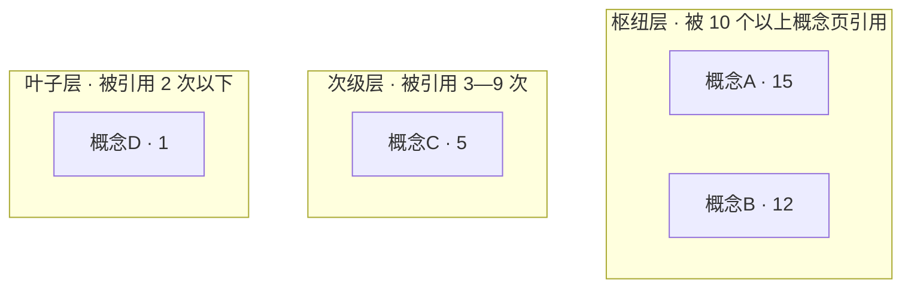

# 全面概念挖掘方案研究

**研究时间**: 2026-09-28  
**目标**: 评估对 dacapo-学习仓库进行全面概念挖掘的可行性

---

## 一、现有资产

### 1. 数据资产

```
user-feedback/
├── user-utterances.jsonl              875K - 用户原话与反馈
├── readwise-evidence-revision-history.jsonl  1.4M - Readwise 证据修订历史
├── readwise-provenance-assessments.jsonl     190K - 溯源评估
├── verbatim-source-spans.jsonl        92K - 逐字引用片段
└── legacy-response-candidates.jsonl   94K - 历史响应候选
```

### 2. 工具资产

```
scripts/
├── build_evidence_atoms.py          51K - 构建证据原子（从用户反馈提取）
├── concept_graph.py                 4.5K - 生成概念图谱（Mermaid 分层图）
├── extract_marked_user_responses.py 40K - 提取标记的用户响应
├── provenance.py                    18K - 溯源工具
└── extract_course_concepts.py       6.6K - 课程概念化（已用）
```

### 3. 已完成的概念化

- **课程概念**: 47 个课程 → 47 个课程概念文件（`concepts/*.md`）
- **格式**: frontmatter + 简介 + 章节列表

---

## 二、可以做的概念挖掘

### 方案 A: 从用户反馈提取概念（证据原子）

**工具**: `build_evidence_atoms.py`

**原理**:
- 从 `user-utterances.jsonl` (875K) 提取用户的学习信号
- 识别 Feynman 回答、检查点回答等高质量反馈
- 构建"证据原子"（Evidence Atoms）- 可验证的学习证据
- 评估溯源、归属、质量

**输出**:
```
05-证据原子/
├── evidence-atoms.jsonl           # 所有证据原子
├── feynman-evidence-atoms.jsonl   # Feynman 类证据
└── 证据原子索引.md                # 索引文档
```

**价值**:
- 从用户真实学习过程中提取概念
- 识别哪些概念被学习者真正掌握
- 建立概念 ↔ 学习证据的映射

---

### 方案 B: 构建概念图谱（关系网络）

**工具**: `concept_graph.py`

**原理**:
- 扫描所有概念文件中的 WikiLink `[[概念名]]`
- 统计每个概念被引用的次数（入度）
- 生成分层图谱（枢纽层、次级层、叶子层）

**输出**:


**价值**:
- 识别核心概念（枢纽）vs 边缘概念（叶子）
- 可视化概念网络结构
- 指导学习路径（从枢纽概念开始）

---

### 方案 C: 从课程内容提取细粒度概念

**当前状态**: 只有 47 个"课程级概念"（粗粒度）

**可以做**:
- 扫描每个课程的所有章节（282 个章节文件）
- 提取章节中的关键概念（标题、加粗文字、定义）
- 生成细粒度概念库

**示例**:
```
现在: [[Agentic Engineering 工作流]] (1 个课程概念)

细化后:
├── [[Agent 控制权迁移]]
├── [[Loop 模式]]
├── [[Prompt 工程局限性]]
├── [[多 Agent 编排]]
└── ...
```

**价值**:
- 从 47 个粗概念 → 数百个细概念
- 可以精确定位学习内容
- dacapo-wiki 查询更精准

---

### 方案 D: 综合方案（全面挖掘）

**执行顺序**:

1. **第一步: 构建证据原子**
   ```bash
   python3 scripts/build_evidence_atoms.py
   ```
   - 输出: `05-证据原子/evidence-atoms.jsonl`
   - 时间: 约 5-10 分钟
   - 风险: 低（只读操作）

2. **第二步: 提取细粒度概念**
   - 新脚本: `extract_chapter_concepts.py`
   - 扫描 282 个章节文件
   - 提取标题、定义、关键术语
   - 输出: `concepts/细粒度/` 目录
   - 时间: 约 10-20 分钟

3. **第三步: 构建概念图谱**
   ```bash
   python3 scripts/concept_graph.py --root concepts/
   ```
   - 输出: `concepts/GRAPH.md` (Mermaid 图谱)
   - 时间: < 1 分钟
   - 风险: 低（只读 + 写 1 个文件）

4. **第四步: 生成统一索引**
   - 整合课程概念 + 细粒度概念 + 证据原子
   - 输出: `CONCEPT-INDEX.md`

---

## 三、预期成果

### 成果 1: 证据原子库
```
05-证据原子/
├── evidence-atoms.jsonl           # 用户学习证据
├── feynman-evidence-atoms.jsonl   # 高质量反馈
└── 证据原子索引.md
```

### 成果 2: 多层次概念库
```
concepts/
├── 课程级/                 # 47 个（已有）
├── 细粒度/                 # 数百个（新增）
├── GRAPH.md                # 概念图谱
└── INDEX.md                # 统一索引
```

### 成果 3: 概念 ↔ 证据映射
- 每个概念关联的学习证据
- 哪些概念被学习者真正掌握
- 哪些概念需要补充教学

---

## 四、风险评估

| 方案 | 时间成本 | 计算成本 | 数据风险 | 可恢复性 |
|------|---------|---------|---------|---------|
| 方案 A: 证据原子 | 5-10 min | 低（本地处理） | 无（只读） | N/A |
| 方案 B: 概念图谱 | < 1 min | 极低 | 无（只读） | 高 |
| 方案 C: 细粒度概念 | 10-20 min | 中（需 LLM） | 低（新增文件） | 高 |
| 方案 D: 综合 | 15-30 min | 中 | 低 | 高 |

---

## 五、待决策问题

### 问题 1: 执行哪个方案？
- [ ] **方案 A**: 只构建证据原子（用户反馈 → 概念）
- [ ] **方案 B**: 只构建概念图谱（概念关系可视化）
- [ ] **方案 C**: 只提取细粒度概念（课程 → 细概念）
- [ ] **方案 D**: 综合执行全部（推荐）

### 问题 2: 是否需要 LLM？
- [ ] **需要**: 方案 C（细粒度概念提取）需要 LLM 理解章节内容
- [ ] **不需要**: 方案 A 和 B 是纯规则处理，无需 LLM

### 问题 3: 概念存放位置？
- [ ] **选项 1**: 放在 `concepts/` 下分类（课程级、细粒度）
- [ ] **选项 2**: 放在单独的 `knowledge-graph/` 目录
- [ ] **选项 3**: 维持现状，只做方案 A 和 B（不扩充概念库）

### 问题 4: 输出格式？
- [ ] **Markdown**: 人类可读，便于编辑
- [ ] **JSONL**: 机器可读，便于程序处理
- [ ] **两者都要**: Markdown 索引 + JSONL 数据

---

## 六、推荐方案

**快速验证方案**（推荐先试）:
1. ✅ 执行方案 A（构建证据原子）- 5 分钟
2. ✅ 执行方案 B（生成概念图谱）- 1 分钟
3. ❓ 看效果，决定是否做方案 C（细粒度概念）

**理由**:
- 方案 A + B 都是现成工具，低风险
- 快速看到全面挖掘的效果
- 方案 C 需要写新脚本，先验证 A+B 的价值

---

**请决策**：
1. 是否同意先执行"快速验证方案"（A + B）？
2. 如果 A + B 效果好，是否继续做方案 C（细粒度概念）？
3. 概念存放在哪里？（concepts/ 分类 / knowledge-graph/ / 维持现状）
