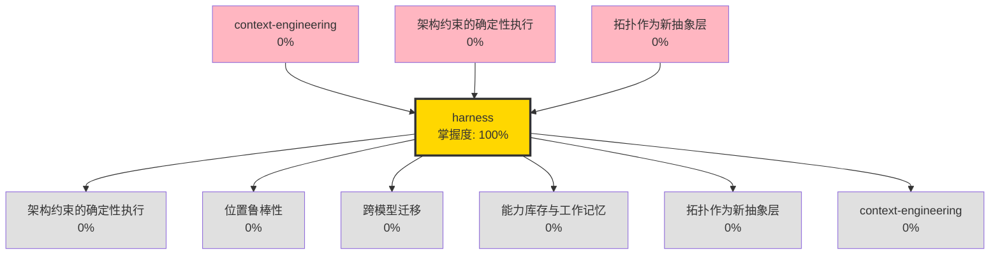

# 🎉 完成学习：harness

---

## 📊 学习进度

- **已掌握概念**: 1 个
- **平均掌握度**: 100.0%
- **知识网络**: 189 条关联
- **复利指数**: 0.0

---

## 🔓 解锁新概念

暂无新概念解锁

---

## 🕸️ 关联网络

---

## 💡 应用建议

基于你的学习特征，建议下一步：

1. 如果想深入机制层，可以学习解锁的新概念
2. 如果想横向展开，可以查看相关应用案例
3. 如果想验证理解，可以尝试用自己的话解释给别人
