# 🎉 完成学习：差序格局

---

## 📊 学习进度

- **已掌握概念**: 11 个
- **平均掌握度**: 65.8%
- **知识网络**: 243 条关联
- **复利指数**: 1599.7

---

## 🔓 解锁新概念

✨ 恭喜！你已经可以理解这些概念了：

- **现代长老** - 所有前置概念已掌握
- **人情期货** - 所有前置概念已掌握
- **差序格局** - 所有前置概念已掌握
- **面子估值** - 所有前置概念已掌握
- **承认政治** - 所有前置概念已掌握
- **理性化铁笼** - 所有前置概念已掌握
- **人性三分法** - 所有前置概念已掌握
- **先赋vs自致** - 所有前置概念已掌握
- **铁笼囚徒困境** - 所有前置概念已掌握
- **礼治秩序** - 所有前置概念已掌握
- **公私界碑** - 所有前置概念已掌握
- **社会分层** - 所有前置概念已掌握
- **彩礼异化** - 所有前置概念已掌握
- **社会学想象力** - 所有前置概念已掌握
- **结构紧张** - 所有前置概念已掌握
- **承认与狂热** - 所有前置概念已掌握
- **婚礼产品发布会** - 所有前置概念已掌握
- **再生产** - 所有前置概念已掌握

---

## 🕸️ 关联网络

```mermaid
graph TD
    CENTER["差序格局\n掌握度: 100%"]
    style CENTER fill:#ffd700,stroke:#333,stroke-width:3px
    DEP_差序格局["差序格局\n100%"]
    style DEP_差序格局 fill:#90EE90
    DEP_差序格局 --> CENTER
    DEP_礼治秩序["礼治秩序\n90%"]
    style DEP_礼治秩序 fill:#90EE90
    DEP_礼治秩序 --> CENTER
    DEP_社会分层["社会分层\n70%"]
    style DEP_社会分层 fill:#90EE90
    DEP_社会分层 --> CENTER
    POST_现代长老["现代长老\n80%"]
    style POST_现代长老 fill:#90EE90
    CENTER --> POST_现代长老
    POST_人情期货["人情期货\n90%"]
    style POST_人情期货 fill:#90EE90
    CENTER --> POST_人情期货
    POST_差序格局["差序格局\n100%"]
    style POST_差序格局 fill:#90EE90
    CENTER --> POST_差序格局
    POST_面子估值["面子估值\n85%"]
    style POST_面子估值 fill:#90EE90
    CENTER --> POST_面子估值
    POST_承认政治["承认政治\n65%"]
    style POST_承认政治 fill:#90EE90
    CENTER --> POST_承认政治
    POST_理性化铁笼["理性化铁笼\n65%"]
    style POST_理性化铁笼 fill:#90EE90
    CENTER --> POST_理性化铁笼
    POST_人性三分法["人性三分法\n40%"]
    style POST_人性三分法 fill:#E0E0E0
    CENTER --> POST_人性三分法
    POST_先赋vs自致["先赋vs自致\n60%"]
    style POST_先赋vs自致 fill:#90EE90
    CENTER --> POST_先赋vs自致
    POST_铁笼囚徒困境["铁笼囚徒困境\n60%"]
    style POST_铁笼囚徒困境 fill:#90EE90
    CENTER --> POST_铁笼囚徒困境
    POST_礼治秩序["礼治秩序\n90%"]
    style POST_礼治秩序 fill:#90EE90
    CENTER --> POST_礼治秩序
    POST_公私界碑["公私界碑\n55%"]
    style POST_公私界碑 fill:#E0E0E0
    CENTER --> POST_公私界碑
    POST_社会分层["社会分层\n70%"]
    style POST_社会分层 fill:#90EE90
    CENTER --> POST_社会分层
    POST_彩礼异化["彩礼异化\n55%"]
    style POST_彩礼异化 fill:#E0E0E0
    CENTER --> POST_彩礼异化
    POST_社会学想象力["社会学想象力\n75%"]
    style POST_社会学想象力 fill:#90EE90
    CENTER --> POST_社会学想象力
    POST_结构紧张["结构紧张\n50%"]
    style POST_结构紧张 fill:#E0E0E0
    CENTER --> POST_结构紧张
    POST_承认与狂热["承认与狂热\n50%"]
    style POST_承认与狂热 fill:#E0E0E0
    CENTER --> POST_承认与狂热
    POST_婚礼产品发布会["婚礼产品发布会\n50%"]
    style POST_婚礼产品发布会 fill:#E0E0E0
    CENTER --> POST_婚礼产品发布会
    POST_再生产["再生产\n45%"]
    style POST_再生产 fill:#E0E0E0
    CENTER --> POST_再生产
```

---

## 💡 应用建议

基于你的学习特征，建议下一步：

1. 如果想深入机制层，可以学习解锁的新概念
2. 如果想横向展开，可以查看相关应用案例
3. 如果想验证理解，可以尝试用自己的话解释给别人
