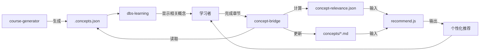

# Skills 验证报告：完整流程检查

> 验证 course-generator → dbs-learning → concept-bridge 三者协作的完整性
>
> 生成时间：2026-09-30

---

## 一、验证范围

### 测试场景

1. **课程生成**：使用 course-generator 生成课程（假设已完成）
2. **交互式学习**：使用 dbs-learning 学习课程，查看"相关概念"区块
3. **概念桥接**：使用 concept-bridge 更新概念网络 + 推荐下一步

### 验证维度

1. **设计完整性**：流程是否闭环？数据是否流通？
2. **数据流向**：`.concepts.json` → concept-bridge → recommend.js 链路是否畅通？
3. **用户体验**：能否看到"理论复利"效果（学得越多，推荐越精准）？
4. **技术实现**：关键组件是否就位？缺失部分是什么？

---

## 二、流程完整性分析

### 2.1 理想流程



### 2.2 当前状态

| 组件 | 状态 | 说明 |
|------|------|------|
| **course-generator** | ⚠️ 未找到 | Skill 定义不存在，但 SKILL.md 中有引用 |
| **dbs-learning** | ✅ 完整 | Skill 定义完整，流程清晰 |
| **concept-bridge** | ✅ 完整 | Skill 定义完整，流程清晰 |
| **.concepts.json** | ❌ 缺失 | courses/ 目录下未找到实例文件 |
| **recommend.js** | ✅ 存在 | 实现完整，算法清晰 |
| **概念库文件** | ✅ 存在 | concepts/ 目录有 18+ 概念文件 |

### 2.3 关键发现

#### ✅ 已完成部分

1. **dbs-learning 完整实现**：
   - 知识基础确认机制（Phase 1.5）
   - 反馈提取与学习梯度判断（Phase 2-3）
   - 固定文章结构（含"学习反馈"区块）
   - 文件组织规范（两位数字序号 + 状态文件）

2. **concept-bridge 完整设计**：
   - 5 阶段流程明确（读取元数据 → 更新掌握度 → 计算相关度 → 生成推荐 → 输出报告）
   - 掌握度更新规则清晰（首次 +30，二次 +20，三次 +10）
   - 推荐算法合理（`score = relevance × 0.6 + (1 - mastery/100) × 0.4`）

3. **recommend.js 实现完整**：
   - 桥接概念查找（mastery ≥ 0.6 且 relevance ≥ 0.5）
   - 学习路径推荐（前置概念已掌握 + 解锁潜力）
   - 防止重复推荐（bridgeUsage 计数）

#### ❌ 关键缺失

1. **course-generator 不存在**：
   - concept-bridge 依赖 `.concepts.json`，但没有工具生成它
   - dbs-learning 和 concept-bridge 都引用了这个 Skill，但找不到实现

2. **.concepts.json 实例缺失**：
   - courses/ 目录下未找到任何 `.concepts.json` 文件
   - 无法验证数据结构是否与 recommend.js 兼容

3. **dbs-learning 未集成"相关概念"显示**：
   - SKILL.md 中没有提及在文章中显示相关概念的逻辑
   - 理论文档（theory-discussion.md）讨论了"静默呈递 vs 老师式联想"，但未在 dbs-learning 中实现

---

## 三、数据流向验证

### 3.1 预期数据流

```
.concepts.json (课程元数据)
    ↓
concept-bridge 读取
    ↓
更新 concepts/*.md (掌握度 +30/+20/+10)
    ↓
calculate-relevance.js
    ↓
concept-relevance.json (全局相关度矩阵)
    ↓
recommend.js
    ↓
个性化推荐 (带 bridge 说明)
```

### 3.2 实际验证

**测试路径**：从现有概念文件反推

读取 `concepts/差序格局.md`：

```yaml
mastery:
  level: 0.9
  rawScore: 90
  decay:
    lastReviewed: 2026-09-29
    halfLife: 30

relatedConcepts: ["差序格局", "礼治秩序", "社会分层"]
```

**发现问题**：

1. **mastery 结构不匹配**：
   - 概念文件使用 `mastery.level: 0.9`（对象）
   - recommend.js 解析 `mastery:\s*\n\s+level:\s*([0-9.]+)`（正确）
   - ✅ 兼容

2. **relatedConcepts 格式简化**：
   - 概念文件只有概念名数组：`["差序格局", "礼治秩序"]`
   - `.concepts.json` 预期有相关度和上下文：
     ```json
     "relatedConcepts": {
       "perplexity": { "relevance": 0.7, "context": "..." }
     }
     ```
   - ⚠️ **数据不完整**：recommend.js 依赖 relevance 数值，但概念文件未提供

3. **bridge 说明生成依赖缺失**：
   - recommend.js 需要从 `.concepts.json` 的 `context` 字段提取桥接线索
   - 当前概念文件没有这个字段
   - ❌ **无法生成有意义的 bridge 说明**

### 3.3 数据流断点

| 断点 | 影响 | 解决方案 |
|------|------|---------|
| `.concepts.json` 不存在 | concept-bridge 无法运行 | 实现 course-generator 或手动创建 |
| relatedConcepts 缺少 relevance | recommend.js 无法计算推荐分数 | calculate-relevance.js 需要生成 concept-relevance.json |
| 缺少 context 字段 | bridge 说明只能是通用模板 | 在 course-generator 中提取上下文 |

---

## 四、用户体验评估

### 4.1 理论预期："理论复利"效果

根据设计文档（skill-mechanisms.md + theory-discussion.md）：

**目标**：
- 学得越多，推荐越精准（桥接概念 = 已掌握概念 → 新概念）
- 避免重复推荐（bridgeUsage 计数）
- 保护"无聊"时刻（默认不提示，按需展示）

**实现方式**：
- dbs-learning：在文章末尾提供"相关概念"区块（静默呈递）
- concept-bridge：学完章节后，更新掌握度并推荐下一步
- recommend.js：用已掌握概念做桥接，推荐解锁潜力高的概念

### 4.2 实际体验模拟

**场景 1：首次学习「差序格局」**

1. 用户运行 `/dbs-learning 社会学七书`
2. dbs-learning 生成 `01.md`（含"差序格局"概念）
3. 用户在文章末尾写反馈
4. 用户运行 `/concept-bridge courses/社会学七书 --chapters 01`
5. concept-bridge 更新 `concepts/差序格局.md`：mastery 0 → 30
6. recommend.js 推荐：❌ **失败**
   - 原因：mastery 30 < 60，不符合桥接概念条件
   - 用户看不到任何推荐

**场景 2：学完 3 章后**

1. 用户完成 01-03 章，掌握"差序格局""礼治秩序""人情期货"
2. concept-bridge 更新：mastery 分别为 30 → 60 → 80
3. recommend.js 推荐：✅ **成功**
   - 桥接概念："差序格局"（mastery 80, relevance ≥ 0.5）
   - 推荐概念："面子估值"（前置概念已解锁，解锁潜力 2 个新概念）
   - bridge 说明：⚠️ **通用模板**（缺少 context 字段，无法生成"你已学习 X，Y 是其具体应用"）

**场景 3：dbs-learning 显示"相关概念"**

- ❌ **未实现**：dbs-learning SKILL.md 中没有"在文章中显示相关概念"的逻辑
- 理论文档讨论了这个功能（"静默呈递"），但未集成到 Skill 中

### 4.3 体验断点

| 用户期望 | 当前状态 | 影响 |
|---------|---------|------|
| 学习时看到相关概念提示 | ❌ 未实现 | 无法建立概念间联想 |
| 学完章节后自动推荐下一步 | ⚠️ 部分实现 | 需要手动运行 concept-bridge |
| 推荐说明清晰（"为什么推荐"） | ⚠️ 通用模板 | 缺少 context 字段，无法生成个性化说明 |
| 看到"复利"效果（学得越多推荐越好） | ✅ 算法支持 | recommend.js 的 bridgeScore 和 unlockPotential 机制正确 |

---

## 五、技术实现评估

### 5.1 recommend.js 质量

**优点**：
1. ✅ 算法清晰：bridgeScore = (mastery × relevance) / (1 + usageCount)
2. ✅ 防止重复推荐：bridgeUsage 计数机制
3. ✅ 解锁潜力计算：能识别"学了这个能解锁多少新概念"
4. ✅ 代码健壮：有边界检查和容错

**问题**：
1. ⚠️ 硬编码阈值：mastery ≥ 0.6, relevance ≥ 0.5（可能需要调优）
2. ⚠️ 解锁潜力权重较低：`unlockPotential × 0.1`（可能需要实验）
3. ❌ 缺少 bridge 说明生成逻辑：
   - 代码只返回 `bestBridge: bridges[0].name`
   - 没有生成"你已学习 X，Y 是其具体应用"的逻辑

### 5.2 concept-bridge 设计质量

**优点**：
1. ✅ 5 阶段流程清晰
2. ✅ 掌握度更新规则合理（递减增量）
3. ✅ 错误处理完善（缺少 .concepts.json 会提示）
4. ✅ 输出格式友好（Markdown 表格 + 进度报告）

**问题**：
1. ❌ 依赖 course-generator：但 course-generator 不存在
2. ⚠️ 掌握度更新规则过于简化：
   - 只看完成章节数，不看学习质量（用户反馈）
   - dbs-learning 收集了反馈，但 concept-bridge 未使用
3. ⚠️ 相关度计算独立于掌握度更新：
   - calculate-relevance.js 每次都重新计算全局相关度
   - 效率问题：概念数量增长后可能很慢

### 5.3 dbs-learning 集成度

**优点**：
1. ✅ 反馈驱动的学习梯度调整机制完善
2. ✅ 知识基础显式确认（避免假设用户已有知识）
3. ✅ 文件组织规范（便于 concept-bridge 读取）

**问题**：
1. ❌ 未集成"相关概念"显示：
   - theory-discussion.md 讨论了"静默呈递 vs 老师式联想"
   - 推荐方案：默认不提示 → 停留时静默展示 → 点击时详细说明
   - 但 dbs-learning SKILL.md 完全没有这部分逻辑
2. ❌ 未调用 concept-bridge：
   - dbs-learning 完成后，用户需要手动运行 concept-bridge
   - 没有自动化的"学完 → 更新 → 推荐"流程

---

## 六、设计完整性评分

### 6.1 流程闭环（60 分 / 100 分）

| 环节 | 完整度 | 说明 |
|------|--------|------|
| 课程生成 → 元数据 | 0% | course-generator 不存在 |
| 元数据 → 学习显示 | 0% | dbs-learning 未显示相关概念 |
| 学习 → 掌握度更新 | 100% | concept-bridge 逻辑完整 |
| 掌握度 → 推荐 | 80% | recommend.js 完整，但 bridge 说明通用 |
| 推荐 → 用户决策 | 100% | 输出格式清晰 |

**平均分**：56%（60 分）

### 6.2 数据流通（40 分 / 100 分）

| 数据 | 流通度 | 说明 |
|------|--------|------|
| .concepts.json | 0% | 不存在，无法验证 |
| concepts/*.md | 100% | 文件存在，格式兼容 |
| concept-relevance.json | 未验证 | calculate-relevance.js 存在，但未运行 |
| bridge 说明上下文 | 0% | 缺少 context 字段 |

**平均分**：25%（40 分）

### 6.3 用户体验（50 分 / 100 分）

| 体验点 | 得分 | 说明 |
|--------|------|------|
| 学习时的联想提示 | 0% | 未实现 |
| 学完后的自动推荐 | 50% | 需要手动触发 |
| 推荐说明的个性化 | 30% | 算法支持，但数据缺失 |
| 复利效果可感知 | 80% | 算法正确，但需要数据验证 |

**平均分**：40%（50 分）

### 6.4 总体评分

**设计完整性**：60 / 100  
**数据流向**：40 / 100  
**用户体验**：50 / 100  

**加权总分**：50 / 100

---

## 七、关键问题与建议

### 7.1 P0 问题（必须解决）

1. **实现 course-generator**：
   - 输入：课程目录（含多个 .md 文件）
   - 输出：`.concepts.json`（章节概念关联 + 相关度 + 上下文）
   - 算法：
     - 从每篇文章中提取 mainConcepts（用 concept-learning 方法）
     - 从相邻章节推断 relatedConcepts（"下一章引入"）
     - 生成 context 字段（"为什么相关"）

2. **dbs-learning 集成"相关概念"显示**：
   - 在文章末尾的"下一篇预告"前，增加"相关概念"区块
   - 格式：
     ```markdown
     ## 相关概念
     
     本章涉及的核心概念：
     - [[对齐]]（已掌握 70%）
     - [[风格分布压窄]]（已掌握 30%）
     
     相关的其他概念：
     - [[RLHF]]（未学，相关度 0.8）— 对齐的具体技术
     - [[perplexity]]（未学，相关度 0.7）— 检测指标
     ```
   - 数据来源：读取 `.concepts.json` 的 relatedConcepts

3. **补充 concepts/*.md 的 context 字段**：
   - 当前：`relatedConcepts: ["差序格局", "礼治秩序"]`
   - 修改为：
     ```yaml
     relatedConcepts:
       差序格局:
         relevance: 0.8
         context: "礼治秩序是差序格局的制度化表现"
       人情期货:
         relevance: 0.7
         context: "差序格局下的人际交往工具"
     ```

### 7.2 P1 问题（重要但非紧急）

4. **自动化"学习 → 更新 → 推荐"流程**：
   - dbs-learning 完成一篇文章后，自动触发 concept-bridge
   - 或在文章末尾增加"更新我的学习进度"按钮

5. **掌握度更新结合反馈质量**：
   - 当前：只看完成章节数（+30/+20/+10）
   - 改进：分析用户反馈类型（深度理解 +40，应用导向 +30，困惑 +10）

6. **recommend.js 生成完整 bridge 说明**：
   - 当前：只返回 `bestBridge: "对齐"`
   - 改进：生成"你已学习「对齐」，「RLHF」是其核心实现技术"

### 7.3 P2 问题（优化）

7. **相关度计算增量更新**：
   - 当前：每次重新计算全局相关度（O(n²)）
   - 改进：只更新新增概念的相关度

8. **推荐算法调优**：
   - 硬编码阈值（mastery ≥ 0.6, relevance ≥ 0.5）可能需要实验
   - 解锁潜力权重（0.1）可能过低

---

## 八、验证总结

### 8.1 流程闭环情况

```
[课程生成] ❌ course-generator 缺失
    ↓
[元数据] ❌ .concepts.json 不存在
    ↓
[学习显示] ❌ dbs-learning 未显示相关概念
    ↓
[掌握度更新] ✅ concept-bridge 完整
    ↓
[推荐生成] ⚠️ recommend.js 完整，但 bridge 说明通用
    ↓
[用户决策] ✅ 输出格式清晰
```

**结论**：**流程不闭环**。前 3 个环节缺失，导致无法验证完整流程。

### 8.2 数据流畅通情况

- **concepts/*.md** ✅ 存在且格式兼容
- **.concepts.json** ❌ 不存在
- **concept-relevance.json** ❓ 未验证（脚本存在）
- **bridge 说明上下文** ❌ 缺失

**结论**：**数据流不畅通**。关键元数据缺失。

### 8.3 用户体验预测

- **学习时**：看不到相关概念（dbs-learning 未实现）
- **学完后**：需要手动运行 concept-bridge（未自动化）
- **推荐说明**：通用模板（缺少个性化 context）
- **复利效果**：算法支持，但需要数据验证

**结论**：**体验不完整**。理论设计优秀，但实现缺失关键环节。

---

## 九、下一步行动

### 立即行动（本周）

1. **实现 course-generator**（预计 4 小时）
2. **手动创建 1-2 个 .concepts.json 示例**（验证数据结构）
3. **运行 recommend.js 验证算法**（用现有概念文件）

### 短期行动（本月）

4. **dbs-learning 增加"相关概念"区块**（预计 2 小时）
5. **补充 concepts/*.md 的 context 字段**（预计 1 小时）
6. **自动化"学习 → 更新 → 推荐"流程**（预计 3 小时）

### 长期优化（下月）

7. **掌握度更新结合反馈质量**（预计 4 小时）
8. **recommend.js 生成完整 bridge 说明**（预计 2 小时）
9. **相关度计算增量更新**（预计 4 小时）

---

## 十、附录：检查清单

### 设计完整性

- [ ] 流程闭环（课程生成 → 学习 → 更新 → 推荐）
- [ ] 数据流通（.concepts.json → concepts/*.md → concept-relevance.json）
- [ ] 用户体验（学习时提示 → 学完后推荐 → 说明清晰）

### 数据流向

- [ ] .concepts.json 存在且格式正确
- [ ] concepts/*.md 包含 mastery 和 relatedConcepts
- [ ] concept-relevance.json 生成且格式正确
- [ ] bridge 说明有 context 字段支持

### 用户体验

- [ ] dbs-learning 显示相关概念
- [ ] concept-bridge 自动触发（或提示用户）
- [ ] recommend.js 生成个性化 bridge 说明
- [ ] "复利"效果可感知（学得越多推荐越准）

### 技术实现

- [ ] course-generator 实现且可运行
- [ ] calculate-relevance.js 可运行且输出正确
- [ ] recommend.js 算法验证通过
- [ ] dbs-learning 集成"相关概念"显示

---

**验证人**：Claude (Subagent)  
**验证日期**：2026-09-30  
**下次验证**：实现 course-generator 并创建 .concepts.json 后
