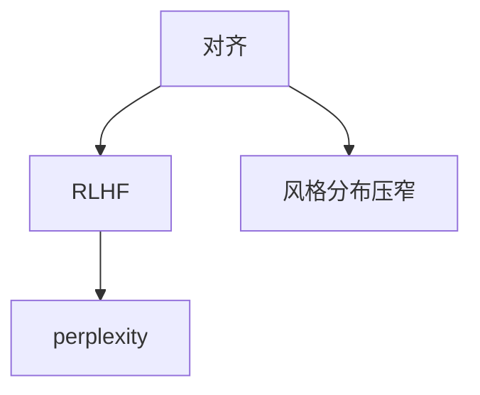

# .concepts.json 自动生成指南

## 一、生成时机

在阶段 3（生成 .concepts.json），所有章节文件（01.md, 02.md, ...）已生成后执行。

## 二、数据来源

### 来源 1：concept-learning 的产出（基于文章时）

如果输入是文章，已调用 `/concept-learning` 并得到：
- 核心概念列表（concept-learning 提取的）
- 概念架构图（Mermaid 格式）
- 概念关系（层级、依赖）

**读取方式**：
```bash
# concept-learning 的输出通常在临时文件或返回结果中
# 需要解析的内容：
# 1. 概念列表（带费曼解释）
# 2. 架构图（Mermaid 代码块）
```

### 来源 2：概念库（已有概念时）

查询路径：`/Users/housibo/Documents/dacapo-学习仓库/concepts/`

**查询方式**：
1. 读取概念文件的 frontmatter（`relatedConcepts` 字段）
2. 查询 `.learning-progress/concept-relevance.json`（如果存在）
3. 使用 `scripts/calculate-relevance.js` 计算相关度

## 三、生成算法

### 步骤 1：为每个章节提取 mainConcepts

**方法 A：从章节标题提取**
```javascript
// 读取章节文件
const chapterContent = fs.readFileSync('01.md', 'utf8');

// 提取标题中的概念（通常在 ## 这一篇要解决的问题）
const titleMatch = chapterContent.match(/## 这一篇要解决的问题\s*\n(.+)/);
const title = titleMatch ? titleMatch[1] : '';

// 从标题中匹配概念（与 concept-learning 提取的概念对比）
const mainConcepts = extractedConcepts.filter(concept => 
  title.includes(concept.name)
);
```

**方法 B：从首段提取**
```javascript
// 提取正文首段
const firstParagraphMatch = chapterContent.match(/## 正文\s*\n\n(.+?)\n\n/s);
const firstParagraph = firstParagraphMatch ? firstParagraphMatch[1] : '';

// 统计概念在首段出现次数
const conceptFrequency = {};
extractedConcepts.forEach(concept => {
  const regex = new RegExp(concept.name, 'g');
  const matches = firstParagraph.match(regex);
  conceptFrequency[concept.name] = matches ? matches.length : 0;
});

// 选取出现次数最多的 1-2 个
const mainConcepts = Object.entries(conceptFrequency)
  .sort((a, b) => b[1] - a[1])
  .slice(0, 2)
  .map(([name]) => name);
```

**推荐**：先用方法 A，如果标题中没有明确概念，再用方法 B。

### 步骤 2：查询 relatedConcepts

**方法 A：从 concept-learning 的架构图提取**

如果架构图是 Mermaid 格式：


解析规则：
```javascript
function parseArchitectureGraph(mermaidCode) {
  const lines = mermaidCode.split('\n').filter(line => line.includes('-->'));
  const relations = [];
  
  lines.forEach(line => {
    const match = line.match(/(\w+)\[(.+?)\]\s*-->\s*(\w+)\[(.+?)\]/);
    if (match) {
      const [, fromId, fromName, toId, toName] = match;
      relations.push({
        from: fromName,
        to: toName,
        type: 'direct', // 直接依赖
      });
    }
  });
  
  return relations;
}

// 对于章节的 mainConcept，找到所有相关概念
function findRelatedConcepts(mainConcept, relations) {
  const related = [];
  
  relations.forEach(rel => {
    if (rel.from === mainConcept) {
      related.push({ name: rel.to, relevance: 0.7, type: 'depends' });
    }
    if (rel.to === mainConcept) {
      related.push({ name: rel.from, relevance: 0.7, type: 'prerequisite' });
    }
  });
  
  return related;
}
```

**方法 B：从概念库查询**

```javascript
async function queryFromConceptLibrary(mainConcept) {
  // 1. 读取概念文件
  const conceptPath = `concepts/${mainConcept}.md`;
  if (!fs.existsSync(conceptPath)) return [];
  
  const content = fs.readFileSync(conceptPath, 'utf8');
  const frontmatter = parseFrontmatter(content);
  
  // 2. 提取 relatedConcepts
  const related = frontmatter.relatedConcepts || [];
  
  // 3. 查询相关度（如果有 concept-relevance.json）
  const relevanceFile = '.learning-progress/concept-relevance.json';
  if (fs.existsSync(relevanceFile)) {
    const relevanceData = JSON.parse(fs.readFileSync(relevanceFile, 'utf8'));
    
    return related.map(conceptName => {
      const edge = relevanceData.edges.find(e => 
        (e.source === mainConcept && e.target === conceptName) ||
        (e.source === conceptName && e.target === mainConcept)
      );
      
      return {
        name: conceptName,
        relevance: edge ? edge.relevance : 0.5,
      };
    }).filter(r => r.relevance > 0.5);
  }
  
  // 4. 如果没有 relevance 数据，默认 0.6
  return related.map(name => ({ name, relevance: 0.6 }));
}
```

### 步骤 3：生成 context 说明

**规则**：
- 同层概念（并列）：「都属于 XX 范畴」「同为 XX 的组成部分」
- 相邻层（依赖）：「下一章引入的 XX」「基于 XX 的扩展」
- 跨层（间接）：「与 XX 有间接关系」「XX 的实践应用」

**实现**：
```javascript
function generateContext(mainConcept, relatedConcept, relationType, chapterOrder) {
  // 判断是否在下一章
  const nextChapterConcepts = getMainConceptsOfNextChapter();
  if (nextChapterConcepts.includes(relatedConcept)) {
    return `下一章引入的${relatedConcept}`;
  }
  
  // 判断是否在上一章
  const prevChapterConcepts = getMainConceptsOfPrevChapter();
  if (prevChapterConcepts.includes(relatedConcept)) {
    return `上一章讲解的${relatedConcept}`;
  }
  
  // 根据关系类型
  if (relationType === 'depends') {
    return `${mainConcept}的具体技术`;
  } else if (relationType === 'prerequisite') {
    return `${mainConcept}的理论基础`;
  } else {
    return `与${mainConcept}相关`;
  }
}
```

### 步骤 4：计算 relevance

**优先级**：
1. 如果有 `concept-relevance.json`，使用其中的相关度
2. 否则按层级估算：
   - 同层（并列）：0.8
   - 相邻层（直接依赖）：0.7
   - 跨层（间接）：0.5-0.6

**实现**：
```javascript
function calculateRelevance(conceptA, conceptB, relations) {
  // 查找是否有直接关系
  const directRelation = relations.find(r => 
    (r.from === conceptA && r.to === conceptB) ||
    (r.from === conceptB && r.to === conceptA)
  );
  
  if (directRelation) return 0.7; // 相邻层
  
  // 查找是否有共同邻居（同层）
  const neighborsA = relations.filter(r => r.from === conceptA || r.to === conceptA);
  const neighborsB = relations.filter(r => r.from === conceptB || r.to === conceptB);
  
  const commonNeighbors = neighborsA.filter(na => 
    neighborsB.some(nb => na.from === nb.from || na.to === nb.to)
  );
  
  if (commonNeighbors.length > 0) return 0.8; // 同层
  
  // 否则是跨层
  return 0.5;
}
```

## 四、完整示例

假设生成了 3 个章节：

**01.md**：讲"对齐"和"风格分布压窄"
**02.md**：讲"RLHF"和"DPO"
**03.md**：讲"perplexity"和"AI 检测"

**生成的 .concepts.json**：
```json
{
  "01.md": {
    "mainConcepts": ["对齐", "风格分布压窄"],
    "relatedConcepts": {
      "RLHF": {
        "relevance": 0.7,
        "context": "下一章引入的对齐具体技术"
      },
      "perplexity": {
        "relevance": 0.6,
        "context": "用于检测对齐效果的指标"
      }
    }
  },
  "02.md": {
    "mainConcepts": ["RLHF", "DPO"],
    "relatedConcepts": {
      "对齐": {
        "relevance": 0.7,
        "context": "上一章讲解的对齐理论"
      },
      "perplexity": {
        "relevance": 0.7,
        "context": "下一章引入的检测指标"
      },
      "风格分布压窄": {
        "relevance": 0.6,
        "context": "RLHF 的副作用"
      }
    }
  },
  "03.md": {
    "mainConcepts": ["perplexity", "AI 检测"],
    "relatedConcepts": {
      "RLHF": {
        "relevance": 0.7,
        "context": "上一章讲解的对齐技术"
      },
      "对齐": {
        "relevance": 0.6,
        "context": "perplexity 用于检测对齐效果"
      }
    }
  }
}
```

## 五、错误处理

**情况 1：章节中没有明确概念**
- 解决：从段落主题提取关键词，标记为 `["主题 A", "主题 B"]`
- 不强制匹配概念库

**情况 2：concept-learning 未提取到任何概念**
- 解决：跳过 relatedConcepts，只保留 mainConcepts（从章节标题提取）
- 在 .concepts.json 中标记 `"source": "manual"`

**情况 3：找不到相关概念**
- 解决：relatedConcepts 设为空对象 `{}`
- 不编造不存在的概念

## 六、验证清单

生成后检查：
- [ ] 每个章节文件都在 .concepts.json 中有对应条目
- [ ] mainConcepts 不为空（至少 1 个）
- [ ] relatedConcepts 的 name 都能在概念库或文章中找到
- [ ] relevance 都在 0.5-1.0 之间
- [ ] context 不是空字符串或抽象词汇（如"相关"）

---

**实现优先级**：
1. 先实现方法 A（从架构图提取）+ 固定 relevance（0.7）
2. 再优化方法 B（从概念库查询真实相关度）
3. 最后优化 context 生成（动态判断章节关系）
