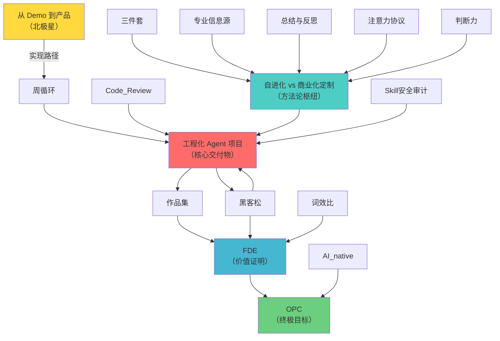

# Hub 概念网络

## Hub 识别标准

**Hub 概念**：inDegree ≥ 3 的概念，代表网络中的关键交叉点。

## Hub 概念列表

| 概念 | inDegree | 类型 | 说明 |
|------|----------|------|------|
| [[engineered-agent\|工程化 Agent 项目]] | 5 | 🎯 核心交付物 | 所有机制的汇聚点，接收周循环、Code Review、黑客松、两种养法、Skill 安全审计的输入 |
| [[two-养法\|自进化 vs 商业化定制]] | 5 | 🔧 方法论枢纽 | 接收三件套、专业信息源、总结与反思、注意力协议、判断力五个防御机制的输入 |
| [[fde\|FDE]] | 3 | 💼 价值证明 | 接收黑客松、作品集、词效比的输入，是能力证明的汇聚点 |

## 所有概念列表（按 inDegree 排序）

| 概念 | inDegree | 角色 |
|------|----------|------|
| [[engineered-agent\|工程化 Agent 项目]] | 5 | ⭐ Hub |
| [[two-养法\|自进化 vs 商业化定制]] | 5 | ⭐ Hub |
| [[fde\|FDE]] | 3 | ⭐ Hub |
| [[opc\|OPC]] | 2 | 🎯 终点 |
| [[21-day-cycle\|21 天周循环]] | 2 | 🔄 机制 |
| [[portfolio\|作品集]] | 1 | 📦 产出 |
| [[code-review\|Code Review]] | 1 | ✅ 验收 |
| [[hackathon\|黑客松]] | 1 | 🚀 外部验证 |
| [[demo-to-product\|从 Demo 到产品]] | 0 | 🌟 北极星 |
| [[ai-native\|AI native]] | 0 | 💡 元习惯 |
| [[attention-focus\|注意力聚焦]] | 0 | 🎯 约束 |
| [[three-config-files\|三件套]] | 0 | ⚙️ 配置 |
| [[professional-sources\|专业信息源]] | 0 | 📚 防御 |
| [[summary-reflection\|总结与反思]] | 0 | 🔄 防御 |
| [[attention-protocol\|注意力协议]] | 0 | 📋 防御 |
| [[judgment\|判断力]] | 0 | 🧠 防御 |
| [[token-efficiency\|词效比]] | 0 | 📊 筹码 |
| [[skill-security\|Skill 安全审计]] | 0 | 🛡️ 防御 |

## Hub 概念关系图（简化版）

## Hub 概念深度分析

### 1. 工程化 Agent 项目（inDegree: 5）

**为什么是最大的 Hub？**
- 接收来自三个层面的输入：
  - **运行机制层**：21 天周循环、Code Review、黑客松
  - **方法论层**：自进化 vs 商业化定制
  - **防御层**：Skill 安全审计
- 是所有机制的最终汇聚点，也是营的核心交付物

**关键特征**：
- 既是产出（每周产出工程化 Agent）
- 也是验证对象（通过 Code Review 和黑客松验证）
- 还是积累载体（积累为作品集）

### 2. 自进化 vs 商业化定制（inDegree: 5）

**为什么是方法论枢纽？**
- 接收所有防御机制的输入：
  - 三件套（配置层）
  - 专业信息源、总结与反思、注意力协议、判断力（防平庸层）
- 是"如何养 Agent"的决策点

**关键特征**：
- 根据目的选择养法（自进化 vs 商业化）
- 整合所有防御机制
- 输出到工程化 Agent 项目

### 3. FDE（inDegree: 3）

**为什么是价值证明的汇聚点？**
- 接收三种能力证明：
  - 作品集（能力 > 学历）
  - 黑客松（实战交付）
  - 词效比（商业化筹码）
- 是从"学员"到"OPC"的中间台阶

**关键特征**：
- 不是终点（终点是 OPC/FFDE）
- 是能力可被市场认可的标志
- 连接产出与身份定位

## 概念网络特征总结

- **北极星概念**：从 Demo 到产品（inDegree=0，只输出）
- **终极目标**：OPC（inDegree=2，只输入）
- **最大 Hub**：工程化 Agent 项目（inDegree=5）
- **方法论 Hub**：自进化 vs 商业化定制（inDegree=5）
- **价值 Hub**：FDE（inDegree=3）

## 关键路径

1. **主路径**：从 Demo 到产品 → 21 天周循环 → 工程化 Agent 项目 → 作品集 → FDE → OPC
2. **防御路径**：防御机制集群 → 自进化 vs 商业化定制 → 工程化 Agent 项目
3. **验证路径**：工程化 Agent 项目 ⇄ 黑客松（双向闭环）

## 网络健康度

- **Hub 分布均衡**：核心交付物、方法论、价值证明三个维度各有 Hub
- **层级清晰**：4 层架构（目标 → 身份 → 机制 → 方法）
- **闭环完整**：工程化 Agent 项目 ⇄ 黑客松形成验证闭环
- **防御充分**：5 个防御机制汇聚到方法论枢纽

## 下一步

继续观察概念网络在实践中的演化，关注：
1. Hub 概念的实际落地情况
2. 新概念的引入是否会改变 Hub 结构
3. 概念之间的隐性关系是否会显现
