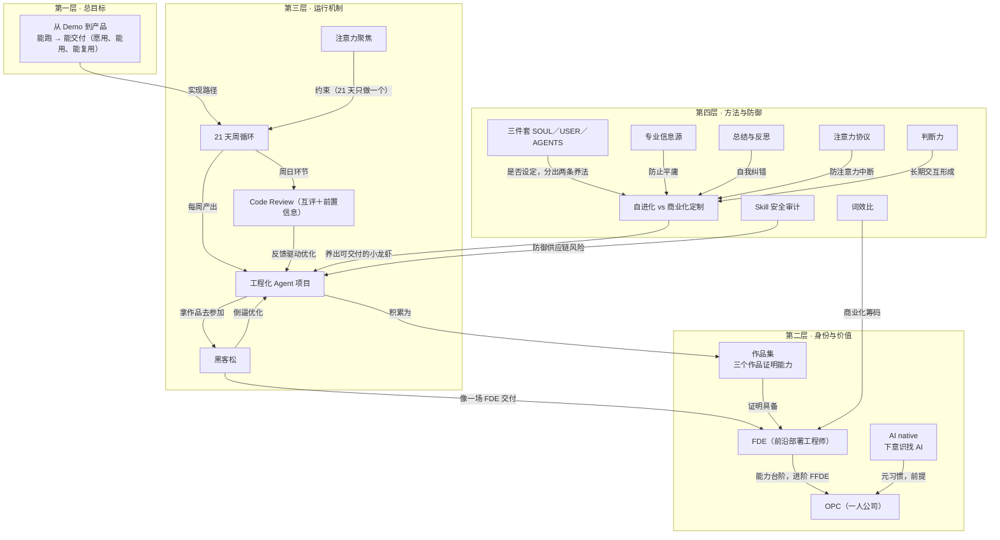

# 概念网络

## 统计信息

- **概念总数**：18
- **关系总数**：21
- **层级结构**：4 层
- **Hub 概念**：[[demo-to-product]]、[[21-day-cycle]]、[[engineered-agent]]、[[two-养法]]

## 概念架构图

## 核心路径分析

### 主路径：Demo → 产品
从 Demo 到产品 → 21 天周循环 → 工程化 Agent 项目 → 作品集 → FDE → OPC

### 防御路径：防平庸与风险
专业信息源 / 总结与反思 / 注意力协议 / 判断力 → 自进化 vs 商业化定制 → 工程化 Agent 项目

### 验证路径：黑客松
工程化 Agent 项目 → 黑客松 → 倒逼优化 → 工程化 Agent 项目（闭环）

## 关键交叉点

1. **工程化 Agent 项目**（inDegree: 6）
   - 接收：21 天周循环、Code Review、黑客松、自进化 vs 商业化定制、Skill 安全审计、注意力聚焦
   - 这是所有机制的汇聚点

2. **自进化 vs 商业化定制**（inDegree: 5）
   - 接收：三件套、专业信息源、总结与反思、注意力协议、判断力
   - 方法论的核心枢纽

3. **FDE**（inDegree: 3）
   - 接收：黑客松、作品集、词效比
   - 是能力证明的汇聚点

## 概念密度

- **L1 层**：1 个概念（北极星）
- **L2 层**：4 个概念（身份定位）
- **L3 层**：5 个概念（运行机制）
- **L4 层**：8 个概念（方法与防御）

L4 层概念最密集，体现了实现细节的复杂度。
