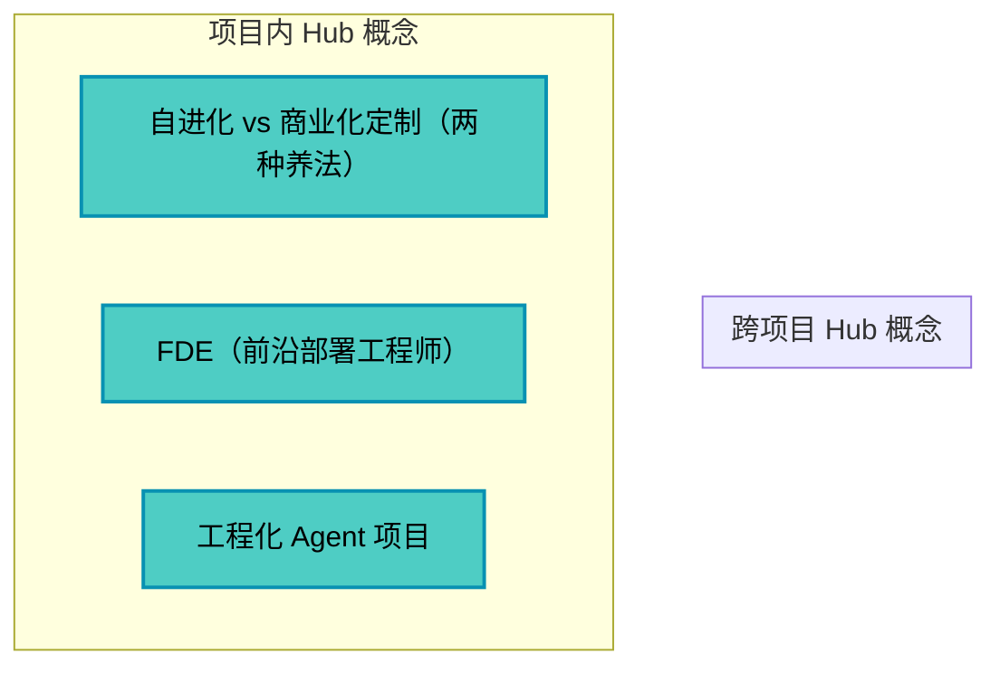

# 跨项目全局 Hub 概念网络

> 基于 3 个项目的概念汇总
> 生成时间：2026-09-28

## 📊 全局统计

- **总项目数**：3
- **总概念数**：29
- **跨项目概念**：0（复用率：0.0%）
- **Hub 概念**：3（inDegree >= 3）

## 🌟 跨项目概念（概念复利的直接证据）

暂无跨项目概念（需要更多项目数据）

## 🔥 全局 Hub 概念

| 概念 | 总 inDegree | 出现项目 | 状态 |
|------|-------------|----------|------|
| 自进化 vs 商业化定制（两种养法） | 5 | AI实战营-从Demo到产品 | 📍 单项目 |
| 工程化 Agent 项目 | 5 | AI实战营-从Demo到产品 | 📍 单项目 |
| FDE（前沿部署工程师） | 3 | AI实战营-从Demo到产品 | 📍 单项目 |

## 📈 概念网络演化

## 🎯 概念复利分析

### 复利效应强（跨项目出现）

### 潜在复利概念（高频但单项目）

#### 自进化 vs 商业化定制（两种养法）
- **项目内 inDegree**：5
- **潜力**：高（项目内核心概念，可能在其他项目中复用）

#### 工程化 Agent 项目
- **项目内 inDegree**：5
- **潜力**：高（项目内核心概念，可能在其他项目中复用）

## 📋 所有概念列表

按项目分组：

### AI 内参-Harness 系列（13 个概念）

### AI实战营-从Demo到产品（17 个概念）

1. AI native 
2. Code Review（互评 + 前置信息） 
3. FDE（前沿部署工程师） ⭐
4. OPC（一人公司） 
5. Skill 安全审计（供应链防御） 
6. 三件套（SOUL.md / USER.md / AGENTS.md） 
7. 专业信息源 
8. 从 Demo 到产品（能跑 vs 能交付） 
9. 作品集（能力 > 学历） 
10. 判断力 
11. 周循环（21 天机制） 
12. 工程化 Agent 项目 ⭐
13. 注意力协议 
14. 注意力聚焦 
15. 自进化 vs 商业化定制（两种养法） ⭐
16. 词效比 
17. 黑客松 

### AI实战营-前沿速递（12 个概念）

1. DeepSeek Harness（agent = model + harness） 
2. Skill 的中间态（与工程化思维） 
3. Skill 自进化四步（experience-log.md） 
4. cron 与 heartbeat 
5. 主观 vs 量化（能力边界） 
6. 养小龙虾（原生 vs 预装） 
7. 多模型分层与轮换 
8. 控制回撤 
9. 最小 15 分钟动作 
10. 本金基数瓶颈 
11. 经验库 
12. 迷茫靠做出来（做一件小事） 

## 图例说明

- 🌐 — 跨项目概念（概念复利的直接证据）
- ⭐ — Hub 概念（inDegree >= 3）
- 🔴 红色双框 — 跨项目 Hub 概念（最高价值）
- 🔵 蓝色单框 — 项目内 Hub 概念

## 使用建议

1. **学习新项目时**：优先理解跨项目概念（已有基础）
2. **复习时**：关注 Hub 概念（知识网络的核心）
3. **扩展时**：观察潜在复利概念（可能在新项目中复用）
