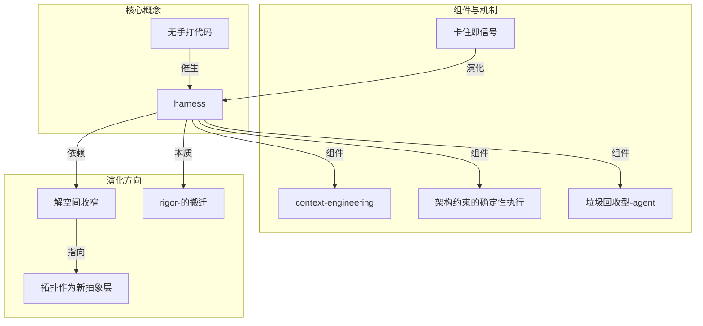

# 全局 Hub 概念网络

> 更新时间：2026-09-28
> 当前文章数：1

## 统计信息

- 总概念数：13
- Hub 概念：0（需要 inDegree >= 3）
- 当前所有概念均来自第 01 篇

## 概念列表

| 概念 | 被引用次数 | 状态 |
|------|------------|------|
| [[解空间收窄\|解空间收窄（constraining the solution space）]] | 1 | 🌱 初次出现 |
| [[ai-友好度作为选型标准\|AI 友好度（AI-friendliness）作为选型标准]] | 1 | 🌱 初次出现 |
| [[架构约束的确定性执行\|架构约束的确定性执行]] | 1 | 🌱 初次出现 |
| [[rigor-的搬迁\|rigor 的搬迁（relocating rigor）]] | 1 | 🌱 初次出现 |
| [[熵与腐化\|熵与腐化（entropy and decay）]] | 1 | 🌱 初次出现 |
| [[无手打代码\|无手打代码（no manually typed code at all）]] | 1 | 🌱 初次出现 |
| [[垃圾回收型-agent\|「垃圾回收」型 agent]] | 1 | 🌱 初次出现 |
| [[功能与行为验证的缺口\|功能与行为验证的缺口]] | 1 | 🌱 初次出现 |
| [[service-template-与-golden-path\|service template 与 golden path]] | 1 | 🌱 初次出现 |
| [[harness\|harness（把 agent 管住的那套工装）]] | 1 | 🌱 初次出现 |
| [[卡住即信号\|卡住即信号（struggle as signal）]] | 1 | 🌱 初次出现 |
| [[拓扑作为新抽象层\|拓扑作为新抽象层]] | 1 | 🌱 初次出现 |
| [[context-engineering\|context engineering（上下文工程）]] | 1 | 🌱 初次出现 |

## 概念网络演化

### 第 01 篇

引入 13 个核心概念，建立 Harness 工程的基础框架：

## 等待观察

随着更多文章加入，观察：
- 哪些概念会成为 Hub（被频繁引用）
- 概念间的关系如何演化
- 是否出现新的概念层次

> 💡 提示：当某个概念在 3 篇以上文章中出现时，它会晋升为 Hub 概念
