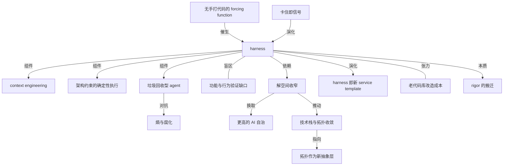

## 概念网络

### 关键概念

#### harness（把 agent 管住的那套工装）

**context**：全文的锚概念。作者说她喜欢用 harness 这个词来描述「the tooling and practices we can use to keep AI agents in check」——我们用来把 AI agent 管住的工具与实践。它不是某一个工具，而是知识库、动态上下文、自定义 linter、结构性测试、巡逻 agent 的总和。

**费曼一下**：harness 原意是套在牲口身上的挽具——既限制它乱跑，又让它的力气能被用上。用在 AI 编程上是同一个意思：不是给 agent 松绑，也不是把它关死，而是造一副装置，让它的输出始终落在你能接受的范围内。

#### 无手打代码（no manually typed code at all）

**context**：OpenAI 团队的自我设限规则，作者称之为 forcing function。正是这条规则逼出了整套 harness，并支撑起五个月、100 万行代码的真实产品。

**费曼一下**：把自己的退路堵死，才会认真造工具。只要允许「实在不行我自己上手改一行」，那些本该外化成规则和检查的东西就永远停在人的脑子里。禁止手打代码不是为了炫技，是为了把隐性能力逼成显性装置。

#### context engineering（上下文工程）

**context**：作者归纳的 harness 三类组件之首：代码库内部持续增强的知识库，加上让 agent 取到动态上下文的通道——可观测性数据、浏览器导航。文末她进一步指出，上下文工程不只是策展知识库，代码设计本身就是上下文的一大部分。

**费曼一下**：agent 干得好不好，很大程度取决于它此刻知道什么。上下文工程就是有计划地安排「它该知道什么、从哪里知道」：静态的写进代码库，动态的开一条实时通道。而最深的一层是：代码写成什么样，本身就在告诉 agent 这个系统该怎么运转。

#### 架构约束的确定性执行

**context**：harness 的第二类组件。关键在于这些约束不只交给 LLM agent 去盯，还由确定性的自定义 linter 和结构性测试来强制；作者在自检清单里点名 ArchUnit 这类结构性测试框架。

**费曼一下**：让模型来检查模型，等于让同一种不确定性做裁判。确定性检查的价值在于它今天和明天给出同样的结论——规则写死在代码里，违反就是违反，不看模型心情。

#### 「垃圾回收」型 agent

**context**：harness 的第三类组件，周期性运行的 agent，专找文档不一致与架构约束违规，用作者的话说是在 fighting entropy and decay。

**费曼一下**：软件不会自己变好，只会自己变乱。这类 agent 相当于给代码库雇了个巡道工：不产出新功能，只在后台不断把跑偏的地方拨回来，让熵增的速度慢于修复的速度。

#### 熵与腐化（entropy and decay）

**context**：既是「垃圾回收」agent 的对手，也是作者判断老代码库能否改造的依据——老应用往往「so non-standardized and full of entropy」，补 harness 未必划算。

**费曼一下**：熵在这里是很具体的东西：文档和代码对不上、模块边界越界、同一件事有五种写法。它不会一次性爆发，只会日积月累，直到没人能说清系统的真实结构——那时你想加任何自动化都无处下手。

#### 卡住即信号（struggle as signal）

**context**：OpenAI 团队被作者引用的迭代机制原话：agent 卡住时把它当信号，找出缺什么工具、护栏、文档，喂回代码库，而且修复始终由 Codex 自己写。

**费曼一下**：这是把 debug 的对象从「这次的输出」换成「产生输出的环境」。人一旦开始接管，改进就停在这一次；把卡点当成环境缺陷来补，下一次同类问题就不再出现。

#### 功能与行为验证的缺口

**context**：作者对 OpenAI 写作的第一处保留：所有措施都指向长期内部质量与可维护性，缺的是 verification of functionality and behaviour。

**费曼一下**：一套 harness 可以保证代码结构整洁、边界清楚、文档同步，但这些全是关于「代码长成什么样」的。它做的事对不对，是另一个维度的问题，需要另一套装置来回答——这个位置目前还空着。

#### service template 与 golden path

**context**：作者用来类比 harness 未来形态的现成实践：service template 帮团队沿 golden path 实例化新服务；她设想团队从一组 harness 里按应用拓扑挑一个开工，也预判了同样的 forking 与同步难题。

**费曼一下**：golden path 是组织内被推荐的默认路线——照它走，脚手架、规范、工具链都是现成的。harness 若走上这条路，好处是新项目开局即有护栏，坏处是老问题会照搬过来：每个团队都把模板改成自己的样子，上游更新就再也合不回去。

#### 解空间收窄（constraining the solution space）

**context**：作者从 harness 实践中读出的核心交换：提升信任与可靠性，靠的是具体架构模式、强制边界、标准化结构，代价是放弃一部分「generate anything」的灵活性。

**费曼一下**：可选项越少，出错的花样越少，检查也越容易写。想让 AI 自己跑得更远，你得先把跑道修窄——这是自由与自治之间的交换，不是双赢。

#### AI 友好度（AI-friendliness）作为选型标准

**context**：作者对技术栈收敛的预判：当写代码变成 steering its generation，开发者在细节层面的口味变得不重要，接口的小怪癖不再烦人，团队可能优先选「有好 harness 可用」的栈。同时她保留了一句反向判断——what's good for humans is good for AI。

**费曼一下**：过去选框架看「我用着顺不顺手」，以后可能要多问一句「agent 用着顺不顺手、有没有现成护栏」。有意思的是这两个标准并不对立：清晰的接口对人好，对模型同样好。

#### 拓扑作为新抽象层

**context**：全文最具野心的一问：如果我们普遍学会 harness 代码库的设计模式，这些拓扑结构会不会成为新的抽象层，而不是许多 AI 爱好者期待的自然语言本身。作者能看清的抓手是保持数据结构稳定、定义并强制模块边界。

**费曼一下**：抽象层是我们思考系统时真正操作的那一层。流行叙事说以后大家用自然语言编程，这一问反过来讲：真正决定系统能不能被 AI 维护的，也许不是你怎么描述它，而是它被切成了什么形状、边界画在哪里。

#### rigor 的搬迁（relocating rigor）

**context**：作者借 Chad Fowler 的「Relocating Rigor」收束全文：OpenAI 团队自陈最难的挑战已变成设计环境、反馈回路与控制系统；她认为听到严谨该往哪儿搬的具体经验，好过指望「更好的模型」自动解决可维护性。

**费曼一下**：严谨这份工作量并没有蒸发，只是从「一行行把代码写对」搬到了「把环境、反馈和控制设计对」。谁以为 AI 会免掉这份工作，谁就会在几个月后收到一份没人看得懂的百万行代码。

### 概念网络

这张网络的中心是 harness，但它不是一个静态定义，而是一条从约束出发、经由装置、最终指向抽象层变迁的链条。

起点是 C1 与 C2 的因果：「完全不手打代码」这条自我设限规则，才是 harness 的真正生成器。没有这条 forcing function，团队总能靠人手补救，装置就没有必须存在的理由。

C2 向下分出三条组件线（C3、C4、C5），三者分工不同但互补：上下文工程决定 agent 知道什么，架构约束的确定性执行决定它不能越过哪里，垃圾回收型 agent 则在时间维度上对抗 C7 的熵与腐化——前两者管一次生成的质量，第三者管长期不塌。C6 是这三条线的生长机制而非并列组件，它从外部指向 C2：每次 agent 卡住都被翻译成对装置的一次增补，所以图上画成演化关系而不是组成关系。

C8 与 C2 之间是无向的张力关系：功能与行为的验证不是 harness 的一个缺失零件，而是它整个覆盖面之外的一块空地。装置越完善，这块空地越显眼——代码结构可以被自动守住，代码做得对不对却仍无人接管。

右半边是从装置到范式的推演。C2 依赖 C9（解空间收窄），C9 换来 C10（更高的 AI 自治）——这是全文最硬的一条交换关系：自治不是模型变强的赠品，是用灵活性买来的。C9 继续外溢成 C11，技术栈与代码库拓扑向少数几种收敛，因为「容易被 harness」成了新的选型权重；而 C11 一旦成真，就逼出 C13 这个最大的问题：新的抽象层可能是拓扑结构，而不是自然语言。

C12 与 C14 是 C2 在组织现实中的两个侧面，方向相反。C12 是乐观面：harness 沿 service template 的老路演化成可复用起点。C14 是阻力面：老代码库熵太高，改造未必划算，因此这条画成张力而非支撑——同一个装置，对新系统是加速器，对旧系统可能是无底洞。

整张图最后收在 C15：harness 的本质不是新增了一层工具，而是严谨从人手中搬到了环境、反馈回路与控制系统的设计上。C1 到 C15 因此构成一个闭环——因为不许手打代码，严谨必须离开手指，落到别处。

## 费曼 x3

关于 AI 写代码的争论，大多停在模型能力上：写得对不对、能不能跑、下一代会不会更强。真正要紧的问题被跳过了——当代码不再由人一行行敲出来，是什么在替人守住这份代码的底线。

答案不是更好的提示词，而是一整套装置。把「完全不手动敲代码」当成自我设限的规则，五个月里逼出来的是：写进代码库、被持续增强的知识库，能取到可观测性数据和浏览器现场的动态上下文，由自定义 linter 和结构性测试确定性执行的架构边界，以及定期巡逻、专门清理文档不一致与架构违规、对抗熵与腐化的「垃圾回收」agent。把这一整套叫 harness——一副既套住 agent 又让它使得上劲的挽具——比叫「最佳实践」诚实得多。

最耐人寻味的不是它由什么构成，而是它怎么长出来的：agent 卡住的地方不算 agent 的失败，而被当成信号，缺什么工具、护栏、文档就补回代码库，而且补丁本身仍由它自己写。工程的重心因此从「我写得多好」挪到「我把环境设计得多好」——最难的挑战已经变成设计环境、反馈回路和控制系统。严谨没有消失，它只是搬了家。

代价同样清楚。早期的想象是 LLM 让你想用什么语言、什么模式都行；实践给出的方向恰好相反：固定的架构模式、被强制的模块边界、标准化的结构。要让 AI 跑得更远，先得把跑道修窄——愿意交出「什么都能生成」的自由，才换得来「生成的东西可以信」。顺这条路走下去，技术栈会向少数几个收敛，选型时会多出一条 AI 友好度，而代码库的拓扑本身，可能才是那个新的抽象层，不是很多人期待的自然语言。

两个问题仍然空着，也正因为空着才值得盯住。一是这套装置全部瞄准内部质量与可维护性，功能与行为对不对，仍无人接管。二是存量系统怎么办：花五个月造一副挽具，对一个从没跑过静态分析、一开就淹没在告警里的老代码库，可能根本不值当。所以该问自己的从来不是要不要做 harness，而是——你今天的 harness 是什么。`pre-commit hook` 里装了什么，想给代码库立哪几条架构约束，试过结构性测试没有。这些问题今天就能回答，而且回答它们本身就已经是在造那副挽具了。
