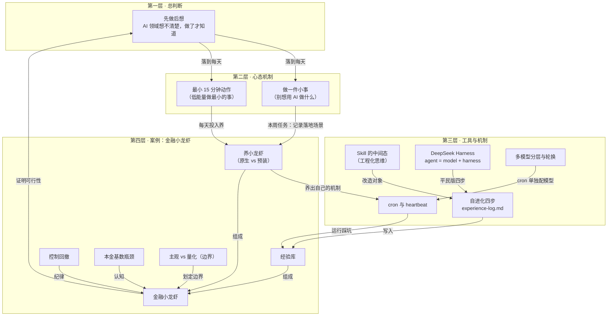

# AI实战营直播课：前沿速递与金融小龙虾 - 概念网络

> 本图保留原始 Mermaid 概念架构，展示课程的四层概念结构

## 概念层次说明

### 第一层：总判断
- [[迷茫靠做出来]]：AI 领域想不清楚，实践才知道

### 第二层：心态机制
- [[迷茫靠做出来]]：把「用 AI 做什么」改写成「让小龙虾做一件小事」
- [[最小-15-分钟动作]]：能量管理，打破内耗循环

### 第三层：工具与机制
- [[skill-中间态]]：工程化思维比 skill 本身更重要
- [[deepseek-harness]]：agent = model + harness 的自进化框架
- [[skill-自进化四步]]：experience-log.md 四步落地法
- [[多模型分层与轮换]]：按任务分层，多模型轮换
- [[cron-与-heartbeat]]：定时任务 + 心跳监控

### 第四层：案例验证
- [[养小龙虾]]：原生 vs 预装，养的过程是价值
- [[经验库]]：自进化在文件系统里的样子
- [[控制回撤]]：纪律 + 心理的风控组合
- [[本金基数瓶颈]]：小本金的认知边界
- [[主观-vs-量化]]：AI 投资的能力边界

## 关键设计

1. **从上到下**：总判断 → 心态 → 工具 → 案例
2. **从下到上**：案例证明可行性，回馈到总判断
3. **闭环验证**：金融小龙虾是整套方法论的实战验证
