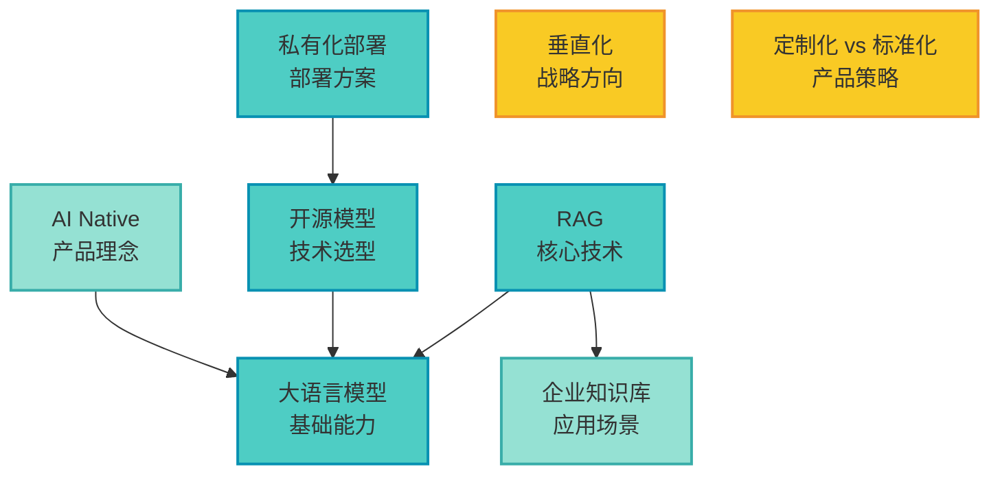

# 概念网络图谱

## 统计信息

- 总概念数：8
- Hub 概念：0（inDegree >= 3）
- 平均掌握度：23.75%

## 概念列表

| 概念 | inDegree | 掌握度 | 类型 |
|------|----------|--------|------|
| [[大语言模型]] | 0 | 20% | 基础概念 |
| [[企业知识库]] | 0 | 20% | 应用场景 |
| [[rag]] | 0 | 30% | 核心技术 |
| [[私有化部署]] | 0 | 20% | 部署方案 |
| [[开源模型]] | 0 | 30% | 技术选型 |
| [[定制化-vs-标准化]] | 0 | 20% | 产品策略 |
| [[垂直化]] | 0 | 20% | 战略方向 |
| [[ai-native]] | 0 | 20% | 产品理念 |

## 概念网络

## 概念关系说明

### 核心技术层

- **[[大语言模型]]** 是整个技术栈的基础
- **[[开源模型]]** 是基于大语言模型的具体技术选型
- **[[rag]]** 依赖大语言模型和企业知识库，是核心技术方案
- **[[私有化部署]]** 需要配合开源模型实现

### 应用层

- **[[企业知识库]]** 是应用场景
- **[[ai-native]]** 描述了产品设计理念，依赖大语言模型能力

### 战略层

- **[[垂直化]]** 和 **[[定制化-vs-标准化]]** 是相对独立的战略和产品决策
- 它们不直接依赖其他技术概念，但影响产品形态

## 学习路径建议

### 路径 1：技术深入

1. [[大语言模型]] → 理解基础能力
2. [[rag]] → 掌握核心技术
3. [[开源模型]] → 了解技术选型
4. [[私有化部署]] → 理解部署方案

### 路径 2：产品战略

1. [[企业知识库]] → 理解应用场景
2. [[ai-native]] → 理解产品理念
3. [[垂直化]] → 理解战略方向
4. [[定制化-vs-标准化]] → 理解产品策略

## 观察与洞察

**低结构化材料的特点**：
- 本次学习材料是播客访谈逐字稿，口语化、非线性
- 缺乏明确的章节结构和逻辑顺序
- 话题在背景、技术、商业模式之间跳跃

**提取效果**：
- 成功从对话中识别出 8 个核心概念
- 概念覆盖技术、产品、战略三个层面
- 概念关系相对清晰，主要围绕"如何做企业 AI 助手"这个主线

**与结构化材料的对比**：
- 结构化材料（如技术文章）概念通常有明确的层次和依赖
- 低结构化材料的概念更分散，需要从上下文中推断关系
- 但低结构化材料往往包含更多实践经验和真实案例

## 使用说明

1. **在 Obsidian 中查看**：直接渲染 Mermaid 图，可以看到概念的分层和依赖关系
2. **点击概念名**：跳转到对应概念页面，查看详细定义
3. **学习路径**：根据自己的兴趣选择技术路径或产品路径