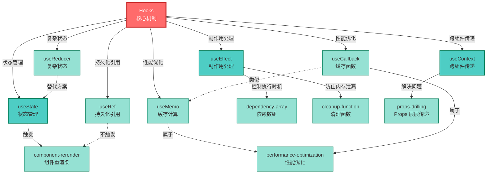

# React Hooks 概念网络

## 网络分析

### Hub 概念（inDegree >= 3）

**hooks**（inDegree: 7）
- 核心 Hub 节点
- 连接所有 React Hooks API
- 是整个系统的入口概念

### 核心概念层

**useState**（inDegree: 3）
- 最常用的状态管理 Hook
- 与 useReducer、component-rerender 关联

**useEffect**（inDegree: 4）
- 副作用处理的核心
- 依赖 dependency-array 和 cleanup-function

**useContext**（inDegree: 2）
- 解决 props-drilling 问题
- 轻量级状态管理方案

### 性能优化层

**useMemo** 和 **useCallback**
- 都属于性能优化策略
- 两者功能相似（缓存值 vs 缓存函数）

### 特殊机制

**useRef**（inDegree: 2）
- 不触发重新渲染的特殊机制
- DOM 引用和可变值存储

**useReducer**（inDegree: 2）
- 复杂状态管理
- useState 的增强版

## 概念关系类型

- **实线箭头**：主要关系（从属、依赖）
- **虚线箭头**：对比关系（类似、替代、相反）

## 网络特点

1. **清晰的层次结构**：Hub → 核心 API → 支持概念
2. **语义化关系标签**：不只是"依赖"，有明确语义
3. **适度复杂度**：13 个节点，20+ 条边，可读性良好
