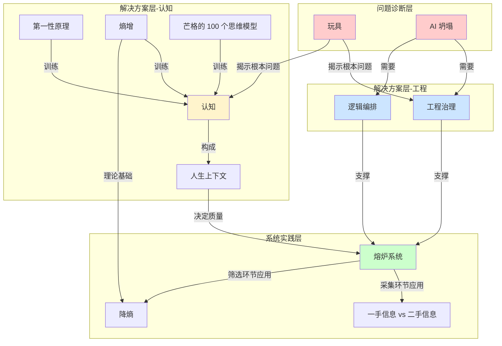

# 从玩具到熔炉系统 — 局部概念网络

## 概念关系图

## 关系说明

### 问题诊断层

- [[玩具]]：大多数 AI 学习者的作品现状，无法产生真实商业价值
- [[AI 坍塌]]：大规模任务中 AI 输出质量急剧下降的现象

### 解决方案层-工程

- [[工程治理]]：管理 AI 大规模任务的方法论，防止坍塌
- [[逻辑编排]]：为多 agent 设计任务分工和上下文传递机制

关系：两者配合使用，共同解决"让 AI 自主跑几十小时达到 99% 目标"的问题

### 解决方案层-认知

- [[认知]]：决定判断质量的底层能力
- [[人生上下文]]：认知的具体载体，决定使用 AI 的效果
- [[第一性原理]]、[[熵增]]、[[芒格的 100 个思维模型]]：训练认知的具体工具

关系：三个工具通过训练认知，最终形成高质量的人生上下文

### 系统实践层

- [[熔炉系统]]：整合工程能力和认知能力的实践框架
- [[降熵]]：熔炉系统筛选环节的核心原则
- [[一手信息 vs 二手信息]]：熔炉系统采集环节的判断标准

关系：熔炉系统需要工程治理、逻辑编排的支撑（做得出来），需要认知和人生上下文的驱动（做得对）

## 核心论证路径

1. **现状诊断**：你做的很多东西是[[玩具]]（无法产生真实商业价值），遇到大规模任务会遭遇[[AI 坍塌]]

2. **工程解法**：学习[[工程治理]]和[[逻辑编排]]，从"做一张图"到"管理 1000 张图的生产流程"

3. **认知解法**：差距不在工具，而在[[认知]]。通过[[第一性原理]]、[[熵增]]、[[芒格的 100 个思维模型]]训练认知，形成高质量的[[人生上下文]]

4. **系统实践**：构建[[熔炉系统]]（采集、筛选、学习、输出、再反馈），在采集环节追求[[一手信息 vs 二手信息]]，在筛选环节执行[[降熵]]

5. **最终目标**：从玩具走向真实系统，从信息差走向真实能力

## 关键洞察

- 同样使用 Claude Code，效果差异来自[[人生上下文]]质量，而非工具版本
- [[熵增]]是物理定律，也是商业规律（信息差会消失、蓝海变红海），需要主动[[降熵]]
- [[熔炉系统]]不是第二大脑（静态知识库），而是动态加工流水线
- [[工程治理]]和[[认知]]缺一不可：工程能力决定"做得出来"，认知能力决定"做得对"
