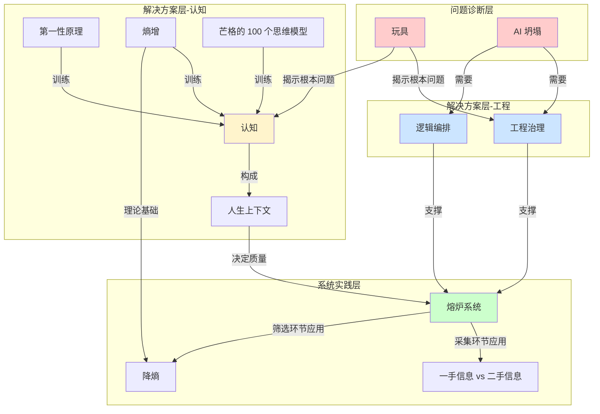

# 概念解析辞典

> 针对《从玩具到熔炉系统：AI 时代真正该补的不是工具，而是认知和工程》的概念提取

## 一、核心概念

### 1. **玩具（AI 作品的玩具性）**

- **context**：

  > 我想问你们：你们在做这些东西的过程中，有没有考虑过一个点，就是你们做的所有东西都是玩具？

  讲者通过一系列追问来定义"玩具"的边界：

  > 这个东西能不能在一个企业里，在一个真正的商业公司里给它提效？……假设你的能力能给一个公司的某一个岗位提效，你能不能改变这个公司所有人的协作？……再假设你现在能改变协作，我再问你：你能不能改变这个组织？……再往下，假设你的 AI 能力能改组织了，牛了，你还会面临另外一个问题：经过 AI 生产的组织盈利之后，别的公司也来做，你能不能立足生态？

- **费曼一下**：在本文中，"玩具"指那些看起来炫酷、技术上可行，但无法在真实商业场景中产生系统性价值的 AI 作品。判断标准有四层：能否给企业提效？能否改变协作？能否改变组织？能否立足生态？大多数学生作品停留在第一层之前，因此被称为"玩具"。这个概念是全文的起点，用来打破学习者对自己能力的幻觉。

### 2. **工程治理（Engineering Governance）**

- **context**：

  > 你们原来以为的写作方式，到这里就完成了，但其实它会涉及到工程治理。……你的工程量大了之后，一定会涉及到模型编排。你们说 RAG 技术，我告诉你，RAG 技术解决不了这个东西。

  讲者用 30 万字总结任务作为例子：

  > 如果你们做过稍微大型一点的项目，就知道这个时候 AI 一定会坍塌。它不是简单的上下文不够。现在上下文已经能达到几十万字、七十万字了，30 万字扔进去，为什么结果还是不够？因为 AI 在这个时候会坍塌。

- **费曼一下**：工程治理是指在大规模、复杂任务中，如何拆解、分配、监控和整合 AI 的工作流程，防止模型在工程量增大时"坍塌"（输出质量急剧下降、遗漏关键信息）。它不是简单的技术堆叠，而是一套管理 AI 工作边界、处理规模化问题的方法论。本文用它来解释为什么小任务做得好不等于大任务做得好。

### 3. **逻辑编排（Logic Orchestration）**

- **context**：

  > 你们要做的是一份逻辑编排工程字典。你自己要设定 30 个 agent，每个 agent 做什么事情，A agent 做什么，B agent 做什么。你要给它们写说明文档，每个 agent 之间怎么相互约束，怎么传递上下文，这个之间怎么传递上下文。

  与 dynamic workflow 的对比：

  > Dynamic workflow 解决了很多逻辑编排和工程治理相关的东西，但它可能依然解决不了这个问题。

- **费曼一下**：逻辑编排是为多个 AI agent 设计清晰的任务分工、约束规则和上下文传递机制。它不是对 AI 说"帮我派 30 个 agent"，而是人工设计每个 agent 的职责边界、输入输出格式、相互依赖关系。本文强调逻辑编排需要"工程字典"级别的文档，用来解决复杂任务中 AI 自主运行几十小时仍能达到 99% 目标的问题。

### 4. **熔炉系统（Furnace System）**

- **context**：

  > 它就像一个非常巨大的熔炉。你的所有东西，你的学习、你的商业、你的感情、你的生活，全部扔进这个熔炉里面。它是你自己的一个中枢。融进去之后，它会吐出另外一个东西，可能是仙丹，也可能是废品。你要在里面挑挑拣拣。当你真正炼出来的时候，你会变得无比强大。

  系统的五个环节：

  > 第一步是采集。……接下来是筛选，我们要把不好的东西去掉。接下来是学习，也就是如何学习。当我们有了一个很好的东西之后，你可能还没有一个很好的学习方式，这个时候就要进入学习系统。再往后是输出。……当你输出完之后，你会获得更多信息，又回到采集。这是一个大的闭环，这就是我的熔炉系统。

- **费曼一下**：熔炉系统是一个完整的信息处理闭环，包含采集、筛选、学习、输出、再反馈五个环节。它不是"第二大脑"（静态知识库），而是一个动态的、可以应用于学习、商业、生活的中枢系统。核心特征是"融进去"（所有信息不分类别地进入）和"炼出来"（通过筛选和加工产出高价值结果）。本文用它来替代碎片化的工具学习，强调系统性思维。

### 5. **认知（Cognition）**

- **context**：

  > 认知是决定你在生活和商业里面所有判断质量的东西。同样一件事情，A 的认知高一点，B 的认知低一点，他们判断的质量不一样，处理方式就不一样，获得的结果也不一样。这就是认知最本质的解释。

  什么不是认知：

  > 信息不是认知，观点不是认知，经验也不是认知。你的自信更不是认知。

- **费曼一下**：认知是指决定判断质量的底层能力，它通过"判断→决策→检查结果→反馈"的循环不断迭代。本文强调认知不是信息量、不是自信心、不是观点积累，而是一套可以训练的思维系统。它是本文中"差距不在工具，而在认知"这一核心观点的支柱。

### 6. **人生上下文（Life Context）**

- **context**：

  > 你们用 AI 的时候都知道上下文是什么。你做一个项目,可以给它交代背景……但你人生的上下文是什么？我觉得就是这些所有东西。

  与 AI 使用的关系：

  > 你在学 AI，我也在学 AI，另外一个人也在学 AI，我们用的都是 Claude Code。为什么我们三个做出来的效果不一样？不是因为你的 Claude 是正版，我用的是盗版，而是因为我们给 AI 的上下文不一样。这个上下文不是项目上下文，而是人生上下文。

- **费曼一下**：人生上下文是指一个人的判断力、认知模型、经验与价值观的总和，它决定了使用同样工具时能否提出正确的问题、做出合理的判断。本文用它来解释为什么同样使用 Claude Code，不同人产出质量差异巨大——因为工具只是执行器，真正的差异在于使用者输入的"人生上下文"质量。

### 7. **第一性原理（First Principles）**

- **context**：

  > 我给你们一个案例。以后你们遇到所有东西都像这样去用。你去问 AI：肉的第一性原理是什么？不是问"用第一性原理思考肉"，而是直接问"肉的第一性原理是什么"。

  具体例子：

  > 肉的第一性原理可能是水、蛋白质、脂肪、结缔组织、少量矿物质和风味物质。当你知道肉的第一性原理是这些东西的时候，你会不会去想做人造肉？因为所有这些东西都可以组合，那为什么肉必须从动物身上长出来？

- **费曼一下**：第一性原理在本文中不是"马斯克造火箭"的故事，而是一种可以应用于任何事物的拆解方法：把表象还原为最基本的组成要素，然后重新思考组合方式。本文强调它应该成为日常思考工具，用于"吃饭的第一性原理""感情的第一性原理"等所有场景，而不是停留在商业故事层面。

### 8. **熵增（Entropy Increase）**

- **context**：

  > 熵增是什么？你们很多解释都是对的：事物总是会朝着混乱的方向发展。

  应用范围的扩展：

  > 为什么你跟对象的关系会越来越平淡？这也是熵增。……公司管理也是这样。一个公司不管理，就会乱掉。这也是热力学第二定律。……同样，你们的 Claude.md 或者 AGENTS.md 里面也有熵增。最开始你用的时候，里面有一条规则。到后面你越用越多，有 700 条规则的时候，你会发现它已经失控了。

- **费曼一下**：熵增在本文中从物理学定律被迁移为一种通用的系统退化规律：没有外力干预时，所有系统（感情、组织、配置文件、信息差）都会走向混乱。本文用它来解释为什么需要"降熵"（筛选信息、减少规则、主动管理），以及为什么蓝海会变红海、信息差会消失。

### 9. **芒格的 100 个思维模型**

- **context**：

  > 我当时想的是"道理"，芒格说的是 100 个思维模型。我当时就在想，这世界上的道理是不是有限的？如果有限，它是多少个？如果假设是 100 个，我学会这 100 个道理，是不是就无敌了？

  观察规律：

  > 赚几百万的老板，脑袋里可能没有模型，也能赚到几百万；赚几千万的，脑袋里可能有两三个模型；再往上，赚几个亿、十几个亿的，你会发现你在他们面前插不进去话。……那就有一种可能：他的脑袋里是有模型的，是有思维模型的。

- **费曼一下**：芒格的 100 个思维模型在本文中是一个假设：世界上可能只有有限数量（约 100 个）的底层思维模型，掌握它们就能应对绝大多数问题。本文用它来支撑"认知"的可训练性——不是无限学习，而是集中学习最核心的思维框架。它是"人生上下文"的具体构成部分。

### 10. **AI 坍塌（AI Collapse）**

- **context**：

  > 如果你们做过稍微大型一点的项目，就知道这个时候 AI 一定会坍塌。它不是简单的上下文不够。现在上下文已经能达到几十万字、七十万字了，30 万字扔进去，为什么结果还是不够？因为 AI 在这个时候会坍塌。

  相关问题：

  > 接下来讲 AI 都会犯的问题：会偷懒，会过度自信,会目标偏移。……所有这些问题，都会导致刚刚我说的两件事：30 万字你总结不出来；定好一个目标让它跑几十个小时达到 99%，你也做不出来。

- **费曼一下**：AI 坍塌是指当任务规模超过某个阈值时，AI 的输出质量急剧下降、出现严重遗漏或偏差的现象。它不是上下文长度问题，而是模型在复杂任务中会偷懒、过度自信、目标偏移导致的系统性失败。本文用它来解释为什么需要工程治理和逻辑编排——小任务的成功经验无法直接扩展到大任务。

### 11. **降熵（Entropy Reduction）**

- **context**：

  > 这又回到刚刚的熵增。我们是不是在做一个降熵的过程？一定是。没有跟你讲这些之前，我说要挖一手信息，你们可能会觉得每个渠道、每个大牛都值得看。一天扔给你 500 条信息的时候，你会发现根本看不了。这就是熵增。

  在系统中的应用：

  > 你要去降熵，让它越来越少。……信息差也会因为熵增而公开。

- **费曼一下**：降熵是对抗系统混乱化的主动过程，在熔炉系统中具体表现为筛选信息、减少规则、聚焦核心。本文用它来解释为什么不能"爬 100 个渠道""设置 700 条规则"——信息过载本身就是熵增，需要通过判断力主动降熵，只保留最有价值的部分。

### 12. **一手信息 vs 二手信息**

- **context**：

  > 抖音博主有 100 万粉、200 万粉又怎么样？他的很多东西都是二手消息。你们不要迷信权威。真正的东西要拿一手，而不是拿二手消息。一手信息是 100%。A 拿到后获取了 50% 的信息，他再转述给你，可能只剩 30%。你获取到的时候可能只剩 10%。

  一手信息的来源：

  > 一手信息在哪里？官方博客，当事人的 Twitter……最有价值的东西很多都在访谈里，在个人长视频里，在播客里。……YouTube、B 站、播客，是最好的信息源。

- **费曼一下**：一手信息是指直接来自当事人、未经转述的原始内容（官方博客、长访谈、播客），二手信息是经过他人加工、转述后的内容（博主总结、短视频）。本文用信息衰减模型（100%→50%→30%→10%）来说明为什么必须追溯一手信息，这是熔炉系统"采集"环节的核心判断标准。

## 二、概念架构图

**关系说明**：

- **问题诊断层**：玩具和 AI 坍塌是现状诊断，揭示学习者当前的两个核心问题
- **解决方案层-工程**：工程治理和逻辑编排是技术维度的解决方案，用于应对 AI 坍塌
- **解决方案层-认知**：认知及其训练工具（第一性原理、熵增、思维模型）是思维维度的解决方案，共同构成人生上下文
- **系统实践层**：熔炉系统是整合工程能力和认知能力的实践框架，降熵和一手信息是其具体方法论
