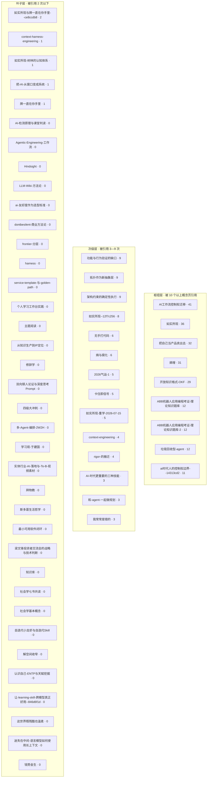

# DaCapo 概念图谱

**生成时间**: 1790605240.1455383
**概念总数**: 60
**有引用的概念**: 28 / 60
**引用关系**: 301 条

---

## 概念分层

---

## 统计说明

- **枢纽层**: 被 10 个以上概念页引用，是核心概念
- **次级层**: 被引用 3—9 次，是重要概念
- **叶子层**: 被引用 2 次以下，是边缘或独立概念

数字表示该概念被其他概念页引用的次数（入度）。

---

## Top 10 枢纽概念

1. **AI工作流控制权迁移** - 被引用 41 次
2. **如实所现** - 被引用 36 次
3. **把自己当产品卖出去** - 被引用 32 次
4. **熵增** - 被引用 31 次
5. **开放知识格式-OKF** - 被引用 29 次
6. **ABB机器人应用编程考证-理论知识题库** - 被引用 12 次
7. **ABB机器人应用编程考证-理论知识题库-2** - 被引用 12 次
8. **垃圾回收型-agent** - 被引用 12 次
9. **ai时代人的控制权边界--14313cd2** - 被引用 11 次
10. **功能与行为验证的缺口** - 被引用 9 次

---

*本图谱由 `scripts/generate_concept_graph.py` 自动生成*
