# DaCapo 概念图谱

**生成时间**: 1790613338.0279775
**概念总数**: 64
**有引用的概念**: 64 / 64
**引用关系**: 189 条

---

## 概念分层

```mermaid
graph TD
    subgraph mid["次级层 · 被引用 3—9 次"]
        direction LR
        n0["拓扑作为新抽象层 · 7"]
        n1["harness · 6"]
        n2["理解边缘探测 · 6"]
        n3["三层架构 · 5"]
        n4["修辞三要素 · 5"]
        n5["显影与退役判据 · 5"]
        n6["Loop Engineering · 4"]
        n7["compile-not-retrieve · 4"]
        n8["context-engineering · 4"]
        n9["主题阅读法 · 4"]
        n10["人机协作规划 · 4"]
        n11["如实所现 · 4"]
        n12["学习工作台 · 4"]
        n13["开放知识格式 · 4"]
        n14["知识编译 · 4"]
        n15["验证流水线 · 4"]
        n16["AI 文本可检测性 · 3"]
        n17["First Mate · 3"]
        n18["ai-memory · 3"]
        n19["ai-友好度作为选型标准 · 3"]
        n20["rigor-的搬迁 · 3"]
        n21["service-template-与-golden-path · 3"]
        n22["两条检测技术路线 · 3"]
        n23["交互式学习 · 3"]
        n24["功能与行为验证的缺口 · 3"]
        n25["卡住即信号 · 3"]
        n26["双向钢人论证 · 3"]
        n27["垃圾回收型-agent · 3"]
        n28["并行工作树 · 3"]
        n29["控制权边界 · 3"]
        n30["摄入查询体检 · 3"]
        n31["收原话归属回填 · 3"]
        n32["最小可用软件闭环 · 3"]
        n33["材料内机制 · 3"]
        n34["架构约束的确定性执行 · 3"]
        n35["现查模式 · 3"]
        n36["社会行动 · 3"]
        n37["稻草人谬误 · 3"]
        n38["第一性原理 · 3"]
        n39["自迭代机制 · 3"]
        n40["船长船员比喻 · 3"]
        n41["解空间收窄 · 3"]
    end
    subgraph leaf["叶子层 · 被引用 2 次以下"]
        direction LR
        n42["2W2H 框架 · 2"]
        n43["ETL 模式 · 2"]
        n44["U 型位置曲线 · 2"]
        n45["retain-recall-reflect · 2"]
        n46["slop · 2"]
        n47["位置鲁棒性 · 2"]
        n48["商业方法论 · 2"]
        n49["四类记忆 · 2"]
        n50["探测规划教学 · 2"]
        n51["无手打代码 · 2"]
        n52["最小闭环 · 2"]
        n53["有界 handoff · 2"]
        n54["熵与腐化 · 2"]
        n55["窗口到系统 · 2"]
        n56["金钱性格 · 2"]
        n57["ENTP 天赋 · 1"]
        n58["frontier 分层 · 1"]
        n59["斯多葛哲学 · 1"]
        n60["树林认知体系 · 1"]
        n61["能力库存与工作记忆 · 1"]
        n62["行动实验 · 1"]
        n63["跨模型迁移 · 1"]
    end
```

---

## 统计说明

- **枢纽层**: 被 10 个以上概念页引用，是核心概念
- **次级层**: 被引用 3—9 次，是重要概念
- **叶子层**: 被引用 2 次以下，是边缘或独立概念

数字表示该概念被其他概念页引用的次数（入度）。

---

## Top 10 枢纽概念

1. **拓扑作为新抽象层** - 被引用 7 次
2. **harness** - 被引用 6 次
3. **理解边缘探测** - 被引用 6 次
4. **三层架构** - 被引用 5 次
5. **修辞三要素** - 被引用 5 次
6. **显影与退役判据** - 被引用 5 次
7. **Loop Engineering** - 被引用 4 次
8. **compile-not-retrieve** - 被引用 4 次
9. **context-engineering** - 被引用 4 次
10. **主题阅读法** - 被引用 4 次

---

*本图谱由 `scripts/generate_concept_graph.py` 自动生成*
