# DaCapo 概念图谱

**生成时间**: 1790605240.1455383
**概念总数**: 60
**有引用的概念**: 1 / 60
**引用关系**: 1 条

---

## 概念分层

```mermaid
graph TD
    subgraph leaf["叶子层 · 被引用 2 次以下"]
        direction LR
        n0["AI工作流控制权迁移 · 1"]
        n1["2026气运-1 · 0"]
        n2["ABB机器人应用编程考证-理论知识题库 · 0"]
        n3["ABB机器人应用编程考证-理论知识题库-2 · 0"]
        n4["AI-时代更重要的三种技能 · 0"]
        n5["AI-检测原理与课堂判读 · 0"]
        n6["Agentic-Engineering-工作流 · 0"]
        n7["Hindsight · 0"]
        n8["LLM-Wiki-方法论 · 0"]
        n9["ai-友好度作为选型标准 · 0"]
        n10["ai时代人的控制权边界--14313cd2 · 0"]
        n11["context-engineering · 0"]
        n12["context-harness-engineering · 0"]
        n13["dontbesilent-商业方法论 · 0"]
        n14["frontier-分层 · 0"]
        n15["harness · 0"]
        n16["rigor-的搬迁 · 0"]
        n17["service-template-与-golden-path · 0"]
        n18["个人学习工作台实践 · 0"]
        n19["主题阅读 · 0"]
        n20["从知识生产到IP定位 · 0"]
        n21["修辞学 · 0"]
        n22["功能与行为验证的缺口 · 0"]
        n23["卡住即信号 · 0"]
        n24["双向钢人论证与深度思考Prompt · 0"]
        n25["和-agent-一起做规划 · 0"]
        n26["四级大冲刺 · 0"]
        n27["垃圾回收型-agent · 0"]
        n28["多-Agent-编排-2W2H · 0"]
        n29["如实所现 · 0"]
        n30["如实所现--12f7c256 · 0"]
        n31["如实所现-树林的认知体系 · 0"]
        n32["如实所现-重学-2026-07-15 · 0"]
        n33["如实所现与牌一直在你手里--ce8ccdb8 · 0"]
        n34["学习观-于建国 · 0"]
        n35["实体行业-AI-落地与-To-B-视频素材 · 0"]
        n36["开放知识格式-OKF · 0"]
        n37["我常常是错的 · 0"]
        n38["把-AI-从窗口变成系统 · 0"]
        n39["把自己当产品卖出去 · 0"]
        n40["拓扑作为新抽象层 · 0"]
        n41["拜物教 · 0"]
        n42["斯多葛生活哲学 · 0"]
        n43["无手打代码 · 0"]
        n44["最小可用软件闭环 · 0"]
        n45["架构约束的确定性执行 · 0"]
        n46["梁文锋投资者交流会的战略与技术判断 · 0"]
        n47["熵与腐化 · 0"]
        n48["熵增 · 0"]
        n49["牌一直在你手里 · 0"]
        n50["知识库 · 0"]
        n51["社会学七书共读 · 0"]
        n52["社会学基本概念 · 0"]
        n53["自迭代小龙虾与自迭代Skill · 0"]
        n54["解空间收窄 · 0"]
        n55["认识自己-ENTP与天赋挖掘 · 0"]
        n56["让-learning-skill-跨模型真正好用--846d6f1d · 0"]
        n57["这世界既残酷也温柔 · 0"]
        n58["迷失在中间-语言模型如何使用长上下文 · 0"]
        n59["钱势金生 · 0"]
    end
```

---

## 统计说明

- **枢纽层**: 被 10 个以上概念页引用，是核心概念
- **次级层**: 被引用 3—9 次，是重要概念
- **叶子层**: 被引用 2 次以下，是边缘或独立概念

数字表示该概念被其他概念页引用的次数（入度）。

---

## Top 10 枢纽概念

1. **AI工作流控制权迁移** - 被引用 1 次
2. **2026气运-1** - 被引用 0 次
3. **ABB机器人应用编程考证-理论知识题库** - 被引用 0 次
4. **ABB机器人应用编程考证-理论知识题库-2** - 被引用 0 次
5. **AI-时代更重要的三种技能** - 被引用 0 次
6. **AI-检测原理与课堂判读** - 被引用 0 次
7. **Agentic-Engineering-工作流** - 被引用 0 次
8. **Hindsight** - 被引用 0 次
9. **LLM-Wiki-方法论** - 被引用 0 次
10. **ai-友好度作为选型标准** - 被引用 0 次

---

*本图谱由 `scripts/generate_concept_graph.py` 自动生成*
