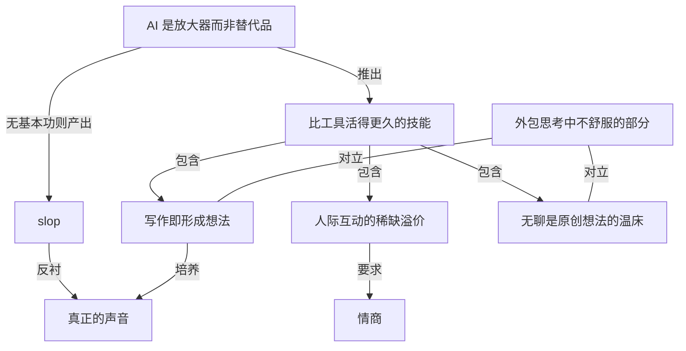

# IEEE Spectrum：AI 时代更重要的三种技能

- 原文标题：3 Skills That Will Matter More in the Age of AI
- 作者：spectrum.ieee.org
- 内参日期：2026-09-24
- 来源类型：blog
- 原文：https://spectrum.ieee.org/top-engineering-skills
- 标签：ai 时代, 个人成长

> 面向工程师的职业建议，讨论 AI 普及后哪些能力的价值会上升。

## 导读

AI 时代更重要的技能

## 核心观点

- 这是 IEEE Spectrum 职业通讯的一期，作者 Brian 以父亲的身份（孩子 9 到 20 岁）追问：在 AI 增强的职场里，到底希望孩子学会什么？
- 他的答案是三种「比工具活得更久」的技能：**学会写作、学会说话、学会无聊**。
- 底层判断：AI 是 **multiplier（放大器），不是 substitute（替代品）**。有基本功的人被放大成倍增产出，没基本功的人被放大成 **slop（AI 垃圾产出）**。
- 最大的风险不是 AI 变得太聪明，而是「我们太愿意把思考中不舒服的部分外包出去」。
- 结论压成一句：Write clearly. Speak confidently. Think independently. 再加一条：偶尔拥抱无聊。

## 问题的缘起：学校在摇摆，工作已经在变

- 暑假结束，孩子返校，作者开始认真想孩子们未来的职业会是什么样子。
- 学校对 AI 的态度两极：有的把 AI 引进课堂，有的完全禁止。作者坦承不确定哪一方找到了正确答案——「我不确定我们任何人找到了」。
- 但有一点确定：AI 已经在改变工程师以及几乎所有知识工作者的工作方式。
- 于是问题收敛为：为一个 AI-augmented workforce（AI 增强的劳动力市场），我真正希望孩子发展哪些技能？

## 技能一：学会写作（Learn to write）

- **AI 是放大器，不是替代品**
- 给一个优秀研究者 AI 工具，他能加速研究；给一个资深软件工程师同样的工具，他能以惊人的速度构建。
  - 但把工具交给「没有基础知识」的人，得到的常常是大家已经见得太多的东西：slop。
- **slop 的三种日常面孔**
- 勉强能跑的 vibe-coded 应用。
  - 收件箱里听起来「可疑地一模一样」的邮件。
  - 老师读到的论文像是同一个人写的——这个「人」姓 GPT。
- **当所有人都用同样的工具，拥有真正的声音（voice）就成为差异化因素**
- **写作反而因为 AI 更重要，而不是更不重要**（作者说这有点反讽）
- 实用层：文字仍是我们与模型沟通的主要方式，能清楚表达你想要什么，就能改善你得到的结果。
  - 更重要的一层：写作教会你**形成自己的想法**。
  - 金句：AI 可以帮你表达观点，但不应该替你制造观点。

## 技能二：学会说话（Learn to speak）

- 说话能力和写作一样变得溢价，但**理由不同**：不是因为要和模型沟通，而是因为人与人的互动变稀缺了。
- **一个奇怪的时刻**
- 我们前所未有地数字化连接，却常常感到越来越孤立。
  - 与此同时，人们对会议、线下聚会、社群和面对面体验重新产生兴趣。
  - 逻辑：当人际互动显得稀缺，沟通就变得更有价值。
- **具体要学的几件事**
- 在一屋子人面前解释一个想法。
  - 表达异议而不令人反感（disagree without being disagreeable）。
  - 讲一个故事、学会倾听、学会说服别人。
- **一本书的推荐**：90 年前出版的《人性的弱点》（How to Win Friends and Influence People）。作者认为它对工程师的价值，可能超过又一篇讲神经网络如何工作的白皮书。
- **AI 做不到的那一段**：AI 可以替你生成演示文稿，但无法在一群心存怀疑的听众面前令人信服地讲出来——那需要情商（emotional intelligence）。

## 技能三：学会无聊（Learn to be bored）

- 作者说这可能是最难的一项。
- **我们几乎把无聊从生活中工程化地消除了**
- 总有播客可听、通知可查、视频可看、信息流可刷，现在还多了一个可以聊天的 AI。
- **具体做法**
- 散步时不戴耳机。
  - 吃饭时不看手机。
  - 坐在车里不立刻伸手找东西填满沉默，让思绪游荡。
- **为什么**：无聊不是浪费时间，它是原创想法的温床（breeding ground for original ideas）。
- **作者真正担心的危险**：不是 AI 变得太聪明，而是我们太愿意把思考中不舒服的部分外包出去。

## 收束：为比工具活得更久的技能而教育

- 今天返校的学生将进入一个作者在他们这个年纪无法想象的技术环境；作者不知道那时主导的 AI 模型是什么，甚至不知道和电脑交互会是什么样子。
- 正因为不可预测，他**不想围绕今天的工具来优化孩子的教育**，而要让他们学会「比工具活得更久」的技能。
- 三件事对应三个动作：清晰地写（Write clearly）、自信地说（Speak confidently）、独立地想（Think independently）；再加上偶尔拥抱无聊。

## 通讯附带的三则延伸阅读

- **AI slop 正在改变工程师审查代码的方式**：代码审查进入新时代，正在测试的策略将决定 AI 是否真能在计入审查成本后提供更快更可靠的代码；如果能，对仍在自学编码的初级工程师意味着什么。
- **美国科技公司改变招聘国际人才的策略**：面对联邦政府限制合法移民的一系列动作（如 H-1B 签证申请费用提高的提案），科技公司在调整寻找顶尖人才的方式。
- **成为适应力强的工程师需要什么**：AI 改变就业市场和工程师日常工作，年轻人常被告知要有适应力；适应力的定义因人而异，但有了正确心态和领导层支持，它能帮你保持不被淘汰。

## 概念网络

### 关键概念

#### AI 是放大器而非替代品

**context**：作者用来统领全文的底层判断——"it's a multiplier, not a substitute"。优秀研究者和资深工程师拿到 AI 会成倍加速，没有基础知识的人拿到同样的工具则产出 slop。

**费曼一下**：AI 像一个音箱，它只会把你本来的声音放大。你唱得好，全场都听到好歌；你本来跑调，它就把跑调放大给所有人听。所以 AI 越强，你自己的底子就越重要，而不是越不重要。

#### slop（AI 垃圾产出）

**context**：作者对「没有基本功的人用 AI」结果的称呼，举了三种日常例子：勉强能跑的 vibe-coded 应用、听起来一模一样的邮件、像是同一个姓 GPT 的人写的学生论文。

**费曼一下**：slop 就是看起来像样、其实没有灵魂的大批量产出。它不一定错，但千篇一律、没有判断、没有个人痕迹。它的出现说明：工具把「做出来」的门槛降到了零，但没有把「做得好」的门槛降低。

#### 真正的声音作为差异化因素

**context**：作者在写作一节提出，"When everyone has access to the same tools, having an actual voice becomes a differentiator"——当所有人工具一样时，拥有自己的声音就是区别。

**费曼一下**：如果每个人都用同一台相机、同一个滤镜，照片就会越来越像。这时候让一张照片被认出来的，是拍照的人看世界的方式。写作里的 voice 也是这样：工具趋同之后，稀缺的是「这是你说的话」。

#### 写作即形成想法

**context**：作者认为写作重要的实用理由是文字仍是与模型沟通的主要方式，但"更重要的是，写作教会你发展自己的想法"，并落在一句话：AI 可以帮你表达观点，不应替你制造观点。

**费曼一下**：写作不只是把脑子里已有的东西倒出来，而是在写的过程中逼自己把模糊的感觉想清楚。如果让 AI 替你写，你省掉的恰恰是「想清楚」这一步——文字有了，观点却不是你的。

#### 人际互动的稀缺溢价

**context**：作者解释说话能力为何溢价：我们前所未有地数字化连接却越来越孤立，同时人们重新涌向会议、线下聚会和社群——"When human interaction feels scarce, communication becomes more valuable."

**费曼一下**：东西一稀缺就变贵。线上消息多到泛滥，真人面对面的交流反而少了，于是能在一屋子人面前把事情讲清楚、讲动人的能力就更值钱。这和写作的逻辑不同：写作是因为 AI 而更重要，说话是因为 AI 时代人更孤独而更重要。

#### 情商：AI 无法替代的交付环节

**context**：作者在说话一节的收尾——AI 能替你生成演示文稿，但无法在心存怀疑的听众面前令人信服地讲出来，"That takes emotional intelligence"。他还推荐《人性的弱点》，认为它对工程师可能比又一篇神经网络白皮书更有价值。

**费曼一下**：内容可以被机器生成，但「说服一个不信你的人」需要读懂对方的表情、情绪和疑虑，并当场调整。这件事发生在人和人之间，靠的是情商，不是信息量。

#### 无聊是原创想法的温床

**context**：第三项技能的核心论断——我们用播客、通知、视频、信息流和 AI 把无聊工程化地清除了，但"boredom isn't wasted time. It's a breeding ground for original ideas."

**费曼一下**：大脑只有在没被外界输入塞满的时候，才会自己开始游荡、把不相关的东西连起来，新想法就是这么冒出来的。每一段空白都被填满，你就只剩下消化别人的内容，没有时间生产自己的。

#### 外包思考中不舒服的部分

**context**：作者点明自己真正担心的危险："not that AI becomes too intelligent, but that we become too willing to outsource the uncomfortable parts of thinking."

**费曼一下**：思考里最费劲的部分——卡住、纠结、忍受不确定——恰恰是想法成形的地方。AI 让我们很容易跳过这段难受，但跳过它，也就跳过了真正的思考。危险不在机器变强，而在人变懒。

#### 比工具活得更久的技能

**context**：全文收束——作者无法预知孩子进入职场时主导的 AI 模型和交互方式，所以"I don't want to optimize their education around today's tools. I want them to learn the skills that will outlive the tools."

**费曼一下**：工具每几年就换一轮，围绕某个工具学的操作很快过时。写清楚、说明白、独立想，这些能力不依附于任何具体工具，换什么工具都用得上。越是看不清未来，越该押注不会过时的东西。

### 概念网络

- **总纲：AI 是放大器而非替代品 → 比工具活得更久的技能。** 全文的起点是一个判断：AI 放大的是人本来的能力。既然工具会不断更替、而被放大的永远是人的底子，那么教育就不该围绕今天的工具优化，而要押注「比工具活得更久」的技能。这是整篇从「学校该不该禁 AI」的摇摆，转向「该培养什么人」的枢纽。
- **写作这条线：放大器 → slop → 真正的声音 ← 写作即形成想法。** 放大器逻辑的负面结果是 slop：没有基本功的人借助 AI 批量产出千篇一律的东西。slop 越泛滥，拥有真正的声音就越成为差异化因素。而写作之所以能培养声音，不只因为文字是与模型沟通的接口，更因为写作的过程本身就是形成自己想法的过程——「AI 帮你表达，不替你制造」。
- **说话这条线：人际互动的稀缺溢价 → 情商。** 说话技能的溢价逻辑与写作不同：不是 AI 让它变重要，而是数字化连接下的孤立让真人交流变稀缺。稀缺推高价值，而能否在怀疑的听众面前完成说服，最终取决于情商——这正是 AI 能生成演示文稿却交付不了的那一段。
- **无聊这条线：无聊是原创想法的温床 ⟷ 外包思考中不舒服的部分。** 作者真正的忧虑是「外包思考中不舒服的部分」。它与两项技能构成对立：无聊是留给大脑自己游荡、产生原创想法的空白，而随时可得的内容和 AI 把这段空白填满了；写作是逼自己把想法想清楚的难受过程，而让 AI 代写把这段难受跳过了。三项技能在这里汇合：它们都是在保护「由自己完成的思考」。
- **收束：三个动作对应一个人。** Write clearly、Speak confidently、Think independently 分别对应写作、说话、无聊三条线，合起来就是「比工具活得更久的技能」的具体内容——一个在 AI 放大器面前仍然有自己的底子、自己的声音和自己的想法的人。

## 费曼 x3

AI 让「写出一篇像样的东西」变得几乎免费，于是像样的东西开始泛滥：勉强能跑的 vibe-coded 应用，可疑地一模一样的邮件，读起来像同一个人写的学生论文——那个人姓 GPT。这不是 AI 的失败，而是它最诚实的地方。它是一个放大器，不是替代品：落在优秀研究者和资深工程师手里，它让人成倍加速；落在没有基础的人手里，它把空洞也一并放大，成了 slop。

所以一个反直觉的结论成立了：AI 越强，人的底子越重要。第一项底子是写作。文字仍是我们和模型沟通的主要接口，能把想要什么说清楚，得到的就更好——但这只是次要理由。更要紧的是，写作本身就是形成想法的过程，你在落笔时才发现自己原来没想清楚。让 AI 代写，省掉的恰恰是这一步。当所有人都握着同一套工具，真正的声音才成为区别；AI 可以帮你表达观点，却不该替你制造观点。

第二项是说话，它变贵的理由完全不同。我们前所未有地彼此连接，却越来越孤立，于是人们又回到会议、聚会和社群里去。人与人的互动一稀缺，沟通就升值。能在一屋子人面前解释一个想法，能表达异议而不惹人反感，能讲故事、能倾听、能说服——这些都发生在人和人之间。AI 能替你生成一份演示文稿，却没法在一群心存怀疑的听众面前把它讲得令人信服，那需要情商。

第三项最难：学会无聊。我们几乎把无聊从生活里工程化地清除了，总有播客、通知、视频、信息流，现在还有一个随时可以聊天的 AI。可无聊不是浪费时间，而是原创想法的温床。散步不戴耳机，吃饭不看手机，坐进车里先别急着填满沉默——大脑只有在没被喂饱的时候，才会自己去游荡、去连接。

三件事指向同一个担忧：危险不是 AI 变得太聪明，而是我们太愿意把思考中不舒服的部分外包出去。写作的卡顿、面对怀疑者的紧张、空白时间里的无所适从，恰恰是思考真正发生的地方。没人知道十年后主导的模型是什么，甚至不知道那时人怎样和电脑打交道；正因为看不清，才不该围绕今天的工具来设计教育，而要去学那些比工具活得更久的东西。清晰地写，自信地说，独立地想——以及，时不时允许自己无聊一会儿。你上一次什么都不做、任由思绪游荡，是什么时候？

## 阅读原文

### This is what I want my kids to learn

Erik Vrielink

_This article is crossposted from _IEEE Spectrum_’s careers newsletter. [Sign up now](https://engage.ieee.org/Career-Alert-Sign-Up.html) to get insider tips, expert advice, and practical strategies, written in partnership with tech career development company [Parsity](https://www.parsity.io/) and _delivered to your inbox for free!

If you have kids, they’re probably back in school right now after the summer break. Mine are too.

My kids range from 9 to 20 years old, and lately I’ve been thinking a lot about what their future careers are going to look like.

Some schools are embracing [AI in the classroom](https://spectrum.ieee.org/ai-in-the-classroom). Others are banning it completely. I’m not sure either side has figured out the right answer yet—[I’m not sure any of us have](https://spectrum.ieee.org/ai-engineer-skills).

What I do know is that [AI is already changing how engineers, and nearly every other knowledge worker, does their job](https://spectrum.ieee.org/ai-code-review-software-engineers). So I’ve been thinking: What skills do I actually want my kids to develop for an AI-augmented workforce?

#### Learn to write

The more I use AI, the more convinced I am that it’s a multiplier, not a substitute.

Give a great researcher AI tools and they can accelerate their research. Give an experienced software engineer the same tools and they can build at an incredible rate. But put those tools in the hands of someone _without_ foundational knowledge and you often get something else you’re used to seeing way too much of: slop.

We’ve all seen the vibe-coded applications that barely work. Our inboxes are filled with emails that sound suspiciously identical. Teachers are reading papers that sound like they were all written by the same person. That “person” has the last name GPT.

When everyone has access to the same tools, having an actual voice becomes a differentiator.

Ironically, [strong writing skills](https://spectrum.ieee.org/ieee-course-technical-writing) might be MORE important because of AI, not less. Text is still the primary way we communicate with these models, so being able to clearly articulate what you want improves what you get back.

But more importantly, writing teaches you to develop ideas of your own.

AI can help you express your opinion. It shouldn’t manufacture one for you.

#### Learn to speak

Like written communication, speaking skills are now at a premium—but for a different reason.

We live in a strange moment. We’re more digitally connected than ever, while often feeling increasingly isolated from one another. At the same time, we’re seeing renewed interest in conferences, meetups, communities, and in-person experiences.

When human interaction feels scarce, communication becomes more valuable.

So [learn how to explain an idea in front of a room](https://spectrum.ieee.org/improve-public-speaking-skills). Learn how to disagree without being disagreeable. Learn how to tell a story. Learn how to listen. Learn how to persuade someone.

There’s a timeless book, originally published 90 years ago, that teaches these interpersonal skills, and it’s probably more valuable for engineers than another white paper on how [neural networks](https://spectrum.ieee.org/tag/neural-networks) work: [How to Win Friends and Influence People](https://icrrd.com/public/media/31-10-2020-083612How%20to%20Win%20Friends%20and%20Influence%20People%20-%20Dale%20Carnegie.pdf)_._

An AI can generate a presentation for you, but it can’t convincingly deliver it to a skeptical audience. That takes emotional intelligence.

#### Learn to be bored

This might be the hardest one.

We have engineered [boredom](https://spectrum.ieee.org/tips-for-bored-engineers) almost completely out of our lives. There’s always a podcast to listen to, a notification to check, a video to watch, a feed to scroll, or now an AI to talk to.

Go for a walk without headphones. Eat without looking at a phone. Sit in the car without immediately reaching for something to fill the silence, and let your mind wander.

Because boredom isn’t wasted time. It’s a breeding ground for original ideas.

The danger I worry about isn’t that AI becomes too intelligent, but that we become too willing to outsource the uncomfortable parts of thinking.

The students going back to school today will enter a workforce filled with technology that I couldn’t have imagined when I was their age. I have no idea what the dominant AI model will be by then or even what interacting with a computer will look like.

That’s exactly why I don’t want to optimize their education around today’s tools. I want them to learn the skills that will outlive the tools.

Write clearly. Speak confidently. Think independently.

And every once in a while, embrace boredom.

—Brian

### AI Slop Is Changing How Engineers Review Code

Software engineers have entered a new era of code review. The strategies they’re now testing will determine whether AI can actually provide code that’s faster and more reliable when you factor in the review process. If it can, what does that mean for the entry-level engineers who are still learning to code on their own?

Read more [here](https://spectrum.ieee.org/ai-code-review-software-engineers).

### U.S. Tech Firms Change Strategies to Hire International Talent

In response to a barrage of actions by the U.S. federal government to limit legal immigration, tech companies are adapting their search for top talent. _IEEE Spectrum_ looked into the responses to proposed changes, like higher fees for [H-1B](https://spectrum.ieee.org/tag/h-1b) visa applications.

Read more [here](https://spectrum.ieee.org/h-1b-visa-us-government).

### What It Takes to Be an Adaptable Engineer

As AI changes the [job market](https://spectrum.ieee.org/tag/job-market) and day-to-day work of engineers, young professionals are often told they need to be adaptable. But what does adaptability actually look like in practice? The skill has different definitions depending on who you ask, but with the right mindset and support from leadership, adaptability can help keep you afloat.

Read more [here](https://spectrum.ieee.org/adaptable-engineer-core-skills).
