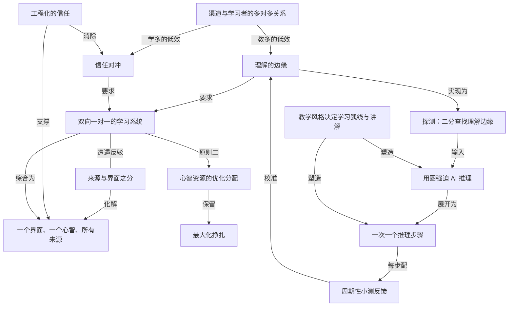

# 我怎样用 AI 学东西

- 原文标题：How I Use AI to Learn Things
- 作者：Eero Alvar
- 内参日期：2026-09-24
- 来源类型：YouTube
- 原文：https://www.youtube.com/watch?v=kzcI5F4tGiU
- 标签：教育, 学习型家庭

> 作者从「一对多教学、多对多学习」的低效出发，提出一对一 AI 学习方法并现场演示，附开源 repo。

## 导读

如何用 AI 学东西？

## 核心观点

- AI 应该是优化学习的完美工具，但「怎么用」还不清楚。作者分享自己当前的方案：先讲设计背后的推理，再做一次真实学习的现场演示（学微分形式）。
- 传统学习是**多对多**关系：一个教学渠道（outlet：老师、书、课程）教很多学生，一个学生从很多渠道学。两个方向各自产生一种低效。
- 理想状态是**双向一对一**：一个老师只有一个学生（教学贴合这个人的理解边缘），一个学生只有一个老师（一个值得信任的统一界面）。AI 让这件事第一次变得可行。
- 由此得出系统的两条原则：**优化教学**、**优化心智资源分配**。不是消除困难，而是「把所有认知功夫集中到材料本身」——要「最大化挣扎」，但挣扎只能发生在材料里，不能耗在后勤上。
- 实现上分三阶段：**探测（probe）→ 规划（plan）→ 教学（teach）**，教学中贯穿周期性小测反馈。
- 结尾自陈：系统之所以好用，真正的原因不是这些工程设计，而是背后的**教学风格**——它决定了两件事：学习弧线（从当前理解到目标理解的路径）和沿途每一步的讲解。

## 第一种低效：一个渠道教很多人

- 为很多人设计的渠道，不可能对其中任何一个人最优。
- 「最优」教学完全取决于学习者**当前的理解**，包括两层：
- 整条教学弧线：从当前理解到目标理解。
  - 沿途的每一个解释。
- 最优教学路径 = 尽量少教学习者已经掌握的东西，也尽量少教他们还理解不了的东西。
- 也就是说，它应该恰好工作在**理解的边缘（the edge of their understanding）**。
- 结论：理想情况下，一个老师只有一个学生。

## 第二种低效：一个学生跟很多渠道学

- 表层成本：许多教学风格要适应、许多记号体系、许多可靠性等级、许多界面；在它们之间切换耗费的心力，都没有花在学习材料上。
- 更深层的成本是**信任**：
- 面对不熟悉的渠道，大脑会「对冲（hedge）」——在渠道证明自己之前，不会完全接受一个事实。
  - 例子：想理解毛球定理（hairy ball theorem），有两份一模一样的解释，一份在 3Blue1Brown 的视频里，一份是 X 上某个随机网友发的。解释完全相同，但从熟悉来源学得更好——大脑信任渠道时，内化信息要容易得多。
- 结论：理想情况下，一个学生只有一个老师。

## 回应「只有一个视角」的反驳

- 显而易见的反驳：只有一个老师，就只剩一个视角。
- 作者认为这个反驳混淆了**来源（source）**与**界面（interface）**：
- 一个老师并不减少来源和视角的数量，而是把它们全部**聚合**起来，通过一个界面交付。
  - 所以并不会失去多元视角。
- AI 当老师时，信任不是靠时间慢慢建立的，而是**被工程化进系统里**。可靠的核查与事实校验有两个理由：
- 一是信息正确，绝不能让 AI 幻觉出错误内容。
  - 二是当我们知道系统可靠时，学习本身会更容易。
- 一句话概括：**一个界面，贴合一个心智，覆盖所有来源**（one interface fitted to one mind over all sources）。

## 两条原则：优化教学 + 优化心智资源分配

- 两种低效分别对应两条原则：
- 优化教学 → 回应「一教多」。
  - 优化心智资源分配 → 回应「一学多」。
- 这不等于移除困难，而是把所有认知工作集中到材料本身。
- 「我们想要**最大化挣扎**」——学难的东西，挣扎非常重要；但挣扎必须在材料里，而不是在后勤里：
- 规划、找资源、核实事实、决定学什么和按什么顺序学——这些全都应由系统吸收。

## 实现流程：探测 → 规划 → 教学

- **阶段一：探测（probe）**
- 要最优地教，系统必须知道这个人确切的当前理解，所以必须测量。
  - 用一个小测工具（quiz tool）出分级的选择题：从很宽泛开始，然后在课程将依赖的每一条可能知识线上**二分查找理解边缘**。
  - 结果是一张学习者理解的详细地图，据此定制教学。
- **阶段二：规划（plan）**
- 把一切推理清楚：「我怎么把这个具体东西教给这个心智？」
  - 在这里派出第一批核查与事实校验子 agent（sub-agent）。
  - 把计划呈现为 mermaid 图。展示图有两个理由：
- 让学习者对接下来的内容心里有数。
    - 真正的原因：**强迫 AI 把一切推理清楚**，它不能作弊、不能临场糊弄（wing it）。
- **阶段三：教学（teach）**
- 这一阶段因人而异，完全取决于你想怎么学——应当把你自己的学习哲学和最适合自己的学法装进系统。
  - 不论学法如何，有一个细节都重要：**反馈**。AI 会周期性小测，检查你是否真的理解。理由有三：
- 一是很容易「煤气灯自己（gaslight yourself）」，以为自己懂了，用 AI 学时尤其如此；真实测试理解是给自己的重要反馈。
    - 二是系统需要持续反馈来保持校准。
    - 三是应用材料、做练习题本身就帮助学习，是新理解「锁定」的一部分。

## 现场演示：用系统学微分形式

- **环境与工具**
- 在 Pi Agent harness 的学习目录下运行；`.pi` 文件夹里有 teach skill、可视化相关内容、quiz 扩展、MD log 扩展，以及两个用来做视觉图的子 agent。
  - 学习目标：接续上一期学习相关视频中提到的——麦克斯韦方程组可以用微分形式写成两个方程。作者对微分形式几乎一无所知。
  - 用 Obsidian 作为「一切的 UI」：MD log 扩展把 Markdown 文件关联到会话，所有输出打印进去，有 LaTeX 渲染，也留下每次学习会话的持久化产物。
  - 选用高智能模型，因为作者发现「模型的智能在教学中真的很重要」，教学指令相当具体。
- **探测阶段实况**
- 问题从线积分开始：力场沿曲线的线积分算的是什么？作者答「场对粒子做的净功」，并指出另一选项只对保守场成立。
  - 接着是散度（某点单位体积的净外向通量）、斯托克斯定理、法拉第电磁感应定律，一路问到狭义相对论：换到运动参考系时电场和磁场会怎样？作者答「不知道」，正确答案是「它们会混合」。
  - 作者提示：开头给的上下文越少，探测阶段越长；也可以一开始就说明自己已经很熟的内容。
  - 探测结束后系统对他的理解有了很细的图像，这也是很好的热身；「我什么都不用操心，只管答题，后勤全由它处理」。
- **规划阶段实况**
- 研究者子 agent 在做事实校验；作者承认数学通常不太需要核查，但这是好习惯。
  - 计划以 mermaid 图在 Obsidian 中呈现；路径会在抵达最终目标前先到达广义斯托克斯定理。
- **教学阶段实况**
- 用可视化 skill 生成 SVG；放在子 agent 里做，一是节省上下文，二是子 agent 会**看图验证**是否画对，写完、查看、修改、再看。
  - 系统「沿着路径慢慢走，一次一个推理步骤」。作者对比：你跟 ChatGPT 之类聊天让它讲东西，它通常「太兴奋」，一口气冲完整个内容。
  - 引入余向量（co-vector），给 dx 一个新视角；随后就这一步出题确认理解，例如给定 α 和向量 V 求 α(V)，答案 -4。「图帮了忙。」
  - 从余向量扩展到余向量场，线积分获得新的理解视角；「一维对象上的积分就是一形式的积分」「K-形式就是 K 维曲面能『吃』的那种东西」。
  - 系统会把可以直接接受的结论明确交代出来；每一步都很好消化，任何时候有疑问都能问，它不会往前冲。
  - 楔积（wedge product）：双线性且反对称的机器；「最小的修补是书里最老的把戏」得到反对称。
  - 作者不在意 AI 的说话腔调（「不是 X，而是 Y」这类 LLM 腔），因为不想为此塞太多指令——「教学质量才是关键」。
  - 演示在接近广义斯托克斯定理时停下；系统本质上是在「沿着依赖树（DAG）往下走」。

## 结语：真正起作用的是教学风格

- 这期视频讲的其实是：如何把一种学习哲学 / 教学方式实现为一个 AI 系统。
- 作者坦言，系统对他效果这么好，主要原因不是本期讲的这些设计，而是上一期视频里讲的**教学风格**，它恰好影响两件事：
- 学习弧线：从当前理解到目标理解要走的路径。
  - 沿途每一步的具体讲解。
- 作者邀请观众分享自己怎样用 AI 学习、系统还能怎样改进。

## 概念网络

### 关键概念

#### 渠道与学习者的多对多关系

**context**：作者分析「标准学习方式」的起点：老师、书、课程等每个 outlet 都为很多学生设计，每个学生又从很多 outlet 学，「there's a many-to-many relation between the learners and the outlets」，两个方向各自产生低效。

**费曼一下**：想象一张连线图，左边一堆老师，右边一堆学生，线交织成网。一个老师要照顾所有人，所以讲得不可能正好适合你；你要从好多老师那里拼凑知识，所以光适应他们就累。问题不在某个老师不好，而在这种结构本身。

#### 理解的边缘

**context**：作者对「最优教学」的定义：最小化教学习者已经掌握的，也最小化教他们还理解不了的，因此「work exactly at the edge of their understanding」。探测阶段的二分查找就是在找这条边缘。

**费曼一下**：学东西最有效的位置，是「刚好够不着、踮一下脚能够到」的地方。讲你已经懂的，是浪费时间；讲你还接不住的，是对牛弹琴。好老师的全部本事，就是一直把内容卡在你理解的那条边线上。

#### 信任对冲

**context**：作者认为「一学多」最深的成本是信任：面对陌生渠道，大脑会 hedge，在渠道证明自己之前不会完全接受一个事实。毛球定理的例子——同一份解释，出自 3Blue1Brown 比出自 X 上随机网友更容易被内化。

**费曼一下**：你心里有个保安，陌生人说的话他会先扣一半，等验证了再放行。这个保安的犹豫是有成本的：内容一模一样，但你对来源不放心，就学得没那么进去。换一个你信任的讲者，同样的话就直接进了脑子。

#### 来源与界面之分

**context**：用来回应「只有一个老师就只有一个视角」的反驳：这个反驳「conflates a source with an interface」。老师不减少来源和视角，而是把它们聚合起来，通过一个界面交付。

**费曼一下**：一个好厨师并不意味着你只吃一种食材，他从全世界的市场采购，但端到你面前的是一桌配好的菜。「来源」是食材有多少，「界面」是谁替你配菜。只有一个界面，不等于只有一个来源。

#### 工程化的信任

**context**：「With AI being the teacher, trust isn't really built over time. Rather, it's engineered into the system.」可靠的核查和事实校验既保证信息正确、防幻觉，也因为「知道系统可靠」本身让学习更容易；规划阶段会派出核查子 agent。

**费曼一下**：对人类老师的信任要慢慢攒，上过几次课才放心。对 AI 老师，可以把「让人放心」直接做进流程：每个事实都有专人去核。系统可靠，你心里的那个保安就可以下班，精力全部拿去学。

#### 一个界面、一个心智、所有来源

**context**：作者对理想形态的一句话概括：「one interface fitted to one mind over all sources」，是两个方向都一对一之后的综合。

**费曼一下**：三件事同时成立：你只需要面对一个讲者（省掉切换和不信任），这个讲者只为你一个人量身讲（卡在你的理解边缘），而它背后汇集了所有来源（不丢视角）。这就是 AI 第一次让「一对一家教」规模化的样子。

#### 心智资源的优化分配

**context**：第二条原则，对应「一学多」的低效。规划、找资源、核实事实、决定学什么和顺序，「All of that is for the system to absorb」，认知功夫只留给材料本身。

**费曼一下**：学习时你的脑力是有限预算。花在「该看哪本书」「这个说法对不对」「下一步学什么」上的每一分，都没花在真正要学的东西上。好的系统像一个管家，把这些杂事全揽走，你只管啃硬骨头。

#### 最大化挣扎

**context**：作者强调优化不等于移除困难：「We want to maximize struggle」，学难的东西，挣扎很重要，但必须在材料里，而不是在后勤里。

**费曼一下**：健身不是要让举铁变轻，而是别让你把力气浪费在找器材、排队、看说明书上。学习也一样：真正让你长本事的，是和概念本身较劲的那种吃力。系统要消灭的是无谓的累，而不是有用的难。

#### 探测：二分查找理解边缘

**context**：阶段一 probe：用 quiz tool 出分级选择题，「starts off with very broad and then basically binary search is the edge on every possible strand that the lesson will depend on」，得到学习者理解的详细地图。

**费曼一下**：像医生先做体检再开方子。系统先问宽问题，答对就往深问，答错就往浅退，很快在每条相关知识线上找到你「会」和「不会」的分界。它拿到的是一张你脑子里的地图，之后的课就按这张图来排。

#### 用图强迫 AI 推理

**context**：阶段二 plan 把计划呈现为 mermaid 图，一个理由是让学习者知道接下来学什么，但「the actual reason I implemented it is to actually force the AI to reason everything out」，让它「cannot just cheat and wing it」。

**费曼一下**：要求学生交作业时画出解题思路图，他就没法靠感觉蒙答案。对 AI 也一样：让它先把整条教学路径画成依赖图，它就必须真的想清楚先讲什么、后讲什么，而不是边讲边编。

#### 周期性小测反馈

**context**：教学阶段无论什么学法都重要的细节：AI 周期性出题检查是否真懂。三个理由：防止「gaslight yourself」以为懂了（用 AI 学时尤甚）；系统需要持续反馈保持校准；应用与练习本身帮助理解「lock in」。

**费曼一下**：听懂和真懂之间隔着一道题。AI 讲得太顺，你很容易点头说「懂了」，其实只是觉得熟。小测把这层错觉戳破；同时也告诉系统你学到哪了；而做题这个动作本身，就是把知识钉进脑子的钉子。

#### 一次一个推理步骤

**context**：演示中作者最看重的特性：系统「slowly walk down the path, one reasoning step at a time」，每步出题确认；对比 ChatGPT 之类通常「way too excited」、一口气冲完。它本质上是在「walking down the dependency tree」。

**费曼一下**：好老师爬楼梯是一级一级带你走，每上一级确认你站稳了再迈下一步。聊天机器人的默认毛病是一口气把你拽上十层楼，你到了顶却不知道怎么上来的。慢，恰恰是让每一步都能被消化的方法。

#### 教学风格决定学习弧线与讲解

**context**：结语中作者坦言系统效果好的主因不是本期的工程设计，而是上一期讲的教学风格，它「affects exactly two things」：学习弧线（从当前理解到目标理解的路径）与沿途每一步的讲解。

**费曼一下**：工具只是容器，装进去的是一种教学哲学。探测、规划、小测这些机制，是为了让那种教法能落地；真正决定你学得好不好的，仍然是「走哪条路」和「每一步怎么讲」这两件事。

### 概念网络

全文的概念网络从一个结构诊断出发：**渠道与学习者的多对多关系**。它向两个方向各自生出一种低效，于是网络有两条主干。

第一条主干是「一个渠道教很多人」。因为最优教学完全取决于学习者当前的理解，为众人设计的渠道注定偏离**理解的边缘**——要么重复你已懂的，要么讲你接不住的。第二条主干是「一个学生跟很多渠道学」。表层是切换风格、记号和界面的心力损耗，深层是**信任对冲**：大脑对陌生来源先打折扣，同样的解释学得更差。两条主干共同指向同一个理想——双向一对一：老师只有一个学生，学生只有一个老师。

这个理想立刻遭遇「只剩一个视角」的反驳，**来源与界面之分**就是化解它的枢纽：一个老师聚合所有来源、只提供一个界面。**工程化的信任**则从另一侧补上：AI 老师的可信不靠时间积累，而靠系统内置的核查，它既消除信任对冲，又让单一界面值得依赖。三者合流，得到全文的综合表述——**一个界面、一个心智、所有来源**。

从两种低效推出两条原则。「优化教学」对应理解的边缘；「优化心智资源分配」对应一学多的损耗。后者有一个关键限定，即**最大化挣扎**：分配优化不是减少困难，而是把挣扎从后勤中剥离、全部集中到材料本身。两者是「移走什么」与「留下什么」的一体两面。

实现层把原则落成流程，呈一条因果链。**探测：二分查找理解边缘**是「理解的边缘」的操作化，产出一张理解地图；这张地图喂给规划阶段，**用图强迫 AI 推理**让系统把教学路径显式画成依赖图、无法临场糊弄；教学阶段沿图展开为**一次一个推理步骤**，每一步配以**周期性小测反馈**。小测又回流到起点：它既戳破学习者「以为懂了」的错觉，也为系统持续校准理解边缘，使整个循环闭合。

最后，**教学风格决定学习弧线与讲解**位于整张网络之上，是作者自认的真正动因。前面所有机制只是容器：规划阶段的依赖图对应「学习弧线」，一次一步的推进对应「沿途讲解」，而决定这两者质量的是装进系统的教学哲学。工程设计与教学风格之间是载体与内容的关系。

## 费曼 x3

用 AI 学东西，最常见的样子是开一个聊天框问问题。它答得又快又流畅，你点头，觉得懂了。可这恰恰是问题所在：它太兴奋，一口气冲完整个内容；你太容易被流畅感说服，把「觉得熟」当成「真的懂」。好的 AI 学习系统，要解决的不是「怎么让 AI 讲得更多」，而是「怎么让它像一个只为你一人服务的好老师那样讲」。

先看传统学习错在哪。老师、书、课程，每一个都为很多人设计；每个学生又要从很多来源拼凑知识。前一个方向注定低效：最优的教学只取决于你此刻的理解，应当恰好卡在「理解的边缘」——不重复你已懂的，也不讲你还接不住的，而为众人准备的材料不可能对准任何一个人。后一个方向的代价更隐蔽：除了适应不同风格、记号和界面的消耗，还有信任。同一段关于毛球定理的解释，出自 3Blue1Brown 和出自社交网络上的陌生人，你学进去的程度完全不同，因为大脑在来源证明自己之前会「对冲」，不肯全盘接受。所以理想是双向一对一：一个老师只有一个学生，一个学生只有一个老师。

有人会说，只跟一个老师，岂不是只剩一个视角？这是把来源和界面混为一谈。一个好老师并不减少来源，而是把所有来源聚合起来，通过一个界面交给你。AI 做老师还有一个人类老师没有的优势：信任不必靠时间慢慢攒，可以直接做进系统——每个事实都派人去核查。于是得到一个干净的目标：一个界面，贴合一个心智，覆盖所有来源。

这里最容易误读的一点是：优化学习不等于让学习变轻松。恰恰相反，要「最大化挣扎」，只是挣扎必须发生在材料本身，而不是耗在找资源、定顺序、核事实这些后勤上。系统要消灭的是无谓的累，保留的是有用的难。落到流程上就很自然了：先用分级小测做二分查找，摸清你在每条相关知识线上的边缘；再把教学路径画成依赖图，这不只是给你看，更是强迫 AI 把一切推理清楚、没法临场糊弄；然后一次只走一个推理步骤，每走一步就考你一下。小测之所以不可或缺，是因为用 AI 学时特别容易自我欺骗，而做题本身正是新理解锁定下来的方式。

但最诚实的结论是：这些机制只是容器。真正决定你学得好不好的，始终是两件事——从现在的理解走到目标理解要走哪条路，以及路上每一步怎么讲。AI 能做的，是第一次让一种好的教学方式为一个人量身运行。那么，你自己的教学哲学是什么？
