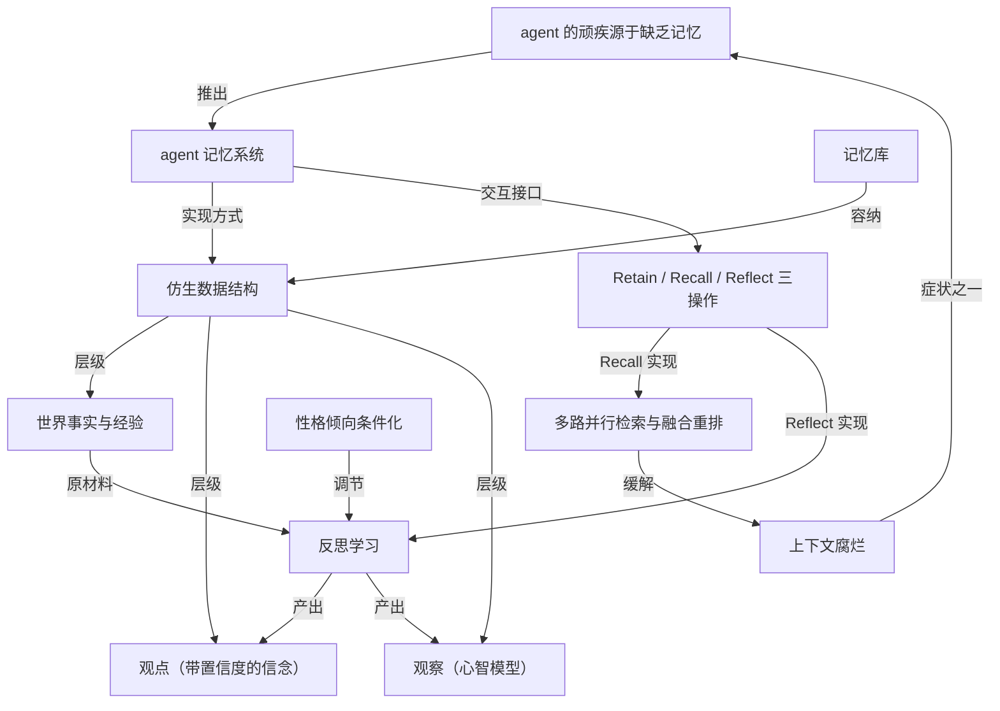

# Hindsight：会学习的 agent 记忆开源库

- 原文标题：vectorize-io/hindsight
- 作者：GitHub
- 内参日期：2026-09-25
- 来源类型：blog
- 原文：https://github.com/vectorize-io/hindsight
- 标签：记忆系统, agents, ai 开源

> vectorize-io 开源的 Python agent 记忆项目，GitHub 上已有约 2.7 万星，可以作为 agent 长期记忆方案的试用候选。

## 导读

GitHub repo 欣赏

## 核心观点

- Hindsight 是一个开源（MIT 许可）的 agent 记忆系统，目标是造出“随时间学习”（learn over time）的更聪明的 agent。
- 它的核心判断：agent 的许多顽疾——不一致、幻觉、认知过载——都直接源于“缺乏记忆”；而主流方案（RAG、知识图谱、基础向量检索）不足以解决。
- 它的解法是“仿生数据结构”（biomimetic data structures）：像人类记忆那样把记忆分成世界事实、经验、观点、观察四类，并用 Retain / Recall / Reflect 三个操作与之交互。
- 其中 `reflect` 是关键：它让 agent 从经验中形成新的观点和观察，记忆因此不只是存取，而是能“学习”。
- 性能上，Hindsight 声称在 LongMemEval 长期记忆基准上达到 SOTA（91.4%），部分数据经第三方研究合作者复现。

## 问题：agent 的顽疾源于缺乏记忆

- 构建 agent 的 AI 工程师普遍遇到的挑战，“很多直接源于缺乏记忆”。
- 三个典型症状及记忆的作用：
- **不一致（Inconsistency）**：同一个任务这次成功、下次失败。记忆让 agent 记住“什么有效、什么无效”，减少错误、提升一致性。
  - **幻觉（Hallucinations）**：长期记忆可预先灌入外部知识，把 agent 行为锚定在可靠来源上，补充训练数据。
  - **认知过载（Cognitive Overload）**：工作流变复杂后，检索结果、工具调用、用户消息和 agent 回复塞满上下文窗口，导致“context rot”（上下文腐烂）。短期记忆优化帮助 agent 删掉无关细节、减少 token、聚焦上下文。

## 差异：用仿生结构组织记忆

- 大多数 agent 记忆实现依赖“基础向量检索”，有时加一个知识图谱；Hindsight 则用更接近人类记忆运作方式的仿生数据结构。
- 四类记忆（原文用“炉子很烫”一以贯之地举例）：
- **World（世界事实）**：关于世界的事实——“炉子会变烫”。
  - **Experiences（经验）**：agent 自己的经历——“我碰了炉子，真的很疼”。
  - **Opinion（观点）**：带置信度的信念——“我不该再碰炉子”（置信度 .99）。
  - **Observation（观察）**：对事实和经验反思后得出的复杂心智模型——“卷发棒、烤箱和火也很烫，这些我也不该碰”。
- 记忆存放在 bank（记忆库）中；新记忆先进入“世界事实”或“经验”两条通路之一，再被表示为实体、关系、时间序列的组合，并配以稀疏/稠密向量表示，便于日后召回。
- 与系统交互只有三个简单方法：
- **Retain**：提供你希望它记住的信息。
  - **Recall**：从记忆中检索。
  - **Reflect**：对已有记忆和经验进行反思，生成新的观察与洞见。

## 会学习的记忆：reflect 的角色

- Hindsight 的关键目标是让 agent 随时间学习和改进，这正是 `reflect` 操作的职责：让 agent 逐步形成更宽泛的观点与观察。
- 例子：一个产品支持 agent 帮用户排查问题，使用了它在某个 MCP server 上找到的 `search-documentation` 工具；对话后段发现工具返回的文档并不是用户问的那个产品。
- 这就成了记忆库中的一段“经验”。
  - “就像人类一样”，我们希望 agent 从这段经验中学习。
- 随着经验累积，`reflect` 让 agent 形成关于“什么有效、什么无效、下次遇到类似任务该怎么做”的观察。

## 性能：LongMemEval 基准 SOTA

- LongMemEval 是被广泛用于评估对话式 AI 各类场景下记忆系统表现的基准；截至 2025 年 12 月，Hindsight 报告达到 state-of-the-art。
- 数据可信度的说明：
- Hindsight 与 GPT-4o（全上下文）的数据由弗吉尼亚理工 Sanghani 人工智能与数据分析中心和《华盛顿邮报》的研究合作者复现。
  - 其他厂商的分数为自报。
- 技术细节与基准拆解发布在 arXiv 论文中，正准备投稿会议、进入同行评审；另提供可视化基准浏览器，后续改进的数据也会在此更新。

## 上手方式

- **Docker（推荐）**：一条 `docker run` 启动，通过环境变量指定 LLM API key 与模型（示例为 `o3-mini`）；API 端口 8888、UI 端口 9999。
- LLM 提供方可通过 `HINDSIGHT_API_LLM_PROVIDER` 切换，支持 `gemini`、`groq`、`ollama`、`openai`。
- **客户端**：Python（`hindsight-client`）与 Node.js（`@vectorize-io/hindsight-client`）；示例中三个操作分别是 `client.retain`、`client.recall`、`client.reflect`，都以 `bank_id` 指定记忆库。
- **Python 嵌入式（无 Docker）**：`hindsight-all` 包，用 `HindsightServer` 上下文管理器在进程内起服务。
- 其他接入方式还有 REST API 与 CLI。

## 架构与三大操作

### Retain：写入记忆

- `retain` 把新记忆推入 Hindsight，可附带 `context`（如“career update”）和 `timestamp`。
- 幕后流程：用 LLM 抽取关键事实、时间数据、实体和关系；再经规范化（normalization）转成规范实体、时间序列、检索索引和元数据。
- 这些表示为后续 recall 与 reflect 的准确检索“铺好通路”。

### Recall：检索记忆

- 可从任意记忆类型（世界、经验等）召回，支持时间类查询（如“六月发生了什么”）。
- 并行执行 4 种检索策略：
- **Semantic**：向量相似度。
  - **Keyword**：BM25 精确匹配。
  - **Graph**：实体/时间/因果链接。
  - **Temporal**：时间范围过滤。
- 各路结果合并后，用倒数排名融合（reciprocal rank fusion）和 cross-encoder 重排模型按相关性排序；最终输出按 token 上限裁剪。

### Reflect：反思与学习

- `reflect` 对已有记忆做更彻底的分析，让 agent 在记忆之间建立新联系，并持久化为观点和/或观察——这是“让 agent 从经验中学习”的关键能力。
- 适用场景举例：
- AI 项目经理反思项目中需要化解哪些风险。
  - 销售 agent 反思为何某些外联消息有回应、另一些没有。
  - 支持 agent 反思客户有哪些问题是现有产品文档没有回答的。
- 也可用于需要深入思考的按需问答或分析；快速上手示例中称其为“disposition-aware response”（带性格倾向的回答）。

## 项目信息

- 提供文档、论文、Cookbook 和托管版 Hindsight Cloud；社区在 Slack 与 GitHub Issues。
- MIT 许可，由 Vectorize 团队构建。

## 概念网络

### 关键概念

#### agent 记忆系统

**context**：Hindsight 自我定位为“an agent memory system built to create smarter agents that learn over time”，并把不一致、幻觉、认知过载归因于“a lack of memory”。

**费曼一下**：大模型本身每次对话都像失忆的人，只靠眼前这张纸（上下文）办事。记忆系统就是给它配一个会整理的笔记本：做过什么、学到什么都记下来，下次需要时翻出相关的几页。没有它，agent 永远是第一天上班的新人。

#### 仿生数据结构

**context**：原文对比“basic vector search”和知识图谱，称 Hindsight 用“biomimetic data structures”以更像人类记忆的方式组织 agent 记忆。

**费曼一下**：不是把所有东西扔进一个大箱子按相似度捞，而是模仿人脑的分工：客观知识、亲身经历、自己的信念、总结出的规律各放各处。分开放，才能分别对待——事实可以查证，信念可以调整置信度，规律可以不断修正。

#### 世界事实与经验

**context**：四类记忆中的前两类，“World: Facts about the world”与“Experiences: Agent's own experiences”；新记忆写入时先进入这两条通路之一。

**费曼一下**：“炉子会烫”是世界事实，谁都一样；“我碰了炉子很疼”是经验，只属于这个 agent。区分二者的意义在于：事实告诉你世界是什么样，经验告诉你你在这个世界里做过什么、结果如何——后者才是学习的原材料。

#### 观点（带置信度的信念）

**context**：“Opinion: Beliefs with confidence scores”，例子是“I shouldn't touch the stove again”（.99 置信度）；reflect 流程会创建或更新观点并调整置信度。

**费曼一下**：观点是从经验里长出来的判断，但它不是铁律，而是带一个“我有多确定”的分数。新的经验可以加强它，也可以削弱它。给信念标上置信度，agent 才能既敢于行动，又留有改主意的余地。

#### 观察（心智模型）

**context**：“Observation: Complex mental models derived by reflecting on facts and experiences”，例子是从“炉子烫”推广到“卷发棒、烤箱和火也烫”。

**费曼一下**：观察是举一反三的结果：不只记住“这个炉子烫”，而是抽象出“会发热的东西都别碰”。它是记忆里层级最高的一类，把零散的事实和经验压缩成可迁移的规律，是 agent 真正“变聪明”的地方。

#### 记忆库（memory bank）

**context**：“Memories in Hindsight are stored in banks”，所有 API 调用都以 `bank_id` 指定目标库。

**费曼一下**：记忆库就是一个独立的笔记本。不同的 agent、不同的用户或不同的项目可以各用一本，互不串味。它是记忆的边界和归属单位。

#### Retain / Recall / Reflect 三操作

**context**：Hindsight 提供“three simple methods to interact with the system”：存入、检索、反思。

**费曼一下**：记、查、想。前两个是所有记忆系统都有的，第三个才是 Hindsight 的招牌：不是等人问才去翻笔记，而是主动回头看自己记下的东西，从中总结新结论并写回去。三个动词覆盖了记忆从进来、被用、到自我更新的完整生命周期。

#### 反思学习（reflect）

**context**：“This is the role of the `reflect` operation”——让 agent 形成更宽泛的观点与观察；产品支持 agent 用错文档工具的例子。

**费曼一下**：人之所以能从错误中进步，是因为事后会复盘：“那次为什么搞砸了？下次该怎么做？”reflect 就是 agent 的复盘。它把一次次经验加工成观点和观察，下一次遇到类似任务时，agent 不再是从零开始，而是带着教训上阵。这也正是项目名 Hindsight（后见之明）的含义。

#### 上下文腐烂（context rot）

**context**：在“认知过载”症状中，检索、工具调用、消息和回复“grow to fill the context window leading to context rot”。

**费曼一下**：桌上堆的纸越多，越找不到要用的那张，甚至被无关的纸带偏。上下文窗口也一样，塞满之后模型表现反而变差。解决办法不是更大的桌子，而是有人帮你把不相关的纸收走——这就是短期记忆优化的作用。

#### 多路并行检索与融合重排

**context**：Recall 并行执行语义、关键词（BM25）、图、时间四种检索，再用“reciprocal rank fusion and a cross-encoder reranking model”排序，最后按 token 上限裁剪。

**费曼一下**：找东西时同时派四个人：一个按意思找，一个按字面找，一个顺着人物和因果关系找，一个按时间找。四份名单汇总后，先按“在几份名单里都靠前”粗排，再请一位细心的评审逐条判断相关性精排，最后只留下装得进上下文的那几条。多路互补，比任何单一方法都不容易漏。

#### 性格倾向条件化（disposition）

**context**：快速上手中称 reflect 生成“disposition-aware response”；reflect 流程图中 LLM 生成会加载 agent 的性格倾向（怀疑、字面、共情）与背景设定。

**费曼一下**：同样的记忆，交给一个多疑的人和一个共情的人，得出的结论会不同。Hindsight 让 agent 的“性格”参与反思和回答，这样形成的观点就带着这个 agent 自己的立场，而不是千篇一律。

### 概念网络

整个网络从一个诊断出发：agent 的不一致、幻觉和认知过载（其中上下文腐烂是最具体的一种症状）都源于缺乏记忆，由此推出需要一个专门的 agent 记忆系统。

系统的组织方式是仿生数据结构，它构成一个由低到高的层级：世界事实与经验是直接写入的底层原材料，观点是从经验中长出的带置信度判断，观察是对事实与经验抽象后的心智模型。记忆库是这一切的容器与边界。

交互接口 Retain / Recall / Reflect 分别对应“写入—检索—学习”三个环节。Recall 通过多路并行检索与融合重排实现，同时借 token 预算裁剪直接回应上下文腐烂问题；Reflect 实现反思学习，把世界事实与经验加工成观点与观察并回写记忆库，形成闭环——这个闭环正是“会学习的记忆”区别于普通 RAG 的地方。

性格倾向条件化作用在反思环节上，让同一批记忆经由不同 agent 的立场生成不同的观点，使学习结果带有个体性。由此，仿生分层回答“记什么”，三操作回答“怎么用”，反思闭环回答“怎么变聪明”。

## 费曼 x3

一个 agent 周一成功完成了任务，周二用同样的方法却失败了。问题往往不在模型不够聪明，而在它根本不记得周一发生过什么。每一次调用都是从零开始的新人，犯过的错会原样再犯一遍。所以 agent 真正缺的不是更大的上下文窗口，而是一种能从经历中学习的记忆。

多数记忆方案的思路是存取：把东西向量化扔进库里，需要时按相似度捞回来。这只解决了“记住”，没解决“学会”。Hindsight 的出发点是模仿人类记忆的分工。拿一个炉子做例子就很清楚：“炉子会烫”是关于世界的事实；“我碰了炉子，真的很疼”是自己的经历；“我不该再碰炉子”是一个带 .99 置信度的信念；而“卷发棒、烤箱和火也很烫，这些我也不该碰”，则是反思之后得出的心智模型。同样是记忆，这四样东西的性质完全不同：事实可以查证，经历只属于自己，信念需要随证据调整，心智模型才是能迁移到新情境的规律。

把它们分开放，才可能有第三个动作。除了存（retain）和取（recall），Hindsight 把重心放在反思（reflect）上：回头看已有的事实和经历，在它们之间建立新联系，并把结论作为观点和观察写回记忆。一个客服 agent 某次用了一个文档工具，后来发现返回的根本不是用户问的那个产品——这是一段经历。只有经过反思，它才会变成“下次先确认文档对应的是哪个产品”这样的教训。项目名 Hindsight，后见之明，说的正是这件事：学习发生在事后回看的那一刻，而不是记录的那一刻。

取的环节同样讲究，因为记忆再多，塞不进上下文也是枉然，塞得太满又会让上下文腐烂。于是检索同时走四条路：按语义、按关键词、沿实体与因果的关系图、按时间范围；四路结果融合重排后，再按 token 上限裁剪。多路互补让相关记忆不易漏掉，预算裁剪又保证上下文干净。

在长期记忆基准 LongMemEval 上，它报告了 91.4% 的成绩，而把全部历史直接塞进 GPT-4o 的上下文只有 60.2%。这个差距本身就是一个论点：记忆不是更长的上下文，而是经过组织和提炼的经验。值得带走的问题是：你的 agent 今天犯的错，明天还会再犯吗？如果答案是会，它缺的可能正是一次复盘。
