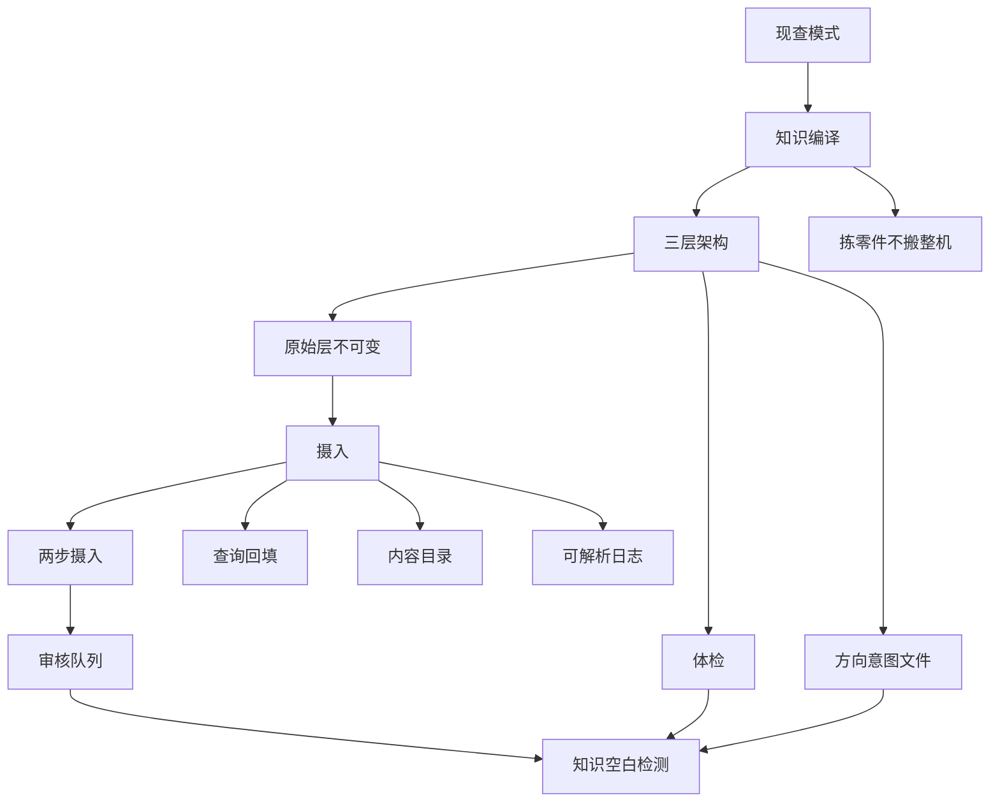

# 阶段 1 概念网络（01-05）

## 概念关系图

## 核心概念层

1. 知识编译（起点概念：整个模式为什么成立）
2. 三层架构（骨架：原始层 / 生成层 / 规则层）
3. 摄入（操作枢纽：向下挂四份文件，向外挂两步拆分）
4. 体检与方向意图文件（学习者现有系统的两大缺口：语义体检、purpose 必读）
5. 拣零件不搬整机（裁决原则：差量表的用法）

## 学习路径建议

第一步：从「现查 vs 编译」的复利判断出发，重新看自己真源里「哪些材料只是躺着」。
第二步：用三层架构当地图，把日常动作（改规矩、进料、改产物）对号入座。
第三步：操作层按「摄入 → 查询回填 → 体检」过一遍 dacapo 现状，认领两个首选差量（语义体检、purpose 必读）。
第四步：遇到任何新方法论，用「拣零件不搬整机」的判据（成本 × 触发条件）过筛。

## 与学习者系统的对照锚点

- 原始层 ↔ 01-原始素材区（只读）
- 生成层 ↔ 02-课程真源 + 概念卡
- 规则层 ↔ AGENTS.md + verify_consolidation.py + rebuild_course_index.py
- 内容目录 ↔ INDEX.md（机械生成，领先项）
- 查询回填 ↔ assets/疑问/（本课程已在跑的雏形）
- 语义体检 ↔ 缺口（脚本查不出概念卡打架）
- 方向意图 ↔ 00-学习计划「学习目标」的雏形，缺「必读」规定与课题层总件
