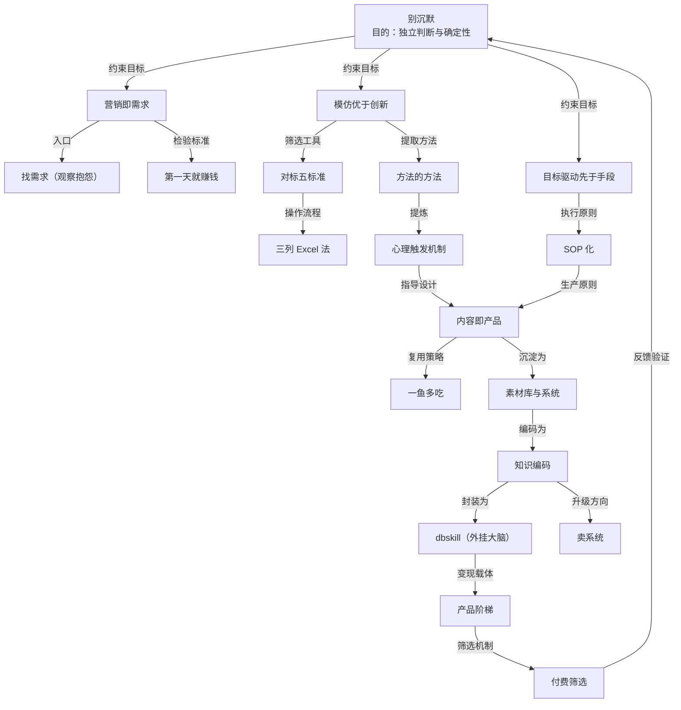

# 概念解析辞典

> 针对《别沉默——一个失败者的 AI 翻身实录》书稿 + 1,544 条开源推文集（dontbesilent 商业方法论 12 篇课程）的概念提取

## 一、核心概念

### 1. 营销即需求（公理一）

- **context**

  > 需求是客观存在的，产品是你自己造出来的。客观存在的需求，你只需要找到它；而你自己造的产品，你得说服市场"你需要它"——前者是顺水推舟，后者是逆水行舟。

  > "我买了"才是"我想买"——口头上的需求是幻觉，付款的需求才是真实。

- **费曼一下**：这条公理把做生意的起点从「我有什么」扭到「谁在为什么付钱」。需求不是创造出来的，是客观存在、等你找到的；产品才是造出来的，而造出来的东西要说服市场接受，难度完全不同。判断需求真假的唯一标准是有没有人付钱——口头意愿不算数。它同时是诊断工具：迷茫时不要从技能出发，要从「谁在为哪个问题付钱」出发。

### 2. 模仿优于创新（公理二）

- **context**

  > 别人用这个模式赚到了钱，你照着他的做，最差也能赚到他的八成；而创新，你连结果是什么都不知道。

  > 模仿的是模式，不是内容……复刻逻辑，创新表达。

- **费曼一下**：创新至上让作者失败了三年，放下执念开始模仿后第一天就赚到钱。这条公理把「模仿」和「照抄」切开：照抄是像素级复制产品，会被告；模仿是复刻别人成功的逻辑，用不同的产品、内容、渠道重新演绎。它派生两个定理：对标模仿定理（对标的本质是降维模仿）和对标选择定理（对标对象必须同时满足超额盈利和可复制性）。

### 3. 目标驱动先于手段（公理三）

- **context**

  > 做事一定是先有目标后有手段，永远不要从手段出发去探索。

  > 工具是手段，生意是目标。你花了三个月研究手段，却连目标都没定，这三个月就是沉没成本。

- **费曼一下**：解决「从哪开始」的问题。从手段出发（学会了工具所以找事做）会学一堆用不上的东西；从目标出发（我要做一个第一天就赚钱的生意），所有手段立刻清晰。好目标有约束：具体、可衡量、有期限——「赚钱」不是好目标，「第一天就赚钱」才是。目标越具体，选择越简单。

### 4. 第一天就赚钱

- **context**

  > "第一天就赚钱"是一个有硬指标的概念。人需要的是硬指标，不是软愿景。

  > 它逼你把"赚钱"当成第一性原理。

- **费曼一下**：0 到 1 阶段的生意检验标准：第一天就要能赚到钱。它是一个硬指标，强制你做对三件事——找到真实需求、放下身段、当天行动，把「先烧钱养用户」的幻想全部排除。它既是目标模板（具体、可衡量、有期限），也是过滤器（赚不到钱说明需求是假的）。800 元的第一桶金就是它的第一次验证。

### 5. 找需求（最小商业闭环的一环）

- **context**

  > 找需求、做产品、找渠道、收钱、交付。五个环节，缺一不可。

  > 找需求还一个高效入口，就是去观察"抱怨"……每一个抱怨，都是一个生意的种子。

- **费曼一下**：最小商业闭环的五环节里，找需求最难——其他步骤可以学、可以练，唯独找需求需要改变看世界的角度：从「我想卖什么」变成「人们需要什么」。角度一换，逛街看到的商品全变成需求。高效入口是观察抱怨：有人说「资料太难找了」，这是需求；「课程太贵了」，这是需求。他的资料生意和训练营，本质都是听到了抱怨。

### 6. 对标（没有差异点才算）

- **context**

  > 业务 A 和业务 B 之间有共同点，这个不叫对标。业务 A 和业务 B 之间没有差异点，才叫对标。

- **费曼一下**：砍定义的一刀。共同点（都做付费群、都是男性创业）给的是虚假的确定性——「他也做付费群，所以我也行」不成立，因为他赚钱可能靠内容、流量、交付，跟你有无付费群无关。真正的对标要求你和对象之间没有结构性差异：同样的需求、模式、渠道逻辑，差别只剩下执行。单点相似就对标，等于没有标准。

### 7. 找对标的五个标准

- **context**

  > 1、他赚钱（利润是你预期的 10 倍）
  > 2、你能看懂
  > 3、你能模仿
  > 4、不讨论现有业务、现有资源、成长经历、个人偏好、个人优劣势、兴趣爱好
  > 5、不讨论这个业务是什么，能干就执行，不能干就换下一个

- **费曼一下**：对标选择定理的操作版。前两条管超额盈利（10 倍是给自己留学习成本和试错损耗的余量；看流量、粉丝、名气都作废，只看利润），第 3 条管可复制性（看懂是理解模式，模仿是具备执行的资源与能力），第 4、5 条封死借口和纠结。「找不到对标的真实含义，是找了 100 个对标，全都干不了」。

### 8. 三列 Excel 法

- **context**

  > A 列是不同的同行 / B 列是这个同行的预估收入 / C 列是"我"模仿这个人的难度
  > 表格排序规则是：B 列降序排序、C 列升序排序
  > 那么 A 列的顺序就是：赚钱最多，但是"我"模仿最容易的

  > 你的表格不应该只有几行，而是应该有几百行。

- **费曼一下**：把五标准变成动作的流程。B 列训练对「钱」的敏感度（大多数人只看到流量，看不到收入），C 列用五标准的第 2、3 条评估（评估过程本身就是执行「你能看懂、你能模仿」）。排完序，A 列最上面的就是模仿对象。几百行是对赛道「如数家珍」的熟悉度——他强调这不是精英标准，是基本门槛。

### 9. SOP（标准作业程序）

- **context**

  > SOP 的价值，就是把"靠状态"变成"靠系统"：状态好的时候，你按 SOP 做，产出稳定；状态差的时候，你按 SOP 做，产出依然稳定。

  > 用系统赚钱的前提，是有人踩雷梳理出 SOP，而这个人就是老板。

- **费曼一下**：公理是道，SOP 是术——道告诉你方向，术告诉你动作。0 到 1 阶段的瓶颈是「怎么稳定地把一件事做出来」，而状态和灵感是环境变量，最不可靠。SOP 把成功的方法拆成一步步可照做的流程（选题怎么找、内容怎么编、封面怎么做、渠道怎么发），让一个人干活变成一个人管流程。关键：SOP 不是别人写好的，是老板自己踩坑踩出来的——坑变成注意事项，经验变成标准动作。先把手艺变成文档，再把文档变成系统，最后让系统替你干活。

### 10. 内容即产品

- **context**

  > 封面和标题就是广告，正文或者视频就是你的产品。

  > 三条都不占的内容，就是在给平台贡献流量，给自己贡献虚荣。

- **费曼一下**：把内容从「流量工具」重定义为「交付物、价值的载体、生意的本体」。推论：每条内容的产品都是围绕广告去做的，内容生产本身是产品生产。变现的硬标准：内容至少要占「展示解决问题的能力（案例）/ 过程（方法）/ 结果（证据）」一条——三条都不占，内容与需求之间就隔着一层纱，粉丝不少、点赞不少、就是不赚钱。价值是产品，流量是副产品；「能帮我涨粉」的内容别发。

### 11. 一鱼多吃

- **context**

  > 不同平台的用户，需要的是同一个内容的不同切面，而不是同一个内容的简单复制。

- **费曼一下**：同一核心观点按平台重新表达——公众号要完整论证、小红书要清晰利益点、抖音要强烈情绪钩子、推特要犀利观点和数据。复制粘贴会被平台惩罚（判定低质量），真正的一鱼多吃是「重新表达」，这个过程本身在训练你对内容的理解深度。它既是效率策略（一个选题榨干所有价值），也是能力训练（怎么在 15 秒讲完、1000 字讲透、一条推文讲尖锐）。

### 12. 方法的方法

- **context**

  > 它不是"怎么做内容"的方法，而是"如何从别人的爆款里提取出可复用规律"的方法……模板会过期，规律不会。

  > 在 AI 时代，前者的价值在贬值，后者的价值在飙升——因为 AI 可以帮你执行前者，只有你能创造后者。

- **费曼一下**：内容方法论的核心，两步：第一步建立信念——方法论存在于爆款中（没被结果验证的方法不值得学；理论正确不等于结果正确；有些方法原作者自己都没总结过，方法在他的作品里）；第二步操作——把爆款素材喂给 AI，给方向词（底层心理触发机制、认知偏差的 bug、传播学、营销心理学、注意力经济），让它提炼底层逻辑。方向词一变，AI 输出质量天差地别——AI 时代的核心技能是会问对的问题。

### 13. 心理触发机制（触发思维）

- **context**

  > 做内容不是在"表达自己"，而是在"触发别人"……观众没有义务停下来了解你，除非你在三秒之内给他们一个停下来的理由。这个理由，就是心理触发机制。

- **费曼一下**：第九个月质变的核心发现：爆款开头几乎都触发一种心理机制（好奇、损失厌恶、身份认同、认知冲突），扑街开头在陈述（我是谁、我要讲什么、求关注）。表达思维是内容当自传，触发思维是内容当钩子。操作化：把拆出来的机制整理成清单（认知冲突、价值倒挂、损失厌恶、身份宣言、质疑权威、好奇心缺口、社会认同、稀缺效应）当弹药库——先选机制，再设计开头。

### 14. 外挂大脑（辅助与替代的线）

- **context**

  > AI 是外挂大脑，不是替代大脑。

  > 内容的核心观点和表达方式，是不是你定的？如果是，AI 只是工具；如果不是，你就被替代了。

- **费曼一下**：AI 协作的分界线。用 AI 做内容不等于让 AI 写内容——76 个会话里大部分是筛选、优化、整理、检查，真正生成新内容的占少数；AI 负责「怎么做」，你负责「做什么」。不让 AI 写稿不等于不用 AI 辅助（提炼观点、整理素材、检查逻辑、优化标题、适配平台都是辅助）。越用 AI 越清楚什么替代不了：经历、判断、审美、在镜头前的那口气。AI 负责跑腿，我负责思考。

### 15. 知识编码

- **context**

  > 把隐性知识变成显性知识，把个人经验变成可复用的系统。

  > 把模糊的感觉，变成精确的规则……规则越细，产出越稳。

- **费曼一下**：AI 时代的核心能力，也是 5.2 到 5.3 的操作核心。三个星期的训练里，他给 Claude Code 立规矩（不要「综上所述」，要「说白了就一句话」）——每一条规矩都来自验证过的经验，这就是知识编码的颗粒。规则密度决定产出质量：字数、句式、分布、禁忌、示例，细到让 AI 无法偷懒。方法论本质是审美标准，编码成规则后 AI 就继承了你的审美。dbskill 是它的成品：12,307 条推文 → 30 个技能、4,176 条知识原子——「不是我的知识库，而是我的方法论的可执行版本」。

### 16. 知识编码是护城河

- **context**

  > AI 可以学习你的内容，但学不了你的经历；可以模仿你的表达，但模仿不了你的判断；可以复刻你的方法，但复刻不了你创造方法的那个过程。

  > 与其恐惧 AI 替代你，不如把自己变成一个"可以被编码、但永远无法被完全编码"的人。

- **费曼一下**：被 AI 干掉（20 万粉时知识库比他还像他）之后想明白的答案：内容会被 AI 吸收、重组、超越，但知识编码——把个人方法论变成系统、工具、流程的能力——替代不了，因为它的前提是独特的、经过实战验证的、成体系的方法论，而方法论的前提是真实的经历、失败的教训、成功的经验。价值在输入（经历、判断、审美、选择）不在输出；知识库能重组过去，不能创造未来。20 万粉到 70 万粉，差距不在内容，在系统。

### 17. 产品阶梯（信任阶梯）

- **context**

  > 产品阶梯的本质，是"信任阶梯"……先建立信任，再谈成交；信任的深度，决定客单价的高度。

- **费曼一下**：商业化的产品结构：三层对应信任的递进——训练营（4,980，轻信任，不教项目教能力）、商业顾问（128,000，深信任，给问题不给答案）、线下课会员（9,980，最信任，每场都不一样），层间有通路让客户自然升级。跳过信任阶梯直接卖高客单价没人买。前提认知：先有产品后有流量——流量是放大器，手里没产品，流量放大空虚。

### 18. 付费筛选

- **context**

  > 付费筛选，是让"对的人"和"对的人"在一起……它不是用价格筛掉穷人，而是用价格和边界，筛掉"不匹配"的人。

  > 拒绝不是损失，拒绝是筛选……拒绝的最高境界，不是"推开"，而是"指路"。

- **费曼一下**：商业化的筛选机制，三个零件：价格是过滤器不是门槛（9 块 9 吸引薅羊毛的人，4,980 吸引愿意为改变付钱的人；宁可少卖，不可贱卖）；边界（把「不适合」和「不提供」写清楚——越界帮一次就建立「你什么都能干」的预期；边界不是冷漠是专业）；拒绝（一个不满意的客户能毁掉十个潜在客户；拒绝时留出口，告诉他「你可以试试那个」）。学会说不，你的「是」才有价值。

### 19. 卖时间与卖系统

- **context**

  > 卖时间，是你的收入上限等于你的工作时间乘以时薪……卖系统，是你的方法论变成工具和流程，可以被无限复制、无限使用。

  > 手艺只有变成标准，才能放大价值。

- **费曼一下**：个人品牌商业化的第二曲线。卖课模式交付依赖本人（一期最多三五十人），有天花板；卖系统把方法论做成可执行版本（dbskill），学员离开他也能跑。升级路径：先编码自己，再编码产品，最后让系统替他工作。多数人停在第一曲线，因为舍不得把手艺变成标准——觉得教给别人就贬值了；事实相反，手艺只有变成标准才能放大价值。

### 20. 别沉默

- **context**

  > 不要对自己的失败沉默——失败不是耻辱，藏着掖着才是；不要对自己的想法沉默——你的观点可能不完美，但它值得被表达；不要对机会沉默——看到机会，不要只在心里想想，要开口、要行动、要试错。

- **费曼一下**：全书的名字，也是目的层。它把前面所有方法论收束成一个行动原则：不是天天发声，而是不藏失败、不憋想法、不放过机会。连「被 AI 干掉」都可以变成内容资产——前提是敢直面它。它回答「学这套东西为了什么」：为了不当那个只会心里想想的人。

## 二、概念架构图

按功能角色分层：目的层 → 公理层（道）→ 方法论层（术）→ 系统层 → 商业层，层间用关系词连接。

- 关系说明：公理层是「道」（方向），方法论层是「术」（动作）——书中明确「公理是道，SOP 是术」；方法的方法从爆款提炼心理触发机制，心理触发机制反过来指导内容设计（弹药库→先选机制再设计开头）；内容产出沉淀进素材库，素材库经知识编码变成 dbskill，dbskill 是产品阶梯（卖系统）的载体；付费筛选的验证结果（谁付钱、谁不匹配）反馈回目的层，呼应「用市场反馈修正认知」。
