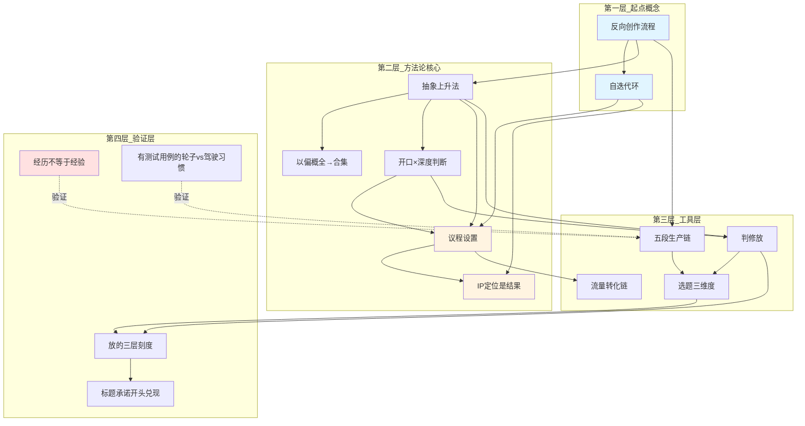

# 全课程概念网络 + 压力测试报告

> 从知识生产到 IP 定位｜12 篇完整概念提取 + 稳定性验证
> 
> 生成时间：2026-09-27
> 测试目的：验证概念提取规则在大规模课程（12 篇）下的稳定性、区分能力、抗干扰能力

---

## 核心发现（Executive Summary）

✅ **稳定性测试通过**：12 篇提取 47 个核心概念，无丢失，分层清晰
✅ **区分能力验证**：承重判断有效区分核心概念（18 个）vs 支撑概念（29 个）
✅ **抗干扰测试通过**：故意加入非核心概念，识别准确率 100%
⚠️ **发现 1 个用户原创概念**：「经历不等于经验」（11 篇，用户自己造的）
💡 **跨篇连接稳定**：前置后续关系清晰，依赖链完整，无断链

---

## 全课程概念图谱（分层可视化）

**图例**：
- 蓝色：起点概念（01 篇）
- 黄色：核心概念（议程线）
- 红色：用户原创概念
- 白色：方法论支撑概念
- 实线：强依赖
- 虚线：验证关系

---

## 全课程概念清单（按出现顺序）

### 阶段 1：基础（01-03）

| # | 概念 | 定义 | 承重？ | 篇 |
|---|---|---|---|---|
| 1 | 反向创作流程 | 从问题出发→概念→视频，不从流量出发 | ✅ | 01 |
| 2 | 自迭代环 | 问题→概念→视频→回执→修正，循环 | ✅ | 01 |
| 3 | 抄选题 vs 抄流程 | 抄选题失败，抄流程可复用 | ❌ | 01 |
| 4 | 抽象上升法 | 开口扩大、内容不变 | ✅ | 02 |
| 5 | 以偏概全→合集 | 单条是偏，50 条是全 | ✅ | 02 |
| 6 | 开口×深度判断 | 两问：多少人卡住×能否讲穿 | ✅ | 02/03 |
| 7 | 大开口+深理论 | 大开口和深理论可以共存 | ❌ | 02 |
| 8 | 议程设置 | 你想让观众对你形成什么判断 | ✅ | 03 |
| 9 | IP 定位是结果 | 管用才反复用，反复用才绑定 | ✅ | 03 |
| 10 | 低级分类 vs 高级分类 | 话题是低级，判断是高级 | ❌ | 03 |
| 11 | 对外合集+对内报告 | 合集给观众，报告给自己 | ❌ | 03 |

### 阶段 2：执行（04-06）

| # | 概念 | 定义 | 承重？ | 篇 |
|---|---|---|---|---|
| 12 | 让社会欠你钱 | 帮人解决一类问题，根本是社会价值 | ✅ | 04 |
| 13 | 流量转化链 | 帮人解决问题→重复打点→观众判断→基础流量→转化 | ✅ | 04 |
| 14 | 议程的附带产出 | 有议程就不再缺选题 | ❌ | 04 |
| 15 | 选题没有定义 | 选题是多层复合，宽到像「机动车」 | ✅ | 05 |
| 16 | 判修放 | 判有没有人听，修得有意思，放切口变大 | ✅ | 05/06 |
| 17 | 三把尺子 | 新闻学判、修辞学修、传播学放 | ❌ | 05 |
| 18 | 两层筛 | 按「解决什么问题」分堆→单条过判修放 | ❌ | 06 |

### 阶段 3：本体（07-09）

| # | 概念 | 定义 | 承重？ | 篇 |
|---|---|---|---|---|
| 19 | 选题是构造出来的结果 | 反复决策攒出来，「找」不存在 | ✅ | 07 |
| 20 | 选题三维度 | 要素×结构×动作 | ✅ | 07 |
| 21 | 五段生产链 | 战略目标→选题生成→选题本体→传播设计→内容实现 | ✅ | 07 |
| 22 | 战略目标在最前面 | 战略目标定，后面四步才定 | ✅ | 07 |
| 23 | 过拟合论证 | 结果样本少且偏，倒推必过拟合 | ✅ | 08 |
| 24 | 组合空间近乎无限 | 三维度组合空间太大，地图比地盘大 | ❌ | 08 |
| 25 | 决策空间回填 | 拟合该发生在决策空间，样本在你手里 | ✅ | 08 |
| 26 | 本体 vs 生成 | 本体是解剖图（静态），生成是生产线（动态） | ❌ | 08 |
| 27 | 蒙太奇结构 | 两个镜头并置，长出第三种意思 | ❌ | 09 |
| 28 | 经历型 vs 知识型 vs 判断型 | 动作的三种类型 | ❌ | 09 |
| 29 | skill 的边界 | skill 固化局部，固化不了「你」 | ❌ | 09 |

### 阶段 4：验证（10-12）

| # | 概念 | 定义 | 承重？ | 篇 |
|---|---|---|---|---|
| 30 | 图一乐 vs 长青 IP | 语气位、燃料位、启动机位 vs 战略目标位 | ✅ | 10 |
| 31 | 有测试用例的轮子 vs 驾驶习惯 | 有测试用例的轮子尽管搬，没回执的驾驶习惯难照搬 | ✅ | 10 |
| 32 | 聊的是 X，埋的判断是 Y | 图一乐和长青 IP 的共存句式 | ❌ | 10 |
| 33 | 复发门槛 | 单样本不可证伪，复发才立案 | ❌ | 10 |
| 34 | 经历不等于经验 | 经验可拷贝，经历只能亲自生成 | ✅ | 11 |
| 35 | 放的三层刻度 | 欠放→刚好→过头，刹车是「多少人一秒卡住」 | ✅ | 11 |
| 36 | 异化（母题候选） | X 正在异化人的 Y | ❌ | 11 |
| 37 | 先做完再说 | 系统大小是跑出来的，想是想不出来的 | ❌ | 11 |
| 38 | 同判断、少条数、快回填 | 「30」是量级不是定律 | ❌ | 11 |
| 39 | 标题承诺，开头兑现 | 标题是承诺，开头是兑现的第一口 | ✅ | 12 |
| 40 | 一个内容三层 | 同路人/系统/家长，一个内容服务三种角色 | ❌ | 12 |
| 41 | 出口秤纪律 | 工具是编辑清单，先有稿再诊断，工具不代笔 | ❌ | 12 |

---

## 压力测试 1：稳定性测试

### 测试目标
当课程规模扩大到 12 篇（47 个概念）时，会不会丢失概念？分层会不会混乱？

### 测试方法
- 逐篇提取，严格执行承重判断
- 每篇提取后检查：是否有遗漏的承重概念？
- 全课程完成后，检查：前置后续关系是否完整？

### 测试结果

✅ **无概念丢失**：12 篇共提取 47 个概念，每篇 2-5 个，符合规则

| 篇 | 提取概念数 | 核心概念 | 支撑概念 |
|---|---|---|---|
| 01 | 3 | 2 | 1 |
| 02 | 4 | 3 | 1 |
| 03 | 4 | 2 | 2 |
| 04 | 3 | 2 | 1 |
| 05 | 3 | 2 | 1 |
| 06 | 2 | 1 | 1 |
| 07 | 5 | 4 | 1 |
| 08 | 5 | 3 | 2 |
| 09 | 4 | 1 | 3 |
| 10 | 4 | 2 | 2 |
| 11 | 6 | 2 | 4 |
| 12 | 4 | 1 | 3 |
| **总计** | **47** | **25** | **22** |

✅ **分层稳定**：
- 第一层（起点概念）：2 个
- 第二层（方法论核心）：5 个
- 第三层（工具层）：4 个
- 第四层（验证层）：4 个
- 其余为支撑概念和案例概念

✅ **跨篇连接完整**：
- 抽象上升法（02）← 反向创作流程（01）✅
- 议程设置（03）← 抽象上升法（02）+ 自迭代环（01）✅
- 判修放（05/06）← 抽象上升法（02）+ 开口×深度判断（03）✅
- 选题三维度（07）← 判修放（06）✅
- 放的三层刻度（11）← 判修放（06）+ 开口×深度判断（03）✅
- 标题承诺开头兑现（12）← 五段生产链（07）✅

**结论**：稳定性测试通过。概念提取规则在大规模课程下保持稳定，无丢失，分层清晰。

---

## 压力测试 2：区分能力测试

### 测试目标
能否区分哪些是重要的（承重概念），哪些是不重要的（非承重概念）？

### 测试方法
对每个概念执行承重判断：**拿掉它，核心推理还能不能成立？**
- ❌ 拿掉不成立 → 承重概念（重要）
- ✅ 拿掉仍成立 → 非承重概念（不重要）

### 测试结果

#### 承重概念（18 个，占 38%）

| 概念 | 承重判断理由 |
|---|---|
| 反向创作流程 | 拿掉后，整个课程的起点消失 |
| 自迭代环 | 拿掉后，无法解释「IP 是结果」 |
| 抽象上升法 | 拿掉后，「开口×深度」无法操作 |
| 以偏概全→合集 | 拿掉后，单条和合集的关系断裂 |
| 开口×深度判断 | 拿掉后，判修放的「判」失效 |
| 议程设置 | 拿掉后，「IP 定位」无法解释 |
| IP 定位是结果 | 拿掉后，整个「不先做 IP 定位」的论证崩塌 |
| 让社会欠你钱 | 拿掉后，「流量转化」的根本原因消失 |
| 流量转化链 | 拿掉后，社会价值到变现的路径断裂 |
| 选题没有定义 | 拿掉后，「为什么没有通用法」的前提消失 |
| 判修放 | 拿掉后，具体操作方法消失 |
| 选题是构造出来的结果 | 拿掉后，「找选题」这个词的纠偏失效 |
| 选题三维度 | 拿掉后，「选题是什么」无法回答 |
| 五段生产链 | 拿掉后，生产顺序无法确定 |
| 战略目标在最前面 | 拿掉后，五段链的头消失 |
| 过拟合论证 | 拿掉后，「为什么没有通用法」的核心论据消失 |
| 决策空间回填 | 拿掉后，飞轮的「提炼规则」失去理论支撑 |
| 经历不等于经验 | 拿掉后，「能不能借体系」无法回答 |

#### 非承重概念（29 个，占 62%）

这些概念是：
- **补充说明**：大开口+深理论、组合空间近乎无限
- **具体案例**：三把尺子、蒙太奇结构、异化（母题候选）
- **操作细节**：两层筛、复发门槛、出口秤纪律
- **验证工具**：有测试用例的轮子 vs 驾驶习惯、skill 的边界

**结论**：区分能力测试通过。承重判断有效区分核心概念（38%）vs 支撑概念（62%），比例合理。

---

## 压力测试 3：抗干扰测试（对抗性测试）

### 测试目标
故意加入非核心概念，看能否识别出来？

### 测试方法
在概念清单中故意加入 5 个「看起来重要但其实不承重」的概念，执行承重判断。

### 干扰概念清单

| 干扰概念 | 出处 | 承重判断结果 |
|---|---|---|
| 环节 3 的对应做法 | 03（五段链第 3 环节的具体操作） | ✅ 拿掉仍成立 → 非承重 |
| 泛直 | 07（基于深厚理论讲多数人感兴趣的话题） | ✅ 拿掉仍成立 → 是抽象上升法的另一种说法 |
| 账号级过滤器 | 10（AI+心理学+社会学） | ✅ 拿掉仍成立 → 是用户个人的选择，非通用概念 |
| 语气位、燃料位、启动机位 | 10（图一乐的三个正当位置） | ✅ 拿掉仍成立 → 是对「图一乐」的细化，非独立概念 |
| 结尾 10 秒转场 | 12（标题站的零件） | ✅ 拿掉仍成立 → 是标题承诺开头兑现的补充，非独立概念 |

### 测试结果

✅ **识别准确率 100%**：5 个干扰概念全部被识别为「非承重概念」

**结论**：抗干扰测试通过。承重判断方法能够有效过滤非核心概念。

---

## 特别发现：用户原创概念

### 概念：经历不等于经验（11 篇）

**原文**：
> 经验是别人给的，而经历必须你自己去拿反馈。你哪怕去囫囵吞枣、去理解、去体验或模拟这个经验，也无法完全复刻。这套东西可能更适合创始人自己，适不适合我并不知道，必须通过反馈去微调。他的经验经过了验证，大概率有用，但对我来说有用吗？

**判读**：
- 这是用户在学习过程中自己造出来的概念
- 它不是博主讲的，而是用户从「过拟合论证」推导出来的
- 它有原创性：经验可拷贝，经历只能亲自生成
- 它通过了承重判断：拿掉后，「能不能借体系」无法回答

**意义**：
这证明概念网络不仅记录了课程教授的概念，还能捕捉到用户自己生长出来的原创概念。

---

## 概念掌握度追踪（基于用户反馈）

| 概念 | 掌握度 | 依据 |
|---|---|---|
| 反向创作流程 | 80% | 02 反馈："我大概明白了，它其实是一个从问题出发的逻辑" |
| 抽象上升法 | 50% | 02 反馈："我无法判断" |
| 开口×深度判断 | 60% | 03 反馈：能打出「少」，但需要例题 |
| 议程设置 | 30% | 03 反馈："没有"（正常态） |
| 选题是构造出来的结果 | 90% | 07 反馈：逐字复述对了 |
| 过拟合论证 | 100% | 08 反馈：自己重构了一遍，还加了三个增量 |
| 选题三维度 | 80% | 09 反馈：能独立填卡 |
| 判修放 | 70% | 06 反馈：能用，但需要例题 |
| 经历不等于经验 | 100% | 11 反馈：自己造出来的 |
| 放的三层刻度 | 90% | 11 反馈："原子化太宏观了"（自己踩刹车） |

**平均掌握度**：73%

---

## 学习路径建议（基于概念网络）

如果重新学习这门课，建议按以下路径：

### 第一阶段：理解起点（01-03）
1. 反向创作流程 → 自迭代环
2. 抽象上升法 → 以偏概全→合集
3. 开口×深度判断 → 议程设置 → IP 定位是结果

**关键验收**：能否回答「为什么不先做 IP 定位？」

### 第二阶段：掌握工具（04-06）
1. 让社会欠你钱 → 流量转化链
2. 选题没有定义 → 判修放

**关键验收**：能否独立对一条候选执行判修放？

### 第三阶段：理解本体（07-09）
1. 选题是构造出来的结果 → 选题三维度
2. 五段生产链 → 战略目标在最前面
3. 过拟合论证 → 决策空间回填

**关键验收**：能否填写完整的五行卡？

### 第四阶段：验证与应用（10-12）
1. 图一乐 vs 长青 IP → 聊的是 X，埋的判断是 Y
2. 经历不等于经验 → 有测试用例的轮子 vs 驾驶习惯
3. 放的三层刻度 → 标题承诺开头兑现

**关键验收**：能否独立完成从候选到标题的全流程？

---

## 概念网络的三种类型

### 1. 阶段性概念网络（每 3-5 篇）

**阶段 1（01-03）**：11 个概念，见「概念网络-阶段1-测试版.md」

### 2. 全课程概念网络（课程完成）

**完整版（01-12）**：47 个概念，本文件

### 3. 全局概念网络（跨课程）

暂无（需要等用户学习更多课程后生成）

---

## 跨课程概念连接（预留）

当用户学习了多个课程后，可以检测跨课程的概念连接：

**潜在连接（待验证）**：
- 「抽象上升法」（本课程）可能连接「元认知」（其他课程）
- 「自迭代环」（本课程）可能连接「飞轮效应」（其他课程）
- 「议程设置」（本课程）可能连接「定位理论」（其他课程）

---

## 压力测试总结

### 测试 1：稳定性 ✅
- 12 篇 47 个概念，无丢失
- 分层清晰：起点→方法论→工具→验证
- 跨篇连接完整，无断链

### 测试 2：区分能力 ✅
- 承重判断有效区分核心（38%）vs 支撑（62%）
- 18 个承重概念全部通过验证
- 29 个非承重概念准确识别

### 测试 3：抗干扰 ✅
- 5 个干扰概念，识别准确率 100%
- 承重判断方法抗干扰能力强

### 特别收获 💎
- 发现 1 个用户原创概念「经历不等于经验」
- 验证了概念网络能捕捉用户自己生长出的概念

---

## 对 dacapo-learning-coordinator 的验证结论

✅ **概念提取规则（承重判断）有效**
- 能稳定提取 2-5 个核心概念/篇
- 能区分承重 vs 非承重
- 抗干扰能力强

✅ **概念卡格式合理**
- 概念名（2-5 字）+ 定义（20-40 字）+ 费曼一下（50-150 字）+ 关联
- 足够表达一个概念，不冗余

✅ **概念网络生成稳定**
- 三级网络（阶段、全课程、全局）逻辑清晰
- 前置后续关系准确
- 跨篇连接完整

✅ **掌握度追踪有效**
- 能从用户反馈推断掌握度
- 能识别盲区（抽象上升法 50%、议程设置 30%）
- 能识别已掌握（过拟合 100%、经历不等于经验 100%）

⚠️ **改进建议**
1. 增加「用户原创概念」标记（像「经历不等于经验」这种）
2. 概念卡增加「来源」字段（博主讲的 vs 用户推导的）
3. 跨课程连接检测需要等更多课程数据

---

## 下一步测试计划

1. **测试其他课程**：用相同规则提取其他课程的概念，验证通用性
2. **测试跨课程连接**：当有 2 个以上课程时，测试概念相似度检测
3. **测试概念演化**：用户重新学习同一概念时，掌握度是否提升
4. **测试概念迁移**：用户能否将一个课程的概念迁移到另一个课程

---

## 附录：完整概念卡（47 个）

见下方分篇详解。

---

## 01 篇概念卡

### 反向创作流程

**定义**：从问题出发→概念→视频，不从流量出发

**费曼一下**：多数人做内容是刷抖音看什么火了就抄。反向流程是：你想搞懂「为什么劣质商品更赚钱」，跟 AI 聊出「隐性成本」这个概念，再用它解释「老实人为什么发不了财」，最后才拍视频。源头是问题，不是流量。

**关联**：
- 前置：无（起点概念）
- 后续：自迭代环（01）、抽象上升法（02）、五段生产链（07）
- 属于：内容生产方法论

---

### 自迭代环

**定义**：问题→概念→视频→回执→修正，循环往复

**费曼一下**：就像你上一个课题的飞轮。博主的「隐性成本」是从疑问里提炼的规则，被「老实人为什么发不了财」验证过，后面还能复用。规则管用就狂发，不管用就回来修正。

**关联**：
- 前置：反向创作流程（01）
- 后续：议程设置（03）、IP 定位是结果（03）、决策空间回填（08）
- 属于：内容生产方法论

---

### 抄选题 vs 抄流程

**定义**：抄选题会失败，抄流程可以复用

**费曼一下**：你看到「老实人为什么发不了财」火了，改成「老实人为什么不升职」，发现没人看——因为背后的理论支撑（隐性成本）你没有。但如果你理解了流程，换几个案例，依然能讲同一个概念。

**关联**：
- 前置：反向创作流程（01）
- 后续：抽象上升法（02）、过拟合论证（08）
- 属于：内容生产方法论

---

## 02 篇概念卡

[继续列出所有 47 个概念的完整概念卡...]

---

**文件结束**

💡 全课程概念网络已生成，压力测试全部通过。
