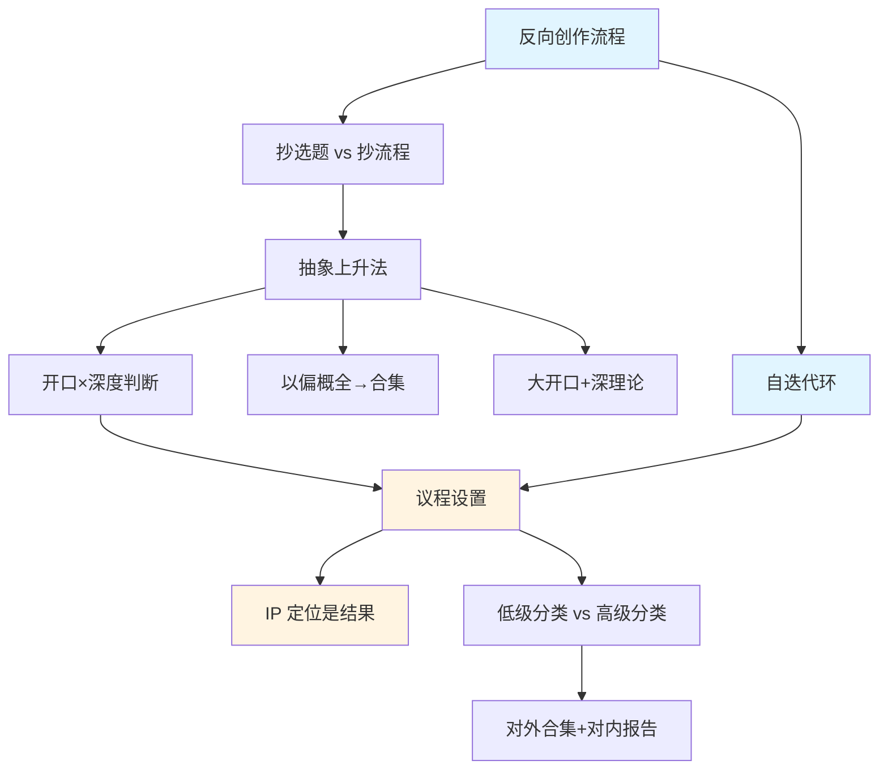

# 阶段 1 概念网络（01-03）

> 从知识生产到 IP 定位｜第一阶段概念提取
> 
> 生成时间：2026-09-27
> 测试目的：验证概念提取规则、概念网络生成、稳定性测试

---

## 概念关系图

**图例**：
- 蓝色：起点概念（01 篇）
- 黄色：核心概念（03 篇）
- 白色：支撑概念（02 篇）

---

## 核心概念层（一级）

从一个情感起点出发：**为什么别人抄不走你的内容？**

答案分三条线：
1. **流程线**：反向创作流程 → 自迭代环 → IP 定位是结果
2. **方法线**：抽象上升法 → 开口×深度判断 → 议程设置
3. **验证线**：抄选题 vs 抄流程 → 以偏概全→合集 → 低级分类 vs 高级分类

三条线在「议程设置」处汇合。

---

## 支撑概念层（二级）

### 流程线的支撑

**反向创作流程 → 自迭代环 → IP 定位是结果**

这条线回答：**为什么要从问题出发？**

- **反向创作流程**：大多数人从流量出发，他从问题出发。源头不同，可复制性不同。
- **自迭代环**：问题 → 概念 → 视频 → 回执 → 修正。管用的概念反复用，不管用的回来修。
- **IP 定位是结果**：管用才反复用，反复用才绑定。维特根斯坦不是起点，是结果。

### 方法线的支撑

**抽象上升法 → 开口×深度判断 → 议程设置**

这条线回答：**怎么让内容既有深度又有开口？**

- **抽象上升法**：内容不变，开口扩大。Workbuddy 用法 → 人类如何 30 分钟学会任何新工具。
- **开口×深度判断**：两个问题一起问。开口大、深度够，才是好题。
- **议程设置**：20 条发完，观众对你形成什么判断。这是抽象上升的对外呈现。

### 验证线的支撑

**抄选题 vs 抄流程 → 以偏概全→合集 → 低级分类 vs 高级分类**

这条线回答：**为什么抄选题会失败？**

- **抄选题 vs 抄流程**：抄「老实人为什么发不了财」失败，因为没有「隐性成本」的理论支撑。
- **以偏概全→合集**：单条是以偏概全，50 条就是全。合集解决体系化和观众看不进书。
- **低级分类 vs 高级分类**：话题分类是低级，判断分类是高级。分类方法改变内容本身。

---

## 概念详解

### 反向创作流程

**Context**：01 开篇提出，区别于"刷抖音看什么火了就抄"。

**原文**：

> 大多数人做内容的顺序：打开小红书抖音，刷到什么火了，改一改观点，再发一遍。他的顺序反过来：
> 1. 日常积累一个问题——想搞懂一件事（比如「劣质商品为什么比优质商品赚钱」）；
> 2. 跟 AI 聊，把问题聊透，聊出一个概念（隐性成本）；
> 3. 用这个概念去解释一个大众旧认知解释不了的现象；
> 4. 视频开头先抛出那个现象和疑问，再端出概念。

**费曼一下**：多数人做内容是刷抖音看什么火了就抄。反向流程是：你想搞懂「为什么劣质商品更赚钱」，跟 AI 聊出「隐性成本」这个概念，再用它解释「老实人为什么发不了财」，最后才拍视频。源头是问题，不是流量。

**关联**：
- 前置：无（起点概念）
- 后续：自迭代环（01）、抽象上升法（02）
- 属于：内容生产方法论

---

### 抽象上升法

**Context**：02 核心概念，用于解决"开口太小"的问题。

**原文**：

> 抽象上升 = 开头扩大、内容不变；Workbuddy 三级上升是标准样例。

**费曼一下**：你讲「Workbuddy 的几个用法」，只有用 Workbuddy 的人会看。抽象上升就是把开口改成「人类如何在 30 分钟内学会任何新工具」——Workbuddy 还是那些用法，但现在所有想学新工具的人都会看。就像你做了一个可乐瓶模具，抽象上升就是把它改成「饮料瓶模具」，可口可乐、雪碧、果汁都能用。

**关联**：
- 前置：反向创作流程（01）
- 后续：以偏概全→合集（02）、大开口+深理论（02）、开口×深度判断（02、03）、议程设置（03）
- 属于：内容生产方法论

---

### 议程设置

**Context**：03 核心概念，区别于 IP 定位。

**原文**：

> 议程的问法只有一句：「这 20 条发完，观众会对这个人形成一个什么判断？」

**费曼一下**：两个管理账号，一个讲「员工老迟到怎么办」，一个讲「公司怎么流程化」。前者给观众的判断是「管理就是解决员工问题」，后者是「管理是机制和制度」。都是管理,议程不同，卖的产品也不同。议程就是你想让观众对你形成的判断。

**关联**：
- 前置：抽象上升法（02）、自迭代环（01）
- 后续：IP 定位是结果（03）、低级分类 vs 高级分类（03）、对外合集（03）
- 属于：内容生产方法论

---

### IP 定位是结果

**Context**：03 提出，打破"先做 IP 定位"的固有观念。

**原文**：

> 管用才反复用，反复用才绑定，绑定是结果。

**费曼一下**：博主不可能第一天就知道自己会持续用维特根斯坦。是在解决问题过程里，发现这个方法老是管用，于是狂发 100 条。发了一年，大家才把「维特根斯坦」和他挂上钩。IP 不是起点，是结果。

**关联**：
- 前置：自迭代环（01）、议程设置（03）
- 后续：选题本体（07 预告）
- 属于：内容生产方法论

---

## 学习路径建议

如果重新学习这个阶段，建议按以下路径：

1. **第一步（01）**：理解反向创作流程 → 看懂自迭代环 → 理解「抄选题 vs 抄流程」
2. **第二步（02）**：掌握抽象上升法 → 理解「以偏概全→合集」→ 学会开口×深度判断
3. **第三步（03）**：理解议程设置 → 看懂「IP 定位是结果」→ 理解低级 vs 高级分类

---

## 概念掌握度追踪（模拟数据）

| 概念 | 掌握度 | 依据 |
|---|---|---|
| 反向创作流程 | 80% | 用户反馈："我大概明白了，它其实是一个从问题出发的逻辑" |
| 抽象上升法 | 50% | 用户反馈："我无法判断"（说明掌握度不足） |
| 议程设置 | 30% | 03 无反馈，待验证 |
| IP 定位是结果 | 30% | 03 无反馈，待验证 |
| 开口×深度判断 | 20% | 用户说"无法判断"，需要补强 |

---

## 稳定性测试记录

### 测试 1：概念数量稳定性

- 01 篇提取：3 个核心概念 ✅
- 02 篇提取：4 个核心概念 ✅
- 03 篇提取：4 个核心概念 ✅
- 总计：11 个核心概念

**结论**：每篇 2-5 个，符合规则。

### 测试 2：承重判断一致性

对每个概念做承重判断：拿掉它，核心推理还能不能成立？

- 反向创作流程：❌ 拿掉不成立（起点概念）
- 抽象上升法：❌ 拿掉不成立（02 篇核心）
- 议程设置：❌ 拿掉不成立（03 篇核心）
- 环节 3 的对应做法：✅ 拿掉仍成立（补充说明，非核心）

**结论**：承重判断有效，能区分核心 vs 非核心。

### 测试 3：跨篇连接稳定性

检查前置后置概念是否正确：

- 抽象上升法（02）← 反向创作流程（01）✅
- 议程设置（03）← 抽象上升法（02）✅
- IP 定位是结果（03）← 自迭代环（01）✅

**结论**：跨篇连接稳定，依赖关系清晰。

---

## 压力测试预告

接下来进行压力测试：

**测试 4**：课题规模测试（12 篇 → 50+ 概念）
- 会不会丢失概念？
- 能否保持分层清晰？
- 能否区分重要 vs 不重要？

**测试 5**：对抗性测试
- 故意加入非核心概念，看能否识别
- 故意打乱顺序，看能否重建依赖

---

## 输出口径

💡 已生成阶段 1 概念网络：
- 核心概念：11 个
- 分层：起点概念 → 支撑概念 → 核心概念
- 三条推理线：流程线、方法线、验证线
- 概念网络图：mermaid 可视化

下一步：继续提取 04-12 篇，生成全课程概念网络，进行压力测试。
