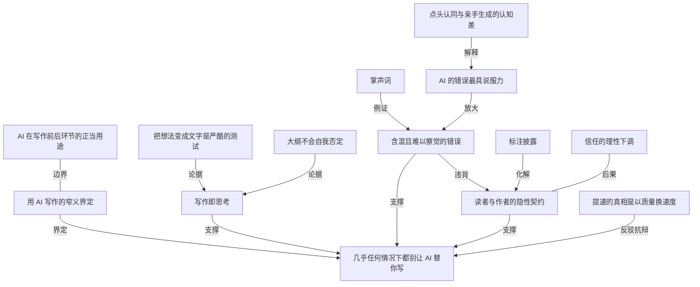

# 几乎任何情况下，都别让 AI 替你写

- 原文标题：I think you should almost never use AI to write
- 作者：erichgrunewald.substack.com
- 内参日期：2026-09-21
- 来源类型：blog
- 原文：https://erichgrunewald.substack.com/p/why-you-should-almost-never-use-ai
- 标签：写作, 认知科学

> 作者立场明确且不反 AI：转录、查资料、分析数据、给初稿提意见都该用，行文润色也行，唯独「写」不该交出去。三条理由——写作过程本身就是思考过程；AI 的文字是以难以察觉的方式含混和出错；不标注地用 AI 写作对读者是失礼。他特别强调，给足详细要点再让 AI 写、写完再编辑，也一样不成立。

## 导读

ai 写作

## 核心观点

- 主张：几乎在任何情况下，都不要用 AI 来「写」——即你在纸上敲字时做的那件事，无论是博客、研究报告、备忘录、一封用心的邮件还是小说，只要这段文字是为了传达一个想法、一个论证、一次分析或其他有实质内容的思考。
- 这个主张的强度超出多数人的预期：即便你给 AI 非常详细的 bullet points、口述过的思路或大量上下文，即便你事后编辑 AI 写出的文字，作者仍然认为不该这么做。
- 三条理由构成全文骨架：
- 写作过程是思考过程不可分割的一部分；
  - AI 写出的文字含混、且以难以察觉的方式出错（vague and wrong in hard-to-notice ways）；
  - 用 AI 写而不加标注，既失礼又误导。
- 作者的立场不是反 AI，而是把反对范围精确收窄到「用 AI 生成正文」这一件事上。

## 四段前置澄清：把主张的边界划清楚

- **不是反 AI**：在研究与写作的其他环节用 AI 非常合理——转录音频、分析数据、检索信息、头脑风暴、给草稿提反馈。
- **编辑可以，生成不行**：用 AI 做 line editing、copy editing，或把一段话改得更清楚更紧凑，都没问题，前提是每一处修改都由人有意识地接受或拒绝。作者反对的只是「用 AI 生成文字」。
- **承认优势成立**：用 AI 写作确实更省力、比自己写快得多。正因如此，坏处必须足够大才能让整体划不来——作者认为坏处确实足够大。
- **只针对当下与近期的模型**：未来很可能出现好到值得把写作委托出去的模型；但到那时，更合理的做法恐怕是把整个研究或写作流程端到端交出去，因为除了写，它们还得替你做完全部或大部分思考。
- 脚注层面的两处让步：
- 主要起协调或事务功能的短文本（公司里高度格式化的重复邮件）可以用 AI 起草再轻度编辑；
  - 如果你极其仔细地审查并大幅重写 AI 的稿子，可能还行——但也可能不行，而且那样做并不比自己从头写更省时。

## 写作过程就是思考过程

- 研究的目的，是对重要问题形成准确的信念，再把它传达给读者；而形成准确信念的最好办法之一就是写。
- Paul Graham 的判断：写你熟悉的东西，通常会让你发现自己并没有以为的那么懂；**把想法变成文字是一场严酷的测试**。他补充说，一篇文章里最终出现的想法，有一半是写的过程中才想到的——这正是他写文章的理由。
- Clara Collier 在 Patrick McKenzie 的播客里给出更具体的机制：写实质性的东西时，没有任何一个环节她不在思考和改变主意——从大纲，到把大纲变成文字，到单独一个句子。
- 典型体验：想把大纲写成成稿，卡在某个转折上怎么都不顺，最后意识到不顺的原因是这两个论点根本不该并排放在一起，自己想做的这件事本身是错的。
  - 关键一句：**把大纲喂给 LLM，它不会停下来考虑「也许这份大纲是坏的」**。
- Patrick McKenzie 的补充：我们现在有了这件事的经验性证明——你造了一台会写作的机器，思考就作为副产品跑了出来。
- 写多页长文时，即便你有很强的论点，强迫自己把它落成句子和段落、把论证结构搭起来，这个动作会暴露论证里的漏洞，暴露研究过程哪里不够，还会让「其实有一件事和我想说的话矛盾」这类东西浮上来。
  - 一个足够讲道理的人因此会承认存在反驳，或者不得不把结论收窄到比「他想写的那个版本」更弱的程度。
- 作者自己的表述：要写，就必须先知道自己想说什么，也就是必须先思考证据与论证并得出某些信念。任何研究或写作项目，都得有一个人把整件事装进脑子里——所有证据碎片、所有考量、所有论证，以及它们如何彼此咬合。用 AI 写作，让人更容易绕开这些必要的思考。

## AI 的文字含混，且以难以察觉的方式出错

- 机制：自己写时会做出大量关于用词与措辞的小决定，这些小决定合起来构成文本整体的清晰度与正确性。
- 实验：让 Claude Fable 5 写一段介绍 AI 芯片走私问题的短段落（这是一个已被大量报道与撰写的题目），输出读起来「不算糟，甚至相当像样」——但作者逐句拆解，指出它做的一系列在他看来微妙地错误或糟糕的选择：
- 「出口管制的力度只取决于执法」：要么说了一句显而易见的废话（执法不力的政策当然效果更差），要么什么也没说。
  - 「芯片体积小巧」：这话为真，但真正被走私的是 AI 服务器，并不小巧；更要紧的是这一点根本不重要——芯片走私很少靠藏匿蒙混过关，通常是把产品改标成别的货物、光明正大地运出去。
  - 「通过庞杂的全球供应链销售」使芯片「有吸引力且易于走私」：这到底什么意思？是说走私者更容易从美国之外的公司买到芯片？（直到不久前，走私者从美国总部的公司拿货似乎都不太费劲。）还是说在马来西亚这类国家大量购买不那么显眼？（作者认为这条更接近事实。）还是别的什么？
  - 「估算从每年数万到也许十几万枚高端芯片不等」：字面为真，但低端估计几乎肯定是错的，真实数字大概率接近甚至超过它给出的上限——所以这个说法有误导性。此外它没有指明年份（自 2022 年 10 月以来走私量波动极大），也没有定义什么叫「高端」芯片。
  - 「即便是下限也代表足以影响训练与部署强大 AI 系统的算力」：这句话没有任何信息量。某种意义上单枚芯片也「影响」AI 系统的训练与部署；而且什么叫「强大的 AI 系统」？为什么少量算力对强系统比对弱系统更重要？直觉上恰恰反过来才对。
  - 「负责监管一个数千亿美元规模的贸易」：这里直接给出数字要好得多。
  - 「预算与人手更适配于一个小得多的问题」：第一，这个机构的预算和人手是已知的，写出数字并给出参照更好；第二，问题「更小」是什么意思——不那么重要，还是更容易解决？真正重要的难道不是「给它更多资源很可能显著改善执法」，而不是「它现有资源更适合别的问题」？
  - 收尾句「因此威胁到悄悄掏空美国 AI 政策的核心支柱之一」：纯粹的掌声词（uninformative applause light）。
- 密度问题：一两处这样的毛病不致命，但作者的经验是 **AI 写出的文字里，不必要的含混与微妙错误的句子密度非常高**；即便你提供大量上下文（写好的笔记与提纲）也一样。
- 脚注佐证：用 Claude 总结会议记录分享给同事，哪怕提示词精心写过、附了几篇自己写的会议纪要作为范例、模型还能看到完整逐字稿，它仍会引入微妙的含混与错误——其中不少似乎源于模型没真正搞懂这些要点是写给谁看的、他们已知什么、不知道什么。
- Eric Schwitzgebel 提供的第二条论证：人类专家的思考方式与 LLM 不同且更好，他们的措辞（哪怕是细微的措辞）反映着连他们自己都未必意识到的敏感度。
- 常见反驳：我当然读过模型的输出，不认可每一个词我就不会发出去，所以那些想法就是我想的，甚至是我最好的判断叠加了模型的专长。
  - 回应：**点头认同地读，与真正富有成效地生成一段文字，之间存在巨大的认知差异**。其一，字一旦落在纸上，就很容易被动地让「差不多的词」将就过去，而不像从零生成时那样费力、主动地斟酌用词；其二，人（即便是专家）未必清楚塑造自己用词的全部因素——你本会写得略有不同，哪怕你不知道这一点、也不知道为什么，发出与接收到的信号已经变了。
- 比上述更糟的一层：AI 不只写出含混和微妙错误的文字，它还以**几乎最大化说服力**的方式这么做。
- 模型若不确切「知道」你让它写的东西，通常不会停下来说自己不知道，而是写出一段含混到怎么都算真、或听起来为真但其实并非必然为真的话。
  - 人当然也经常错、也含混，但人类的错与含混往往更没有说服力、也更容易被发现。
- 成本不对称：要像作者拆解芯片走私那段一样读出 AI 文本里的全部小毛病，极其费力；若他本人不熟悉芯片走私，多半会漏掉其中大部分。而**如果这段文字是他自己写的，他不可能不注意到自己在哪里没想清楚**。

## 用 AI 写又不标注，是失礼且误导

- 隐性契约：当你发表或分享一段文字，读者多半预期你在其中投入了思考，尤其预期这段文字代表**你的**想法——至少他们应当如此预期，作者也希望他们如此预期。这就是读者与作者之间的隐性契约：读者付出注意力，作者以有价值的东西（信息或娱乐）回报。
- Clara Collier 的版本：LLM 能产出的那个版本的我的文字，总会缺少一些我本可以添加的东西——不是因为模型知道得比我少（很多领域它知道得更多），而是**任何人随时都可以自己去问模型**。
- 读者之所以读我写的、或读我作为编辑挑出来放到他们面前的东西，是因为存在一份隐性契约：我提供的是他们在别处得不到的东西，这会比直接问模型更值得他们花时间。
  - 因此她不会直接用 LLM 生成的文字；若要用，她会在读者花时间之前把情况说得非常清楚。
- 违约后果：前面所有关于微妙错误与含混的问题，加上「文字一旦是 AI 写的，你根本无从判断作者是否投入了思考」，都违背这份契约。所以当作者读到一段文字并察觉它整体或部分由 AI 写成时，他对文本与作者的信任会立即下降——而且他认为这种下降是理性的。
- 两项指控成立：推广 AI 写成的文字、或把这样的草稿发给别人，是**失礼**——有点像把一份写得很潦草的草稿发给别人，同时隐瞒它很潦草；不清晰标注则是**误导**，因为读者预期你的文字是你的文字，经过仔细思考、代表你自己的信念。
- 解药与现实：标注为 AI 写成（或大部分由 AI 写成）就能绕开失礼与误导这两点——但作者怀疑，大多数人并不想这么做。

## 四个例外问答

- **问：能不能把 AI 写的片段放进文章里，只要清楚标注？**
- 答：大体可以。比如做浅层调研时依赖模型给一条信息，然后写成「Claude Fable 5 告诉我如此这般」。当花大量时间核查这条具体主张不划算时，这种做法有用。要害在于输出被清楚标为 AI 所写，读者可以自行决定要不要打折扣。脚注补充：最好连具体是哪个模型也一并写明。
- **问：那整篇都这么办不行吗？**
- 答：几乎从来不是好主意，哪怕标注了——只要你打算让别人读。原因有二：一是结果多半比你自己写差得多；二是你一旦标明是 AI 写的，人们（很合理地）就不会读。即便只有你自己会读，用 AI 写通常也是错的，因为你会失去前两节所说的全部收益。
- **问：非英语母语者写英文吃力，可以用 AI 来写吗？**
- 答：这常被认为可接受、甚至无需披露，作者基于前述全部理由不同意。用 AI **翻译**一篇用母语写成的文字可以接受，但即便如此最好也披露。他的感觉是：**AI 在翻译时比在「从 bullet 笔记起草」时更能保住清晰与精确**。
- **问：如果事关重大、用 AI 加速必要的写作极其重要（比如写 AI 政策备忘录）呢？**
- 答：作者怀疑用 AI 写作是否真的让他快多少；或者说，实践中它提速的方式就是在质量上让步，而**在边际上不该拿质量做交换**。华盛顿早已淹没在几乎没人读的报告与议题简报里；稀缺的、真正对政策制定者有帮助的，是关于重要议题的更准确、更用心的分析。

## 概念网络

### 关键概念

#### 用 AI 写作（窄义）

**context**：全文反对的对象被精确限定为「do the thing you're doing when you type words on a page」——生成旨在传达想法、论证或分析的实质性文字；转录、数据分析、检索、头脑风暴、给草稿反馈、逐句编辑都不在其内。

**费曼一下**：不是「用不用 AI」，而是「让不让 AI 替你把话说出来」。AI 可以帮你找材料、帮你磨句子，但从空白到成句的那一段路，作者认为必须你自己走。

#### 写作即思考

**context**：全文第一根支柱——「the writing process is the thinking process」。写作不是把已经想好的东西记录下来，而是想清楚的过程本身。

**费曼一下**：很多人以为思考在前、写作在后，写只是誊抄。实际恰恰相反：你只有被迫把它写成句子，才会发现自己哪里没想通。跳过写，就是跳过想。

#### 把想法变成文字是一场严酷的测试

**context**：Paul Graham 的判断——写你熟悉的东西通常会显示出你并没有以为的那么懂；一篇文章里一半的想法是写的时候才出现的。

**费曼一下**：脑子里的理解可以含糊过关，纸面上不行。文字会当场验货，凡是模糊的地方都写不出来。这道测试，也正是产出新想法的地方。

#### 大纲不会自我否定

**context**：Clara Collier 的核心观察——把大纲喂给 LLM，它不会停下来考虑「也许这份大纲本身是坏的」；而人在把大纲变成成稿时，常因某个转折写不顺而意识到两个论点根本不该并排。

**费曼一下**：模型默认你的前提是对的，只负责把它填满。人写作时的卡顿恰恰是警报器——写不顺往往不是文笔问题，是结构本身错了。交给模型，警报器就被拆掉了。

#### 含混且以难以察觉的方式出错

**context**：全文第二根支柱（vague and wrong in hard-to-notice ways）。单篇里一两处不致命，但 AI 文字中这类句子密度极高，且在给足上下文时依然出现。

**费曼一下**：它的毛病不是明显的胡说，而是一句句「看着像话」的东西：要么是废话，要么把不太对的说法讲得很圆。逐句追问才发现每句都站不住。

#### 掌声词

**context**：作者对模型收尾句「威胁到悄悄掏空美国 AI 政策的核心支柱之一」的判词——pure uninformative applause light。

**费曼一下**：一种只负责让读者点头、不负责传递信息的句子。听上去庄重有力，抽掉之后文章少的只是气氛，不是内容。

#### 点头认同与亲手生成之间的认知差

**context**：Eric Schwitzgebel 对「我读过并认可每一个词，所以那就是我的想法」这一反驳的回应——nodding along 与 productively generating 之间存在巨大差异。

**费曼一下**：审阅和创作调动的不是同一套心力。字已经在纸上时，差不多的词很容易被放过；从零写起时，你绕不开对每个词的斟酌。认可一段话，远不等于想出这段话。

#### 专家措辞中未被意识到的敏感度

**context**：Schwitzgebel 的另一条理由——专家的用词（哪怕细微处）反映着他们自己都未必察觉的敏感度；你本会写得略有不同，哪怕你不知道、也说不清为什么，发出与收到的信号已经不同。

**费曼一下**：内行的文字里有一层说不出口的分寸感，来自长期浸泡。换成模型措辞，这层分寸就掉了，而掉在哪里连作者本人都指不出来。

#### AI 的错误具有最大化的说服力

**context**：作者称情况「比那还糟」——模型不确切知道时不会停下来承认无知，而会写出含混到怎么都算真、或听起来为真的话；人类的错与含混通常更没说服力、更易发现。

**费曼一下**：错误的危险程度不只取决于错多少，还取决于有多难被抓到。人出错时往往破绽外露；模型出错时包装完好，所以更贵。

#### 读者与作者的隐性契约

**context**：全文第三根支柱——读者付出注意力，作者以有价值的东西回报，并且读者有理由预期这段文字代表作者本人的思考。Clara Collier 的版本是「任何人随时都能自己去问模型」，读你是因为你能给别处得不到的东西。

**费曼一下**：注意力是读者先付的定金。他之所以读你而不是自己去问模型，是因为默认能拿到只有你能给的东西。不标注地转发模型输出，就是收了定金不交货。

#### 标注披露

**context**：作者承认失礼与误导这两条可以靠清楚标注化解（「Claude Fable 5 告诉我如此这般」，最好写明具体模型），但补一句：他怀疑大多数人并不想这么做。

**费曼一下**：标注是这套指控的现成解药，成本也极低。真正的信息在于人们的回避——不愿标注，说明大家心里清楚标注之后这段文字会被怎么对待。

#### 信任的理性下调

**context**：作者说一旦察觉文本整体或部分由 AI 写成，他对文本与作者的信任会立即下降，并认为这种下降是理性的。

**费曼一下**：这不是情绪化的偏见，而是合理的推断：既然无从判断作者投入了多少思考，又已知这类文字含混与错误的密度更高，那么下调预期本身就是正确的读法。

#### 提速的真相是以质量换速度

**context**：对「事关重大、必须加速」这一抗辩的回应——作者怀疑 AI 是否真让他快多少；实践中提速的方式就是在质量上让步，而在边际上不该拿质量做交换。

**费曼一下**：省下来的时间多半不是白赚的，是从质量账户里划走的。看起来快了三倍，其实是把审慎的那部分工作直接删掉了。

#### 稀缺的不是报告而是更准确的分析

**context**：作者对政策写作场景的具体判断——华盛顿早已淹没在几乎无人阅读的报告与议题简报里；真正稀缺、真正帮到政策制定者的，是关于重要议题的更准确、更用心的分析。

**费曼一下**：当供给已经过剩时，加快产出等于加重堵塞。瓶颈不在产量而在含金量，用提速工具去解一个不是速度的问题，只会让问题更大。

### 概念网络

全文的思想网络是一个「一条主张、三根支柱、两道边界」的结构。

- **主张与界定的关系**：核心主张（几乎任何情况下都别让 AI 替你写）之所以能立住，首先靠的是「用 AI 写作的窄义界定」把打击面收到最小——反对的只是从空白到成句这一段，而不是转录、检索、分析、头脑风暴或逐句编辑。正当用途与窄义界定之间是边界关系：前者是被显式让出的地盘，后者是保留的阵地。收窄不是退让，而是让主张变得不可绕开——常见的「可你不能反对整个 AI 吧」这类反驳，在界定完成的那一刻就失效了。
- **第一根支柱的内部层级**：写作即思考是论证的地基，它由两条独立论据支撑——Paul Graham 的「严酷的测试」讲的是写作对**已有**理解的检验（写下来才知道自己没那么懂），Clara Collier 的「大纲不会自我否定」讲的是写作对**结构**的检验（写不顺是结构错误的警报）。两者一纵一横：前者查深度，后者查骨架，合起来才说明为什么把写作外包等于把思考外包。
- **第二根支柱的递进链条**：含混与难以察觉的错误是现象层，掌声词是它最纯粹的样本（一句不承载任何信息、只负责收获点头的句子）。真正让这条支柱变重的是「AI 的错误最具说服力」——它把现象层从「质量差一点」升级为「难以被抓住」，而抓不住正是全部代价所在。第三层是认知差：点头认同与亲手生成不是同一件事，所以「我逐字读过并认可」这道看似牢靠的防线其实漏水，专家措辞里那层说不清的敏感度也正是在这里流失的。三层是递进而非并列——错得多不可怕，错得难以察觉又通不过人工复核才可怕。
- **第三根支柱的因果闭环**：隐性契约是规范层的基础，前两根支柱都汇入它——正因为文字含混且微妙错误、又因为读者无从判断作者是否真的投入思考，AI 代笔才同时构成失礼（递出伪装成成品的草稿）与误导（读者预期这是你的文字）。契约被违背的直接后果是信任的理性下调，而标注披露是唯一的化解通道。值得注意的是三者的张力：标注在逻辑上完全成立，成本也极低，但作者预判多数人不会用——这个预判本身就是对隐性契约现实分量的最强佐证。
- **抗辩与反驳的对峙**：「提速的真相是以质量换速度」不是新支柱，而是专门拆掉最后一道抗辩（事关重大所以必须加速）的反向论证。它与核心主张之间是反驳关系：省下的时间不是白赚的，而是从质量账户里划走的。在政策场景里它进一步落地为「稀缺的不是报告而是更准确的分析」——当供给早已过剩，提速工具解决的根本不是那个真正的瓶颈。
- **贯穿全网的一条暗线**：成本不对称。自己写时，困惑会自动显形（你不可能不注意到自己哪里没想清楚）；读 AI 写的文字时，困惑被措辞的流畅度掩盖，要逐句拆解才能揪出，而拆解所需的功夫往往不比自己写少。三根支柱本质上都在描述这条不对称的不同切面——思考被省略、错误被藏起、信任被透支。

## 费曼 x3

把写作外包给机器，听上去是把苦力交出去，实际上交出去的是思考本身。

写作之所以慢，不是因为打字慢，而是因为每写一句都要决定自己到底信什么。把想法放进文字是一场严酷的测试——你以为懂的东西，一动笔就露馅；而一篇文章里最终出现的想法，有一半是写的过程中才冒出来的。这不是写作的副产品，这就是写作的产品。还有更具体的一层：写不下去的那个转折，往往不是文笔问题，而是这两个论点根本不该并排放在一起。把大纲丢给模型，它不会停下来说这份大纲本身可能是坏的，它只会顺着往下填。人写作时的卡顿是警报器，交出去，警报器就被拆了。

第二重代价藏在句子内部。让模型写一段关于芯片走私的导言，它会给你一段读起来相当体面的文字：出口管制的力度取决于执法，芯片体积小巧因而便于走私，估算从数万到十几万不等，即便下限也足以影响训练。每一句都像话，每一句都经不起追问——要么是废话，要么是把不太对的事说得很圆（被走私的其实多是整台服务器，而且多数根本不靠藏匿过关，只是改个品名光明正大地运）。收尾那句「威胁到掏空美国 AI 政策的核心支柱之一」，是纯粹的掌声词，只负责让人点头。一两处这样的句子无伤大雅，麻烦在于这种句子的密度。

真正棘手的是，它错得极有说服力。人不懂时往往破绽外露，模型不懂时不会停下来承认，而是写出一段含混到怎么都算对、或者听起来对但未必对的话。要把这些小毛病一一揪出来，可能比自己写一遍还费力；而如果是自己写，你绕不开那个「我这里其实没想清楚」的时刻。

有人辩解说我逐字读过、每个词我都认可，所以那就是我的想法。可点头认同和亲手生成之间隔着一条鸿沟：字已经在纸上时，差不多的词很容易就将就过去；而内行的措辞里藏着连他自己都说不清的敏感度，换个人写，发出的信号就变了。

最后一层是礼节。读者先付出注意力，默认换回来的是你想过的东西——这是作者与读者之间的隐性契约。谁都可以自己去问模型，他之所以读你，是因为你能给他别处拿不到的东西。不加标注地把模型的输出递出去，等于把一份草率的草稿伪装成成品。标注出来，这个问题大半就消失了——只是多数人并不愿意标注，这件事本身已经说明了什么。至于「事情紧急，得靠 AI 提速」，值得怀疑的是它究竟提了什么速：多半提速的方式就是在质量上让步，而世上从不缺没人读的报告，稀缺的是更准确、更用心的分析。

## 阅读原文

I think you should almost never use AI to write -- that is, to do the thing you’re doing when you type words on a page -- whether for a blog post, a research report, a memo, a thoughtful email, a novel, or any other text aimed at conveying an idea, an argument, an analysis, or other substantive[[1]](#footnote-1) thoughts. I think this is the case even when you give the AI very detailed bullet points, dictated thoughts, or other context, and even when you edit the AI-written text.[[2]](#footnote-2)

I think so because (1) the writing process is an essential part of the thinking process, (2) AI writing is vague and wrong in hard-to-notice ways, and (3) writing with AI (and not labeling it as such) is rude and misleading. I’ll explain these points in more detail below, but first, a few throat clearings.

As you may know, I’m not anti-AI. I think it makes a lot of sense to use AI for many other parts of the research and writing processes, such as transcribing audio, analyzing data, searching for information, brainstorming, and giving feedback on drafts. I also think using AI for line and copy editing, or for rewriting a passage to make it clearer or tighter, is fine, as long as all the edits are deliberately accepted or rejected by a human. It’s just using AI to write text that I’m against.[[3]](#footnote-3)

And yes, there are various advantages to using AI for writing. For example, it’s less effortful and much faster than writing yourself. So the disadvantages of using AI for writing need to be substantial for it to be bad overall. As you may have guessed by now, I think they are.

And finally, I’m just making a claim about the AI models that exist now and that I expect to exist in the near future. There will likely exist models at some point that are good enough that it makes sense to delegate the writing to them (although at that point it might make more sense to delegate the entire research or writing process end-to-end, since in addition to the writing they will also need to be doing all or most of the thinking).

### The Writing Process Is the Thinking Process

The point of doing any kind of research is to form accurate beliefs about important questions, which you can then communicate to an audience. One of the best ways of doing that is in my opinion [by writing](https://www.cold-takes.com/learning-by-writing/).

Paul Graham [has written](https://paulgraham.com/words.html)[[4]](#footnote-4) that

> Writing about something, even something you know well, usually shows you that you didn’t know it as well as you thought. Putting ideas into words is a severe test. [...] Half the ideas that end up in an essay will be ones you thought of while you were writing it. Indeed, that’s why I write them.

On an [episode](https://www.complexsystemspodcast.com/episodes/llms-and-writers-with-clara-collier-of-asterisk-magazine/) of Patrick McKenzie’s podcast, Clara Collier says that

> When I am writing something, something substantive, there’s no part of that writing process in which I am not thinking and changing my mind. Everything from the outline to turning it into text to just the sentence. Often I’ll have an experience where I’m trying to turn an outline into a finished product, and I’m playing with a transition, and it’s not working, and I realize, oh, the reason this transition isn’t working is because actually these two points should not be juxtaposed. The thing that I’m trying to do here is wrong. And if I feed the outline into an LLM, it is not going to stop and consider maybe the outline is bad. [...]

Patrick replies:

> I absolutely agree that the writing process is the thinking process, and I think we now have empirical demonstration of this, because you make a machine that does writing and thinking just pops out as a side effect.But when writing a multi-page piece, even if you have a strong thesis, the act of forcing yourself to write that down into sentences and paragraphs to structure the argument will show you where the holes are in the argument. It will show you where your research process has been inadequate. It will surface things like: oh, actually, there is something that is contradictory to the thing that I want to say. And, being a reasonably ethical person, I think I will acknowledge that there are counterarguments, or have to add that the full claimable conclusion is less than the one that I would, quote-unquote, “like to write”.

I basically agree with these takes. When I write something, I must first know what I want to say, i.e., I must think about evidence and arguments and arrive at some beliefs. So writing forces me to do those things, which are necessary for any writing or research project. For any such project, someone has to have the entire thing in their head -- all the bits of evidence, considerations, arguments, and how these fit together. Writing with AI makes it easier to avoid the necessary thinking.

### AI Writing Is Vague and Wrong in Hard-to-Notice Ways

When I write something, I make a lot of small decisions about specific wording and phrasing. Together, these small decisions contribute to the overall clarity and correctness of the text.

For example, if I ask Claude Fable 5 to “write a short paragraph introducing the problem of AI chip smuggling”, a topic that’s been [written about](https://www.the-substrate.net/p/how-banned-ai-chips-end-up-in-china) and reported on extensively, it outputs:

> Since October 2022, the United States has restricted exports of advanced AI chips to China, aiming to slow Chinese progress at the frontier of AI. But export controls are only as strong as their enforcement, and AI chips are compact, extraordinarily valuable, and sold through sprawling global supply chains — properties that make them attractive and feasible to smuggle. Diversion networks route controlled GPUs through intermediaries in places like Singapore, Malaysia, and the UAE, using shell companies and falsified paperwork to move them into China. Estimates of the scale vary widely, from tens of thousands to perhaps more than a hundred thousand high-end chips per year, and even the lower end represents enough compute to matter for training and deploying capable AI systems. Meanwhile, the Bureau of Industry and Security, tasked with policing a multi-hundred-billion-dollar trade, operates with a budget and headcount better suited to a far smaller problem. Chip smuggling thus threatens to quietly hollow out one of the central pillars of US AI policy.

That’s not terrible, and perhaps even quite reasonable, but is that how I would write it? No, in fact, Claude made a lot of choices that I find subtly wrong or bad:

- Claude writes that “export controls are only as strong as enforcement”, but what does this mean? It either says something obvious (of course policies that are not enforced or poorly enforced are less effective) or nothing at all. [5]
- Claude writes that AI chips are “compact”, which is true, but what is usually smuggled are AI servers, which are not compact. Anyway, more importantly, this doesn’t matter, because AI chip smuggling rarely involves hiding products to get through customs; usually the products are just relabeled as some other kind of good and shipped in plain sight, so to speak.
- Claude writes that being “sold through sprawling global supply chains” makes AI chips “attractive and feasible to smuggle”. What does this mean? Is it that smugglers can more easily buy chips from companies outside the US? (Until recently, smugglers seem to have been able to procure AI chips from US-headquartered companies with relatively little difficulty.) Is it that it makes smugglers buying a lot of AI chips in countries such as Malaysia less conspicuous? (This is closer to being true, I think.) Or is it something else?
- Claude writes that estimates of the scale of smuggling “vary widely, from tens of thousands to perhaps more than a hundred thousand high-end chips per year”. This is literally true, but the low estimates are almost certainly wrong, and the true number is probably much closer to the higher end mentioned by Claude, i.e., hundreds of thousands. [6] So this is misleading. Also, Claude doesn’t specify a year, but smuggling volumes have fluctuated widely since October 2022, nor does Claude specify what a “high-end” chip is (it sounds like a luxury good handcrafted and sold exclusively to Saudi royals and dowager duchesses).
- Claude writes that “even the lower end represents enough compute to matter for training and deploying capable AI systems”. This phrase has no informational value. In some sense, a single AI chip “matters” for training and deploying AI systems, capable or not. (And what’s a “capable AI system”, anyway? Why does a small amount of compute matter more for a capable AI system than for an incompetent AI system? If anything, you might think the reverse would be true, that the weaker AI system would benefit more from a small amount of compute.)
- Claude writes that the Bureau of Industry and Security (BIS) is “tasked with policing a multi-hundred-billion-dollar trade”. Here, it would be much better to just mention the number.
- Claude writes that BIS “operates with a budget and headcount better suited to a far smaller problem”. First, we know BIS’s budget and headcount, so it would be better to mention those numbers and contextualize them. Second, what does it mean for a problem to be “smaller”? Does it mean that it is less important, or that it requires less effort to solve, or something else? Isn’t the important thing that more resources for BIS would likely improve enforcement substantially, not that the amount of resources BIS currently has is better suited to some other problem?
- Claude’s final sentence, that AI chip smuggling “thus threatens to quietly hollow out one of the central pillars of US AI policy”, is pure uninformative applause light.
One or two issues like that in a text may not matter much, but AI writing is in my experience very dense with unnecessarily vague and subtly wrong phrases. Note that this problem also exists when you give the AI a lot of context such as written notes and outlines.[[7]](#footnote-7)

Similarly, Eric Schwitzgebel [writes](https://eschwitz.substack.com/p/ai-slop-and-evidence-about-evidence) that

> Human experts think differently and better than LLMs. Their word choices, even subtle ones, reflect sensitivities that they might not themselves be aware of. Typically, an expert’s prose will be more sensitive to the matters on which they are expert than the output of a language model. [...]You might object as follows: Of course I read the LLM outputs before sending, and I wouldn’t send the email, much less submit the article, unless I endorsed every word! So, the objection continues, you did think the thoughts expressed. The text reflects your expert best judgment -- maybe even something better than your expert best judgment: your expert best judgment combined with the expertise of an LLM.I reply: There’s a huge cognitive difference between nodding along while reading something and actually productively generating a text. Two reasons: First, once the text is on the page, it’s easy to passively let the approximate word suffice, rather than thinking about word choice in the same effortful, active way we do when generating prose de novo. Second, as I suggested above, I doubt that human beings, even experts, have a good sense of all the factors that shape word choice -- everything they’re being sensitive to. You would have phrased it slightly differently, and even if you don’t know that, or why, a different signal is sent and received.

I agree with this. But it’s actually much worse than that! Not only do AIs write text that is unnecessarily vague and subtly wrong, but they do so in a way that is almost maximally convincing! If an AI doesn’t positively “know” a thing you ask it to write about, it usually won’t stop and tell you it doesn’t know; instead it will write something that’s vague and meaningless enough to be true or something that sounds true but isn’t, or isn’t necessarily. Humans are of course often wrong and vague, but I think we tend to be wrong and vague in ways that are less convincing and easier to notice.

It takes a lot of effort to read AI-written text and spot all the little issues the way I did earlier with the AI chip smuggling text. If I didn’t know a lot about AI chip smuggling, I probably wouldn’t have spotted most of the issues I listed, unless I had thought very hard about the text. But if I had instead written the text myself, I could not have avoided noticing where I was confused.

### Writing with AI (and Not Labeling It as Such) Is Rude and Misleading

Sometimes when I write a text, I write it intending for other people to read it. For example, I may want to publish it online, or share it with colleagues for feedback, or send it as an email, or send it to a publisher. When I publish or share a text, the person who reads it probably expects that I put some thought into what I wrote, and in particular that the text represents _my_ thoughts. Or at least they should expect that, and I want them to. That’s the implicit contract between reader and writer, that the reader offers their attention and the writer repays that with something of value, like information or entertainment.

On the same [episode](https://www.complexsystemspodcast.com/episodes/llms-and-writers-with-clara-collier-of-asterisk-magazine/) of Patrick McKenzie’s podcast, Clara Collier also says that

> Maybe I’m being precious here, but the version of my writing that an LLM could produce is always going to be missing something that I could add. Which, again, is not because -- there are many areas where the models know more than me. But anybody can ask Claude about anything whenever they want.If they’re reading something that I wrote, or that as an editor I chose to put in front of them, it’s because there’s an implicit contract. I am offering them something that they couldn’t get somewhere else. This is going to be a better use of their time than just asking the model directly. And that’s why I wouldn’t use directly LLM-generated text -- or if I did, I would want to be very clear about what you’re getting into before you’ve spent time on it.

All the stuff I wrote about above, about subtle errors and vagueness, and all the stuff about how, when a text is AI-written, you have no idea whether the author put a lot of thought into it -- all these things violate that contract. So when I read a text and notice that it is fully or partly AI-written, my trust in the text and in the author is immediately, and I think rationally, lowered.

And for all those reasons, when you promote AI-written text, or send a draft of AI-written text to someone, I think you are being rude. I think it’s sort of like sending a really sloppily written draft to someone and hiding the fact that it’s really sloppily written. And unless you label the AI-written outputs clearly, you are misleading the reader who will expect your text to be _your_ text, carefully thought through and representing _your_ beliefs specifically.

Of course you can get around the issues of being rude and misleading by labeling the text as AI-written, or substantively AI-written. I suspect that’s not something most people want to do, though.

### Aren’t There Exceptions?

Question: Can’t I include AI-written outputs in a text _if I clearly label them as such_? Answer: Yes, that seems mostly fine to me. For example, sometimes I might do a shallow investigation into something and rely on Claude for a piece of information, and then I might write something like, “Claude Fable 5 tells me that so-and-so is the case.”[[8]](#footnote-8) This can be useful when it doesn’t make sense to spend a lot of time vetting that particular claim. The important thing is that the output is clearly marked as AI-written, so the reader can discount it (or not) as they see fit.

Question: Then I can just do this for the entire text, can I not? Answer: I think it’s almost never a good idea to use AI to write an _entire_ substantive text, even if it is labeled as such, at least if you intend anyone else to read it. That’s because I think one, the result will likely be much worse than had you written it yourself, and two, people will (rightly) not read your text if you label it as AI-written. I think it’s probably also often a mistake to write texts with AI even if the only person who will read them is yourself, since by doing that you lose out on the benefits outlined in the first two sections above.

Question: Can I, a non-native English speaker who struggles to write in English, use AI to write in English? Answer: It is sometimes suggested that this is acceptable, including doing so without disclosure. I disagree for all the reasons mentioned above. I think it can be acceptable to [use AI to translate](https://www.lesswrong.com/posts/s58hDHX2GkFDbpGKD/linch-s-shortform?commentId=aeWcFXjfgATnDoajE) a text written in one’s native language, but even then I think it’s better to disclose that. Overall, my sense is that AIs are better at retaining clarity and precision when translating than when, say, drafting from bullet-point notes.

Question: What if the stakes are very high and it’s just very important and valuable to use AI to accelerate necessary writing, say for example, to write policy memos related to AI? Answer: I don’t think using AI to write actually speeds me up much? Or, I think in practice the way that it would speed things up is by compromising on quality, and I don’t think you should on the margin compromise on quality. For example, DC is already drowning in reports and issue briefs that approximately nobody reads; what’s scarce, and what really helps policymakers, are more-accurate and more-thoughtful analyses on important topics.

[1 [find in text]](#footnote-anchor-1)

I think it can be fine in some circumstances to use AI to write short texts that serve mainly a coordinating or logistics function. For example, if in your corporate job you need to repeatedly write short, very formulaic emails, that seems okay to draft with AI and lightly edit before sending.

[2 [find in text]](#footnote-anchor-2)

There may be one or two exceptions here. For example, if you extremely closely vet and heavily edit the AI-written text yourself, that *might* be fine. But it might not, and anyway doing that doesn’t seem much easier or quicker than writing it yourself from scratch. I think in practice the way writing like this would speed the process up is by compromising on quality.

[3 [find in text]](#footnote-anchor-3)

Is it contradictory that I endorse using AI for brainstorming and analysis, both of which also involve effortful thinking? I’m not sure, but I think using AI for these things is probably fine so long as you also put your beliefs through the gauntlet of writing them down in words.

[4 [find in text]](#footnote-anchor-4)

He later revisited this argument in [a post about AI specifically](https://www.paulgraham.com/writes.html).

[5 [find in text]](#footnote-anchor-5)

There are some other ways of interpreting this phrase, though I think they’re wrong. For example, you could take “export controls are only as strong as enforcement” to mean that, if we could somehow quantify how good an overall export control regime is, and quantify how good its enforcement is, there’s a point past which the regime just cannot get any better unless enforcement does. But I don’t think that’s true, because there are probably always other ways of improving the export regime, for example, by adjusting export policy.

[6 [find in text]](#footnote-anchor-6)

All right, this is partly my fault for underestimating the scale of future AI chip smuggling [back in October 2023](https://www.iaps.ai/research/ai-chip-smuggling-into-china), which might have gotten into Fable’s training data. I think I got a lot of things right in that report, including the mechanistic description of AI chip smuggling and my policy recommendations, but the forecast of the scale of the problem was off by an order of magnitude, probably. Remember that, at the time, all we had to go on was [one measly Reuters story](https://www.reuters.com/technology/inside-chinas-underground-market-high-end-nvidia-ai-chips-2023-06-19/) on small-scale Shenzhen black market activity.

[7 [find in text]](#footnote-anchor-7)

For example, I sometimes use Claude to summarize meeting notes for sharing with colleagues. Even when I use a carefully written prompt that includes several examples of meeting takeaways I’d written myself and Claude has access to the full meeting transcript, it still introduces subtle vagueness and errors. (Quite a lot of these errors are by the way seemingly the result of Claude not quite understanding who the takeaways are for and what they can be expected to know and not know, despite my trying to provide that context.)

[8 [find in text]](#footnote-anchor-8)

For bonus points, it also seems good to mention which specific model produced the output.

#### A plea.
