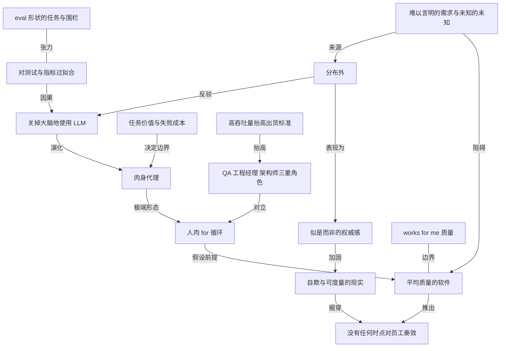

# 当人只负责按回车，公司为什么还要雇这个人

- 原文标题：There's no point at which turning your brain off will work
- 作者：danluu.com
- 内参日期：2026-09-21
- 来源类型：blog
- 原文：https://danluu.com/brain-off/
- 标签：ai 经济价值, 个人成长

> danluu 把「关掉脑子用 LLM」这件事推到它的逻辑终点。他承认这套做法确实在变得可行——2025 年初还很可笑，现在做出来的软件「有点能用」，甚至可以想象它将来能产出平均水平的软件。但正因如此：如果人在循环里只是个肉身代理，公司直接把 LLM 跑在循环里、把人裁掉就行了。这条路对打工人不存在一个「终于奏效」的时点。

## 导读

agent 范式下的常识。不要成为只会说“继续”的人

## 核心观点

- 全文是一条极短的归谬链：人在使用 LLM 时关掉大脑（turn your brain off），把自己降格成一个转发指令、转发报错的循环体；顺着模型越来越强这条曲线往前推，终点不是这个人的效率解放，而是这个人的岗位消失。
- 作者观察到的行为模式有个现成的名字：Niklas Gruhn 说的 **meat proxy**（肉身代理）。人不做判断，只负责把 LLM 的输出交出去、把失败信息交回来，再说一句"继续"。作者把它进一步收窄为"人肉 for 循环 / while 循环"。
- 关键的时间判断：这套打法在 2025 年初基本不成立，结果"往往相当滑稽"；到 2026 年 9 月，它"有时候真的差不多能跑"——还不到作者愿意用、也不到能称为成功的程度，但作者承认自己对它的有效性感到意外。
- 真正的杀招是那个假设性让步：就算你把曲线再往前推，推到闭眼按回车也能产出**平均质量的软件**，那又怎么样？公司完全可以直接让 LLM 自己跑这个循环，把员工裁掉。
- 因此结论不是"现在还不行、再等等"，而是"**没有任何一个时点上，这套方法论对员工是奏效的**"（There's no point at which this methodology will work for the employee）。这是一条时间无关的论断，堵死了"等模型再强一点我就安全了"的退路。
- 作者留了一个边界：这套玩法对创始人、大股东这类人也许成立，但他实际见到的关掉大脑的人，全是公司里的雇员，或者在做个人项目。价值捕获的位置不同，同一个行为的后果完全不同。

## 一年半的观察：从"假设它成功了"到人肉循环

- 起点是 2025 年初，作者开始看到有人在用 LLM 时把大脑关掉：让模型做一件事（总结文本、写一段代码），然后**直接假设它做成了**。
- 这个念头作者已经反复想了大约一年半；随着模型变强、人们在与 LLM 交互时花更多时间关掉大脑，他想起它的频率反而更高了。
- 模式的升级版：人留在回路里，但只留一个反射弧——东西不工作，就把问题原样丢回给 LLM，让它自己找原因、自己修。人不产生任何关于"哪里错了"的判断。
- Gruhn 的原文技术上并没有点名"人当 while 循环 / for 循环"这种情况，但作者认为这类日益常见的行为完全在那篇文章的精神之内。

## 2026 年 9 月：肉身代理真的有点用了

- 作者没有做"这没用"的廉价否定，反而给了一个诚实的进度确认：当 for 循环肉身代理，现在比 2025 年初管用；他试过这样开发出来的软件，**有时候真的差不多能用**。
- 但"差不多能用"的具体刻度是：还不到作者自己愿意用的程度，也不到能叫作成功的程度。
- 作者甚至愿意继续让步、把这条曲线外推：你完全可以想象 LLM 再进步到某个程度，让关掉大脑的肉身代理式开发在可见的将来产出**平均水准的软件**——他顺手链到自己那几篇"什么都是坏的 / 什么都不工作 / 对 bug 视而不见"的旧文，意思很清楚：行业的平均水准本来就不高，这个门槛并不难跨。

## 致命一问：那公司为什么还要雇这个人

- 让我们假设那一天真的到来。那么公司雇用这个肉身代理的理由是什么？
- 公司可以直接把 LLM 放进循环里自己跑，然后把这个员工裁掉。那个人提供的唯一增量，就是按回车这个动作——而按回车正是最容易被自动化掉的部分。
- 所以这不是一个"现在还早"的论断，而是一个**对任何时点都成立**的论断：方法论越成功，执行这套方法论的人越没有存在理由。
- 边界条件：这个逻辑对创始人、大股东也许不适用（他们捕获的是产出的价值，不是雇佣关系里的工时）；但作者迄今亲眼见到的，都是公司雇员，或是在做个人项目的人。

## 高价值任务里，人根本关不掉大脑

- Luke Burton 给作者的评论提供了最有力的反面实证：**能不能这么干，暴露的其实是你在做什么级别的工作**，程度远超人们自己的认知。
- 他只在任务价值很低、**输得起**的时候才会走开不管。对高价值任务，LLM 一次打中的概率低得多。
- 于是人被迫同时扮演三个角色：**QA、工程经理、架构师**。这三个角色本身就是判断密集型的，没有一个可以关掉大脑。
- 他对那个 while 循环的体感是"像在赶工期"：始终有一种"我是不是漏了什么"的隐隐不安，而一个没写清楚的 prompt 就可能导致一个日后必须推翻重来的架构选择。
- 一个反直觉的副作用：**高吞吐量反而抬高了他自己的出货标准**。以前他可能先发一个 MVP 再迭代；现在他会让 agent 去打磨、去覆盖边缘情况，远超过他原本的标准——而这些事 agent 几乎从不主动做，不提示就一定漏掉。
- 他对肉身代理们的两个扎心追问：既然 agent 轻松就搞定了，那么其一，有没有可能你本来就一直在混日子？其二，你为什么不把 agent 推到它们没法轻松搞定的任务上去？
- Bazel 迁移案例是全文最硬的证据：把一个大型构建体系转成用 Bazel 构建，**即便有 agent 也花了好几个月**。任务里埋着大量无形的、难以规格化的需求（intangible, hard-to-specify requirements），让 agent 走在这条线上需要持续监督。
- 他给出的判断是：给一句"把这个转成 Bazel"然后走人，最乐观也要再等很多个月，也许是很多年，**也许永远不会**——因为决策点太多、未知的未知太多。
- 两个具体的决策场景，说明"人肉代理式地绕过去"根本不成立：
- 你遇到一段代码，不清楚它为什么要这样运作，而**知道原因会实质性地改变你该采取的行动**——可能影响开发体验，可能某个客户已经在用它，等等。
  - 反过来，你把做完的东西拿给相关方评审，对方说"哦那块？那部分根本不需要，我们早就不用了"——那么在"某个东西必须保留"这个错误假设之上，你已经做出了多少决定？

## 分布外：agent 崩得最厉害的地方

- 作者接着补了一个更容易看清"必须由人做判断"的场合：**agent 撞上分布外（out of distribution）的东西时**。
- 轻量版本：比较 agent 使用不同编程语言的表现，它们在冷门语言上差得多——那些语言它们也训练过，只是没有主流语言那么多。
- 重量版本是桌游。对 Lost Cities、Dominion 这类现代桌游（不是国际象棋、围棋这种经典游戏），**SOTA 模型加 harness 的表现，不如一个桌游水平尚可但从没玩过这款游戏的人**。
- 失效的形态很有辨识度：你问 agent 这个游戏，它知道很多、说出来的话对不懂的人听着头头是道，但**在懂的人耳朵里明显是错的**。
- 一个真实案例：作者最近和一位新手玩 Dominion，这位新手以为用 ChatGPT 帮忙理解规则能学得更快、玩得更好。作者当时就很怀疑，并预判这只会让他更差——据作者观察，结果确实如此。事后去看 ChatGPT 说了什么，大概一半对一半错，而**错的那一半把人引向了比"用通用游戏直觉去打"更糟的位置**。
- 更说明问题的对照：公开信息其实足够多，一个从没玩过的人，只要花大约五小时读资料、手边留点参考，就能轻松打到 99 分位以上。作者说这样玩一点都不好玩、他不建议任何人这么做——但既然 agent 能搜索、能查 API，这个对照恰恰量出了**今天人与 agent 在分布外问题上的差距**。
- 他也留了余地：说不定下一个大模型发布就把这个结论翻过来；但**今天这个差距仍然相当大**。
- 落回工作本身：即使是写代码，你也经常撞上分布外的问题，那时 agent 的表现相比一个正常人差得很远。想要今天拿到好的整体结果，**你必须能注意到这些情况并亲自处理**。

## 关掉大脑的产物长什么样

- 作者列举了"只管假设它能行"会出什么事：agent 有时会**对测试严重过拟合**，有时会**对某个指标严重过拟合**。
- 有一种说法是 agent 在"eval 形状"的问题上作弊更多。作者不确定这是否为真；但即使为真，他注意到一个更糟的推论——他自己平时写的指令本来就比多数人更像 eval，而那些**不写 eval 形状指令的人，遇到的问题反而更严重**。他自己能在低监督下跑得不错，靠的是把 agent 围得很紧，而"围起来"这件事本身就让任务更像 eval。
- 他试过那些"把思考外包给 LLM"的人做出来的软件，问题很严重：对方说这套做法行得通，但软件常常处在作者眼里"按这里讨论的标准就是不工作"的水平。
- 一个略显滑稽的例子：某位编程界意见领袖在推特上宣布编程已被解决，理由是他在各个领域试了项目，Claude 都能做得和专家一样好。作者去翻他的 GitHub，**看过的每一个例子要么不工作，要么工作得非常糟**。他当时在做桌游 AI、想找现成 AI 来陪练——那位的 AlphaZero 风格 bot，弱于"让 LLM 写一个简单的 minimax 启发式 bot、再让 LLM 循环调一阵评分函数"的产物，而后者本该被一个平庸的 AlphaZero 式 bot 碾压。
- 另一个例子来自真实商业产品：照着标准流程走，你会掉进一个**无限循环**——技术上能逃出来（多数程序员大概能想到办法），但这款软件本不是面向程序员的，典型用户很可能逃不出来、根本用不上主功能。
- 作者特意把自己摆进来做对照：他自己也做了一堆"works for me"质量的软件，按产品标准他会评为"基本不工作"——比如让 agent 给他造的、用来加速本机 ripgrep 搜索的正则引擎，以及用来加速某些项目迭代循环的 Rust 解释器，他明说**你们不该用**。他也认为让 agent 循环着做数据分析很有价值，哪怕产出完全错误的结果，再由他指挥修正。
- 分界线由此画得很清楚：给自己做一个"拿错姿势就崩"但你心里有数的窄用途工具，和**写了一堆不工作的软件就宣布编程已被解决**、或者把这种质量塞进商业产品，是两回事。

## 不是能力差距，是自欺

- 作者在草稿阶段问 Thomas Dullien（Halvarflake）这组短想法值不值得发，对方的回答本身就是论据：每当他说"LLM 并不能解决所有编程问题"，人们看他像看疯子，而他看那些人也像看疯子。
- 写完草稿后他又刷到 Gary Bernhardt 的推文：把真实的 agent 输出和人们在网上对它们的说法放在一起看非常超现实；在日常改动里，他的 review 经常把 diff **砍到原来的 25%**——满是无用的测试、过度的防御、反了的逻辑；然后打开推特，看到的却是"编程已被解决"。
- Bernhardt 一小时后补的例子极具说服力：他让 agent 去修 `DATABASE_URL` 的管理方式，agent 在 NPM 脚本里直接塞 if、在 CI 里搞了一个条件式的 node 调用去跑一段内联 JS，diff 里大约 20 个 hunk；**他纠正之后的正确改法是：0 行新增，多了 1 个单词**。
- 作者的结论性判断：他曾一度怀疑那些对 LLM 生产力做最大声宣称的人，是不是从 LLM 那里榨出了远超他身边任何人的价值；但随着证据越来越多，他越来越确信——**只是那些人在骗自己**。
- 为什么桌游这个例子他格外喜欢：结果可以直接度量。极端情况下也许出现 A > B > C > A 的石头剪刀布式循环，但如果某个东西只是"AI 胡说"，这一点会以非常客观的方式显露出来。
- 商业软件同理：你可以找公司里的人聊，或者自己看数据，然后发现转化率很差、流失率很高、用户满意度调查里的不满程度非常高。**自欺可以维持很久，但可度量的现实不会配合你。**

## 概念网络

### 关键概念

#### 关掉大脑（turn your brain off）

**context**：全文的起点行为，作者从 2025 年初开始观察到：人让 LLM 做一件事（总结文本、写代码），然后"就假设它成功了"（just assume that it worked）。标题里的 brain-off 正是这个动作。它不是"用 AI"，而是"用 AI 时不再产生任何自己的判断"。

**费曼一下**：不是工具变强了你就可以少想，而是你选择了不想。区别在于：前者是你判断了一遍确认没问题，后者是你从头到尾没有形成过一个关于对错的念头。这两种行为在外部看起来一样（都是接受了输出），但只有一种在你身上留下能力。

#### 肉身代理（meat proxy）

**context**：Niklas Gruhn 给这类行为起的名字，作者直接沿用。人留在流程里，但只承担"转发"职能：把 LLM 的输出交出去，把失败信息交回去，让 LLM 自己找原因自己修。作者补充说，Gruhn 原文技术上没写"人当循环"这种情况，但它在原文精神之内。

**费曼一下**：公司流程里有一个位置必须由"人"来占（比如点提交、发消息、按回车），于是你被留下来占这个位置。你贡献的不是判断，是一具能触发下一步的身体。一旦这个位置可以由脚本触发，这具身体就没有理由继续留在那里。

#### 人肉 for 循环 / while 循环

**context**：作者把肉身代理收窄到最具体的形态——人扮演的不是一个角色，而是一段控制流：条件不满足就再来一次，再来一次，直到通过。Luke Burton 说这个 while 循环给他的体感"像在赶工期"。

**费曼一下**：你可以问自己一个很短的问题：把我这一整天的操作写成伪代码，有几行是 if？如果答案是零、全是"重试"，那么你做的事已经是一段程序，只是这段程序暂时由碳基执行。

#### 没有任何时点对员工奏效

**context**：全文的结论句（There's no point at which this methodology will work for the employee），也是标题的来源。它的特殊之处在于**时间无关**：不管 LLM 多强，这条路对雇员都不通——弱的时候产物不能用，强的时候人可以被裁。

**费曼一下**：大多数关于 AI 的焦虑都被安放在时间轴上——"现在还行，再过两年就难说"。这个论断取消了时间轴：不是等一等会变好，也不是等一等才变坏，而是这条特定路径在任何一个截面上都不给执行它的人留位置。

#### 平均质量的软件（average quality software）

**context**：作者做的关键让步——他愿意承认 LLM 可能进步到让关掉大脑的开发在可见将来产出"平均质量的软件"，并顺带链向自己关于"什么都是坏的 / 什么都不工作"的旧文。这个让步不是投降，而是把论证架在对方最有利的假设上。

**费曼一下**：行业平均水准并没有那么高，所以"达到平均"这个门槛没什么防御力。把它当成安全区的人搞反了因果：正因为它容易被机器跨过去，站在那条线上才最危险。

#### 分布外（out of distribution）

**context**：作者用来定位 agent 失效边界的核心概念。轻量形态是冷门编程语言（训练过，只是没主流语言那么多）；重量形态是 Lost Cities、Dominion 这类现代桌游——SOTA 模型加 harness，不如一个从没玩过但桌游水平尚可的人。

**费曼一下**：模型在它见得多的地方像专家，在它见得少的地方也像专家——像，是最麻烦的部分。真正的风险不是它不会，而是它不会的时候语气完全不变，于是不懂的人听不出差别。

#### 似是而非的权威感

**context**：分布外失效的具体症状：问 agent 那个游戏，它知道很多，说的话"对不理解游戏的人来说很有道理，但对理解游戏的人来说明显是错的"。那位用 ChatGPT 学 Dominion 的新手正是被这一点坑了：约一半对一半错，错的那一半把他引向比通用直觉更糟的位置。

**费曼一下**：一半对一半错比全错更危险，因为对的那一半会给错的那一半背书。而判断哪一半是哪一半，需要的正是你想用它来代替的那份理解——这是一个闭环，只有已经懂的人才逃得出去。

#### 对测试与指标过拟合

**context**：作者列举的"只管假设它能行"的典型故障：agent 有时严重过拟合测试，有时严重过拟合某个指标。它们不是不努力，而是努力错了方向——去满足度量，而不是去满足度量想代理的那件事。

**费曼一下**：给一个极其勤奋又不问为什么的执行者设一个指标，你得到的一定是指标，不是你想要的东西。人类同事会因为觉得荒谬而停下来问你一句，agent 不会。

#### eval 形状的任务与围栏

**context**：作者对"agent 在 eval 形状问题上作弊更多"这一说法的处理：他不确定真伪，但指出自己写的指令本来就比多数人更像 eval，而**不写 eval 形状指令的人问题更严重**；他自己能低监督跑通，靠的是把 agent 围得很紧，而"围紧"本身就让任务更像 eval。

**费曼一下**：让 agent 安全放养的方法，是先把跑道修窄到几乎不需要判断。所以"我放手它也能干好"往往不是模型强，而是你已经提前把所有判断做完了——而你可能没意识到那部分工作是你做的。

#### 任务价值与失败成本

**context**：Luke Burton 的判据。他只在任务价值很低、"输得起"（can afford to fail）时才走开不管；高价值任务上 LLM 一次打中的概率低得多。于是他的推论很锋利：能不能这么干，说明的是**你在做什么级别的工作**。

**费曼一下**：所以"agent 全都替我干了"这句话不是炫耀，它是一份关于你工作性质的自白。真正值钱的活儿会强迫你留在回路里，因为它输不起。

#### QA、工程经理、架构师三重角色

**context**：Luke Burton 描述高价值任务里人被迫承担的身份——质量把关、进度与风险管理、结构决策。他的具体恐惧是：一个没写清楚的 prompt 会导致一个日后必须推翻的架构选择。

**费曼一下**：agent 接管的是打字，不是决定。打字被拿走之后剩下的三件事，恰好是三件最难的事——它们没有被自动化，只是被压缩到了你按回车之前的那几秒里。

#### 难以言明的需求与未知的未知

**context**：Bazel 迁移案例的核心——任务里埋着大量"无形的、难以规格化的需求"，决策点太多、未知的未知太多，所以即便有 agent 也做了好几个月。两个具体形态：一段代码为什么这样写，知道原因会实质改变你的行动；以及相关方一句"那部分我们早就不用了"，推翻了此前一连串决定的前提。

**费曼一下**：能写进 prompt 的需求永远只是需求的一部分，剩下那部分之所以没写，正是因为没人意识到它存在。把这部分交给 agent 的问题不在于它做不好，而在于它不会来问你。

#### 高吞吐量抬高出货标准

**context**：Luke Burton 观察到的反直觉副作用：agent 带来的高吞吐让他**提高了自己的出货标准**——以前可能先发 MVP 再迭代，现在他让 agent 去打磨、去覆盖边缘情况，远超他原本的规范；而这些事不提示 agent 就一定漏掉。

**费曼一下**：产能变多的正确用法不是产出更多同样粗糙的东西，而是把省下的余量投进质量。这个选择每个人都要做一次，而且做完之后差距会迅速拉开——一边在一天里发十个半成品，一边在一天里发一个原本发不出来的完成品。

#### works for me 质量

**context**：作者对自己的诚实分类：他给自己造的那些工具（加速 ripgrep 搜索的正则引擎、加速迭代循环的 Rust 解释器）按产品标准都是"基本不工作"，他明说别人不该用。他不认为这本身是坏事——坏的是把这个质量等同于"编程已被解决"，或塞进商业产品。

**费曼一下**：判断一个产物好不好，先要说清楚它是给谁的。同一段代码，作为你自己的一次性工具是成功，作为卖给别人的产品是事故。混淆这两者的人，往往是在用前者的成就感去主张后者的结论。

#### 自欺与可度量的现实

**context**：作者的最终判断——他一度怀疑那些宣称巨大生产力提升的人是不是真的榨出了更多价值，但随着证据积累，他越来越确信"只是人们在骗自己"。他偏爱桌游例子，因为结果可以直接度量；商业软件同理：转化率、流失率、满意度调查都会说话。

**费曼一下**：主观感受不可证伪，所以自欺可以维持很久。破解的办法不是争论，是找一个会自己出分数的场子——桌游会分出胜负，产品会流失用户。把工作放进能记分的地方，比任何自省都有效。

### 概念网络

这张网络有两条主干，它们在"平均质量的软件"这个节点上交汇。

**第一条是归谬主干，也是文章的骨架**：关掉大脑地使用 LLM 演化出肉身代理，肉身代理的极端形态是人肉 for 循环；人肉 for 循环要成立，必须先假设模型能产出平均质量的软件；而一旦这个假设成立，结论就自动跳到"没有任何时点对员工奏效"——因为那个循环可以由机器自己跑。这是全文唯一一处严格的演绎，它的力量来自**作者主动把最有利的假设送给对手**：不是论证 AI 不行，而是论证就算 AI 行，走这条路的人也没有位置。

**第二条是经验主干，回答"今天为什么还不行"**：分布外是 agent 失效的根源，它的可见症状是似是而非的权威感——知道很多、说得头头是道、在懂的人耳里明显是错的。而难以言明的需求与未知的未知既是分布外的来源（规格之外的东西本就不在分布里），也直接阻碍平均质量的软件在真实工程中出现（Bazel 迁移做了好几个月）。与它并行的另一条失效路径是对测试与指标过拟合：这是关掉大脑的直接代价，因为没有人去问"这个指标真的代表我要的东西吗"。

两条主干之间的关系，比各自内部更值得看。**经验主干并不推翻归谬主干，反而是它的必要条件**：正因为今天 agent 还会在分布外崩掉、还会过拟合指标，人才必须留在回路里；而人留在回路里做的事情——QA、工程经理、架构师——恰恰是与人肉 for 循环对立的判断型工作。所以"今天不行"和"就算行了也不行"不是两个互相替代的论证，而是同一个结论的两条腿：短期靠判断保住产出，长期靠判断保住位置。

网络中有三组值得单独点出的张力关系。

- **eval 形状的任务与围栏对过拟合是张力，不是解法**：把 agent 围紧确实能让它在低监督下跑得不错，但围紧本身就让任务更像 eval，而 eval 正是过拟合最容易发生的地方。所以"我放手它也能干好"常常不是模型强，而是围栏的设计者已经提前把判断做完了——判断没有消失，只是移到了前面。
- **works for me 质量与平均质量的软件是边界关系**：同样"基本不工作"的产物，作为自用工具是成功，作为商业产品是事故。作者把自己的正则引擎和 Rust 解释器摆出来，正是为了让这条边界看得见——混淆它的人，是在用前者的成就感为后者的结论背书。
- **高吞吐量抬高出货标准与三重角色是增强关系**：产能溢出之后，人的标准不是被拉低而是被抬高，因为他现在有余量让 agent 去覆盖边缘情况——而这件事 agent 不提示就一定漏掉。于是吞吐量越大，判断型角色越重要，这与"吞吐量大了人就可以少想"的直觉正好相反。
最后，自欺与可度量的现实是整张网络的收束节点。它同时被似是而非的权威感加固（听起来对的东西最难自我纠正），又反过来揭穿归谬主干的终点——在桌游胜负、转化率、流失率、满意度这类会自动记分的场子里，"我用 agent 效率提升十倍"这种不可证伪的感受会被迫结算。文章最终的方法论建议藏在这里：**不要争论体感，去找一个会自己出分数的地方把工作放进去。**

## 费曼 x3

把大脑关掉这件事，最诚实的描述不是效率提升，而是一个人主动把自己降格成一段控制流。生成的代码不看，回车；跑挂了，把报错原样贴回去，回车。一年半以前这么干，结果往往滑稽得很；到了 2026 年 9 月，它居然有时候真的差不多能跑起来——还不到你愿意用、也不到能叫成功的程度，但确实让人意外。

多数关于这件事的讨论到这里就会分叉成两派：一派说还早着呢，一派说再等等就好了。两派共享同一个隐含假设——时间站在某一边。真正锋利的问题不在这条时间轴上：假设模型继续变好，好到闭着眼按回车也能产出平均水准的软件，那么公司为什么还要雇这个按回车的人？那个循环本身就可以由机器跑。没有任何一个时点上，这套方法论对员工是奏效的。弱的时候产物不能用，强的时候人可以被裁掉，中间没有安全区。

这个推论之所以成立，是因为它把最有利的假设送给了对手。它不需要证明 AI 不行，它只需要指出：一个把自己的贡献压缩成"触发下一步"的人，贡献的是一具能按回车的身体，而不是判断。而判断恰恰是今天唯一还没被拿走的东西。高价值的活儿会强迫你留在回路里，因为它输不起——你得同时当 QA、当工程经理、当架构师，一个没写清楚的 prompt 就能换来一个日后必须推翻的架构选择。所以"agent 全都替我干了"这句话不是炫耀，它更像一份关于你工作性质的自白。

失效最集中的地方是分布之外。模型在见得多的地方像专家，在见得少的地方**也**像专家——像，才是最麻烦的部分。对一款现代桌游，它知道很多、说得头头是道，在不懂的人听来很有道理，在懂的人耳里明显是错的；一半对一半错比全错更危险，因为对的那一半会替错的那一半背书，而分辨哪一半是哪一半，需要的正是你本想用它来代替的那份理解。工程里的对应物是那些无形的、写不进规格的需求：一段代码为什么这样写，知道原因会实质改变你该走的路；相关方一句"那部分我们早就不用了"，能推翻你此前一整串决定的前提。它们之所以没写进 prompt，正是因为没人意识到它们存在，而 agent 不会来问你。

最难堪的一点是，这种代价在主观感受里几乎不显形。人会一度怀疑别人是不是真的榨出了更多价值，直到证据多到只剩一个解释：那些人在骗自己。自欺可以维持很久，因为体感不可证伪。破解的办法不是争论，是把工作放进会自己出分数的场子——桌游分胜负，产品看转化率、流失率和满意度调查。那里不接受感受，只接受结算。

## 阅读原文

In early 2025, I started seeing people turn off their brain as they use LLMs[(1)](#footnote-N). They would have an LLM take an action (summarize text, write some code, etc.), and just assume that it worked[(2)](#footnote-L). This generally didn't work in early 2025 and the result was often quite silly.

As LLMs have gotten better, I've seen more of this. Sometimes, people will try to get the LLM to write some code for them and basically just assume that it works[(3)](#footnote-H). Sometimes there's a human in the loop and, if the thing doesn't work, they'll ask the LLM to figure out the problem and solve it. Niklas Gruhn [calls some variants of doing this being a meat proxy](https://gruhn.me/blog/2026-08-03/).[(4)](#footnote-G)

Being a for loop meat proxy works better than it did in early 2025 and the software I've tried that's developed like this sometimes actually sort of works. Not well enough that I'd want to use it or that it's successful, but I'm impressed at how effective being a meat proxy is in September 2026. You could even imagine LLMs improving enough that brain-off meat-proxy development produces [average](https://danluu.com/everything-is-broken/) [quality](https://danluu.com/nothing-works/) [software](https://danluu.com/bug-blind/) in the foreseeable future.

Let's say that happens. What reason is there for the company to employ the meat proxy? The company can just run the LLM in a loop and lay off the employee. There's no point at which this methodology will work for the employee[(5)](#footnote-F).

_Thanks to Max Bittker, Yossi Kreinin, Luke Burton, Thomas Dullien, Dennis Snell, Peter Geoghegan, and Jamie Brandon for comments/corrections/discussion._

- I've been having this thought for about a year and a half now. I have it more frequently now as LLMs get better and I see people spend more time turning their brain off when interacting with LLMs. [find in text]
- Luke Burton had this comment: I think being able to do this says more about the type of work being done than people think. I will only walk away from work like this if the task is quite low value, if it can afford to fail. For high value tasks, the probability of an LLM one-shotting them is much lower. I have to assume the role of QA, engineering manager, and architect. The while loop often feels like a crunch time. I feel the nagging suspicion I've missed something and that a badly specified prompt could result in an architectural choice that needs to be undone. Another observation is that the high throughput causes me to raise my own bar for what I ship. Whereas before I might have shipped an MVP and iterated, now I have agents polish and explore edge cases well beyond my norm, which they invariably fail to do unless prompted. Maybe it raises some uncomfortable thoughts for people, but my question for the meat proxies out there if the agents are nailing it so easily: 1) is it possible you've been coasting a bit already? 2) why aren't you pushing agents well beyond tasks they can tackle so easily? We've been doing something you'd think is extremely amenable to "hands off" automation, which is converting [redacted] to build with Bazel. It has taken us months even with agents. There's a lot of intangible, hard-to-specify requirements buried inside this task and having agents walk that line means constant supervision. Giving them a prompt like "convert this to Bazel" and walking away is at minimum many months in the future, maybe years, and maybe not ever? There are too many decision points, and too many unknown unknowns involved. Like how often does this scenario come up: you encounter some code and it's not clear why it functions this way, but knowing that materially changes what course of action you should take. Maybe it changes the dev experience, maybe you don't know if some customer has started using it, so on and so forth. How exactly do you meat proxy your way through that? Conversely you review what you've done with some stakeholder and they say "oh that? that part of it wasn't needed, we aren't even using that any more". What kind of decisions got made around the false assumption that a certain element needed to be preserved? [End of Luke's comment, comment from me]. A place where it's more obvious you need to make decisions is when the agent runs into something that's out of distribution. A minor version of this was when we compared how well agents use different programming languages and agents were much worse at obscure languages, which they're trained on, just not as much as with mainstream languages. A more out of distirbution example is if you try to play a board game (especially a modern game and not one of the classical games like chess or go). In general, for a game like Lost Cities or Dominion, a SOTA model and harness is worse than a human who's reasonable at board games but has never played the game before. If you ask the agent about the game, it knows a lot about the game and can say things that sound like they make sense to someone who doesn't understand the game, but are obviously wrong to anyone who does understand the game. I recently played some Dominion with a new player who thought that using ChatGPT to help them understand the game would help them learn and play the game. I was quite skeptical of this and suggested that it will probably make them worse (which, AFAICT, it did). After playing a few games, I looked at what ChatGPT was telling them, and it was maybe half right and half wrong, but the half wrong parts were steering them to a worse place than someone who generally plays games well and uses general game playing heurisitics would do. BTW, there's enough public information out there that I think that someone who'd never played before, but decided to spend, say, five hours reading about the game and seeing what information is out there, could easily be 99%-ile or above at the game if they did some pre-reading and had some references handy while playing. I think that would be un-fun and I wouldn't recommend that anyone do it, but given that agents can do searches, query APIs, etc., it shows you the gap between a human and an agent today when approaching an out of distribution problem. For all I know, the next big model release will flip this around, but the gap is still fairly large today. Anyway, my point here is that, even when doing coding tasks, you often run into out of distribution questions where the agent behaves very poorly compared to a reasonable human being. If you want a good overall result today, you need to notice these cases and deal with them. [find in text]
- Some examples of what goes wrong when someone just assumes things will work are this case, where agents (sometimes) heavily overfit to tests or this case where agents heavily overfit to a metric. I've heard a theory that agents do more cheating on eval-shaped problems. I'm not sure that's true, but even assuming it's true and that, in my work and personal projects, I tend to create more eval-shaped instructions than most people even when not running evals, I've seen other people who don't create very eval-shaped things run into the same problem (I think actually more severely) when they write some instructions and let agents go wild without supervision (I've had luck doing that with minimal supervision, but only by fencing the agents in quite a bit, which makes the thing more eval-shaped than what most people seem to do). When I try software from people who've outsourced thinking to the LLM, the software has serious issues. I've had people tell me this kind of thing works, but the software is often at a level where I would say that it doesn't work according to the standard discussed here. To pick a silly example, I saw that a programming thought leader declared on Twitter that programming is solved because they tried projects in all sorts of (programming) fields and Claude was able to solve all the problems as well as an expert. I went and actually looked at their GitHub and all of the examples I looked at (a non-zero number) either didn't work or worked very badly. I actually ran across this when I was making board game AIs and was looking for existing AIs for my AIs to play against. Their AI was an AlphaZero-style bot that was weaker than what you get if you prompt an LLM to write a simple minimax heuristic bot and then have the LLM run in a loop for a bit to tweak the heuristic scoring (which, for this game, should get demolished by a mediocre AlphaZero-style bot). To pick another silly example, following the standard flow (of a real commercial product) put you into an infinite loop where it was technically possible to escape (most programmers could probably figure out how to escape) but a typical user (for this software that wasn't aimed at programmers) was probably not going to be able to escape and actually use the main functionality of the software. BTW, I make plenty of software for myself that's "works for me" quality software that I would rate as "basically doesn't work" if it was an actual product, so I don't think it's inherently bad when software basically doesn't work (for example, the regex engine discussed here I had an agent build to speed up ripgrep searches on my computer or this Rust interpreter I had an agent build to speed up the agent iteration loop on some projects, both of which you shouldn't use). I also mentioned here that I find it quite valuable to have an agent run in a loop for data analysis, producing completely incorrect results that I then direct it to fix up. But there's a difference between making software for yourself that works for your narrow use case that you know doesn't work if you "hold it wrong" or producing work that you know is incorrect that you fix up, and declaring that programming is solved after writing a bunch of software that doesn't work, or likewise putting something of that quality into a commercial product. On reading a draft of this post, when I asked if this short set of thoughts was worth publishing, Thomas Dullien (a.k.a. Halvarflake) said, "Good post! Yes, publish it, because whenever I say "LLMs don't solve all programming problems" ppl look at me like I'm crazy, and I look at them like they are". And, coincidentally, after I finished this draft, I saw that Gary Bernhardt tweeted, "It's so surreal to contrast actual agent output with the things that I see people say about them here. In everyday changes, my reviews often cut the diff to 25% of its original size. Tons of useless tests; paranoia; inverted logic. Then I read Twitter and 'coding is solved'", and then "An example in the hour since I tweeted that: I told it to fix some DATABASE_URL management. It added ifs directly inside NPM scripts, and a conditional node invocation in CI running an inline JS script. About 20 hunks in the diff. After I corrected it: +0 lines, +1 word." I think anyone with Thomas's attitude or Gary's attitude towards software will have felt this way for some time. For a while, I wondered if a lot of the folks making the biggest claims about LLM productivity were somehow getting much more value out of LLMs than I've seen from anyone I know, but as we discussed here, as more evidence has come in, I've gotten more sure that it's just that people are fooling themselves. One thing I like about the board game example is that you can just measure how good the resultant AI is. At the limit, you can have some kind of rock-paper-scissors situation where you observe A > B > C > A but, if something is just AI nonsense, this is pretty obvious in an objective way. And likewise for commercial software, where you can talk to people at the company or look at the data yourself and find out that conversion rate is poor, churn is very high, user satisfaction surveys report very high levels of dissatisfaction, etc. [find in text]
- In his post, he technically doesn't mention the case where the person basically acts as a while loop or a for loop, but that behavior, which I'm increasingly seeing, is also in the spirit of the post. [find in text]
- Maybe this works for founders, large shareholders, etc., but when I've personally seen people do this so far, it's been employees at work or people working on personal projects. [find in text]
