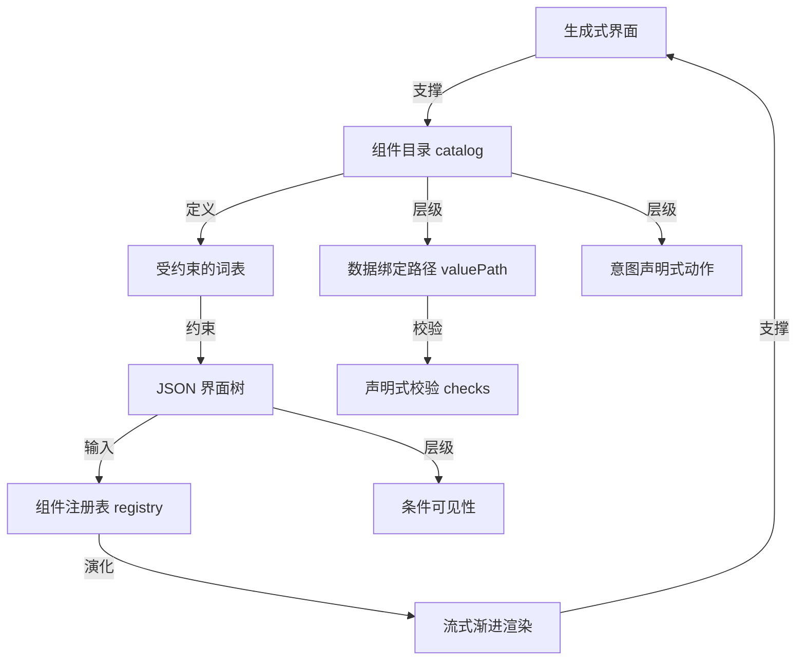

# Vercel 开源 json-render：把生成式界面写成 JSON

- 原文标题：vercel-labs/json-render
- 作者：GitHub
- 内参日期：2026-09-21
- 来源类型：blog
- 原文：https://github.com/vercel-labs/json-render
- 标签：agents, 工具技巧

> TypeScript 写的 Generative UI 框架，1.7 万星、900 多 fork。思路是让模型产出描述界面的 JSON 而不是直接产出代码，渲染层负责把它变成组件——agent 时代的界面怎么生成，这是一种正在被押注的答案。

## 导读

GitHub repo 欣赏，json render

## 核心观点

- json-render 是 Vercel Labs 开源的生成式界面框架，一句话定位是三个词：**Predictable. Guardrailed. Fast.**（可预测、有护栏、快）。
- 它要解决的场景是：让终端用户用一句 prompt 生成 dashboards、widgets、apps 和数据可视化，但这些界面「safely constrained to components you define」——只能用你事先定义的组件拼出来。
- 核心论断是一句工程判断：「When users prompt for UI, you need guarantees.」用户拿自然语言点单界面时，你需要的不是更聪明的模型，而是**保证**。
- 拿到保证的手段，是给 AI 一套 **constrained vocabulary（受约束的词表）**：模型不生成代码，只生成一棵符合你 schema 的 JSON 树，渲染由你自己的 React 组件负责。
- 三条收益写得很直白：Guardrailed（AI 只能用你目录里的组件）、Predictable（JSON 输出每一次都匹配你的 schema）、Fast（随模型响应流式渐进渲染）。
- 安装只有一行：`npm install @json-render/core @json-render/react`；许可证是 Apache-2.0。

## 问题定义：生成式 UI 缺的是「保证」而不是能力

- 文章没有从「AI 能不能画界面」切入，而是从交付侧切入——一旦把生成界面的权力交给终端用户，生产系统需要的是确定性边界。
- 这决定了整个设计取向：与其让模型自由生成前端代码，不如**先收窄它能说的话**，把生成动作限制在一份由开发者定义的组件与动作词表内。
- 由此推导出的分工很清晰：AI 负责「组合」，开发者负责「渲染」和「执行」。模型不碰样式、不碰副作用，只产出结构。

## 三步上手：目录、注册表、生成

- **第一步：Define Your Catalog（what AI can use）** —— 用 `createCatalog` 声明 AI 可用的全部材料。
- `components` 里每个组件用 zod 写 props schema，例如 `Card` 只有 `title: z.string()` 且 `hasChildren: true`；`Metric` 有 `label`、`valuePath`、`format: z.enum(['currency', 'percent', 'number'])`。
  - `valuePath` 一行注释点出关键设计：`// Binds to your data`——AI 写的是数据路径，不是数据本身。
  - `Button` 的 `action` 用 `ActionSchema`，注释同样是纲领性的：`// AI declares intent, you handle it`（AI 声明意图，你来处理）。
  - `actions` 是另一份独立词表，每个动作带 `description`，如 `export_report: { description: 'Export dashboard to PDF' }`、`refresh_data: { description: 'Refresh all metrics' }`——描述是给模型看的，执行权仍在应用侧。
- **第二步：Register Your Components（how they render）** —— 一个 `registry` 把组件名映射到真正的 React 实现。
- `Card` 拿 `element.props.title` 和 `children`；`Metric` 用 `useDataValue(element.props.valuePath)` 取值后再 `format`；`Button` 把 `element.props.action` 交给 `onAction` 回调。
  - 这一步是「目录」与「实现」的分离点：目录是契约，注册表是兑现方式，两者可以各自演化。
- **第三步：Let AI Generate** —— 从 `@json-render/react` 取 `DataProvider`、`ActionProvider`、`Renderer`、`useUIStream`。
- `const { tree, send } = useUIStream({ api: '/api/generate' })`：`tree` 是流进来的 JSON 界面树，`send` 把用户输入（回车触发）发给生成接口。
  - 动作在应用侧兑现，如 `export_report` 落到 `downloadPDF()`、`refresh_data` 落到 `refetch()`。
  - 全文对这一段的总结只有一句：「That's it. AI generates JSON, you render it safely.」

## 三项特性：可见性、动作、校验都写进 JSON

- **Conditional Visibility（条件可见性）**：显隐不是前端写死的 if，而是 JSON 里的 `visible` 表达式。
- 支持逻辑组合与数据路径，例如 `Alert` 的 `visible` 写成 `{ "and": [ { "path": "/form/hasError" }, { "not": { "path": "/form/errorDismissed" } } ] }`。
  - 也支持鉴权语义：`AdminPanel` 只需 `"visible": { "auth": "signedIn" }`——权限判断留在框架侧，不靠模型自觉。
- **Rich Actions（带确认与回调的动作）**：动作是一个结构化对象，而不是一段回调代码。
- `params` 用路径取值：`"paymentId": { "path": "/selected/id" }`、`"amount": { "path": "/refund/amount" }`。
  - `confirm` 直接描述确认对话框：`"title": "Confirm Refund"`、`"message": "Refund ${/refund/amount} to customer?"`、`"variant": "danger"`——退款这类高风险操作的二次确认被写进了协议层。
  - `onSuccess` / `onError` 用 `set` 回写状态，如 `{ "set": { "/ui/error": "$error.message" } }`。
- **Built-in Validation（内置校验）**：表单校验同样声明化。
- `TextField` 的 `checks` 是一个数组：`{ "fn": "required", "message": "Email is required" }`、`{ "fn": "email", "message": "Invalid email" }`，并用 `validateOn: "blur"` 指定触发时机。
  - 校验规则由框架内置函数名指定，模型只能引用、不能自创实现。

## 工程形态与运行机制

- 包边界清楚：`@json-render/core` 负责 types、schemas、visibility、actions、validation；`@json-render/react` 负责 React renderer、providers 和 hooks。
- 仓库结构是典型的 monorepo：`packages/` 下是 core 与 react，`apps/web/` 是 Docs 与 Playground 站点，`examples/dashboard/` 是示例仪表盘。
- 本地跑起来只需 `pnpm install` 加 `pnpm dev`，然后 `http://localhost:3000/` 看文档与 Playground、`http://localhost:3001/` 看示例 Dashboard。
- **How It Works 的四段链路**：User Prompt（如 "dashboard"）→ AI + Catalog（guardrailed）→ JSON Tree（predictable）→ Your React Components（streamed）。
- Define the guardrails：先定义组件、动作和数据绑定这三类护栏。
  - Users prompt：终端用户用自然语言描述想要什么。
  - AI generates JSON：输出永远可预测，受限于你的目录。
  - Render fast：随模型响应流式渐进渲染。
- 这张流程图把整篇 README 的主张压成一句可验证的话：**不确定性只允许存在于「AI + Catalog」这一格，前后两端都是确定的。**

## 概念网络

### 关键概念

#### 生成式界面（Generative UI）

**context**：文章开篇的定位句——「Let end users generate dashboards, widgets, apps, and data visualizations from prompts」。这里的生成式界面不是开发者用 AI 写前端代码，而是**终端用户**在运行时用一句 prompt 拿到一个界面。

**费曼一下**：过去软件的界面是厂商做好的固定菜单，你只能点。生成式界面是你直接说「给我一个看本月退款情况的面板」，系统当场拼一个给你。难点不在于能不能拼出来，而在于拼出来的东西会不会出事。

#### 受约束的词表（constrained vocabulary）

**context**：全篇的方法论核心——「json-render gives AI a constrained vocabulary so output is always predictable」。它是「Guardrailed」这一条收益的技术形态。

**费曼一下**：不要让 AI 用一门完整的语言说话，只给它一本很薄的词典。词典里有什么，它就只能说什么。表达能力换来了可预测性，而对业务界面来说，这笔交易通常划算。

#### 组件目录（catalog）

**context**：由 `createCatalog` 声明，包含 `components` 与 `actions` 两份清单，每个组件的 props 用 zod schema 定义（如 `format: z.enum(['currency', 'percent', 'number'])`），是「what AI can use」的唯一真源。

**费曼一下**：catalog 就是那本薄词典本身。你写进去的每个组件和每个动作，都是 AI 被允许说的一个词；没写进去的，它连提都提不出来。

#### JSON 界面树（JSON tree）

**context**：模型的输出形态，也是 How It Works 链路中间的那一格——「JSON Tree（predictable）」。README 用大量 JSON 片段展示它的样子：`"type": "Alert"` 加 `props`、`visible`、`action` 等字段。

**费曼一下**：AI 交出来的不是能跑的代码，而是一张组装清单：用哪些零件、每个零件填什么参数、什么条件下出现。清单没有执行力，所以它再离谱也炸不了你的应用。

#### 组件注册表（registry）

**context**：第二步「Register Your Components（how they render）」的产物，把 `Card`、`Metric`、`Button` 等名字映射到真正的 React 实现，`Metric` 在其中调用 `useDataValue` 取数、`Button` 在其中把 action 交给 `onAction`。

**费曼一下**：目录说「有这个零件」，注册表说「这个零件长什么样、怎么动」。两者分开的好处是：换皮肤、改实现都不用动 AI 那一侧的契约。

#### 数据绑定路径（valuePath）

**context**：组件 props 中的一类特殊字段，注释写明 `// Binds to your data`；`Metric` 用 `useDataValue(element.props.valuePath)` 解析，表单用 `"valuePath": "/form/email"` 双向绑定。

**费曼一下**：AI 不抄你的数据，只写数据的地址。它说「这里放 `/refund/amount`」，真正去金库取数的是你的代码。数据从头到尾没进过模型的输出。

#### 意图声明式动作（AI declares intent, you handle it）

**context**：`Button` 的 `action` 字段遵循 `ActionSchema`，catalog 的 `actions` 里每个动作只有 `description`，真正的执行绑定发生在应用侧（`export_report: () => downloadPDF()`）；动作还可带 `params`、`confirm`、`onSuccess`、`onError`。

**费曼一下**：模型只能按门铃，不能进门。它说「我要退款」，退款怎么做、要不要先弹一个红色的确认框，全由你决定。危险操作的闸门握在你手里。

#### 条件可见性（conditional visibility）

**context**：JSON 中的 `visible` 字段，支持 `and` / `not` 与 `path` 组合的逻辑表达式，也支持 `{ "auth": "signedIn" }` 这种鉴权语义。

**费曼一下**：什么时候该显示、什么时候该藏起来，这件事本身也被写成了数据。尤其是权限——管理面板的显隐由框架按登录状态判定，而不是指望生成出来的界面自己老实。

#### 声明式校验（checks）

**context**：`TextField` 的 `checks` 数组引用内置校验函数名（`required`、`email`）并各自带 `message`，配合 `validateOn: "blur"` 指定触发时机；校验能力归 `@json-render/core`。

**费曼一下**：校验规则是从框架的现成清单里挑的，不是 AI 现写的。它只能说「这个字段要必填、要是邮箱」，至于怎么判断邮箱合法，轮不到它发挥。

#### 流式渐进渲染（stream and render progressively）

**context**：「Fast」这条收益的实现方式，由 `useUIStream` hook 提供 `tree` 与 `send`，How It Works 图中标注为 `(streamed)`。

**费曼一下**：不等模型把整棵树吐完再画，而是吐一点画一点。用户看到的是界面逐块长出来，而不是一个转了五秒的加载圈。

### 概念网络

整张网络只有一个源头问题：**生成式界面要落地，缺的是保证而不是模型能力**。围绕这个问题，README 的全部概念可以按「收窄—转译—兑现」三段读。

- **收窄段（C1 → C2 → C3 → C4）**：生成式界面是需求，组件目录是手段，受约束的词表是手段生效的机理，JSON 界面树是机理的产物。这是一条严格的因果链——正因为 AI 只能用目录里的词，输出才「matches your schema, every time」。这里的关系不是并列而是递进：目录不是可选配置，它是可预测性的**唯一来源**。
- **转译段（C4 → C5）**：JSON 树本身没有执行力，注册表是它与真实 React 组件之间唯一的转换器。这条边承载了全框架最重要的一次权力切分：**描述权给模型，执行权给开发者**。注册表如果被绕过，整套护栏立刻失效。
- **兑现段（C6、C7、C8、C9）**：这四个概念是同一原理在四个维度上的重复应用——数据（只给路径不给值）、动作（只声明意图不执行）、显隐（含鉴权，交给框架判定）、校验（只能引用内置函数）。它们在目录与 JSON 树之下并列展开，彼此没有依赖，但共享同一条纪律：**凡是有副作用或有风险的地方，模型都只被允许写下「指向」，兑现由应用侧完成。** C6 与 C9 之间存在一条额外的支撑关系——绑定路径确定了「校验谁」，checks 确定了「怎么算合格」。
- **闭环（C5 → C10 → C1）**：注册表就绪后，渲染可以随流式输出渐进进行，这把「Fast」从性能优化提升成体验前提，回过头来让生成式界面真正可用。三条收益因此不是并列的卖点，而是一条链：Guardrailed 产生 Predictable，Predictable 才允许 Fast——你必须先确定每一块 JSON 都合法，才敢边收边画。
网络里最容易被忽略的张力在 C3 与 C1 之间：词表越窄，保证越强，但用户能生成的东西也越少。README 没有回避这一点，它的取舍是明确的——宁可让用户只能拼出你设计过的界面，也不要一个可能拼出任何东西的系统。

## 费曼 x3

把界面生成权交给终端用户，真正的拦路虎从来不是模型画得好不好看，而是一个工程问题：你凭什么敢把它接到生产环境上？答案通常是不敢。于是「AI 生成 UI」这件事长期停留在 demo 阶段——演示很惊艳，上线要人命。

json-render 的解法有一种近乎保守的聪明：不追求模型更强，而是让它能说的话更少。给 AI 一套受约束的词表，它就只能用你目录里的组件拼装，输出永远匹配你的 schema。表达自由被大幅削减，换来的是确定性。这笔交易听起来吃亏，但对业务系统来说几乎总是划算的——绝大多数企业界面本来就是有限零件的有限组合，用户要的是「把我关心的那几个数放到一起」，不是发明一种新控件。

真正值得拿走的，是那句写在代码注释里、轻描淡写的分工：AI declares intent, you handle it。模型说它想退款，怎么退、要不要先弹一个红色确认框，全在你手里。数据也一样，它写的是 `/refund/amount` 这样一个地址，去金库取钱的始终是你的代码。同一条纪律在四个维度上重复了四遍——数据只给路径、动作只给意图、显隐交给框架判定（连「登录了才显示」都是声明出来的）、校验只能引用内置函数名。凡是有副作用的地方，模型都只被允许写下「指向」。

这其实是一种更普适的 AI 工程范式：不确定性不是要消灭的东西，而是要圈养的东西。整条链路 User Prompt → AI + Catalog → JSON Tree → Your Components 里，随机性只被允许存在于中间那一格，前后两端都是你写的确定代码。模型的输出是一张组装清单，清单本身没有执行力，所以它再离谱也炸不了你的应用——最坏的结果是界面难看，不是数据泄露或误触退款。

顺带一提，三条收益的排序也不是随便写的。Guardrailed 产生 Predictable，Predictable 才允许 Fast——你必须先确定每一块 JSON 都合法，才敢边收边画。这种「先确定边界再谈体验」的次序，可能比 json-render 这个库本身更值得记住。
