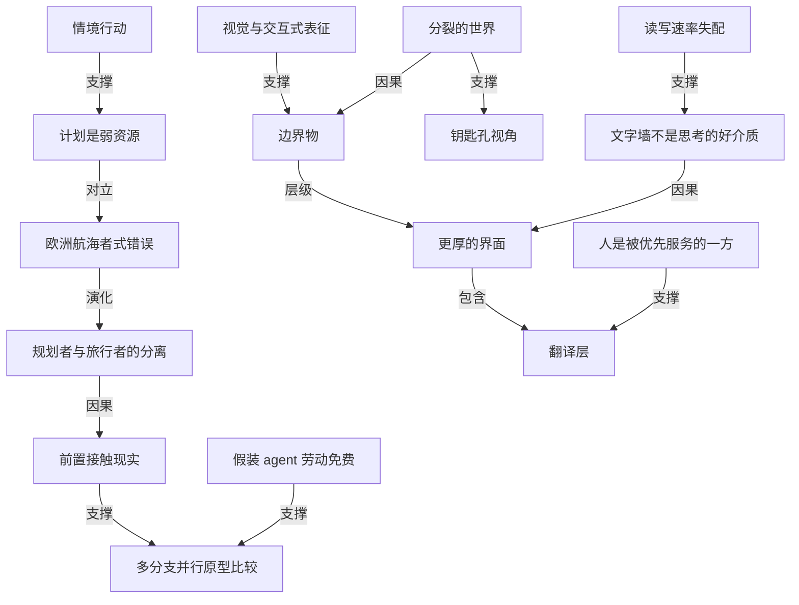

# 和 agent 一起做规划，缺的是更厚的界面和共用的中间物

- 原文标题：Planning with Agents: Divided Worlds, Boundary Objects, and Thicker Interfaces
- 作者：maggieappleton.com
- 内参日期：2026-09-21
- 来源类型：blog
- 原文：https://maggieappleton.com/planning-agents
- 标签：agents, agentic workflow

> Maggie Appleton 的长文。她借用「边界物」这个概念来谈人和 agent 的协作规划：双方各自活在不同的世界模型里，需要一种两边都能读写、都能指着说话的中间产物，而现在的聊天框太薄，承载不了这件事。是今天这批材料里最偏概念框架的一篇。

## 导读

要看原文。网页设计上有特色。

## 核心观点

- 人和 agent 一起做软件规划，今天的做法很糟：人在 CLI 里孤身一人答完几十道选择题，换回一墙 Markdown 和一个「你批准这个计划吗，是或否」。
- 作者 Maggie Appleton 是 GitHub Next（GitHub 的 R&D 实验室）的设计师、工程师与研究员，当前的研究执念就是「协作式规划」——人和 agent 在同一个上下文里实时一起规划。
- 她的诊断有两层：一是我们犯了「欧洲航海者」的错误，把一段自己不会亲自上路的旅程提前规划死；二是文字墙根本不是人类做高质量思考的好介质。
- 她的解法不是让两边互相理解：**人不需要完全进入 agent 的世界，也不需要完全看懂 agent 的世界，只需要有效的「边界物」（boundary objects）和更厚的界面**。
- 最关键的一条价值排序：人是被优先服务的一方，agent 的廉价劳动应该被拿去为人构筑翻译层，而不是反过来让人去适应 agent 最舒服的工作方式。

## 从楚克航海者说起：计划只是弱资源

- 人类学家 Thomas Gladwin 在 1940–1960 年代住在密克罗尼西亚的楚克人（Chuukese）中间，比较他们与欧洲航海者的航海方式。
- 欧洲航海者每次出海先做计划：从地图和抽象的普遍原理推出航线，把思考尽量提前做完；出海后每一步都对照计划、努力「保持在航线上」，一旦有意外就得先改计划。
- 楚克航海者不提前做计划。他们只带一个目标（比如抵达某座岛），没有固定航线就出发，靠读风、浪、洋流、太阳和飞鸟随时调整，持续即兴。
- 这个段子来自 Lucy Suchman 1987 年的《Plans and Situated Actions》。Suchman 是 80–90 年代在施乐帕洛阿尔托研究中心工作的 HCI 研究者与文化人类学家，她整本书讲的就是和机器一起规划、沟通。
- 作者顺带点了一句方法论上的自省：我们总以为技术跑得太快、历史无关紧要，但计算机科学其实经常没学到 80、90 年代的教训。
- 这不是在比较哪种航海更好。要点是：**即便你提前做了计划，一旦进入真实情境中的行动，计划很快就不再切题**——不管有没有计划，所有人都在对环境做临时决策。
- Suchman 的原话是「计划最好被看作临时行动的一种弱资源」，以及「我们都像楚克人那样行动，无论我们中有多少人说着欧洲人的话」。
- 欧洲式的错误在于假定计划做完就只剩执行，假定地图就是疆域、现实会照你的预期展开。用 Mike Tyson 的话说：每个人都有计划，直到脸上挨一拳。在工程里，揍你的通常是复杂度和棘手问题。

## 今天和 agent 一起规划是什么样

- 场景是这样的：你在自己惯用的 CLI 或桌面应用里，一个人，打开某种 plan mode 或挂上 `/grill-me` 这类 skill，然后开始回答 40 道选择题。
- 大约在第八题你就累了，开始一律选 A——那个标着「推荐」的选项。原因可能是你没完全听懂问题，可能是问题复杂到在这个界面里根本无从推理，也可能它压根超出你的知识范围。

- 问完之后，agent 丢给你一大墙 Markdown，然后问：批准这个计划吗，是或否。
- 显而易见的毛病有一串：
- 在 CLI 里你没法直接编辑计划。
  - 计划里几乎总留着开放问题（哪怕刚被「拷问」过一轮），而你没有回答它们的界面。
  - 你不能在某个问题上按下暂停，说「这里要再深挖」「让一个 agent 去研究一下」「帮我做个原型」——整个体验没有节奏感。
  - 你随口定下的任何决定，agent 都当成血写的誓言来执行。
- 还有一层奇怪的私密性：同事和你各自单独做计划，彼此看不见对方的工作，无法互相征求意见，甚至无法评论或争论。
- 作者的判断很直接：这不是一个精巧的流程，这不是一个好的流程。

## 问题一：计划是一段我们自己不会走的旅程

- 我们在为一次「想象中的、穿越代码库与运行时的旅程」写计划，试图在遭遇现实之前就预测出最佳路径。
- 但这里有个别扭的转折：**规划者和旅行者不是同一个存在**。我们被迫把所有重要决策都提前做完，因为上路的只有 agent 自己。
- agent 在路上一定会做临时决策、采取情境行动，却没有人在旁边帮它做判断题。
- 于是结果好不好，取决于人的意图与欲望能否和 agent 的情境行动高度对齐——这很难。

## 问题二：文字墙不是人类思考的好介质

- 现在的规划媒介全是文字墙：我们给 agent 写文字墙，它写文字墙回来。
- 人不是高效的读者。人一分钟大约读 240 词，agent 一分钟能写 4500 词，**快 19 倍**。agent 产出的文本量和人能消化的文本量之间存在巨大错配。
- 于是人会累、会跳读、会漏掉关键细节。作者认为这正是许多人报告「和 agent 一起工作让人精疲力竭」的原因之一：他们整天在密集难用的界面里做艰难抉择。

## 两个互不可读的世界

- 这件事难解，根子在于人和 agent 是非常不同的两种存在，各自有非常不同的世界，而两个世界只是部分地对彼此可读。
- Suchman 做过一个著名研究：录下两位博士研究员使用一台内置「智能专家帮助系统」的施乐复印机（今天看来就是原始的 AI），两人折腾半天也没按说明复印成功。
- 这不是一个界面设计失败的故事，而是一个关于「双方各自掌握什么信息、以及彼此的心智模型」的故事。
- 复印机看不到人类世界里正在发生的绝大部分事情：犹豫、争论、翻看说明、比划手势、把自己的预期说出口。它只能看到按钮被按下、纸盒被打开。
  - 人也只能看到屏幕上打出来的消息，看不到机器的内部状态和程序设计。
- Suchman 的说法是：双方像是**隔着一个钥匙孔在看对方**。作者觉得这和我们今天与 agent 打交道的方式没什么本质区别——界面当然进步了，能往里灌海量自然语言，但仍然像是从一个输入框里往外递小纸条。

- 人住在具身、物理空间、丰富视觉、颜色、手势、情绪、声音、表情、社会与文化的世界里，这些 agent 都很不擅长理解。
- agent 住在向量、权重、奖励、统计概率和梯度下降的世界里。两个世界各自丰富复杂，但都不对另一方完全可读——我们至今看不懂 agentic 系统内部在发生什么，可解释性还没被解决。
- agent 能从我们这里获得的不止文字，它们能理解和生成图像、音频、视频；但 agent 里的「语言模型」部分仍是主导媒介，而语言并不能完整承载人类知识。
- 这也是为什么很多人在教 agent 建立世界模型、理解物理现实。但在那之前，挑战是把人的意图、决策和专业判断传给一个「用非常异质的、以语言为中心的眼睛看世界」的存在。

## 想象理想的规划环境：小梦与大梦

- **小版本的梦**：我和同事在一次通话里和 agent 一起工作；agent 通过摄像头实时看见我们——视线、表情、手势，听见我们对彼此说的话以及语速、停顿和语气里的情绪，也看见我们屏幕上正在点什么、悬停在哪里。它们不用问「我做得怎么样、你喜欢吗」，它们看得见，可以自己暂停、转向或修正。作者认为这离现在不算太远，几年内现实可期。
- **大版本的梦**（不受当前界面约束的真正理想）：在线下，和同事围着一块白板——说话、指点、画图、比划，注意到困惑、兴奋、张力与沉默，用眼神在房间里引导注意力，多台笔记本开着跑原型，把屏幕投到墙上，让计算产出也能随手取用。
- 这大概是人类思考的理想语境，而 agent 几乎理解不了其中的大部分，因为它根本没有对应的输入通道。
- 一种解法是摄像头、传感器、麦克风：让 agent 看见听见我们，盯着手、追踪视线、跟着我们绕白板走。这是很「普适计算」（ubicomp）的梦，而我们没有它自有一堆理由。
- 大梦小梦都充满复杂挑战：要实时处理、存储和理解的数据量是巨大的，不只是物理输入，还有社会语境、角色和背景。作者的判断是：**我们未必真的需要它来达成我们想要的东西**。
- 结论因此翻转：我们不需要把 agent 完整拉进我们的世界，也不需要完整看懂它们的世界，我们只需要在两个世界之间有效协作的方式。

## 边界物：让不同世界的人共用同一个东西

- 边界物理论来自社会学家 Susan Leigh Star 和 James Griesemer 1989 年的论文《Institutional Ecology, "Translations" and Boundary Objects》，讲的是伯克利脊椎动物博物馆的创建。
- 博物馆成功地把文化、信念、训练与优先级都不同的社会群体聚到一起：生物学家、捕猎者、出资人、大学管理者。
- 让他们能有效协作的，是标本、标签、田野笔记、图纸和地图这些边界物。它们在每个社会世界里被略微不同地栖居，对不同的人意味着不同的东西：生物学家和出资人读地图的方式不一样，但他们共享对「加利福尼亚」这个概念的理解。
- **有效边界物要做到的就是这件事**：适配每个群体的在地需求，把对的信息给到对的人，让他们建立起一个共享的现实。
- 我们现在和 agent 之间的边界物是计划、提示词、skill、`AGENT.md` 这类文件。它们还凑合——但它们**主要是按 agent 看世界的方式设计的，优化的是 agent 的表现**。
- 我们把同一份 Markdown 同时端给人和 agent，指望它对双方同样好用。agent 可以愉快地消化文字墙、成堆的工具调用和调试日志；对人来说，读这些又慢又累又贵。
- 换句话说：我们在让人去适应 agent 的理想工作方式，而不是造出对双方都适配的中间物。

## 更厚的界面：把 agent 的廉价劳动用在人身上

- 另一种说法是：人和 agent 之间的界面**太薄了**——人看到的和 agent 看到的之间几乎没有翻译。
- 界面需要变厚：用 agent 相对廉价且近乎无限的劳动，去构筑丰富的翻译层，而这些翻译层要服务得非常好的对象是人。
- 价值排序必须说清楚：**在这场互动里被优先的不是 agent，是我们**。agent 应当为人的利益付出多得多的劳动。

## 更好的边界物之一：为人类的理解而优化

- 第一条路是超越文字，动用视觉、空间、交互和社会性的思考方式。
- 文字当然了不起：精确、可塑、极擅长表达观念。但对软件工程里那些需要被看见和理解的复杂事物来说，它是一条窄通道。
- 一个尺度对比：**书写大约只有 5000 年历史，而我们复杂的视觉系统有超过 5 亿年**。我们天生被设计来穿行物理环境、追踪地平线上的东西、察觉颜色与运动、判断距离、在空间中排布物体、比较形状，而且大多快速自动地发生。
- 这正是视觉表征好用的原因：把复杂数据映射到颜色、形状和空间上，让东西变得可见可触，看见原本看不见的东西——**它把工作从工作记忆搬到了世界里**。
- 我们已有很多视觉语言：图表揭示比较，地图展示空间中的移动，时间线让顺序和重叠可见。每种表征揭示一种不同的结构。软件工程对此有一定传统，比如状态机和架构图。
- 也有人在探索展示 agent 活动的新视觉形式，比如 Mindwalk：追踪一次 agent 运行，展示它在代码库里碰过哪些文件。
- 这个 demo 最好的地方在于它可交互——人靠「做」来思考：指点、比划、挪动东西试试看会发生什么，让来自世界的反馈更新自己的理解。
- 理想状态还应该是多人的：这里面应该挤满同事。我们是社会性动物，和别人一起发展想法、互相质疑、建立共享理解时学得最好。
- 但大多数 agent 界面把这一切压扁成一条独自面对的文字流：文字干了太多活，而我们视觉的、具身的、社会性的能力大多闲置。
- 所以更好的边界物应当：让关系可见、让人能直接操作计划、给大家一个可以共同指着讨论的东西。这是降低与 agent 协作认知负荷的具体路径。

## 更好的边界物之二：让计划提前撞上现实

- 第二条路是解掉「欧洲航海者」问题：**在把计划交出去之前，它就应该已经和现实中重要的部分发生过有意义的接触**。
- 这又不是 19 世纪的帆船远征，我们完全可以提前勘探地形。
- 规划 agent 已经做了一点：搜索代码库、读文件、追踪依赖，得到一个有用的鸟瞰视角，抓住明显的问题。
- 但它们**止步于观察**：预测哪种实现会奏效，却不做原型、不运行、不按结果比较。
- 它们本可以做更多前期腿脚活：把工作拆给多个子 agent，在多个 Git 分支上同时实现多种方案，然后评估结果——这就把现实带进了规划过程，而且是在人还在回路里、还能做知情决策的时候。
- 对「这不会很贵吗」的回应，是 GitHub Next 的一条哲学：**要发明未来，就得活在未来里**。假装 agent 劳动在功能上是免费的——它终将变得廉价而充裕，所以现在就该按那样去探索。

## 三个具体 demo：界面该长什么样

- **阴影（设计系统）**：终端里的规划 agent 给她三个选项——阴影要 crisp、soft 还是 pronounced？在 CLI 里以纯文字呈现这个决策，让人根本无法做出知情判断：她既不知道当前应用里的阴影长什么样，也不知道每个选项会变成什么样。
- 她需要的是另一种界面：接到活的应用上，直接显示系统里当下真实的阴影；可以直接操纵阴影的属性并实时看到结果，改颜色、改强度；满意了就把这个决定存回计划里。
  - 同理，卡片 hover 时的小动画，应该有一个专门的界面来调缓动曲线与速度。注意，这类界面里可选项的数量比「三个」多出指数级。
  - 原则：**界面要扎根在现实（我的代码库）里，并让我能操纵它，从而走到正确的决定上**。
- **状态机（抽象逻辑问题）**：视觉问题天然适合交互式界面，那更抽象的逻辑问题呢？她最近在调一个视频播放器和 reducer 的烂摊子，在 CLI 里回答越来越复杂的问题；其实结论是需要重构架构，而 CLI 不是这个问题该用的界面。
- 状态机能让她看见并探索组件所有可能的状态，看加不同的转移会发生什么，查清缓冲循环到底怎么了。我们已经有状态机这类成熟的编程界面约定，现在可以让 agent 在当下为某个具体问题**临时搭出**这种探索工具。
- **重试逻辑（多分支比较）**：agent 让她在几种具体写法之间选——options 对象、包装函数、还是 client policy。这种事的后果在 CLI 界面里很难推理。
- 于是她让子 agent 分到不同分支上把三种方案都实现出来，评估结果，再做一份交互式报告，说明每种方案在每个调用点会怎样、性能如何。
  - 结论一目了然：**方案 A 覆盖全部 60 个调用点，大多数改动是机械的，但有 8 处需要判断；方案 B 也覆盖 60 个，但其中 16 处会静默改变行为；方案 C 初看诱人，只要改 14 处且全是机械改动，直到你发现另外 46 个调用点根本不被支持**。
  - 报告还给了可测量的指标，比如恢复的 P95 和放大率（amplification），帮助判断——有了这些，方案 A 显然是对的选择。

## 横在中间的障碍与 Chopin 原型

- 两个障碍：
- agent 目前不擅长做视觉解释，至少在没有大量人工牵引的情况下不行——上面这些例子基本是她自己设计出来的。
  - 推理时间需要被策略性地安排：不能让人干等，需要 agent 并行工作、提前跑在五步之前，在人回答其他问题的时候把这些东西做出来。
- 她当前在探索的项目叫 Chopin（GitHub Next 的多人实时规划原型，和同事 Krzysztof 一起做），目前还是很基础的概念验证与探索空间。
- 同事和 agent 在一个不错的 Markdown 编辑器里一起写计划，但这个编辑器里有大量交互式视觉元素，用 MDX 构建。
  - 社会性的那块同样关键：同事能看见这些决策界面、能争论、能集体决定。demo 里可以看到她回答一个决策后，系统记录下「她在某时某刻做了这个决定」。

## 收束：四条结论与两个自问

- 四条结论：
- 计划用来定向行动，它无法预测整段旅程。
  - 人和 agent 不需要共享理解，他们需要好的边界物和厚的界面。
  - 去造视觉的、交互的、社会性的边界物。
  - 改善人用来思考的条件。人是被优先的存在，agent 能够也应该多做 1000 倍的工作来让人更有效。
- 两个可以拿去问自己在做的任何东西的问题：
- 我在哪些地方把人暴露给了 agent 看世界的方式？agent 能构筑什么样的翻译层？
  - 我如何为人的理解与深度思考优化整个环境？

## 概念网络

### 关键概念

#### 情境行动（situated action）

**context**：Suchman《Plans and Situated Actions》的核心概念，通过楚克航海者与欧洲航海者的对比引入。楚克人「不提前做计划」，只带目标出发，靠读风、浪、洋流、太阳与飞鸟持续即兴。文章用它指出：不管有没有计划，所有人在真实语境中都在对环境做临时决策。

**费曼一下**：真正的行动总是发生在「此时此地的具体处境」里，而不是发生在纸面上。你可以事先想好一百件事，但真到了现场，决定你怎么动的是眼前的风浪，不是出门前画的那条线。

#### 计划是弱资源

**context**：Suchman 原话「计划最好被看作临时行动的一种弱资源」，配上「我们都像楚克人那样行动，无论我们中有多少人说着欧洲人的话」。文章据此反对把计划当作可执行脚本的观念，收尾第一条也是「计划用来定向行动，它无法预测整段旅程」。

**费曼一下**：计划不是剧本，是指南针。它能告诉你大致朝哪走、遇事时拿什么做参照，但它没法替你把路走完。把它当剧本，第一次意外就会让你手足无措。

#### 欧洲航海者式错误

**context**：文章反复用的诊断标签。欧洲航海者出海前从地图和抽象原理推出航线，出海后每一步对照计划、力求「保持在航线上」。作者说这种错误在于假定计划做完就只剩执行、假定地图就是疆域；配上 Mike Tyson 的「每个人都有计划，直到脸上挨一拳」，而在工程里揍你的是复杂度和棘手问题。

**费曼一下**：把「我想好了」当成「我搞定了」。你在办公室里画得再细，也不等于现实会配合你；真实世界不看你的图纸。

#### 规划者与旅行者的分离

**context**：文章对「问题一」的独特加码。和人类自己做计划不同，与 agent 规划时「规划者和旅行者不是同一个存在」——人必须把所有重要决策提前做完，因为上路的只有 agent，而它在途中要独自做临时决策和情境行动，身边没有人帮它做判断题。

**费曼一下**：你负责画地图，别人负责走路，而这个人在路上遇到岔口时联系不上你。所以你得提前替他想好所有岔口——可你连那条路长什么样都没见过。

#### 分裂的世界（divided worlds）

**context**：文章副标题的第一个词。人的世界由具身、物理空间、丰富视觉、颜色、手势、情绪、声音、表情、社会与文化构成；agent 的世界由向量、权重、奖励、统计概率和梯度下降构成。两个世界各自丰富，但都不对另一方完全可读——「可解释性还没被解决」。

**费曼一下**：两个都很复杂的世界，隔着一层毛玻璃看彼此。你看不清它脑子里在算什么，它也看不懂你皱眉是什么意思。问题不在于谁更聪明，在于双方掌握的信息根本不是一类东西。

#### 钥匙孔视角

**context**：Suchman 对施乐复印机研究的总结——复印机只能看到按钮被按下、纸盒被打开，看不到人的犹豫、争论、翻说明、手势和说出口的预期；人只能看到屏幕上的消息，看不到机器的内部状态与程序设计。她说双方像是「隔着一个钥匙孔在看对方」。作者认为今天和 agent 的交互本质上仍像「从输入框里往外递小纸条」。

**费曼一下**：不是看不见，是只能看见针尖大的一块。双方都在用这一小块碎片去猜对面整个房间的样子，猜错是必然的。

#### 边界物（boundary object）

**context**：来自 Star 与 Griesemer 1989 年关于伯克利脊椎动物博物馆的论文。标本、标签、田野笔记、图纸和地图让生物学家、捕猎者、出资人与大学管理者能有效协作：同一个物件在每个社会世界里被略微不同地栖居，生物学家与出资人读地图的方式不同，却共享「加利福尼亚」这个概念。有效边界物要「适配每个群体的在地需求、把对的信息给对的人，从而建立共享的现实」。

**费曼一下**：一件大家都能用、但各用各法的共用物。它不要求你们想法一致，只要求你们指着同一个东西说话时，彼此都能拿到自己需要的那部分信息。

#### 薄界面与更厚的界面

**context**：作者对当前人机界面的核心批评与主张。「薄」指人看到的和 agent 看到的之间几乎没有翻译——我们把同一份 Markdown 同时端给双方，指望它对两边同样好用。「厚」指用 agent 相对廉价且近乎无限的劳动，构筑丰富的翻译层。

**费曼一下**：现在的界面像一道直接开在墙上的洞，两边原样对喊。所谓变厚，是在中间加一整层同声传译和布景，把那边的原始输出改造成这边一眼能懂的样子。

#### 翻译层

**context**：更厚的界面的具体内容。作者在收尾的自问里明确提出：「我在哪些地方把人暴露给了 agent 看世界的方式？agent 能构筑什么样的翻译层？」——把工具调用、调试日志、文字墙这些 agent 原生形态，转译成人能快速判断的表征。

**费曼一下**：不是把原始数据丢给你，而是先替你做成一张图、一个可点的模型、一份对比报告。多出来的那道工序，就是翻译层。

#### 人是被优先服务的一方

**context**：文章的价值排序宣言，也是收尾第四条结论：「人是被优先的存在，agent 能够也应该多做 1000 倍的工作来让人更有效。」它直接针对当下「我们在让人去适应 agent 的理想工作方式」的现状。

**费曼一下**：谁该累一点，是个立场问题。作者的立场是：机器该多干一千倍的活，好让人少受一点罪——而不是人硬着头皮去读机器最方便吐出来的东西。

#### 读写速率失配

**context**：支撑「问题二」的硬数字。人一分钟读约 240 词，agent 一分钟写约 4500 词，快 19 倍。这个错配导致人累、跳读、漏掉关键细节，也是许多人报告「和 agent 一起工作让人精疲力竭」的原因之一。

**费曼一下**：一个人说话的速度是另一个人听力的十九倍，这场对话注定听不完。不是你不认真，是通道宽度对不上。

#### 把思考搬出工作记忆

**context**：文章解释视觉表征为何有效时的关键句——把复杂数据映射到颜色、形状和空间上，「把工作从工作记忆搬到了世界里」。支撑它的尺度对比是：书写约 5000 年历史，而人类复杂的视觉系统有超过 5 亿年。

**费曼一下**：脑子里能同时转的东西很少，纸面和屏幕上能摆的东西很多。画出来、摆出来之后，你不用再费力记住它们，只要用眼睛看就行。

#### 前置接触现实

**context**：解「欧洲航海者问题」的方向：「在把计划交出去之前，它就应该已经和现实中重要的部分发生过有意义的接触。」现有规划 agent 只做到搜索代码库、读文件、追踪依赖这类观察，**止步于观察**——预测哪种实现会奏效，却不做原型、不运行、不按结果比较。

**费曼一下**：别光趴在地图上推演，先派人去实地踩两脚。等到人还在场、还能拍板的时候把坑踩出来，比让 agent 独自上路后才撞上要划算得多。

#### 多分支并行原型比较

**context**：前置接触现实的具体做法：把工作拆给多个子 agent，在多个 Git 分支上同时实现多种方案再评估结果。重试逻辑那个 demo 是完整例证——三种方案全部实现后生成交互式报告：A 覆盖全部 60 个调用点、8 处需判断；B 也覆盖 60 个但 16 处静默改变行为；C 只改 14 处且全机械，但另外 46 个调用点根本不被支持；另附恢复 P95 与放大率指标。

**费曼一下**：与其让人在三个名词之间猜哪个好，不如把三个都造出来跑一遍，把「第 16 处会悄悄改变行为」「另外 46 处根本不支持」这种只有做了才知道的事，摆到人面前再让他选。

#### 假装 agent 劳动是免费的

**context**：GitHub Next 应对「这不会很贵吗」的哲学：要发明未来，就得活在未来里。假装 agent 劳动在功能上免费——它终将变得廉价而充裕，所以现在就该按那样去探索。这是支撑「多分支并行原型」与「厚翻译层」在经济上成立的前提假设。

**费曼一下**：研究未来的正确姿势不是算今天的账，而是先按明天的价格生活一遍，看看那时候什么做法才是对的。

### 概念网络

- 这篇演讲的论证是一条从**诊断**到**价值排序**再到**解法**的链条，两个诊断各自长出一条解法。
- 上游的地基是人类学和 HCI 的旧理论。**情境行动**支撑起**计划是弱资源**：因为行动永远发生在具体处境里，纸面计划就只能是一种参照，而非脚本。**欧洲航海者式错误**正是这条判断的反面典型——它假定地图就是疆域。
- 与 agent 协作把这个古老错误推到了极端形态：**规划者与旅行者的分离**。人被迫提前定死所有重要决策，因为真正上路的是 agent，而它在途中无人可问。这是诊断一。
- 诊断二在另一条线上：**读写速率失配**（240 对 4500）支撑起**文字墙不是思考的好介质**，它直接解释了 agentic 工作的疲惫感。
- 这两个诊断之上还有一个更根本的结构性事实：**分裂的世界**。它一方面外化为**钥匙孔视角**（施乐复印机研究里双方各自只能看到针尖大的一块），另一方面导出了整篇文章的枢纽概念——既然互相理解不可得，那就转而求**边界物**。
- 从边界物到**更厚的界面**是层级关系：边界物是「共用什么东西」，厚界面是「这个东西要被加工到什么程度」。而厚界面的实质内容就是**翻译层**。
- 这里有一处关键的张力被明确地解掉了：翻译层要由谁来造、为谁而造？**人是被优先服务的一方**给出了答案——agent 该多做一千倍的工作，翻译层的方向是从 agent 原生形态译向人的理解，而不是反过来让人去学着读日志。当前的计划、提示词、skill 与配置文件之所以「只是凑合」，正因为它们倒着来，优化的是 agent 的表现。
- 解法一由**视觉与交互式表征**支撑边界物：图表、地图、时间线、状态机、架构图各自揭示不同结构，把工作从工作记忆搬到世界里；再加上可交互与多人，补上被文字流压扁的具身与社会维度。
- 解法二直接回应诊断一：**规划者与旅行者的分离**导出**前置接触现实**——既然 agent 要独自上路，就该在人还在回路里的时候让计划撞上真实。它的落地手段是**多分支并行原型比较**（三种重试方案各造一遍再出交互式报告），而这件事在经济上成立的前提，是 GitHub Next 的**假装 agent 劳动免费**：先按未来的价格生活，才看得见未来该有的做法。
- 三个 demo 是整张网络的验证点：阴影与动画调参检验「表征必须扎根现实且可操纵」，状态机检验「抽象逻辑同样可以被临时造出的界面接住」，重试方案对比检验「让现实提前发生比让人盲选更划算」。

## 费曼 x3

先看一个尺度对比：人一分钟读 240 个词，agent 一分钟写 4500 个词。十九倍。你和它之间那条通道，从一开始就不是为你设计的。

这解释了很多人说不清的疲惫。你打开 plan mode，回答四十道选择题，第八题之后就开始一律选 A——不是懒，是那个问题在纯文字的终端里根本无法推理。然后换回一墙 Markdown 和一句「批准吗，是或否」。你改不了它，问不下去，也叫不来同事一起看。你随口定的每件事，它都当成血写的誓言去执行。

更麻烦的是角色错位。人类自己做计划时，画地图的和走路的是同一个人，计划失效不要紧，反正人在现场。而和 agent 规划，画地图的是你，走路的是它，途中遇到岔口它联系不上你。于是你被迫把所有判断题提前做完——为一条你自己从没走过的路。这是现代版的欧洲航海者：以为地图就是疆域，以为想好了就等于搞定了。而楚克人只带一个目标出海，靠风浪飞鸟随时改主意。Suchman 说得很准，计划最好被看作临时行动的一种弱资源，我们都像楚克人那样行动，无论我们中有多少人说着欧洲人的话。

那怎么办？一个诱人的方向是让机器进入我们的世界：摄像头看视线，麦克风听语气，传感器跟着人绕白板转。真正有意思的，是作者把这条路推开了——我们不需要完全走进对方的世界，也不需要完全看懂它。当年 Suchman 录下两位博士折腾施乐复印机，结论不是界面设计失败，而是双方像隔着钥匙孔看彼此：机器只看得见按钮被按下，人只看得见屏幕上的字。互相理解太贵，而且并非必需。

真正需要的是共用的中间物。伯克利的脊椎动物博物馆能把生物学家、捕猎者、出资人和校方拢到一起，靠的是标本、标签、田野笔记和地图——同一张图，不同的人读法不同，却共享对「加利福尼亚」的理解。而我们今天和 agent 共用的那些计划、提示词、配置文件，方向是反的：它们按机器看世界的方式设计，优化的是机器的表现，然后指望同一份文字对人也同样好用。

所以该问的不是「怎么让 agent 更懂我」，而是「我在哪些地方把人暴露给了机器看世界的方式」。书写只有五千年，视觉系统有五亿年。让 agent 去建那层翻译——把方案画成可点的状态机，把三种重试写法分到三个分支上真的实现一遍，再告诉你 A 有八处要人判断、B 有十六处会静默改变行为、C 看着只改十四处却有四十六处根本不支持。这些事只有做过才知道，而现在做它们几乎不要钱。

一句话收束：机器该多干一千倍的活，好让人少受一点罪。反过来的那种安排，我们已经忍了太久。

## 阅读原文

> 🖼️ 此处配图未随存档收录，请见原文。

> 🖼️ 此处配图未随存档收录，请见原文。

This talk is about collaborative planning with agents: divided worlds, boundary objects, and thicker interfaces

But let’s first talk about [Thomas Gladwin](https://archive.org/details/eastisbigbirdnav0000glad) , an anthropologist who spent time between the 1940s and 1960s living among the [Chuukese people](https://maps.app.goo.gl/rZWuj2sJpc3wtfuc7) in Micronesia.

These people live in a very remote set of islands in the middle of the Pacific Ocean. He was studying how they navigate the open seas compared with European navigators.

The European navigator would begin every journey by making a plan. They would plot a course from maps and general, abstract principles, trying to do most of their thinking in advance.

Once at sea, they would compare every move against the plan and work to stay on the course they had set. When something unexpected happened, they would have to revise the plan.

The Chuukese navigators work differently: they do not make plans ahead of time.

They instead begin with an objective, like reaching a certain island, and set off without a firm route.

Instead, they respond to conditions as they arise, reading the wind, waves, currents, sun, and birds and steering accordingly. They’re continuously thinking about how to reach the objective and making ad hoc decisions, constantly improvising based on the context.

I found this anecdote in the opening of [Lucy Suchman](https://en.wikipedia.org/wiki/Lucy/_Suchman) ’s book [Plans and Situated Actions](https://archive.org/details/planssituatedact0000such) , which I’ll reference a few times.

Suchman is a famous HCI researcher and cultural anthropologist who worked at [Xerox PARC](https://en.wikipedia.org/wiki/Xerox/_PARC) in the 80s and 90s. Her book is all about planning and communicating with machines, and despite being written in 1987, it’s still very relevant to solving our current problems with agents.

We always like to think technology moves so fast that history is almost irrelevant to us. But actually I think we in computer science have often failed to learn the lessons of the past and could benefit from revisiting a lot of theory from the 80s and 90s.

Anyway, in the book Suchman points to this anecdote to talk about what plans can and can’t do.

It’s not about whose method of navigation is better. The point is that even when you make a plan up front, it quickly becomes irrelevant once you are taking situated action in a real-world context. Everyone on the journey is reacting to their environment and making ad hoc decisions, whether they had a plan or not.

As Suchman puts it, “Plans are best viewed as a weak resource for ad hoc activity.” She says, “we all act like the Chuukese, however much some of us may talk like Europeans.”

The European mistake is to assume that once you make a plan, you simply execute it. That the map is the territory, and reality will adhere to your expectations.

In other words, as Mike Tyson says, everyone has a plan until they get punched in the mouth.

And in engineering, you usually get punched by complexity and wicked problems.

So this talk is about planning software engineering work with agents. This is my current research obsession.

For context, I am a designer, engineer, and researcher at [GitHub Next](https://githubnext.com/) , which is the R&D lab arm of GitHub. We work on figuring out what GitHub should do next, but focus on things that are riskier and further out than what the usual organisation would think about.

And I’m currently researching how we make better tools for collaborative planning with agents.

And by collaborative, I mean humans and agents in the same context, all planning together in real time.

Right now, it’s really not good.

When you or I start planning with an agent today, we’re in our CLI or desktop app of choice, alone, and we usually begin in some kind of plan mode or with the [/grill-me](https://github.com/mattpocock/skills/blob/main/skills/productivity/grill-me/SKILL.md) skill enabled, and then proceed to answer 40 multiple-choice questions.

We get tired somewhere around question eight and just start picking option A, the recommended option.

Maybe because we don’t fully understand the question, because we’re being asked about something so complex that we have no way to reason about it in this interface, or because it’s outside the scope of our knowledge.

Eventually, the agent stops asking questions and gives me a huge wall of Markdown to read. Then it asks: do you approve this plan, yes or no?

There are some very obvious problems here. Especially in a CLI interface, I can’t edit the plan directly. The plan almost always has open questions in it, despite the grilling process, and I don’t have an interface for answering them.

I can’t pause on any of the questions and say, we need to go deeper on this, or ask an agent to research this, or help me prototype this. There’s no pacing to the experience.

This is not an ideal environment for making thoughtful, informed decisions. And then anything I decide, the agent treats as if it’s as written in blood.

It’s also strangely private. My coworkers and I are all making plans separately, we can’t see each other’s work. We can’t ask for each other’s opinions on these decisions. We can’t even comment on them or debate them.

This is not a sophisticated process This is not a good process

So, aside from my surface-level gripes about CLIs, what’s really wrong with this system?

The first problem is our European navigator approach

We’re writing a plan for an imagined journey through a codebase and runtime. Trying to predict the best approach before encountering reality.

But we have the unhelpful twist that the planner and the traveller are not the same being. We’re in the odd position of needing to make all the important decisions up front because an agent _has to_ go on the journey alone.

And it will need to make ad hoc decisions and take situated actions, but without the human there to help with judgement calls.

Which is hard because for the outcome to be good/useful, the human’s intent and desires need to closely align with the agent’s situated actions.

The second problem is that the current planning medium is a poorly designed environment for humans to do high-quality thinking in.

Planning right now is all walls of text. We write walls of text to the agent; it writes walls of text back.

Humans are not efficient readers. We can read about 240 words a minute, and an agent can write about 4,500, which is 19 times faster than we can read. So there’s a huge mismatch between the amount of text agents produce and the amount we can consume.

We get tired, we skim, and we miss important details. This is one reason why so many people report burnout and exhaustion with agentic work.

They’re trying to make hard choices all day while swamped in dense, hard-to-use interfaces. This is a poor medium for deep work and complex problem-solving.

A lot about why this is a difficult problem to solve boils down to humans and agents being very different kinds of beings, with very different worlds, that are only partially legible to one another.

Let’s go back to Suchman’s research for a second.

She did a [famous study](https://www.youtube.com/watch?v=DUwXN01ARYg) where she videotaped two PhD researchers trying to use a [Xerox PARC copier](https://en.wikipedia.org/wiki/Xerox/_PARC) that had an “intelligent expert help system” built into it. What we would now think of as primitive AI.

And they of course spend forever trying to make copies according to the instructions and fail to do so.

It’s not really a story about failed interface design, though. It’s a story about what information is available to the humans versus the machine, and their mental models of one another.

Suchman pointed out that the copier didn’t have access to most of the information about what was going on in the human world, such as the researchers hesitating, debating, looking at instructions, making gestures, and stating their expectations of what was happening.

It could only see button presses or them opening the paper tray. And in the same way, the humans could only see messages printed on the screen, but not the internal state of the machine or programme design.

She says it’s as if both sides were looking at each other through a keyhole.

This doesn’t feel all that different to me from how we interface with agents.

Of course our interfaces have come a very long way since the days of physical buttons and small screens. I don’t want to downplay the difference between that and being able to dump huge amounts of natural-language transcriptions into an agent.

But it does still feel like posting little text messages through an input box.

Like we’re passing notes between these two very different worlds.

Humans live in this world of embodiment and physical space and rich visuals, colour, gesture, emotion, voices, expressions, society, and cultures. All of which agents are terrible at understanding.

And agents live in a world of vectors and weights and rewards and statistical probability and gradient descent.

And both of these worlds are rich and complex in their own right, but neither of them is fully legible to the other. _We_ struggle to understand what’s happening inside agentic systems. Interpretability is not solved.

Agents _can_ get more than text from us They can understand and create images and audio and video But the _language_ model part of agents is still the dominant medium. And we know language doesn’t fully capture human knowledge.

Which is why plenty of people are currently trying to teach agents to build world models and interpret physical reality. But until we figure that out, the challenge is to get human intent, decision-making, and expertise passed to an agent that sees the world through very alien, language-centric eyes.

I think this is best explained by trying to imagine your ideal way of planning a feature or product, with both people and agents, beyond what our current interfaces are capable of.

A small version of this desire would have me and a coworker on a call, working together with agents.

And the agents can see us using our webcams, in real time.

See our gaze, facial expression, and hand gestures. Hear what my coworker and I are saying to each other, as well as our pacing, pauses, and the emotional tone in our voices. As well as what’s on our screens, where we’re clicking and hovering.

They don’t have to ask us how they’re performing or whether we like the results. They can see it and pause, redirect, or try to fix the problem.

This feels relatively far from what we currently have, but still realistic within a couple of years.

But that dream isn’t even the actual ideal. It’s a constrained one that’s still plausible within our current interfaces.

What’s my true ideal environment for problem solving, without tying myself strictly to current constraints?

For me, it would be in person, around a whiteboard with coworkers. Talking, pointing, drawing, gesturing, noticing confusion, excitement, tension, and silence. Making eye contact to direct attention in the room. Multiple laptops open running prototypes. Projecting screens onto the walls so we can access computational outputs as well.

This is something like the ideal human context for thought. Agents would not understand most of it. It doesn’t have any of the right inputs.

One solution: cameras, sensors, microphones. Make agents able to see and hear us. Watch our hands, track our gaze, and follow us around a whiteboard.

This is a very [ubicomp](https://en.wikipedia.org/wiki/Ubiquitous/_computing) dream and there are plenty of reasons we don’t have it.

Both the small and large versions of the dream I’ve just painted are filled with complex challenges. The amount of data the agents would need to process in real time, to store, and to understand is immense. Not just the physical inputs, but the social context, roles, and backgrounds. It is awash in complex problems. I don’t know that we actually need it to achieve what we want.

We don’t need to fully bring agents into our world…

…or fully understand theirs

We just need effective ways to collaborate between the two worlds.

What we need is effective [boundary objects](https://en.wikipedia.org/wiki/Boundary/_object) .

…or fully understand theirs

We just need effective ways to collaborate between the two worlds.

What we need is effective **boundary objects.**

The theory of boundary objects comes from sociologists Susan Leigh Star and James Griesemer’s 1989 paper, [Institutional Ecology, “Translations” and Boundary Objects](https://doi.org/10.1177/030631289019003001) , about the founding of Berkeley’s [Museum of Vertebrate Zoology](https://en.wikipedia.org/wiki/Museum/_of/_Vertebrate/_Zoology) .

When the museum was being founded, it succeeded in bringing together lots of different social groups with different cultures, beliefs, training, and priorities to create it: biologists, trappers, funders, and university administrators.

All able to effectively collaborate through boundary objects.

Specimens, labels, field notes, drawings, and maps – they inhabited each of these social worlds slightly differently.

They meant different things to different people. The biologists and the funders read the maps differently, but had a shared understanding of the concept of California.

This is what effective boundary objects need to do: adapt to the local needs of each group and provide the right information to the right people, allowing them to create a shared reality.

Our current boundary objects with agents are things like plans, prompts, skills, and [AGENT.md](http://agent.md/) files. And they work okay…

…but they’re mostly designed for the agent’s way of seeing the world; they optimise the agent’s performance.

We currently show humans and agents the exact same Markdown files and expect it to work equally well for both of us. Agents can happily consume walls of text, stacks of tool calls, and debug logs. But for humans, reading all of that is slow, tiring, and expensive.

We are making humans adapt to the agent’s ideal ways of working, rather than making objects that adapt to both sides.

Another way to put this is that our interfaces between humans and agents are very thin.

There’s not a lot of translation between what humans see and what agents see.

I think they need to get thicker in the sense that we need to use the relatively cheap and infinite labour of agents to construct rich layers of translation that serve humans really well.

The agent is not the prioritised party in this interaction. We are.

The agent should be doing far more labour for human benefit.

So, what would thicker interfaces and better boundary objects look like?

First, they need to be optimised for human understanding and legibility. That means moving beyond text and making use of visual, spatial, interactive, and social ways of thinking.

Text is obviously brilliant. It’s precise, adaptable, and very good at expressing ideas. But it’s also a narrow channel for all the complex things we need to see and understand in software engineering.

Writing is only about 5,000 years old. But our complex visual systems go back more than 500 million years.

We’re evolutionarily designed to move through physical environments, track things on the horizon, notice colour and movement, judge distance, arrange objects in space, and compare shapes. Most of this happens quickly and automatically.

This is why visual representations work so well. We can map complex data to colours, shapes, and space to make things visible and tangible, showing us things we couldn’t see before.

It moves the work out of working memory and into the world.

And we have lots of visual languages for doing this.

Charts reveal comparisons. Maps show movement through space. Timelines make sequence and overlap visible.

Each representation reveals a different kind of structure. And software engineering has a moderate history of taking advantage of this.

For example, state machines

And architecture diagrams

And I’m seeing people explore novel, visual ways of showing agent activity, like [Mindwalk](https://github.com/cosmtrek/mindwalk) , which traces an agent run, showing what files it touched in a codebase.

The best thing about this demo is it’s interactive. You can click around. Humans, of course, think best by doing. Point and gesture; we move things around to test what happens. We let feedback from the world update our understanding.

Ideally it would also be multiplayer! This should have lots of coworkers in here with us. We’re social animals and learn best when we’re developing ideas with other people, questioning each other, and building up shared understanding.

But most agent interfaces flatten all of this into a solo stream of text. So text is doing too much work while our visual, embodied, and social abilities sit mostly idle.

So better boundary objects should make relationships visible, let us manipulate the plan directly, and give people a shared thing to point at and discuss. That’s a concrete way to reduce the cognitive load of working with agents.

The second way to improve these objects is to solve our European navigator problem.

By the time we hand the plan over, it should already have made meaningful contact with the important parts of reality.

Luckily, this is not a nineteenth-century sailing expedition and we can explore the terrain ahead of time.

Planning agents already do this a bit: they search the codebase, read files, and trace dependencies. It gives them a useful aerial view and catches obvious issues.

But they currently stop at observation. They predict which implementation will work without making prototypes, running them, or comparing them based on outcomes.

They could instead do more upfront legwork by splitting the work among subagents on multiple Git branches, implementing many approaches at once, and then evaluating the results.

This brings reality into the planning process, while the human is in the loop and can help make informed decisions.

I’m sure you’re thinking “well, that’s going to get expensive.” Within [Next](https://githubnext.com/) , we have the philosophy that in order to invent the future you have to live in it. Pretend that agent labour is functionally free; eventually it’s going to become cheap and plentiful, so we should explore as if it is.

So what does this look like in practice? Here is a planning agent in a terminal, helping me develop a set of consistent shadows for my design system.

It’s offering me three options: do you want the shadows to be crisp, soft, or pronounced?

The way this decision is presented to me, in text in a CLI, makes it impossible to make an informed decision. I don’t know what the current shadows in my app look like, and I don’t know what each of these options it’s offering me is going to look like.

Obviously, for the shape of this problem, I need an interface more like this.

First, this is connected to my live app so it’s showing me the actual shadows currently in the system.

Then I can directly manipulate the qualities of these shadows and see the results live. Maybe I want to change the colour or intensity of the shadows. When I’m happy with them, I can save that decision back to the plan.

Similarly, let’s say I have these cards with a little animation when I hover over them. I should have a bespoke interface that helps me adjust the easing and speed of it.

Note that the number of options available to me in this interface is exponentially more than three.

These are the kinds of interfaces that meaningfully enable human decision-making. The interface should be grounded in reality (my codebase) and let me manipulate it to come to the right decision.

Of course, visual problems naturally lend themselves to interactive interfaces, so what about more abstract logic problems?

I was recently debugging some mess with a video player and a reducer and answering increasingly complex questions in the CLI. We clearly needed to rearchitect it. Again, this was not the right interface for the problem.

But a state machine would let me see and explore all the possible states of the component, see what happens when I add different transitions, and find out what’s happening with the buffering loop.

We already have good conventions for programming interfaces like state machines. We can now get agents to build this kind of exploration on the fly to help us solve a particular problem in the moment.

This brings the important parts of reality forward into the planning process, rather than letting the agent encounter them later, while it’s on the journey alone.

Last demo:

I was working on some retry logic, and the agent asked me to choose between specific syntax like an options object, a wrapper function, or a client policy.

This is exactly the kind of thing that it’s hard to reason about the repercussions of from this interface.

This is a good example of when we can just have subagents split up onto separate branches and build all three options, evaluate the results, and report back to us.

So I had the agent try all three and then make an interactive report on how each would work at every call site and perform.

Option A covers all 60. Most changes are mechanical, but eight need a judgement call. Option B also covers all 60, but 16 silently change their behaviour. Option C initially seems promising because it’s only 14 changes and they’re all mechanical, but that’s only when you realise the other 46 call sites are unsupported.

It’s also given us some measurable metrics like the recovery P95 and the amplification that can help inform this decision. These will help us see that Option A is clearly the right choice.

The challenge between us and this more beautiful world of working in these rich interfaces is that agents aren’t good at making visual explanations right now. Certainly not without a lot of hand-holding from me and essentially designing all of these examples myself.

And secondly, we’d need to be strategic about inference time here so I’m not waiting ages for these explorations; we’d need to have agents work in parallel, five steps ahead, and make this while I’m answering other questions.

These kinds of rich, interactive plans are what I’m currently exploring in a project called [Chopin](https://githubnext.com/projects/chopin) . This is a multiplayer, real-time planning prototype that my coworker Krzysztof and I are making.

It’s currently a very basic proof of concept and exploration space.

You have your coworkers and agents writing plans together in a nice Markdown editor. But one that includes lots of interactive visuals. It’s built with MDX.

I didn’t touch on the social piece much in the demos, but a key part of having better decision-making interfaces is that your coworkers can see them too, debate them, and decide collectively.

You can see here I’m answering a decision, and then it records that I made this decision at this time and date.

If you want to read more about Chopin, we’ve published [a writeup](https://githubnext.com/projects/chopin) with our initial research and more demos on the GitHub Next site.

So let’s wrap up and review what we learnt:

- Plans orient action. They cannot predict the whole journey.
- Humans and agents do not need shared understanding. They need good boundary objects and thick interfaces.
- Make visual, interactive, and social boundary objects.
- Improve the conditions for humans to think within. The human is the preferential being. The agent can and should do 1000x more work to make the human more effective.
Things to ask yourself in whatever you’re building:

Where am I exposing a human to an agent’s way of seeing? What translation layers could the agent build?

How can I optimise the environment for human understanding and deep thinking?

Thank you

Look up [GitHub Next](https://githubnext.com/) for more of our [research.My](http://research.my/) personal site is [maggieappleton.com](https://maggieappleton.com/) , where I’ll put these slides up.And read our piece on [GitHub Chopin](https://githubnext.com/projects/chopin) to learn more about that project.
