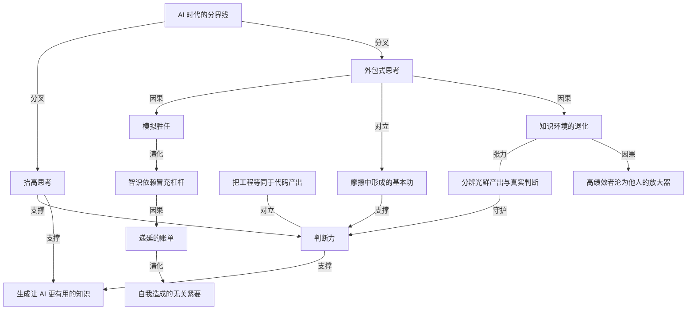

# AI 应该抬高你的思考，而不是取代它

- 原文标题：A.I. Should Elevate Your Thinking, Not Replace It
- 作者：Koshy John
- 内参日期：2026-09-21
- 来源类型：blog
- 原文：https://www.koshyjohn.com/blog/ai-should-elevate-your-thinking-not-replace-it/
- 标签：认知科学, 个人成长

> 和今天「别让 AI 替你写」是同一个论题的另一种说法，但落点更狠：把生成的答案当成自己的理解复述出来，是在用长期能力换短期的胜任表象。

## 导读

旧文重读。AI 如何提升/增强你的思考？

## 核心观点

- 作者与多家科技重量级公司的工程管理者交流后发现，软件工程正在把人分成两个模糊但真实的群体，这条分界线被他称为「自我造成的无关紧要与真实工程杠杆之间的隐秘分野」（the hidden divide between self-inflicted irrelevance and real engineering leverage）。
- 第一群人用 AI 去掉苦活（remove drudgery）、跑得更快，把省下的时间花在真正要紧的部分：界定问题、做权衡、发现风险、制造清晰、产出原创洞见。
- 第二群人用 AI **回避思考**：把 prompt 粘进框里，收走打磨精致的输出，然后把它当成自己的推理端出来。这在一段时间里看起来像生产力，甚至像才华，但它是一条死路（a dead end）。
- 未来最有价值的工程师不是什么都自己干的人，而是「拒绝把时间花在 AI 能替他做的工作上，同时仍然理解替他做完的每一件事」的人。他们用省下的时间在更高的层级上运作——通过严谨（rigor）**抬高**自己的思考过程，而不是把它外包出去。
- 全文的最终判据只有一条：AI 是在帮你更快理解、想得更深、在更高层级运作，还是在帮你回避理解、回避挣扎、回避对推理的所有权。前者复利，后者把人掏空。

## 新的失败模式：外包式思考

- AI 已经能在几秒钟内生成代码、总结会议、解释概念、产出设计草案、写状态更新。这既有用，也危险。
- 危险不在于 AI 会让人在某种含糊的道德意义上变懒，而在于它让「模拟胜任」变得容易，却不用真的建立胜任（it makes it easy to simulate competence without building competence）。
- 现在存在一种非常真实的诱惑：把问题丢给模型，收到一个听起来合理的答案，然后复述这个答案，仿佛它代表你自己的理解。
- 作者把这件事定性得比抄袭更重：学生抄同学的答案，背后至少还有一个真实的人类来源；而这里，人们可以端出**自己并不理解、无法辩护、也无法独立复现**的机器推理。
- 这就是「智识依赖被贴上了杠杆的标签」（intellectual dependency being labeled as leverage）。
- 这种依赖是有代价的：每一次你用生成的输出替代自己的理解，你就跳过了那些锻造判断力的练习与组数（the exercises / reps that build judgment）——用长期能力换短期的体面。

## 最好的工程师会怎么做

- 他们会**更多**地使用 AI，而不是更少，但姿态完全不同。
- 他们乐于把机械部分卸给 AI：起草样板代码、总结文档、生成测试脚手架、提出重构方案、暴露可能的失效模式、加速调查、压缩例行工作。
- 与此同时，他们会做四件 AI 不能替他们做的事：
- 问更锋利的问题。
  - 定义**真正的**问题，而不是仅仅回应那个看得见的问题。
  - 优化清晰与简洁，而不是堆砌大量打磨过却言之无物的漂亮语言。
  - 生成新的、高价值的知识，而不是把系统里已有的知识重新炒一遍、混一遍（rehashing / remixing）。
- 然后，他们把夺回来的时间投到最要紧的地方。
- 多年来人们把软件工程混同为代码产出（code production），这个混淆现在正被暴露出来。如果这份工作主要就是产出语法正确的代码，AI 当然会走在替代这个职业大部分内容的直路上。
- 但作者的判断是：**那从来就不是这份工作里价值最高的部分，价值一直在判断力上**（The value was always in judgment）。
- 有价值的工程师，是在隐藏约束造成线上事故之前就看见它的人；是注意到团队正在解决错误问题的人；是把一场含糊争论收敛成清爽权衡的人；是识别出缺失抽象的人；是能调试**现实**而不只是读代码的人；是在别人只看见噪音的地方创造清晰的人。
- AI 可以**支持**这类工作，但它不能**拥有**这类工作（A.I. can support that work. It cannot own it.）。
- 更进一步：未来产出最多价值的工程师，往往正是**生成那些让 AI 一开始就更有用的知识的人**——他们创造设计原则、领域理解、模式、上下文与决策框架，用更好的问题、更好的约束、更好的纠正来喂养系统。
- 在那样的世界里，工程师不是被 AI 取代，而是因为在原始产出之上的层级运作而获得更大的杠杆。

## 职业早期工程师面临的风险

- 这个议题对职业早期的人尤其重要，因为**基本功正是在早年形成的**：调试直觉、系统直觉、精确、品味、怀疑精神、拆解问题的能力，以及解释「为什么它能工作」而不只是「它看起来能工作」的能力。
- 这些技能是通过摩擦建立的：通过挣扎，通过把事情做错再修好，通过把故障追溯到根因，通过写出某个东西然后发现它经不起与现实的接触（does not survive contact with reality）。
- 这个过程不是可选项，它就是工程师获得并抬高胜任力的方式。早期工程师若用 AI 把学习回路里的所有挣扎都移除，就是在伤害自己的成长。
- 用 AI 回答每一个难题的人，可能在一两个季度里显得高效，但也可能正在悄悄地没能建立起自己未来所依赖的那些能力——他们跳过了理解被锻造的那个阶段。
- 作者用三个类比把这件事落地：在大学里一路抄答案，然后走进一份要求独立思考的工作；每一次算术都用计算器，从而始终没有养成数感；在学会真正开车之前就依赖自动驾驶功能。
- 这些支撑系统可能让你看起来是能用的，但它并不让你**有能力**（may make you look functional, but it does not make you capable）。最终，原始能力才是最要紧的那件事，而它没有替代品。

### 判断力没有捷径

- 有两条话是某些人不愿意听的：
- 没有哪一段生成的解释能在你不做功的前提下把精通转移进你的大脑。
  - 没有哪种方式能让你把推理外包足够久，最后还能在推理上很强。
- 可以外包的是机械劳动、可以加速的是调研、可以压缩的是例行任务——移除大量低价值劳动是好事，也应该发生。
- 但你无法跳过技能的**形成**，却指望自己仍然拥有它。
- 这正是对 AI 最天真用法背后的核心错误：人们以为自己在省时间，实际上常常是在**递延一张账单**，这张账单日后会以薄弱的判断、浅层的理解和有限的适应力的形式到期。

## 分界线与组织层面的含义

- 分界线本身很简单：
- 如果 AI 在帮你更快理解、想得更深、在更高层级运作，它在让你更有价值。
  - 如果 AI 在帮你回避理解、回避挣扎、回避对推理的所有权，它在让你更没有价值。
- 一条路径产生复利，另一条把你掏空，让你成为无关紧要的合适人选（sets you up ripe for irrelevance）。
- 所以未来不属于那些「仅仅在用 AI」的工程师，而属于那些**确切知道该委托什么、确切知道该自己拥有什么、以及确切知道如何把省下的时间转化成更好的思考**的工程师。

### 为什么这对组织健康更重要

- 工程管理者会面对同一条分界线：有些领导者能分辨「用 AI 加速理解」与「用 AI 模拟理解」的差别，有些不能，而这个差距的影响比很多组织意识到的更大。
- AI 时代强工程领导力的定义性特质之一，就是**把光鲜的产出与真实的判断区分开来的能力**。分不清的领导者可能会奖励速度、流利与呈现，却错过技术深度的更深层信号：原创性、严谨、扎实的权衡分析，以及对陌生问题清晰推理的能力。
- 这会制造组织风险。最有能力的工程师往往正是那些产出洞见、上下文、设计判断与纠正性反馈的人——这些东西同时让团队和 AI 系统更有效。
- 如果组织放任「低理解、高流利」的工作不受约束地蔓延，损害的不只是个体产出质量，而是**知识环境本身开始退化**：评审变弱，设计讨论变浅，文档变得更精致也更没用；久而久之，组织在生成它所依赖的那种清晰与技术判断上变得更差。
- 因此挑战不只是采纳 AI 工具，而是「**保护住真实思考、学习与匠艺得以继续繁荣的条件**」。
- 落到具体做法上，作者点了三处：
- **招聘**：组织需要更好的方法去侦测真实理解而不是表层流利，需要测试推理而非只看打磨过答案的面试流程，需要奖励清晰、深度、扎实判断与持久技术贡献而非纯产出量的评估体系。
  - **团队设计与文化**：不该让强工程师把过多时间花在清理「看似合理但很浅」的工作上——那些工作来自已经把思考外包出去的人。
  - **对高绩效者的保护**：若领导层不主动防范，高绩效者就会变成除自己之外所有人的放大器（force multipliers for everyone except themselves），这是一条通往挫败、标准下降与最终流失的快路。
- 处理得好的组织，不会是推 AI 采纳最猛的那些，而是学会把**杠杆与依赖、加速与模仿、真实能力与令人信服的产出**区分开来的那些。
- 在 AI 时代，组织质量将越来越取决于领导层是否还认得出这个差别。

## 概念网络

### 关键概念

#### 自我造成的无关紧要

**context**：原文副标题把全文张力压缩成一句「self-inflicted irrelevance 与 real engineering leverage 之间的隐秘分野」。它不是被 AI 裁掉的被动命运，而是个人选择的累积结果——用 AI 回避思考的人「把自己摆成了无关紧要的合适人选」。

**费曼一下**：不是机器把你挤出局，是你自己一次次选择不动脑，最后把自己变成了可有可无的人。淘汰是自己签的字。

#### 外包式思考

**context**：原文用它命名「新的失败模式」：把问题丢给模型，拿回一个听起来合理的答案，然后复述成自己的理解。作者判定这比抄袭更糟，因为连一个真实的人类来源都没有。

**费曼一下**：不是让机器帮你干活，而是让机器代替你想。活交出去了，脑子也一起交出去了。

#### 模拟胜任

**context**：作者明确说危险不在于「AI 让人变懒」这种含糊的道德指控，而在于它让人「simulate competence without building competence」——能演出胜任的样子，却没建立胜任的实体。

**费曼一下**：像一个背下了全部答案却没学过解法的学生。考卷上看不出差别，换一道新题就原形毕露。

#### 智识依赖冒充杠杆

**context**：当一个人端出自己不理解、无法辩护、也无法独立复现的机器推理时，他往往把这件事叫作「效率」或「杠杆」。原文把它精准改名为「intellectual dependency being labeled as leverage」。

**费曼一下**：杠杆是你用小力撬动大物，前提是你握着杠杆；依赖是别人替你撬，你只负责站在旁边说「我撬的」。名字一样，处境完全不同。

#### 判断力

**context**：全文的价值锚点。作者说多年来人们把软件工程混同为代码产出，而「价值一直在判断力上」——看见隐藏约束、发现团队在解决错的问题、把含糊争论收敛成清爽权衡、识别缺失的抽象、调试现实。

**费曼一下**：代码是能不能写出来，判断力是该不该写、该写哪个、写错了会怎样。前者可以外包，后者外包了就等于把自己外包了。

#### 把工程等同于代码产出的混淆

**context**：作者指出如果这份工作主要就是产出语法正确的代码，AI 确实走在替代这个职业大部分内容的直路上——但「那从来就不是这份工作里价值最高的部分」。AI 的到来不是制造了这个问题，而是暴露了它。

**费曼一下**：大家一直以为程序员是在敲代码，就像以为医生是在开处方。机器一来才发现，真正难的那部分从来不在动作上，在决定上。

#### 锻造判断力的练习与组数

**context**：原文用健身式的比喻说明代价——每一次用生成的输出替代自己的理解，你就跳过了那些建立判断力的 exercises / reps，是在用长期能力换短期的体面。

**费曼一下**：请人替你去健身房举铁，举重记录是漂亮了，肌肉长在别人身上。

#### 摩擦中形成的基本功

**context**：原文列出早期形成的能力清单——调试直觉、系统直觉、精确、品味、怀疑精神、拆解问题的能力、解释「为什么能工作」的能力——并指出它们只能通过摩擦、挣扎、犯错再修好、追溯根因、以及写出经不起与现实接触的东西而建立。

**费曼一下**：这些本事不是学来的，是被磨出来的。谁把磨的过程省掉，谁就把本事一起省掉了。

#### 递延的账单

**context**：作者对「用 AI 省时间」这一自我叙事的反驳：人们以为自己在省时间，实际上常常是在 deferring a bill，日后以薄弱判断、浅层理解和有限适应力的形式到期。

**费曼一下**：不是省下了钱，是刷了卡。当下账面很好看，还款日在几年以后，利息是你的能力。

#### 生成让 AI 更有用的知识

**context**：原文对「工程师的未来位置」给出的正面答案——最有价值的人往往是创造设计原则、领域理解、模式、上下文与决策框架的人，他们用更好的问题、更好的约束、更好的纠正来喂养系统。

**费曼一下**：与其比谁用模型用得更熟，不如做那个让模型变聪明的人。前者随时可被替换，后者是源头。

#### 复利与掏空的分界线

**context**：全文结论的判据式表达：AI 若在帮你更快理解、想得更深、更高层级运作，它让你更有价值；若在帮你回避理解、回避挣扎、回避对推理的所有权，它让你更没价值。一条路径复利，另一条把人掏空。

**费曼一下**：同一个工具，判断标准只有一个——用完之后，你比昨天更懂了，还是更不懂了。

#### 分辨光鲜产出与真实判断

**context**：作者认为这是 AI 时代强工程领导力的定义性特质。分不清的领导者会奖励速度、流利与呈现，错过原创性、严谨、扎实权衡分析与对陌生问题清晰推理这些深层信号。

**费曼一下**：当所有人的交付物都变得漂亮，会看漂亮的人就没用了，得会看漂亮底下有没有东西。

#### 知识环境的退化

**context**：原文对组织风险的描述超出了个体产出质量——若放任「低理解、高流利」的工作蔓延，评审变弱、设计讨论变浅、文档更精致也更没用，组织在生成它所依赖的清晰与技术判断上越来越差。

**费曼一下**：坏钱驱逐好钱的知识版本。当没营养但好看的东西占满了信息渠道，整个组织会慢慢忘掉什么叫有营养。

#### 高绩效者沦为他人的放大器

**context**：原文的团队设计警告——强工程师不该把过多时间花在清理那些「看似合理但很浅」的产出上；若领导层不主动防范，高绩效者就成了「除自己之外所有人的放大器」，通往挫败、标准下降与流失。

**费曼一下**：最能干的人全部时间都在给别人擦屁股，他自己的产出等于零，然后他会走。

### 概念网络

全文的思想网络从一个分岔口长出来。「AI 时代的分界线」是唯一的结构枢纽：同一件工具、同一批人，在这里分成两条不可互换的路径——**抬高思考**与**外包式思考**。作者反复强调这不是两种程度，而是两种方向，所以网络的整体形状不是一条从坏到好的光谱，而是一棵从同一根部裂开的双叉树。

向下的那一叉是一条因果链，且每一环都比上一环更隐蔽。**外包式思考**先产出**模拟胜任**——能演出理解的样子而没有理解的实体；模拟胜任被主体自己重新命名，就成了**智识依赖冒充杠杆**，这是链条里唯一一次语言层面的偷换，也是它能长期存活的原因；被误命名的依赖持续积累，变成**递延的账单**，最终以薄弱判断、浅层理解与有限适应力的形式到期；账单到期的终局就是**自我造成的无关紧要**。这条链的关键性质是**时间错位**：收益在当下（看起来高效、看起来有才华），代价在远处，所以身处其中的人几乎不可能靠自我感觉发现问题。

向上的那一叉汇聚到**判断力**这个价值锚点。抬高思考通向判断力，**摩擦中形成的基本功**也通向判断力——前者是使用姿态，后者是获得途径，二者缺一不可。**把工程等同于代码产出**与判断力构成全文最重要的一组对立：正因为长期误把代码产出当成这份工作的本体，AI 的到来才显得像职业替代，而作者的反驳是它只是把一个早就存在的误解暴露了出来。外包式思考与摩擦中形成的基本功之间也是对立关系——前者精确地移除了后者赖以存在的那个东西（挣扎），所以对职业早期的人伤害最深。

判断力并不是这条向上路径的终点，它继续通向**生成让 AI 更有用的知识**。这是网络里最反直觉的一条边：抬高思考的回报不止是「不被替代」，而是从模型的使用者转位成模型效能的来源——设计原则、领域理解、模式、上下文、决策框架都从判断力中来。抬高思考也直接支撑这一节点，因为省下的时间必须被重新投出去才算完成闭环。

最后一组关系把个体层面整体抬到组织层面。**分辨光鲜产出与真实判断**守护着判断力——它是组织侧对判断力的识别与奖励机制，没有它，判断力在评估体系里就不可见。而**知识环境的退化**与这一能力构成持续张力：外包式思考在组织内蔓延会直接导致知识环境退化（评审变弱、讨论变浅、文档更精致也更没用），退化又反过来削弱组织分辨真伪的能力，形成自我加速的下滑；退化的另一个直接后果是**高绩效者沦为他人的放大器**，最能干的人被消耗在清理浅层产出上，最终流失。这构成了全文在组织层面的完整因果闭环：个体的外包选择 → 知识环境退化 → 分辨能力下降与高绩效者流失 → 组织更难生成它所依赖的清晰与判断。

## 费曼 x3

有一件事正在很多团队里同时发生，却几乎没人当场说破：越来越多的交付物变得非常漂亮，而它们背后的理解越来越薄。文档更精致了，方案更完整了，措辞更专业了，可你一追问「为什么选这个而不是那个」，对面就空了。这不是能力退化的表现，这是能力**从未被建立**的表现——两者在结果上极难分辨，在时间上却天差地别。

真正的分岔口不在于你用不用 AI，而在于你用它干什么。把苦活、样板、总结、脚手架卸给机器，然后拿回来的时间去问更锋利的问题、去定义真正的问题而不只是回应那个看得见的问题，这是一条路。把问题丢进框里、收走打磨好的输出、当成自己的推理端出去，这是另一条路。第一条路让人更有杠杆，第二条路让人在一两个季度里显得高效，然后把人掏空。

最要命的地方在于第二条路有一个极具欺骗性的名字。人们管它叫效率，叫杠杆，叫善用工具。但端出自己并不理解、无法辩护、也无法独立复现的推理，这件事的真名是**智识依赖被贴上了杠杆的标签**。它甚至比抄袭更难处理——学生抄同学的答案，背后至少还有一个真实的人类在思考；这里，链条的另一端是空的。

代价不会立刻出现，这正是它危险的原因。每一次用生成的输出替代自己的理解，跳过的都是那些锻造判断力的组数。调试直觉、系统直觉、精确、品味、怀疑精神，这些东西不是学来的，是在摩擦里磨出来的——通过把事情做错再修好，通过追溯根因，通过写出某个东西然后发现它经不起与现实的接触。省掉摩擦，就等于省掉本事。所以「我省下了时间」这句话往往说反了：那不是省钱，那是刷卡，还款日在几年之后，利息是你自己的能力。

而这件事最容易被误读成一篇劝人少用 AI 的文章，恰恰相反。最好的工程师会用得更多，只是姿态完全不同：他们乐于把机械部分全部交出去，同时坚持理解替自己做完的每一件事。更进一步，他们往往是那些**生成让 AI 一开始就更有用的知识的人**——设计原则、领域理解、模式、上下文、决策框架，都从人这一侧来。在那样的位置上，人不是被替代，而是成了源头。

所以判据其实只有一句话，而且它对个人和组织同样适用：用完之后，你比昨天更懂了，还是更不懂了？前者复利，后者把你掏空。多年来人们把软件工程混同为代码产出，AI 没有制造这个误解，它只是终于把它暴露了出来——价值从来就在判断上。

## 阅读原文

The hidden divide between self-inflicted irrelevance and real engineering leverage

In talking to engineering management across tech industry heavy-weights, it's apparent that software engineering is starting to split people into two nebulous groups:

- The first group will use A.I. to remove drudgery, move faster, and spend more time on the parts of the job that actually matter i.e. framing problems, making tradeoffs, spotting risks, creating clarity, and producing original insight.
- The second group will use A.I. to avoid thinking. They will paste prompts into a box, collect polished output, and present it as though it reflects their own reasoning. For a while, that can look like productivity. It can even look like talent. But it is a dead end.
The software engineers who will be most valuable in the future are not the ones who do everything themselves. They are the ones who refuse to spend time on work that A.I. can do for them, while still understanding everything that is done on their behalf. They use the time savings to operate at a higher level. They **elevate** their thought process through rigor rather than outsourcing it.

That distinction matters more than people think.

_In this post:_

A.I. can already generate code, summarize meetings, explain concepts, produce design drafts, and write status updates in seconds. That is useful but also dangerous.

The danger is not that A.I. will make people lazy in some vague moral sense. It is that it makes it easy to simulate competence without building competence.

There is now a very real temptation to hand a model a problem, receive a plausible answer, and then repeat that answer as if it reflects your own understanding. That is close to plagiarism, but in some ways worse. At least when a student copies from another person, there is still a real human source behind the answer. Here, people can present machine-produced reasoning they do not understand, cannot defend, and could not reproduce on their own.

That is intellectual dependency being labeled as leverage.

And that dependency has a cost. Every time you substitute generated output for your own comprehension, you are skipping the exercises / reps that build judgment. You are trading long-term capability for short-term appearance.

I'm going to share some analogies to make this line of thought more concrete and approachable.

[CLICK HERE TO SHOW ANALOGIES]

The best engineers will absolutely use A.I. more, not less. But they will use it with a very different posture.

They will let A.I. draft boilerplate, summarize docs, generate test scaffolding, propose refactorings, surface possible failure modes, accelerate investigation, and compress routine work. They will happily offload the mechanical parts of the job. But they will also:

- ask sharper questions.
- define the real problem instead of merely responding to the visible one.
- optimize for clarity and brevity (as before), instead of a lot of polished language that says little of substance.
- generate new, high-value knowledge - instead of simply rehashing / remixing existing knowledge in the system.
Then they will take the reclaimed time and invest it where it matters most.

For years, people have confused software engineering with code production. That confusion is now getting exposed.

If the job were mainly about producing syntactically valid code, then of course A.I. would be on a direct path to replacing large parts of the profession. **But that was never the highest-value part of the work. The value was always in judgment.**

The valuable engineer is the one who sees the hidden constraint before it causes an outage. The one who notices that the team is solving the wrong problem. The one who reduces a vague debate into crisp tradeoffs. The one who identifies the missing abstraction. The one who can debug reality, not just read code. The one who can create clarity where everyone else sees noise.

A.I. can _support_ that work. It cannot own it.

In fact, the engineers who produce the most value in the future will often be **the ones generating the knowledge that makes A.I. more useful in the first place**. They will create the design principles, domain understanding, patterns, context, and decision frameworks that improve the machine’s effectiveness. They will feed the system with better questions, better constraints, and better corrections.

In that world, the engineer is not replaced by A.I. The engineer becomes more leveraged because they are operating above the level of raw output.

This issue is especially important for people early in their careers.

Early years matter because that is when foundational skills are formed. Debugging instinct. System intuition. Precision. Taste. Skepticism. The ability to decompose a problem. The ability to explain why something works, not just that it appears to work.

Those skills are built through friction. Through struggle. Through getting things wrong and fixing them. Through tracing failures back to root cause. Through writing something and realizing it does not survive contact with reality.

That process is not optional. It is how engineers acquire and elevate their competency. If early-career engineers use A.I. to remove all struggle from the learning loop, they are hurting their development.

Someone who uses A.I. to answer every hard question may look efficient for a quarter or two. But they may also be quietly failing to build the very capabilities their future depends on. They are skipping the stage where understanding is forged.

Going back to the analogies: This is like copying answers through university and then showing up to a job that requires independent thought. It is like using a calculator for every arithmetic task and never developing number sense. It is like relying on self-driving features before learning how to actually drive. The support system may make you look functional, but it does not make you capable.

And eventually raw capability is the main thing that matters. There is no substitute.

### There is No Shortcut to Judgment

This is the part that some people may not want to hear --

- There is no generated explanation that transfers mastery into your brain without you doing the work.
- There is no way to outsource reasoning for long enough that you still end up strong at reasoning.
You can outsource mechanics, accelerate research and compress routine tasks. You can remove enormous amounts of low-value labor. All of that is good and should happen.

But you cannot skip the formation of skill and expect to possess it anyway.

That is the central mistake behind the most naive uses of A.I. People think they are saving time, when in reality they are often deferring a bill that will come due later in the form of weak judgment, shallow understanding, and limited adaptability.

The dividing line is simple:

- If A.I. is helping you understand faster, think deeper, and operate at a higher level, it is making you more valuable.
- If A.I. is helping you avoid understanding, avoid struggle, and avoid ownership of the reasoning, it is making you less valuable.
One path compounds, while the other path hollows you out and sets you up ripe for irrelevance.

That is why the future does not belong to the engineers who merely use A.I. It belongs to the engineers who know exactly what to delegate, exactly what to own, and exactly how to turn time savings into better thinking.

If not already, it's time to make informed choices on how you shape your future in the industry.

### Why This Matters Even More to Organizational Health

Engineering management will face the same dividing line.

Some leaders will recognize the difference between engineers who use A.I. to accelerate understanding and engineers who use it to simulate understanding. Others will not. That gap will matter more than many organizations realize.

One of the defining traits of strong engineering leadership in the A.I. era will be the ability to distinguish polished output from real judgment. Leaders who cannot tell the difference may reward speed, fluency, and presentation while missing the deeper signals of technical depth: originality, rigor, sound tradeoff analysis, and the ability to reason clearly about unfamiliar problems.

That creates organizational risk.

The most capable engineers are often the ones producing the insight, context, design judgment, and corrective feedback that make both teams and A.I. systems more effective. If an organization allows low-understanding, high-fluency work to spread unchecked, it does not just lower the quality of individual output. It starts to degrade the knowledge environment itself. Reviews get weaker. Design discussions get shallower. Documents become more polished and less useful. Over time, the organization becomes worse at generating the very clarity and technical judgment it depends on.

This is why leadership matters so much here. The challenge is not merely adopting A.I. tools. **It is protecting the conditions under which real thinking, learning, and craftsmanship continue to thrive.**

That starts with hiring. Organizations will need better ways to detect genuine understanding rather than surface-level fluency. They will need interview loops that test reasoning, not just polished answers. They will need evaluation systems that reward clarity, depth, sound judgment, and durable technical contribution rather than sheer output volume.

It also affects team design and culture. Strong engineers should not spend disproportionate amounts of time cleaning up plausible but shallow work generated by people who have outsourced their thinking. If leadership does not actively guard against that, high performers become force multipliers for everyone except themselves. That is a fast path to frustration, lowered standards, and eventual attrition.

The organizations that handle this well will not be the ones that simply push A.I. adoption hardest. They will be the ones that learn to separate leverage from dependency, acceleration from imitation, and genuine capability from convincing output.

In the A.I. era, organizational quality will increasingly depend on whether leadership can still recognize the difference.

_Editorial note: Like all content on this site, the views expressed here are my own and do not necessarily reflect the views of my employer._
