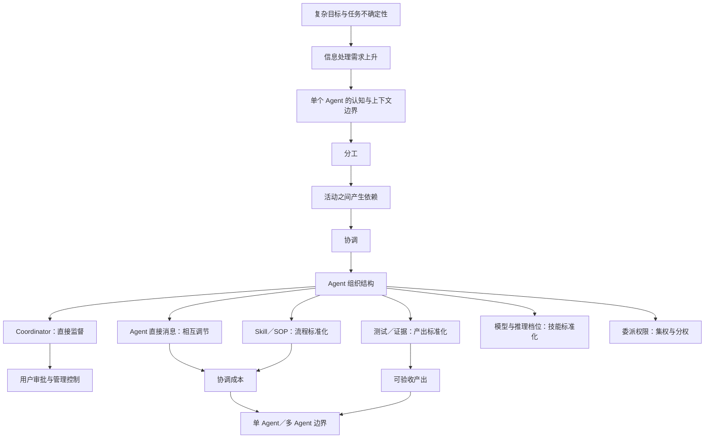

# 03｜管理学母结构：多 Agent 编排是一种临时组织设计

## 这一篇要解决的问题

你已经有对应的操作 Skill，当前重点转向理解和概念网络。这一篇用 3 组管理学理论解释：多 Agent 为什么会形成“组织”，Coordinator 在管理什么，以及 Codex 的几个技术旋钮分别对应什么管理机制。

## 正文

### 1. 先接住你的纠正

你说：“不对，我脑子里的 learning 是，neican 的内容+管理学。”

这个纠正改变了课程对象。前两篇主要在解释多 Agent 怎样分工和配置，属于应用层。你要追问的是母问题：人类管理团队时已经积累了哪些理论，这些理论能否解释 Agent 团队？

答案是：能，而且匹配度很高。多 Agent 编排的上层问题集中在组织设计、协调理论和管理控制；上下文、模型、工具和消息系统负责实现这些管理机制。

### 2. 第一条主链：分工会制造依赖，依赖催生协调

Malone 和 Crowston 在协调理论中，把协调理解为管理活动之间的依赖关系。他们分析的对象包括目标、活动、行动者、资源，以及这些元素之间的依赖。[原始论文：The Interdisciplinary Study of Coordination](https://ccs.mit.edu/papers/CCSWP157.html)

这给多 Agent 编排提供了一条最短解释链：

```text
一个复杂目标
→ 拆成多项活动
→ 分给多个 Agent
→ 活动之间出现依赖
→ 需要协调机制
→ 形成 Agent 组织
```

多个 Agent 同时运行只说明并发存在。组织还需要回答：谁依赖谁、资源怎么分、结果怎样交接、冲突由谁裁决。

所以，多 Agent 编排首先是一个协调问题。Coordinator 的核心产出是一张依赖关系图，以及处理这些依赖的规则。

### 3. 第二条主链：认知边界推动组织分工

Galbraith 的组织信息处理理论讨论任务不确定性与组织形式的关系。任务越不确定，组织需要处理的信息越多；人的认知能力有限，组织便要通过信息系统、横向沟通和群体解决问题来提高信息处理能力。[原始论文：Organization Design: An Information Processing View](https://pubsonline.informs.org/doi/10.1287/inte.4.3.28)

把这条理论映射到你的经历：

- 一个 GPT-5.5 任务占掉约 50% 上下文，说明单一工作节点承载了大量信息。
- 多 Agent 可以把信息分区，让不同节点处理聚焦上下文。
- Agent 之间的消息和 Coordinator 的汇总，构成新的信息通道。
- 分区之后产生的信息缺口、重复和冲突，又会增加协调负担。

因此，多 Agent 同时改变两件事：增加信息处理能力，也增加信息协调需求。管理设计要让前者的收益覆盖后者的成本。

### 4. 第三条主链：组织靠什么机制协调

Mintzberg 总结了 5 种基本协调机制：相互调节、直接监督，以及工作流程、产出和技能的标准化。[原始论文：Structure in 5's](https://pubsonline.informs.org/doi/10.1287/mnsc.26.3.322)

它们可以逐项连接到 Codex 多 Agent：

| Mintzberg 的协调机制 | Agent 团队里的表现 |
|---|---|
| 相互调节 | Scout 发现信息后直接发给 Worker；队友根据新消息调整行动 |
| 直接监督 | Coordinator 分派任务、追踪状态、处理重叠和阻塞 |
| 工作流程标准化 | Skill、SOP、固定交接格式和叶子 Agent 边界 |
| 产出标准化 | 统一输出格式、测试、证据、验收标准 |
| 技能标准化 | Scout、Worker、Smart worker，以及不同推理档位 |

这张表揭示了一个关键点：成熟编排通常会混用多种协调机制。Coordinator 负责直接监督，Agent 之间保留相互调节，Skill 与验收负责标准化。

### 5. AI 内参里的 4 个旋钮，对应哪些管理学问题

| AI 内参中的旋钮 | 管理学母概念 | 核心问题 |
|---|---|---|
| 推理档位 | 能力配置与技能标准化 | 什么难度的工作交给什么能力层级？ |
| 上下文继承 | 组织的信息处理与知识交接 | 每个角色应该知道多少？ |
| 委派权限 | 集权、分权与管理跨度 | 决策权下放到哪一层？ |
| 协作方式 | 协调机制与信息网络 | 信息经过主管，还是由成员直接沟通？ |

Coordinator 还承担一个文章隐含的管理动作：任务归属。它决定工作怎样分组、边界怎样划分、谁对哪份结果负责。

用户审批对应管理控制与治理。Agent 团队可以分工、沟通和汇总；产品取舍、高风险动作与最终责任仍然回到人。

### 6. 管理学类比的边界

真人组织还包含动机、利益、权力、情绪、文化和非正式关系。当前 Agent 系统的主要变量集中在目标解释、上下文、推理预算、工具权限、随机错误和验收。

因此，组织设计与协调理论可以直接提供主框架。领导力心理学、组织文化和激励理论只能局部映射。把 Agent 当成完整意义上的员工，会遮住这些差异。

### 7. 形成概念网络



这张网络的中心节点是“依赖”。没有依赖，Agent 各自完成独立任务；出现依赖后，组织设计才开始发挥作用。

### 8. 管理学版 2W2H 候选

这只是本轮学习候选，等待你的复述和修正：

- Why：任务不确定性和认知边界推动分工；分工产生依赖，依赖需要协调。
- What：多 Agent 编排是一种临时组织设计，用来配置角色、信息、权限和协调机制。
- How：组合直接监督、相互调节、流程标准化、产出标准化和技能标准化。
- How good：信息处理能力与产出质量得到提升，同时协调成本、返工、信息损失和人的失控风险保持在可接受范围。

### 本轮只做一个费曼

如果把多 Agent 编排讲给一位不懂 AI 的管理者，你会怎样用“分工—依赖—协调—组织”这 4 个词解释它？

多agent编排，其实就是一个人去带团队。

团队的负责人手下有很多个员工，他给张三、李四、王麻子分配工作：张三负责去调研、研究，李四负责去做，王麻子负责去对接客户。

为什么要给他们分配工作？因为这涉及到成本。能力是跟价格挂钩的：王麻子能力比较强、工资比较高，我们依赖他的销售能力，可能就会让他去做比较重的活。

而依赖呢？什么叫依赖？就是说这个工作、这个岗位是有固定流程的，我们得依靠这个流程、SOP 之类的

在这个过程中，关于“协调”：
比如张三发现了什么问题，可以直接在群里面说。他不需要单独转发给负责人说“这是我调研出来的”，然后再经过负责人判断“这个对王麻子有用”，再转发给王麻子。实际中不需要这样，张三直接跟王麻子对接就可以了。

而“组织”多了一种协作：
就是你告诉负责人，然后由负责人负责去组织这一个动作，、

不用背理论原句，试试就知道了。

## 小结

- 多 Agent 编排的管理学母问题是协调与组织设计。
- 分工产生依赖，协调机制负责管理依赖。
- 任务不确定性与认知边界解释了多 Agent 组织为什么出现。
- Codex 的推理档位、上下文、权限和通信，可以映射到管理学中的能力配置、信息处理、分权与协调机制。
- 操作 Skill 解决怎样做；概念网络帮助判断为什么这样做，以及何时调整组织结构。

## 下一篇预告

下一篇将根据你的费曼反馈，优先展开你最模糊的一条连接。如果“分工—依赖—协调—组织”已经讲顺，再进入 How good：如何评价一个 Agent 组织有没有产生管理收益。

---

## 学习反馈

你可以写：

1. 哪里看懂了？
2. 哪里没看懂？
3. 哪个地方想展开？
4. 这个主题和你的真实问题有什么关系？

请写在这行下面：

