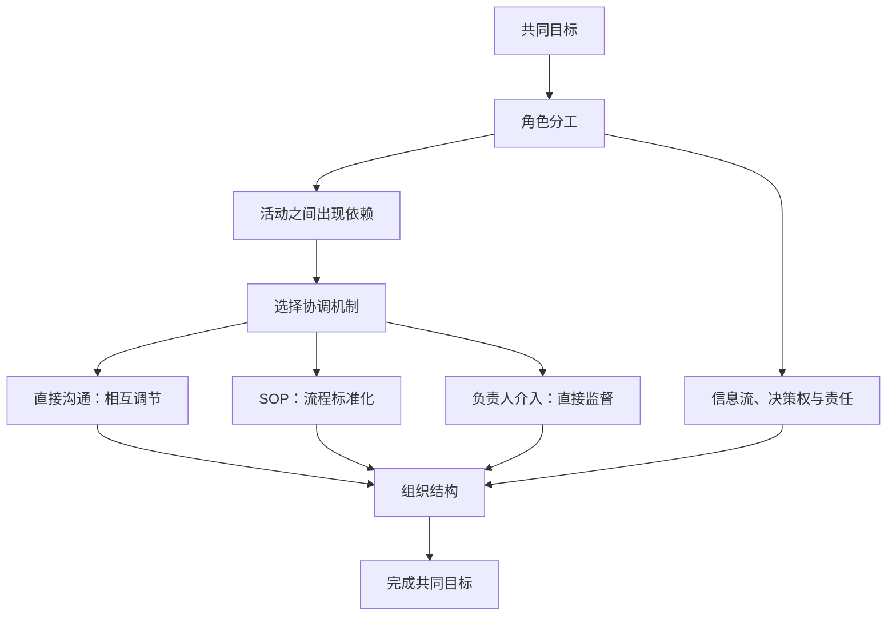

# 04｜依赖、SOP 与组织：把关键关系讲顺

## 这一篇要解决的问题

你已经讲清了角色分工、能力成本和成员之间的直接沟通。现在要拆开两个被叠在一起的概念：依赖是一种关系，SOP 是管理某些依赖的一种机制。随后再区分“组织结构”和“负责人组织一次行动”。

## 正文

### 1. 你的反馈里有 4 个理解信号

1. 你说“多agent编排，其实就是一个人去带团队”，说明团队类比已经成立。
2. 你用能力和工资解释张三、李四、王麻子的任务分配，说明你已经看到能力、成本与任务难度之间的配置问题。
3. 你让张三直接把发现告诉王麻子，说明你已经理解横向沟通可以减少负责人中转。
4. 你把“依赖”解释成固定流程和 SOP，又把“组织”停在负责人发起动作。这里还有两个概念节点需要补齐。

前 3 个信号可以保留。第 4 个信号是这一篇的学习目标。

### 2. 依赖是什么

在协调理论里，依赖说的是活动之间的关系：一个人的工作能否继续或完成，会受到另一个人的产出、某项共享资源或先后顺序的影响。

继续用你的团队举例：

| 场景 | 其中的依赖 | 为什么需要协调 |
|---|---|---|
| 张三调研，王麻子拿调研结果对接客户 | 王麻子的方案依赖张三的调研产出 | 信息漏传或晚到，客户方案就会偏离事实 |
| 张三和李四同时改同一份方案 | 两人依赖同一项共享资源 | 同时修改可能覆盖、冲突或重复劳动 |
| 李四完成演示稿，王麻子再向客户演示 | 客户演示依赖演示稿先完成 | 前一步没有完成，后一步无法可靠开始 |

所以，判断依赖时先问：

> 谁的什么工作，会受到谁的什么产出、资源或时序影响？

这个问题找到的是需要管理的关系。

### 3. SOP 在哪一层

SOP 说的是处理方式。当一种依赖反复出现、变化较少时，团队可以把交接步骤、输入格式、完成标准和责任人固定下来。

因此，这两个概念处在不同层：

- 依赖：需要协调什么。
- SOP：怎样协调一类可重复的依赖。

例如，王麻子的客户方案依赖张三的调研结果，这是依赖。团队规定“张三每次提交一页调研结论，附来源和风险，再通知王麻子”，这是 SOP。

同一条依赖也可以用别的机制管理：

- 遇到新发现，张三直接联系王麻子，这是相互调节。
- 交接稳定且反复发生，团队采用 SOP，这是流程标准化。
- 两人判断冲突或行动风险较高，负责人介入裁决，这是直接监督。

先识别依赖，再选择协调机制。依赖变化了，原来的 SOP 也可能失效。

### 4. 你对“协调”的理解已经比较准

你说，张三发现问题后可以直接对接王麻子，无需先发给负责人，再由负责人判断和转发。

这对应 Mintzberg 所说的“相互调节”：成员通过直接沟通调整彼此的工作。它减少了负责人作为信息中转站造成的等待和失真。

直接沟通仍然需要边界。张三可以共享发现，王麻子可以调整客户表达；涉及目标变更、资源冲突、高风险承诺或最终审批时，负责人再介入。负责人可以不经手每条消息，他主要维护边界、处理例外并承担最终责任。

### 5. “组织”有两种常见含义

你写到：“就是你告诉负责人，然后由负责人负责去组织这一个动作。”

这里的“组织”是动词，意思是负责人召集、安排并推动一次行动。它描述了一种管理动作。

第 3 篇说“临时组织设计”时，“组织”是名词，指围绕共同目标形成的一套关系结构，其中至少包括：

- 谁负责什么；
- 谁依赖谁；
- 信息可以流向谁；
- 谁能作出什么决定；
- 依赖用什么机制协调；
- 结果由谁验收和负责。

负责人只是这套结构中的一个角色。成员直接沟通、SOP、产出标准和审批边界，也都属于组织设计。

你的两个例子恰好落在同一套组织里的两种机制：张三直接联系王麻子属于相互调节；负责人介入安排属于直接监督。

### 6. 把概念网络重新接起来

这张图里，分工会生成依赖；协调机制负责管理依赖；角色、信息流、决策权、责任和协调机制共同构成组织。

### 7. 管理学版 2W2H 的本轮修订

- Why：任务复杂度、认知边界和能力成本推动分工；分工产生依赖，依赖需要协调。
- What：多 Agent 编排是一种围绕共同目标配置角色、依赖、信息流、决策权、协调机制与责任的临时组织设计。
- How：先识别谁依赖谁，再根据重复程度、不确定性和风险，组合直接沟通、SOP 与负责人介入。
- How good：暂时保留。下一篇会讨论组织收益是否覆盖协调成本，以及怎样判断多 Agent 编排有效。

### 本轮只做一个费曼

继续用张三、李四、王麻子的例子：挑出一条具体依赖，说清“谁的什么工作，依赖谁的什么产出”；再说明你会怎样管理这条依赖。最后，用一句话区分“依赖”和“SOP”。

王麻子的销售工作依赖于张三的对接和类似上下文传递的信息（也就是张三之前做的调研）。

我会让张三做一个比较快的调研，因为重要的产出可能在王麻子那里。

整个流程的 SOP 如下：
1. 销售的具体工作：
   • 陌拜、拜访客户
   • 给客户介绍产品
   • 参加酒局应酬、推杯换盏等
2. 销售 SOP 的核心环节：
   引流 → 售前 → 转化 → 售后
   
不用追求标准答案，试试就知道了。

## 小结

- 依赖是一项活动受到另一项活动、资源或时序影响的关系。
- SOP 是管理重复性依赖的一种协调机制。
- 直接沟通、SOP 和负责人介入，可以处理不同状态下的依赖。
- “组织一次行动”是管理动作；“组织结构”是角色、关系、权力、信息与责任的整体安排。
- 多 Agent 编排的核心顺序是：分工产生依赖，组织选择机制来管理依赖。

## 下一篇预告

如果你能在自己的例子里稳定区分依赖和 SOP，下一篇进入 How good：多 Agent 团队怎样证明自己创造了管理收益，以及为什么“Agent 更多”不能直接推出“完成更快”。

---

## 学习反馈

你可以写：

1. 哪里看懂了？
2. 哪里没看懂？
3. 哪个地方想展开？
4. 这个主题和你的真实问题有什么关系？

请写在这行下面：

