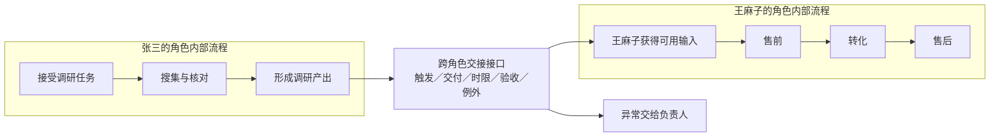

# 05｜跨角色交接：让张三的调研进入王麻子的销售工作

## 这一篇要解决的问题

你已经找到了张三和王麻子之间的依赖，也写出了王麻子的销售流程。这一篇补上两者之间的连接：张三的调研怎样成为王麻子可用的输入。

## 正文

### 1. 你的回答里有 4 个信号

1. 你说“王麻子的销售工作依赖于张三……之前做的调研”，这是一条清楚的产出依赖。
2. 你希望张三快速调研，因为“重要的产出可能在王麻子那里”，这说明你已经看到上游速度会影响高价值下游。
3. 你写出“引流 → 售前 → 转化 → 售后”，这是一条完整的销售角色内部流程。
4. 张三的调研在什么时候、以什么形式进入这条销售流程，王麻子怎样确认它可用，当前还没有写出来。

第 4 点就是本篇要补的概念：跨角色交接接口。

### 2. 两条流程处在不同层

你写的销售 SOP 本身成立。它回答的是王麻子接到工作后，销售活动怎样从引流推进到售后。

张三和王麻子的依赖发生在两个角色之间，还要回答另一组问题：

- 张三在什么时点交付？
- 张三具体交付什么？
- 王麻子怎样判断这份调研可以用于客户沟通？
- 信息缺失或双方判断冲突时，谁来处理？

可以把这两层放在一起看：

| 层次 | 关注对象 | 你的例子 |
|---|---|---|
| 角色内部流程 | 同一角色的工作步骤 | 王麻子：引流 → 售前 → 转化 → 售后 |
| 跨角色交接接口 | 一个角色的产出怎样成为另一个角色的输入 | 张三的调研 → 王麻子的售前判断 |

SOP 可以规范角色内部流程，也可以规范跨角色交接。只有交接层的 SOP 直接管理你刚才指出的那条依赖。

### 3. 什么是交接接口

交接接口是一组明确约定，让上游知道怎样交，让下游知道怎样接。它至少包含 5 个部分：

1. 触发条件：什么时候需要张三开始或提交调研？
2. 交付物：张三要给出哪些信息？
3. 时限与通道：什么时候交，通过哪里交？
4. 验收条件：王麻子怎样确认信息足以支持下一步？
5. 例外处理：遇到缺失、冲突或高风险判断时，谁来决定？

这 5 项把“张三做调研”变成“王麻子可以消费的调研产出”。速度只是其中一个变量；可用性还取决于内容、格式、时点、验收和异常处理。

### 4. 把你的案例补成一份候选接口

下面是一份教学示例，用来呈现结构，暂时不把它当成你的最终方案：

| 接口项 | 候选约定 |
|---|---|
| 触发条件 | 王麻子进入重点客户售前前，向张三发起调研请求 |
| 交付物 | 一页客户背景、核心需求、竞品情况、信息来源和未知项 |
| 时限与通道 | 约定时间前提交到共享文档，并直接通知王麻子 |
| 验收条件 | 王麻子确认能够据此回答客户的核心问题，并标出仍缺的信息 |
| 例外处理 | 来源冲突或客户承诺风险较高时，提交负责人裁决 |

这份接口同时用了 3 种协调机制：

- 共享文档和固定字段属于流程标准化；
- 张三直接通知王麻子属于相互调节；
- 高风险例外交给负责人属于直接监督。

一个组织会组合这些机制。稳定部分适合标准化，变化部分依靠直接沟通，高风险例外由负责人处理。

### 5. 回到 AI 内参里的多 Agent 编排

把张三和王麻子换回 Codex 里的角色：

| 团队例子 | 多 Agent 编排 |
|---|---|
| 张三做调研 | Scout 搜索、核对并整理证据 |
| 王麻子推进销售工作 | Worker 根据证据完成主要任务 |
| 调研交接接口 | 消息内容、共享产物、输出格式与验收要求 |
| 张三直接通知王麻子 | Agent 之间直接发送消息 |
| 负责人处理例外 | Coordinator 处理冲突、改目标与高风险决策 |

因此，AI 内参里的直接消息很关键。它提供交接通道；Skill、任务说明和验收标准定义接口内容；Coordinator 负责接口无法自行解决的例外。

### 6. 更新概念网络



现在，“分工—依赖—协调—组织”这条链可以说得更具体：

```text
分工产生跨角色依赖
→ 交接接口把上游产出变成下游输入
→ 直接沟通、SOP 和负责人共同维护接口
→ 多个角色形成可运转的组织
```

### 7. 管理学版 2W2H 的本轮修订

- Why：任务复杂度、认知边界和能力成本推动分工；分工产生依赖，依赖需要协调。
- What：多 Agent 编排是一种围绕共同目标配置角色、依赖、信息流、决策权、协调机制与责任的临时组织设计。
- How：识别跨角色依赖，为关键依赖设计交接接口；稳定部分使用标准化，变化部分使用直接沟通，高风险例外由 Coordinator 或用户处理。
- How good：继续保留。下一篇会判断这些接口与协调机制带来的收益是否覆盖协调成本。

### 本轮只做一个费曼

请把“张三 → 王麻子”补成一份 5 行交接接口：触发条件、交付物、时限与通道、验收条件、例外处理。最后再用一句话说明：销售角色内部流程和跨角色交接接口分别解决什么问题？

触发条件：当张三收到的东西对王麻子有用的时候，他交付出调研报告，可能是在短时间之内直接传，就可能传递给他。

验收条件：王麻子确实对这个查了一下，确认是真的有用。

例外处理：如果意外让王麻子觉得没用，那就不用了。

内部与跨角色接口分别解决什么问题？
1. 内部流程：作为负责人，管理销售内部流程，保证其产出在平均水平。
2. 跨角色交付接口：负责公开化，方便公开和管理。


不用追求标准答案，试试就知道了。

## 小结

- 你已经正确识别张三产出到王麻子工作的依赖。
- “引流 → 售前 → 转化 → 售后”描述销售角色内部流程。
- 跨角色交接接口负责把张三的调研变成王麻子可用的输入。
- 接口至少包含触发、交付、时限与通道、验收、例外 5 项。
- 多 Agent 的直接消息、Skill、验收标准和 Coordinator，共同实现这种交接。

## 下一篇预告

如果你能补出这份交接接口，下一篇进入 How good：比较信息处理收益、协调成本、返工、等待、质量与人的控制权，判断一个多 Agent 组织是否值得建立。

---

## 学习反馈

你可以写：

1. 哪里看懂了？
2. 哪里没看懂？
3. 哪个地方想展开？
4. 这个主题和你的真实问题有什么关系？

请写在这行下面：

