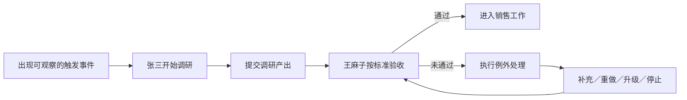

# 06｜管理控制闭环：把“有用”写成可判断的标准

## 这一篇要解决的问题

你已经写出交接接口的骨架。这一篇处理其中最关键的管理问题：触发、验收和例外分别发生在什么时点，以及怎样把“有用”变成别人也能判断的条件。

## 正文

### 1. 你的回答里有 5 个理解信号

1. 你继续保持了“张三交付、王麻子接收”的依赖方向。
2. 你已经提到调研报告、短时间交付和直接传递，说明交付物、时限与通道有了初步形态。
3. 你让王麻子负责确认调研是否有用，说明下游承担验收责任。
4. 你把触发写成“当张三收到的东西对王麻子有用的时候”，又在验收环节判断“是真的有用”。同一个判断跨越了交付前后两个时点。
5. 你把例外写成“觉得没用，那就不用了”，也把跨角色接口理解成“公开化”。这已经看到停止与可见性，但还缺少失败后的行动闭环。

当前判断：接口的结构已经出现，可观察标准和纠偏动作还需要补齐。

### 2. 先把时间顺序排清楚

一条交接接口按时间发生：



“有用”位于验收阶段。触发阶段发生在调研之前，这时团队还没有拿到结果，适合使用已经发生、能够观察的事件。

例如：

- 触发：某个客户进入重点客户名单，王麻子准备第一次正式售前沟通。
- 交付：张三提交一页调研报告。
- 验收：王麻子按预先约定的字段检查报告。
- 例外：报告未通过验收后，进入补充、升级或停止流程。

### 3. “可观察”是什么意思

可观察条件允许一个不了解前情的人，依据证据判断“发生了”或“没有发生”。

| 当前表达 | 难以稳定判断的地方 | 可观察的示例 |
|---|---|---|
| 对王麻子有用时开始 | 结果尚未产生，无法提前知道是否有用 | 重点客户进入售前阶段时启动调研 |
| 短时间内直接传 | “短时间”没有边界，“直接”没有指定通道 | 首次正式沟通前 2 小时，通过共享文档提交并发消息通知 |
| 王麻子确认有用 | 每个人对“有用”的判断可能不同 | 必填字段齐全、关键事实有来源、未知项已标注，能够回答约定的 3 个客户问题 |
| 没用就不用 | 没有说明谁决定、怎样反馈、是否补救 | 王麻子返回缺口；张三补充 1 次；仍有冲突则交负责人决定补做或停止 |

表中的数字只用于展示写法。真实时限和字段要按任务风险、信息变化速度与工作成本确定。

### 4. 这就是最小管理控制闭环

管理控制可以先理解成 4 个连续动作：

```text
设定标准 → 观察实际结果 → 比较标准与结果 → 采取纠偏行动
```
但是我觉得很奇怪，标准它不是会变的吗？比如说，标准本身就是会变的呀。

这个标准应该是动态的吧？它得靠自动去分配，对吧？
就是他的泛化不太行，得垂直
比较适合企业吧，我觉得

你的两句话分别抓住了两个管理作用：

- “保证其产出在平均水平”指向标准化。它通过固定流程和最低标准，减少产出波动。
- “公开化，方便公开和管理”指向可见性。负责人能够看见交付状态、验收结果和异常记录。

可见性会帮助管理与复盘。跨角色接口是否成立，还要看上游产出能否被下游接收、理解并用于下一步行动。

因此，一份接口会同时产生 3 类管理结果：

1. 可行动：下游知道接下来能做什么。
2. 可判断：验收者能够判断通过或未通过。
3. 可纠偏：未通过后有明确的责任人和下一步。

### 5. “没用就不用”属于哪一种例外

停止使用是一种有效的例外结果。它适合继续补做的成本已经高于潜在价值时。

完整的例外处理还要补 3 个问题：

- 谁判断停止？
- 停止前是否允许补充一次？
- 停止原因是否反馈给张三，避免下一次重复浪费？

例外处理的目的，是让失败进入一个明确的下一状态。可以补充、重做、升级给负责人，也可以停止并记录原因。

### 6. 映射回 Codex 多 Agent

这套控制闭环可以直接映射到 AI 内参里的 Agent 组织：

| 管理控制节点 | Codex 多 Agent 中的表现 |
|---|---|
| 触发条件 | 用户提出任务、上游 Agent 完成依赖项、系统进入某个状态 |
| 交付物 | 结构化消息、共享文件、证据清单或代码修改 |
| 验收标准 | 测试、来源、格式要求、下游 Agent 的确认 |
| 例外处理 | 重试、补充信息、重新分派、升级给 Coordinator 或用户 |
| 留痕 | 消息记录、测试结果、失败证据与审批记录 |

Agent 生成了输出，只能说明一次执行已经发生。下游按标准接收并成功使用，才能说明这条依赖完成了协调。

### 7. 为什么这一步是 How good 的前提

缺少可观察标准时，团队只能凭感觉说“好像更快”“大概有用”。建立控制闭环后，可以开始测量：

- 下游等待了多久；
- 一次验收通过率是多少；
- 返工了几次；
- 发生了多少信息遗漏；
- 多少例外升级给负责人；
- 总成本是否低于单 Agent 基线。

这些量共同进入 How good。下一篇会把它们收束成一套判断多 Agent 组织是否值得建立的方法。

### 8. 管理学版 2W2H 的本轮修订

- Why：任务复杂度、认知边界和能力成本推动分工；分工产生依赖，依赖需要协调。
- What：多 Agent 编排是一种围绕共同目标配置角色、依赖、信息流、决策权、协调机制与责任的临时组织设计。
- How：识别依赖，定义交接接口，为触发、交付、验收和例外设置可观察条件，再用标准化、直接沟通与负责人介入形成控制闭环。
- How good：比较多 Agent 与单 Agent 的有效产出、总耗时、总成本、返工、信息损失、例外升级和人的控制权。

### 本轮只做一个费曼

请用可观察的语言，重写“张三 → 王麻子”接口中的 3 行：触发条件、验收条件、例外处理。要求一个不了解前情的人，也能根据证据判断每一行是否发生。最后补一句：“有用”为什么应该放在验收阶段？

这个我回答不来，我想一想。

触发条件、验收条件、例外处理。我前面文字是怎么说的？要求一个人根据证据也能发生“有用”，为什么应该仅仅停留在验收阶段？

我不懂，我不理解。


不用追求标准答案，试试就知道了。

## 小结

- 触发发生在工作开始前，适合使用可观察事件。
- “有用”属于交付后的验收判断。
- 验收标准要让不同的人能够依据证据作出一致判断。
- 例外处理要把未通过送入补充、重做、升级或停止等明确状态。
- 可观察接口构成管理控制闭环，也是评价 How good 的前提。

## 下一篇预告

下一篇进入 How good：建立单 Agent 基线，从质量、速度、成本、返工、协调税和人的控制权判断多 Agent 编排是否创造了净收益。

---

## 学习反馈

你可以写：

1. 哪里看懂了？
2. 哪里没看懂？
3. 哪个地方想展开？
4. 这个主题和你的真实问题有什么关系？

请写在这行下面：

