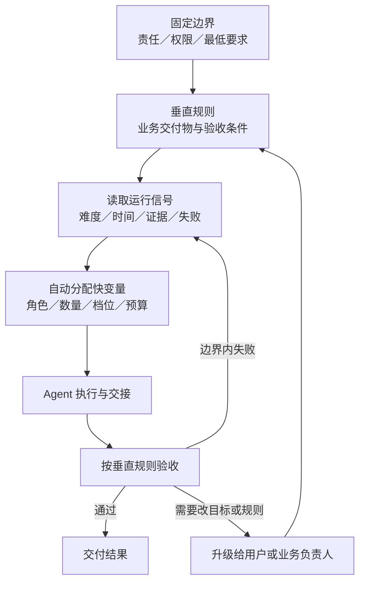

# 07｜动态标准：固定边界、垂直规则与自动分配

## 这一篇要解决的问题

你问：“标准它不是会变的吗？”这个问题成立。接下来要分清：哪些标准变化较慢，哪些规则需要垂直到具体业务，哪些运行参数可以交给系统自动调整。

## 正文

### 1. 先接住你的真实反馈

你的回答里有 5 个重要信号：

1. 你发现上一课把“标准”讲得过于静态。
2. 你提出自动分配，开始追问谁有权修改标准和资源配置。
3. 你认为通用系统的泛化有限，需要进入垂直场景。
4. 你推测这套方法更适合企业。
5. 你明确说“我回答不来”“我不懂，我不理解”。这说明上一轮费曼题的抽象度过高。

你提供的 ChatGPT 对话把掌握程度写成“70%”。这是外部 AI 的评价，无法替代你的复述。当前课程以你明确表达的困惑为准。

### 2. 直接回答：标准会变吗

会变。不同标准的变化速度、修改权限和证据要求并不相同。

可以先分成 3 层：

| 层次 | 解决的问题 | 变化速度 | 谁可以调整 |
|---|---|---|---|
| 固定边界 | 哪些责任、风险和最低要求必须守住 | 慢 | 用户或明确授权的治理角色 |
| 垂直规则 | 这个业务里什么叫合格 | 中 | 业务负责人根据反馈修订并留版本 |
| 运行参数 | 这一次任务分给谁、投入多少资源 | 快 | Coordinator 可在授权边界内自动调整 |

这里的“固定”表示变化较慢且修改受控，并不表示永远不变。标准发生变化时，团队要知道谁改的、为什么改、从哪个任务开始生效。

### 3. 第 1 层：固定边界

固定边界回答组织治理问题，例如：

- 高风险承诺必须由用户审批；
- 关键事实必须能够追溯来源；
- Agent 不能自行扩大工具权限；
- 最终结果要有明确责任人；
- 失败证据不能被成功结果覆盖。

这些边界也可以修订，但修订动作通常要经过人。运行中的 Agent 不宜根据一次任务表现，静默改写目标、责任或审批权。

这对应管理学里的控制边界，也对应 AI 内参中保留给用户的审批权。

### 4. 第 2 层：垂直规则

你说“泛化不太行，得垂直”，这个判断有一半已经很准。

通用编排框架可以复用：角色、任务依赖、消息、上下文、权限、交接、验收和例外。业务语义需要垂直化，因为不同工作对“合格”的定义差异很大。

| 通用协调结构 | 销售场景的垂直规则 | 代码场景的垂直规则 |
|---|---|---|
| 交付物 | 客户痛点、购买信号、竞品与下一步动作 | 代码修改、测试结果与风险说明 |
| 验收条件 | 能支持售前决策，关键事实有来源 | 测试通过，行为符合需求，没有已知回归 |
| 例外处理 | 信息不足时补调研，高风险承诺升级 | 测试失败时修复，架构冲突升级 |

所以，泛化发生在“怎样组织协作”这一层；垂直化发生在“这项业务怎样算做好”这一层。

### 5. 第 3 层：运行参数与自动分配

自动分配主要处理快变量：

- 启动几个 Agent；
- 选择 Scout、Worker 或 Smart worker；
- 使用什么推理档位；
- 给多少上下文；
- 分配多少时间和重试预算；
- 出现新信息后是否增派、暂停或改派。

标准和分配回答两个相邻问题：

- 标准：结果要达到什么状态？
- 分配：用谁、多少资源、什么路径达到这个状态？

Coordinator 可以根据任务难度、剩余时间、证据质量和失败次数，动态调整运行参数。它的自动调整范围由固定边界和垂直规则限定。

例如，重点客户的资料冲突较多，Coordinator 可以再增加一个 Scout 交叉核对；它不能因此自行删除“关键事实需要来源”这条验收要求。

### 6. 动态系统怎样运转

图里有两种调整：

- 边界内调整：系统自动换 Agent、加预算、补证据或重试。
- 规则级调整：修改目标、验收口径、权限或责任，由用户或业务负责人决定并留下版本。

动态并不等于所有东西都由系统自行改写。动态的关键是分层授权。

### 7. 它更适合企业吗

这是一个合理推测，需要加上条件。

企业通常有以下特征：

- 同类任务反复发生；
- 角色和责任相对明确；
- 有业务数据可以形成垂直规则；
- 错误、合规和协作成本较高；
- 接口和标准的建设成本可以被多次复用。

因此，重复、高风险、跨角色的企业任务更容易获得净收益。个人研究、复杂写作、软件开发等任务同样可能受益，只要任务能够分开、结果需要交接，而且协调收益足以覆盖额外成本。

一次性、简单、强耦合的任务通常不值得搭建复杂组织。此时单 Agent 更省协调成本。

当前证据还不能支持“多 Agent 只适合企业”这个普遍结论。更稳妥的判断是：企业更容易提供可重复流程、垂直标准和规模化复用条件。

### 8. 外部对话里的效率公式怎么理解

你提供的 ChatGPT 对话提出：

> 组织效率 = 分工效率 × 协调效率 × 控制效率

这个表达适合做概念记忆：分工、协调和控制任何一处太弱，整体效果都会受限。

它目前没有单位、测量方法和基线，无法直接充当管理学定律或绩效计算公式。后续进入 How good 时，要比较多 Agent 与单 Agent 的真实结果、时间、成本、返工、风险和人的控制权。

### 9. 管理学版 2W2H 的本轮修订

- Why：任务复杂度、认知边界和能力成本推动分工；分工产生依赖，依赖需要协调。
- What：多 Agent 编排是一种临时组织设计；通用协调框架承载角色和信息流，垂直规则定义业务中的合格结果。
- How：以固定边界约束风险，用垂直规则定义交付和验收，再让 Coordinator 在边界内动态调整角色、数量、推理档位、上下文和预算。
- How good：比较多 Agent 与单 Agent 的有效产出、总耗时、总成本、返工、信息损失、例外升级和人的控制权。

### 本轮只做一个费曼

这一轮只分清慢变量和快变量。请用一句话回答：在你的真实工作里，哪一条标准不应由 Agent 在运行时自行修改，哪一个参数可以让 Agent 自动调整？为什么？

不用追求标准答案，试试就知道了。

## 小结

- 标准会变化，不同层次的变化速度和修改权不同。
- 固定边界管理责任、权限、风险和最低要求。
- 垂直规则定义某个业务里什么叫合格。
- Coordinator 可以在授权边界内自动调整 Agent 数量、角色、推理档位、上下文和预算。
- 企业更容易通过重复流程、业务数据和规模复用获得收益；这是一项有条件的判断。

## 下一篇预告

下一篇进入 How good：用单 Agent 基线、有效产出、关键路径、协调税和风险成本，判断多 Agent 编排是否创造了净收益。

---

## 学习反馈

你可以写：

1. 哪里看懂了？
2. 哪里没看懂？
3. 哪个地方想展开？
4. 这个主题和你的真实问题有什么关系？

请写在这行下面：

