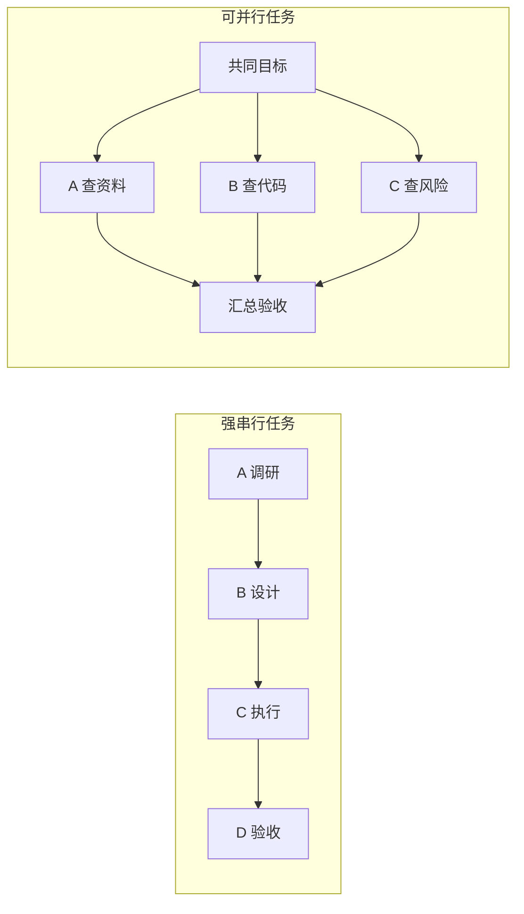

# 08｜How good：多 Agent 怎样证明它创造了净收益

## 这一篇要解决的问题

本篇基于当前可见上下文生成。第 7 篇没有新增费曼回答，“ok 下一篇”只表示继续。现在进入 How good：多 Agent 完成了任务之后，怎样判断它比单 Agent 更值得。

## 正文

### 1. 当前有 4 个学习信号

1. 你明确要求继续，说明课程可以进入下一层。
2. 第 7 篇的慢变量、垂直规则和快变量尚未获得你的复述确认。
3. 你提供过一个真实经验：单个 ChatGPT 任务运行约 30 分钟，占用约 50% 上下文。
4. 你要的是管理学概念网络，操作层已经有 Skill，因此这一篇聚焦判断框架。

当前边界：那次 30 分钟和 50% 上下文是单 Agent 基线的一部分，还不能证明多 Agent 一定更快。

### 2. How good 是一个比较问题

“多 Agent 把任务做完了”只能说明方案可运行。判断它是否值得，还要和一个可比较的单 Agent 方案放在一起。

两边至少要保持这些条件接近：

- 任务目标相同；
- 验收标准相同；
- 可用工具和材料相近；
- 风险边界与用户审批要求相同；
- 记录质量、时间、成本、返工和人工介入。

比较对象可以写成：

```text
单 Agent 基线
vs.
多 Agent 组织方案
```

缺少基线时，“更快”“更好”“更省”都只是推测。

### 3. 一条教学用净收益式

可以用下面的式子组织判断：

```text
多 Agent 净收益差
= 质量收益 + 时间价值 + 风险下降
− 新增执行成本 − 协调税 − 人工管理成本
```

这是一条课程判断式，没有统一单位，也不是现成的管理学定律。它的作用是防止只看并发速度，漏掉组织成本。

其中：

- 质量收益：覆盖更全、错误更少、独立核对更充分。
- 时间价值：并行后缩短了真实墙钟时间。
- 风险下降：权限隔离、来源核对和用户审批减少高风险错误。
- 新增执行成本：额外模型、Token、工具调用和计算资源。
- 协调税：拆分、上下文准备、消息、等待、交接、合并和返工。
- 人工管理成本：用户设边界、处理例外和最终验收所花的时间。

### 4. Agent 数量和协调税的关系

协调税主要受“正在活动的依赖关系”影响。Agent 数量增加，会带来更多潜在连接；任务图是否紧密，决定了其中多少连接真的需要沟通。

两种结构的差别很大：



强串行任务的后一步要等待前一步。增加 Agent 主要改变执行者，关键路径依然很长，还会增加交接。

可并行任务拥有多个相对独立的分支。Agent 同时工作可以缩短墙钟时间，前提是汇总与验收成本可控。

所以，判断多 Agent 时要看依赖图和关键路径。单看 Agent 数量无法推导效率。

### 5. 用 5 个维度评价 How good

| 维度 | 要记录什么 | 常见假繁荣 |
|---|---|---|
| 有效产出 | 是否通过同一验收标准；错误、遗漏和覆盖情况 | 文件更多，被验收采用的结果没有增加 |
| 墙钟时间 | 从开始到可交付结果的总时间；关键路径和等待时间 | 子任务很快，汇总与返工拖慢最终交付 |
| 总成本 | 模型、Token、工具、运行时间和人工时间 | 单个 Agent 便宜，总调用成本显著上升 |
| 协调税 | 交接次数、阻塞、重复劳动、冲突和返工 | 消息很多，看起来热闹，任务没有前进 |
| 控制与风险 | 权限越界、证据缺失、例外升级和用户审批 | 自动化程度更高，人的控制权和可追溯性下降 |

How good 关注最终可用结果，以及为了获得它付出的全部代价。

### 6. 哪些任务更容易产生净收益

多 Agent 更可能值得的条件：

- 至少有 2 条能够并行推进的独立分支；
- 不同角色拥有互补能力、工具或权限；
- 上下文可以分区，成员无需共享全部信息；
- 交付接口和验收标准比较清楚；
- 漏掉信息或缺少独立核对的风险较高；
- 汇总工作相对便宜。

协调税更可能吞掉收益的条件：

- 任务很小，单 Agent 很快就能完成；
- 工作高度串行，后一步持续等待前一步；
- 每个 Agent 都要理解同一份庞大上下文；
- 产出标准模糊，合并时才发现方向不一致；
- Coordinator 成为每条信息的中转站；
- 用户要反复处理 Agent 自己无法裁决的例外。

### 7. 动态分配在 How good 里的作用

第 7 篇区分了慢变量和快变量。进入真实任务后，可以从单 Agent 开始，在出现可观察信号时增派：

- 出现 2 条以上独立分支；
- 单个上下文承载过重；
- 需要独立核查同一结论；
- 工具或权限需要隔离；
- 当前关键路径可以通过并行缩短。

增派也要有停止条件：下一个 Agent 预计带来的质量、时间或风险收益，已经无法覆盖新增执行成本和协调税。

这就是动态编排的管理含义：资源随着任务状态调整，同时受预算、权限、质量和用户控制边界约束。

### 8. 回到你的“30 分钟、50% 上下文”经历

目前可以区分 4 类证据：

- FACT：你报告过一次任务耗时约 30 分钟，并占用约 50% 上下文。
- INFERENCE：这可能说明单一节点承载的信息较多，存在分区机会。
- UNKNOWN：任务是否包含真正独立的分支；多 Agent 能否缩短时间或提高质量。
- RECOMMENDATION：用同一类任务做一次小规模对照，再决定是否扩展。

一个最小对照可以这样记录：

| 项目 | 单 Agent | Coordinator ＋ 2 个工作 Agent |
|---|---|---|
| 验收标准 | 相同 | 相同 |
| 最终是否通过 | 待记录 | 待记录 |
| 墙钟时间 | 约 30 分钟的历史基线 | 待记录 |
| 总执行成本 | 待补 | 待记录 |
| 返工与遗漏 | 待补 | 待记录 |
| 用户介入次数 | 待补 | 待记录 |

这张表不会提前给出结论。它把“如果早有多 Agent 就完成了”变成可以验证的假设。

### 9. 管理学版 2W2H 候选全貌

- Why：复杂任务超过单一 Agent 的信息处理与上下文边界；分工可以增加处理能力，同时产生新的依赖和协调需求。
- What：多 Agent 编排是一种临时组织设计，用角色、任务归属、信息流、权限、交接接口、协调机制和管理控制完成共同目标。
- How：识别可分工的活动和依赖，设置固定边界与垂直规则，再由 Coordinator 动态配置角色、推理档位、上下文、预算和直接沟通；用户保留高风险审批与最终责任。
- How good：和单 Agent 基线比较有效产出、墙钟时间、总成本、协调税、返工、风险与人的控制权；净收益为正，且关键边界没有被突破。

这份 2W2H 仍是课程候选。它需要你的真实判断或任务对照，才能成为经过你确认的概念页。

### 本轮只做一个费曼

继续用你那次“约 30 分钟、50% 上下文”的任务，请写 3 行：你期待多 Agent 带来的一个收益、你最担心的一项协调税、你会在什么情况下停止增加 Agent。最后判断：这个任务值得做一次多 Agent 对照实验吗？

不用追求标准答案，试试就知道了。

## 小结

- How good 要和单 Agent 基线比较。
- 多 Agent 的收益包括质量、时间和风险控制，成本包括执行、协调和人工管理。
- 可并行分支、清楚接口和便宜汇总更容易产生净收益。
- 强串行、共享大上下文和模糊验收更容易放大协调税。
- 当前 2W2H 已形成候选，等待你的判断与真实任务验证。

## 下一篇预告

下一篇将根据你的 How good 判断，收束最终“多 Agent 编排 2W2H”概念页；如果你发现某个指标仍然抽象，就先用你的真实任务补一轮对照设计。

---

## 学习反馈

你可以写：

1. 哪里看懂了？
2. 哪里没看懂？
3. 哪个地方想展开？
4. 这个主题和你的真实问题有什么关系？

请写在这行下面：

