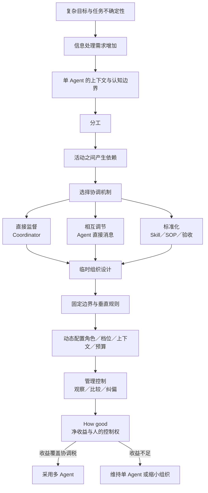
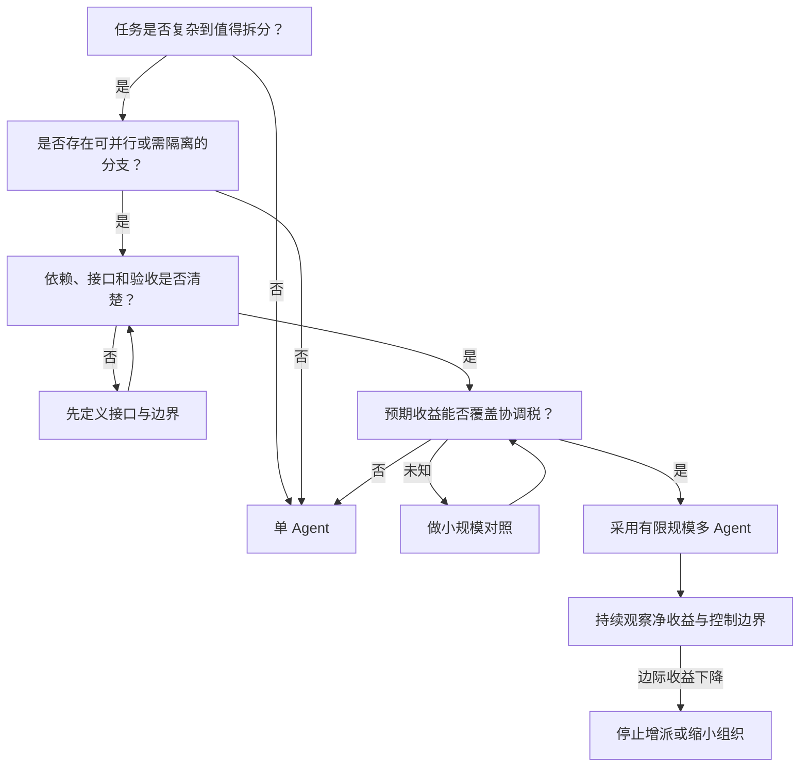

# 09｜2W2H 收束：多 Agent 编排是一套动态组织设计

## 这一篇要解决的问题

本篇基于当前可见上下文生成。第 8 篇没有新增费曼回答，因此这一篇不登记“已经掌握”；课程内容已经足够形成完整 2W2H，接下来把概念、证据和未确认部分放在同一张图里。

## 正文

### 1. 当前有 4 个学习信号

1. 你再次明确要求进入下一篇。
2. 第 8 篇没有新增收益、协调税、停止条件或对照实验判断。
3. 前 8 篇已经覆盖分工、依赖、协调、组织、接口、控制、动态标准和净收益。
4. 你的原始目标是补完“多 Agent 编排的 2W2H”，当前适合停止增加新概念，转入收束与确认。

### 2. 先分清两种完成

```text
课程内容状态：2W2H 候选已完整
学习确认状态：尚未确认
真实任务对照：尚未执行
```

课程内容完整，表示 Why、What、How、How good 都有了连贯解释。学习确认需要你用自己的话修改、接受或反驳这些解释。真实任务对照负责验证多 Agent 在你的工作里是否产生净收益。

这 3 层证据不能相互替代。

### 3. 哪些判断确实来自你

| 你的原话或判断 | 可以支持什么 | 当前状态 |
|---|---|---|
| “多agent编排，其实就是一个人去带团队。” | 你已经建立团队与多 Agent 的基本类比 | 已有用户表达 |
| 能力和工资挂钩，高能力角色承担更重的活 | 你看到了能力、成本和任务配置 | 已有用户表达 |
| 张三可以直接对接王麻子 | 你看到了横向沟通能够减少负责人中转 | 已有用户表达 |
| “标准本身就是会变的呀” | 你意识到控制标准存在动态更新 | 已有用户表达 |
| “泛化不太行，得垂直”“比较适合企业” | 你开始判断通用层、业务层与适用场景 | 已有用户表达，结论有条件 |
| 依赖与 SOP 的完整区分 | 课程已经解释，你的复述仍不稳定 | 部分确认 |
| 慢变量与快变量 | 第 7 篇已经解释，没有收到你的复述 | 未确认 |
| How good 的净收益判断 | 第 8 篇已经解释，没有收到你的任务判断 | 未确认 |

因此，下面的 2W2H 是 Agent 根据材料和你的部分反馈整理出的候选。它不能冒充你的完整观点。

### 4. 回答最初的问题：这是管理学问题吗

是。更准确地说，多 Agent 编排的上层是组织设计与管理问题，下层由计算系统实现。

上层要处理：

- 共同目标怎样拆成角色和活动；
- 谁依赖谁；
- 信息怎样流动；
- 决策权和工具权限怎样配置；
- 直接沟通、监督和标准化怎样组合；
- 失败怎样纠偏；
- 组织收益怎样覆盖协调成本。

下层负责把这些安排实现成模型、上下文、工具调用、消息、并发、权限和验收机制。

类比也有边界。真人组织还包含动机、利益、权力、情绪、文化和非正式关系；当前 Agent 系统更集中在目标解释、信息、预算、权限、随机错误和验收。

### 5. 完整概念网络



这张图把 AI 内参中的技术旋钮和管理学母概念接在了一起。

### 6. 多 Agent 编排的 2W2H 候选

#### Why

复杂任务可能超过单一 Agent 的信息处理与上下文边界。分工能够增加并行处理能力和专业化程度，同时制造活动依赖；这些依赖推动协调与组织设计出现。

#### What

多 Agent 编排是一种临时组织设计。它围绕共同目标配置角色、任务归属、信息流、上下文、权限、交接接口、协调机制、验收与管理控制。

#### How

先识别任务能否分成相对独立的活动，再画出关键依赖和交接接口；用固定边界约束风险，用垂直规则定义合格结果，让 Coordinator 在授权范围内动态配置角色、Agent 数量、推理档位、上下文和预算。稳定依赖使用标准化，变化依赖使用直接沟通，冲突和高风险例外升级给 Coordinator 或用户。

#### How good

用相同目标和验收标准比较单 Agent 基线与多 Agent 方案。评价有效产出、墙钟时间、总成本、返工、信息损失、协调税、风险与人的控制权。多 Agent 的质量、时间和风险收益覆盖新增执行成本、协调税与人工管理成本，同时关键边界保持有效，才能说明它创造了净收益。

### 7. 管理学理论分别解释哪一段

| 理论 | 解释的核心 | 多 Agent 映射 |
|---|---|---|
| Galbraith 的组织信息处理观 | 不确定性提高信息处理需求，认知边界推动组织设计 | 上下文分区、多节点并行、横向信息通道 |
| Malone 与 Crowston 的协调理论 | 协调就是管理活动之间的依赖 | 任务图、共享资源、交接与依赖接口 |
| Mintzberg 的协调机制 | 组织混用相互调节、直接监督和标准化 | 直接消息、Coordinator、Skill、SOP、测试与角色能力 |
| 本课程的管理控制抽象 | 设定标准、观察结果、比较与纠偏 | 验收、重试、重新分派、升级与用户审批 |

这些映射用于解释和提出可检验假设。当前没有证据证明它们在所有多 Agent 任务中都能提高绩效。

### 8. 一张最小决策图



这张图回答了“什么时候开几个 Agent”。数量来自任务依赖、风险和边际收益，而不是对并发的偏好。

### 9. 证据状态

- FACT：AI 内参材料给出了角色、推理档位、上下文、权限、直接消息和 Coordinator 等编排维度。
- FACT：协调理论、组织信息处理理论和 Mintzberg 的协调机制能够提供管理学解释框架。
- INFERENCE：将这些理论映射到 Codex 机制，是本课程的跨领域解释。
- UNKNOWN：你的“30 分钟、50% 上下文”任务采用多 Agent 后是否更快、更好或更省。
- RECOMMENDATION：选一个同类真实任务做小规模对照，再决定是否推广现有 Skill。

### 本轮只做一个费曼

这一轮只挑一行。Why、What、How、How good 中，哪一行最不像你的理解？请把那一行改成你自己的话；如果 4 行都接受，也请明确说“我确认这 4 行作为当前理解”。

不用追求标准答案，试试就知道了。

## 小结

- 多 Agent 编排的上层属于组织设计、协调与管理控制，下层由计算系统实现。
- 课程已经形成完整 2W2H 候选，学习确认和真实任务验证仍未完成。
- 你的原话已经支持团队类比、能力成本、横向沟通和动态标准等节点。
- 依赖／SOP、慢变量／快变量和 How good 仍需要你的复述或实践证据。
- 下一步只需修改或确认 2W2H 中的一行，课程就能继续收口。

## 下一篇预告

收到你的修改或确认后，下一篇会生成“用户确认版多 Agent 编排 2W2H”并结束本轮课程。若继续但没有新增反馈，课程将进入真实任务迁移，候选 2W2H 保持未确认状态。

---

## 学习反馈

你可以写：

1. 哪里看懂了？
2. 哪里没看懂？
3. 哪个地方想展开？
4. 这个主题和你的真实问题有什么关系？

请写在这行下面：

