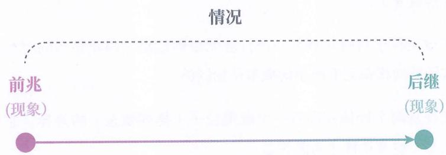

# 01｜「感觉懂了」为什么不能当目标

## 这一篇要解决的问题

你手上的记账法有一条硬规矩：反刍出来的顿悟记 0 分，直到它变成带动作的标签或者已回填的实验。于建国这本书从另一个方向指向同一件事，他给的说法是：学习低效的症结在于不知道学习要达成什么可验证的目标。这一篇把他的替代目标摊开，给这门课定骨架，并顺手记下他这套体系的地基押在哪里。

## 正文

### 他从一个看起来无关的问题开始

【原文】「现在，请你思考第一个问题：对生命而言，最不可或缺的一项能力是什么？」

他自己给的答案是预测。理由很朴素：有了预测能力，人就能避开敌不过的猛兽，不食有毒之物，提前种植食物；没有它，个体还来不及衰老就可能死于车祸、中暑或冻伤。翻页、让路、判断开水会不会烫伤，背后都是预测在跑。

接着他把预测的来源拆成两处。

第一处是经验预测：

> 【原文】经验预测：先记忆经验，当再遇到相同的前兆时，通过回忆对应的后继来进行预测的方式。（第 1 章概念提要）

这里的「情况」被他定义成一件事的前兆加后继：

「小明触摸开水壶被烫伤了」是一个情况：前兆是「小明触摸开水壶」，后继是「被烫伤了」。经验预测把这个情况存起来，下次遇到同样的前兆，调出后继。

### 经验预测在哪里失效

第二处来源的出场，靠的是第 1 章最重的一段论证。他先用物理学摆出三条事实：物质世界由大量微观粒子组成，一滴水里约有 1.67 × 10²¹ 个水分子；所有微观粒子每时每刻都在做无规则运动；任意两个物体只要有一个微观粒子的排列状态不同，它们就属于不同的状态。结论是：在未经大脑处理的世界里，遇到完全相同现象的概率几乎为零。

他借赫拉克利特收口：「人不能两次踏进同一条河流。」

世界处处都是未见现象，于是「记住上一次发生了什么」这条路走不通。他还补了一刀：大脑从未直接「看到」宏观现象。视网膜上的感光细胞把物体反光转成神经电信号，视觉皮层再去猜这些信号意味着什么；连看同一张脸，光照和角度一变，信号的组合也是新的。

【连接】这一步是全书的地基。地基立住之后，「把讲解读三遍、背下来」这类动作就没有落点，因为它处理的是已见情况，而你明天遇到的全是未见情况。要让预测在未见情况下还能用，大脑必须造出另一种东西。他给这个东西起的名字是模型，塑造过程叫渐构，而「感觉懂了」三个字落在这条链之外。

### 他押的是什么（显影第一格）

按项目的口径，外部的东西先点名，再谈用不用。这一格记在这里，完整台账在 `00-学习计划.md`。

他给的核心定义（引自各章末的「概念提要」）：

> 【原文】记忆：塑造重现已见情况的能力的行为。
>
> 【原文】学习：塑造泛化未见情况的能力的行为。
>
> 【原文】渐构：学习的别名——迭代建构可泛化模型的行为。
>
> 【原文】知识：普适性足够强的模型。

【显影】他赌的是：学习这件事的目标可以被精确定义，整个过程可以被量化。
两个预设撑着这个赌注——预测是生命最不可或缺的能力（「最不可或缺」是价值判断，用「没有它个体会死」来支撑）；

「处处未见」可以从微观态论证一路推到宏观决策。他借的学科铭牌来自机器学习（判别模型、泛化、压缩）、认知科学与神经科学（记忆编码、内隐与外显、组块化）、数学（集合、映射、空间、维度）和物理学（微观态）。他自己在内容简介里承认了类比对象：人类对自己的学习还停留在直觉层面，「就如同在物理学出现之前，人们仅凭直觉解释自然现象一样」，所以他把这本书定位成「学习的解剖学」。

【显影】断点先记两处，留到后面几篇检验。宏观规律明明可以重复，医学、工程、体育都靠重复规律吃饭，他要怎么处理这类反例；「最不可或缺」如果换成繁殖或群体协作，能不能推出另一套同样自洽的体系。

### 与你自己账本的关系

【连接】你的账和他的框架放在一起，会看到两把不同的尺子：

| 你的账本 | 他的框架 |
|---|---|
| 记动作性质：自己输出 = 充电 +1，复述 = 掉血 −1 | 记能力性质：能泛化到未见 = 学习，只能重现已见 = 记忆 |
| 「自嗨性」：顿悟的即时体感与能量净额的真实变化解耦 | 【原文】「可问题在于『感觉懂了』并不是一个明确的行为目标」 |
| 收益在行为环与回填环入账 | 收益在模型经未见情况验证后确认（第 31 章「验证环节」） |

两把尺子量的是两样东西，一把量能量净额，一把量能力方向。同一个动作在两把尺子下可能得出不同判断：把一段讲解背下来并原样复述，你的账记 −1；在他那里这个动作归入记忆，不进学习的账。这个差异值得留在手边，后面几章会反复回到同一个问题——这个动作到底在塑造哪种能力。

### 今天的可检查动作

【动作】两件小事，做完再往下走：

1. 序言里他自己出了一道自测题：第一次接触「函数：自变量的每个取值仅对应唯一一个因变量的取值」这句讲解，你会怎么学？用一句话写出你的做法。
2. 从最近一个月里挑一件「感觉懂了」的东西——这本书的某一章、你项目里的某个概念都行——写出：如果真懂了，你接下来哪一次判断或预测会不一样。

第 2 件是关键：它要你指出一个未见情境下的具体动作。复述刚才读到的定义不算。

## 小结

1. 他给的替代目标：学习 = 塑造泛化未见情况的能力（渐构），记忆 = 塑造重现已见情况的能力；「感觉懂了」落不进任何一边，所以无法验收。
2. 这个结论的地基是「处处未见」：物质世界里的现象几乎不重复，经验预测无处发力。
3. 这本书的重心在描述体系，他自己的定位是「学习的解剖学」。
4. 【显影】他押「学习目标可精确定义、可量化」，借了机器学习、认知科学、数学、物理学的铭牌；两处断点先记账。
5. 你的账本量能量，他的框架量能力；冲突处先记录，不急着下结论。

## 下一篇预告

02 走第 2 章「类化应对」：既然处处未见，大脑凭什么应对新情况——统一应对法、适用判别、抽象与类化、正负概念。他的「判别模型」在这一章第一次成形，也是第二部分全部工具的原型。

---

## 学习反馈

你可以写：

1. 哪里看懂了？
2. 哪里没看懂？
3. 哪个地方想展开？
4. 这个主题和你的真实问题有什么关系？

请写在这行下面：
