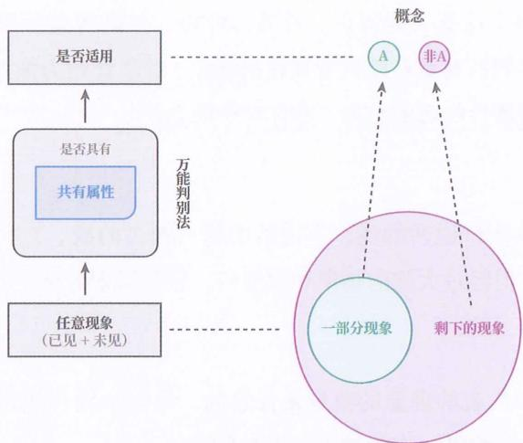

# 02｜大脑凭什么应对没见过的果子

> 本篇基于当前可见上下文生成：01 篇末尾的「学习反馈」还是空的，我按课程主线推进到第 2 章。你读完后可以把 01、02 两篇的感受一起写在下面。

## 这一篇要解决的问题

01 篇停在「处处未见」：经验预测处理不了明天的新情况。这一篇把第 2 章的链条补完——从一条统一应对法，到一个万能判别法，再到抽象、概念、判别模型。落到动作上：拿你账本里的「充电」做一次类化，看它够不够格当一个判别模型。

## 正文

### 一个只有黑白两色的异世界

第 2 章开头设了这样一个场景：

【原文】「想象你被传送到了一个仅有黑色、白色的二维异世界，你要通过拾果子积够 100 分来回到现实世界……你已经拾取了 4 个果子，它们分别为你 +3 分、+5 分、−2 分、+1 分……现在眼前有一个未见果子，为尽快回到现实世界，你该不该拾取它？」

【连接】这个果子世界是他整本书的演示台。四个已拾果子 = 四条经验；眼前那个没见过的果子 = 未见现象。这一章都在回答一件事：大脑拿什么做这个决定。

### 第一步：把四个经验压成一条应对法

【原文】「由于物质世界中会出现数不清的新情况，大脑不可能把每个前兆现象怎么应对都记住，所以只能从过去的经验中总结出一个通用应对法，简称『应对法』，来应对未见的前兆现象。」这种方式他叫「类化应对」，也叫「统一应对」。

【连接】这是 01 篇说的「另一种东西」的第一层。经验预测是四个果子存四条记录；统一应对法把四个果子压成一条规则。

### 第二步：这条应对法需要一个门卫

应对法出来之后，新问题跟着来：

【原文】「世间有无数个现象，大脑要怎么判断，总结出的这个应对法适用于哪些现象？」

他的答案是：类化应对的条件是先对所有现象进行类化，也就是造一个「万能判别法」，把所有现象划分成「能应对」和「不能应对」两类。

### 第三步：抽象——把差异剔掉，把共性提出来

【原文】「这种从一群不同的现象中，忽略差异属性并提取共有属性的行为就是抽象。」

书里的例子：+3、+5、+1 三个果子的外观各不相同，忽略它们在圆圈数量和大小上的差异，提取出「有若干圆圈图案的果子」，这一步就是抽象。

【连接】抽象要付代价，代价藏在「忽略」这两个字里。圆圈数量被丢掉了，那么以后出现一个「有圆圈图案但拾了扣分」的果子，这个模型就会判错。丢掉什么、留住什么，决定这个模型以后能判什么、不能判什么。第 20 章的「坍缩原因」专门处理判错这一类事。

### 第四步：概念一定会带出它的另一半

是否具备共有属性，把世间所有现象分成两堆：具备的归 A，剩下的归非 A。他把 A 叫正概念，非 A 叫负概念。

【原文】「构造一个概念又像创建文件夹。虽然你创建了一个文件夹，把部分文件放入其中，但没被放到文件夹的剩余文件其实也形成了一个『文件夹』。」

他顺带点了一句「真正的 X」这类句式：人们说「真正的爱情是……」，作用在于额外划出一个概念，和「大众通常所理解的爱情」相区别；真正的 X 是正概念，非真正的 X 是负概念。

【连接】这一节的标准可操作，他给的检验很硬：

【原文】「倘若没有学会其负概念，也就意味着没有真正学会这个概念。」

他的例子是「信息」：学完之后如果觉得任何现象都能判成信息，说明「非信息」没有形成，那信息这个概念其实没学会。

### 第五步：判别模型——控制概念的那只手

【原文】判别模型（正式名称是「概念判别模型」）专门用来判别任意现象属于正概念还是负概念，它的固定形态是一个条件分支：「如果某现象 x 满足共有属性，则将其归为 A；如果某现象 x 不满足共有属性，则将其归为非 A。」

【原文】「实际上，在学习任何概念时，都不是在记忆概念，而是在建构概念的判别模型，概念只是判别模型的分类结果。」

（上面这句照抄原书，「不是……而是……」是他自己的句式，我没有改成别的写法。）

【连接】概念在这里被降级成判别模型的输出，学习的对象从「概念」换成了「判别能力」。这个置换是第 2 章最重的一步，第二部分的全部材料工具都搭在它上面。

### 外延与内涵：同一件事的两个视角

【原文】「概念的外延」是被概念代表的那群现象的整体；「概念的内涵」是共有属性。他说这两个词内容相同，视角不同：共有属性站在一群现象的位置说，内涵站在概念的位置说。

【连接】外延包含「我们没见过但具备该共有属性的现象」，书里图 2-6 把这一点画了出来。这是全书里「泛化」第一次拿到正式位置：外延就是模型负责的范围。第 3 章讲模型的泛化能力，讲的正是这个东西。

### 具象层与抽象层：后面所有工具的骨架

【原文】划分前的所有现象在「具象层」（也叫现象层），划分后的所有概念在「抽象层」（也叫概念层）；物质世界是最底层的具象层；把 A 的外延和非 A 的外延合起来，等同于撤销划分，回到具象层。

【连接】记住这一对。第 5 章的「下上结构」、第 26 到 30 章的「下上材料／下料用法／上料用法／下上结合」，全挂在这两层上。现在把它当成一对坐标轴就够用。

### 显影第二格

【显影】这一章他押的是：概念可以被判别模型完整刻画，学习概念等于建构判别能力。他借的铭牌是集合论与逻辑学（外延、内涵）、认知心理学的范畴化研究、编程里的文件夹与条件分支。

【显影】他在章末自己交代了来源：「这些内容本就是人类认识世界的基础，几乎所有学科都会或多或少地呈现它们的影子」，他的工作是「综合了这些领域的内容，改进出了一个实用版本」，并且刻意避开了逻辑学的讲法。这一句要留在手边：他把自己定位成整合者，主张的是编排方式。

【显影】断点先记两处，留到后面检验：

- 二分预设。判别模型的骨架是正概念加负概念，一刀两块。现实里不少概念是渐变的，靠家族相似性撑着（比如「游戏」），既找不到一组统一的共有属性，也很难穷尽正负例。他在第 18 章会补上多类输出和概率输出，但「可判别」这个前提一直在。
- 概念的功能被限定成服务预测与应对。艺术、隐喻、审美这类不承担预测任务的概念，在这套框架里的位置偏窄。

### 今天的可检查动作

【动作】四步，写完贴到下面的反馈区：

1. 写出「充电」的内涵：必须满足哪些属性才算充电？用可检查的说法，比如「由我产生」加「在行为环里落成动作」。
2. 写出它的外延：过去 30 天里被你算成充电的具体事件，至少列 3 件。
3. 做负概念检验：举 2 件「看起来像充电但不满足内涵属性」的事。举不出来，说明「非充电」还空着。
4. 写一句话：这个判别模型能不能对你从没做过的一件新事做出判断？

## 小结

1. 应对未见情况要走两步：把经验压成统一应对法，再造一个万能判别法决定它什么时候适用。
2. 判别法的依据来自抽象；抽象的代价是丢掉差异属性，丢掉什么决定以后能判什么。
3. 构造一个概念必然同时构造它的负概念；负概念空着，正概念就装不稳。
4. 学习概念等于建构判别模型；外延是模型负责的范围，内涵是判别依据，具象层与抽象层是承载它们的两个层面。
5. 【显影】他押「概念可被判别模型完整刻画」，借集合论、逻辑学、认知心理学、编程的铭牌，自认位置是整合者；二分预设与概念功能窄化两处断点先记账。

## 下一篇预告

03 走第 3 章「模型预测」：判别只回答「这属于哪一类」，预测还要回答「接下来会怎样」。他会给模型、压缩能力、泛化能力下定义，并在这一章把知识、信息、记忆、学习四个词重新定义一遍——01 篇引的那四条定义，就是在那里落地的。

---

## 学习反馈

你可以写：

1. 哪里看懂了？
2. 哪里没看懂？
3. 哪个地方想展开？
4. 这个主题和你的真实问题有什么关系？

请写在这行下面：

<!-- WB_FEEDBACK id=lw_e663bc1a6ac09f4d4d9413d3 -->
第一个其实有点像巴甫洛夫的狗，是对一个东西的预测，对吧？但其实有很多东西是无法预测的。我猜，我现在看到正文，没有往下看，我猜它可能要讲强化学习了，机械的强化学习。但我可能对强化学习不是很懂，对吧？OK OK OK，原文链接，然后应对法，其实它是一个归类法。其实它是一个向内归因，第一步其实是向内归因的归因法。然后 OK，这应该就是要验证吧。然后抽象，把一些共性提炼出来。然后还有第四步，就是说概念一定会带出它另外一半。啥意思啊？其父概念也没有学出它真正的概念。是说分类吗？还是有点像反向思维，这哪个是哪个不是？然后辨别模型，其实有点难理解。还是说它的原文确实阅读难度有点高。概念的外延和概念的内涵。不是很懂，不是很懂，不是很懂。其实也看不是很懂，重来重来重来
<!-- /WB_FEEDBACK id=lw_e663bc1a6ac09f4d4d9413d3 -->
