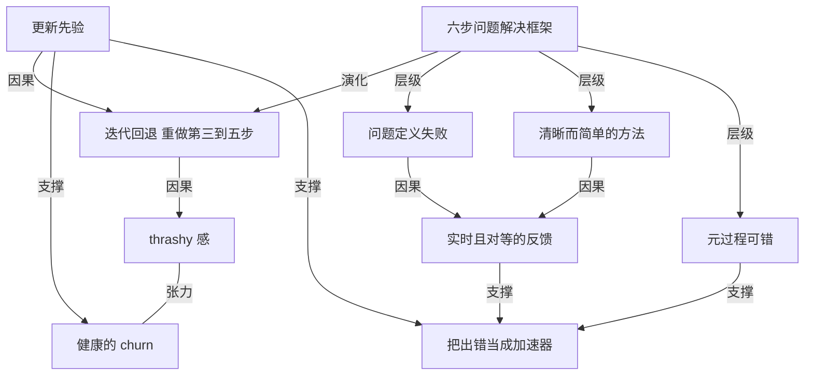

# 我常常是错的，而这正是我进步最快的方式

- 原文标题：I am often wrong
- 作者：borischerny.com
- 内参日期：2026-09-22
- 来源类型：blog
- 原文：https://borischerny.com/management,/product/2026/09/19/I-am-often-wrong.html
- 标签：个人成长, 理性思维

> 作者分享自己解决问题的六步框架(摸清信息-补齐信息-定义问题-定简单方案-定目标-紧迫行动)，强调随着新信息出现要不断回头重新定义问题和方案；最常见的失败在于"没把问题定义清楚"和"方案不够简单"，他把"经常出错"看作加速学习和逼近正确答案的机制。

## 导读

i’m often wrong

## 核心观点

- 这是作者先发给团队、再公开贴出的一则内部备忘：他把自己面对几乎所有问题的处理方式，压缩成一套固定顺序的六步流程。
- 六步之外还有第七件事，也是真正的重点——推进途中总会学到新信息，于是退回去把「定义问题、定义方法、定义目标」这三步重做一遍，再来一轮；复杂问题要来很多轮。
- 这种来回在旁人眼里是 thrashy（来回折腾），但只要知道折腾本身属于流程，这种 churn 就是健康的：「有了新数据，你就得更新你的先验。」
- 他观察到的失败几乎不在执行速度上，而集中在第 3 步和第 4 步：问题没有被清晰定义、方法不够清晰简单，结果是计划复杂、成功标准模糊。
- 模糊对制定计划的人自己最难看见，所以反馈必须来自别人、而且要实时；连这套元流程本身如果被证明是 meta-wrong，他也愿意改。
- 结论是一句反直觉的自白：「我爱出错，这是我最喜欢的事」——因为出错让他更清晰地定义问题、找到对的解法、学得更快。

## 六步框架：从信息到行动的固定顺序

- 作者说，和他共事的人很快会发现，他对几乎每个问题的路径都是同一套：
- 理解已有的信息
  - 收集缺失的信息
  - 定义问题
  - 定义一个清晰而简单的解决方法
  - 定义一个目标
  - 以紧迫感去达成这个目标
- 顺序本身就是信息量：先把已知与未知摊开，再定义问题，最后才谈方法、目标与执行速度。「紧迫感」被放在最末一步——前五步没做完，快没有意义。
- 这不是为大项目准备的仪式。作者说他「几乎对每个问题、每个产品」都用它，而且「大多数日子里要用很多次」。
- 框架能同时罩住问题和产品，是因为在他眼里两者同构：一个产品，就是为用户解决一个问题。

## 迭代：新数据一来就退回第 3–5 步

- 「在这个过程中，我常常会学到新信息。」这意味着回头重新定义第 3 到第 5 步（问题、方法、目标），然后重复整个循环。
- 复杂问题可能要试很多次才做对。这是流程的常态，不是流程失灵。
- 反复带来的体感是 thrashy——像在原地折腾。作者对此的判断有两个前提：你知道这属于过程的一部分；你知道真正解决问题的唯一办法，就是在出现新数据时做出调整。两个前提都在，churn 就是健康的。
- 立论句：「When there’s new data, you have to update your priors.」有了新数据，你必须更新先验。
- 值得注意的是这句话的位置——它不是鸡汤式的结尾，而是用来给「折腾」定性的判据：折腾如果对应着新数据，它就是迭代；如果不对应，它才是空转。

## 失败点集中在第 3 步和第 4 步

- 作者会在别人漏掉框架中某一步、或某一步执行得差时给出反馈，并且明确期待别人对他做同样的事——反馈是双向的。
- 他刻意让反馈发生在「实时」：目的是让那个人或那个团队学得更快。反馈的延迟本身就是学习速度的损耗。
- 他最常看到的失败模式有两个：
- (3) 没能把问题清晰地定义出来
  - (4) 没能定义出一个清晰而简单的方法
- 缺了其中任何一个，后果是确定的：计划变复杂，成功标准变得不清楚。
- 越是复杂的问题，这种缺乏清晰度越难被发现——「如果你就是做计划的那个人，很难看出这一点」。这正是必须向别人要反馈的理由：盲点的定义就是自己看不见。
- 注意这里的因果方向：他不是因为谦虚才要反馈，而是因为自查在结构上无效，才必须把检测外包给他人。

## 连元流程也挂在可证伪的位置上

- 全文最锋利的一句是对自己方法论的挂号：「如果这套元流程本身有一部分是元错误的（meta-wrong），我愿意改。」
- 这一句把六步框架从教条降级成一个可被推翻的对象：它同样要接受新数据，同样要更新先验。
- 一套要求别人「有新数据就改」的方法，如果自己不接受被改，就自相矛盾。作者用一句话补上了这个闭环。

## 「我爱出错」是效率主张，不是谦虚姿态

- 收尾的自白很直白：「我爱出错。这是我最喜欢的事。」
- 理由被列得非常功利：出错帮他更清晰地定义问题、找到正确的解法、学得更快、把问题解决掉。
- 也就是说，爱出错不是性格上的谦逊，而是从「新数据必须更新先验」推出来的必然结果——每一次被证明错，都是一次信息增量，是这套流程里最值钱的输入。
- 反过来看，一个从不出错的流程，要么在处理太简单的问题，要么根本没有在收集新数据。

## 概念网络

### 关键概念

#### 六步问题解决框架

**context**：作者对「几乎每个问题」的固定处理顺序——理解已有信息、收集缺失信息、定义问题、定义清晰而简单的方法、定义目标、以紧迫感达成目标。他说自己「大多数日子里要用很多次」，并且认为它同时适用于问题和产品，因为「一个产品就是为用户解决一个问题」。

**费曼一下**：不是一份项目管理流程图，而是一个人遇事时脑子里的默认排序。它的价值在于强制把「我要怎么做」推迟到「我到底在解决什么」之后。很多人一上来就跳到第 4 步想方案、跳到第 6 步拼速度，这套顺序把那两个动作按住了。

#### 迭代回退（重做第 3–5 步）

**context**：「在这个过程中，我常常会学到新信息。这意味着回到第 3–5 步重新定义，然后重复。」对复杂问题，这个循环可能要走很多轮才做对。

**费曼一下**：六步不是一条单行道，而是一个带回路的环。新信息不触发「继续执行」，而触发「重新定义」。关键是回退的落点很具体——只退到定义层（问题、方法、目标），不退到信息层从零开始，也不停在执行层硬撑。

#### thrashy 感

**context**：作者承认这种反复「can feel thrashy」——对身处其中的人和旁观者，都像是来回折腾、来回改。

**费曼一下**：迭代的主观体感是难受的，因为它看起来像反复推翻自己。这个词之所以重要，是因为它承认了成本：如果不预先说明这种难受是正常的，团队会把迭代读成领导者摇摆不定，进而抵触新数据。

#### 健康的 churn

**context**：作者的条件句——只要你知道这一切是过程的一部分，并且知道真正解决问题的唯一办法就是在出现新数据时做出调整，那么这种 churn 就是健康的。

**费曼一下**：给「折腾」划了一条界线：由新数据驱动的改动是健康的，否则就是空转。同样是改方案，判断标准不是改了几次，而是每次改动背后有没有一条新信息。

#### 更新先验（update your priors）

**context**：全文的立论句——「When there’s new data, you have to update your priors.」它是把迭代、反馈和「我爱出错」串起来的底层原理。

**费曼一下**：先验就是你在拿到新证据之前相信的东西。更新先验的意思是：你之前的判断只是当时信息条件下的最优解，信息变了，判断就该变，这不是自我否定，而是结算。拒绝更新先验的人，是在用旧信息守一个已经过期的结论。

#### 问题定义失败

**context**：作者见到的第一大失败模式，即框架第 3 步失守——没能把问题清晰地定义出来，直接后果是计划复杂、成功标准不清楚。

**费曼一下**：很多看起来是执行问题的困境，根子在没人说得清要解决什么。问题没定义清，方案就没有靶子，于是只能靠堆动作来显示在推进；成功标准也随之含糊，因为没人知道什么算做完。

#### 清晰而简单的方法

**context**：框架第 4 步，也是第二大失败模式的所在——没能定义出一个清晰而简单的方法，同样导致复杂计划和模糊成功标准。

**费曼一下**：「简单」在这里是硬指标不是审美偏好。方法一旦复杂，谁也说不准它是否真的对准了问题，也无法判断失败时是方法错了还是执行差了。简单的方法是可证伪的，复杂的方法往往连错在哪都查不出来。

#### 实时且对等的反馈

**context**：作者会在别人漏步或执行差时给出反馈，并「期待同样的反馈回到自己身上」；他强调「尽力做到实时」，目的是让人和团队学得更快。他还指出，做计划的人自己很难看出计划缺乏清晰度，所以来自他人的反馈更重要。

**费曼一下**：反馈在这套体系里不是人际关怀，而是检测装置。因为自查在结构上失效——模糊对制造模糊的人是隐形的，所以必须把检测外包出去；而且要趁热，延迟的反馈教不会人任何东西。对等是这套装置能长期运转的条件：只给不收，别人很快就不再给你数据。

#### 元过程可错（meta-wrong）

**context**：「如果这套元流程本身有一部分是元错误的，我愿意改。」作者把自己的方法论也放进了可被推翻的位置。

**费曼一下**：一套要求别人「有新数据就改结论」的方法，如果把自己排除在外，就自相矛盾。承认元过程可错，等于把框架本身也当成一个待检验的假设，而不是一条不容讨论的规矩。

#### 把出错当成加速器

**context**：结尾的自白——「我爱出错。这是我最喜欢的事」，理由是它帮他更清晰地定义问题、找到正确的解法、学得更快、把问题解决掉。

**费曼一下**：这不是谦虚，是算账。如果判断质量取决于信息质量，那么「我错了」就是密度最高的一条新信息：它同时告诉你原来的问题定义、方法或目标里至少有一处需要换掉。愿意爱它的人，迭代循环转得最快。

### 概念网络

这篇备忘的思想结构是一个单一原理向外生长出的三层：一条底层原理、一套操作框架、一种由此推出的态度。

底层原理只有一句：有了新数据就必须更新先验。它不是框架的一部分，而是框架成立的前提。六步问题解决框架是这条原理在个人工作方式上的落地形态，它规定了信息、定义、行动的先后顺序；而迭代回退则是原理在框架内部留下的回路——正因为新数据必须更新判断，六步才不能是单行道，必须能退回定义层重来。

原理与体感之间有一处真实的张力。迭代在主观上是难受的，作者用 thrashy 一词把这种难受挑明；健康的 churn 则是给这种难受的定性条件。两者不是同义反复：thrashy 描述的是感觉，健康的 churn 描述的是判据，中间隔着「这次改动背后有没有新数据」这道检验。承认前者、同时守住后者，是这段论证最细的地方——它既不否认迭代的代价，也不把所有反复都赦免成迭代。

框架向下展开出两个具体的失败点。问题定义失败和方法不够清晰简单，分别对应第 3、4 步，是六步中最容易塌、塌了又最难自查的两级。二者共享同一组后果（计划复杂、成功标准模糊），也共享同一个解药：实时且对等的反馈。反馈在网络中的位置是由结构推出来的，而不是由态度推出来的——既然模糊对制造它的人隐形，检测就必须外包，而且必须趁信息还热的时候进行。

元过程可错是这套结构给自己上的保险：框架要求别人接受新数据，自己也必须接受，否则整套论证在第一层就漏了。最后，把出错当成加速器不是另起的一层态度，而是前面三条线的交汇点——更新先验说明错误是最有价值的信息，迭代回退提供了消化它的通路，实时反馈是它的主要来源。三者合流，「我爱出错」就从谦辞变成了效率主张。

## 费曼 x3

大多数人把出错算成成本，于是流程设计的目标是少犯错；有一种人把出错算成收益，流程设计的目标是尽早犯错、尽快知道自己错在哪。两种人做的事表面一样，节奏完全不同。

一套被反复使用的六步法：理解已有的信息、收集缺失的信息、定义问题、定义一个清晰而简单的方法、定义目标、以紧迫感去达成。真正的重点不在这六步，而在第七件事——推进途中总会学到新信息，于是退回去把问题、方法、目标重新定义一遍，再来一轮，复杂的问题要来很多轮。旁人看着像来回折腾，当事人也会觉得 thrashy。但这里有一条很干净的判据：只要你知道这属于过程本身，也知道解决问题的唯一办法就是在出现新数据时调整，那么这种 churn 就是健康的。同样是反复改方案，判断好坏的不是改了几次，而是每一次改动背后有没有一条新信息。没有新数据的反复叫空转，有新数据的反复叫迭代。

失败点的位置比失败本身更值得看。直觉总把问题归给执行不力，而实际最常塌的是第三步和第四步——问题没定义清楚，方法不够清晰简单。后果是确定的：计划变复杂，成功标准变模糊。更麻烦的是，这种模糊对制定计划的人几乎是隐形的，你越是那个想清楚了才动笔的人，越看不见自己哪里没想清楚。自查在结构上就是失效的，所以反馈必须来自别人，而且必须实时——延迟的反馈教不会任何人东西。作者还补了一句：他期待别人对他做同样的事。只给不收的反馈，别人很快就不再给你数据了。

最锋利的一句是给自己方法论挂的号：如果这套元流程本身有一部分是元错误的，我也愿意改。一套要求别人「有新数据就更新」的方法，如果把自己排除在外，第一层就漏了。

于是「我爱出错，这是我最喜欢的事」听起来像谦辞，其实是算账的结论。如果判断质量取决于信息质量，那么「我错了」就是密度最高的一条新信息：它一次性告诉你，原来的问题定义、方法或目标里至少有一处该换掉。有了新数据，你就得更新你的先验——这句话往前推是迭代，往后推就是爱出错。反过来说，一个从不出错的流程，要么在处理太简单的问题，要么根本没在收集新数据。

## 阅读原文

[I shared this note with my team earlier this week, and am posting it here as well. I hope it is interesting or helpful for others working on building product in the age of AI.]

Something that people learn quickly when they work with me is that my approach to pretty much every problem is:

- Understand the available information
- Gather missing information
- Define the problem
- Define a clear and simple approach to solve the problem
- Define a goal
- Act with urgency to achieve the goal
Along the way, I will often learn new information. That means going back and redefining #3-5, and repeating. This process is iterative and for complicated problems, it can take many tries to get right. This can feel thrashy, but if you are aware that it’s all part of the process, and that the only way to really solve a problem is to adjust when there is new data, then the churn is healthy. When there’s new data, you have to update your priors.

I apply something like these six steps for pretty much every problem, and pretty much every product (a product solves a problem for users). I apply this rough framework many times on most days.

Sometimes I will give feedback to people when they are missing steps in the framework, or are poorly executing some of the steps. I expect the same feedback in return. I try hard to give the feedback in real time, so the person/team can learn more quickly. Most often, the failure mode I see is (3) failure to clearly define the problem, and (4) failure to define an approach that is clear and simple. When one of these is missing, it leads to complex plans and unclear success criteria. For complicated problems, lack of clarity can be hard to spot if you’re the one making the plan, making it even more important to get feedback from people.

If part of this meta-process is meta-wrong, I am open to changing it.

All this to say, I love being wrong. It is my favorite, because it helps me more clearly define the problem, find the right solution, learn more quickly, and solve the problem.
