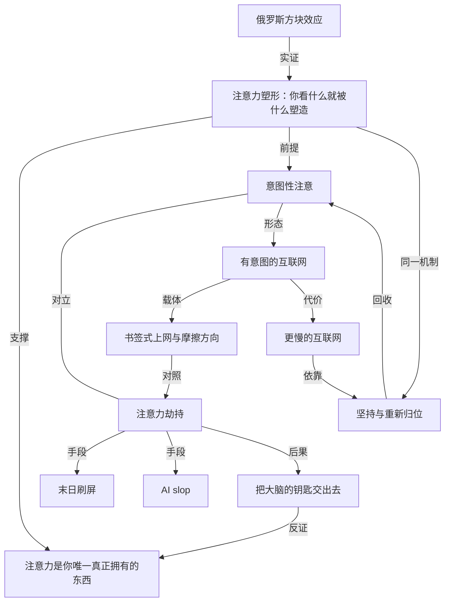

# 注意力，是你唯一真正拥有的东西

- 原文标题：Attention is all you have
- 作者：alicegg.tech
- 内参日期：2026-09-22
- 来源类型：blog
- 原文：https://alicegg.tech/2026/09/21/attention
- 标签：成瘾, 认知科学

> 从"俄罗斯方块效应"说起——持续的注意力会塑造感知，而现代数字平台正越来越多地用算法替你决定该注意什么，作者主张重新夺回对注意力的主动权。

## 导读

注意力

## 核心观点

- 标题是对 Transformer 论文名句的戏仿：Attention is all you have——注意力是你**唯一真正拥有**的东西，不是模型的机制，而是你的全部本钱。
- 一条心理学老实验（俄罗斯方块效应）给出全文的第一性原理：**你长时间聚焦什么，它最终就会塑造你的思维**。这既是学习新技能、产生新想法的机制，也是被劫持时最危险的地方。
- 今天的问题不在于注意力被"消耗"，而在于注意力**不再由自己指定方向**——「越来越少的注意力是被有意图地投放的；我们不再挑选自己想看什么，而是让别人来决定什么对我们好」。
- 作者给出的判断句极重：当你让别人决定屏幕上出现什么，「这等同于把你大脑的钥匙交给了他」。
- 出路不是逃离互联网，而是回到"有意图的互联网"——它并没有消失，只是被埋在企业化的网络之下；真正变了的**不是网，是你**。

## 俄罗斯方块效应：注意力如何反过来重写大脑

- 俄罗斯方块效应是心理学里**最容易复现的实验之一**：每天玩一会儿这款同名游戏，持续几周即可。
- 复现出的现象非常具体：你会开始在云朵、建筑物和日常物件里认出熟悉的方块形状；甚至在快要入睡时，它们会浮现在眼前。
- 这个实验不需要任何理论包装就能说明一件事：注意力的投放是**有后效的**——你看什么，久了你就用什么的形状去看世界。
- 作者从中提炼的唯一一课：**whatever you focus on long enough will end up shaping your thoughts**（凡是你聚焦得足够久的东西，最终都会塑造你的思想）。
- 这一课是中性的，方向取决于谁在选择：自己选，它是学习与发现的机制；别人选，它就是改写你的通道。

## 注意力劫持：四个日常场景里的同一个套路

- 作者不写抽象批判，而是用四个"你想要 X，平台给你 Y"的日常场景，把劫持的形状摆出来。
- **视频**：你想看视频。平台知道你喜欢烹饪和绘画直播，但它同时塞给你股市泡沫、全球变暖、伊朗战争的片段——因为末日刷屏（doomscrolling）会让你停留更久、多点几条广告。
- **音乐**：你想听音乐。打开歌单交给算法就好，代价是真歌之间被插入 AI slop（AI 生成的劣质填充内容），以此避免向真人艺术家支付版税。
- **职业信息**：你想知道同事近况。平台会把真正相关的职业动态**埋在**陌生人的观点之下——而这些陌生人恰好在吹捧其母公司当下投资的东西，作者讽刺道"这肯定只是巧合"。
- **他人评价**：你想听陌生人对某个产品的真实意见。你想问的那些论坛用户，现在很可能只是一群大语言模型在和一群俄罗斯水军对话——"但愿你当初没太看重他们的意见"。
- 四个场景的共同结构：**你带着一个明确意图进来，平台用一个更长的停留时间把它替换掉**。
- 结论落在个人层面，而非平台层面：如果你像大多数人一样，一天的大部分时间都盯着设备，那它**不可能不影响你**。

## "有意图的互联网"：它曾经是默认形态

- 互联网并非天生如此。在推荐算法成为标配之前，**你必须自己决定在电脑上要做什么**。
- 那时不存在"打开一个大 app 然后命令它娱乐我"这种交互。取而代之的是**几十个书签**，每个书签背后都有一个具体的意图：一个看游戏新闻的站、一个教程特别多的站、一个更新永远不够勤的动漫博客、一个关于九十年代某部剧的维基。
- 作者不做怀旧美化：糟糕的东西当年也存在，比如 Encyclopedia Dramatica 和 `Rotten.com`。
- 但关键差别在于**摩擦的方向**：想去那些地方，你得自己费力气去；**没有人会在一份煎饼食谱或一段猫咪视频之后，把尸体照片和极右翼宣传当作"推荐"推到你面前**。
- 换句话说，旧网络的默认值是"你不选就什么都不发生"；新网络的默认值是"你不选就由它替你选"。

## 它还在：变了的不是网，是你

- 好消息是，这个有意图的互联网**依然存在**，只是被埋在企业化的网络之下，而且并不难找——"毕竟你正在读这个博客，你大概已经知道它在哪儿了"。
- 作者把落点从技术彻底转向个人：**"这个时代和那个时代之间的主要差别，是你。"**
- 回去是有成本的：当你想回到读博客、读 RSS、把那份教程读完，而不是继续刷短视频，你必须**重新适应一个更慢的互联网**——内容不是无限的，也不会每点一次就刷新一批。
- 这正是被劫持后最难恢复的能力：忍受"没有新东西"的那几秒。
- 方法论极简，和所有习惯一样：**keep at it**（坚持下去）。作者的收尾是一句带有俄罗斯方块回声的话——如果你在这件事上投入足够的注意力，大脑里**某个东西会咔哒一声归位**（something will click in your brain）。
- 首尾呼应因此完成闭环：俄罗斯方块效应会把方块印进你的知觉，同一个机制也能把"有意图"重新印回去——**被劫持和被重塑，用的是同一条神经通路**。

## 概念网络

### 关键概念

#### 俄罗斯方块效应（Tetris effect）

**context**：全文的实验起点，作者称其为"心理学中最容易复现的实验之一"：连续几周每天玩一会儿俄罗斯方块，之后会在云朵、建筑和日常物件中认出方块形状，入睡前甚至会看到它们浮现。

**费曼一下**：你的大脑会把"最近练得最多的那套模式"当成看世界的默认滤镜。玩久了方块，你就用方块的眼睛看云。它不是游戏的副作用，是注意力的一般规律被一个极端例子照亮了。

#### 注意力塑形（focus shapes thought）

**context**：作者从俄罗斯方块效应中提炼的唯一一课——"凡是你聚焦得足够久的东西，最终都会塑造你的思想"。这一课在文中是中性的：它既是学会新技能、发现新想法的机制，也是被劫持时的受力点。

**费曼一下**：注意力不是一个被花掉就没了的钱包，而是一把刻刀——它一边被你用，一边在你自己身上刻出形状。所以问题从来不是"你花了多少时间"，而是"这段时间在你身上刻下了什么"。

#### 意图性注意（intentional attention）

**context**：作者诊断现状时的核心对照：越来越少的注意力是被有意图地投放的；我们不再挑选自己想看什么，而是让别人决定什么对我们好。

**费曼一下**：意图性注意就是"我带着一个想知道的问题来"，而不是"我来看看有什么"。前者结束时你手里有答案，后者结束时你手里只有时间账单。

#### 注意力劫持（attention hijacking）

**context**：全文第一个小节的标题，指平台用推荐机制把用户的原始意图替换成更长停留时间的过程——你想看烹饪和绘画，它顺手给你股市泡沫、全球变暖和战争片段。

**费曼一下**：劫持的精髓不是拦住你，而是**顺着你**。它不阻止你去想去的地方，只是在路上多摆几个更亮的岔口，直到你忘了原本要去哪儿。

#### 末日刷屏（doomscrolling）

**context**：作者点名的劫持收益机制：推荐坏消息能让你停留更久、多点几条广告——它是平台把负面情绪货币化的具体路径。

**费曼一下**：坏消息比好消息更黏人，因为大脑把"可能有危险"排在"可能有乐趣"前面。平台发现了这个漏洞，于是把警报当糖果卖。

#### AI slop

**context**：音乐场景中的具体形态：流媒体在真人歌曲之间插入 AI 生成的劣质内容，以规避向真实艺术家支付版税。

**费曼一下**：当分发渠道同时也是内容方，"内容"就会退化成填满时段的最低成本物料。你以为在听音乐，其实一部分时段只是在听"不用付钱的声音"。

#### 把大脑的钥匙交出去

**context**：全文最重的判断句——如果你一天的大部分时间都盯着设备，它必然影响你；而当你让别人决定屏幕上出现什么，"这等同于把你大脑的钥匙交给了他"。

**费曼一下**：屏幕上出现什么，等于未来几周你会想什么。所以"谁排的序"这个问题，其实是"谁在替你决定你将成为什么样的人"。

#### 有意图的互联网（intentional internet）

**context**：作者提出的对照形态，也是出路：算法推荐之前，你必须自己决定在电脑上做什么；上网的单位是几十个各有目的的书签，而不是一个负责娱乐你的大 app。

**费曼一下**：那是一张需要你自己开车的网。没人载你，所以你必须知道要去哪儿——而"必须知道去哪儿"本身，就是它最值钱的地方。

#### 书签式上网与摩擦的方向

**context**：作者不美化旧网络，承认当年也有 Encyclopedia Dramatica 和 `Rotten.com` 这类糟糕去处；但关键差别是你得**主动费力**才去得了，没有人会在煎饼食谱或猫咪视频之后把极端内容当推荐推给你。

**费曼一下**：旧网络里，糟糕的东西需要你努力才能抵达；新网络里，糟糕的东西需要你努力才能躲开。同样的内容，摩擦力换了个方向，结果完全不同。

#### 更慢的互联网（slower internet）

**context**：回归有意图上网的真实成本：读博客、读 RSS、读完一份教程，意味着适应一个内容不是无限、也不会每点一次就更新的网络。

**费曼一下**：无限流的对立面不是"内容少"，而是"会读完"。一个能读完的东西才可能被想清楚——慢不是代价，慢是条件。

#### 坚持与重新归位（keep at it / something will click）

**context**：文末的方法论，与开篇的俄罗斯方块效应首尾呼应：像所有习惯一样，唯一要做的就是坚持；如果你在这件事上投入足够的注意力，大脑里某个东西会"咔哒一声"归位。

**费曼一下**：把注意力收回来，用的是被夺走它时同一条通路——重复、暴露、成形。既然方块能被印进你的知觉，"自己选"也能被重新印回去，只是这次刻刀握在你手里。

### 概念网络

这张网络有一个不常见的结构：**同一条机制既是病因也是解药**。

- **底座是一条中性规律**。俄罗斯方块效应实证了"注意力塑形"：长期聚焦什么，就被什么塑造。它本身不带价值判断，方向完全取决于选择权在谁手上——这决定了全文的分叉点不是"用不用网"，而是"谁在排序"。
- **两条分叉由"意图性注意"与"注意力劫持"构成对立**。同一台机器，自己驾驶叫学习，别人代驾叫劫持。末日刷屏与 AI slop 不是两种独立问题，而是劫持在情绪与内容供给两侧的**具体手段**：前者延长停留，后者降低成本。
- **"把大脑的钥匙交出去"是劫持链条的终点，也是核心主张的反证**。作者不是论证"注意力很宝贵"，而是展示"当它不归你时会发生什么"——反过来确立了注意力是你唯一真正拥有的东西。
- **"有意图的互联网"不是新技术，而是意图性注意的历史形态**。它的载体是书签式上网，其真正机制不在界面，而在**摩擦的方向**：旧网络里坏东西要费力才到得了，新网络里坏东西要费力才躲得开。这一条是对劫持最精确的对照。
- **网络的闭环出现在末尾**。回到有意图的网，代价是接受更慢的互联网；而支撑慢的唯一办法是坚持。坚持之所以有效，恰恰因为它调用的是开篇那条同样的塑形机制——被算法印进去的东西，可以用同样的方式重新印回来。于是"重新归位"回收了"意图性注意"，网络合拢。
- **一处张力值得留意**：文章把责任几乎全部收束到个人（"主要差别是你"），而劫持的手段（推荐排序、版税规避、水军与模型灌水）都在个人控制之外。这让方案在个体层面成立，在系统层面留白——作者显然是有意为之，因为他要给的不是政策，是一个今天就能开始的动作。

## 费曼 x3

有一个实验，任何人都能在两周内亲手复现：每天玩一会儿俄罗斯方块。很快你会在云朵和建筑里认出那些方块，闭眼将睡时它们还会自己浮上来。这个现象之所以重要，不是因为它有趣，而是因为它把一件平时看不见的事变得肉眼可见——你长时间盯着什么，它就会反过来长进你的知觉里。注意力不是一个用完就空的钱包，它是一把双向的刻刀：你一边用它切割世界，它一边在你身上留下形状。

明白了这一点，"刷手机浪费时间"这种说法就显得太温和了。真正的账不记在时间上，记在你变成了谁上面。你想看烹饪和绘画，推荐系统顺手塞给你股市泡沫、全球变暖和一场战争的碎片，因为坏消息能让你多留几分钟、多看几条广告。你想听音乐，真歌之间被填进不用付版税的合成声音。你想知道同事的近况，得先穿过一堆陌生人的高见，而那些高见恰好在吹捧平台母公司的投资标的。你想听听真人对一件产品的评价，而那些"真人"现在可能是一群模型在和一群水军说话。每一次，你带着一个具体的意图进门，出门时意图不见了，只剩下停留时长。当你让别人决定屏幕上出现什么，等于把你大脑的钥匙交了出去——而且交得毫无痛感。

对照之下，旧的互联网并不更干净，它只是摩擦的方向相反。那时也有极糟糕的角落，但你得自己费力气找过去；没有任何系统会在一份煎饼食谱之后，把尸体照片当作"你可能也喜欢"推到你眼前。糟糕的东西需要努力才能抵达，而不是需要努力才能躲开——这就是全部的差别。那时上网的单位是几十个书签，每一个背后都有一个具体的问题：一个看游戏新闻的地方，一个教程特别多的地方，一个更新永远不够勤的博客。没人负责娱乐你，所以你必须知道自己要去哪儿。而"必须知道去哪儿"，恰恰是这张网最值钱的部分。

更值得注意的是，那张网从来没有消失，它只是被埋在了企业化的网络底下，而且一点都不难找。真正变了的不是网，是你。所以回去是有成本的：你得重新适应一个更慢的互联网，一个内容不是无限、也不会每点一次就刷新一批的地方。刷不出新东西的那几秒钟不好受，但正是它让"读完"重新成为可能，而只有读得完的东西才有机会被想清楚。

最妙的是结尾那个回声：坚持下去，如果你在这件事上投入足够的注意力，大脑里某个东西会咔哒一声归位。夺走你注意力的机制和收回它的机制，本来就是同一条——重复、暴露、成形。既然方块能被印进你的知觉，"自己选"当然也能被重新印回去。区别只在于，这一次刻刀握在谁手里。

## 阅读原文

The Tetris effect is one of psychology’s most easy to reproduce experiments. Simply spend a bit of time playing the eponymous game every day for a few weeks. After a little while, you’ll start recognizing familiar Tetromino shapes in clouds, buildings, and everyday objects. You might even see them appear before your eyes when you start falling asleep.

There’s one lesson the Tetris effect teaches us: whatever you focus on long enough will end up shaping your thoughts. This can be a good thing since it’s how we learn new skills and discover new ideas. Sadly, less and less of our attention is focused intentionally. Instead of picking what we want to see we let other people decide what is supposed to be good for us.

Do you want to watch a video? YouTube knows you like cooking and art streams. But why not also recommend a few clips about the stock market bubble, global warming, and the war in Iran. Doomscrolling will make you stay longer and click on a few more ads.

Do you want to listen to music? Just open a Spotify playlist and let the algorithm figure out what you like. Please ignore the AI slop they will insert in between real songs to avoid paying royalties to real artists.

Do you want to know how your colleagues are doing? Too bad, LinkedIn will bury any relevant career news between the opinion of complete strangers. It is surely just a coincidence that those strangers happen to be shilling whatever Microsoft is invested in at the moment.

Do you want the opinion of strangers on a product? Well those Redditors you wanted to ask are probably just a bunch of LLMs talking to a bunch of Russian trolls now. I hope you didn’t value their opinion too much.

If, like me and most people, you spend the major part of your day focused on your device, there’s no doubt it’s affecting you. And when you let someone else dictate what appears on your screen, it’s the same as giving them the key to your brain.

Photo by [New York Said](https://unsplash.com/@newyorksaid?utm%5C_source=unsplash&utm%5C_medium=referral&utm%5C_content=creditCopyText)

The internet wasn’t always like that. Before recommendation algorithms where a thing, you had to decide what you would be doing on the computer.

You didn’t really have one big app that you could open and order it to entertain you. Instead, you had a few dozen of bookmarks to websites, each with a specific idea in mind. A site for video game news, that one website with lots of tutorials, a blog about anime that didn’t update often enough, a wiki about a TV show from the 90s…

Of course awful things existed on the web. We had Encyclopedia Dramatica and [Rotten.com](http://rotten.com/), but you actually had to put the effort to go there if you wanted. Nobody was going to put pictures of dead kids and far-right propaganda as a suggestion after a pancake recipe or a cat video.

The good thing is that this intentional internet is still around. It has just been a bit buried below the corporate web, but it’s not very hard to find. After all you’re on this blog, so you probably already have a good idea about it.

The main difference between this time and now is you. When you want to get back to reading blogs, RSS feeds, and finish that tutorial instead of doomscrolling shorts, you have to get used to a slower internet. One where content is not infinite and doesn’t get updated every click.

But like every habit, the only thing you have to do is to keep at it. And if you pay enough attention to it, something will click in your brain.
