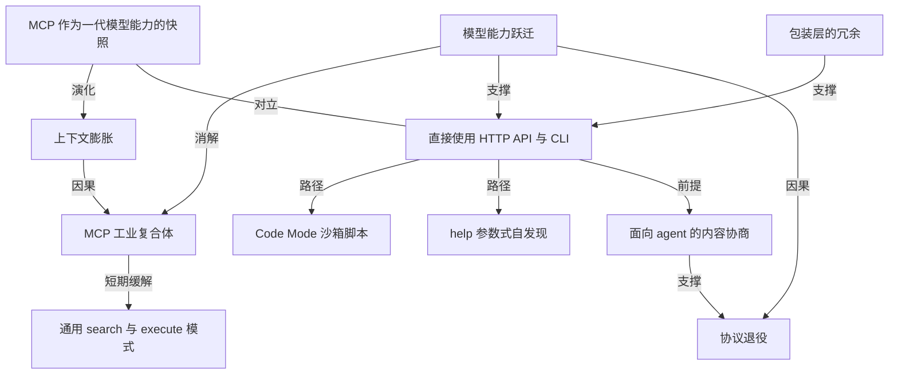

# MCP 协议是不是从一开始就选错了方向？

- 原文标题：MCP was always a bad idea?
- 作者：maharship.com
- 内参日期：2026-09-22
- 来源类型：blog
- 原文：https://maharship.com/blog/why-mcp-was-always-a-bad-idea/
- 标签：MCP

> 作者认为 MCP 是为"模型还不够聪明"的旧时代设计的协议，如今模型已经能自己写脚本、直接调用陌生 API、编排多个服务，围绕 MCP 上下文膨胀问题打的补丁(搜索/执行模式、凭证托管平台)可能只是权宜之计，而不是长期答案。

## 导读

对 MCP 的另一种观点

## 核心观点

- 作者的判断直白到近乎挑衅：MCP 是「一个糟糕的协议，为 LLM 还不那么聪明的年代而造，而我们已经长出了它的尺码」（a horrible protocol built for a time when LLMs weren't that smart, and we've outgrown it）。
- 这不是对某个实现细节的不满，而是对协议存在前提的否定：MCP 之所以被发明，是因为当年的模型不会自己写脚本、不会读文档、不会摸索一个陌生 API。这个前提在 2026 年已经失效。
- 作者去参加了一场以 MCP 最新进展为主题的全天活动，讲者个个优秀、热情，但他得出的结论是：整个生态在为一个正在消失的问题做越来越精致的工程。
- 处方极其简短：删掉大多数 MCP server，让有终端权限的 agent 直接用已经存在的 HTTP API 和 CLI；把标准化的力气花在「agent 怎么用 HTTP」上，而不是继续往 MCP 这个兔子洞里钻。

## MCP 的来历：一个为「当时的模型」而生的协议

- MCP 由 Anthropic 团队于 2024 年 11 月发布，定位是帮助 agent 连接外部服务和数据源。
- 关键的时代背景是模型能力：当时的模型相对原始，Claude Code 还不存在，通用的 agentic workflow 远没有今天可靠。
- 用户很快发现让模型接入外部服务的价值——那是此前没见过的生产力级别。MCP 采用量随之爆发，与 LLM 在整个经济体中的扩散互相叠加。
- 2025 年，MCP 在 Anthropic 手里演进一段时间后，被捐给 Linux Foundation 下属的 Agentic AI Foundation。
- ※ 这条时间线本身就是作者论证的骨架：协议诞生于模型能力的某个快照，而快照会过期。

## MCP 工业复合体：围着一个副作用建起来的产业

- 采用量一上来，用户往自己的配置里塞进越来越多的 MCP server，随即撞上**上下文膨胀**（context bloat）：每个 server 带多个工具，每个工具带自己的 schema，一起把模型的上下文压满。
- harness 开发者发明了许多绕行技巧，其中最典型的是通用的 search/execute 模式——Composio、MintMCP、Pipedream 这类平台现在都提供它。
- 这些平台实际解决的是两件事：把各种外部服务的凭证集中到一个地方；只给 agent 一组最小工具集以压住上下文膨胀。
- 作者对此的态度有保留地肯定：这是好事，**但只在短期内**（for the short term）。
- 代价是，围绕 MCP 长出了一整套系统：监控 MCP server、保证响应质量、保证 agent 能顺利拿到工具、把 schema 弄明白、琢磨到底要喂给 agent 什么，它才能在对的时刻做出对的调用。
- 所有这些工程里，被忽略（或者说被假装看不见）的变量只有一个：模型在变好。

## 大厂是对的：模型自己长出了 MCP 想提供的能力

- 模型现在能在计算机上执行代码、对大型代码库做推理、以前所未有的自主度行动。
- 这些能力的主要训练场是编码：写脚本、跑脚本。而它的「副作用」——作者在这里加了一个反问「真的是副作用吗？」（though is it?）——是模型现在很擅长直接调用 API。
- 具体表现：能写脚本、能把多个不同服务组合起来、能调用自己从没见过的 API，整条工作流只需要用户极少的介入。
- Cloudflare 因此推出了 Code Mode：让 LLM 把多次调用组合成脚本，放进沙箱里执行，被称为「更好的使用 MCP 的方式」。
- 但作者认为还有更釜底抽薪的一步：LLM 已经学会用 `--help` 去发现 CLI 的用法，于是访问那些有文档的 API 或 CLI 的服务时，它根本不再需要 MCP server。
- 这一击直指 MCP 的价值根基：大多数远程服务的 MCP server，归根到底只是在包装一层早就存在的 API。

## 那现在怎么办：删掉它，然后把标准化的力气挪个方向

- 第一步简单到只有一句话：删掉大多数 MCP server。拥有终端访问权的 agent 可以替代其中绝大部分，而且往往更有能力。
- 遗留问题不是没有：CLI 返回的机器可读格式（JSON / XML 之类）往往非常冗长，token 消耗很重——但作者认为这些有办法解决。
- 替代方案的零件其实早就躺在那里：有文档的 HTTP API、标准的内容协商（content negotiation）、成熟的认证机制。
- 真正该做的标准化，是规范 agent 如何直接使用 HTTP API。比如：agent 客户端在请求头里表明自己是 agent，服务端就自动把响应以 Markdown 或纯文本返回，而不是 HTML 或冗长 JSON。

### 两个已经在发生的真实例子

- **Accept 头协商 Markdown**：越来越多对 LLM 友好的服务器（尤其是文档站这类文本密集站点）支持 `Accept: text/markdown`，会直接返回渲染好的 Markdown 而不是通常的 HTML 响应。这个媒体类型本身是标准化的，把它用于面向 agent 的内容协商正在被广泛接受。
- **用 Accept-Language 头传编程语言**：Vercel 工程师 Malte Ubl 呼吁 harness 在请求里带上客户端偏好的编程语言，文档站就能给出更具体的示例——比如带上 Python，就优先返回 Python SDK 的文档而不是泛泛的通用版本。Shopify 的 Tobi Lutke 很喜欢这个想法，现在它已经在 Shopify 的文档站上线。
- ※ 这两个例子的共同点：没有发明新协议，只是把 HTTP 里已有的协商机制用在了 agent 身上。

## 结论：MCP 属于一个已经过去的时代

- 作者把论证收束到互联网自身的历史上：围绕通用协议做标准化，才把互联网养成了今天的样子。
- 而 MCP 在他眼里已经是「一个属于逝去年代的协议」（a protocol of a bygone era）。
- 理由仍然是能力假设的翻转：agent 是聪明的，会写脚本，能精确说出自己想要什么——它不再需要一个中间层替它把世界整理成工具列表。
- 因此他给出的是一个明确的动词：与其继续在 MCP 的兔子洞里往下钻，不如给它 end-of-life，在 HTTP API 和 CLI 已经提供了足够接口的地方，直接依赖它们。

## 概念网络

### 关键概念

#### MCP（Model Context Protocol）

**context**：2024 年 11 月由 Anthropic 发布的协议，用于帮助 agent 连接外部服务和数据源，2025 年捐给 Linux Foundation 下的 Agentic AI Foundation。在本文中它不是被当作技术规范讨论，而是被当作「某一代模型能力的快照」来审视——作者称它是「为 LLM 还不那么聪明的年代而造」的协议。

**费曼一下**：想象你请了一个刚入职、什么都不熟的助理。你不敢让他自己翻公司系统，于是做了一本图文并茂的操作手册，把每件事拆成按钮：点这个查订单，点那个发邮件。MCP 就是这本手册的协议版本。手册本身没写错，问题是这位助理两年后已经能自己读文档、自己写脚本了。

#### 上下文膨胀（context bloat）

**context**：MCP 采用爆发后最先暴露的结构性问题。用户在配置里挂上多个 MCP server，每个 server 带多个工具、每个工具带自己的 schema，这些描述一起塞进模型上下文，把本该用来思考的空间占满。

**费曼一下**：好比出门前把整个工具箱背在身上。锤子、扳手、电钻、螺丝刀全带齐了，听起来很周全，可你走两步就累了，真要拧螺丝时反而在包里翻半天。工具的「目录」本身也是有重量的。

#### MCP 工业复合体（MCP Industrial Complex）

**context**：作者用来命名围绕 MCP 长出的整套配套产业：监控 MCP server、保证响应质量、保证 agent 能顺利访问工具、厘清 schema、研究该给 agent 喂什么才能让它在对的时刻做出对的调用。这个词自带批判意味——一个生态一旦形成，就会有维持自身存在的动力。

**费曼一下**：先有了一条设计得不太合理的路，然后为了让车能在这条路上跑，生出了修路队、测速站、导航修正服务和一批专门讲这条路的会议。所有环节都在认真解决问题，只是没人回头问一句：这条路现在还需要吗？

#### 通用 search/execute 模式

**context**：harness 开发者应对上下文膨胀的主流解法，Composio、MintMCP、Pipedream 这类平台都提供。它把凭证集中托管，只给 agent 一组最小工具集（通常就是「搜索」和「执行」两个动作），再由平台去对接背后的众多外部服务。作者的评价是有明确时限的肯定：这是好事，但只在短期内。

**费曼一下**：不再把一百个遥控器摆在茶几上，而是给一个万能遥控器加一个「搜索设备」按钮。桌面确实清爽了，但你还是活在遥控器的世界里——而屋里的电器其实早就都能语音直连了。

#### 模型能力跃迁与协议前提的失效

**context**：本文论证的枢纽。MCP 建立在一个具体假设上——模型不够自主，需要被喂结构化工具。而如今模型能执行代码、推理大型代码库、写脚本组合多个服务、调用从未见过的 API，且只需极少的人工干预。前提没了，建在前提上的东西自然松动。

**费曼一下**：拐杖是为走不稳的时候准备的。腿好了以后还拄着，就不只是多余，而是碍事——它会让你忘了自己本来可以跑。

#### Code Mode（沙箱脚本化调用）

**context**：Cloudflare 推出的方案，让 LLM 把多次调用组合成脚本、放进沙箱执行，被描述为「更好的使用 MCP 的方式」。在本文的论证里它是一个过渡形态：它承认了模型更适合写代码而非逐个点工具，但仍停留在 MCP 的框架内。

**费曼一下**：与其让助理一条条按你给的按钮，不如让他自己写一张操作清单，在一间安全的小屋里一次跑完。效率高了一大截，但屋里的按钮还在——真正的下一步是让他直接去用原本的系统。

#### --help 式自发现

**context**：作者认为比 Code Mode 更釜底抽薪的一步：LLM 已经学会用 `--help` 去摸清一个 CLI 怎么用，于是访问有文档的 API 或 CLI 服务时不再需要 MCP server 做中介。它直接抽掉了「必须先有人写好工具描述」这个前提。

**费曼一下**：新来的同事不再等你做培训 PPT，而是自己敲一行命令问「你都能干什么」，然后就上手了。会自我介绍的系统，不需要别人替它写说明书。

#### 包装层（wrapper）的冗余

**context**：作者对 MCP 价值根基的判断——大多数远程服务的 MCP server，本质上只是包装了早已存在的 API。这句话解释了为什么删掉它们代价不大：被包装的东西一直在那里，包装纸不是原料。

**费曼一下**：礼品店把商店里现成的东西装进漂亮盒子再卖一遍。盒子在助理不识货的时候有用；等他能自己进货，盒子就只剩下重量。

#### 面向 agent 的内容协商

**context**：作者提出的替代方向，也是他认为标准化力气真正该花的地方：agent 客户端在请求头里表明自己是 agent，服务端就自动返回 Markdown 或纯文本而非 HTML 与冗长 JSON。两个真实例子是 `Accept: text/markdown`（文档站等文本密集站点已在支持）和用 `Accept-Language` 传递偏好的编程语言（Malte Ubl 提出、Shopify 已上线）。

**费曼一下**：同一家图书馆，对小孩给绘本，对研究者给原始档案。不用新建一座图书馆，只要在借书时说清楚「我是谁、我想要什么形态」——而 HTTP 早就留好了这句话的位置。

#### 协议的时代性与 end-of-life

**context**：文章的收尾判断。围绕通用协议做标准化把互联网养成了今天的样子，但具体协议本身有寿命；MCP 是「属于逝去年代的协议」，作者主张给它 end-of-life，在 HTTP API 和 CLI 已提供足够接口的地方直接依赖它们。

**费曼一下**：传真机曾经是办公室里不可替代的东西，它没有失败，只是被时代走完了。承认一个东西完成了历史任务，和说它当初是错的，是两回事——作者的挑衅在于，他认为这两件事这次同时成立。

### 概念网络

这张网络的起点是一个常被忽略的事实：MCP 不是凭空的设计偏好，而是**一代模型能力的快照**。它出生在模型还不能自己写脚本、不能自己摸索陌生接口的时刻，因此把「世界」预先切成了一份份工具描述。理解了这个出身，后面所有关系才讲得通。

第一条链条是**采用带来的反噬**。MCP 越流行，用户挂的 server 越多，工具与 schema 越堆越厚，**上下文膨胀**随之出现。为了活下去，生态给出了两层补偿：一层是通用的 search/execute 模式（凭证集中 + 最小工具集），另一层是围绕 MCP 建起的监控、schema 治理、工具可达性保障——也就是作者命名的**MCP 工业复合体**。这两层是因果承接的关系：膨胀催生复合体，复合体反过来让 MCP 更难被移除。值得注意的是作者对 search/execute 的定性——「好事，但只在短期内」——这句限定词本身就是整篇文章的时间轴。

第二条链条是**模型能力跃迁**，它同时向两个方向发力。向左，它消解 MCP 工业复合体存在的理由：整套精致工程所服务的那个「模型不够自主」的问题，正在自行消失。向右，它支撑一条新路径——**直接使用 HTTP API 与 CLI**。这条新路径有两个具体入口：Code Mode 把多次调用编译成沙箱里的脚本，`--help` 式自发现让模型自己问出一个 CLI 能干什么。两者的层级并不对等：前者仍在 MCP 框架内改良，后者直接绕开了它。

**包装层的冗余**是支撑这条新路径的关键论据，而不是它的结果。正因为大多数远程服务的 MCP server 只是在包已有的 API，删掉它们才不是拆房子，而是撕包装纸。这一条与文章开头的「快照」形成闭合：快照之所以能被丢弃，是因为被拍摄的对象一直都在。

新路径并非没有欠缺——CLI 返回的机器可读格式冗长耗 token。补齐它的不是又一个新协议，而是**面向 agent 的内容协商**：在 HTTP 早已提供的握手位置上说清「我是 agent，请给我 Markdown」，以及「我偏好 Python，请给我对应的示例」。这一节与其说是技术方案，不如说是方向宣告：标准化的对象应该从「工具的形状」换成「请求的语气」。

最后，两条线在**协议退役**处汇合。模型能力跃迁直接构成退役的因，内容协商则提供了退役之后的落点——没有落点的废除只是破坏。而网络里那条无向的张力边，连着**MCP 快照**与**直接使用 HTTP API 与 CLI**：它们不是新旧版本的迭代关系，而是两种世界观的对立。一种认为要把世界整理好再交给模型，另一种认为模型自己会读世界。文章真正主张的，是后一种假设已经成立了。

## 费曼 x3

每一个协议都是某个时刻的能力快照。你把当时做不到的事情固化成一层中间件，中间件就替你记住了那份无能。麻烦在于，无能会消失，而中间件不会——它会长出维护它的人、监控它的系统、讲它的会议，然后开始有自己的生存意志。

MCP 就是这样一份快照。2024 年 11 月它出现时，模型还不能自己写脚本、不能推理大型代码库、不能调用一个没见过的 API，Claude Code 尚未诞生。给这样的模型一份预先切好的工具清单，是当时唯一可行的办法，而且它确实带来了此前没见过的生产力。问题不在于这份设计当年错了，而在于它把「模型不够自主」这个假设焊进了整个生态的地基。

于是出现了一个奇特的景象：采用越广，代价越大。每个 server 带多个工具、每个工具带自己的 schema，全部挤进上下文——你还没开始思考，脑子已经被工具目录塞满了。生态的回应不是回头看地基，而是继续往上盖：凭证集中托管、最小工具集、search 与 execute 的通用模式，再加上一整套监控与治理。作者管它叫 MCP 工业复合体，并给出了一个带时限的评价：这是好事，但只在短期内。

真正被漏算的变量只有一个——模型在变好。它们学会了在计算机上跑代码，副作用（真的是副作用吗？）是它们现在非常擅长直接调 API：写脚本、串起几个服务、面对从未见过的接口也能上手。Cloudflare 的 Code Mode 已经承认了这件事的一半——让模型把调用编译成沙箱脚本；而另一半更彻底：模型已经会敲 `--help` 自己摸清一个 CLI 怎么用。当被调用方自己会自我介绍，中间那层说明书就只剩下重量。

于是那句最扎人的判断成立了：大多数远程服务的 MCP server，最终不过是包了一层早就存在的 API。删掉它们不是拆房子，是撕包装纸。而空出来的位置也不需要新协议来填——有文档的 HTTP API、标准的内容协商、成熟的认证机制，零件一直都在。要补的只是一句握手：请求头里说明「我是 agent」，服务端就回 Markdown 而不是 HTML；说明「我偏好 Python」，文档站就给对应 SDK 的示例。这两件事都已经在真实发生。

值得带走的不只是一个关于 MCP 的结论。围绕通用协议标准化，把互联网养成了今天的样子；但具体协议是有寿命的，而寿命由它所服务的那份无能决定。当能力涨上来，最难的从来不是技术迁移，而是承认自己精心搭建的脚手架已经不必要——尤其当它运转良好、周边还站着一圈靠它吃饭的人。所以真正该定期问的问题是：我此刻正在优化的东西，是在解决一个真问题，还是在维护一个正在自行消失的问题？

## 阅读原文

Recently I went to an all-day event centered around the latest and greatest in the MCP world. While all of the presenters were awesome and seemed to be passionate about the work they were doing, I’m honestly tired of MCP. It’s a horrible protocol built for a time when LLMs weren’t that smart, and we’ve outgrown it.

Let me get this straight, you think MCP is a bad idea? I do, and I’m tired of pretending it’s not.

### A Brief History

MCP was released in November 2024 by the Anthropic team as a protocol designed to help agents connect to external services and data sources.[1](https://maharship.com/blog/why-mcp-was-always-a-bad-idea/#user-content-fn-1) The models of the time were still relatively primitive, at least compared to what we have right now. We didn’t even have Claude Code back then, and general-purpose agentic workflows were far less reliable.

Users started to see the usefulness of giving their AI models access to external services. It enabled a level of productivity that we hadn’t seen before. We saw an explosion in MCP adoption, coinciding with a similar, if not more explosive, growth in LLM adoption across the economy.

Over time, MCP continued to evolve under Anthropic’s stewardship before it was eventually donated to the Agentic AI Foundation, under the Linux Foundation, in 2025.[2](https://maharship.com/blog/why-mcp-was-always-a-bad-idea/#user-content-fn-2)

### The MCP Industrial Complex

With the huge growth in adoption, users started to add many MCP servers to their setups, and they started running into the context bloat issue. Each server would come with multiple tools, each with its own schema, which started to overload the context of all of these models. Harness developers found many tricks around this, including generic search/execute patterns now offered by platforms like Composio, MintMCP, and Pipedream. They all effectively solve the problem of having one place to put your credentials for the various external services and give your agent a minimal set of tools (to reduce context bloat) that it can use to access them. I want to make clear that this is a good thing, _for the short term_.

With all the stuff we’ve built around MCP, what we didn’t take into account, or maybe have ignored, is the models getting better. We now have whole systems dedicated to monitoring MCP servers, making sure the responses are good, making sure that agents are able to easily access the tools, figuring out schemas, and determining what we need to give agents so that they can make the right call at the right time.

### Surprise, Surprise, the Big Labs Were Right

The models got better. They are now able to execute code on a computer, reason about large codebases, and generally act much more autonomously than ever before. A big part of that work was writing/running scripts for coding purposes. A side effect (though is it?) is that now they are good at calling APIs directly. They can write scripts, compose multiple different services, and call APIs they haven’t seen before, all in useful workflows with minimal intervention from the user side.

LLMs have gotten so good at this, Cloudflare even launched Code Mode, a better way to use MCP by having LLMs compose the various calls into scripts that can be executed in a sandbox.[3](https://maharship.com/blog/why-mcp-was-always-a-bad-idea/#user-content-fn-3)

But even better than that, the LLMs have figured out how to use the `--help` command to discover CLIs, so they no longer need MCP servers to access many services available through documented APIs or CLIs. Most remote-service MCP servers ultimately wrap APIs that already exist.

### What Now?

We delete most of our MCP servers. That’s it. Agents with terminal access can replace most MCP servers and often are more capable There are still some issues, like CLIs returning machine-readable responses (JSON/XML, etc.), which tend to be very verbose and heavy on token usage, but we have ways to fix this.

Much of the alternative already exists: documented HTTP APIs, standard content negotiation, and mature authentication mechanisms.

We should start to standardize how agents use HTTP APIs directly. For example, agent clients could attach headers to identify themselves as agents, and servers could automatically send them response data as Markdown or text instead of HTML or verbose JSON.

#### Some Real Examples

- The Accept Markdown Header A growing number of LLM-friendly servers, especially text-heavy sites like documentation sites, honor the Accept: text/markdown header. These servers can automatically send a rendered Markdown file instead of the HTML response they would usually send. The media type itself is standardized, and using it for agent-oriented content negotiation is gaining adoption.
- Documentation Sites Using the Accept-Language Header Recently, a Vercel engineer called on harnesses to send the programming language the client prefers, so documentation sites can serve more specific examples. For example, adding Python could prioritize docs for the Python SDK instead of sending something generic. Tobi Lutke of Shopify liked it so much that it now ships in Shopify docs.
[Malte Ubl (@cramforce): Request to harnesses: I love that you now send “Accept: text/markdown”. Next thing is: Put the programming language you prefer into the Accept-Language header.](https://x.com/cramforce/status/2096609086649647324)

[Tobi Lutke (@tobi): Great idea. Will support this on Shopify docs.](https://x.com/tobi/status/2097775334254907414)

### Closing Thoughts

Standardizing around common protocols grew the internet into what it is today. MCP is now a protocol of a bygone era. Agents are smart, capable of writing scripts and asking for exactly what they want. Instead of continuing down the rabbit hole of MCP, I say it’s time to end-of-life it and rely directly on HTTP APIs and CLIs where they already provide the necessary interface.
