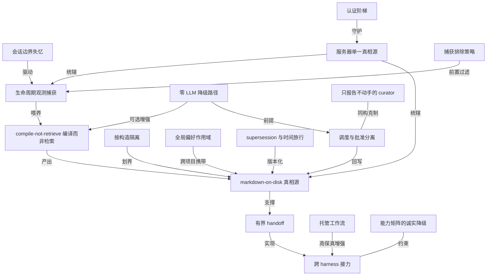

# 开源项目 ai-memory：用 Rust 给 Agent 编码 CLI 装上长期记忆

- 原文标题：akitaonrails/ai-memory
- 作者：GitHub
- 内参日期：2026-09-22
- 来源类型：blog
- 原文：https://github.com/akitaonrails/ai-memory
- 标签：记忆系统, harness engineering

> akitaonrails/ai-memory 是一个 Rust 编写的开源方案，为 Agent 编码命令行工具提供长期记忆能力，并支持在不同 Agent 厂商之间做上下文交接。

## 导读

agent 的长期记忆方案

## 核心观点

- 这个项目要解决的是一句非常具体的痛：编码 agent 的会话一结束，上下文就没了。项目自我描述的那句 slogan 把使用场景钉死了——中途退出 Claude Code，在同一个目录里启动 OpenAI Codex，不用重新解释架构、失败过的方案和悬而未决的问题。
- 它的答案不是给 agent 接一个向量数据库，而是给一群 agent 共享一个**持久的 wiki**：由经过脱敏的生命周期观测（lifecycle observations）编译而成。会话结束时，相关观测被压成一份连贯的摘要；下一个 agent 开工前收到一份**有界的 handoff**。
- 最关键的架构选择是「wiki 就是普通 markdown，放在一个 git 仓库里」——可以 `grep`，可以用 Obsidian 打开，可以 `rsync` 备份。原文用一句话概括这个取舍的价值：没有向量库要照看（no vector database to babysit），没有 `write_note` 的仪式感，没有手工加载上下文。
- 记忆的生成范式来自 Karpathy 的 LLM wiki：页面是在会话结束时从观测**编译**出来的，而不是在原始日志上做检索（compile-not-retrieve）。这一点决定了 `memory_query` 命中的是一页连贯的决策记录，而不是一段聊天记录。
- 整个东西是一个 Rust 二进制：既跑 MCP/HTTP 服务器，又独占一个数据目录。服务器是唯一真相源，所有 CLI 子命令都只是它的 HTTP 客户端。

## 问题定义：会话边界就是记忆的断点

- LLM 编码 agent 在会话结束时丢失上下文，这是原文开篇「What it is」给出的唯一前提。
- 痛点不只是「同一个 agent 的下一次」，更是「换一个 agent」：从 Claude Code 切到 Codex，两边的原生会话历史互不相通。
- 典型场景被原文列成一句大白话：「下午四点退出，第二天早上九点用另一个 agent 接着干」。接续的载体是下一个客户端的 SessionStart hook，它会在第一个 prompt 之前插入一个带 open questions、next steps 和会话摘要的 typed handoff。
- 还有一类场景是纵向的时间跨度：「六周前我们关于 X 是怎么决定的？」——从 agent 里发 `memory_query X`，或在终端跑 `ai-memory search X`，走的是 wiki 上的 FTS5 全文检索。

## 记忆是怎么被写下来的：三条写入通道

- **零摩擦的生命周期捕获**。hook 以 fire-and-forget 的方式上报有界、脱敏的 prompt、工具生命周期和会话边界观测。原文很诚实地标注了这条路径的边界：直接启动 agent 时走的是这条轻量路径，**它不是一份完整的原生 transcript**。
- **可选的托管工作流（managed workstreams）**。用 `ai-memory run claude`，之后 `ai-memory run codex --yolo`，同一个逻辑工作流被透明地接续下去，附带各 harness 的原生会话恢复、一份可移植的可见事件账本（visible-event ledger）和全账本搜索。不带 harness 名直接跑 `ai-memory run`，则续上此 checkout 下最新一个可用会话。
- 边界写得很清楚：原生参数原样透传，只有 wrapper 自己拥有的 `--yolo` 例外；直接启动 harness 的行为完全不变。
  - 一致性护栏：切换 harness 时只能恢复与共享工作流关联的原生会话，**一个过期的本地会话不能顶掉更新的跨 harness 历史**。
  - 托管模式目前覆盖 Claude Code、Codex、OpenCode、Pi、Crush 和 OMP。
- **人工写入的永久笔记**。当某个东西值得留在自动捕获的会话日志之外（一个决策、一条约定、一个坑），可以让 agent 调 `memory_write_page`，或在终端跑 `ai-memory write-page`。原文强调这类页面的所有权属性：不像 handoff 是一次性的、也不像自动合成的会话页会在 consolidation 时被重写，**write-page 写下的笔记是你的**——它出现在查询结果里，渲染在 `/web` 里，直到你自己去改它。
- `--pinned` 让它豁免 decay sweep；`--body` 第一行的 H1 自动成为页面标题（原文特意说明 `--title` 虽仍被接受，但 LLM 调用方常在 JSON 转义上翻车）。

## 隔离与作用域：记忆不能串味

- **按构造隔离到项目**。每个项目由稳定 UUID 定位，workspace 默认是 `default`，project 从 `$cwd` 推导。CLI 子命令会向上走到主 git 仓库根，于是同一个 repo 的所有 worktree 共享一个项目身份；hook 路由默认取 `basename($cwd)`，也可以选择加入 repo-root 规则。
- 在任意祖先目录放一个 `.ai-memory.toml` marker 文件即可显式覆盖这两个字段——原文点名的适用人群是多客户的咨询顾问、工作与私人分离、monorepo、以及 linked git worktree。
- 隔离带来的运维性质很硬：同名页面可以存在于两个项目而不冲突，改名是一次列更新，清除是一次 `rm -rf`。
- **全局偏好作用域**。技术选型、代码风格、长期个人规则这类跨项目的常驻上下文，住在保留的 `_global` scope 里。默认的查询会把它并进每个项目的结果、标为 `global_scope_hits`——于是偏好跟着人走进新项目，既不必去记一个魔法项目名，也不用付 `global=true` 全库扇出的代价。事件捕获永远不会写进这个 scope。
- **按仓库的捕获排除**。就近 marker 的 `[capture] ignore_paths` 策略在被识别的文件类工具事件进入本地 spool 或服务器之前就把它们丢掉。

## 可回溯性：记忆要能被审计和撤销

- 页面带 supersession chain，加上 git 版本化的 markdown，于是可以时间旅行：`ai-memory checkpoints`、`restore-page`，或者干脆读原始的 `git log`。
- 单页回滚是被专门设计过的场景：「撤销一次糟糕的页面编辑，但不要回滚整个服务器」——`checkpoints` 列出最近的 wiki 提交，`restore-page` 只恢复那一个 markdown 文件并重新索引进 SQLite。原文同时划清边界：会话、观测、handoff、用户、审计行和 embedding 这类只存在于数据库里的状态，仍然只能靠完整的备份与恢复。
- 丢掉一个实验而保留其余：`ai-memory purge-project --project experimental --confirm`，原子操作，该项目的数据库行级联删除、wiki 子目录被 `rm -rf`，**其他项目按构造不受影响**。
- 内置一个只读的 `/web` 浏览器：项目列表、目录树、FTS5 搜索、markdown 渲染、暗色模式，挂在与 MCP 同一个 axum 服务器上。开了 `--enable-web` 还会挂出一个只读的 JSON 前端 API `/api/v1`（workspaces、projects、pages、recent、briefing、search），让自定义 UI 不必去碰 SQLite 或 wiki 文件。

## 瘦客户端与单一真相源

- 一长串 CLI 子命令——`status`、`bootstrap`、`checkpoints`、`restore-page`、`purge-project`、`rename-project`、`move-project`、`audit-contamination`、`lint`、`curator`、`auto-improve`、`pending-writes`、`embed`、`forget-sweep`、`backup`——**全都是运行中服务器的 HTTP 客户端，从不直接碰 SQLite 或 wiki 文件**。原文把这条纪律总结成一句：服务器是唯一真相源。
- 唯一的例外是 `finalize-session`：它读本地 SQLite 索引只为找到匹配的未关闭会话，然后把合成的 session-end hook 回发给服务器。这个例外的存在本身是被 Codex 的能力缺口逼出来的（Codex 没有真正的会话结束 hook）。
- 架构上，hook 把观测 POST 给服务器；服务器把写入串行化到唯一一个 SQLite writer，把会话观测编译成 markdown 页面，检索侧则组合 FTS5、graph-neighbor RRF、可选的向量 RRF，以及给非全局搜索兜底的有界原始观测回退。
- 数据目录的分区很直白：`wiki/` 是 git 版本化的 markdown 真相源，`raw/` 存不可变的脱敏托管工作流 transcript 片段，`db/` 放 SQLite 索引（含 FTS5 与 embedding），`models/` 预留给本地 embedding 模型，`logs/` 是滚动日志。

## 自我改进与维护：调度与批准是两件事

- 配置了 LLM provider 之后，项目会为新完成的会话跑一个后台自我改进调度器：它把提议的 wiki 编辑记进 `pending-writes` 审计轨，默认随即走正常的 wiki 写入路径批准掉。
- 调度器的 tick 不重叠——如果审完所有项目比间隔还久，下一次 tick 会等当前这次跑完。
- 关键的设计区分：**调度与批准是分开的两个开关**。把 `[auto_improve.scheduler]` 的 `enabled` 设成 false 是停掉自动审查；把 `[auto_improve]` 的 `require_approval` 设成 true 则是让调度产生的和手工产生的提议都停在待人工审阅状态。
- 升级安全性也被想过：调度器给每个项目初始化一个首跑水位线，于是升级后历史会话不会被自动批量审查；同时按会话记录 claim，失败的调度审查不会永远重试。
- `ai-memory curator` 是另一条线：无 LLM、纯规则的维护报告，扫冷的 episodic 页面、陈旧的槽位、完全同名的重复标题和悬空的跨项目链接。**除非显式加 ****`--stage`****，它只报告不动手**；即使 staging 也只是把一页报告排进审批队列，自己仍然不执行任何维护动作。
- 老项目的冷启动走 `ai-memory bootstrap`：收集 git log、README、`docs/`、模块头、项目规则，一次性总结成种子 wiki 页面，后续会话在这之上生长。

## 部署与安全：一架四级的认证梯子

- 默认是 loopback-only（`127.0.0.1:49374`）且无认证，理由写得很坦率：对单用户笔记本这是安全的，机器外的进程根本够不着。
- 三种该开 bearer 认证的情形：服务器暴露到 loopback 之外、有不受信任的本地进程共享这台机器、数据目录里装着敏感的项目历史。bearer 保护 `/mcp`、`/hook`、`/handoff`、`/admin/*` 和 `/web/*`；浏览器访问 `/web` 走 HTTP Basic，token 当密码填。
- 非 loopback 绑定还应设 `AI_MEMORY_ALLOWED_HOSTS` 以防 DNS rebinding；繁忙的共享 hook 服务器可以用 `AI_MEMORY_HOOK_RATE_PER_SEC` 限住一个跑飞的会话而不牵连其他来源。
- 共享服务器上，原生 hook 可以改用存储的 OIDC device token，而不是把一个共享静态 token 嵌进去。原文提醒了一个容易混淆的点：OIDC 的会话 id 是登录方的会话，不是 ai-memory 的 agent 会话。
- **不自己终结 TLS** 是个明确的设计决定——正确答案是前面摆一个久经考验的反向代理，项目提供 Caddy 与 Cloudflare Tunnel 的 compose 模板。单用户 loopback 的快速上手路径被专门点名「不需要 TLS」，理由是别在不值当的地方加仪式。
- 多用户归属（v0.8，可选）：bearer 仍在链路层做认证，而 `ai-memory user add` 创建的用户各自持 token，身份会落到审计日志、页面 frontmatter、`/api/v1` 响应和页面视图里。两条边界写得很清楚——数据仍是单租户，**没有按页的 RBAC**；而创建第一个用户行本身就会立刻把所有 `/admin/*` 端点切成 root-only。

## LLM 是可选项，而不是前提

- 没有 LLM 也能用：hook 照常捕获会话，搜索走 FTS5，摘要退化为基于规则的输出。会话结束时无论如何都会写出一页规则摘要和一份 handoff。
- 加 LLM 是为了换三样东西：LLM 合并页面（在 PreCompact 时、按需调 `memory_consolidate`、或用环境变量在会话结束时选择性开启）、更丰富的 lint，以及 bootstrap。
- 推荐默认值里藏着判断：`anthropic` 配 `claude-haiku-4-5` 是合并质量与规则分类的最佳默认；OpenAI 侧给的是更便宜更快的选项；`openai-compat` 则覆盖 OpenRouter、Ollama、vLLM、LM Studio 一类端点。
- 对订阅制 OAuth 后端，原文给的建议很值得记：**挑小而快的模型**，因为这里的 LLM 活儿（合并、lint、探索）是摘要而不是硬推理，Haiku 或 mini 级别绰绰有余，也更不容易撞订阅限速——「把高算力的思考模型留给你的编码 agent」。
- 同时它对自己的 `anthropic-oauth` 路径挂了一个显眼的警告：非官方、违反 Anthropic 的使用政策，风险自负，可能导致账号被限速或封禁。
- Embedding 与 LLM provider 是分开的、也是可选的，只在想要向量重排叠加到 FTS5 与 graph-neighbor 检索之上时才配。

## 支持矩阵：能力的诚实降级

- 覆盖面很宽：Claude Code、Codex、Devin CLI、OpenCode、Cursor、Gemini CLI、Antigravity CLI、Grok Build CLI、Kimi Code、OpenClaw、Oh My Pi / OMP、Pi（经生成的桥接扩展）、Claude Desktop（经 `mcp-remote`）和 VS Code Copilot agent 模式。
- 真正有价值的是它对每个客户端能力缺口的直述，而不是笼统写一个「支持」：
- Codex 没有自动的真会话结束 hook，需要时得手动跑 `ai-memory finalize-session`。
  - Grok 与 Zero 捕获生命周期事件没问题，但都忽略 SessionStart 的 stdout，**所以 handoff 注入不了**，恢复时得让 agent 去调 `memory_handoff_accept`。
  - Devin 用的是 `PostCompaction` 事件，并且因为它不暴露子 agent 事件而略过了这部分。
  - VS Code Copilot 只有 MCP、没有生命周期 hook，因为 Copilot 还没把它们暴露出来。
  - Crush 是「仅托管」：没有提供生命周期 hook 安装器。
  - 原生 Windows 标的是 experimental；PowerShell / Git Bash 的脚本包只是兼容回退，并不执行 capture-policy v1。
- 社区插件被明确挡在一手安装面之外：Hermes Agent 的社区插件不属于 ai-memory 的第一方安装面，原文要求使用前自己审阅它的兼容矩阵、安装/卸载脚本和 secret 处理。
- 安装与卸载的工程纪律也写在明面上：`install-mcp` / `install-hooks` 是幂等的，重跑只替换 ai-memory 自己的条目、保留你配置的其他服务器与 hook，并在每次修改写入前留一个带时间戳的 `.bak-` 备份；卸载只在匹配到 ai-memory 签名之后才删。

## 血统：它站在谁的肩膀上

- Karpathy LLM Wiki——compile-not-retrieve 这个范式本身。
- agentmemory——「大部分正确的想法」都来自它，本项目自称是它的 Rust 继任者。
- basic-memory——markdown-on-disk 作为真相源的模型。
- cognee——管线组合与三元组 embedding。
- Hermes Agent——自我改进环：回合后审查、批准门和 curator 边界。
- A-MEM——Zettelkasten 式的原子笔记与链接演化。
- 末尾还有一处元信息值得注意：这份代码库本身是与 Claude Code 协作构建的，遵循 `docs/design-decisions.md` 里记录的计划——一个用 agent 造 agent 记忆层的自指案例。

## 概念网络

### 关键概念

#### 会话边界失忆

**context**：全文的问题起点。原文第一句就是「LLM coding agents lose context when a session ends」，而 slogan 把代价具体化成「重新解释架构、失败过的方案和悬而未决的问题」。失忆不只发生在同一 agent 的两次会话之间，更发生在从一个 harness 切到另一个 harness 时。

**费曼一下**：每次关掉 agent，它就失忆一次。你昨天花两小时讲清楚的项目背景、试过又放弃的三条路，第二天全要重讲一遍。而且换个牌子的 agent，连「昨天」都没有。

#### compile-not-retrieve（编译而非检索）

**context**：明确标注来自 Karpathy LLM Wiki 的范式。原文的表述是页面「compiled from observations at session-end」，而不是「retrieved over raw logs」；结果是查询命中的是一页连贯的决策页，而不是原始聊天记录。

**费曼一下**：两种做法的差别，像「事后翻聊天记录找线索」和「每次散会都写一份会议纪要」。前者把整理成本推给未来的每一次查询，后者在事情还新鲜时一次性把它整理成人能读的东西。检索的质量上限，在写入那一刻就被决定了。

#### 生命周期观测捕获

**context**：`Zero-friction lifecycle capture`。hook 以 fire-and-forget 方式上报有界、脱敏的 prompt、工具生命周期和会话边界事件。原文诚实地标注了这条路径的上限：直接启动时它是轻量路径，不是完整的原生 transcript。

**费曼一下**：不让你专门去「记笔记」，而是在你干活的过程中自动留下痕迹——你发了什么指令、调了什么工具、什么时候开始结束。代价是这些痕迹是采样而非全录，所以它老实说了「这不是完整录像」。

#### 有界 handoff

**context**：跨 agent 接力的载体。下一个 agent 在第一个 prompt 之前收到一个 typed handoff，内含 open questions、next steps 和会话摘要。原文特别强调它是 single-use 的，与自动合成的会话页、与人工 write-page 笔记三者性质不同。

**费曼一下**：像交接班时留的一张便条：没做完的在这儿、下一步该干什么、上一班发生了什么。它是一次性的——下一班接走了就消费掉了，不是长期档案。「有界」是说它有长度上限，不会把整本历史砸到新 agent 脸上。

#### markdown-on-disk 真相源

**context**：继承自 basic-memory 的模型。wiki 就是一个 git 仓库里的普通 markdown，可 `grep`、可用 Obsidian 打开、可 `rsync` 备份。原文用「no vector database to babysit」把这个取舍的动机说透了。

**费曼一下**：记忆存成你随时能打开、能看懂、能自己改的文本文件，而不是一堆只有程序能读的数字。好处是它不会变成黑箱，坏处是它放弃了一部分「语义相似」的检索能力——所以向量被做成了可选的加法，而不是地基。

#### 托管工作流（managed workstreams）

**context**：`ai-memory run` 提供的可选路径，在摘要式 handoff 之上再加一层：各 harness 的原生会话恢复、可移植的可见事件账本和全账本搜索。原文给它配了一条一致性护栏——过期的本地会话不能顶掉更新的跨 harness 历史。

**费曼一下**：普通 handoff 是「把上次的要点讲给你听」，托管工作流是「把上次的现场原封不动搬过来，再翻译成下一个工具能用的形式」。保真度更高，代价是要通过它的启动器进门。

#### 按构造隔离（isolation by construction）

**context**：每个项目由稳定 UUID 定位，project 从 `$cwd` 推导，`.ai-memory.toml` marker 可显式覆盖。原文给出的验证性质是：同名页面在两个项目里不冲突，改名是一次列更新，清除是一次 `rm -rf`。

**费曼一下**：隔离不是靠运行时反复检查「这条记录该不该给你看」，而是靠存储结构本身让串味在物理上不可能发生。判断一个隔离设计是否可信，看它删一个项目要不要小心翼翼——如果只是删个目录，那它是真隔离。

#### 全局偏好作用域

**context**：保留的 `_global` scope，装技术选型、代码风格、长期个人规则。默认查询把它并进每个项目的结果、标为 `global_scope_hits`；事件捕获永远不写进去。原文点明它解决的两个替代方案的毛病：不必记一个魔法项目名，也不付全库扇出的代价。

**费曼一下**：有些东西是关于「你这个人」的而不是关于某个项目的——你偏好什么语言、你受不了什么写法。这些应该跟着你走进每一个新项目。关键设计是它只读不写：自动捕获永远碰不到这一层，免得项目噪音污染你的长期偏好。

#### supersession chain 与时间旅行

**context**：页面的版本演化机制。supersession chain 加上 git 版本化的 markdown，使得 `checkpoints`、`restore-page` 或原始 `git log` 都能回溯。原文同时划界：数据库独有的状态（会话、观测、handoff、用户、审计行、embedding）只能靠完整备份恢复。

**费曼一下**：新版本取代旧版本，但旧的不删，留一条链。于是「这页是怎么变成今天这样的」永远查得到，改错了也能只回滚那一页。注意它的诚实之处——能时间旅行的只是 markdown 那部分，数据库里的东西仍然要靠备份。

#### 瘦客户端与服务器单一真相源

**context**：十几个 CLI 子命令全是运行中服务器的 HTTP 客户端，从不直接碰 SQLite 或 wiki 文件。唯一例外是 `finalize-session`，它读本地索引只为找到未关闭的会话，再把合成的 hook 回发给服务器。

**费曼一下**：所有人都必须走同一个门进去，包括命令行工具自己。这样写入路径只有一条，就不会出现「命令行改了文件但服务器的索引不知道」的鬼故事。而它唯一开的那个后门，也被限制成只读、且最终仍然把动作交回给服务器。

#### 零 LLM 降级路径

**context**：`LLM is opt-in`。不配 provider 时，hook 照常捕获、搜索走 FTS5、摘要退化为规则输出，会话结束照样写出摘要页与 handoff。加 provider 换来的是合并页面、更丰富的 lint 和 bootstrap。

**费曼一下**：先保证没有大模型也能用，再把大模型当作增值项。这决定了它的失败模式很温和——API key 过期或额度耗尽时，你损失的是摘要质量，而不是整个记忆系统。

#### 调度与批准分离

**context**：自我改进环的核心设计区分。`[auto_improve.scheduler]` 的 `enabled` 控制要不要自动审查，`[auto_improve]` 的 `require_approval` 控制提议要不要停下来等人；提议先记进 `pending-writes` 审计轨，默认随即批准。

**费曼一下**：「自动发现问题」和「自动改下去」是两件事，把它们做成两个开关，你才能选择「让它主动想，但改动我来点头」。很多自动化工具的信任危机，就出在这两件事被绑在同一个开关上。

#### 只报告不动手的 curator

**context**：无 LLM、纯规则的维护报告，扫冷的 episodic 页面、陈旧槽位、完全同名的重复标题和悬空的跨项目链接。除非显式 `--stage` 否则只报告；即使 staging 也只是排一页报告进审批队列，自身不执行任何维护动作。

**费曼一下**：先把「体检」和「动手术」分开。它只告诉你哪里可能有问题，一个字都不替你改。对一个存着长期记忆的系统来说，这种克制比聪明更值钱。

#### 捕获排除策略

**context**：`Per-repository capture exclusions`。就近 marker 的 `[capture] ignore_paths` 策略在被识别的文件类工具事件进入本地 spool 或服务器之前就丢掉它们。原文反复强调各 harness 的生成插件「enforces capture exclusions」。

**费曼一下**：有些文件你压根不想让记忆系统看见——密钥、私人笔记、客户数据。关键在拦截点的位置：在写进任何存储之前就丢掉，而不是存下来再打标记隐藏。前者是真的没记录，后者只是不显示。

#### 认证阶梯

**context**：从 loopback 无认证，到 bearer token 保护 `/mcp`、`/hook`、`/handoff`、`/admin/*`、`/web/*`，到 OIDC device token 让每个开发者认证自己的 hook 写入，再到 v0.8 的数据库用户与 `token_pepper`——原文把它叫作四级认证梯子。

**费曼一下**：安全不是一个开关而是一段楼梯，你站在哪一级取决于你的处境：一个人的笔记本、家里的服务器、还是一个团队共享的实例。这个设计的好处是每上一级都只付那一级的复杂度，不逼单用户先交一堆配置的学费。

#### 能力矩阵的诚实降级

**context**：支持矩阵里没有笼统的「支持」，而是逐客户端列出缺口——Codex 无真会话结束 hook、Grok 与 Zero 忽略 SessionStart stdout 导致 handoff 注入不了、Copilot 没有生命周期 hook、Crush 仅托管、原生 Windows 为 experimental。

**费曼一下**：判断一个集成型项目是否可信，看它怎么写自己不支持的部分。含糊其辞的兼容表会在你上线那天变成事故；把「这里注入不了、你得手动调那个工具」写进首页，才是能让人做决策的文档。

### 概念网络

- 整张网络的起点是 C1「会话边界失忆」，它同时定义了问题和验收标准：任何方案都要能让下一个 agent 不重新问一遍。
- 第一条主链是记忆的生成链：C2 捕获 → C3 编译 → C4 落成 markdown 真相源 → C5 生成有界 handoff → C6 完成跨 harness 接力。这条链的每一环都是前一环的消费者，而不是并列的功能罗列。C3 是链上的枢纽——它决定了 C4 存的是「整理过的页面」而不是「原始日志」，也因此决定了检索侧不必背负向量库。
- C7 托管工作流与 C5/C6 的关系是**增强而非替代**：handoff 已经能完成接力，托管工作流只是把保真度从「摘要」提到「原生会话恢复加可见事件账本」。这个分层解释了为什么它被做成可选——默认路径必须在不接管启动方式的前提下就能工作。
- C8 按构造隔离与 C9 全局偏好作用域是一对正交的边界设计：前者纵向切开项目，后者横向穿透项目。二者都作用在 C4 上，但方向相反——C8 保证记忆不串味，C9 保证该跟着人走的东西不被隔离墙挡住。C9 「事件捕获永不写入」的规定，正是为了不让 C2 的自动噪音污染这条横向通道。
- C15 捕获排除与 C2 的关系是前置过滤：它的价值完全取决于拦截点位于写入之前。若放到 C4 之后再做隐藏，隔离就只剩表象。
- C11 服务器单一真相源统辖 C2 与 C4，是整个系统的一致性根。所有 CLI 都退化成它的 HTTP 客户端，这条纪律的收益在 C10 时间旅行处兑现——只有写入路径唯一，SQLite 索引与 git 版本化的 markdown 才可能始终对得上。`finalize-session` 这个唯一例外被限制成只读，正是为了不破坏这个根。
- C12 零 LLM 降级路径与 C3 的关系值得单独看：编译范式本身不依赖 LLM，规则摘要也能产出页面，LLM 只是把编译质量提上去。正因如此，C13 自我改进环才能被安全地做成可选上层——它以 C12 配置了 provider 为前提，产物又回写到 C4。
- C13 与 C14 之间是同构的克制关系：一个把「自动审查」与「自动批准」拆成两个开关，一个默认只输出报告。它们共同表达同一条原则——对一个存长期记忆的系统，自动化的权限要显式授予，而不是默认拥有。
- C16 认证阶梯守护的是 C11 这个根：所有写入都经服务器，于是保护服务器的入口就等于保护全部记忆。阶梯式设计让单用户 loopback 场景零配置，而多用户场景的复杂度只在需要时才付——与「不自己终结 TLS、交给反向代理」是同一种「不加不值当的仪式」的判断。
- C17 能力矩阵的诚实降级与 C6 之间是张力关系：跨 harness 接力是产品承诺，而各家 harness 的 hook 能力参差不齐，让这个承诺在部分客户端上打折。项目的处理方式不是掩盖，而是把每一处折扣连同绕行方案（手动 `finalize-session`、手动调 `memory_handoff_accept`）写进首页——把张力暴露出来，反而让承诺变得可依赖。

## 费曼 x3

给 agent 装记忆，最常见的直觉是接一个向量数据库：把所有聊天记录塞进去，需要时按语义捞出来。这个直觉的问题在于，它把整理的成本推给了未来的每一次查询——而查询的质量上限，其实在写入那一刻就已经被决定了。

ai-memory 走的是相反的路：会话结束时，把这一场的观测**编译**成一页连贯的 wiki，而不是留一堆原始日志等人来捞。这个范式借自 Karpathy 的 LLM wiki，可以叫「compile-not-retrieve」。差别就像「事后翻聊天记录找线索」和「每次散会都写一份纪要」——后者贵在当下，但它让六周后那句「我们当初关于 X 是怎么决定的」有一个真正能回答它的东西：一页决策记录，而不是一段对话。

更值得琢磨的是它对存储形态的选择。那个 wiki 就是 git 仓库里的普通 markdown，能 `grep`，能用 Obsidian 打开，能 `rsync` 备份。项目自己的说法是「没有向量库要照看」，没有 `write_note` 的仪式感。这句话背后是一个判断：记忆这种东西，一旦变成只有程序能读的黑箱，你就失去了纠错的能力——你没法知道它记错了什么，也没法把它搬走。向量检索在这里被降格成可选的加法，而不是地基。这是个有代价的取舍，但代价的方向是清楚的。

它还有一层野心是中立性。同一个目录里，下午四点退出 Claude Code，第二天早上九点用 Codex 接着干，记忆不属于任何一家 harness。这既是工程问题，也是对厂商锁定的一种回应——当各家都在把上下文往自己的会话格式里锁的时候，把记忆做成一层谁都能读的普通文件，本身就是一种立场。

但真正让这个项目显得可信的，反而是它写自己做不到的地方时的坦率。Grok 和 Zero 会忽略会话启动时的输出，所以交接块注入不进去，得让 agent 自己去调恢复工具；Codex 没有真正的会话结束钩子，需要时得手动收尾；Copilot 压根没暴露生命周期钩子。这些缺口没有被藏进脚注，而是和「支持」二字并排写在首页的能力矩阵里。一个集成型项目最容易骗人的地方就是兼容表，含糊其辞的那一格，会在你上线那天变成事故。

同样的克制还体现在自动化的权限上：自我改进环把「自动审查」和「自动批准」拆成两个独立开关，维护工具默认只出报告、一个字都不替你改。对一个替你保管长期记忆的系统来说，这种不越权的设计，比它有多聪明重要得多。
