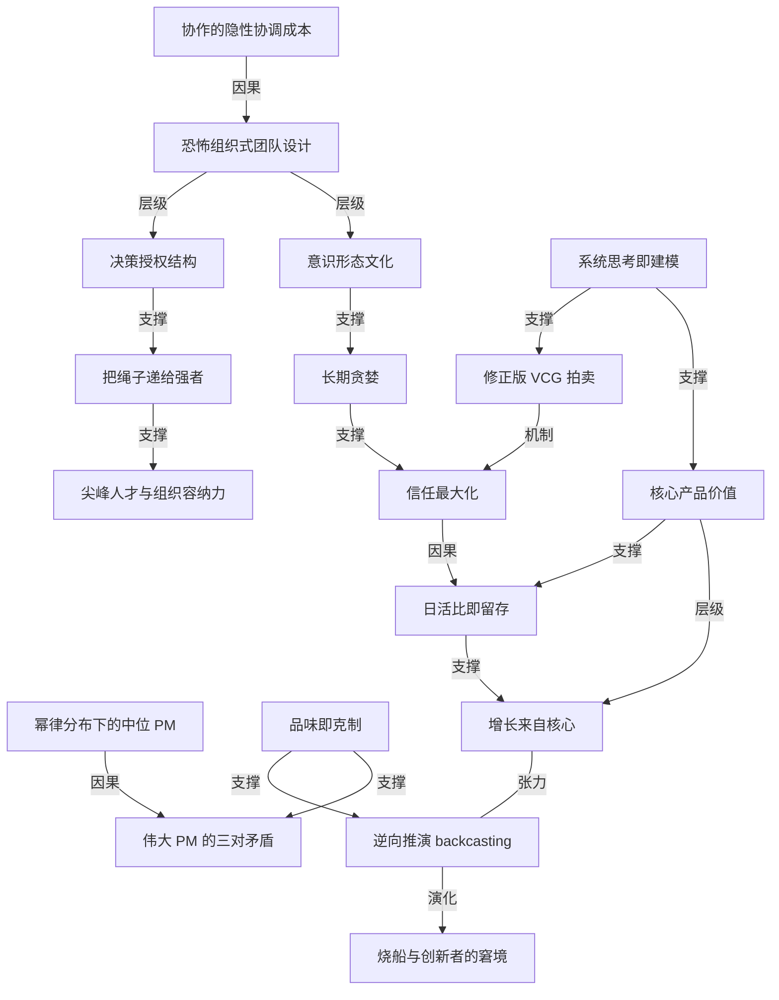

# Snap、Discord 前产品负责人：90 分钟毫无保留的产品建议

- 原文标题：90 minutes of unfiltered product advice from Snap and Discord’s product chief | Peter Sellis | Lenny's Podcast: Product | Career | Growth
- 作者：Lenny's Podcast: Product | Career | Growth
- 内参日期：2026-09-22
- 来源类型：blog
- 原文：https://app.podwise.ai/dashboard/episodes/8956860
- 标签：产品经理

> 他认为产品管理的核心不在协作而在人才门槛与组织决策权的清晰界定；多数 PM 未能创造净正价值，成功的消费产品靠的是聚焦核心需求和日活，而非追逐边缘增长。

## 导读

AI 产品

## 核心观点

- 这是 Peter Sellis 的第一次播客访谈。他是 Snapchat 的第一号产品经理，在那里待了七年；之后任 Discord 产品负责人。访谈时他处在两份工作之间，用他自己的话说是「不再对任何公司传播团队负责」，所以可以「放开讲一点」（let it rip）。
- 全篇的底层立场只有一条：**产品组织的产出取决于人才标准与组织结构，而不是协作的密度**。他把这条立场分别投射到团队设计、人才管理、职业分布、增长策略、变现机制和 PM 画像上，得出的每个结论都与主流建议相反。
- 他反复用数学语言而不是管理学语言说话：中位 PM 差是**分布问题**，日活优先是**八年级数学**，广告拍卖是**修正版 VCG 机制**，系统思考是**把存量与流量建成表格**。他对「MBA 式套话」的敌意贯穿始终。
- 三个最具辨识度的判断：好团队应该像「恐怖组织」那样由意识形态和决策授权两根支柱撑起；中位产品经理对公司是**净负值**；伟大产品经理的本质是**三对互相矛盾的特质同时存在**（三对「体内的狼」）。

## 像恐怖组织一样设计团队：两根支柱

- 起点是一个没人敢说的判断：**协作有隐性成本**。「你永远不会听到任何一家公司的任何高管说『别再协作了』」——他把这种全场一致的正确性本身当作警告信号。协调成本的本质是「系统里最慢的那个节点决定整体速度」。
- 好的恐怖组织有两样东西：
- 一种**意识形态文化**，每个人都理解自己为什么在做手上这件事，战略近乎一种宗教；
  - 一套**极其清晰的组织结构**，明确谁可以被信任来做哪一类决策（directly responsible individual、single-threaded owner、「the throat to choke」——他嘲讽这些 MBA 词汇但也照用）。
- 两者结合，可以在**不过度协作**的前提下拿到本来需要靠协作才能拿到的结果。这是他对高速执行的全部解释。
- 为什么是这个隐喻：他先想清楚自己想要什么样的组织，才发现现实中真的这样运转的组织恰好是恐怖组织。他补了一句自嘲——「Peter Sellis 的产品阅读书单现在基本上是一份禁书清单」。
- 与「邪教」（cult）的区别他讲得很细：邪教围绕**领袖个人**，恐怖组织围绕**更高的力量、宗教或意识形态**。他倾向后者。Lenny 的总结是两个要素：一是自主权（下层的人在上层失联时仍能决策），二是极清晰的使命。
- 落到高增长公司的具体含义：产品经理应该处在「做出创始人六个月前、一两年前会做的那些决策」的位置上。而高增长公司的产品负责人本质上是「创始人愿景的容器」——他在 Snap 和 Discord 都是把创始人的愿景吸收、内化，再压缩成可以反复使用的**短语和语言**，像整套战略的提喻（synecdoche）。

## 尖峰人才与「把绳子递给强者」

- 管理 Nikita Bier 的真实经验：Discord 收购了他的创业公司，他带着一批工程师在 Discord 待了一年多，向 Sellis 汇报。Sellis 说「manage 这个词用得很宽松，你不 manage Nikita，你只是试图控制或引导他」。
- 他的比喻是《飓风营救》里的 Liam Neeson：有一套非常特殊的技能，女儿被绑架时他是一对一无可替代的；但你要他去养孩子或者去买菜，他只会把杂货店里的人全杀了。
- 他把「产品组织无法容纳尖峰人才」判为**失败状态**（failure state）。有一次为了约上 Nikita 的一对一，他放话说如果再不回 DM 就去 Intro 上花钱预约；最后是在四个不同的消息 App 上才找到人。
- 管理风格的参照系是 Phil Jackson——公牛和湖人的主教练，能把彼此并不相容的尖峰天赋揉成冠军球队，又同时是球员和教练、同时调用东西方哲学。Sellis 称他是近半个世纪最有意义的领导者之一。
- 消费产品的产品负责人更像**出专辑的乐队**：你可以喜欢一支乐队，但它偶尔会出一张烂专辑。作为乐迷你是继续听、只听老歌，还是弃坑？「如果我还相信他是个艺术家，我就会陪他走下去。」
- 由此引出他最反直觉的一条带人原则：**看到有人溺水，人的本能是去救；我做的完全相反**。谁强、谁做得好，他就不断把更多绳子递过去，让对方有足够的绳子把自己吊死，一直推到崩溃点为止。
- 底层逻辑是「持续做出好决策的人，就给他更多决策，直到我开始看到他做坏决策」。他承认自己**没有一套帮普通人变好的有效机制**，所以干脆把时间全花在赢家身上，让其他人自己失败——他也承认这对下属可能相当挫败甚至有点残酷。
  - 需要校正的一点：**不关注一个人不等于这个人在失败**。有些合作多次的人，他的态度是「我知道你知道该怎么做，去做就行」。
  - 他把这条与「想快点做完就交给最忙的人」这类老套话并列，说自己只是把这些愚蠢的套话执行得更彻底：「跟你的赢家待在一起，骑你的赛马。」
- 顺带的领导力底线：**永远在公开场合护着自己的团队，绝不在别人面前批评他们**。信心具有自我实现性，这是规模化高绩效者最好的方式。

## 中位 PM 为什么差：一个分布问题

- 他认为这在 ZIRP 时代还算异见，现在已经在向主流渗透。他自嘲这是「一群靠当 PM 赚了不少钱的自我憎恨的 PM」在说 PM 不行，但坚持这背后有一个**数学解释**。
- 推导链条：产品管理技能在人群中是**正态分布**的；真正成为 PM 的人全都落在分布的右半边；把左边砍掉之后，剩下的形状变成**幂律分布**；而在任何幂律分布里，**中位数都远低于平均数**。
- 两个因素把这个效应进一步放大：
- ZIRP（零利率政策）时代，PM 成了非技术背景的人在科技业最赚钱的职业，而这个职业的定义又高度主观（Lenny 的播客之所以有价值，正因为大家都在问「我到底要做什么才算是 PM」）；薪酬按技术序列给，所以留在里面的动机极强。
  - 真正优秀的那批人，技能恰好适配高管岗位或者创业，于是**持续退出这个系统**——他们去当创始人、当高管。右尾在流失，左边的人在死守，分布就越来越偏。
- 一个二阶效应：很多人说「PM 没用」，往往只是因为他们**从没跟优秀 PM 共事过**。
- 一个更有意思的观察（他用「中间派迷因」和马蹄理论来说）：**优秀工程师几乎不抱怨 PM**——因为他们知道怎么把 PM 掰到自己想要的用法上，而且根本不会容忍差的 PM，所以也不会被分配到差 PM；**很差的工程师也不抱怨**，因为他们正好可以躲在 PM 的决策后面。**抱怨的全是中间那群人**。
- 他正在发展的评估体系不只评人，而是评「这个人 + 他当下所处的位置」这一组合，确保这支团队真的是净正值。Snap 的基准线更狠：「我们应该能在没有任何产品经理的情况下运营这个产品，所以这个人必须提供**高于『没有人』的价值**。」

## Snapchat 为什么做不出巨大的广告生意：三条结构性约束

- 前置判断：广告才是互联网消费端变现真正的产品市场契合（他引 Eric Seufert 的立场），订阅相比之下被高估。Snapchat Plus 确实做得不错，但不改变这个排序。
- 三条约束：
- **用户过于年轻**。Snap 早期在 Gen Z 中渗透率极高，现在连从 Roblox 毕业上来的 Gen Alpha 也在内。美国和海外的广告 CPM 在 17 岁与 18 岁之间、18 岁与 21 岁之间存在「可疑的断层」——未成年人的追踪、衡量和定向规则极其严格（这本身是正当的）。难以衡量就难以做效果产品，ROI 就低。跟 Pinterest、Instagram、Twitter 相比，Snap 的受众在广告意义上确定性地更不值钱。
  - **相机优先，不是信息流**。几乎所有非搜索类展示广告产品打开即进入放广告的那块屏幕；而 Snap 打开就是相机。这让它作为产品极好——捕捉一个瞬间并分享给朋友的最快方式——但**拍一张 Snap 发给朋友的核心流程里没有任何一个位置适合放广告**。它是创作导向而非消费导向的产品，市面上几乎不存在针对这种形态的广告格式。他把没能解决相机变现称为自己最大的失败之一：「实在太难了，我没能想出来，也没能给能想出来的团队开绿灯。」
  - **它本质上是个消息工具**。至今没有能撑起数十亿美元规模的消息类广告产品。人们常引用亚洲的聊天 App，但按「每单位时间花费产生的收入」拆开看，没有一个变现得特别好。消息 App 是极好的效用工具、极好的组合资产，但 Snap 是要在**低价值受众 + 极难放广告的格式 + 效用而非消费导向的服务**这三重约束上，非常快地建起一门数十亿美元的广告生意。
- 他要求给 Snap 的产品成绩单更多信用：在几乎所有西方国家，它是青少年第一的消息 App，21 岁以下人群渗透率 70% 到 100%；是他们的默认地图，用得比 Apple 或 Google 地图多；很可能是最常用的星座 App；确定是最常用的相机。「想象一下有一家 Gen Z 的伯克希尔哈撒韦，同时拥有第一的相机、第一的消息、第一的地图、第一的星座 App」——他强调这份功劳属于当年那支 OG 设计团队，不属于自己。
- 广告侧的时间线同样值得看：Snap 起步晚于 Twitter、Reddit、Pinterest，上市早于除 Twitter 外的所有人，到 40 亿美元广告收入的速度快于所有人。而 Twitter 是全球公共广场、Pinterest 是用户主动告诉平台自己想买什么——那才是天然适合广告的地方。
- 关于订阅：订阅产品的数学很残酷，**时间是你的敌人**，任何动作都需要很久才能兑现影响。消息类效用产品（Snapchat Plus、Discord 的 Nitro）与 Spotify、Netflix 这类内容产品不同——你要先习惯每天使用并从中获得价值，才会看到订阅的价值；没人第一次打开 Snapchat 就想付月费。他的遗憾是：如果 Snapchat Plus 早四年推出，广告业务的规模化压力会小很多。

## 系统思考：不是问五次「为什么」，是建模

- 他对这个词的流行很不耐烦：人们说完「系统思考」就去买那本书（指《系统之美》，Lenny 接话「就那本封面有弹簧玩具的」），然后宣布自己是系统思考者了。
- 他认为**最被低估的部分是数学基础**：能用**存量（stocks）、流量（flows）和分布**把一个系统描述出来——这是双峰分布还是正态分布？能不能用数学方式沟通这个系统如何运转？
- 他点名嘲讽「五问法」：据说出自丰田，问五次「为什么」就能触底。「大多数人说系统思考的时候，意思其实就是我问了五遍为什么，然后我到达了第一性原理。」
- 可操作的版本极其朴素：**拉一个电子表格把它建出来**。所有变量是什么？什么进来、什么出去？杠杆是什么？这些杠杆背后的分布又是什么？——「哪怕这张表最后只躺在你的共享盘里，这个过程本身就非常澄清。」他更希望大家读 1970 年代 Jay Forrester 的系统动力学，而不是那本弹簧书。

## 品味即克制：美术馆策展人的隐喻

- 他在 Snap 学到的一件事：「我见过 Evan 亲自否掉的好点子，比我见过几乎任何其他消费创业公司实际发布的都要好。」
- 他给高增长公司创始人设定的目标形象是：**世界上最富有的美术馆策展人**。任何时刻出现在产品里的东西，都只是全部藏品中的一小片——是策展人认为此时此地最合适的那一片。
- 判断品味的面试方法：**问对方那些造出来却从未发布的东西**。不是测试过数据不好的，而是真的做出原型、拿在手里，然后判断「世界还没准备好」或者「这东西还不行」的那些。如果一个人架子上有很多高质量的点子，说明他在锻炼克制这块肌肉。
- 那句最锋利的话：「**如果一家美术馆把全部藏品都挂上墙，那策展人就什么都没做。**」锻炼说不、锻炼克制，是少数几块你真的能练的品味肌肉之一。
- Lenny 接出的时代含义：AI **非常不擅长删减**，它总是在加，从不说「要不我们砍掉这一块」。所以随着 AI 越来越深地参与构建与设计，「知道该移除什么」成了 PM 的新技能——推回工程师和 AI 不断往产品里加东西的压力，现在落在产品团队身上。
- 他在「逆向角落」里把这条推向更一般的品味论：他在洛杉矶观察到，有品味的人和显得俗气的人之间的差别是——**有品味的人比所有人都早一步停下来**。在一件事「跳鲨鱼」、开始变得尴尬之前抽身，去找下一个新东西。

## AI 聊天里的广告：修正版 VCG 与信任最大化

- 他判断 OpenAI 正在**速通**（speed running）现代广告基础设施的全部组件。他称之为「最后行动者优势」：现代广告市场与拍卖机制在 2010 到 2020 年间基本已被 Meta 那支团队解决，后来者可以直接跑完这条路。
- 机制上，他认为**修正版 VCG（Vickrey-Clarke-Groves）拍卖**是在 ChatGPT 这样的聊天环境里构建广告拍卖的正确方式。Meta 的关键创新不是「出价最高者胜出」，而是把**这条广告对这个用户的有机价值（organic value）计入出价**——因此广告主要触达那些不想被触达、更难触达、相关性更低的人，就必须付更多钱。这套机制还让有机内容和广告内容可以在同一个统一拍卖里以美元为最终通分单位混排。
- 到了聊天场景，「有机价值」这个变量要被替换或增广为**信任**。把问题压到最简：用户问「我该买哪支麦克风」，系统此刻要决定是给出客观答案、给出一组答案，还是被一批想出现在用户面前的广告主影响——**而被影响的程度，本质上就是你在交易掉多少信任**。
- 他举了一个温和的反例：亚马逊搜索。亚马逊的伟大之处在于选品和次日达，但当你搜一样东西要划过 16 条广告才见到第一个自然结果时，「这是不是在微妙地影响我对这套系统的信任？」
- 结论：真正的胜负手在于**如何在拍卖机制里用数学把长期信任最大化**——信任最大化大概率与用户留存相关甚至因果相关，也与广告主价值相关。此外还有一个纯产品问题：聊天里的广告格式长什么样？如果是语音呢？没人知道。他因此认为「**现在最酷的 PM 和设计师岗位大概是 OpenAI 的广告格式**，这是广告业里一个社会层级的工作」。
- 一个具体的不同意见：他对 OpenAI 这么早就跳到「顶层订阅无广告」感到失望。广告完全可能是**增益性的**（additive），过早把最有价值的用户从广告体系里切出去是可惜的。

## 增长来自核心，不是扩张

- 他在 Snap 和 Discord 学了两遍的一课：**网络效应型生意天然想增长**，所以最有效的增长来自已经在用或者本来就想用这个产品的人——把产品对他们做得更容易、更快、更相关。
- 他的「八年级数学」：几乎每个消费产品都应该为**日活**优化。日是真的（昼夜节律是真的），周可以是真的但很少有事情真按周规律做，月度基本只属于 B2B 和交账单。一个月活用户要**三十个**才顶一个日活用户。所以最有效的消费产品都有极高的 DAU/MAU 比。
- 一个定义上的澄清：**DAU/MAU 本身就是一种留存**——留存可以取任何周期，日活比只是「给定你今天用了，明天还用的概率」。增长可以只来自把这个比率挪动几个基点，而不是去买一批新的月活再看他们留不留得住。
- 两个实证案例：
- **Snap 2018 年那次灾难性改版**是 Snap 历史上唯一一次整体 DAU 环比走平。之后团队把火力全部集中在性能上，特别是 Android 上已有用户的速度体验，结果换来了持续多年的「增长复兴」。
  - **Discord 2024 年的聚焦**更具争议。当时 MidJourney 建在 Discord 上，外界都以为这是 Discord 的时刻；但从日活曲线上你根本挑不出 MidJourney 的位置。人们用 Discord 的真实理由是在玩游戏之前、之中、之后与朋友连接。于是团队把整支队伍围绕「如何成为你和朋友一起玩有意图的多人游戏的最佳场所」重新对齐。当时所有人都说 PC 多人游戏玩家已经 100% 渗透了——事实是仍有大量边缘场景让人选择了游戏内语音或 FaceTime。聚焦性能之后，Discord 拿到了自疫情以来最快的增长。
  - 增长的具体形状是把一个人从 30 天里用 10 天变成 11 天、12 天、13 天。「当你想到这些口袋、想到把人往『最近七天用满七天』上挪，那才是怪兽级的增长。」（他说这套打法是从 Meta 的增长手册里偷的。）
- 他用了一个可植入战略文档的短语来承载这条策略：「**香蕉摊里永远有钱**」（there's always money in the banana stand）——回到你的核心用户，把产品对他们做到完美。
- 为什么游戏玩家是最好的核心用户：「世界上智商最高的用户群大概就是玩家。你以为你为挑剔、注重细节的人做过产品？除非你为玩家做过，否则你没有。」于是可以对社区说：这是 Reddit 上的一条 bug 讨论串，告诉我们哪里出了问题，不管多小多大我们都修。这带来了巨大的正外部性——「坐在那间办公室里的人会永远把它给你做到完美。」

## 何时押注新东西：同心圆、逆向推演与烧船

- 两条渐进式方法：
- 把产品里人们真正为之而来的**核心能力**提炼出来（Snap 是相机，Discord 是语音），再去找其他对这个能力有用的细分人群和群体。他自嘲这是很 MBA 的二乘二矩阵，但这是容易的一类，应该持续做。
  - 留意**用户以你没有预期的方式使用产品**——他们为了实现自己的目的不惜多跳几个圈，这就是在用脚投票。Discord 的社区方向就是这样浮现的：人们用它组织越来越大的社区，而不只是 20 人的游戏好友群。这属于同心圆式的向外扩展。
- 更具创新性的那一条是**逆向推演（backcasting）而不是预测（forecasting）**：不要从现在做增量，而是完全不受当下技术束缚地想象未来。「现在分享一个瞬间的最佳方式是掏出手机、对准、录下来——这完全是被现有技术约束的结果。如果我们设想未来，孩子迈出第一步、我在演唱会上、我在街上看到很好笑的东西，分享这一刻的最佳方式是什么？」这条路会把你引向眼镜之类的东西。
- 但他强调这种**白纸创造力**极其稀缺：绝大多数人，包括很有创造力的人，只是在**重混当下**；「现在大多数产品经理去一趟死藤水之旅或者去趟日本，回来就宣布自己解决了。」
- Lenny 补的经验：找到 PMF 是一种被低估的运气，之后以为能轻易找到下一个的人很多，真做到的极少（Airbnb 除了原始想法之外没有任何东西在大体量上奏效过）。风险是 Taleb 那个感恩节火鸡的迷因——一切越来越好，直到出现一个十倍好的东西，一夜归零。
- **SpaceX 是他给出的最强反例**。他判定 SpaceX 是当下世界上最伟大的公司，理由是它对**创新者的窘境**的免疫程度无人能及：他们正在让 Falcon 9 退役。Falcon 9 是历史上最好的发射系统，可重复使用、单位入轨成本最低，「地球上每一个国家都愿意拿出 GDP 来换这项技术」——但为了达成更远的愿景，他们需要更大运力的 Starship，于是几年后你将无法再购买 Falcon 9 的发射。
- 他称之为「科尔特斯式的登陆即烧船」：**完全愿意造出与自己竞争、让自己已有的东西变得无关紧要的产品**。「Clayton Christensen 已经不在了，但他大概会为这件事流下高兴的眼泪。」
  - 另一个被低估的部分是**公开的十年计划**：SpaceX 在做的事情没有一件是十年前没讲过的；Tesla 当年也讲清楚了用 Roadster 养 S、用 S 养 3。产品路线图是公开发布的。「作为产品负责人我向往那个级别的派头——我们要做的事情如此激进、如此有野心，以至于我可以直接告诉你我们要做什么，你觉得你能做得比我们好，欢迎来试。」（Tesla 那边还附赠专利。）
- 关于野心本身：AI 让构建变得容易，野心的水位就必须往上抬，而这不是自然的人类习惯。他用物理语言表达：「Falcon 9 已经是一路向上的了。但我要的不是位置，甚至不是速度、不是速度矢量，我要的是**加速度**；要拿到加速度我就需要冲量。」世界上有大量系统的设计目的就是阻止你让明天不同于今天，需要一次足够强的推动才能打破这层静摩擦。能在大组织里持续、可信地做到这件事的人非常罕见。

## 长期贪婪、核心产品价值与伟大 PM 的三对狼

- **long-term greedy（长期贪婪）**：广告是一个极端短期、极端收入目标驱动的领域，很容易被季度绑架。这个短语背后是一条数学认知——**明天的广告收入与你今天为广告主创造的 ROI 存在因果关系**，所以焦点应该是驱动广告主 ROI，哪怕以短期收入为代价。
- 陷阱在于提高 ROI 最容易的做法是**压低分母 I**（降价）——但在现代拍卖里价格是输出而不是输入。
  - 这个短语真正的功能是**提供意识形态掩护**：在你是上市公司、在你 miss 数字、在再不达标就要裁员的时刻，「长期思考」会变得极其艰难，而一句团队共享的短语能为这种思考撑出空间。「我们不是慈善机构，我们不是为了让人开心才把这些送出去；我们今天这么做，是因为我们知道他们明天会带着更大的预算回来。」
- **核心产品价值（Core Product Value）**：在 Snap 和 Discord 都建立过的概念——必须同时在**概念层**和**指标层**定义「一个人每天回到你的产品」意味着什么。
- Snap 当时的表述是「与你在乎的人分享一个瞬间的最快方式」，可以逐词拆解：fast 是加载时间；share 是打开即相机、快速发送；people you care about 聚焦最好的朋友——于是变成「与最好的朋友分享一个瞬间的最快方式」。
  - Discord 的表述是「在玩游戏之前、之中、之后与朋友交谈和相处的最佳场所」，同样可以逐词拆解。
  - 用法：做消费端路线图时问一句「这件事能不能帮我们成为『与最好的朋友分享一个瞬间的最快方式』？」——如果关联牵强，那大概就不该优先做。
  - 两层缺一不可：**只有指标对人没有意义，只有短语则不会被数据科学家、产品经理和工程师在日常中执行**。Snap 为此有一场新人入职演讲，他连续七年每周或每两周亲自讲一遍——「这就是那个 cult 的一部分」。最难的部分是找到与留存有因果关系的指标定义。
- **伟大 PM 的三对矛盾（三对体内的狼）**：
- **极度自信（近乎傲慢）× 深度谦逊**。自信到确信这条路是对的、确信自己的贡献终会被认可，所以能把功劳精确地给到那个最后一秒做出关键改动的设计师、那个熬夜赶上合作方活动的工程师。他的解释很锋利：知道 PM 反正会被给予过多的功劳，才有余裕去分配功劳。
  - **极度有条理、流程驱动 × 对模糊性极度自在，近乎厌恶权威**（他用了「病理性抗拒服从」这个说法）。「我什么都有清单，但我也完全接受随时把清单扔掉重做。」他特别反对「所有流程都无用」这种流行姿态——他要的是同时拥有这两只狼的人。
  - **长期思考 × 日常的行动偏好**。他们清楚半年、一年、两年后世界该是什么样，知道需要哪些积木先就位，并且有耐心；但日常的行动紧迫感「烦人到了边界上」。这类人是整个公司的节奏设定者——「他们早上醒来，公司就醒来了。」
- **逆向角落里最轻的那条**：他认为一个产品经理最重要的职业决定其实是**选择伴侣**。「没有任何数量的 Lenny 播客，能比得上找到一个会帮助你、支持你、在智识上做你回音板的伴侣。」

## 闪电轮里的推荐与彩蛋

- 三本书：Mohsin Hamid 的《How to Get Filthy Rich in Rising Asia》；Roger Lowenstein 的《When Genius Failed》（长期资本管理公司 1998 年的兴衰）；以及他常送给消费产品经理的 Alan Lightman《Einstein's Dreams》。
- 他不看电视也很少看电影，转而推荐游戏：法国独立工作室的《Claire Obscure: Expedition 33》，「故事、音乐和声音达到了卢浮宫级别的美，提醒你游戏是一种我们作为社会可能还没完全承认的艺术形式」。
- 最喜欢的 AI 产品是 **Hex**：「大部分 AI 产品还像在往墙上甩意大利面」，而 Hex 是**极少数真正成立的多人协作 AI 体验**——他和 Discord 联合创始人 Stan 在会议中同处一个 Hex 线程，一边讨论一边与 Hex 交互取数，「让我觉得自己超人化了」。
- 人生格言来自 Steinbeck《伊甸之东》关于时间流逝的段落：「时间没有可供悬挂持续感的路标；从虚无到虚无，就根本没有时间。」他由此得出的生活方式是尽快去做想做的事、慷慨地分配自己的时间——**减缓时间流逝的唯一方式，是真的用它做点什么**。
- 职业起点的彩蛋：他在 Ustream 的第一个产品角色是「柴犬幼犬直播的产品负责人」——有人把 Logitech 摄像头对准一窝新生柴犬 24 小时直播，很多人开着它当背景工作，收到大量「这救了我的命」的邮件。Ustream 的失败在于**没有聚焦游戏**（[Justin.TV](http://justin.tv/) 聚焦了游戏，变成了 Twitch）。当年 Ustream 的头号产品顾问是 Josh Elman，第一位产品经理是高中辍学的 Matt Schlicht。

## 概念网络

### 关键概念

#### 恐怖组织式团队设计

**context**：全篇的开场主张，Sellis 用它概括自己在 Snap 和 Discord 的组织方法——「一个好的恐怖组织本质上有两样东西：一种让每个人都明白自己为什么在做这件事的意识形态文化，以及一套非常非常清晰的、谁可以被信任做哪类决策的组织结构」。他强调这个隐喻与「邪教」的区别在于前者围绕更高的力量与意识形态，后者围绕领袖个人。

**费曼一下**：与其让所有人开会对齐，不如让所有人**先相信同一件事**，再明确**谁有权拍板什么**。这两件事到位之后，团队即使不开那些会，也能得出跟开了会一样的结论，而且快得多。

#### 协作的隐性协调成本

**context**：这条判断是恐怖组织隐喻的前提。他指出「你永远不会听到任何一家公司的任何高管说『别再协作了』」，而全场一致的正确性本身就是警告信号；协调成本的实质是「你的移动速度等于系统中最慢的那个节点」。

**费曼一下**：每多拉一个人进决策，就多一道等待。协作的账面收益（少犯错）很容易被看见，它的成本（整个队伍被最慢的人拖住）却从来没人记账。

#### 幂律分布下的中位产品经理

**context**：他解释「中位 PM 对公司是净负值」的方式完全是统计学的：产品管理技能在人群中正态分布，真正成为 PM 的人集中在右半边，砍掉左半边后分布变成幂律形状，而**幂律分布的中位数远低于平均数**；ZIRP 时代的高薪让平庸者留下，优秀者则持续退出去做创始人和高管。

**费曼一下**：这个职业同时在**下端锁人**（工资太好，走不划算）和**上端漏人**（最强的人被创业和高管岗吸走）。留在中间的那批人构成了你见到的「典型 PM」，所以典型 PM 差不是人的问题，是这个池子的形状问题。

#### 尖峰人才与组织的容纳能力

**context**：用于描述 Nikita Bier 这类人——「不是 manage，只是试图控制或引导」，像《飓风营救》里的 Liam Neeson，特定问题上一对一无可替代，日常琐事上则会把杂货店的人全杀了。他把「产品组织无法容纳这种尖峰」判为失败状态，并以 Phil Jackson 为管理参照。

**费曼一下**：有些人只在一个很窄的方向上极其锋利，别的方向全是短板。组织的能力不在于把他们磨圆，而在于有没有一个能接住这种形状的结构和一位愿意接住的领导者。

#### 把绳子递给强者

**context**：他四条反直觉经验之一——「看到有人溺水你想去救，我做的完全相反；谁强、谁在做得好，我就不断把更多绳子递给他，让他有足够的绳子把自己吊死」，一直推到崩溃点；配套的是「永远在公开场合护着团队」和「我没有一套让普通人变好的有效机制」。

**费曼一下**：管理时间是稀缺资源。大多数人本能地把它花在最需要帮助的人身上；他把它全部投给已经跑得最快的人，不断加载荷直到出现坏决策为止——因为信心是自我实现的，而高绩效者的产能上限远高于组织的预期。

#### 品味即克制（美术馆策展人）

**context**：Sellis 在 Snap 学到的核心品味观。他见过 Evan 亲自否掉的好点子，比他见过的几乎任何消费创业公司实际发布的还要好；他给创始人设定的目标形象是「世界上最富有的美术馆策展人」，判据是那句「**如果一家美术馆把全部藏品都挂上墙，那策展人就什么都没做**」。面试时的测法是问对方那些做出来却从未发布的东西。

**费曼一下**：品味不体现在你能做出什么，而体现在你**扣住了什么没发**。好东西谁都想加，唯一稀缺的是在它足够好的时候仍然说不——这也是 AI 时代最难被替代的那块肌肉，因为 AI 只会加，不会减。

#### 系统思考即建模（存量、流量与分布）

**context**：他对流行用法的纠正。「五问法」和买一本书就自称系统思考者在他看来都是 MBA 式套话；他认为最被低估的部分是能用存量、流量和概率分布把系统数学化地描述出来，可操作版本是「拉一张表格把它建出来：变量有哪些、什么进什么出、杠杆是什么、杠杆背后的分布是什么」，哪怕这张表最后只躺在共享盘里。

**费曼一下**：真正的系统思考不是讲一个关于系统的故事，而是**把系统写成一组可以算的数**。一旦你被迫填格子，你就会发现自己其实不知道哪个变量在起作用——这种不适正是澄清本身。

#### 修正版 VCG 拍卖

**context**：他判断这是在 ChatGPT 这类聊天环境里构建广告拍卖的正确数学机制。Meta 的关键创新不是「最高出价者胜出」，而是把**广告对这个用户的有机价值计入出价**——想触达不想被触达的人就必须付更多；这也让有机内容与广告内容能在同一个统一拍卖里以美元通分混排。

**费曼一下**：好的广告拍卖不是把位置卖给出价最高的人，而是**给「打扰」标价**：越是打扰用户的广告越贵，越是用户本来就想看的广告越便宜。这样一来，广告主的钱包自动帮平台守住了用户体验。

#### 信任最大化

**context**：他对聊天式 AI 广告的核心论断——在 feed 里那个变量叫「有机价值」，在聊天里它应被替换或增广为**信任**。用户问「我该买哪支麦克风」时，系统被广告主影响的程度本质上就是它在交易掉多少信任；他用亚马逊搜索里「16 条广告才见到第一个自然结果」作温和反例，并断言胜负手在于用拍卖机制把长期信任最大化，因为信任与留存、与广告主价值都相关。

**费曼一下**：聊天助手的全部资产是「你相信它说的话」。每插一条广告，它就从这个账户里取一次钱。能不能把广告做成生意，取决于你有没有把这笔支出真的算进账本，而不是只算收入。

#### long-term greedy（长期贪婪）

**context**：他在 Snap、Discord 及顾问工作中反复使用的短语，背后是一条因果认知：**明天的广告收入与你今天为广告主创造的 ROI 存在因果关系**，所以应该驱动 ROI 哪怕牺牲短期收入；陷阱是提高 ROI 最容易的方法是压低分母（降价），而现代拍卖里价格是输出不是输入。他强调这个短语真正的功能是在上市公司 miss 数字、面临裁员时为长期思考提供意识形态掩护。

**费曼一下**：广告生意里，今天给广告主赚到的钱就是明天他们给你的预算。愿意为此少收一点，不是慈善，是复利。难的从来不是理解这一点，而是在季度报表逼你的那一刻仍然守得住——所以你需要一句全队共享的口号来顶住压力。

#### 核心产品价值（Core Product Value）

**context**：他在 Snap 和 Discord 都建立过的框架——必须同时在概念层和指标层定义「一个人每天回到产品」意味着什么。Snap 是「与你在乎的人分享一个瞬间的最快方式」，可拆成 fast（加载时间）、share（打开即相机）、people you care about（聚焦最好的朋友）；Discord 是「在玩游戏之前、之中、之后与朋友交谈和相处的最佳场所」。缺了指标就不会被执行，缺了短语就对人没有意义。

**费曼一下**：给产品写一句既是使命又能被拆成指标的话，然后每次要做新功能时拿它去量一量。关联牵强的就别做。它之所以有效，是因为它同时说服了两种人——需要意义的人和需要数字的人。

#### 日活比即留存

**context**：他为「几乎每个消费产品都应该为日活优化」给出的论证：一个月活用户要三十个才顶一个日活用户；日是真的（昼夜节律是真的），周和月对消费产品大多不成立。他同时做了一个定义澄清——**DAU/MAU 本身就是一种留存**，只不过周期取一天：「给定你今天用了，明天还用的概率是多少。」

**费曼一下**：与其去追一批新用户看他们留不留得住，不如把已经在用的人从一个月用十天变成用十一天。这两件事对数字的影响是同一个量级，但后者的成功率高得多。

#### 增长来自核心

**context**：他在 Snap 和 Discord 各学一遍的判断：网络效应型生意天然想增长，最有效的增长来自已经在用产品的人。Snap 2018 年改版事故后聚焦 Android 性能换来多年增长复兴；Discord 2024 年在「所有人都说多人游戏玩家已 100% 渗透」的前提下重新聚焦游戏，拿到疫情以来最快增长；他用「香蕉摊里永远有钱」作为可写进战略文档的承载短语。MidJourney 建在 Discord 上看似是大事件，但在日活曲线上根本挑不出来。

**费曼一下**：外界的热闹事件（某个爆款建在你上面）往往在你的核心曲线上留不下痕迹，而把核心体验做快一点、做顺一点却能带来多年增长。「已经 100% 渗透」几乎永远是个错觉——渗透率说的是有没有装，不是有没有每天打开。

#### 逆向推演（backcasting）

**context**：他给出的、比同心圆扩张更具创新性的探索方法——不从现在做增量，而是**完全不受当下技术束缚地设想未来**，再倒推回来。例子是「现在分享一个瞬间的最佳方式是掏出手机对准录下来，这完全是被现有技术约束的结果；如果重新设想，最佳方式是什么？」——这条路会把人引向眼镜。他同时指出这种白纸创造力极其稀缺，多数人只是在重混当下。

**费曼一下**：预测是从今天往前推一步，逆向推演是先站到理想的终点上，再回头看今天缺什么。前者只能得到「今天 + 10%」，后者才可能得到一个形态完全不同的答案。

#### 烧船与创新者的窘境

**context**：他判定 SpaceX 是当下世界上最伟大的公司的理由——他们正在让 Falcon 9 退役。那是历史上最好的发射系统，「地球上每一个国家都愿意拿出 GDP 来换这项技术」，但为了达成更远愿景需要 Starship，于是几年后不再出售 Falcon 9 的发射。他称之为「科尔特斯式的登陆即烧船」，并说 Clayton Christensen 会为此流下高兴的眼泪。配套的另一半是**公开的十年计划**：SpaceX 在做的没有一件是十年前没讲过的。

**费曼一下**：创新者的窘境的本质是「现在这个东西太赚钱了，谁也不忍心杀它」。破解方法不是更聪明的分析，而是先把船烧了——让退路在组织层面消失，使命才会真的压过短期利益。

### 概念网络

这张网络的枢纽不是任何一条具体建议，而是一个贯穿全篇的姿态：**用数学的方式对待产品组织里被当作文化问题处理的东西**。Sellis 把每一个通常靠直觉或价值观回答的问题，都换成了一个分布、一个比率或一个机制。

**第一条链是组织**。协作的隐性协调成本是起点，它推出了「恐怖组织」这个隐喻，而隐喻本身分岔成两根支柱：意识形态文化和决策授权结构。这两根支柱不是并列的装饰，它们的关系是**替代协作**——意识形态解决「为什么」，授权结构解决「谁拍板」，两者到位之后，不开那些会也能拿到开了会的结果。授权结构继续向下支撑了「把绳子递给强者」（因为敢给决策权，才谈得上不断加载），而这条带人法又是「尖峰人才能否被容纳」的前提：一个不敢授权的组织，注定只能雇用形状规整的人。

**第二条链是人才判断**。幂律分布解释了为什么中位 PM 差，而「伟大 PM 的三对矛盾」正是这条分布右尾的画像——它与前一条不是重复，而是互补：分布告诉你**这个职业为什么长成这样**，三对狼告诉你**右尾的那些人具体长什么样**。品味即克制从另一侧支撑同一个画像：三对矛盾里的「自信 × 谦逊」在产品层面的外化，就是敢于对足够好的点子说不。

**第三条链是增长**。系统思考即建模在这里是方法论上游——因为要求把东西建成表格，才会问出「日活和月活到底差多少倍」这种八年级数学问题，才会得到核心产品价值这种既能写成句子又能拆成指标的东西。核心产品价值向下支撑日活比，日活比再支撑「增长来自核心」，构成一条闭合的因果链：先定义每天回来意味着什么，再把它变成可测量的留存，最后在这个留存上做增量。

**第四条链是变现**，也是全篇最能体现「机制思维」的一段。系统思考同样是它的上游（VCG 是一个数学机制，不是一种态度）；修正版 VCG 通过把有机价值计入出价，为「信任」这个抽象变量提供了可执行的价格形式；长期贪婪则从意识形态一侧支撑同一个目标——两者是**同一件事的机制层与文化层**：机制让信任在拍卖里可算，口号让团队在财报压力下仍守得住。信任最大化最终回流到留存，与增长那条链在同一个变量上汇合，这也是 Sellis 说「信任最大化很可能与用户留存相关甚至因果相关」的位置。

**唯一一处真正的张力在「增长来自核心」与「逆向推演」之间**。前者说把钱留在香蕉摊里，后者说完全抛开当下去设想未来；前者带来多年复利，后者防的是 Taleb 那只感恩节火鸡——一切越来越好直到被十倍好的东西一夜清零。Sellis 没有用一条规则消解这组张力，他给的是一个存在证明：SpaceX 用烧船 Falcon 9 演示了同一个组织可以在把核心做到世界第一的同时，主动让它变得无关紧要。而这条路之所以走得通，又要回到品味即克制——愿意放下已经足够好的东西，与愿意扣住还没发布的东西，是同一块肌肉的两个方向。

## 费曼 x3

这场对话最值得记住的，不是任何一条具体建议，而是说话人处理问题的方式：凡是别人用价值观回答的地方，他都换成一个分布、一个比率或一个机制。

「中位产品经理对公司是净负值」听起来像行业抱怨，但他给的是统计学推导——这门手艺的技能在人群中正态分布，真正入行的人集中在右半边，砍掉左半边后形状变成幂律，而幂律分布的中位数远低于平均数。再叠上两股力：零利率年代的高薪让不够格的人没有理由离开，而真正优秀的那批人技能恰好适配创业和高管岗，于是持续从系统里漏出去。上端漏人、下端锁人，中间那群人就成了你遇到的「典型 PM」。这不是在骂人，是在描述一个池子的形状——顺带解释了为什么优秀工程师几乎不抱怨 PM（他们不容忍差的），最差的工程师也不抱怨（他们正好躲在 PM 的决策后面），抱怨的全是中间那群。

同样的换算贯穿全篇。「增长来自核心」不是一句价值观，是八年级数学：一个月活用户要三十个才顶一个日活用户，所以把已有用户从一个月用十天变成用十一天，和去买一批新用户看他们留不留得住，对数字的影响是同一个量级，而前者成功率高得多。Discord 的例子把这个道理逼到极限——所有人都说 PC 多人游戏玩家已经百分之百渗透了，团队偏偏还是回去为这群人做性能，结果拿到疫情以来最快的增长。渗透率说的是有没有装，不是有没有每天打开。至于 MidJourney 建在 Discord 上那件轰动外界的事，在日活曲线上根本挑不出来。

最锋利的一段在广告。他认为聊天式 AI 的广告不是格式问题而是**定价问题**：feed 广告的拍卖机制早已把「这条广告对这个用户的有机价值」计入出价，所以想触达不想被触达的人就得多付钱；搬到聊天里，这个变量要换成**信任**。用户问「我该买哪支麦克风」的那一刻，系统被广告主影响多少，本质上就是它交易掉了多少信任。把这笔支出真的算进账本，广告就可能是增益的；不算，就会变成亚马逊搜索里那划过十六条广告才见到的第一个自然结果——产品没有崩，只是你对它的信任在悄悄减记。

而全篇最难学的一条，恰恰是最不像方法论的：品味等于克制。他在 Snap 见过被亲手否掉的好点子，比他见过其他公司真正发布的还要好；他给创始人设定的目标形象是世界上最富有的美术馆策展人——如果一家美术馆把全部藏品都挂上墙，那策展人就什么都没做。判断一个人有没有品味，要问的不是他做成过什么，而是他做出来却扣着没发的是什么。这句话在 AI 时代忽然变得尖锐：AI 极其擅长加，几乎不会说「这块砍掉吧」。构建的门槛塌下来之后，稀缺的不再是把东西做出来的能力，而是在它已经足够好的时候仍然说不的那块肌肉——以及它的另一面，SpaceX 明知 Falcon 9 是人类最好的发射系统仍决定让它退役。扣住没发布的和放下已足够好的，是同一块肌肉的两个方向。

## 阅读原文

Product management effectiveness hinges on high-bar talent and organizational structure rather than excessive collaboration. Teams should operate with clear ideological goals and defined decision-making authority, mirroring the autonomy found in high-stakes organizations. Most product managers fail to provide net-positive value, as the profession often attracts individuals who lack the taste or strategic depth required for true innovation. Successful consumer products, such as Snapchat and Discord, thrive by focusing on core user needs and daily active usage rather than chasing peripheral growth. Monetization remains a significant hurdle for messaging-centric platforms, requiring a "long-term greedy" approach that prioritizes advertiser ROI over immediate revenue. Ultimately, the most impactful product leaders possess the rare ability to balance extreme confidence with humility, maintaining a bias for action while remaining patient enough to execute long-term strategic visions.

- Designing high-growth teams like a "terrorist organization" requires a shared, almost religious ideological culture paired with a rigid, transparent structure for decision-making authority to minimize coordination costs.
- Maximizing team output involves loading high-performing individuals with increasing levels of responsibility until they reach a breaking point, rather than focusing on the incremental improvement of average performers.
- The median product manager is often a net negative to a company because the most capable practitioners consistently exit the role to become founders or executives, leaving a talent distribution that favors the extremes.
- Sustainable growth in consumer products is best achieved by obsessively optimizing the core experience for existing daily active users, as this maximizes retention more effectively than broad market expansion.
- True product taste is defined by the capacity for restraint—the ability to say "no" to high-quality ideas and curate a product that contains only the most essential features.
- Systems thinking is a quantitative exercise requiring the creation of mathematical models that map variables, stocks, and flows to identify actionable levers, rather than relying on abstract management tropes.
- Advertising models in chat-based AI interfaces must utilize sophisticated auction mechanisms that weigh the organic value of an answer against advertiser bids to protect long-term user trust.
- As AI lowers the barrier to building, the primary differentiator for successful organizations is the ability to maintain extreme ambition and "burn the ships" by replacing successful products with superior, self-cannibalizing alternatives.
**Q: You've described your approach to designing teams as being like a "terrorist organization." What does that actually mean in practice?**

A: It comes down to two primary pillars. First, there is an ideological culture where everyone understands the "why" behind their work—the strategy acts almost like a religion. Second, there is a very clear organizational structure regarding who can be trusted with which decision. By combining these, you can achieve high-speed execution without the massive coordination costs of over-collaboration. It’s about creating autonomy so that people further down the chain can make decisions as if they were the founders, which is essential for moving fast at high-growth companies.

**Q: You've stated that most product managers are bad and often net negative to the company. Why do you believe the median PM is not actually good?**

A: It is largely a mathematical result of the distribution of skill. Product management skill is normally distributed across the population, but the people who actually become PMs are all on the right-hand side of that distribution, which creates a power distribution. In any power distribution, the median is far below the average. Furthermore, during the ZIRP (Zero Interest Rate Policy) era, PM became the most lucrative career for non-technical people, incentivizing people to stay in the role even if they aren't great at it. Conversely, the truly great PMs usually exit the system to become founders or executives, leaving the median performance quite low.

**Q: Why has Snapchat struggled to build a massive ads business despite having such a huge, engaged user base?**

A: There are three main factors. First, the demographic is extremely young, and there is a massive discontinuity in advertising CPMs once users hit 18, because of the strict regulations around tracking and targeting minors. Second, the product is camera-first and creation-oriented, not a feed-based consumption product, which makes it a hostile environment for traditional ad formats. Third, it is fundamentally a messaging utility, and there are currently no great ad products for messaging apps that scale to multi-billion dollar businesses effectively.

**Q: You mentioned that "systems thinking" is often used as an empty buzzword. How do you actually apply it in a practical, non-MBA way?**

A: The most underrated aspect of systems thinking is having a mathematical background to describe the system in terms of stocks, flows, and distributions. If you want to be a real systems thinker, model it out in a spreadsheet. Identify all the variables, what comes in and what comes out, and what the levers are. Even if the spreadsheet never leaves your shared drive, the act of mapping out the system—understanding the probability distributions behind your levers—is what actually provides clarity.

**Q: What are the three "oxymorons" or pairs of traits that define a truly great product manager?**

A: First, they balance extreme confidence—bordering on arrogance—with deep humility, knowing exactly when to give credit to the designers and engineers who actually did the work. Second, they are incredibly organized and process-driven, yet they despise authority and are pathologically comfortable with ambiguity. Third, they possess long-term thinking, knowing exactly how they want the world to look in two years, but they maintain a day-to-day bias for action that is borderline annoying. If you can demonstrate these three pairs of "wolves" inside you, you are a top-tier PM.

**Q: You focus heavily on growth coming from the core of the business rather than expansion. How do you decide when to bet on something new versus refining the core?**

A: You should always be assessing expansion through concentric circles—looking for other niches where your core value proposition is useful. However, the most innovative way to think about it is "backcasting." Instead of forecasting from the present, envision the future totally unencumbered by current technology. Ask yourself, "What is the best way to share this moment?" and work backward from that ideal. Most people just remix the present, but true innovation comes from having the blank-sheet creativity to ignore the status quo.

**Q: How do you manage "spiky" talent like Nikita Bier, who are brilliant but don't fit the standard 9-to-5 mold?**

A: You don't "manage" that type of talent; you seek to control or direct them. I think of them like Liam Neeson in *Taken*—they have a very specific, high-value set of skills. If you need them to solve a specific, hard problem, they are one-of-one. But if you try to make them do mundane tasks like "buying groceries," they’ll just kill everyone in the store. The failure state is when a product organization can't handle that spikiness. You have to be a Phil Jackson-style leader who can mesh very different, spiky talents into a winning team.

**Q: What is your advice for building an ads business in a chat-based AI product like ChatGPT?**

A: You have to be "long-term greedy." Revenue tomorrow is causally related to the ROI you drive for advertisers today. The temptation is to lower prices or clutter the UI to hit short-term revenue goals, but that destroys trust. You need a modified Vickrey-Clarke-Groves (VCG) auction mechanism that factors in the organic value of the ad to the user. If you maximize trust, user retention and advertiser value will follow. The biggest mistake is jumping to an ad-free subscription model too early, as ads can be additive if the format is right.

**Q: What is the most important lesson you've learned about leadership from your time at companies like Snap and Discord?**

A: Always defend your team in public and never criticize them in front of others. If someone is crushing it, I hand them more and more rope to hang themselves with—I push them to the point of breaking. I don't have a great mechanism for "improving" average people, so I focus my time on the winners. I load them up with decisions until they start to make bad ones, because the self-fulfilling prophecy of confidence is the best way to scale high performers.

**Q: Why do you think SpaceX is the greatest company in the world right now?**

A: They are the best example of avoiding the innovator's dilemma. They are sunsetting the Falcon 9—the greatest launch system in history—to focus on Starship. Any other nation-state would give up their GDP to have Falcon 9 technology, but SpaceX is willing to make their own product irrelevant to reach their vision of becoming multi-planetary. They publish their 10-year plans and then actually do exactly what they say. That level of ambition and the willingness to burn the ships is what separates them from everyone else.

- Zerp era: This refers to the period of Zero Interest Rate Policy, characterized by cheap capital and rapid growth in the tech industry. It is often cited as a time when companies hired aggressively and product management roles became highly lucrative.
- Systems thinking: A holistic approach to analysis that focuses on how individual parts of a system interrelate and influence the whole. In the transcript, it is described as a method for modeling complex business processes using data variables and logical flows.
- Vickrey-Clarke-Groves (VCG) auction: A mathematical mechanism used in advertising auctions where the price paid by an advertiser is determined by their bid and the value they provide to the platform. It is discussed as a sophisticated way to balance advertiser interest with user trust.
- The Innovator's Dilemma: A business theory popularized by Clayton Christensen that explains why successful, established companies often struggle to adapt when faced with disruptive technologies. It is referenced as a cautionary tale for companies that fail to innovate and compete against their own existing products.
- How to Get Filthy Rich in Rising Asia: A novel by Mohsin Hamid that uses a unique second-person narrative to trace the life and rise of an entrepreneur in a rapidly developing nation. It is mentioned as a recommended read for those interested in business and growth.
- When Genius Failed: A non-fiction book by Roger Lowenstein that details the rise and dramatic collapse of the hedge fund Long-Term Capital Management in the late 1990s. It serves as a study of risk management and the dangers of extreme financial leverage.
- Einstein's Dreams: A philosophical novel by physicist Alan Lightman that explores various concepts of time through a series of dream-like vignettes. It is recommended for product managers as a way to think differently about time and experience.
- Claire Obscure: Expedition 33: An indie video game praised for its high-quality storytelling, music, and artistic design. It is highlighted as an example of gaming as a sophisticated form of art.
- Hex: A collaborative data workspace that integrates AI to help teams analyze data and build interactive reports. It is noted for its ability to enable real-time, multiplayer collaboration between product managers and data scientists.
- Phil Jackson: A legendary basketball coach famous for his unique leadership style, which combined Eastern philosophy with Western management techniques to lead teams like the Chicago Bulls and LA Lakers to multiple championships. He is cited as an inspiration for managing diverse and "spiky" talent.
- (00:50) Great product managers are exiting the system to become founders and executives. It is set up to be a profession where the median product manager is probably pretty bad.
- (01:22) Exercising the muscle of restraint is one of the few muscles of taste you can develop. If a museum has all of their collection on the walls, the curator hasn't done anything.
- (07:32) A good terrorist organization has two things: an ideological culture where everyone understands why they are doing what they are doing, and a clear organizational structure of who can be trusted with which decision.
- (51:11) Network effect-oriented businesses want to grow implicitly. You drive growth most effectively by focusing on people who are already using the product and making it more performant and relevant.
- (1:18:11) You want people who are extremely organized and process-driven, but are also super comfortable with ambiguity, almost to the point of despising authority.

### Designing High-Performance Teams Like a Terrorist Organization

[(05:45)](https://app.podwise.ai/dashboard/episodes/8956860?locate=345)

Effective team design relies on two pillars: a shared ideological culture and a clear organizational structure that defines decision-making authority. By establishing a "religious" level of commitment to the mission and identifying directly responsible individuals, teams can minimize the coordination costs associated with over-collaboration. Managing "spiky" talent—individuals with extreme, specialized skills—requires a leadership style similar to coaching elite athletes, where the goal is to harness unique capabilities rather than force conformity to a standard nine-to-five model.

**Lenny Rachitsky:**

[(00:00)](https://app.podwise.ai/dashboard/episodes/8956860?locate=0)

I asked you what are some counterintuitive lessons that you've learned that go against common startup wisdom.

**Peter Sellis:**

[(00:05)](https://app.podwise.ai/dashboard/episodes/8956860?locate=5)

I'm no longer beholden to any corporate comms team right now, so I can let it rip a little bit.

**Lenny Rachitsky:**

[(00:10)](https://app.podwise.ai/dashboard/episodes/8956860?locate=10)

You like to design teams like a terrorist organization.

**Peter Sellis:**

[(00:13)](https://app.podwise.ai/dashboard/episodes/8956860?locate=13)

A good terrorist organization essentially has two things. One is it has this ideological culture that everyone understands why they are doing what they're doing. And then it has a very, very clear organizational structure of who can be trusted with which decision.

**Lenny Rachitsky:**

[(00:29)](https://app.podwise.ai/dashboard/episodes/8956860?locate=29)

You like to spend time writing your best people into the ground versus Improving the average people.

**Peter Sellis:**

[(00:34)](https://app.podwise.ai/dashboard/episodes/8956860?locate=34)

If you see somebody drowning, you want to save them. I did the absolute opposite. If somebody is strong and crushing it, I'm just handing them more and more rope to hang themselves with.

**Lenny Rachitsky:**

[(00:43)](https://app.podwise.ai/dashboard/episodes/8956860?locate=43)

Something that I know you believe most product managers are bad and are often net negative to the company.

**Peter Sellis:**

[(00:50)](https://app.podwise.ai/dashboard/episodes/8956860?locate=50)

The great product managers are exiting the system. They're becoming founders. They're becoming executives. It's kind of set up to be this profession where the median product manager is actually probably pretty bad.

**Lenny Rachitsky:**

[(01:00)](https://app.podwise.ai/dashboard/episodes/8956860?locate=60)

Snap is quite famous for not hiring PMs for a long time.

**Peter Sellis:**

[(01:03)](https://app.podwise.ai/dashboard/episodes/8956860?locate=63)

The baseline is we should just be able to operate this product without any product manager. So this person has to provide value over nobody.

**Lenny Rachitsky:**

[(01:10)](https://app.podwise.ai/dashboard/episodes/8956860?locate=70)

Feels like an interesting new skill for PMs is pushing back on things, AI, adding to your products.

**Peter Sellis:**

[(01:14)](https://app.podwise.ai/dashboard/episodes/8956860?locate=74)

I think I saw Evan personally say no to better ideas than I've seen almost any other consumer. Start a launch. Exercising that kind of muscle of saying no, of restraint, is probably one of the few muscles of taste you can exercise. If a museum has all of their collection on the walls, then the curator hasn't done anything.

**Lenny Rachitsky:**

[(01:33)](https://app.podwise.ai/dashboard/episodes/8956860?locate=93)

Today my guest is Peter Sellis. Peter is a legend in the PM community. He was the first PM at Snapchat, where he spent seven years building one of the most delightful and popular consumer products in history. More recently, he was head of product at Discord, which he helped grow significantly. And now he's between gigs, which means he was finally able to come on the podcast without a comps team, without a PR team, which means that he's able to be especially honest and real about everything that he's seen and learned and has been excited to share. We cover so much ground, From how the best teams are organized like terrorist organizations, what it's like to manage Nikita Bier, why most PMs are really bad, Why Snapchat has struggled to build a truly massive business in spite of having a billion multi-active users and it's not what you think and so much more. This episode is full of so much gold and that's why it went so long. I couldn't stop digging into stuff that Peter kept bringing up.

[(02:29)](https://app.podwise.ai/dashboard/episodes/8956860?locate=149)

A huge thank you to Jack Brody and Shriram Krishnan for suggesting topics and questions for this conversation. Before we get into it, don't forget to check out Lenny's Product [Pass.com](http://pass.com/). For a free year of the hottest and most beautifully crafted AI and non-AI products in the world, available exclusively to Lenny's newsletter subscribers. With that, I bring you Peter Sellis. Peter, thank you so much for being here. Welcome to the podcast.

**Peter Sellis:**

[(02:57)](https://app.podwise.ai/dashboard/episodes/8956860?locate=177)

Thank you, Lenny. It feels like it's been a long time coming that you and I have known each other, but I'm really excited to be here.

**Lenny Rachitsky:**

[(03:04)](https://app.podwise.ai/dashboard/episodes/8956860?locate=184)

You've never done a podcast before. You've been in product. You've been out there for so long. I'm very honored you chose to do this. Why have you avoided podcasts? Why have you decided to finally do this podcast?

**Peter Sellis:**

[(03:15)](https://app.podwise.ai/dashboard/episodes/8956860?locate=195)

You know, it's not avoiding podcasts. I've really just been avoiding you. No, I'm kidding. I think there are two things. To be totally frank with you, a lot of times when I saw, especially early on, because you have such wonderful distribution among so many influential people and teams, when I saw somebody going on Lenny's Podcast, I was like, oh, that person is probably about to get fired. They're going on and they're pimping themselves out for their next role, which was maybe one view of it. I was like, why aren't they just grinding? Now, I think when I take a step back, A lot of the people I've worked with, a lot of teams I've had the opportunity to lead, I think one of the things that I generally do is show up pretty authentically every day at work. You can call it no filter, you can call it whatever you want. And a lot of the stuff that I say and do, I think it's probably better suited for behind closed doors. But as you and I have chatted about now, I'm between different roles.

[(04:13)](https://app.podwise.ai/dashboard/episodes/8956860?locate=253)

So I'm no longer beholden to any corporate comms team right now. Yeah, I guess I can let it rip a little bit.

**Lenny Rachitsky:**

[(04:20)](https://app.podwise.ai/dashboard/episodes/8956860?locate=260)

Okay, amazing. These are the best conversations. No PR people involved, no comms people.

**Peter Sellis:**

[(04:25)](https://app.podwise.ai/dashboard/episodes/8956860?locate=265)

Yeah, nothing to promote either. I have no book coming, no other podcast, no collaboration.

**Lenny Rachitsky:**

[(04:30)](https://app.podwise.ai/dashboard/episodes/8956860?locate=270)

Wow, just pure, pure alpha.

**Peter Sellis:**

[(04:32)](https://app.podwise.ai/dashboard/episodes/8956860?locate=272)

Just pure, yes. About to drop some pure alpha, baby.

**Lenny Rachitsky:**

[(04:35)](https://app.podwise.ai/dashboard/episodes/8956860?locate=275)

This episode is brought to you by our season's presenting sponsor, WorkOS. What do OpenAI, Anthropic, Cursor, [Repl.it](http://repl.it/), Sierra, Clay, and hundreds of other winning companies all have in common? They are all powered by WorkOS. If you're building a product for the enterprise, you've felt the pain of integrating single sign-on, SCIM, RBAC, audit logs, and other features required by large companies. WorkOS turns those deal blockers into drop-in APIs with a modern developer platform built specifically for B2B SaaS. Literally every startup that I'm an investor in that starts to expand upmarket ends up working with WorkOS. And that's because they are the best. Whether you are a seed stage startup trying to land your first enterprise customer, or a unicorn expanding globally, WorkOS is the fastest path to becoming enterprise ready and unblocking road. It's essentially Stripe for enterprise features.

[(05:28)](https://app.podwise.ai/dashboard/episodes/8956860?locate=328)

Visit [WorkOS.com](http://workos.com/) to get started or just hit up their Slack where they have actual engineers waiting to answer your questions. WorkOS allows you to build faster with delightful APIs, comprehensive docs, and a smooth developer experience. Go to [WorkOS.com](http://workos.com/) to make your app enterprise ready today. The first thing I want to talk about is something that stood out in our jamming on what to talk about is the way you think about designing teams. The way you described it to me is you like to design teams like a terrorist organization.

**Peter Sellis:**

[(05:58)](https://app.podwise.ai/dashboard/episodes/8956860?locate=358)

Yeah, yeah, I should probably workshop this one a little bit. Like this is probably an example of the one that's Better for behind closed doors, but yeah, when I actually talked to the chief people officer at at discord about this and I think she was like simultaneously horrified and Intrigued in a way which credit to her for not judging me, you know right off right off the bat But yeah, I think I think it comes from essentially like to two primary beliefs from me well one is that The there's actually like a hidden cost to collaborating that. No one really internalizes extremely well, meaning you'll never hear really any executive at any company be like, stop collaborating. And to me, that's kind of like a warning sign. Collaboration comes with incredible coordination costs and coordination costs essentially assure that you're moving as slow as the slowest node in the system. And so I try and like aggressively internalize the cost of collaboration sometimes.

[(07:07)](https://app.podwise.ai/dashboard/episodes/8956860?locate=427)

And then I think the second thing separately from this is that at high growth companies, especially in so many of the people that, you know, listen to your podcast, I think aspire to be at these types of companies. Product managers should be in a position where they're making decisions that the founders would have made, like sometimes like six months ago, definitely like a year or two ago. These are decisions that the founders themselves would have made. And so like, Set aside violence for a moment. I'm not saying that I designed my teams for violence, but a good terrorist organization essentially has two things. One is it has this like culture that everyone understands why they are doing what they're doing. And then it has a very, very clear organizational structure of who can be trusted with which decision. Creating a culture where there's a very clear, like ideological, almost like religious level goal, essentially that the strategy is almost like a religion to the entire team,

[(08:13)](https://app.podwise.ai/dashboard/episodes/8956860?locate=493)

and an organizational structure where people understand who are the directly responsible individuals, who's single threaded on something, who's the throat to choke, we use whatever MBA, blah, blah, blah ism you want. I think the combination of those two things can be leveraged in a way such that you don't need to over collaborate. And you can be assured of achieving the results that you wanted as if you had collaborated. And so like, I think the components of what is this kind of like great ideological setup A lot of things I focus on, for example, because I think oftentimes the head of product at high growth companies where the founders are still in charge, the head of product is really kind of like a vessel for their vision. And both with Snap and at Discord, where I had the privilege of working with the founders in both cases,

[(09:04)](https://app.podwise.ai/dashboard/episodes/8956860?locate=544)

I try to take and absorb and internalize their vision and then create like small phrases and language that could be used and repeated that were essentially shortcuts or almost like synecdoches of like the whole strategy. And so, yeah, I could go more into that, but that's kind of how I think of it. And obviously giving it like branding that, you know, I'm designing it like a terrorist organization at least gets people's attention. But maybe I need to workshop that a little bit.

**Lenny Rachitsky:**

[(09:30)](https://app.podwise.ai/dashboard/episodes/8956860?locate=570)

No, you don't. This is perfect. This is exactly what I was hoping this conversation would be. So just to be very clear about the elements of the terrorist organization that we want to keep. One is autonomy, essentially kind of trusting people further down in case the leaders get caught or are incommunicative. So basically giving more autonomy to folks further down the chain. And then two is having a very clear mission, ideology you might say, so that everyone's very aligned and decisions are quick and that kind of thing.

**Peter Sellis:**

[(10:02)](https://app.podwise.ai/dashboard/episodes/8956860?locate=602)

Yeah, yeah. And to be clear, I didn't like start with, I'm going to build a terrorist organization.

**Lenny Rachitsky:**

[(10:09)](https://app.podwise.ai/dashboard/episodes/8956860?locate=609)

I bet you'd build a great one, by the way.

**Peter Sellis:**

[(10:11)](https://app.podwise.ai/dashboard/episodes/8956860?locate=611)

That would be a great one. But when I thought about the elements of what I wanted from the organizations I was building, I couldn't help but notice that there were organizations out there operating like this, and they just so happened to be terrorist organizations. So yeah, that led to a lot of interesting reading lists. I think that the Peter Sellis product reading list is almost like a banned book list at this point.

**Lenny Rachitsky:**

[(10:33)](https://app.podwise.ai/dashboard/episodes/8956860?locate=633)

It's interesting because I've heard many people describe, you want to build a cult. And this is not that different because cults are very effective at getting stuff done.

**Peter Sellis:**

[(10:43)](https://app.podwise.ai/dashboard/episodes/8956860?locate=643)

It is not. You can't spell culture without cult. And so I think, yeah, it is not very different from that. I think there are elements of a cult That are more about the person leading the cult, whereas terrorist organizations are more about a higher power or like kind of like religion or ideology. So that's why I tended more towards that. But yeah, I think you could read up on a couple of cults and then just take it all the way to the penultimate moment, like before they do the thing that makes them well known as a cult. And you probably could learn a lot, honestly. There's a lot of alpha in that.

**Lenny Rachitsky:**

[(11:20)](https://app.podwise.ai/dashboard/episodes/8956860?locate=680)

Speaking of a higher power, A fun fact about you is you managed Nikita Bier who came on the podcast, one of the most popular episodes of the podcast, quite a character, was head of product for X recently for I think a year. Very few people have worked with Nikita. I'm curious what it was like to actually manage Nikita, work with Nikita.

**Peter Sellis:**

[(11:41)](https://app.podwise.ai/dashboard/episodes/8956860?locate=701)

Nikita is on my team at Discord. We acquired his startup and he was on the team at Discord for almost over a year with some phenomenal engineers that came along with him. I think managing Nikita, that's a very loose term of use of the word manage. I think much like, yeah, you don't manage Nikita, you only like seek to control him or like direct him. I liken it a lot to like, Nikita is an awesome personality and actual operator in the product space, pretty much one of one. I have a ton of respect for a lot of the stuff that he does. I think of him a lot like Liam Neeson in the Taken movie series. If your daughter gets kidnapped, he has a very special set of skills. And he's going to employ those skills. And those skills are very hard to come by and very useful in certain situations. But then when you like need him to like raise the daughter or like, you know, buy some groceries or stuff like that, all he knows how to do is just like kill everybody in the grocery store or something like that.

[(12:45)](https://app.podwise.ai/dashboard/episodes/8956860?locate=765)

And so now he's like, yeah, incredible person to work with when you have him on kind of like the areas that he is an expert in and truly like one of one for that from that perspective.

**Lenny Rachitsky:**

[(12:56)](https://app.podwise.ai/dashboard/episodes/8956860?locate=776)

How do you feel about having folks like that in your team? I think it's essential to be able to create an organization that can adopt that type of talent.

**Peter Sellis:**

[(13:12)](https://app.podwise.ai/dashboard/episodes/8956860?locate=792)

I view it as like a failure state. If you have kind of like product orgs that can't Essentially handle really spiky talent. I mean Nikita took it to extremes like you remember when he was on intro You know doing that things at one point I like was trying to get a one-on-one with him who by the way He reported up into me and I couldn't get him so I was like dude if you don't fucking answer my DMS I'm gonna go on intro and book you so I can just have a one-on-one with you, right? Now, luckily, we didn't get to that. He answered. I think I hit him up on like four different messaging apps before I got a hold of him. But yeah, I think this ability to handle spikiness, to build teams that can essentially adopt the type of talent that It isn't necessarily like the perfect nine to five employee from a product perspective. I look up a lot from like a management style to Phil Jackson, the coach of the Bulls and the Lakers.

[(14:09)](https://app.podwise.ai/dashboard/episodes/8956860?locate=849)

His ability to mesh talent of very different types that literally does not get along otherwise to create these winning teams, to have done it both as a player and as a coach in two different places, to use philosophies from Eastern philosophies, Western philosophies to combine all this stuff. I think he's one of the most meaningful leaders from a leadership style perspective of the last half century. And I think the thing about product, especially when it comes to consumer and anything that involves more creativity and taste, I think of a lot of product leaders more like bands putting out albums. You can love a band, but sometimes they have a dud album. What you do with the band as a fan during that time, do you stay a fan? Do you still listen to the album? Do you ride it through? Do you just listen to the old stuff? That's how I think of a lot of the spikier product managers that I've worked with, which is like, man, sometimes they whiff on an album,

[(15:13)](https://app.podwise.ai/dashboard/episodes/8956860?locate=913)

but if I still believe in them as an artist, like, I'll stick with them.

### The Mathematical Reality of Product Management Performance

[(15:17)](https://app.podwise.ai/dashboard/episodes/8956860?locate=917)

Product management often suffers from a skewed distribution where the median practitioner is net negative to the company. Because the profession became highly lucrative during the zero-interest-rate policy era, many individuals entered the field without the necessary aptitude. Great product managers frequently exit the system to become founders or executives, while mediocre ones remain, further depressing the average. High-performing engineers often avoid bad product managers entirely, leaving the middle tier of the organization to bear the brunt of poor product leadership.

**Lenny Rachitsky:**

[(15:17)](https://app.podwise.ai/dashboard/episodes/8956860?locate=917)

Something that kind of coming back to Nikita, but going in a different direction. When he came on the podcast, he had this line that he's like, I'm honored to be on a podcast of our product management as someone that doesn't believe product management is real. And it's funny that he went on to be head of product edX, but this connects to something that I know you believe, which is that most product managers are bad and are often net negative to the company. Talk about that and just like why you think the kind of the median PM is not actually good.

**Peter Sellis:**

[(15:48)](https://app.podwise.ai/dashboard/episodes/8956860?locate=948)

I feel like this might have been a contrarian take during like the Zerp era. But now it's like kind of I think it's kind of bleeding into the mainstream of like holding a higher bar for product management. And it is funny like you have this like kind of because you had Tom, the CPO of Whatnot as well, say something similar. And I think I agreed with a lot of the stuff he said. And I think, by the way, I think some of his most senior PMs are actually former Snap PMs from my team, which is great because it kind of like I think verifies a lot of this. Yeah, now we're a bunch of self-hating PMs who've made a bunch of money being PMs are now like, oh, PMs are bad. But no, I think there's actually kind of a mathematical explanation for this. First of all, I think any craft that is Essentially, when you're at the top end of any kind of skill that is normally distributed, you're at the tail end of the distribution. And so for product management, if product management is normally,

[(16:49)](https://app.podwise.ai/dashboard/episodes/8956860?locate=1009)

the skill of product management is normally distributed across the population, the ones who are actually product managers are all the way on the right-hand side of the distribution. So you lop that off and it becomes a power distribution. And for any power distribution, the median is going to be far below the average. Most people are on the left side of it. And I think this actually gets excessively emphasized within Product management for two reasons. One, especially during the Zerp era, it became essentially the most lucrative career in tech for non-technical people. So once it has a very subjective definition, right, which is part of the reason why your podcast has been so valuable to people over the years because they're like, what do I need to do to be one? And so once you're in it, you're being compensated essentially as if you're on a technical ladder. So you have kind of a very high incentive to remain part of it.

[(17:39)](https://app.podwise.ai/dashboard/episodes/8956860?locate=1059)

If you're very good at it, the skills you develop as a product leader are almost perfect for either other executive roles, just like overall leadership roles, or starting your own company. So you're on the right hand side of the distribution, like the great product managers are exiting the system. They're becoming founders, they're becoming executives, etc. And on the other side of the distribution, anybody who's in is doing anything possible to stay in. So the distribution just becomes more weighted like this. And I think during Zerp, you saw this and there were memes about it and stuff like that. And maybe there's been some correction. But yeah, I think mathematically, it's kind of like, set up to be this profession where the media and product manager is actually probably pretty bad.

**Lenny Rachitsky:**

[(18:29)](https://app.podwise.ai/dashboard/episodes/8956860?locate=1109)

Do you feel like it's getting better? And do you think there's something I think about a lot that a lot of people say that like, PMs suck, they're useless. And I find that that's usually the case, because they've just not worked with a great PM. A lot of people haven't worked with great PMs and so it kind of like makes the whole profession feel look bad and sound bad when a lot of people have like as you describe are working with these kind of mediocre PMs. Thoughts there?

**Peter Sellis:**

[(18:59)](https://app.podwise.ai/dashboard/episodes/8956860?locate=1139)

Yeah, I think you're exactly right. I've also like kind of noticed this I feel like so much in the world right now is explained by some form of the midwhip meme in some way or another. But yeah, I think you're exactly right. That is a second-order effect of this kind of distribution that I think governs the whole profession. I do think it's getting better because I think, again, when A lot of people reference like the Zerp era, but I truly feel like when interest rates go down, that means opportunity costs are lower. And so when opportunity costs are lower, people are doing things like just hiring that extra person, like doing stuff like that. But these opportunity costs, I think are Our higher than our internalized because of some of the stuff we started talking about that a lot of these costs are not are not internalized. And so like I've been, and we can talk about this, but like I've been really focused on developing a system for evaluating product managers,

[(20:02)](https://app.podwise.ai/dashboard/episodes/8956860?locate=1202)

not just the person, but the person and the place that they are at that time, to make sure that the team is actually just like net positive. And in my experience, and we can talk about what some of those methods are, but in my experience, the way this ends up is that I really don't hear great engineers complain about product managers that much. Because great engineers, A, they know how to bend product managers to their will. They get the use out of them that they want. And B, they just don't put up with bad ones. So they don't get assigned or they don't get to work with bad product managers. I think ironically, in kind of a midwit weam or the horseshoe theory of things, really bad engineers also don't complain about product managers because they know they can just like hide behind their decisions and stuff like that. So it's really just the ones in the middle that are complaining.

### Monetization Constraints and Product Strategy at Snapchat

[(20:50)](https://app.podwise.ai/dashboard/episodes/8956860?locate=1250)

Snapchat’s struggle to scale its advertising business stems from three core factors: a young, difficult-to-target user base; a camera-first interface that lacks natural ad placement; and a utilitarian messaging focus rather than a consumption-oriented feed. While the platform achieved massive scale in user penetration, these structural constraints made performance-based advertising difficult to implement. Subscription products like Snapchat Plus offer a potential path forward, but they require long-term acclimation and cannot immediately replace the revenue pressure placed on the core ads business.

**Lenny Rachitsky:**

[(20:50)](https://app.podwise.ai/dashboard/episodes/8956860?locate=1250)

I do want to ask about Snap. I feel like it's a company that doesn't feel like it lived up to the potential of what I think Evan and everyone imagined it could be. I imagine the main reason from, and I had Evan on the podcast, is just the users that it's going after are just hard to monetize. Is that kind of the core of what has kept Snap from becoming a bigger success or is there more to it?

**Peter Sellis:**

[(21:14)](https://app.podwise.ai/dashboard/episodes/8956860?locate=1274)

I'll try and be as objective as possible, Lenny, because this is a little bit of my life's work and maybe I do have some level of chip on my shoulder. Yeah, I'll try and be as objective as possible.

**Lenny Rachitsky:**

[(21:25)](https://app.podwise.ai/dashboard/episodes/8956860?locate=1285)

So I'll say.

**Peter Sellis:**

[(21:28)](https://app.podwise.ai/dashboard/episodes/8956860?locate=1288)

Two things, maybe three things about Snap from a monetization perspective, at least an ads monetization perspective. And then we could talk about like, they've had a lot of success with Snapchat Plus and subscription products in general are doing well, but ads are truly the magical kind of like product market fit of consumer monetization on the internet. And there's a lot of mathematical reasons why that's true. And there are three things that hold back Snap from an ads perspective that I think the company, like we still kind of talk about as we deserve a little bit more credit maybe than we get, but I understand why we don't. The first is yes, the user base is extremely young. Snap appealed to Gen Z at an excessive rate early on. Now even I think Gen Alpha as they like kind of graduate from like Roblox and stuff like that. And there is a step change, like literally a suspicious discontinuity in advertising CPNs between 17 and 18 and between 18 and 21 in the United States and abroad.

[(22:26)](https://app.podwise.ai/dashboard/episodes/8956860?locate=1346)

If you're under 17, the rules around how you can track and measure and target ads are extremely, extremely constraining, and justifiably so, right, to protect teenagers. That means that it's essentially much harder to drive ROI from this group of people versus an 18-year-old versus a 21-year-old and 24-year-old. And you can say all you want about like, oh, you know, teenagers influence their parents, blah, blah, blah. The key thing to think about is like, those are just harder to measure. And it's harder to build performance products around things that are hard to measure. And so, yeah, the Snap's audience is definitively like less valuable from that perspective versus like a Pinterest or an Instagram or a Twitter. The second thing is almost every ads business, every ad product you'll see that isn't search based, every display ad product opens to the screen where you put the ads. There's a lot of studies around attention and just mathematically where you're going to get the impressions.

[(23:26)](https://app.podwise.ai/dashboard/episodes/8956860?locate=1406)

Where you need to kind of like maximize that for advertising and Snap opens the camera. And that makes it awesome as a product, right? Like in terms of its ability to be the fastest way to capture a moment and share it with your friends. But in no part of that flow, the core flow of taking a snap and sending it to your friends, is there like a logical place for an advertisement? It is just not a feed based product. And it is not a consumption-oriented product. It is a creation-oriented product, a visual creation-oriented product. And there don't really exist a lot of advertising formats that go after this. And we experimented with this a lot at Snap. And probably one of my biggest failures was the ability to drive camera monetization. It was literally just too hard. I couldn't figure it out or I couldn't green light the teams that could figure it out. Yeah, so it's a very hostile environment for advertising from like that initial thing. And then its core, it's a messaging app.

[(24:20)](https://app.podwise.ai/dashboard/episodes/8956860?locate=1460)

And like, there aren't really great ad products for messaging apps right now. I think even the monetization of certain messaging apps via subscription or via business accounts, and people always cite like some of the Asian chat apps as examples. You peel it back and from a dollars per time spent perspective, none of these are doing that well. None of these are exceptionally great at monetizing. Message apps are incredible utilities, they're incredible to have as part of a portfolio. But Snap was trying to build a multi-billion dollar ads business very quickly on a lower value audience, a very tough format for ads, and a service that was more utilitarian than consumption oriented.

**Lenny Rachitsky:**

[(25:03)](https://app.podwise.ai/dashboard/episodes/8956860?locate=1503)

Wow, that was fascinating. I think it's important to note Snap is a multi-billion dollar business. I think a billion monthly active users, all the teams use it. In the scheme of things, it's very successful. It's more just everyone thought it was going to be much, much bigger like the next Facebook.

**Peter Sellis:**

[(25:24)](https://app.podwise.ai/dashboard/episodes/8956860?locate=1524)

If you were to peel apart Snap as a product, Again, some of my information is dated and I haven't really looked at, but it's the number one messaging app among teenagers in almost every Western country, 70 to 100% penetration of people under 21. It's their default map. It's used more than Apple or Google Maps by this group. I think it's the most popular astrology app for most of these people. It's definitely the most common camera. So imagine if you're like, hey, there's a holding company. There's a Gen Z Berkshire Hathaway that has the number one camera app, the number one messaging app, the number one maps app, the number one astrology app, the number one content. I guess TikTok would be the number one content consumption one, which is part of the problem with the ad stuff. But you peel it apart and you're like, That's an insane consumer product track record. And none of this credit goes to me at all. This is that OG design team that cranked out some of the biggest hits of our generation.

[(26:27)](https://app.podwise.ai/dashboard/episodes/8956860?locate=1587)

But I think from an ads product, the chip on my shoulder is like, Snap started after Twitter, after Reddit, after Pinterest. It went public before all of them except for Twitter. It was quicker to $4 billion, I think, in ads revenue than all of them, despite starting later. Twitter is a global town hall. All the most valuable people on the planet are talking on Twitter. Pinterest is literally a place where you tell it what you want to buy. These are really great places for ads. What was Snap known for at the time? I don't want to make your podcast brand unsafe, but we can talk about what Snapchat was known for at the time. It was still able to scale this ads business, which I think is like Yeah, it's pretty fascinating. But yeah, it's a fascinating company. And I think just given the dearth of like 100 million Dow consumer products that have been started in the United States since then, it's still kind of like deserves to be studied.

**Lenny Rachitsky:**

[(27:28)](https://app.podwise.ai/dashboard/episodes/8956860?locate=1648)

Yeah, when Evan was on the podcast, I pointed out that I think it was the last Big successful social consumer product to launch, which was 12 years ago. I think other than TikTok, which is not like social, really, it's more of like content media sort of thing.

**Peter Sellis:**

[(27:44)](https://app.podwise.ai/dashboard/episodes/8956860?locate=1664)

Yeah, Discord Discord technically started in 2015. OK, but very, very, very like a product like the world's biggest niche is gaming. But yeah, quite a quite a different vibe.

**Lenny Rachitsky:**

[(27:58)](https://app.podwise.ai/dashboard/episodes/8956860?locate=1678)

Just like maybe a final thought here. I'm curious to get your take. You could almost argue that this is a Example of more PMs would have been helpful because it's such an incredibly beautifully designed product and experience and so delightful and. People love it and are hooked on it, but it's just the monetization and the business basically was not solved. And you would think that's where PMs would come in. And so I wonder if that was a hindrance, is the low number of PMs involved.

**Peter Sellis:**

[(28:29)](https://app.podwise.ai/dashboard/episodes/8956860?locate=1709)

I think that Snapchat Plus, the subscription product, if it had launched, subscription products are tough because the math around them is pretty brutal. Essentially, Time is your enemy with subscription products. Yeah, anything you do takes a lot of time to matriculate in terms of impact. So I think Snapchat Plus has actually been quite successful, and there's a lot of how it's been executed that's really, really, really great. But I sometimes wonder if it had been launched four years earlier, like where it would be. With messaging utilities, when you see this with Discord and Nitro as well, much different than content products like Spotify or Netflix, you first become acclimated to using the product daily and getting a lot of value out of it. And that's when you see the value of the subscription product, not right when you start. You don't open Snapchat the first time, you're like, Oh, I definitely need to pay $20 a month or $5 a month or something.

[(29:37)](https://app.podwise.ai/dashboard/episodes/8956860?locate=1777)

Slowly over time, but, you know, grows quite linearly usually. And so, yeah, if Snap had had this product out four years ago, there might have been less pressure on the ads business to scale as quickly as it does, less pressure on the ads business to scale as quickly as it does, allows for more freedom on the content consumption side of things and the experience and allows them maybe to compete more with TikTok. I don't know. It's a, yeah, it's a big brain system thinking like, okay, Snap needs more PM, but yeah, interesting.

### Systems Thinking, Taste, and the Power of Restraint

[(30:04)](https://app.podwise.ai/dashboard/episodes/8956860?locate=1804)

Systems thinking is best applied by modeling variables and distributions in a spreadsheet to understand the underlying mechanics of a product. A critical, often overlooked skill in product leadership is the ability to say "no" to good ideas to maintain a high-quality collection. Much like a museum curator who must select only the best pieces for display, product leaders must exercise restraint. This muscle of taste is essential for maintaining product focus and is increasingly difficult to replicate as AI tools encourage constant addition rather than subtraction.

**Lenny Rachitsky:**

[(30:04)](https://app.podwise.ai/dashboard/episodes/8956860?locate=1804)

Man, systems thinking, that's like, I think the seventh time in a row that term has been used in this podcast.

**Peter Sellis:**

[(30:08)](https://app.podwise.ai/dashboard/episodes/8956860?locate=1808)

One of the, um, was it, was it the Netflix?

**Lenny Rachitsky:**

[(30:11)](https://app.podwise.ai/dashboard/episodes/8956860?locate=1811)

Yeah. Yeah. That was a big one. Yeah.

**Peter Sellis:**

[(30:15)](https://app.podwise.ai/dashboard/episodes/8956860?locate=1815)

Sometimes you, like people say systems thinking, then they go out and buy that book.

**Lenny Rachitsky:**

[(30:18)](https://app.podwise.ai/dashboard/episodes/8956860?locate=1818)

Yeah. With the, with the slinky.

**Peter Sellis:**

[(30:20)](https://app.podwise.ai/dashboard/episodes/8956860?locate=1820)

Yeah. It's like, I'm a systems thinker now. Uh, like, uh, yeah, I think actually the most underrated aspect Like of systems thinking is, is, is having a mathematical background to be able to describe the system in mathematical terms. Um, like to actually map it out in terms of like stocks and flows and, and, you know, different probability, like, is this bimodal or is this normally distributed and just being able to understand, like to be able to, mathematically communicate how a system works. Because otherwise, like, I think it's this famous method. It's a very like MBA-ish type bullshit thing. Ironically, it kind of works. I think it came out of like Toyota or something, like the five whys. And you're like, oh, what's the five whys? It must be the super amazing systems thinking method. It's apparently just asking why five times. And like, then you get to the bottom of things. And I'm like, that's like, that's how the majority of people when they say systems thinking,

[(31:10)](https://app.podwise.ai/dashboard/episodes/8956860?locate=1870)

I think they're basically just saying, like, I asked why five times and I got to the first principle.

**Lenny Rachitsky:**

[(31:14)](https://app.podwise.ai/dashboard/episodes/8956860?locate=1874)

That is awesome. I was going to ask you. To help people understand what a system's thinking because it's this broad. It's a term that is hard to really know. And so I love this answer. So you're finding basically just ask why is that is actually a really effective way to develop systems thinking to actually think about the bigger picture.

**Peter Sellis:**

[(31:31)](https://app.podwise.ai/dashboard/episodes/8956860?locate=1891)

Yeah, but I would, I would love it if like, maybe rather than reading the Slinky book, there was more like Jay Forrester system dynamics, you know, from the, like manufacturing kind of stuff from the 1970s. And then I think just like a mathematical, like understanding of how the system works, like if you had to model it.

**Lenny Rachitsky:**

[(31:49)](https://app.podwise.ai/dashboard/episodes/8956860?locate=1909)

Yeah, I was gonna ask. Just create like a spreadsheet model of how exactly yeah, yeah, that's a very clarifying from that is actually okay So that's a really good way to understand systems thinking model it out put in a spreadsheet What are all the variables what what comes in what comes out? What can what are the levers?

**Peter Sellis:**

[(32:05)](https://app.podwise.ai/dashboard/episodes/8956860?locate=1925)

Yeah? Yeah?

**Lenny Rachitsky:**

[(32:06)](https://app.podwise.ai/dashboard/episodes/8956860?locate=1926)

What are the levers?

**Peter Sellis:**

[(32:07)](https://app.podwise.ai/dashboard/episodes/8956860?locate=1927)

What are the distributions behind those levers? Yeah, I think it can it can be very clarifying even if you even if the spreadsheet goes nowhere other than you know your shared drive like it can be very clarifying.

**Lenny Rachitsky:**

[(32:18)](https://app.podwise.ai/dashboard/episodes/8956860?locate=1938)

Future agent. I was gonna say real quick on Snapchat plus the my favorite part of the story is that Instagram launched Instagram Plus. It's just like another classic Snapchat story.

**Peter Sellis:**

[(32:30)](https://app.podwise.ai/dashboard/episodes/8956860?locate=1950)

Yeah, I think the there was early on I remember a snap it was like so It's so funny to see how aggressively Instagram was copying, that they were actually copying some of our worst features, like ones that weren't working, just because I think they just assumed everything that we were touching was turning to gold.

**Lenny Rachitsky:**

[(32:47)](https://app.podwise.ai/dashboard/episodes/8956860?locate=1967)

What's an example of that?

**Peter Sellis:**

[(32:48)](https://app.podwise.ai/dashboard/episodes/8956860?locate=1968)

Yeah, and then there are some features that on Instagram just don't make as much, like the map and things like that, that will take time. But when it comes to stories, which was obviously extremely effective from a copying perspective, you'd be hard-pressed to say anything, but the version of it on Instagram is now much better. What Instagram has done with that format, it really suits the product super well. That team is powered by a bunch of great designers. When they start thinking from first principles and with the taste that Adam, who was also on the pod, has, that product is well architected from a human-computer interaction standpoint in a way that I think is actually really admirable on many levels.

**Lenny Rachitsky:**

[(33:31)](https://app.podwise.ai/dashboard/episodes/8956860?locate=2011)

I keep trying to move away from Snapchat, but I have so many new questions come up as you share more. Something that came up in my chat with Evan about this is, Like seeing everybody copying Snapchat for 15 years or however long it's been, his takeaway basically is software is no longer remote. You have to focus on other things. He described that's why he's spending so much time on hardware. It was his answer and also just like the ecosystem and the network effects of a product. Thoughts on that?

**Peter Sellis:**

[(33:59)](https://app.podwise.ai/dashboard/episodes/8956860?locate=2039)

I have tremendous respect for Evan and I think he's essentially been right on almost everything just early on some stuff. Maybe early on everything, actually, too. Even stuff like avatars, like AI, like essentially all of the on-device AR that we were doing at the time was more just called machine learning, but employed some form of machine intelligence that was super avant-garde at the time. So I think when he says something like this, there's probably some truth to it. I think a lot of people are We are frustrated with Snap because it doesn't have the financial profile to be able to support the type of hardware development that he wants to do, it seems, and that there still isn't a great answer on the monetization front, for which obviously I bear a lot of responsibility. But from that kind of moat perspective, like what he said, I watched the pod. Yeah, I kind of think he's right, but maybe investors or the world doesn't want to give him the space to be right in some ways.

[(35:07)](https://app.podwise.ai/dashboard/episodes/8956860?locate=2107)

It's challenging. Yeah, it has like artist vibes, like rejected artist vibes or on the outskirts artist vibes, which I think there's still so many things. It actually reminds me, There's so much talk these days about taste and things like that and so hard to describe things. But one of the things that I learned at Snap is I think I saw Evan personally say no to better ideas than I've seen almost any other consumer startup launch. And it kind of made me think of like this, like my goal is like a product leader for One of the biggest challenges for founders at these high-growth companies was always to turn them into almost like the best museum, the richest museum curators in the world, where whatever's in the product at any one time is just a small slice of the overall collection. It's whatever that curator thinks is right for this time and place in society.

[(36:08)](https://app.podwise.ai/dashboard/episodes/8956860?locate=2168)

I think if one way you can get at somebody's taste when you're interviewing them is just ask them about some of the things they built that they never shipped. Not that they tested and got bad results for, but like literally they held it in their hands, the prototype, and they're like, the world's not ready for this, or like this thing is not ready. And if they have a lot of high quality ideas that are on the shelf, exercising that kind of muscle of like saying no, of restraint, is probably one of the easiest, like one of the few like muscles of taste you can exercise. If a museum has all of their collection on the walls, then the curator hasn't done anything. And so, yeah, I think about this a lot because Evan is, yeah, probably the best at it.

**Lenny Rachitsky:**

[(36:50)](https://app.podwise.ai/dashboard/episodes/8956860?locate=2210)

That is such an interesting insight, especially these days because AI is very bad at removing. Things from designs and from products. It always adds. It doesn't say, hey, maybe we should cut this piece. And so it's so interesting how this connects now to the there's like the we talked about taste all the time with AI and this is like an interesting element of that of being good at understanding what to remove as AI becomes a bigger part of the building process and designing process.

### AI Integration and the Future of Advertising Auctions

[(37:20)](https://app.podwise.ai/dashboard/episodes/8956860?locate=2240)

OpenAI and similar AI platforms are effectively speed-running the development of advertising infrastructure. The key to successful monetization in a chat-based environment lies in implementing a modified Vickrey-Clarke-Groves auction mechanism that prioritizes trust maximization over short-term revenue. By factoring the organic value of an interaction into the auction, platforms can maintain user trust while delivering relevant advertiser ROI. The most significant challenge for future product leaders in this space is designing ad formats that feel additive rather than intrusive to the user experience.

**Peter Sellis:**

[(37:20)](https://app.podwise.ai/dashboard/episodes/8956860?locate=2240)

Yes. Yeah, this will be This will be hard. I think this is a hard skill for AI to replicate. I think like in general, it seems like right now it's obviously at the code level. It's getting to the design level. It's in some cases at the video and the photo level. It'll eventually maybe even get to physical level as well, but it's really going to empower anybody to be a creator. And we've seen this in the past, right? Like lowering the threshold for creativity, not just kind of like enables the existing creators to do more, but enables people who were otherwise kind of like bounded out or restricted from entering the arena to enter it. But this will put a lot of pressure on essentially creating stuff that deserves human attention in a way that. I wonder if there are some analogs to this in the past. We'll have to think about it.

**Lenny Rachitsky:**

[(38:21)](https://app.podwise.ai/dashboard/episodes/8956860?locate=2301)

And it just feels like an interesting new skill for PMs is pushing back on things. AI adding to your products. Engineers are like, what if we had this? So it's like it's not even on AI right now. It's on the on the product teams, basically, to to cut stuff.

**Peter Sellis:**

[(38:34)](https://app.podwise.ai/dashboard/episodes/8956860?locate=2314)

Yeah. Yeah. Maybe they can. Well, it'd be pretty funny if the conclusion of every every Lenny's Podcast is basically, yeah, the world might just need more PMs.

**Lenny Rachitsky:**

[(38:43)](https://app.podwise.ai/dashboard/episodes/8956860?locate=2323)

Yeah. Crazy. Oh man. This episode is brought to you by Mercury, radically different banking now with spend. I've been a Mercury customer for so many years now. I switched all my business banking to Mercury and honestly, I could not be happier. It's what online banking feels like when it's built by product people, not by bankers. And now with Spend, you can give your team individual cards, set spending limits per person or per team, and have expense receipts automatically pulled in from Gmail or over text. You can even give your AI agents their own cards with their own limits and policies. Most founders start out the same way. One card used by everybody at the company. It works until it stops working. Someone goes over, a receipt disappears. You spend two days trying to figure out who spent what and why. Spend is expense management built directly into Mercury. All your team's cards, budgets, and reimbursements all live in the same place as your business thinking.

[(39:41)](https://app.podwise.ai/dashboard/episodes/8956860?locate=2381)

No chasing, no manual reviews, no end-of-month scramble. The result is a team that can move fast and a founder who is no longer the bottleneck. Learn more and get signed up at [Mercury.com](http://mercury.com/). Mercury is a fintech company, not an FDIC-insured bank. Banking services provided to Choice Financial Group and Column NA members FDIC. The I.O. card is issued by Patriot Bank, NA member FDIC, pursuant to a license from MasterCard International Incorporated. There's a couple of elements here that I think connect Snapchat and AI. Having seen the ads experience of Snap and where that has gone and not become as big as people may have thought, ChatGPT in particular is exploring ads. I imagine other AI tools will. Thoughts on that opportunity? Do you think that's actually a massive business opportunity for these companies or do you think they're not understanding the actual business there?

**Peter Sellis:**

[(40:30)](https://app.podwise.ai/dashboard/episodes/8956860?locate=2430)

I subscribe to the Eric Seufert side of the world of like ads are the product market fit for the internet. And I still think that from a monetization standpoint, there's a number of reasons, again, mathematical for why that is true and why I think like subscription products and things like that are kind of overrated versus ads from a consumer side of things. When I look at what OpenAI is doing from an advertising perspective, They are they are speed running all of the like. Ads infra that is exactly what you would want and do at Discord. I call this like last mover advantage because like we've we've learned so much and we're at like a certain place with online advertising and really meta and the team there from like 2010 through 2020 really deserves. I think most of the credit for this like like what drives a modern ads marketplace and auction. is essentially like a solved problem and open AI is speed running all of the components of that.

[(41:43)](https://app.podwise.ai/dashboard/episodes/8956860?locate=2503)

And I do think that the mechanism, the mathematical mechanism, which is essentially like a modified VCG, I think, Vickrey Clark's Grove, kind of like auction mechanism. This mathematical mechanism is The correct way to build an ads auction in even like a chat environment in ChatGPT. And what I mean by that is, I think where the innovation came from Metta was not just like the highest bidder, and I'm oversimplifying like crazy, but like, not just that the highest bidder wins, but that the organic value of an advertisement and an advertiser to that user should be factored into their bid. Such that you essentially have to pay more as an advertiser to reach people who may not want to be reached or may be harder to reach or may not necessarily be as relevant to you. And this also is great because it allows you to mux both content, organic content and advertising content on a similar unified auction with dollars as essentially the ultimate denominator.

[(42:46)](https://app.podwise.ai/dashboard/episodes/8956860?locate=2566)

And the reason that I say that this is good for chat is not necessarily that organic value is what's important here, like how much you like an ad or not in a content feed. But in chat, it probably feels like this It could be replaced or augmented with essentially trust. If you boil this down to something very simple, it's just like, hey, what X should I buy? What mic should I buy? And in that moment, we have to decide, should I give you the objective answer? Should I give you a set of answers? And how influenced should I be by a set of advertisers that want to get in front of you? And I think the mechanism by which how influenced I should be, should essentially be how much trust I'm trading off. And you kind of see us failing at this a little bit, probably, and I don't want to, I don't like I really don't want to pick on anybody because I know how hard it is to build these types of things. But like a little bit on Amazon search, in terms of like the ads, the sponsored experience there.

[(43:43)](https://app.podwise.ai/dashboard/episodes/8956860?locate=2623)

It's not like, it's not It's not threatening the product. Amazon is such a great product. But what is the great product of Amazon? It's like the selection and the next day shipping or whatever. It is getting a little crazy when you search for something and you have 16 ads before you get to the first thing and you're like, oh, shoot, is that subtly influencing my trust in the system? And so that's why I actually think like, OpenAI is speedrunning all the right stuff. And where the push is going to come to shove is how they instantiate it mathematically in their auction mechanism to maximize trust over the long term. Because trust maximization will probably be correlated with user retention, if not causal. And with advertiser value. And then on the other side of it, it's probably a format question. What does this format look like in chat? Are we still going to be... What if it's voice? We don't know.

[(44:39)](https://app.podwise.ai/dashboard/episodes/8956860?locate=2679)

So I think one of the coolest jobs right now for a PM and designer would probably be ad formats at OpenAI. That's like a That's like a societal level job in advertising right now. And so, yeah, I think it'll be really interesting to see how they work on that. Yeah, maybe one thing. One other thing I'll say is like, I was kind of disappointed that they jumped right to an ad free experience for the top tier. I feel like ads could actually be really additive to every part of the OpenAI. You know, not like coding and things like that, but like actual chat, like, let's set aside work and coding. And like, lopping off your most valuable users so early. I was a little disappointed, but I understand why people do that.

### Growth Strategies and Focusing on Core Product Value

[(45:01)](https://app.podwise.ai/dashboard/episodes/8956860?locate=2701)

Sustainable growth is best achieved by focusing on the core user base and optimizing for daily active use. Rather than chasing new markets, companies should improve performance and relevance for existing users who already find value in the product. By defining "Core Product Value"—a specific, metric-backed mission statement—teams can align their roadmap to ensure every feature contributes to the product's primary utility. This approach allows for significant growth by increasing the frequency of use among the most dedicated cohorts, such as gamers on Discord.

**Lenny Rachitsky:**

[(45:32)](https://app.podwise.ai/dashboard/episodes/8956860?locate=2732)

It is so fun to listen to you talk about this as you take a swig of your vodka right there. I don't know if people...

**Peter Sellis:**

[(45:37)](https://app.podwise.ai/dashboard/episodes/8956860?locate=2737)

It's actually really, really fancy douchey water, so...

**Lenny Rachitsky:**

[(45:41)](https://app.podwise.ai/dashboard/episodes/8956860?locate=2741)

Okay.

**Peter Sellis:**

[(45:42)](https://app.podwise.ai/dashboard/episodes/8956860?locate=2742)

Yeah, yeah.

**Lenny Rachitsky:**

[(45:42)](https://app.podwise.ai/dashboard/episodes/8956860?locate=2742)

That you replace with vodka so nobody can tell. This is the key.

**Peter Sellis:**

[(45:46)](https://app.podwise.ai/dashboard/episodes/8956860?locate=2746)

That's right. If you keep me on for another 30 or so minutes, it'll really get on your nerves. Yeah.

**Lenny Rachitsky:**

[(45:52)](https://app.podwise.ai/dashboard/episodes/8956860?locate=2752)

What I was saying, it's so fun to hear you talk about the ads ecosystem and it shows how much you know and how deep this goes. I feel like we could do a whole episode on this probably. Don't need to do that right now, but it's amazing. Clearly, you've spent a lot of time thinking about ads. What I'm also feeling now is OpenAI needs to hire you immediately to help them with this. I want to go to something else. We were chatting about what to spend time on and I asked you what are some counterintuitive lessons that you've learned over the course of your career that go against kind of common startup wisdom, common leadership wisdom and there's four you shared and I want to just go through them and get your take because they're awesome. Okay, so the first is you like to spend time writing your best people into the ground versus improving the average people.

**Peter Sellis:**

[(46:59)](https://app.podwise.ai/dashboard/episodes/8956860?locate=2819)

I'm realizing you write this out like he's building terrorist organizations and all he does is write his best people into the ground.

**Lenny Rachitsky:**

[(47:06)](https://app.podwise.ai/dashboard/episodes/8956860?locate=2826)

This is going to be the title of the episode.

**Peter Sellis:**

[(47:08)](https://app.podwise.ai/dashboard/episodes/8956860?locate=2828)

Yeah, you're going to need to like, there's going to be like a like a recovery group, like a therapy group of PMs that work for Peter Sellis. But no, you're probably shouldn't worry about that.

**Lenny Rachitsky:**

[(47:20)](https://app.podwise.ai/dashboard/episodes/8956860?locate=2840)

They're all sitting in Discord.

**Peter Sellis:**

[(47:23)](https://app.podwise.ai/dashboard/episodes/8956860?locate=2843)

God forbid it's a Discord group. Oh, Jesus. Yeah, I think this actually kind of flows from the whole Vorp thing. It's like once you have somebody in a position, and there are a lot of tropes around this too, right? Like if you want something done quickly, give it to the busiest person kind of thing. But I think it's very, it's not necessarily counterintuitive. It's counter to human nature. Right? If you see somebody drowning, you want to save them. I did the opposite. Absolutely opposite. Right before we started the podcast, I was talking about nominative determinism where your name creates who you are and joking that maybe I need to be a salesperson because of my last name is Celis. But there's also this MBA Peter principle where people are promoted to the level of their incompetence, which definitely could describe my career. That's kind of what I seek to do. If somebody is strong and crushing it, I'm just handing them more and more rope to hang themselves with.

[(48:33)](https://app.podwise.ai/dashboard/episodes/8956860?locate=2913)

And I'm pushing them as hard as possible to the point of breaking. Because at the end of the day, one of the biggest leadership Principles for me is that the people on my team, I will always defend in public, like in front of execs and stuff like that. I never, never criticize them in front of others. And so people who are making consistently good decisions, I just want to load them up with more decisions until I start to see them make bad ones. I think there's so much self-reinforcement or self-fulfilling prophecy of when you have confidence and when things are going well. You're able to do more. And so, yeah, I think I like try and really show that I believe in people. And when I don't, yeah, maybe this is just a personal thing. I just don't have a really good mechanism for helping people improve. So I essentially like let them fail on their own, which could be, I think, probably pretty frustrating for me as a leader to work for and somewhat sad.

[(49:36)](https://app.podwise.ai/dashboard/episodes/8956860?locate=2976)

I think the thing you need to control for when you adopt this type of management philosophy is that Not paying attention to somebody doesn't mean they're failing. There are a lot of people that I've hired over the years, especially if I've worked with them multiple times, where I'm like, I know you know what to do, so go do it. And I just let them execute. But yeah, spend time with your winners, ride your racehorses, give a busy person something to do if you want it done quick. Whatever the stupid trope is, yeah, I try to pursue it pretty aggressively.

**Lenny Rachitsky:**

[(50:07)](https://app.podwise.ai/dashboard/episodes/8956860?locate=3007)

Makes sense to me. And there's many ways to say it. Some are kinder than others. Another contrary take you have is that collaboration is a pretty bad use of time. A lot of times, you talked about this earlier, but is there anything more to add there?

**Peter Sellis:**

[(50:21)](https://app.podwise.ai/dashboard/episodes/8956860?locate=3021)

I think when you're building a team and you talk about the team's principles or tenets or whatever, If you find yourself saying things that no one can disagree with, either those aren't good principles or tenets, or maybe they need to be challenged. I think collaboration kind of falls under this umbrella a lot of the time. But yeah, I think we talked about kind of my reasoning there.

**Lenny Rachitsky:**

[(50:49)](https://app.podwise.ai/dashboard/episodes/8956860?locate=3049)

Okay. Another contrarian take you have is that growth typically comes from the core of the business.

**Peter Sellis:**

[(50:56)](https://app.podwise.ai/dashboard/episodes/8956860?locate=3056)

Yeah. I mean, this one was learned Like a couple times, both at Snap and at Discord. And this isn't to say that there aren't these wonderful growth strategies about expansion into new markets or things like that. But I think the nature of network effect-oriented businesses is that they want to grow implicitly. And so what you can do to drive growth much more effectively is focus on people who are essentially already using or wanting to use the product For what it's for, or some kind of derivative like nearby of that, and just making it much easier, much more performant, much more relevant, etc. I think the way you can think about this, like, we're using very like, you know, eighth grade math, where, like, if you want to, like, I think almost every consumer product Maybe this is also a controversial take, needs to be optimizing for daily active use. There are very few things in... Eventually, you need to tie everything to people's natural lives and cycles and days are real.

[(52:00)](https://app.podwise.ai/dashboard/episodes/8956860?locate=3120)

Weeks, they can be real, but they're not necessarily real for... You don't think about... There aren't a lot of things you do on a weekly regimen regularly, really, really effectively, but you wake up... The circadian rhythm is real. Very few things are done on a monthly basis, like a lot of B2B stuff, like paying bills, etc. I guess there's some biological things that happen monthly, we could get into that. But there's something about the daily active use or even hourly active use that I think is essential for almost every consumer product. And the idea, if you're thinking about a daily active user, if you're going for somebody who uses a product once a month, you're going to need 30 of those to equal somebody who uses it daily. And that's like very, very, very, very basic math. And so that's why I think a lot of the most effective consumer products have extremely high DAU, MAU ratios.

[(52:51)](https://app.podwise.ai/dashboard/episodes/8956860?locate=3171)

And so a lot of growth can come from essentially moving that ratio just a few basis points versus trying to go acquire a bunch of new monthly active users and seeing if they retain. By the way, DAU, MAU is just a form of retention. Retention can be any period. It's just the next day. Given you use it today, what's the probability you're going to use it tomorrow? At Snap, the lesson there came from that disastrous redesign in 2018, which was the only time I think that Snap's overall DAU actually flattened out quarter over quarter. And what we like laser focused on after that was performance, particularly on Android, existing people who are already using the app, just making it much, much faster and more performant for them. And that led to almost like a growth renaissance that went on for multiple years. At Discord, I think it was even more controversial, because at the time, Discord has been something for a lot of people during the pandemic, during crypto, during AI, etc.

[(53:50)](https://app.podwise.ai/dashboard/episodes/8956860?locate=3230)

So at the time you had MidJourney being built on Discord and MidJourney was phenomenal, just like such a cool company, product, everything. And a lot of people on the outside were just like, wow, this is a moment. MidJourney must be huge for Discord. From a user perspective or daily active use, like a metrics perspective, if I were to show you like, you know, you can even look at this for online, right? Like Discord's use over time, you wouldn't be able to pick out MidJourney. The reason people use Discord is to connect with their friends while playing, before, during and after playing games. And what we did in 2024 was completely focus the team around this idea of how can we be the best place for you and your friends to play intentional multiplayer games together. And it turns out like even though Discord is technically it's A, that technical team is phenomenal and B, it's It's like near perfect in some ways when it comes to like voice and things like that.

[(54:44)](https://app.podwise.ai/dashboard/episodes/8956860?locate=3284)

There were still things we could do to make it better before and after playing games with your friends. And when we focused on gaming, which at the time everybody was like, everybody who plays multiplayer games, especially on PC, they already have Discord, right? They already use it. It's literally 100% penetration, right? No, there were a lot of reasons that you were just on the edge and you decided not to join voice, you decided to use the in-game voice, you decided to call your friend on FaceTime instead, whatever it was. As we made Discord better, as we focused on performance, we were actually able to drive some of the fastest, I think if not the fastest growth, and I'm not sharing anything that's not public, like since the pandemic. Obviously, Discord exploded during the pandemic. And this was by focusing on the thing that everybody already said we had 100% penetration of, which was like intentional multiplayer gamers. Now, from there, you have a lot of options, right?

[(55:33)](https://app.podwise.ai/dashboard/episodes/8956860?locate=3333)

There are a lot of things that look like multiplayer gaming. Crypto looks like multiplayer gaming, right? Intense coordination costs, time-sensitive, etc. Honestly, software development looks like multiplayer gaming. There are a lot of things that you could build off of that core. But by focusing on people who play games with their friends, we're actually able to like identify a lot of things that brought somebody from using Discord, you know, 20 or let's say 10 days out of the 30 to 11 to 12 to 13. That's actually monster growth when you think about those pockets and moving up people's illness, like last seven out of seven days. I think I stole that from Meta, who once again wrote like a great playbook on growth. And so Focusing on that illness of the core consumer base, I think it just ended up being so positive in both the Snap and Discord examples.

**Lenny Rachitsky:**

[(56:24)](https://app.podwise.ai/dashboard/episodes/8956860?locate=3384)

This is a really important lesson for people trying to grow a product. The tilde here to me is there's always money in the banana stand.

**Peter Sellis:**

[(56:32)](https://app.podwise.ai/dashboard/episodes/8956860?locate=3392)

We were talking earlier about building a terrorist organization. That's a great example of a phrase that if you could ascribe in a strategy document, you could ascribe value. There's always money in the banana stand. Return to your core users, make sure it's perfect for them. I'm a Honestly, intelligent or high IQ user base in the world are gamers, honestly. You think you've built for people who are critical about your product, who are detail-oriented. Unless you've built for gamers, you haven't. And to be able to turn around and say, we are focused. Here's a bug thread on Reddit. Show us what's messing up. We don't care how small it is, how big it is. We will fix it. It had this, like, unbelievable positive externality of, like, we are delivering for this community. And I honestly think this is why, like, Discord is so great and so without peer in this specific niche is because it's so laser focused on, like, if you play games with your friends and you care about it, like,

[(57:43)](https://app.podwise.ai/dashboard/episodes/8956860?locate=3463)

this product is going to, like, there are people who sit in that office who will make it perfect for you forever.

### Backcasting and the Importance of Radical Ambition

[(57:50)](https://app.podwise.ai/dashboard/episodes/8956860?locate=3470)

When exploring new bets, companies should utilize "backcasting"—envisioning a future state unencumbered by current technology—rather than simple forecasting. SpaceX serves as the ultimate model for this, as evidenced by the decision to sunset the highly successful Falcon 9 in favor of the Starship launch system. This willingness to render one's own best product obsolete to achieve a larger mission is a rare form of organizational courage. Maintaining a published, long-term roadmap helps align the team and guards against the innovator's dilemma.

**Lenny Rachitsky:**

[(57:50)](https://app.podwise.ai/dashboard/episodes/8956860?locate=3470)

So this begs the question, when does it make sense to bet on something new and try new things? Because, you know, It doesn't always make sense to just continue refining and refining the one piece of product market fit that's worked. Any guidance to folks, and this is for consumer in particular, any guidance for when it makes sense to still make bets outside that core?

**Peter Sellis:**

[(58:09)](https://app.podwise.ai/dashboard/episodes/8956860?locate=3489)

Yeah, I think there are two really like incremental ways to think about it. One is if you boil down the core things about your product that are really, really great that people come to it for. So for Snap, maybe it's the camera. For Discord, it's voice. And then you look to other niches, other cohorts for which that could be useful. It's a very MBA style, two by two type of thing. That's, I think, one method to do that. And you should honestly always be assessing that because that's an easy one. And then I think the second thing is one of the greatest gifts is when people use your product in a way that you didn't Expect or like didn't, you know, like, you know, didn't ordain and because they're going through extra hoops to do what they want to do with the product. So whatever you're offering is so good that they're going through hoops to do that. And it's like for like for Discord, for example,

[(59:09)](https://app.podwise.ai/dashboard/episodes/8956860?locate=3549)

a lot of it centered around communities and like how people were using it to organize like larger and larger communities as opposed to the 20 person gaming friend group. And when people are doing that, they're essentially voting with their feet. They're telling you, like, I want to use this product for this. What can you do to make it a little bit easier for me? So it kind of is a version of that, but it's like expanding to the next thing. And that's more like thinking about concentric circles. It's like, OK, we got it at the core. How do we expand, expand? I feel like I'm doing something with my hands here that's going to be memed. But we got it. But the I think then the other the kind of like More. The more Snapchat, the more innovative way to think about it is more to look at your company's philosophy around why it was built and then think about the future totally unencumbered by the present.

[(59:59)](https://app.podwise.ai/dashboard/episodes/8956860?locate=3599)

No incrementality from the present, more like future casting, like backcasting instead of forecasting. And be like, okay, right now, the best way to share a moment is to pull out your phone and aim the camera at it and record. That's very constrained by the existing technology. If we were to envision a future of like, what's the future look like to be the best way? Like something just happened or my child just took his first steps. I'm at a concert. I just saw something really funny on the street. Like what's the best way to share that moment with my friends? Like, I think that's what leads to you to something like, oh, probably glasses or, you know, things like that. So this like backcasting method, I think is what everybody wants to do. And in my experience, there are very few people that have this type of like Blank sheet creativity to think about the future totally unencumbered from the present.

[(1:00:49)](https://app.podwise.ai/dashboard/episodes/8956860?locate=3649)

Most people like to like even really creative people like remix versions of the present or like I think these days most product managers like go on like an ayahuasca journey or travel to Japan or something and then come back and they're like, I've solved it. But like very few people I think are very good at this version of it.

**Lenny Rachitsky:**

[(1:01:05)](https://app.podwise.ai/dashboard/episodes/8956860?locate=3665)

And I think a big part of this is. You found product market fit. Something's working. You almost take for granted how lucky you are that you found something that works. And it may be easy to think, oh, we'll find the next thing now. And very few people do. Airbnb is actually a really good example of this. It's like nothing beyond the original idea has worked in a big way. It's still basically the same core idea and I've worked there for a long time and nothing has significantly impacted the growth trajectory other than just exactly what you just described, continuing to make the core experience better, more supply, more demand. So I think this is a really profound point for people to take in.

**Peter Sellis:**

[(1:01:43)](https://app.podwise.ai/dashboard/episodes/8956860?locate=3703)

It's also like you can keep teams leaner this way, things like that. The biggest risk is it's kind of like that I think it's a Nassim Taleb meme of like 1001 days in the life of a Thanksgiving turkey, where it's just like, yeah, everything's getting better and better and better until something comes along that's literally 10x better than what you're doing, and it takes you to zero overnight. And guarding against that, I don't have any... If I knew how to guard against black swan events like that, yeah, I think...

**Lenny Rachitsky:**

[(1:02:11)](https://app.podwise.ai/dashboard/episodes/8956860?locate=3731)

You'd be in finance.

**Peter Sellis:**

[(1:02:12)](https://app.podwise.ai/dashboard/episodes/8956860?locate=3732)

Yeah, I'd definitely be in finance. I actually think like, this, you know, we were talking a little bit like SpaceX is probably a good example, actually, of a company that like guards itself against this in some ways.

**Lenny Rachitsky:**

[(1:02:25)](https://app.podwise.ai/dashboard/episodes/8956860?locate=3745)

Okay, say more. I know your wife works at SpaceX, so you have a really unique insight into how SpaceX works and what has worked there.

**Peter Sellis:**

[(1:02:33)](https://app.podwise.ai/dashboard/episodes/8956860?locate=3753)

Yeah, no inside information. I'm like a second party. I'm not first party, but I sleep next to a SpaceX engineer every night, so that helps. Yeah, that's all you have to do. SpaceX is the greatest American company right now, greatest company in the world, like truly phenomenal on every single level. And I'm talking more about SpaceX, like XAI, it's also doing insane stuff, but like just that. And I think the best example, what I mean by like guarding against the future, I don't think any company does anything close to what SpaceX does here. And there's a recent example, literally, I think in the last week of this perfectly, where they essentially announced some version of They are taking the Falcon 9, which is their primary launch system, the greatest launch system in the world ever by far, reusable, most cost-effective, kilograms to low Earth orbit, to geostationary orbit. Every country on the planet would give up their GDP to have this technology,

[(1:03:40)](https://app.podwise.ai/dashboard/episodes/8956860?locate=3820)

to be able to launch and reuse rockets, and they're sunsetting the Falcon 9. And this is like Cortez level burn the ships upon arriving, because they're essentially saying like, in order to reach our vision in the future, we need like a heavier lift launch vehicle that is Starship. So you know, starting in a few years, because you know, they have customers and things like that, you will no longer be able to buy rides on the Falcon 9. I don't think it's for everything. But you know, they're gradually basically telegraphing that like the Falcon 9 is the past. By the way, the Falcon 9 would be the future for literally every other country, nation state on the planet. It's an incredible machine. And yeah, I think Elon has built this culture Clayton Christensen is dead, but he probably would shed a tear over how happy it would make him about avoiding the innovator's dilemma versus just because we have the thing that is the best,

[(1:04:35)](https://app.podwise.ai/dashboard/episodes/8956860?locate=3875)

we're completely willing to build the thing that will compete against ourselves and make the thing that we built irrelevant. And I wish I had more insight into What drives that beyond maybe just Elon or that whole organization? But what I've witnessed top to bottom is everybody you talk to there is like, yeah, it's gonna be awesome. Yeah, we're gonna do this. It's definitely part of the culture, maybe the cult, that they can do this even though on paper And now as a public company, it like kind of looks insane. And so yeah, I think that's like actually a really underrated part about SpaceX is their ability to essentially burn the ships and focus on what's next.

**Lenny Rachitsky:**

[(1:05:20)](https://app.podwise.ai/dashboard/episodes/8956860?locate=3920)

This to me comes well back to the original beginning of this conversation building an org like a terrorist organization, in particular the mission. Clearly, the mission of SpaceX, make humanity multi-planetary, get to Mars. With that mission, I can totally see how they may be working backwards from, in order to do this, we need this larger rocket. It makes no sense to keep investing here. To me, it feels very clear how they go about making these decisions.

**Peter Sellis:**

[(1:05:51)](https://app.podwise.ai/dashboard/episodes/8956860?locate=3951)

There's another thing about both of Elon's major, SpaceX and Tesla. I know less about Neuralink, Boring Company, etc. You look on the website, I mean, now I don't know where it is, but they publish essentially 10-year plans. Nothing SpaceX is doing is not something that they didn't talk about 10 years ago. Tesla talked about exactly what they wanted to do with the initial Roadster to fund the S, to fund the 3. In some ways, the product roadmap is published, right? And that's like, as a product leader, I aspire to that level of swag, where it's just like, yo, we're gonna do something that's so aggressive and so ambitious, that we can just tell you exactly what you're going to do. Because if you think you can do it better than us, like, you're welcome to try. But like, This, yeah, that's like, yeah, that's a mission, right, that you can publish and turn into a product roadmap. Say you're going to do it, do what you're going to say, and then say like, yeah, copy us.

[(1:06:52)](https://app.podwise.ai/dashboard/episodes/8956860?locate=4012)

And in the Tesla case, like, oh, and here are the patents too.

**Lenny Rachitsky:**

[(1:06:55)](https://app.podwise.ai/dashboard/episodes/8956860?locate=4015)

Right, I was just going to say, they released their, yeah, all the patents for the Tesla electric stuff.

**Peter Sellis:**

[(1:07:00)](https://app.podwise.ai/dashboard/episodes/8956860?locate=4020)

Yeah, so next level.

**Lenny Rachitsky:**

[(1:07:02)](https://app.podwise.ai/dashboard/episodes/8956860?locate=4022)

It's so interesting. So one meme across this podcast over the past couple months has been systems thinking. The other has actually been ambition. And how much that matters now with companies and startups, because AI is making it so much easier to build. You just tell it, build this thing, it does it. And what that means is the level of ambition has to keep going up. And that's like a new habit people have to build, because we're not naturally that ambitious. We haven't evolved to try things that seem impossible. And it feels like we need to learn that skill now as builders.

**Peter Sellis:**

[(1:07:33)](https://app.podwise.ai/dashboard/episodes/8956860?locate=4053)

Yeah, I think there's like, the status quo is the status quo for a reason, like the Again, whatever framework you're using, local versus local optima versus global optima, opportunity cost, it's all basically just trying to build a muscle to help you gain the courage to just make tomorrow not look like today. And that's actually just not natural for most human beings. And there are a lot of systems in the world designed to stop you from doing that. It doesn't necessarily just want to change. And so yeah, it takes a powerful nudge to beat that static friction of where you are today. It's not just the position, it's the vector, right? Again, the Falcon 9 is up and to the right like this. But it's like, okay, I don't want the actual position. I don't even want the speed. I don't want the velocity. I want the acceleration. And in order to get that acceleration, I need impulse, right? I need the third derivative, I guess. I need to push it. Yeah, this is just not natural.

[(1:08:44)](https://app.podwise.ai/dashboard/episodes/8956860?locate=4124)

And people who can do that regularly and repeatedly, but not just like disruptively all the time, like, you know, just always asking for more, blah, blah, blah. I think it became very trendy as like Steve Jobs' kind of like ethos grew. But like, yeah, the type of people who can do that within an organization, especially a large organization, are pretty rare.

**Lenny Rachitsky:**

[(1:09:02)](https://app.podwise.ai/dashboard/episodes/8956860?locate=4142)

I just had Tara Seishin on the podcast. She's head of product for ChatGPT work, although they're always shifting people around. I don't know what her role is these days. And she pointed out the job of PMs now actually more and more is to elevate the ambition of the team, to remind them we can go bigger. What would it take to think bigger? What would 1000x of this idea be?

**Peter Sellis:**

[(1:09:24)](https://app.podwise.ai/dashboard/episodes/8956860?locate=4164)

Yeah. Yeah. I mean, it's Again, if you can do that credibly, repeatedly, not just by showing up to meetings and be like, what if we did more?

**Lenny Rachitsky:**

[(1:09:32)](https://app.podwise.ai/dashboard/episodes/8956860?locate=4172)

What if we did it faster?

**Peter Sellis:**

[(1:09:35)](https://app.podwise.ai/dashboard/episodes/8956860?locate=4175)

Yeah, exactly. I've got white male, gray hair, fancy degrees. I can just come into any meeting and be like, have you thought about doing this quicker? Like, okay, have you thought about punching yourself in the face? Like, yeah, maybe.

**Lenny Rachitsky:**

[(1:09:54)](https://app.podwise.ai/dashboard/episodes/8956860?locate=4194)

Oh, man. So, that's the skill of saying that, but in a way that doesn't get you punched in the face.

**Peter Sellis:**

[(1:09:59)](https://app.podwise.ai/dashboard/episodes/8956860?locate=4199)

Yeah, yeah. To be fair, I've been punched in the face a couple of times. You don't get a nose like this naturally. You get punched in the face a couple of times.

**Lenny Rachitsky:**

[(1:10:06)](https://app.podwise.ai/dashboard/episodes/8956860?locate=4206)

Is this for real? Is that a real thing that you get punched in the face?

**Peter Sellis:**

[(1:10:08)](https://app.podwise.ai/dashboard/episodes/8956860?locate=4208)

I have gotten the shit kicked out of me a couple of times because I run my mouth nonstop, but I haven't really.

**Lenny Rachitsky:**

[(1:10:14)](https://app.podwise.ai/dashboard/episodes/8956860?locate=4214)

Is there a story there you can share or is that off? Final topic. When we were starting this podcast, you told me there were some sellicisms out there. What's the word you use? What's the phrase? Sellisms? Sellicism. Things that you often share with folks that kind of become a thing that people that work with you know. Are there any that we haven't covered? Things that you think are kind of recurring piece of advice or frameworks or even lessons you've learned that you think are important for people to hear that might be helpful?

### Essential Frameworks for Product Leadership and Success

[(1:10:27)](https://app.podwise.ai/dashboard/episodes/8956860?locate=4227)

Effective product leadership is defined by "long-term greedy" behavior, where short-term revenue is sacrificed to drive long-term advertiser ROI. Great product managers embody three oxymoronic traits: they balance confidence with humility, process-driven organization with a pathological comfort with ambiguity, and long-term vision with an urgent bias for action. Ultimately, the most important career decisions often involve personal choices, such as selecting a partner who serves as an intellectual sounding board, which provides a foundation for sustained professional growth and the ability to navigate the complexities of building great products.

**Peter Sellis:**

[(1:10:57)](https://app.podwise.ai/dashboard/episodes/8956860?locate=4257)

I don't think there's like too many. I mean, I think a few of them came up. I think when we were talking about ads, Like one that I think I might have I don't know if I deserve original credit for this but I've used it quite a bit is like this idea that. Ads is such a cutthroat, hand-to-hand combat, very revenue-goal-driven product area that it's very easy to become very short-term oriented. This harkens back to the ideological stuff from building the type of organization you want that we really focused on over the years, both Snap, Discord, and even some of the companies I've advised on the ad stuff. With ads, you really want to be long-term greedy. And that was a phrase we used. Long-term greedy is a funny phrase, but it was actually backed by essentially the mathematical realization that, which again, it's not rocket science, but revenue tomorrow for advertising is essentially causally related to the ROI you drive for advertisers today. So, your focus should be on driving advertiser ROI.

[(1:12:10)](https://app.podwise.ai/dashboard/episodes/8956860?locate=4330)

The issue is that the easiest way to drive ROI is actually to decrease the denominator, the I, so you can lower prices, right? Now, in modern auctions, price is an output, not an input. But the powerful learning there is that The way I will grow this business long term, the way I will hit my goals long term, the way I will see compounding growth because of retention and increasing budgets, like net revenue retention for some of these SaaS products, is essentially by delivering ROI for people today, even at the cost of potentially short term revenue. And so this type of phrase allowed for, gave space for a type of thinking that was otherwise like, can get pretty tough. And people say like, oh, yeah, it's thinking long term. Again, I'll take it back to like, you're going to encounter times in your career where thinking long term is actually like, really, really fucking tough. And a lot of this time will be when you are a public company, like when you are missing numbers, when like,

[(1:13:10)](https://app.podwise.ai/dashboard/episodes/8956860?locate=4390)

you may have to do a layoff if certain things don't happen. And to be able to have an ideological setup For which you can like use it as cover to think long term and that was that was what long-term greedy was is like We're not a charity like we're not giving this stuff away because we want to make people happy We're giving this we're giving this away or making this happen today because we know they'll come back tomorrow even bigger and Yeah, that one was was was really really really effective. I think the other thing was like I At both Snap and Discord, we created this concept of core product value. And this was related to my doubt comment. It was like, you need to define both from a theoretical or a conceptual level, as well as a metrics level, what it means for somebody to come back to your product every single day. And so like Snap, I think at the time was like, Snap is the fastest way to share a moment with the people you care about.

[(1:14:05)](https://app.podwise.ai/dashboard/episodes/8956860?locate=4445)

So it's like fast, share a moment, people you care about. And you could actually like break down what does fast mean? Like time to load. What does share mean? It's like, okay, you're opening to the camera with sharing quickly. What is people you care about mean? Focused on best friends. Like you could actually break this thing down. So you had fastest way to share a moment with your best friends. So if you're building a product roadmap on the consumer side, and you're like, oh, should we work on this? It's like, well, does it help us be the fastest way to share a moment with your best friends? Kind of tenuous link to that, like maybe that's not what we should prioritize. I think Discord was like the best way to talk and hang out with your friends before, during, and after playing games. So it's like, you know, talk, hang out, games, before, during, after, like you can break this thing down. And we actually had metrics definitions, which I think are like kind of proprietary internal,

[(1:14:45)](https://app.podwise.ai/dashboard/episodes/8956860?locate=4485)

but like with metrics definitions that we were looking for, those metrics definitions made their way into the growth books, into the different, you know, into the hacks, like, okay, did this impact CPV? And this whole ideological language that everybody shared, you can onboard new data scientists to, I think just got people on the program really, really fast.

**Lenny Rachitsky:**

[(1:15:05)](https://app.podwise.ai/dashboard/episodes/8956860?locate=4505)

These are awesome. This idea of core product value is such a nice way to frame. It combines mission with the levers, essentially, of the business. Basically, the idea here is come up with just like a phrase that describes the mission that happens to also connect with how we grow this business. And it feels like three components is a consistent pattern here.

**Peter Sellis:**

[(1:15:30)](https://app.podwise.ai/dashboard/episodes/8956860?locate=4530)

Yeah, three minute. Yeah, maybe it's just like a rule of threes. Yeah, that's it. But the way you characterize it is exactly right. And like, you can't over rely on one or the other, right? Like, if it's just metrics, it's kind of meaningless to people. If it's just a phrase, it doesn't get actioned day to day by data scientists, product managers and engineers. So having both and building a story around that, and telling that story repeatedly, like for core product value at Snap, We actually had an onboarding presentation, which I delivered to every single new hire for seven years straight every week or every other week later that was about this because that was part of the cult. This is how we deliver core product value. This is why people choose Snapchat every single day in the face of tons of alternatives and a bunch of savage competitors. And I think the same goes for Discord.

**Lenny Rachitsky:**

[(1:16:16)](https://app.podwise.ai/dashboard/episodes/8956860?locate=4576)

And the work is coming up with that phrase that actually is clear, simple, connects all these things. Not easy to imagine.

**Peter Sellis:**

[(1:16:22)](https://app.podwise.ai/dashboard/episodes/8956860?locate=4582)

And the metrics that are like causally demonstrated with retention. That's tough too. I think no data scientist likes working with me because I'm like, hey guys, we got to figure this out.

**Lenny Rachitsky:**

[(1:16:32)](https://app.podwise.ai/dashboard/episodes/8956860?locate=4592)

Interesting. Okay, one other take that you mentioned when we were chatting, this is this idea of how a great PM is an oxymoron.

**Peter Sellis:**

[(1:16:39)](https://app.podwise.ai/dashboard/episodes/8956860?locate=4599)

Yeah, I can't help but think this is maybe why it's so hard to come by some of them because you see an overexpression.

**Lenny Rachitsky:**

[(1:16:47)](https://app.podwise.ai/dashboard/episodes/8956860?locate=4607)

There's basically these three.

**Peter Sellis:**

[(1:16:49)](https://app.podwise.ai/dashboard/episodes/8956860?locate=4609)

I bet you could actually come up with this from a synthesis of so many of the amazing product leaders you've had on here. But there are these three oxymorons, I think. There are two wolves inside of the PM three times. One is like, I think to be a really good, really good PM, you kind of have to be like really confident. And that borders on arrogance, a lot of the time, especially at certain levels. And so that has to be balanced with like some form of humility, like really serious humility, where you kind of, again, are so confident that What we're doing is the right thing to do and that we have conviction on this path and also personally that I will be recognized for my contribution. I can go out there and give credit to exactly who deserves it. The designer who made that last second change that made a huge difference, the engineer that stayed up all night to get out the thing on time for the partner event. I think that this also ties to being a great leader.

[(1:17:53)](https://app.podwise.ai/dashboard/episodes/8956860?locate=4673)

Having the humility and the attention to detail to know who to give credit to actually comes from this sense of confidence that you know the PMs are going to get too much credit no matter what. And so I think that's the first one. The second one, which I really like and really try and test for in interviews, and I'm not the best interviewer, is you want these people who are extremely organized, I'm very process-driven. They understand the value of good process and not too much, not too little, etc. And then are just super comfortable with ambiguity, almost to the point of despising authority, almost like pathological demand avoidance. And so it's just like, I have a checklist for everything, but I'm also comfortable if I have to throw it out and redo it all the time or something like that. And I think these two wolves are like, If you can demonstrate that through some stories or through some examples, that's so attractive to me in a candidate.

[(1:18:56)](https://app.podwise.ai/dashboard/episodes/8956860?locate=4736)

It's like, yeah, I'm really comfortable with ambiguity, but that doesn't mean I'm not organized or I hate process. Another one of those things where it's really trendy to just say all process is useless, but it's like, I like somebody who has both of those wolves. And then I think the last one is a little more obvious, but a lot of the great PMs that I've worked with really just always have some form of long-term thinking in their mind. They just know how they want the world to look six months, a year, two years from now. And they're patient. And they know what building blocks need to come into place for the system to work. But yet on a day to day basis, their bias for action is just like, Borderline annoying. They're just such good people at setting the pace of the entire company. When they wake up in the morning, the company wakes up, the group wakes up, the team wakes up, whatever it is.

[(1:19:56)](https://app.podwise.ai/dashboard/episodes/8956860?locate=4796)

I think that combination of urgency and bias reaction with long-term thinking, those are my three oxymorons, three pairs of wolves inside every great PM.

**Lenny Rachitsky:**

[(1:20:09)](https://app.podwise.ai/dashboard/episodes/8956860?locate=4809)

Amazing description of what makes a great PM. Such a cool way to think about it. Nikhil Singhal was on the podcast a couple times and he talks about the, it's like a different way of thinking about it, but he talks about the shadow. You have a superpower, but then there's the shadow and what the downside of that is. It's a different thing, but I love this. It's just like a really interesting way to just think about what is a great PM. Okay, one final thing before we get to our very exciting lightning round. I want to take us to Contrarian Corner, which is a recurring podcast segment where I feel like you're going to have some good stuff here. The question is just what's something you believe that most other people don't?

**Peter Sellis:**

[(1:20:46)](https://app.podwise.ai/dashboard/episodes/8956860?locate=4846)

Being contrarian is tough these days. It's very trendy to be contrarian, which is ironic. So maybe I should just be conformist. Can I break this into like a light spicy, medium spicy, heavy spicy?

**Lenny Rachitsky:**

[(1:20:58)](https://app.podwise.ai/dashboard/episodes/8956860?locate=4858)

Love that. Let's do it.

**Peter Sellis:**

[(1:21:02)](https://app.podwise.ai/dashboard/episodes/8956860?locate=4862)

So my light spicy, I don't think everyone would disagree with this, but I think as a product manager in particular, I don't think we have time to go into everything, but I think the most important career decision you make is who your partner is, who you marry, who you spend your time with personally. I think this has both growth and knock-on effects that are really hard to quantify. There's no amount of Lenny's Podcasts you can listen to and internalize that will match finding a great partner who will help you, support you, and help you grow and be intellectually a sounding board for you. So I think that That's probably my light take because I think a lot of people would kind of like agree to that in some degree. I know my super spicy one. So that one I don't think of. On the medium spicy like This is kind of related to my museum curator comment. I think a lot of people who I look up to in terms of taste, and maybe it's just being in Los Angeles, but I care a lot about stuff like art,

[(1:22:19)](https://app.podwise.ai/dashboard/episodes/8956860?locate=4939)

art behind me, stuff like that, is I've noticed that The difference, especially in wealthy people, between those who have taste and those who are seen as gauche or something like that is the ones with taste stop one step before everybody else does. Like, you know, maybe they're collecting like art in a certain trend. But then like, they realize like, when things are whatever the old phrase is jumping the shark or like when things are like hitting a certain level where it's like, okay, now, like now's the time to kind of like stop and look for something new. And I think that like, What you haven't shipped, what you've built and tried and held in your hands and loved but haven't brought to the world, I think is like kind of like a test for that in some ways. And so, yeah, I don't know if that's, yeah, that's like a super contrarian,

[(1:23:18)](https://app.podwise.ai/dashboard/episodes/8956860?locate=4998)

but I think you can measure a lot is like people with great taste seem just like know when to take something and get passionate about something and then kind of like...

**Lenny Rachitsky:**

[(1:23:26)](https://app.podwise.ai/dashboard/episodes/8956860?locate=5006)

When it gets cringe.

**Peter Sellis:**

[(1:23:27)](https://app.podwise.ai/dashboard/episodes/8956860?locate=5007)

Yeah, maybe cringe is it. Yeah, let it go. My spiciest one, and we'll bring it back here to the start of the podcast. Why am I doing this podcast now? You and I have known each other, been in group chats, chatted all the time for a long time. This one's probably a take where I don't even know if I'd be super comfortable saying it depending on my employer. I think that To truly create great consumer products for certain cohorts of humans, of users, The product managers and designers that you put on some of those products, there are certain inalienable traits about those product managers that cannot be learned, cannot be acquired, that are essential to creating truly great consumer products. And by that, I mean literally Gender, race, ethnicity, socioeconomic background. And what I mean by this is not like, oh, if you want to create a product for young black men, you need to hire young black men. I don't mean stuff like that. I just mean, and I don't know how comfortable I am giving examples.

[(1:24:58)](https://app.podwise.ai/dashboard/episodes/8956860?locate=5098)

I do think that we are not comfortable as a society admitting this, but there are certain things about how people are brought up, who they are biologically, things like that that suit them to better working on certain consumer products because at their core, most consumer products are, and Nikita talks about this too, are hitting against certain parts of Maslow's hierarchy of needs. And in order to understand those needs really well, I think there are certain people with backgrounds, upbringings, et cetera, that make them better at that. That doesn't mean you can hire for it. That doesn't mean you can judge a book by its cover, things like that. And that's why it's such a spicy take. It's not necessarily even actionable in many situations. Yeah, maybe I'll leave it at that before I give my...

**Lenny Rachitsky:**

[(1:25:51)](https://app.podwise.ai/dashboard/episodes/8956860?locate=5151)

Yeah, like the real spicy version would be like that grid of here's who you need for this type of product, but we're not going to go there. Before we get to our very exciting lightning round, is there anything else that we haven't touched on? Anything else you wanted to share? Anything you want to double down on before we get to our exciting lightning round? We covered a lot of ground, so there might not...

**Peter Sellis:**

[(1:26:15)](https://app.podwise.ai/dashboard/episodes/8956860?locate=5175)

No, I think we covered a ton of ground. It's really great.

**Lenny Rachitsky:**

[(1:26:21)](https://app.podwise.ai/dashboard/episodes/8956860?locate=5181)

Well, Peter, with that, we reached a very exciting round. I've got five questions for you. Are you ready?

**Peter Sellis:**

[(1:26:27)](https://app.podwise.ai/dashboard/episodes/8956860?locate=5187)

All right. I will. I will admit.

**Lenny Rachitsky:**

[(1:26:46)](https://app.podwise.ai/dashboard/episodes/8956860?locate=5206)

I'm going to butcher the title a bit.

**Peter Sellis:**

[(1:26:52)](https://app.podwise.ai/dashboard/episodes/8956860?locate=5212)

How to get filthy rich in rising Asia. When Genius Failed.

**Unknown Speaker:**

[(1:27:00)](https://app.podwise.ai/dashboard/episodes/8956860?locate=5220)

Oh.

**Lenny Rachitsky:**

[(1:27:02)](https://app.podwise.ai/dashboard/episodes/8956860?locate=5222)

I haven't heard of these. Amazing.

**Peter Sellis:**

[(1:27:05)](https://app.podwise.ai/dashboard/episodes/8956860?locate=5225)

And then the third one, so how to get filthy rich in Rising Asia. When Genius Failed is about the rise and fall of long-term capital management in late 1998, caused like one of the crashes or nearly averted crashes. And then my third one, which I actually give to a lot of consumer PMs, is Einstein's Dreams by Alan Lightman, the physicist from MIT.

**Lenny Rachitsky:**

[(1:27:25)](https://app.podwise.ai/dashboard/episodes/8956860?locate=5245)

Very unique picks. I haven't heard these on the podcast before.

**Peter Sellis:**

[(1:27:30)](https://app.podwise.ai/dashboard/episodes/8956860?locate=5250)

So, I do not consume TV and I rarely, I haven't watched as many movies as I used to. I used to be a big movie buff. To something that was closer to my heart, gaming. I think if you haven't, if you don't play games, video games, you should give last year's Game of the Year, Claire Obscure, Expedition 33, a shot. Just a wonderful indie studio out of France that constructed a story with music and sound that is just like Like Louvre level beauty and really reminds you that games are a form of art that maybe we still as a society haven't yet like.

**Lenny Rachitsky:**

[(1:28:21)](https://app.podwise.ai/dashboard/episodes/8956860?locate=5301)

We're going to talk a little bit Favorite interesting AI product right now?

**Peter Sellis:**

[(1:28:51)](https://app.podwise.ai/dashboard/episodes/8956860?locate=5331)

In general, a lot of the AI products still feel like we're throwing spaghetti at the wall. I'll take a more, and I've heard a couple of people actually mentioned references on the pod. The one that I found that changed my workflow the most at work was Hex. It was the first time that I just markedly found myself doing something differently immediately. And it was one of the only multiplayer AI experiences that worked. Literally, me and the co-founder of Discord, Stan, in a meeting, in a Hex thread, interacting with Hex as we were having discussions in the meeting and getting data back and things like that. Obviously, latency and inference time and stuff like that is still an issue, but I find that product to be really, really great and really changed, really just enabled me to feel like a superhuman.

**Lenny Rachitsky:**

[(1:29:44)](https://app.podwise.ai/dashboard/episodes/8956860?locate=5384)

I love how every one of these answers I don't think anyone's ever said. Two final questions. Do you have a favorite life motto that you often find useful in work or in life?

**Peter Sellis:**

[(1:30:00)](https://app.podwise.ai/dashboard/episodes/8956860?locate=5400)

That is from John Steinbeck in East of Eden, I think, about the passage of time. And I'm just like generally obsessed with the passage of time because the people in my life, whether it's been like personal or professional, who I've just always been literally like infatuated by, like I've just wanted to spend more time, like I've like fallen in love with these people. They oftentimes like seem to float through time and perceive time very differently than normal people. And this quote from Steinbeck, it's about like how time passes differently when you experience more or less. And essentially, the quote is that like, duration has no signposts, sorry, time has no signposts upon which to drape duration. From nothing to nothing is no time at all. And I really, I really want to get the full quote for you. But because it's like literally one of those things where you're like, how could a human write this? It's so beautiful. But yeah, from nothing to nothing is no time at all.

[(1:31:07)](https://app.podwise.ai/dashboard/episodes/8956860?locate=5467)

And so like a time, a life that is even scarred with tragedy or like essentially just do it, right? Like just just get out there, meet new people, experience things, because the best way to slow the passage of time is essentially to do something with it. And so I'm like, I'm pretty generous, I think, with my time and how I spend it with people and just trying to do things that I want to do as soon as possible because you just never know. Those time periods that really seem to pass slowly in a good way are the ones where you've just experienced a lot. This idea that from nothing to nothing is no time at all is so scary and motivating to me.

**Lenny Rachitsky:**

[(1:31:53)](https://app.podwise.ai/dashboard/episodes/8956860?locate=5513)

That is beautiful. Again, a quote nobody has shared before. Final question. OK, so I was looking at your LinkedIn, looking at your career history. Funny enough, you were head of product immediately. That was your first product role at a company. I was a product manager for a little bit, but OK, you've overlooked that in your LinkedIn. So there's a company called Ustream and you've described your role as product leader for the Shiba Inu puppy cam. We need to hear more.

**Peter Sellis:**

[(1:32:20)](https://app.podwise.ai/dashboard/episodes/8956860?locate=5540)

Yeah, yeah. Ustream is a funny, funny company. It was like the first live streaming. It was one of the first live streaming companies, LongStrive Livestream, the company actually called Livestream and Justin TV with Justin Kahn and him. Kind of a golden age of live streaming that was first enabled by essentially higher bandwidth and things like that. Sometimes we talk about failures. Ustream was essentially a failure because we should have focused on gaming. [Justin.TV](http://justin.tv/) focused on gaming, became Twitch, etc. But one thing about Ustream... I'll tell you really quick. I know it's lightning round. The number one product advisor to Ustream, this is 2009, was Josh Elvin. That was my come up in product was 17 years ago, having a mentor who was Josh Ellman, which was really, really phenomenal to learn product. And then the actual first product manager at Ustream was this guy, Matt Schlicht, who had dropped out of high school, I think, to work on the product,

[(1:33:17)](https://app.podwise.ai/dashboard/episodes/8956860?locate=5597)

2008-2009. Matt just sold MoldBook to Meta, the social network for agents. And so he is like one of the OG social hackers. So it was really, really awesome to see him realize that. But yeah, Ustream became really popular from the Shiba Inu puppy cam, which was somebody taking a Logitech camera and aiming it at a litter of new Shiba Inu puppies. And 24-7, just streaming these puppies growing up, acting crazy, etc. And we should have learned, there were actually three 24-7 cams at the time, I think. There was the Shiba Inu puppy cam, then there was the eagle cam that showed the birth of baby eagles in Decorah, Iowa. And then there was Jason Kalkanis on this like 24-7 broadcast. He was the only person who could afford like a broadcasting is this week in startups. So two beautiful things and one hideous thing. I'm just kidding. But yeah, the Shiba Inu Puppet Cam. There was a lot to learn about that. People use it as their background.

[(1:34:23)](https://app.podwise.ai/dashboard/episodes/8956860?locate=5663)

Just to have it in the background while they worked on their headphones, just listening to these puppies was very soothing. And we got so many emails and people being like, this saved my life, like blah, blah, blah. So yeah, yeah, it was really fun. Live streaming is still kind of like an uncracked product category. Still technically challenging, quite expensive, et cetera. But I learned a lot from like a consumer standpoint from that.

**Lenny Rachitsky:**

[(1:34:46)](https://app.podwise.ai/dashboard/episodes/8956860?locate=5686)

Incredible. There's also on your LinkedIn, you worked at a company that incubated Dollar Shave Club and Liquid Death. We're not going to get into that. Peter, you mentioned briefly a second ago how generous you are with your time. I really appreciate you making time to be here. We got through so much. And this is one of the longer episodes I've done, which says a lot about just how much there is to talk about and how much you have to share. So thank you for being here.

**Peter Sellis:**

[(1:35:10)](https://app.podwise.ai/dashboard/episodes/8956860?locate=5710)

Yeah, I am. It's so great to talk about some of this stuff. And, you know, I haven't expressed it I've expressed it externally in a lot of ways. And really, I think it says a lot about you and your podcast and your readership and viewership. I think you probably have done more than any person to really shape what this career looks like and how it's improved over the years. So I'm really grateful for the time. I'm grateful for everybody who listened.

**Lenny Rachitsky:**

[(1:35:41)](https://app.podwise.ai/dashboard/episodes/8956860?locate=5741)

Final question. How can listeners be useful to you?

**Peter Sellis:**

[(1:35:45)](https://app.podwise.ai/dashboard/episodes/8956860?locate=5745)

People, if they listen through this podcast, they probably got an idea of like, not necessarily like the contrarian takes, but just some of the aspects of like how I think about product that are maybe just like a little bit different than the typical product leader that came up in Silicon Valley or something like that. And yeah, if they feel like something resonates to them or that they disagree with something and want to correct it or they'd have beef with it or they just like something fascinated them about it, I would love to hear about it. Yeah, I would just love to hear. I love disagreeing with stuff. I love hearing about stuff like that.

**Lenny Rachitsky:**

[(1:36:20)](https://app.podwise.ai/dashboard/episodes/8956860?locate=5780)

Sweet. And we'll point you to your socials if folks want to disagree with you. Peter, thank you so much for being here.

**Peter Sellis:**

[(1:36:26)](https://app.podwise.ai/dashboard/episodes/8956860?locate=5786)

Thank you for having me, Lenny. Really appreciate it.

**Lenny Rachitsky:**

[(1:36:28)](https://app.podwise.ai/dashboard/episodes/8956860?locate=5788)

Bye, everyone. Thank you so much for listening. If you found this valuable, you can subscribe to the show on Apple Podcasts, Spotify, or your favorite podcast app. Also, please consider giving us a rating or leaving a review as that really helps other listeners find the podcast. You can find all past episodes or learn more about the show at [LennysPodcast.com](http://lennyspodcast.com/). See you in the next episode.

**Peter Sellis** was the first product manager at Snapchat, where he spent seven years building one of the most beloved consumer products in history. He went on to serve as Head of Product at Discord, where he helped drive some of the fastest user growth the platform had seen. Having left his role at Discord, he gets to be especially real and unfiltered — nothing to promote, no PR, no comms team.

**In our in-depth conversation, we discuss:**

1. Why Peter designs teams like . . . terrorist organizations
1. What it was really like to manage Nikita Bier
1. Why the median PM is so bad
1. Why Snapchat’s ads business never reached its potential
1. Why growth almost always comes from the core product
1. Peter’s three “oxymorons” of great product management
—

**Brought to you by:**

[WorkOS](https://workos.com/lenny)—Make your app enterprise-ready, with SSO, SCIM, RBAC, and more

[Mercury](https://mercury.com/command?utm%5C_source=lennys&utm%5C_medium=sponsored%5C_newsletter&utm%5C_campaign=26q3%5C_brand%5C_campaign)—Radically different banking, now with Command

—

**Episode transcript: **[https://www.lennysnewsletter.com/p/90-minutes-of-unfiltered-product](https://www.lennysnewsletter.com/p/90-minutes-of-unfiltered-product)

—

**Archive of all Lenny's Podcast transcripts: **[https://www.dropbox.com/scl/fo/yxi4s2w998p1gvtpu4193/AMdNPR8AOw0lMklwtnC0TrQ?rlkey=j06x0nipoti519e0xgm23zsn9&st=ahz0fj11&dl=0](https://www.dropbox.com/scl/fo/yxi4s2w998p1gvtpu4193/AMdNPR8AOw0lMklwtnC0TrQ?rlkey=j06x0nipoti519e0xgm23zsn9&st=ahz0fj11&dl=0)

—

**Where to find Peter Sellis:**

- X: [https://x.com/petersellis](https://x.com/petersellis)
- LinkedIn: [https://www.linkedin.com/in/disgruntled](https://www.linkedin.com/in/disgruntled)
- Website: [https://pjs.lol](https://pjs.lol/)
—

**Where to find Lenny:**

- Newsletter: [https://www.lennysnewsletter.com](https://www.lennysnewsletter.com/)
- X: [https://twitter.com/lennysan](https://twitter.com/lennysan)
- LinkedIn: [https://www.linkedin.com/in/lennyrachitsky/](https://www.linkedin.com/in/lennyrachitsky/)
—

**In this episode, we cover:**

(00:00) Introduction

(02:48) Why Peter avoided podcasts until now

(05:44) Designing teams like terrorist organizations

(10:35) Cult versus terrorist org: the key distinction

(11:19) Managing Nikita Bier

(12:56) Building orgs that handle spiky talent

(15:16) Why the median PM is probably bad

(18:28) Is the PM profession getting better?

(20:49) Snap’s three ads monetization challenges

(25:03) Snap’s underrated product track record

(27:57) Systems thinking

(32:19) Instagram copying Snapchat’s worst features

(33:32) Software moats

(35:27) Taste, museum curators, and the art of saying no

(40:05) OpenAI, ads, and the trust auction mechanism

(46:25) Counterintuitive lesson: ride your best people hard

(50:13) Why collaboration is often overrated

(50:50) Growth lives in the core product

(57:50) When to bet on something genuinely new

(01:02:18) SpaceX and sunsetting the Falcon 9

(01:07:01) Ambition as a learnable muscle

(01:10:26) Long-term greedy: the ads philosophy

(01:13:36) The Core Product Value framework

(01:16:33) The three oxymorons of a great PM

(01:20:29) Contrarian corner

(01:26:00) Lightning round and final thoughts

—

**References: **[https://www.lennysnewsletter.com/p/90-minutes-of-unfiltered-product](https://www.lennysnewsletter.com/p/90-minutes-of-unfiltered-product)

—

Production and marketing by [https://penname.co/](https://penname.co/). For inquiries about sponsoring the podcast, email [podcast@lennyrachitsky.com](mailto:podcast@lennyrachitsky.com).

—

_Lenny may be an investor in the companies discussed._

To hear more, visit [www.lennysnewsletter.com](https://www.lennysnewsletter.com/?utm%5C_medium=podcast&utm%5C_campaign=show-notes-no-free-preview-language)
