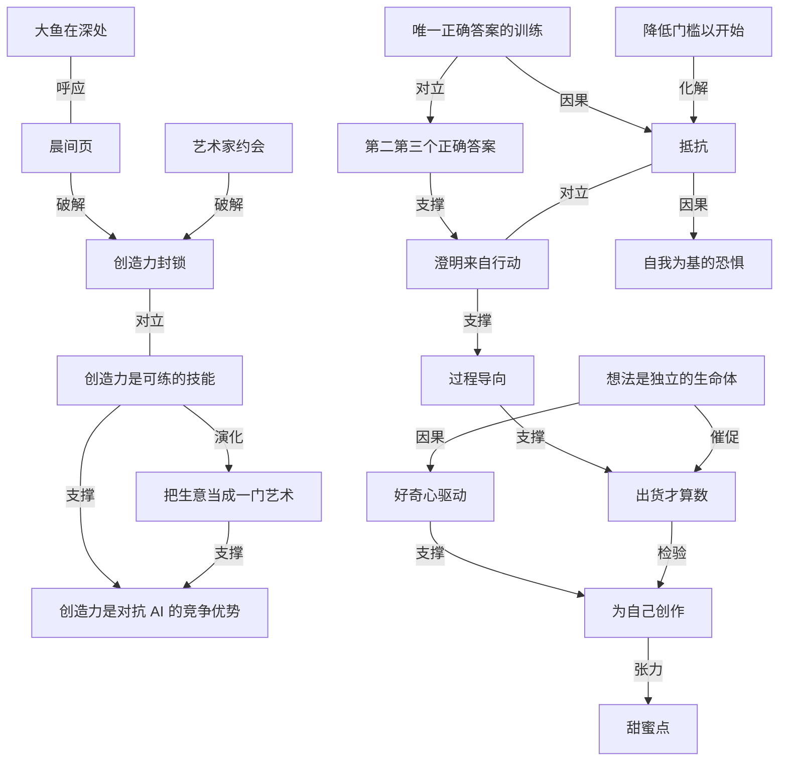

# 研究创造力 365 天，我学到了什么

- 原文标题：I studied creativity for 365 days & here’s what I learned.
- 作者：Deya
- 内参日期：2026-09-22
- 来源类型：YouTube
- 原文：https://www.youtube.com/watch?v=qITpEEGskck
- 标签：创造力, 个人成长

> 作者认为创造力将是创作者和小企业主对抗 AI 的最大竞争优势，视频里分享了她一年来读过、启发最大的几本创造力相关书籍与最大收获。

## 导读

创造力

## 核心观点

- 作者用一整年沉迷研究创造力，出发点是一个判断：在人人都能用同一批 AI 工具的世界里，创造力会是对抗 AI 的最大竞争优势。「你的思考方式、你把事物组合起来的方式，就是你的超能力。」
- 她拿自己的经历做证据：第一个真正爆的视频讲 cozy entrepreneurship（松弛感创业），这个概念是她自己从游戏这个完全不相干的领域里看到的东西迁移过来的；一个创意就给整个频道定下了不一样的色调，后面的一切势能都从那里来。
- 全篇的结构是六本书 + 每本书的最大收获，但贯穿其中的是同一条主线：创造力是可练的技能，练法是清理（清理心智垃圾、清理恐惧与自我怀疑），然后行动（降低门槛、出货、在过程中获得澄明），而不是等到想清楚、准备好、有了完美方案再开始。
- 她最后把这条主线收回到商业上：一旦开始把生意当成一门艺术来看，一切都变了——产品、营销、和受众说话的方式都变成了创作题，「创造力与创业的契合度如此之高，我很震惊居然没有更多人把创造力当成创业者的技能来谈」。

## 《The Artist's Way》：创造力是技能，不是天赋抽签

- 最大收获：创造力是一种技能，100% 可以练、可以学。她过去以为创造力是「你要么是，要么不是」的先天属性，这本书让她确信不是。
- Julia Cameron 的核心判断是：大多数人不是没有创造力，而是被堵住了（blocked）。堵住的原因是我们长成了「做正经事的正经大人」——觉得创造、艺术这类东西轻浮、不重要——并在这个过程中累积起越来越多的恐惧和自我怀疑。
- 因此解法是清理，而清理只能靠持续的练习：「即使不想做也照样出现」才是长出创造力肌肉的方式，这一点对任何技能都成立。作者反复强调：你天生就有创造力，不管你认不认为自己有，那颗种子就在你身体里。

### 练习一：晨间页（morning pages）

- 原始定义是每天早上手写三页的脑内倾倒（brain dump）。Cameron 极力主张手写；作者自己做不到，就改成打字，理由很务实：「要么我做，要么我不做，做总比不做好。」
- 她的做法：一个叫 Artist's Way Morning Pages 的 Google Doc，白天想起来就打开打字，完全的意识流，不编辑、不过滤、不真正思考，打满一页（打字一页约等于手写三页）。
- 目的是把脑子里的垃圾清出去。我们每天从社交媒体、从人群里吸进大量信息，全堆在脑子里；晨间页就是「全都倒出来，倒干净，让脑子真正空下来」——空出来之后，才谈得上解决问题和接收新想法。
- 她按 12 周挑战完整做了一遍，本来完全没指望对生意有帮助（「我不知道创造力和商业能有多大关系」），结果生意想法、产品想法、内容想法源源不断。cozy entrepreneurship 这个词，她几乎可以确定就是第一次写在晨间页里的。
- 她总结出的晨间页三层结构：
- 第一层是表层垃圾：脑子一天循环上百次的琐碎焦虑。她举了 1 月 7 日那页为例——今天要拍视频、找不到 USB 转接头、觉得自己浪费了好多时间好挫败，写着写着自己纠正自己：其实还有两小时，够拍了，我该对自己好一点。这些东西如果不倒出来，就会被带进拍摄现场，变成「我很烂、这事很烂」的心境。
  - 第二层是被日常忙碌推开的深层问题。有一次她写着写着写出「我想给全团队做一份讲大局、讲团队文化和价值观的正式材料」，接着自问「只招 A+ 选手、标准极高，这到底意味着什么」，随手写下的这一堆，后来直接变成了她现在给所有新人做入职用的团队价值观材料。她认为如果不倒成文字，这个想法不会以具体形态出现。
  - 第三层才是创意流动：心智终于空到能给新想法腾出位置。她的 pop culture business（把流行文化和商业课结合）就是这样冒出来的，后来成了 Instagram 和 TikTok 上的一条内容线。
- 她的一条关键手法：打得越快越好——不停、不退格、不编辑、不想自己在写什么。哪怕是重复「我不知道该写什么我不知道该写什么，哦我刚听见一只鸟」，也照打不误。打到足够快、足够意识流时，会冒出自己都没意识到的东西：「哇，等等，原来我是这么想的？」
- 成本很低：一次 5 到 10 分钟。她现在漏掉一次晨间页会难过，因为错过了一次和自己连接、看看自己在什么状态的机会。

### 练习二：艺术家约会（artist dates）

- 每周空出一到两个小时，带自己去约会，与内在的艺术家连接：野餐、在公园看书、逛书店、长距离散步、二手店淘货、喝抹茶——形式随意，硬规则只有一条：不许叫别人。
- 「如果要去野餐，不如叫上谁一起」是最容易的滑坡，但一旦叫人，和自己的独处质量就没了。
- 她把这件事反问成一个更尖锐的问题：你上一次认真地给自己留出高质量时间是什么时候？「然后我们还纳闷为什么自己和想法失联、和自己失联。我们根本没有留出那个时间。」
- 面对创业者最常见的质疑——这算不算浪费时间、这些事的 ROI 怎么量化——她的回答是：你的生意的地基是你自己。如果你不被滋养、不被满足、没有创造力、不快乐、和自己失联，背着一堆情绪包袱和负面自我对话，和自己没有一段可信任可相爱的关系，那你的生意还剩什么地基。

## 《Keep Going》：创作是乱的，澄明只能来自行动

- 最大收获：艺术、创作这件事本身就是乱的（messy）。这话对 A 型人格不好听——她自己就想先知道计划、先知道第一步第二步第三步、开始之前先要清晰。
- 但创造力不是直线，不是那种可以周对周追踪和度量进度的东西。它是尝试、失败、学习、再尝试的混乱过程，每一次尝试都在教大脑一些新东西——那是数据。
- 她的亲身案例：做 YouTube 做了好几年就是不起来。所有人说该做的战略动作她都做了，规矩全守，方法全对，就是没用。到某个点上她判断必须来点根本不同的东西，但「是什么」并不清楚，而没有清晰她就不知道怎么行动。
- 打破僵局的认知是：清晰只能来自行动。于是他们开始乱试——不同的封面风格、标题风格、选题方式——慢慢试出一个新方向，「这个感觉对我们是对的，对观众也是好的」，视频数据随之大幅变好。如果不做那个乱糟糟的步骤，这个结果不会出现。
- 由此她把注意力放在创作的系统和过程上，而不是结果：我们能尽力，但控制不了结果。她控制不了这支视频表现如何、控制不了产品和服务在市场上的表现，但她能控制验证、调研、能控制自己练创造力、从过去的视频里学习。越能爱上创作的过程越好。
- 这本书她带走的一句话：「做出你能做出的最美的东西，每天都试着这么做。就这样。」

## 《A Whack on the Side of Your Head》：找第二个、第三个正确答案

- 最大收获：我们在长大过程中学会了一堆创造力的阻断器，其中最狠的一条是——被教会「只有一个正确选项」，必须拿到正确答案。
- 罪魁之一是学校系统：选择题也好、论述题也好，我们永远在找那个完美答案以换取好成绩。于是创造力被训练掉了，脑子里只剩「什么才是对的、哪条才是唯一该走的路」。
- 书里那个她最喜欢的例子：老师在白板上画一个黑点问孩子们这是什么，孩子们的答案又怪又多——是瓢虫、是你的眼睛、是太阳。同样的题目放到一屋子成年人面前，全场沉默，最后有人说「就是一块板上画的一个黑点啊」，所有人点头称是。
- 差别在于：孩子不怕选错、不怕说错，觉得它可以是任何东西；成年人怕的是「我不想显得像个白痴」。这种恐惧直接影响我们长大后在内容、生意、艺术上试新东西的意愿——怕被看成错的、怕被说「这也太蠢了吧」。
- 于是我们把自己框死成「只有一个答案，我得先找出那个答案；找不出来那不如别做了」。
- 这本书给的挑战就是：去找第二个、第三个、第四个正确答案。比如问「卖我的产品最好的方式是什么」，第一个答案可能是做销售漏斗、免费引流品加邮件培育——那大概就是所有人都会说的那个。那么第二个正确答案是什么？也许改成先做一个免费测验。再下一个呢？
- 头脑风暴里没有错误答案，你只是在练这项技能。作者引书里的判断：第一个选项往往是最显而易见、也最没创造力的那个。

## 《War of Art》：跟着恐惧走，与抵抗共处

- 最大收获：follow what you fear——恐惧是一个非常重要的指示器。书里反复讲的核心是抵抗（resistance）：「不行，我不能，我怎么可能，我不该，那太……太过了。」她创业、做自由职业、做训练营、开 YouTube，每一次都是疯狂到不真实的抵抗。
- 书里的判断很反直觉：你被恐惧瘫住了吗？那是个好迹象。恐惧是指示器，恐惧在告诉我们该做什么。
- 这里说的不是生物性恐惧（怕熊那种）。现代社会里大多数人没有生存性恐惧，有的是自我（ego）层面的恐惧——怕失败、怕被拒绝、怕东西表现不好、怕被抛弃。这些担心都成立，但「我们的梦想比这些恐惧更大，你最好的人生值得你穿过这些恐惧」。
- 她把这件事推到尽头来看：一百年后我们都不在了，那些人怎么想、随口说了什么，对你有没有活出想要的人生没有任何意义。你不会想在生命尽头说「我太怕别人怎么说，所以没敢去做那件我深深被召唤去做的事」。
- 抵抗很狡猾，常常不以「我不做」的形式出现，而是「我以后再做」「等我准备好了就做」。所以重点不是消灭抵抗——它可以非常大声非常强硬——而是与它共处、穿过它、不把它太当真。如果总在等完美时刻、等完全清晰，这个频道不会存在，她的生意不会存在，钱一分赚不到，连猫都不会养（因为会等到「感觉完全准备好了」才去领养）。
- 一条重要的强度规律：工作越重要，你感到的抵抗越大。反过来说，抵抗越大，这件事对你实现梦想的影响可能越大。对照组是刷 Pinterest 找灵感十万小时——你对它毫无抵抗，一想就觉得有意思，但它基本不产生影响，因为它不是行动。
- 抵抗的话术在所有人嘴里长得一模一样：我不够聪明、不够年轻、不够老、不够有创造力、不够有经验、我凭什么、比我懂的人太多了、冒名顶替感、还不够完美、还没准备好、别人天赋高得多、他们领先太多我永远追不上。她的判断是：你不孤独，这些念头她全有过，还多一千条，抵抗像一座山。
- 一个识别「这件事对你其实很重要但你在否认」的好信号：看到别人拥有它时你会非常嫉妒。她看到别人做 YouTube 做起来时的反应就是「我也能啊」——那种小心眼的反应本身就是答案：那就去做啊。真正不在乎的东西，你的反应是冷漠。
- 与抵抗共处的两个具体方法：
- 降低门槛，好让自己真的开始。她能启动第一个生意，靠的是每天只承诺 15 分钟：当时她全职接自由职业活儿，时间极少，就告诉自己每天 15 分钟做自己的生意。四个月后产品做完，生意上线，当年做到六位数，最后她全职做了这门生意。有些天进入心流就远超 15 分钟，有些天就是躺在地板上想 15 分钟下一节课要讲什么。
  - 先建立例行，再谈质量（build a routine before building quality）。
- 她自己另加一条很有效的土办法：自我 pua（gaslighting myself）。第一支 YouTube 视频抵抗巨大，她是一路骗自己过来的——别担心，我们不拍，只是列个提纲，就看看提纲长什么样，绝对不拍。提纲列完、脚本写完，再说：既然提纲都有了，不如拍着玩，但不发布，放心，没人会看到，纯图个乐。

## 《The Creative Act》：为自己创作，并接受瑕疵

- 最大收获之一：create for yourself。生意人和内容创作者最容易掉的坑，是把创作当成商品——为市场做、为赚钱做、为可盈利做，最后完全变成给算法做、给别人做，而不是给自己做。
- 她给了平衡的边界：遵守你想成功的平台的规则是好的；为特定受众做产品和服务时必须把受众放在心上，这非常重要。但如果只为外部对象创作，创造力里的那点魔法会一路流失。
- Rick Rubin 的主张是：创造应当始于一个私人行为，你不是在为受众创作，你是在创作以惊喜到自己；真正的满足来自执行你的愿景，而不是播放量、点赞和粉丝。
- 为什么「为自己」反而对受众有效：能勾起你好奇心的东西，多半也能勾起别人的——除非你是完全不同的另一种人类，而大多数人在根上是相似的。对你有趣、让你兴奋、好玩的东西，大概率对别人也是。
- 她的实操是按平台分配自由度：YouTube 视频更长、更费力，需要更多验证；Instagram 视频短、门槛低，她就在那里放更多任性的、纯好奇驱动的东西。而那支播放量破百万的视频，恰恰是她抱着「这就是给我自己做的，我就是想聊创造力，太好玩了，没人看我也无所谓」的心态做的。
- 她说自己特别需要的一句话是 Rick Rubin 的这句：「成功发生在灵魂的私密处。它发生在你决定发布作品、而作品尚未接触任何一个观点的那一刻。」
- 这句话解决的是一个具体的病：作品发布前她为每一支视频骄傲，一旦数据不好就改口——「也许它没那么好吧，那支视频大概不行」。而按这个定义，成功是你勇敢到按下发布键的那一刻；此后的一切都不在你的控制范围内，你已经尽了力，你对自己作品的看法不应该被别人的评价改写。
- 当然，如果创作是你的工作、你要靠它赚钱，就还要找那个甜蜜点：你热爱的、点亮你的、你想创作的东西，与算法和人们真正愿意消费、觉得有趣有价值、能解决他们问题的东西之间的交集。
- 另一条收获：瑕疵是必需的。书里把艺术家说成不是想法的独裁者，而是容器或接收器——想法像本来就漂浮在宇宙里的信号，艺术家是那根等待并接收信号的天线。强行扭曲信号会影响输出，所以应当对一切保持开放。
- 由此，我们的角色是实验、是把「想要存在的东西」挖出来，而不是执行一份预设的、完美清晰的计划。所有的小错误、试错，都是产出好作品的必要部分。对照她自己的流程：大量封面、大量想法、大量产品和服务从未面世，那正是创作好东西的过程本身。
- 她顺势推翻一个刻板印象：生意不是机械、干燥、公司腔的东西，创业里有大量空间可以好玩、可以有创造力、可以用新颖的方式做事——而那恰恰是能脱颖而出的东西。把生意看成艺术之后，她获得的是做那些「深深被召唤去做的事」的自由。

## 《The Practice》与《Big Magic》：出货，以及想法有自己的意志

- Seth Godin 的判断很硬：除了把作品送出去，别的都不重要。东西必须进入世界才算数；要成为艺术家，东西得出得去。她引用的那句是：「我们不是因为有创造力才出货，我们是因为出货才有创造力。」
- 这句话对治的正是那种「我在做事啊，我好有创造力」的幻觉——人在自己的私人泡泡里、在笔记 App 里冒出一堆绝妙点子，如果没送出去，全都不算。
- 出货的判准是「时候到了」，不是「完美了」，所以必须设某种约束。她团队的约束是 80% 完成度：不完美，但真的很好了，花了时间在上面，够了。这本质上是 80/20——过了 80% 之后做的都是没人会注意到的微优化，那些精力应该投到下一件作品，以换取更多数据点。
- 《Big Magic》给她的概念是：想法是一个独立的实体。当一个想法想被做出来、想被生下来，它会去找一个人来生它；如果它找到你，而你因为卡住、不行动而没能生下它，它就会去找别人。
- 这个概念对她有两层作用：一层是荣幸——想法想被做出来，而它选了我，把它带到世上是我的职责；另一层是紧迫——我不做，它就去找会做的人。她顺带提到一个模糊记得的说法：某位著名艺术家（她猜是 Prince）一有歌的想法就必须立刻录下来，因为如果不立刻录，这个想法就会跑去找 Michael Jackson，让他录了她的歌。
- 另一条主张是：创造力应当由好奇心驱动，而不是恐惧驱动。与其不停追问「这个够好吗」，不如让好奇心带路，去追你真正感兴趣的东西，而不是你逻辑上认为会成的东西。
- 她自己屡屡栽在这一点上：按战略、按逻辑去做「应该会成」的东西，往往不成；只有跟着自己真正好奇的东西走（那支创造力视频就是最典型的例子），事情才成——因为里面有更多的爱、更多的魔法、更多的投入。
- 收尾判断：创造力偏爱对想法行动快的人，所以别磨蹭。

## 《Catching the Big Fish》：想法在深处，先让脑子安静下来

- David Lynch 的看法是：最好的想法不来自过度思考，而来自一个完全「零思考」的心智状态，这样想法才流得进来——如果脑子里塞满了，就没有空间容纳新想法。
- 他的比喻是：想法像鱼，小鱼、小想法在水面附近；更大的鱼要深得多。要够到大鱼，你得往自己的内部更深处去找。
- 作者认为这与晨间页彼此呼应：持续往下倒、往深处挖，本身就是在认识自己。
- 核心动作是让脑子安静一点，找到更多内在的静默与清明。问题在于大多数人的心智太杂太吵，够不到那些深处的想法。Lynch 因此极力主张超觉静坐（transcendental meditation）——心真正静下来时，才接得到最好的想法。
- 作者的态度是开放而实验性的：她自己最近确实在增加冥想，好奇会带来什么。她把这一整套策略概括成一句大白话：F around and find out（瞎折腾，然后看看会发生什么）。

## 概念网络

### 关键概念

#### 创造力是可练的技能

**context**：全片的地基命题，来自《The Artist's Way》。作者原本以为创造力是「你要么是，要么不是」的先天属性，读完后确信「it's a skill，练得越多越好」，并说这一点在她自己的创作实践里得到了验证。这个命题把创造力从身份问题转成了训练问题。

**费曼一下**：别再问「我是不是一个有创造力的人」，这问题没有答案也没有用。换成「我今天练了吗」。创造力和跑步、写代码一样，是一块肌肉：你一周练三次，三个月后它就在；你从不练，它就萎缩。天赋决定的是起跑线，不是终点。

#### 创造力封锁

**context**：Julia Cameron 的核心诊断——大多数人不是缺创造力，而是被堵住了（blocked）。堵塞的成因是我们变成「做正经事的正经大人」，觉得创作和艺术轻浮、不重要，并在过程中累积恐惧与自我怀疑。因此所有练习的目标不是「获得」创造力，而是「清理」通道。

**费曼一下**：水管不出水，通常不是因为没有水，是因为管子堵了。你身上那颗种子一直在，挡在前面的是「这有什么用」「我这个年纪了」「万一被笑话」。所以创造力训练的大半工作不是往里加东西，而是往外掏东西。

#### 晨间页

**context**：《The Artist's Way》的第一个具体练习——每天三页手写的意识流脑内倾倒（作者改成打字一页，理由是「做总比不做好」）。目的是清出心智垃圾，让脑子空到能解决问题、接收新想法。作者的 12 周实践里长出了 cozy entrepreneurship、团队价值观材料、pop culture business 等一连串产物。

**费曼一下**：每天早上把脑子里循环了一百遍的那些碎念全部倒进一个文档，不修不改不回读。前几行一定是废话（找不到充电线、今天来不及了），倒完废话，被你推开的大问题会浮上来；大问题写完，新点子才有地方站。它像倒垃圾——不是为了欣赏垃圾，是为了腾出屋子。

#### 不编辑地快写

**context**：作者总结的晨间页关键手法——打得越快越好，不停、不退格、不编辑、不思考自己在写什么，哪怕重复「我不知道该写什么」也照打。她的经验是：快到足够意识流时，会冒出自己都没意识到的东西，「哇，等等，原来我是这么想的？」

**费曼一下**：编辑和创作是两个互相打架的动作，一边写一边改，等于一只脚踩油门一只脚踩刹车。把速度提到编辑器来不及上线的程度，潜意识才有机会插话。写得难看没关系，那不是成品，那是原料。

#### 艺术家约会

**context**：《The Artist's Way》的第二个练习——每周一到两小时，一个人去做任何滋养自己的事（公园、书店、散步、二手店），硬规则是不许叫别人。作者把它扣回一个反问：你上次认真给自己留出高质量时间是什么时候？面对 ROI 质疑，她的回答是「你的生意的地基是你自己」。

**费曼一下**：你不可能和一个从不见面的人建立深度信任关系，和自己也一样。约会的关键不是去哪儿，是「只有你」——一旦叫上朋友，注意力就流向社交，那一小时就不再是你和自己的。它不产出内容，它产出的是那个能产出内容的人。

#### 澄明来自行动

**context**：《Keep Going》给作者解的死结。她的 YouTube 停滞多年，知道必须做根本不同的事，但没有清晰方案就不敢行动。破局认知是 clarity only comes from the action——他们先乱试封面、标题、选题，才试出新方向。

**费曼一下**：你以为顺序是「想清楚 → 行动」，实际顺序常常是「行动 → 想清楚」。计划能算出的东西，早就被所有人算过了，那就是所有人都在做的事。真正新的方向只能从乱七八糟的尝试里长出来——你必须先走进雾里，雾才会散。

#### 过程导向

**context**：《Keep Going》的另一条收获。创造力不是可以周对周度量进度的直线，而是尝试、失败、学习、再尝试的乱过程，每次尝试都是给大脑的数据。作者的分界线是控制力：控制不了视频表现和市场反馈，能控制的是验证、调研、练创造力、从旧作里学习。

**费曼一下**：把注意力放在你能控制的输入上，而不是你控制不了的输出上。数据好不好由市场说了算，但「今天有没有认真做一件像样的东西」完全由你说了算。前者让你焦虑且无力，后者让你复利。

#### 唯一正确答案的训练

**context**：《A Whack on the Side of Your Head》诊断的创造力阻断器——学校系统训练我们永远去找那个能拿高分的完美答案，长大后就只会问「什么才是对的」。黑点实验是最锋利的证据：孩子说它是瓢虫、是眼睛、是太阳，成年人集体沉默后得出「就是板上一个黑点」。

**费曼一下**：成年人不是变笨了，是变怕了——怕显得像个白痴。十几年考试训练出的条件反射是：错误有成本，猜测不划算。于是我们默认每个问题只有一个正确出口，找不到就干脆不出门。

#### 第二、第三个正确答案

**context**：同一本书给出的解法与挑战——找第二个、第三个、第四个正确答案。作者举例：卖产品的第一个答案是免费引流品加邮件培育漏斗（也就是所有人都会说的那个），那么第二个答案呢？也许先做一个免费测验。书里的判断是「第一个选项往往最显而易见、也最没创造力」。

**费曼一下**：不要在第一个可行方案处停下——那通常是行业共识，也就是最拥挤的地方。逼自己再产出三个「也对」的答案，好点子往往排在第三、第四位。头脑风暴里没有错误答案，你只是在练这项技能。

#### 抵抗

**context**：《War of Art》的核心概念——那个说「不行、我不能、我不该、那太过了」的声音。它常以温和形态出现（「我以后再做」「等我准备好了」），所以更难识别。作者的处理原则是：不删除它，而是与它共处、穿过它、不太把它当真。

**费曼一下**：抵抗不是懒，懒不会伪装。抵抗会给你很像样的理由：时机不好、还没准备好、再打磨打磨。识别它的窍门是看它总在什么时候出现——它只挡你最想做的那扇门。

#### 抵抗强度即重要性信号

**context**：《War of Art》的判断——工作越重要，抵抗越大；反过来，抵抗越大，这件事对实现梦想的影响可能越大。对照组是「刷 Pinterest 找灵感十万小时」：零抵抗、也几乎零影响。作者还给了一个辅助识别信号：看到别人拥有它时你会强烈嫉妒，说明你在否认它对你很重要；真不在乎的东西，你的反应是冷漠。

**费曼一下**：把恐惧当罗盘用，而不是当红灯用。你最不敢点开的那个文档，通常就是最该做的那件事；你刷得最顺手的那件事，通常就是最没影响的那件事。嫉妒是同一套仪表的另一根指针——它在替你说出你不肯承认的愿望。

#### 自我为基的恐惧

**context**：《War of Art》里作者特意做的区分——现代社会中的恐惧大多不是生存性的（怕熊），而是 ego 层面的：怕失败、被拒绝、表现不好、被抛弃。她给出的量级参照是「一百年后我们都不在了」，那些路人的评价对你有没有活出想要的人生毫无分量。

**费曼一下**：怕熊是身体在救你的命，怕被人笑是自我在保护自己的形象。前者值得听，后者只在你把形象看得比人生重要时才有力量。把时间轴拉长到一百年，几乎所有让你不敢按发布键的理由都会消失。

#### 降低门槛以开始

**context**：《War of Art》给出的第一个与抵抗共处的方法，作者用它启动了自己的第一门生意：全职做自由职业时，每天只承诺 15 分钟做自己的生意；四个月后产品做完、上线，当年做到六位数，最终成为她的全职事业。配套原则是「先建立例行，再谈质量」。她另有一招土办法：自我 pua——「我们不拍，只是列个提纲」「拍着玩但不发布」，一步步骗自己走完全程。

**费曼一下**：抵抗是按「任务体积」报价的，你把任务切到 15 分钟，它就收不到多少钱。门槛低到你无法拒绝时，开始就发生了；而开始之后往往会超额完成，因为难的从来是启动不是持续。骗自己「这只是玩玩，不会发出去」，本质上是同一招。

#### 为自己创作

**context**：《The Creative Act》的主张——创造应始于私人行为，你不是为受众创作，你是在创作以惊喜到自己；真正的满足来自执行你的愿景，而非播放量与粉丝。作者的推论是：能勾起你好奇的东西，多半也能勾起别人的，因为人在根上相似。她那支破百万播放的视频，正是抱着「就是给我自己做的，没人看也无所谓」的心态做的。

**费曼一下**：完全为算法做的东西会有一种可闻到的味道——正确、无聊、谁都能做。「我自己想看」是一个比任何选题公式都稳的信号，因为你不是外星人，你觉得有意思的事，总有一群人也觉得有意思。

#### 甜蜜点

**context**：作者对「为自己创作」的现实修正。她承认如果要靠创作谋生，就必须在两件事之间找交集：点亮你的、你真正想创作的东西，与算法和人们确实想消费、觉得有价值、能解决他们问题的东西。遵守平台规则、为特定受众做验证都是必要的，但必须留出一块属于自己的空间。

**费曼一下**：纯为自己做叫爱好，纯为市场做叫代工，两者的交集才叫作品。实操上她的解法是按平台分配自由度：高投入的渠道多做验证，低门槛的渠道放任好奇心撒野——让实验有个不会赔上全部的场地。

#### 艺术家是接收器

**context**：《The Creative Act》的模型——艺术家不是想法的独裁者，而是容器或接收器；想法像本就漂浮在宇宙里的信号，艺术家是那根等待并接收信号的天线。强行扭曲信号会影响输出。由此推出的角色定位是：实验、挖出「想要存在的东西」，而不是执行一份预设的完美计划。

**费曼一下**：与其把创作想成「从零发明」，不如想成「调频」。你的工作不是硬造一首歌，而是把杂音调掉，直到某个本来就在那里的信号变清楚。这会让「我要想出一个绝妙点子」的压力，变成「我要保持开放和安静」的姿态。

#### 瑕疵的必要性

**context**：《The Creative Act》的另一条收获——所有小错误和试错都是产出好作品的必要部分。作者的佐证是自己流程里大量从未面世的封面、想法、产品和服务：那些看不见的废稿就是创作好东西的过程本身。

**费曼一下**：成品是冰山露出水面的部分，废稿是水面下的体积。没有那堆废稿，那个尖顶就浮不起来。所以别把试错当成浪费，它是成品的成本项，不是事故。

#### 出货才算数

**context**：《The Practice》的硬判断——除了把作品送出去，别的都不重要；「我们不是因为有创造力才出货，我们是因为出货才有创造力」。它对治的是「我在笔记 App 里冒出一堆绝妙点子」的幻觉。配套的判准是「时候到了就发，不是完美了才发」，团队约束是 80% 完成度，剩下的微优化没人会注意，精力该投给下一件作品以换更多数据点。

**费曼一下**：没发出去的作品，对世界来说等于不存在，对你来说也等于没有学习——因为你拿不到任何反馈数据。所以把「完美」换成一个截止线：80% 就发。多做一件作品的收益，永远大于把这一件从 80 分磨到 85 分。

#### 想法是独立的生命体

**context**：《Big Magic》给作者的概念——想法是一个独立实体，当它想被生下来，就会去找一个人来生它；如果你因为卡住而不行动，它会去找别人。她的双重感受是荣幸（它选了我）与紧迫（我不做它就走）。她提到某位著名艺术家（她猜是 Prince）一有歌的想法就必须立刻录，否则「这个想法会跑去找 Michael Jackson」。

**费曼一下**：这是一个功能性的比喻，不必当形而上学信。它的用处是把「我以后再说」的成本变得具体：几年后你在别人那里看到一模一样的东西，然后说「这本来是我的想法」。想法有保质期，而保质期由别人的行动速度决定。

#### 好奇心驱动而非恐惧驱动

**context**：《Big Magic》的另一条主张，也是作者反复栽跟头后的结论。与其不停追问「这个够好吗」，不如让好奇心带路，去追真正感兴趣的东西，而不是逻辑上认为会成的东西。她按战略逻辑做的往往不成，跟着好奇做的（那支创造力视频）反而成了，因为里面有更多的爱和投入。收尾判断是：创造力偏爱对想法行动快的人。

**费曼一下**：恐惧驱动的问题是「这个够好吗」，好奇驱动的问题是「接下来会怎样」。前者让你反复修改同一件东西，后者让你不断开始新东西。而创作这件事的回报，恰好是按开始的次数发放的。

#### 大鱼在深处

**context**：《Catching the Big Fish》的核心比喻——最好的想法不来自过度思考，而来自接近「零思考」的心智状态；小想法像小鱼在水面附近，大想法是深处的大鱼，要够到它们必须往自己内部更深处去。障碍是大多数人的心智太杂太吵。David Lynch 因此极力主张超觉静坐。作者认为这与晨间页彼此呼应，并把整套策略概括成 F around and find out。

**费曼一下**：脑子塞满时，新想法没有落脚点。安静不是什么玄学，它只是给深层的东西一个浮上来的机会——你不去捞鱼，你只是不再把水搅浑。晨间页往外倒，冥想往下沉，两件事做的是同一件事：腾出空间。

#### 把生意当成一门艺术

**context**：作者把全部创造力主线收回商业的落点。她认为生意不是机械、干燥、公司腔的东西，创业里有大量做新事、做好玩事的空间——而那恰恰是能脱颖而出的东西。一旦开始把工作看成创作（新产品、新营销、新的和受众对话的方式），她获得的是去做那些「深深被召唤去做的事」的自由。她的开篇判断与此闭环：人人都用同样的 AI 工具时，创造力是拉开差距的东西。

**费曼一下**：如果生意只是执行最佳实践，那所有人执行到最后会长得一模一样——这正是 AI 最擅长的赛道。把它当艺术看，问题就从「标准答案是什么」变成「我能做出什么别人做不出的东西」。这不是文艺化的修辞，而是差异化的唯一来源。

### 概念网络

整张网络有一个总入口和一条主干。总入口是那句判断：当所有人都能调用同样的 AI 工具，差异只能来自你怎么想、怎么把东西组合起来——创造力因此从「艺术家的事」变成「每个做事的人的事」。主干则是一条清理—行动—出货的链条，六本书分别负责链条上的一段。

**第一段是身份问题的拆除**。「创造力是可练的技能」与「创造力封锁」构成一对正面对立：只要还相信创造力是天赋抽签，所有练习都没有理由；一旦接受它是技能，问题就从「我有没有」变成「什么堵住了」。晨间页和艺术家约会是这一段的两个作业，前者清理心智垃圾（倒出表层碎念 → 浮出深层问题 → 腾出创意空间的三层结构），后者恢复与自己的关系。它们同属「清理」，方向相反：一个往外倒，一个往里蓄。

**第二段是行动论的三重合流**。三条独立的线索最后指向同一个动作。其一是《Keep Going》的「澄明来自行动」：计划算不出新方向，新方向只在乱试里长出来。其二是「唯一正确答案的训练」的解毒剂——找第二、第三个正确答案；黑点实验展示了这套训练的代价，而第一个答案永远是最拥挤的行业共识，所以摆脱它的方式不是想得更久，而是产出更多候选、再去试。其三是「抵抗」：学校训练出的怕错，正是抵抗的温床，而抵抗最擅长的伪装恰恰是「等我想清楚了再做」——它与「澄明来自行动」构成全片最实质的一组张力，因为抵抗要求的前提，正是行动论宣布不存在的那个东西。

**第三段是与恐惧共处的机制**。抵抗往下分解成「自我为基的恐惧」，向上则给出一个可用的读数：抵抗越大，事情越重要（嫉妒是同一根指针的另一种读法）。破法不是消灭它，而是降低门槛把它的报价压到你付得起——15 分钟每天，四个月一门生意。这条线解释了为什么全篇反复强调「先建立例行，再谈质量」：例行绕开了恐惧的谈判桌。

**第四段是动机与交付的闭环**。「想法是独立的生命体」同时产出两个后果：向内变成好奇心驱动（追你感兴趣的，而不是逻辑上该成的），向外变成紧迫感——不做就被别人做了，直接推向「出货才算数」。而「为自己创作」与「甜蜜点」之间存在张力而非矛盾：纯为自己是爱好，纯为市场是代工，作者的解法是按平台分配自由度，让实验有个赔得起的场地。出货在这里还承担了检验职能：它是把「为自己创作」从自我陶醉里区分出来的唯一方式——没送出去的作品既不算创作，也拿不到任何数据。「过程导向」在这一段与出货合流：既然控制不了结果，就把 80% 完成度当成交付线，把省下的精力换成下一个数据点。

**最后是收束**。「大鱼在深处」与晨间页遥相呼应，两者一个往外倒、一个往下沉，做的是同一件事——腾出空间；它也把整条链条重新接回起点：清理不是一次性工程，而是持续供给想法的前提。而「把生意当成一门艺术」是这条链条在商业场景里的落地形态，它与开篇的 AI 判断闭合成环：执行最佳实践的人终将彼此雷同，而雷同正是最容易被替代的状态。

## 费曼 x3

大多数关于创造力的建议之所以没用，是因为它们都在回答一个错误的问题：怎样才能想出好点子。而真正卡住人的从来不是点子不够，是通道堵了，以及堵住之后我们给自己找的那些体面理由。成年人在白板上看见一个黑点只会说「那是板上画的一个黑点」，孩子却能说出瓢虫、眼睛、太阳——差别不在智力，在于孩子不怕说错。我们花十几年被训练去找那个唯一正确答案，训练出的副产品是：凡是没有标准答案的事，最好别碰。

于是就有了那个最常见的死局：知道现在这条路不对，也知道必须做点根本不同的事，但「是什么」并不清楚，而没想清楚就不敢动。这个死局唯一的出口是承认因果反过来了——清晰只能来自行动。计划能推导出来的东西早被所有人推导过了，那正是所有人都在做的事；真正的新方向只能从乱试封面、乱试标题、乱试选题这些看起来毫无章法的动作里长出来。你必须先走进雾里，雾才会散。

更麻烦的是，挡在门口的那个声音很少说「我不做」，它说的是「我以后再做」「等我准备好了」。把它当懒惰处理会失败，因为它给的理由都很像样。它值得被当成仪表读数：工作越重要，抵抗越大。刷灵感图刷十万小时你毫无抵抗，它也毫无影响；那个你迟迟不敢点开的文档，恰恰标出了你真正在乎的方向。看见别人做成同一件事时那股不体面的嫉妒，是同一根指针的另一种读法——如果真的不在乎，你的反应会是冷漠。而对付它的方法不是变勇敢，是把任务切到它懒得索价的大小：每天十五分钟，四个月后产品做完了。先建立例行，再谈质量，因为例行绕开了恐惧的谈判桌。

最后一道关是发布。「我们不是因为有创造力才出货，我们是因为出货才有创造力」——这句话戳破的是那种在笔记 App 里酝酿绝妙点子的幻觉。没送出去的东西，对世界等于不存在，对你也等于没有学习，因为你拿不到任何数据。所以把完美换成一条截止线：八成就发，之后的打磨没人看得出来，那些精力该换成下一件作品。而一旦发出去，评价就不再归你管了——成功发生在灵魂的私密处，发生在你决定发布、而作品尚未接触任何一个观点的那一刻。

这些道理最终都指向同一件事：当人人手里都是同一套工具，能被最佳实践算出来的东西会迅速趋同，趋同就意味着可替代。剩下能拉开差距的，只有你自己好奇的东西、你愿意为它承受抵抗的东西、以及你真的把它做出来送了出去。把手上的事当成一门艺术看，问题就从「标准答案是什么」变成「我能做出什么别人做不出的东西」——这不是浪漫化的说法，这是差异化仅剩的来源。

## 阅读原文

I have been obsessed with studyingcreativity because I think it's going tobe our biggest competitive advantageagainst AI. In a world where everyonehas access to the same AI tools,creativity is the thing that is going toset you apart. Your way of thinking,your way of putting things together isyour superpower.

My first like viralvideo was a video about cozyentrepreneurship, and that concept wasactually one that I came up with myselfbased off of something that I saw inanother niche in gaming, and I feel likethat one creative idea set the momentumfor everything that followed for ourchannel because it really gave us adifferent shade. So, let me talk youthrough my favorite books and my biggesttakeaways from each one.

So, the firstone is the iconic The Artist's Way. Ifreaking love this book. Let me justshow you how well-loved this book [is.So](http://is.so/), I feel like the first thing that Ilearned from this book is thatCreativity is a skill, and it can 100% bepracticed and learned. I used to thinkthat being creative was just somethingyou were or you weren't, like it wassomething you were born with, and thisbook just showed me like it’s not true.

It’s not true. It’s a skill. The moreyou practice it, the better you get, andI’ve truly seen that in my creativeendeavors. So, Julia Cameron in thisbook, she talks a lot about how you haveto do things to unlock your creativitybecause most of us are very blocked from ourcreativity. And two techniques she talksspecifically about in this book that Ilove are morning pages and artist dates.

And I’ll go into what those are in asecond. And the reason we need tounblock the creativity is because webecome sensible adults doing sensibleadult things, and we’re like, "Oh,creativity, art, stuff like that isfrivolous. It’s not important." And westart to develop more and more fears andself-doubts around a lot of things, andThose are all things that need to becleared, and they need to be clearedthrough consistent practice. So, showingup even when you don't feel like it iswhat builds that creative muscle, whichis really true for any skill. You areinherently creative. Whether you thinkso or not, you are inherently creative.

You have that seed inside of you. So,let's talk about the specific practicesshe mentions in this book. The first oneis called morning pages. Who's on thestove?Are you allowed to be up there? So,morning pages are essentially threepages of handwritten, essentially likebrain dump every single morning. So, youjust get up and you start brain dumpingthree pages. She really is a bigproponent of handwriting it. For me, Ijust can't do it. I think my armarm muscles are just like non-existentanymore because I never hand write. So,I personally type it, which I know shesays not to do, but I’m like, either IDo it, or I don't do it,and I think doing it is always better than not doing it.

So, I personally have a Google [Doc.It](http://doc.it/)'s titled like Artist's Way Morning Pages.And sometimes during the day, I open that document and I type,essentially brain dump, completely stream of consciousness, no editing, no filtering, no real thinking happening.I just type for, I try to do like one page typed, because one page typed is like three pages handwritten.And the purpose of that is to clear out all the mental garbage essentially because, you know,as you, especially in, I feel like our world, we're like taking in new information all the time, social media,people, like all this stuff is being accumulated in your brain. Your brain islike holding all this stuff that you'refeeding in every day. I feel likemorning pages are a really goodopportunity to be like, get that all out.

Get it all out so that your brainis actually clear and now it can.

Actually, the goal is to solve problems and receive newideas. So, I did this book as a 12-weekchallenge to get back in touch with mycreativity, and I didn't actually expectit to help much with the business because Iwas like, I mean, I don't know howmuch creativity actually has to do withbusiness. It helps so much with mybusiness. I got so many business ideas,product ideas, content ideas. I'm prettysure, actually, the term cozyentrepreneurship,I wrote for the firsttime in morning pages. So, here's kindof my guide on morning pages, based onhow I've been doing them. So, the firstthing I do is I just literally stream ofconsciousness-type everything going onwith my brain to clear out all thesurface-level junk. You know, the stuffthat your brain is looping over ahundred times in a day, and you're all ofthis is new, but really, it's just threethings. I feel like a lot of surfacelevel worries come up here at thispoint. Like you can see here, January.

7th, I have to film a video today. Icouldn't find my USB connector. I feelso frustrated right now. Like I justwasted so much time. That's not true. Istill have two hours, which is plenty oftime to film this video. I should be abit kinder. Everything. Like that's mysurface level stuff, basically. And thatstuff, if it's not out, it likecirculates in my brain over and over,and I carry it into the filming, whichis like it's not a nice way to film, tobe like, I suck, and this sucks, and Iwasted so much time. Like,

get it out. And then what tends tohappen after the surface-level junkcomes out is the deeper questions andworries come up. So, the big stuff thatI've kind of been like pushing away inthe day-to-day hustle and bustle runningmy business can come to the surface. So,for example, one thing that came up inone of my morning pages was I was like,I want to make a proper big picture deckfor the whole team and team culture andValues. Like, what does that mean? Whatdoes it mean to be working on our team?

What does it mean to be hired onto ourteam? Like, I only hire A+ players. Ihave extremely high standards. What doesthat mean? I care deeply about our work,our differentiators, how much we careabout the work and doing a good job. Ilike wrote all of this just randomly offthe top of my head. And that led me tomaking our team values deck, which I nowuse in onboarding all team members. Andit came from the morning page. It camefrom there. I don't think I would havelike concretely had that idea unless Ihad dumped it out into words and justbeen like, "Blah, blah, blah, here'swhat I think roughly should be in it."And then after that, I feel like then iswhen the creativity and the ideas beginflowing because my mind is now finally

clear enough to like make space for newideas. So, you can see here in one of mymorning pages, I actually had this idealike, "Oh, what about pop cultureContent or pop culture business?" WhereI merge like pop culture and businesslessons, and then we started makingthose on Instagram and on TikTok. So,that's where that idea came from. Now, Ithink one thing that really worked forme with morning pages is to just type asfast as I could. So, don't stop, don'tbackspace, don't edit, don't think aboutwhat you're writing, just type. Even ifyou're just repeating the same thing,like, "I don't know what to say, I don'tknow what to say, I don't know what tosay. Oh, I just heard this bird.

Just type like that. Type as fastas you can, because I feel like oftentimes I found that when I typed likethat fast, it is so stream ofconsciousness that stuff comes up that Ididn't even consciously realize. Like,I'll just be typing, "Blah, blah, blah,blah, blah, blah, blah, blah, blah,blah, blah." And then I'll be like,"Whoa. Wait, what? That's what I think?"Try the morning pages. Try them for justA week and see how you feel. I feel likeit is such—I don't know. I feel likeit's like one of those things you’re

like, "Hmm, I'm not sure." And then youdo it and you're like, "Ah, yes." Likeeven now when I miss a morning page, I’mlike, I’m sad that I missed out on thechance to like connect with myself andsee where I’m at. And I will also say itdoesn’t take me that long. It takes likemaybe 5, 10 minutes. I feel like you canmanage 5, 10 minutes a day. Second thingthat Julia Cameron talks about, otherthan morning pages, is artist dates. So,essentially taking yourself on a date.

So, blocking out an hour or two everyweek, take yourself on a date to connectwith your inner artist. And it can beyou can go out and do anything you [want.You](http://want.you/) can go for a picnic, read in thepark, you can go to the bookstore, youcan go on a long walk, experiences likethat where it's really just one-on-onewith yourself. Don't invite otherpeople. It's so tempting to be like,"Oh, well, if I'm going for a picnic, Imight as well invite someone else."Like, no, it's just you so that you canhave that quality time with yourself.

And that's my question, too. When's thelast time you took quality time withyourself seriously? And then we wonderwhy we're not connected with our ideas,we're not connected with ourselves. We'renot blocking the time. We're notblocking the quality time. How can youexpect to have a deep, loving, trustful,creative relationship with someone thatyou never spend time with? So, myfavorite artist date, I get matcha, I goto the park, I go for a walk, I go tothe bookstore, I go thrift shopping.I love spending time with myself. And Imean, I feel like a lot of businessowners at this point are going to belike, "Yeah, but isn't it a waste oftime? Like, can you really quantify theROI of doing these things?">> [music]>> To that, I will just sayThe foundation of your businessis you.

If you are not nourished, fulfilled,creative, happy, in touch with yourself,and you have tons of emotional baggage,negative self-talk, you have no loving,trusting relationship with yourself,what is the foundation of your business?

The next book I wanted to mention isthis book by Austin Kleon, which iscalled Keep Going. And the lesson herethat I took away from it is like art,being creative, it's messy. And I knowthat's like often not the nicest thingto hear, especially if you're kind oflike me, very type A. I’m like, I wantto know what the plan is. I want to knowwhat the step one, step two, step threeis. I want the clarity before I begin.

And the reality of the situation is justlike creativity is not like that.Creativity's not a straight line whereyou're like, I can track the progressand I can measure the progress week overweek. Creativity is a messy process ofTrying and failing and learning andtrying again, and every attempt teachesyour brain something new. It's data. Andthis really reminds me of the example ofwhen I had been making YouTube videosfor years, and it just wasn't working.

And I was like, this is not working. Butlike, this is what everybody says is thestrategic thing to do. I'm following allthe rules. I'm doing it correctly. And Ijust got to this point where Iwas like, we need to do something new.

It needs to be like kind of radicallydifferent. But what is it going to be?And I don't know, I don't have theclarity. So I don't know how to takeaction without the clarity. And thetruth is, like, clarity only comes fromthe action. So we started doing a bunchof different random things, like startedexperimenting with different thumbnailstyles, title styles, content ideation,and stuff. And then slowly from there wefound a new thing to shift into that waslike, "Whoa, this feels good to us andIt's good for the audience." And thevideos started performing way, waybetter. But that wouldn't have come if Ihadn't done the messy step. And I oftentry to think about it as a systemor a process of creation — whereas much as possible, and I know it'shard, we want to focus on the process,not so much the outcome or the results.

Because we can do our best, but wecannot control the outcome or theresults. Right. I cannot control howthis video is going to perform. I cannotcontrol how my products or services willperform on the market. But I cancontrol, you know, different things,validation, doing my research. I cancontrol being creative, working on mycreativity skills, you know, learningfrom the past videos and stuff likethat. So as much as possible, the moreyou can fall in love with the process ofcreation. And a great quote from this,make the most beautiful thing you can.

Try to do that every day. That's it.

Right, next lesson is from a book. Idon't have the physical copy, but Iswear I have it on Kindle.>> [laughter]>> And it's called A Whack on the Side ofYour Head: How You Can Be More Creative,which I think is a pretty funny title.And in it, basically, this book talksabout how we have different blockers toour creativity that we learn as we growolder. And one that I loved from thisbook was he said, "As we grow older, weare essentially taught that there isonly one right option. We have to getthe correct answer." Especially in ourschooling system, if you think about

like multiple-choice quizzes and likeeven essay quizzes, like we were alwaystrying to get the one perfect answer sothat we would get a good grade. And thatkind of trains creativity out of usbecause we're always being like, "What'sthe correct thing? What's the rightthing to do? What's the one right path Ican take?" And that's just not how lifeIs. And how often, as kids, we were likecoming up with all these weird, random,creative ideas. So, one example I lovethat he gave in the book was how, like,this teacher went up to the front of a

classroom and drew a black dot onthe whiteboard and asked the kids, like,"What is this?" And the kids had, like,super weird, super creative ideas. Theywere like, "It's a ladybug. It's like,your eye. It's the sun." Like, they cameup with so many different things as towhat that dot could be, versus when thatwas done in a room full of adults, theadults were all completely silent, andthey were like, and then somebody waslike, "Yeah, it's a black dot drawn on aboard." And everyone was like, "Yeah,that's what it is." Like that's just thedifference between kids being like, not

afraid to make the wrong choice or tosay the wrong thing, being like, "It'sanything and everything." Versus adultsbeing like, "Shoot, like, what's theright answer? I don't want to seem likeAn idiot." You know? And that reallyimpacts, I feel like how we go abouttesting new things, experimentingwhen we're older, with content, with ourbusiness stuff, with art. We're soafraid of being seen as wrong or seen asthat. That's so stupid, like why did you saythat? That's obviously not right.

That. We're really limiting ourselves andconstraining ourselves to be like, "No,there's only one thing, and I need tofigure out that one thing. If I don'tknow that one thing, then it's then Imight as well not do it at all." So, thechallenge from this book is try to lookfor the second, third, fourth rightanswer. Like if you're like, "Ooh, whatis the best approach to selling myproduct?" And you're like, the firstanswer is, I don't know, like, create asales funnel that starts with, I don'tknow, a free lead magnet, and it goesinto an email nurture. Okay, maybethat's the first correct answer, andthat's like what everybody says, right?

So, what's the second correct answer?What's the next answer I could come upwith? Maybe like, I start with a freequiz instead. Okay, what's the nextcorrect answer? Like, justbrainstorming, there's no wrong answer.I think that's the most important lessonfor a lot of us to hear is like, there'sno wrong answer in brainstorming andbeing creative. You're just beingcreative, right? You're practicing theskill. And I love that he says that inthe book. He says like, the first optiontends to be the most obvious and leastcreative. All right, next one. Anotherbook I love, War of Art. The biggest

takeaway I took out of this is to followwhat you fear. Fear is a very importantindicator, and he talks a lot about,specifically, resistance. So, we allhave resistances, right? Like, thatthing of like, "No, I can't. I couldn'tpossibly. No, I shouldn't. No, that'stoo. It's too much."business. With both businesses that Istarted, with freelancing, with DMB bootcamp, with starting YouTube. Crazy,unreal resistance. And he says, "Are youparalyzed with fear?" That’s a goodsign. Fear is good, like self-doubt.

Fear is an indicator. Fear tells us whatwe have to do. Okay?Fear, I mean, I’m not talking aboutbiological fear, where you’re like,afraid of a bear. I’m talking about inour modern society, most of us do nothave survival-based fears. We haveego-based fears, right? Where we areafraid of doing something because ourego is afraid of the potentialconsequences. Like, for example, postingon YouTube, or starting a business. Ourego is fearing like, failure, rejection,something not performing well,

abandonment. All valid concerns, but ourdreams are bigger than those fears. Yourbest life is worth working through thosefears. You do not want to be at the endof your life being like, "I was soAfraid of what people would say that I didn't try to do this thing that I feltdeeply called to do." We're all going tobe dead in a 100 years. I mean, this iskind of macabre, but we're all going tobe dead in a 100 years. None of thosepeople and what they think or what theypassing comment they might make or thinkto themselves matters when it comes to

you living your dream life. And he sayslike resistance can actually be reallysneaky. It's sometimes not even like,"I'm not going to do this thing." It'smore like, "Oh, I'll do that later. I'lldo it when I'm ready." So, the pointisn't to delete the resistance becausethe resistance can be very loud and canbe very forceful. The point is to workwith it, work through it, and not takeit that seriously. If I was alwayswaiting for the perfect moment, perfectclarity, nothing would have ever gottendone. This YouTube channel would not

exist. My businesses would not exist. Wewould have made no money. I would notI have the friends that I have. I wouldnot have the relationship that I have,probably. I would not probably have thecats because I would have waited to adoptcats when we felt perfectly ready. Themore important the work, the moreresistance you will feel. So, here'skind of the graph, right? So, the biggerthe resistance, the bigger the impact isprobably to getting you to your dream.

So, for example, scrolling Pinterest forideas for 100,000 hours. You probablyhave no resistance to that. You'reprobably like, "Ooh, that sounds fun.I'm going to go do that." Okay, but itprobably doesn't have a lot of impactbecause it's not very action-based,especially if you're doing it for likeendless amounts of time, like justscrolling, right? And now, of course,creative resistance can sound like lotsof different things. I'm not smartenough. I'm not young enough. I'm notold enough. I'm not creative enough. I'mnot experienced enough. Self-doubt,Right? Who am I to do this? There's somany people who know way more than me.

Imposter syndrome. It's not perfect [yet.It](http://yet.it/)'s not ready yet. It's not blah blahblah. Other people are way more talentedthan me. They're so much more ahead ofme. It's like it's too late for me tostart. They're so far ahead of me. I’llnever catch up. Everybody's resistancesounds exactly the same. You are notalone. I had all of these thoughts plusa thousand more. I felta mountain. I can't even describe to youhow big my resistance was. It was amountain of resistance. But, you knowwhat a good sign is if something is

important to you, but you're in denialis you get really jealous when you seeother people have it. Like when I sawother people start YouTube and do wellwith YouTube, I was like, uh, like, Icould do that.Just like so petty, you know, it's like,okay, then do it. Then do it, you know?Having such a strong emotional reactionTo something means something. If youtruly didn't care about something, and Ithink he talked about this in this book.

He's like, if you truly didn't careabout something, you would beindifferent. Now, Steven recommends twospecific methods to essentially workalongside the resistance. The first oneis to lower the bar, so you actuallybegin. The only reason I was able tostart my business was because I toldmyself every single day, for 15 minutes,you're going to work on your business.

15 minutes. I was full-time freelancingat the time. I had very little time. Itold myself, 15 minutes every singleday, you're going to build your ownbusiness. And 4 months later, the product wasdone. I launched the business. It madesix figures that year. And that's thebusiness that I eventually wentfull-time into. Some days I would end upworking way more than 15 minutes, 'cause Iwas just like in the groove of it, inThe flow of it. And some days, it wasjust 15 minutes. Laying on the floor for15 minutes, thinking about the nextlesson that I was going to create. Andhe also says, build a routine beforebuilding quality. Another thing I willsay that worked really well for me isgaslighting myself. So, with my firstYouTube video, the only reason I wasable to do it, cuz again, like I said,so much resistance, I essentiallygaslighted myself every step of the way.

I was like, don't worry. We're not goingto film this video. We're just going tooutline it. Just for fun. Just to seewhat it would look like if we were tooutline it. But, we are not going tofilm this video.

Then I outlined it. I wrote the script.And then I was like, you know what?Well, I mean, the outline is there. Whydon't we just like film it for fun, butwe won't publish it. Don't worry. We’renot going to publish it. And like,nobody's ever going to see this. It’s Just do it for fun. All right, next one is _ Creative Act _ by Rick Rubin. I have watched so many podcast interviews with Rick Rubin. I love the way he talks about creativity. So, onebig lesson he talks about is to create for yourself, which kind of ties nicelyinto what I was just saying. But, one of the biggest traps I feel like we're allvictims to, especially as business owners and content creators, where weare creating art for, you know, the market, for it's like commodity, tryingto make money, it's profitable. It'svery easy, I feel like, to end up solely

making stuff for the algorithm, forother people, rather than for ourselves. And ofcourse, it's good to play by the rulesof a platform that you want to succeedon. And, of course, if you're creatingproducts and services for a specificaudience, you have to keep the audiencein mind. That's super important. But, Ithink sometimes we lose a little bit ofthe magic of the creativity along theWay, when we solely create for externalparties and sources. So, he says thatcreativity should always start as apersonal act. You are not creating forthe audience, you're creating tosurprise yourself. And I love that. Andhe said also true fulfillment comes fromexecuting your vision, not the views andlikes and followers. And of course, it'svery easy, I feel like to say this when

you are doing art for just the sake ofart. But, for those of us that aredoing, you know, art and creativity,where we do want to earn a living andeverything, I think it's almost like abalance. We want to create, yes, withthe audience, with all that stuff inmind. We want to make sure we have thoseprinciples in place, validation, and allthat stuff. But, there needs to also bean element for you, so that there isroom to discover something that you'reexcited about, that's fun for you,because that, in my opinion, is actuallysuper aligned with what actually theAudience wants. Because, what peaks yourcuriosity, unless you're like acompletely different kind of humanbeing, I mean, most of us are inherentlysimilar and the same. What isinteresting and exciting and fun for

you, chances are, it will also beinteresting and exciting and fun forother people. So, for example, for me,often times on YouTube, because thevideos here are longer, they take moreeffort, we have to do a lot morevalidation for YouTube videos, than onInstagram. I will make it more creativeand fun for myself on Instagram, becausethe videos are shorter, the bar islower. I tend to make more random stuff,where I'm like, "Ooh, I’m curious aboutthis, I’m curious about this." Even myvideo that performed super well, that Igot over a million views, I was like,"That was just for me, because I want totalk about creativity, and it's superfun, and I don't care if nobody watchesit." Yeah.

And Rick Rubin says, "Success occurs inthe privacy of the soul. It comes in themoment you decide to release the workbefore exposure to a single opinion."This quote, I needed it so bad. It'svery easy when you create content orthings for business that you're reallyproud, like I've been proud of everysingle video we've made for YouTube.

But, once I publish it, sometimes whenit doesn't perform well, I change myopinion. I'm like, "Oh, maybe the maybeit wasn't as good. Oh, I guess thatvideo wasn't good. Blah blah blah blah."And I love this quote because he wassaying, "Success is yours to define."And success happened when you are braveenough to hit publish. That's success.

Everything that comes after that is outof your control. You have done yourbest. Your opinion about the work shouldnot be impacted by what other peoplehave to say about your work. Of course,like I said, you have to kind of findthe sweet spot if you're creating art.

For an audience, like for businessowners or for content creators who areoperating on some certain kind ofplatform. So, this only applies ifyou're trying to make it your job,you're trying to earn money from it, butI think the best is to find that sweetspot between what lights you up, whatyou love, what you're in love with, whatI want to create, and what the algorithmpeople genuinely want to consume, findinteresting, find valuable, solves aproblem for them. That's the sweet spotwe want to get into. The next lesson Ialso got from this was that flaws areextremely necessary. So, he talks abouthow the artist is not a dictator of anidea, but a vessel or receiver. So, hekind of thinks like ideas are part ofthe universe, and the artist is kind oflike the antenna that was waitingand picking up on signals, um, that arealready floating around. So, forcingthese signals will affect the output, andyou should just kind of remain open to.

Everything. And so, our role is toexperiment and uncover what wants toexist, not to execute a predefined,perfect, clear plan strategy.

Um, so, like all the little mistakes, the trialand error, they’re all part of theprocess and necessary, essential to theprocess of producing great work.

And Imean, you can see that for us. Like wecreate so many thumbnails, we create somany ideas, we create so many differentproducts, services, stuff that you guysnever see because that’s just part ofthe process of creating great stuff isa lot of experimentation.

I knowsometimes we think business is like thisvery robotic, dry, corporate thing. Ijust don’t think that’s true.

Especiallyentrepreneurship, I think there’s somuch room for having fun, forcreativity, for doing things in a newand novel way. And that’s the stuff thatstands out anyway. Like creativity is soparallel, so aligned with succeeding inentrepreneurship that I’m shocked thatNot more people talk about creativity asa skill for entrepreneurs. Once Istarted seeing business as an art,everything changed for me, honestly. Istarted seeing my work in terms of likecoming new product ideas, coming up withnew marketing, coming up with new waysto like talk to the audience. I feellike it gave me a lot more freedom to dothe things that I felt deeply called todo. All right, so that's anothergood one. Next one, The Practice. Idon't have a physical copy, but I haveit on Kindle, I promise.

From Seth Godin. I love Seth Godin. Andhe says, "Nothing else matters outsideof shipping the work. You have to getyour stuff out into the world for it tocount. For you to be an artist, thestuff has to get out." He says, "Wedon't ship the work because we'recreative. We're creative because we shipthe work." I need to hear this all thetime because I think it's very easy tobe like, "Oh, I'm like doing work. I'mSo creative." Like you're like in yourprivate bubble in your notes app, likecoming up with all these incredibleideas. It doesn't all matter if you'renot getting stuff out. You have to getstuff out. Ship because it's time, notbecause it's perfect. So, you need toset constraints of some kind. For us,for example, we aim for 80% complete.

Like when it's like 80%, we're like,"It's not perfect, but it's likereally good. We spent time on it. That'senough." This is really like the 80/20principle, I feel like. After the 80%, Ifeel like then you're doing such minuteoptimizations that probably nobody'sever going to notice, and all thatenergy can go into creating the nextthing so you get more data points. Allright, next book. Oh my gosh, I've readthis one twice, I think. A concept Ireally like from this book is she talksabout how, like, think back to if you'veever had a really good idea you're likethis is such a good idea but you didn'tTake action on it, and then, like, monthslater or years later, you find somebodyelse who did that exact same idea thatyou had, and you're like, that was my idea.

I had that idea like years ago, blah blahblah, and they just took action on it.

She says, essentially, an idea is like itsown entity. When it wants to be made, whenit wants to be birthed, it will try tofind someone to birth that idea. And ifit comes to you and you're not the oneto birth it because you're not taking action,on it because you're too stuck, it willfind somebody else to birth that idea.

When I read that concept, I was like, oh,my gosh, that got me quite a bit, like,first, it made me feel, like, honored whenI had ideas. I was like, oh, the idea wantsto be made, and it's chosen me, and now Ilike, it's my job to bring it to life.

But part of me was also like, oh, nowthere's urgency. Like, if I don't make it,the idea is going to be like,then I'll find somebody else who will. Ithink there's this funny quote that IAlso read somewhere where, like, I think afamous artist, it could have been likeMichael Jackson or Prince. I think itmight have been Prince. He was like, whenhe had an idea for a song, he had toimmediately go and record it because hewas like, if I don’t immediately recordit, the idea is going to go to likeMichael Jackson, and he’s going to recordmy song.

And she says a lot thatcreativity should be driven by curiosity,not fear, and I think a lot of us need tohear that because the fear can be soloud. So, she said, like, instead ofconstantly questioning, is this good? Letyour curiosity guide you and go afterwhat interests you, not what youlogically think will work. And I’ve beenvictim to this many, many times, where Ifollowed strategically, logically, whatwill work, and it doesn’t. And only when Ifollowed what I was actually personallycurious about, again, the creativity videoas a prime example of that, then thingsworked because there’s just more love.

There's more, like magic. There's more when you're personally interested; you'reinvested. Magic happens.Big magic.And creativity favors people who actfast on ideas, so don't dilly dally withit. Next book is Catching the Big Fishby David Lynch. This one's kind of aninteresting one. In this one, Davidtalks about how your best ideas don'tcome from overthinking, but fromactually coming from a completely zerothinking mind, so that ideas canactually flow. Because if everything is fullin your mind, there's no space for ideasto come into. So, he said that, like, ourideas are like fish. The small fish, thesmall ideas, are near the surface,but the bigger fish are much deeper. Andto access the bigger fish, you have togo deeper within yourself to find them.

Which I feel like kind of ties nicelyinto morning pages because then you'regetting to know yourself a lot. So,essentially, it's about shutting up yourBrain a little bit, or like finding alittle bit more mental silence andclarity. Problem is, most of our mindsare so cluttered and so noisy that wecan't reach those deep ideas. He is abig proponent of transcendentalmeditation because he says when the mindis really, really still, that is whenyou are able to receive your best ideas.

Okay, how you reach the big fish. So, Ifound that kind of interesting becauseI've been definitely doing a lot moremeditation, so I'm curious how that willhelp or what will be received. So,really, the strategy here is F around andfind out. That's what I want us to do.

Now, if you need a little bit of helpwith getting through some of the fearsof starting, fear of starting abusiness, fear of creating content,whatever your calling is, I highlyrecommend watching this video next, whereI talk about an insanely good bookcalled The Mountain Is You. And thatbook really helped me work through allOf my self-sabotage and actually startmy business. As always, thank you somuch for watching this video, and I hopeto see you on the next one. Okay, bye.
