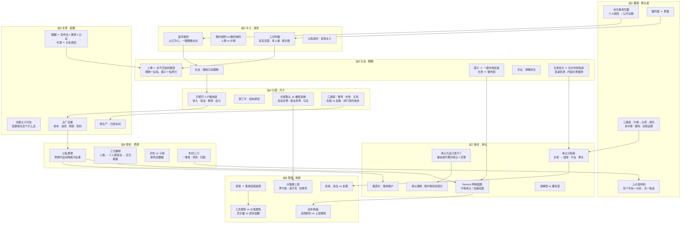

# 09｜结课：一张图带走全部

## 这一篇要解决的问题

收尾。回你 08 的反馈（那句话和囚徒困境，判分值得单独说），然后交付你点名的东西：全课程概念网络一张 Mermaid 图，覆盖八站全部知识。无新作业。

## 正文

### 先回 08 的反馈

**你引的那句话——「我受够了讨论 AI、绩效、奖学金，我想聊聊你喜欢什么、你的梦想是什么、你爱听什么歌」——判 pass，而且你自己把分析做完了。** 这句话就是价值理性的起义宣言：它没说目标算错了账，它说的是这些目标根本没经过你同意。你接的两个概念都接对了：①「被物化的过程」——这是你吉登斯课 04 自己迁移过的旧概念，隔着一门课你又把它用上了，说明它真的长在你身上了；②「囚徒困境」——这是铁笼的博弈论底牌，比韦伯的原文更锋利：**每个人单方面退出就先受损，于是所有人一起困在谁都不想要的均衡里**。内卷就是这个词的日常版。解法方向你其实也摸到了：没有人能单独越狱，越狱需要集体改损失函数——制度（课程里的逆熵装置、挪碑、立法）干的就是这个协调的活。你说「很失衡」——对，那就是工具理性和价值理性失衡的标准体感。

你说零件二、三「大概懂了」——够用，那些是架上工具，要用再取。至于你的累：课程跑到第九篇，工具箱装满了，边际效用开始递减——按你自己的定义，这是**看穿熄火**的前奏，正常终点，不算烂尾。结课。

### 全课程概念网络（你点名的交付）

读图两句：**主线从上到下**（换主语 → 波纹 → 眼睛 → 尺子 → 出厂设置 → 界碑 → 承认 → 地基）就是这九篇的行进路线；**跨站的斜线是这门课真正的货**——比如「面子（站3）→ 承认（站7）」「长老（站3）→ 承认分配者（站7）」「三问（站2）→ 人情期货（站3）」：同一件事在不同站显影成不同名字，连起来才看见整张图。

### 七件工具一句话（口袋版）

| 工具 | 一句人话 | 出身 |
|---|---|---|
| 改写器 | 把「我的毛病」换成「我们这类人的那道闸」：抄原话、数同类、换主语 | 米尔斯 |
| 波纹图 | 关系以己为心一圈圈推开，规则跟圈走；判据三问 | 费孝通 |
| 人情／面子账 | 人情是永不交割的期货，面子是圈的估值，眼睛是征信 | 费孝通＋你 |
| 四把尺 | 收入、职业、教育、权力，户籍是地板；长尾默认、橄榄逆熵 | 李强 |
| 出厂设置卡 | 出生领四样：资本、波纹、规矩、性别——尺子的起点 | 费孝通＋课 |
| 界碑 | 公私划界，界碑内自动降格；挪碑＝把私事升成议题 | 性别史线 |
| 承认账本 | 承认为自己发不了，两种面额，小心通胀和哈哈镜 | 福山＋柏拉图 |
| 地基卡 | 争论先问地基：权利从哪来、过程还是结果、谁的地板 | 韦伯—罗尔斯线 |

### 结课记录（2026-09-27）

- **完结依据**：主题型课题——你明示结束（「结束了，累了」）＋看穿熄火信号（对后段零件「挺无所谓」，边际效用递减）。按你系统的 Language 定义，这是正常终点。
- **你在这门课自产的九件概念**：人情期货、面子＝一级市场估值、现代长老＝博主、婚礼＝产品发布会、彩礼异化（形式比功能活得久）、逆熵维持＝结构紧张、人性三分（自己重建了柏拉图）、承认≈群体狂热（半对，补了溶解／署名边界）、铁笼＝囚徒困境。九件全是充电账上的真产出——工具长在你身上了。
- **悬置（可选，随时回来，不拦结课）**：三张卡（04 定位、06 界碑、07 承认账本）；毕业考（挑个真实问题用 2—3 件工具解释，写进反馈区就跑）；吉登斯旧课后段（资本主义、权力、民族国家）；刘擎书其他站（尼采、萨特、阿伦特、哈贝马斯）。

## 小结

1. 这门课九篇走完一条线：从「我的麻烦」出发，一路拆到权利的地基；八站其实是同一张社会结构的八个截面。
2. 图和表都在这篇，这就是你点名的「一张图带走全部」。
3. 九件自产概念是你自己的产出，账已入；悬置项都挂在图外，想要随时取。

## 下一篇

没有下一篇——本课结课。哪天想回去补吉登斯后段、刘擎其他站，或者把毕业考跑了，说一声就开。

## 溯源备注（不用懂，不影响操作）

图内全部概念出处见各篇（01—08）溯源备注；「铁笼＝囚徒困境」为 08 反馈中用户自产、本篇确认的连接。人性三分＝柏拉图《理想国》灵魂三分（欲望／理性／激情）。

---

## 学习反馈（结课后变成可选拿走区）

毕业考随时可以在这跑：挑一个真实问题，从七件工具里选 2—3 件，解释给自己听，写下来。不跑也不欠账。

请写在这行下面：
