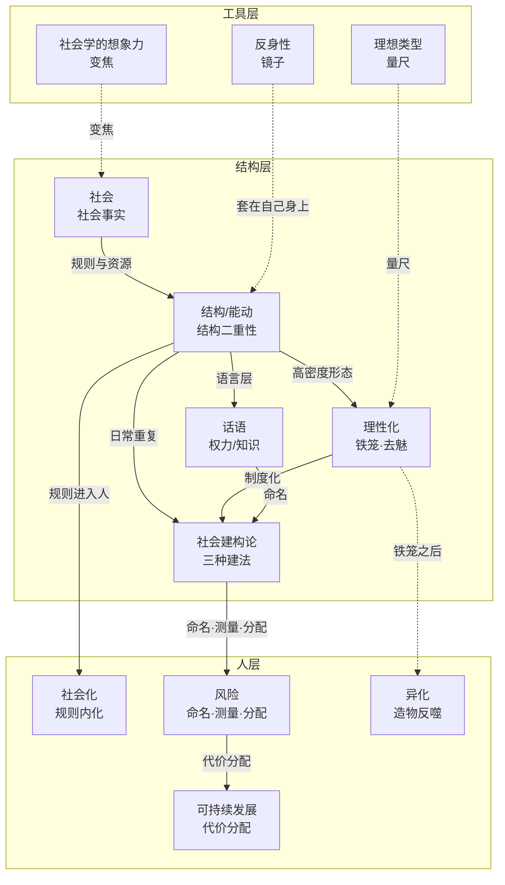

# 12｜概念解析辞典：课程 01-11 的十二个概念基石

> 针对《社会学基本概念·交互式课程 01-11》（dbs-learning 课程材料，教材底本为吉登斯《社会学基本概念》第二版）的概念提取。分层口径：工具（怎么研究）→ 结构（社会由什么构成、怎么运转）→ 人（结构如何落进人、人如何回应）。

## 这一篇要解决的问题

- 课程 01-12 里，哪些概念是拿掉就看不懂课程的承重墙？
- 十二个概念按「工具 → 结构 → 人」怎么归层、怎么咬合？
- 每个概念在课程里的原文语境是什么？

## 一、核心概念

### 工具层（怎么看、怎么研究）

#### 1. 社会学的想象力（Sociological Imagination）

- **context**：

  > 社会学视角最经典的入门说法来自米尔斯（C. Wright Mills）的《社会学的想象力》：把**个人困扰**（personal troubles）和**公共议题**（public issues）连起来看。……社会学视角就是在这两层之间来回切换的变焦镜头：拉近看个体处境，拉远看塑造处境的制度与结构。

- **费曼一下**：课程的开眼姿势。一个人失业是个人困扰，一代人失业是公共议题。社会学想象力就是变焦——同一个现象，拉近看个人，拉远看制度。它不解释任何具体机制，但所有后续概念都要在这台镜头下使用。

#### 2. 理想类型（Ideal Type）

- **context**：

  > 理想类型（Ideal Type）是韦伯发明的分析工具：把现实中分散出现、稀稀拉拉的特征**提炼、放大、组合**成一个「纯形态」概念。……它是一把量尺——拿真实案例和它比对，看偏离多少、往哪偏。

- **费曼一下**：概念的正确用法。任何社会学概念都是纯形态量尺，现实总在偏离它——偏在哪、偏多少就是案例的特点。最大的坑是把量尺当目标（把科层制纯形态当成「应该追求的样子」）。

#### 3. 反身性（Reflexivity；含双重诠释）

- **context**：

  > 反身性（Reflexivity）指：观察者把自己也放进画面。……研究社会的时候，研究者也被社会研究着。
  >
  > 第三层在吉登斯那里有个专门的名字：**双重诠释（double hermeneutics）**。……人会读社会学，读了之后重新解释自己、调整行为，社会就变了。

- **费曼一下**：研究者的判断工具本身被社会塑造，所以做判断前要补一行位置说明。概念会回流——「内卷」一流行，就参与制造它描述的现象。反身性是结构/能动套在研究者自己身上。

### 结构层（社会由什么构成、怎么运转）

#### 4. 社会（Society；含社会事实）

- **context**：

  > 一群人生活在**同一片领土**上；共享一套**文化与制度**（语言、法律、价值观、组织方式）；成员之间**相互依赖**，并且通过社会化**代代延续**。
  >
  > 法国社会学家涂尔干（Émile Durkheim）把这类现象命名为**社会事实**（social facts）：它们外在于个人而存在，对个人有强制性，不随某个人的意志改变。

- **费曼一下**：有边界的分析单位。社会大过个人之和，因为里面有一层外在于个人的共享物（语言、货币、法律）——关系是血肉，社会事实是地基。日常说「社会=外面的世界」在这里不管用。

#### 5. 结构 / 能动（Structure / Agency；含结构二重性）

- **context**：

  > **结构（structure）**指规则与资源。……结构是行动的中介，也是行动的结果。他称之为**结构的二重性**（duality of structure）。

- **费曼一下**：课程轴心。结构不在「外面」，像规则一样活在行动者的知识里，靠行动被调用。你说话必须用语法（中介），每个新用法又在微调语法（结果）。看任何现象先问两问：结构在哪？能动在哪？诊断回合验证：结构的存在方式 = 被记住（载体）+ 被调用（运转）。

#### 6. 理性化（Rationalization；含铁笼、去魅）

- **context**：

  > **用可计算、可预测、讲效率的规则，取代传统、情感和偶然性**。
  >
  > **铁笼（iron cage）**：人被关进自己造的规则笼子里。

- **费曼一下**：世界越来越像按规则运转的机器——KPI、叫号、高考、外卖算法。收益是效率和规模，代价是铁笼（人被规则反支配）和去魅（世界变透明也变冷）。乡土人情是低理性化，向钱看齐是高理性化。

#### 7. 话语（Discourse；含权力 / 知识）

- **context**：

  > 一套组织说法的方式。它规定一个时代里，什么可以被说出来，什么被当成正经话，什么被当成胡说。话语既描述世界，也参与建造世界。
  >
  > **权力决定什么说法算数，被接受的说法反过来巩固权力**。

- **费曼一下**：说话是安排世界。「失业」把责任指向政策，「灵活就业」把责任划给个人；「骑手」回避「雇员」的社保责任。说法分配责任、决定制度反应。竞争性真相还在真假里比赛，话语直接决定比赛规则。

#### 8. 社会建构论（Social Constructionism）

- **context**：

  > 我们当作「现实」的东西，很大一部分靠人们共享的共识、惯例和制度建出来，并且通过持续的日常实践维持。

- **费曼一下**：现实的意义层是建出来的，且建出来的东西真实、有硬后果（货币是建构的，但你不付钱真的吃不上饭）。三种建法：命名（话语）+ 制度化（理性化）+ 日常重复（结构/能动）——它是三个机制概念的合体。和编造的差别：编造在脑子里，建构在地上。

### 人层（结构如何落进人、人如何回应）

#### 9. 社会化（Socialization）

- **context**：

  > **社会化（socialization）** 回答的问题是：新成员如何获得一个社会的共享规则——学校教你守时、协作、读写、公共秩序，把你从「家庭里的孩子」变成「能在更大社会里行动的人」。

- **费曼一下**：结构进入人的通道。规则不会自动生效，要靠社会化内化进每个新成员。它与达尔文主义不冲突：考试竞争也运行在共享规则上——没有社会化打底，竞争无从谈起。

#### 10. 风险（Risk）

- **context**：

  > **传统风险**：自然来的。饥荒、瘟疫、洪水——天灾，个人看得见、算得清。**现代风险**：自己造的。核泄漏、金融危机、算法平台——人造危险，看不见、算不清。

- **费曼一下**：现代社会越发达越操心自造风险。风险也是建构的——命名（什么算风险）、测量（谁定标准）、分配（谁承担）。外卖就是活例：工伤风险被「灵活用工」划给个人，时间风险由算法下沉骑手。财富上行、风险下行。

#### 11. 异化（Alienation）

- **context**：

  > 马克思的原义是：人亲手造出来的东西，反过来变成压在人身上的陌生力量。

- **费曼一下**：造物反噬造物主。马克思四层：产品、过程、类本质、人与人的关系。算法骑手四层全中：配送效率归平台、节奏归算法、判断力闲置、找不到可谈判的人。理性化的铁笼讲规则束缚，异化讲束缚之外：你被自己参与运转的系统疏远了。

#### 12. 可持续发展（Sustainable Development）

- **context**：

  > 可持续发展（Sustainable Development）的标准定义来自 1987 年联合国的布伦特兰报告：**既满足当代人的需求，又不损害后代人满足其需求的能力。**

- **费曼一下**：增长话语的转折点——「限度」第一次进入发展话语。GDP 是量尺变目标的教科书案例（库兹涅茨当年就警告它不衡量福利）。谈可持续发展实际是谈三件事：对谁可持续、发展什么、谁承担转型成本。它把风险、异化、话语全部用在「增长」这个具体议题上，是应用合成概念。

## 二、概念架构图

按功能角色分三层：工具（怎么看）、结构（社会怎么运转）、人（结构落进人）。实线 = 派生或构成关系，虚线 = 视角供给或相邻关系。

三条主链值得背下来：**规则与资源**（社会 → 结构/能动）、**三种建法**（话语/理性化/结构能动 → 社会建构论）、**代价分配**（社会建构论 → 风险 → 可持续发展）。工具层的三台设备（变焦、量尺、镜子）适用于所有层。

## 小结

- 十二个承重概念：工具层 3（变焦、量尺、镜子）+ 结构层 5（社会、结构/能动、理性化、话语、社会建构论）+ 人层 4（社会化、风险、异化、可持续发展）。
- 结构层内部是一条生成链：社会提供规则与资源，结构/能动是轴心，理性化、话语、社会建构论是它的三个形态。
- 人层是结构的落点：社会化把规则装进人，风险分配把人拉进承担名单，异化讲承担时的感受，可持续发展把全部机制用在「增长」议题上。
- 课程后续主题四至主题十的新概念，都可以挂回这张三层图。

## 下一篇预告

主题四第一站：**资本主义（Capitalism）**——马克思看剥削、韦伯看纪律。挂回这张图的方式：资本主义是「理性化」与「社会建构论」在组织层面的巨型合成物。

---

## 学习反馈

你可以写：

1. 哪里看懂了？
2. 哪里没看懂？
3. 哪个地方想展开？
4. 这个主题和你的真实问题有什么关系？

请写在这行下面：
<!-- WB_FEEDBACK id=lw_d24b97d150c25b73618e95b8 -->
## 费曼诊断

- 目标：结构二重性（结构为什么既是行动的中介、又是行动的结果）——能否在未见过的新情境中脱离原答案应用。
- 初答与最大缺口：初答（球星卡）：「这个结构其实就是我们制造过程的中介，也就是我们金钱流动的中介。而为什么它会有定价呢？这个球星卡的溢价，又正是我们行动（也就是金钱流动）的结果。」——「结果」半边正确，但把中介/结果当先后两件事，给结构找实体存放地（先是「外面」，后是「脑子里」）；无法在同一时刻看到两副面孔。追问定位后补：结构存在方式 = 被记住（载体）+ 被调用（运转），载体没了即消失，不需销毁。
- 变式结果与下一步：排队例子分清「载体没了 vs 没在运转」后，LOL 段位系统迁移中正确应用双重性（行动经由结构、行动再生产结构，含内化动机驱动再生产）；术语小混（把冲分行动称为中介，结构才是中介），机制达标。判定：一次迁移通过，仅作路由证据，不声明掌握。下一步：推进主题四「资本主义」。
<!-- /WB_FEEDBACK id=lw_d24b97d150c25b73618e95b8 -->
