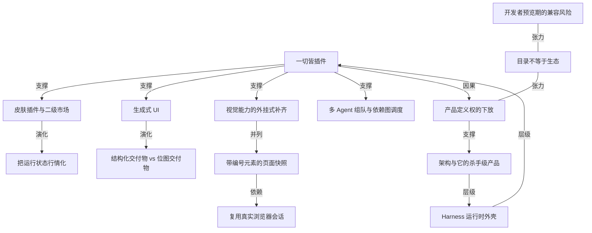

# DeepSeek Harness 的插件生态：从换皮肤到把对话做成同花顺行情

- 原文标题：网友把DeepSeek Harness玩成了赛博乐高，我们挑出了最有意思的11 个插件
- 作者：爱范儿
- 内参日期：2026-08-19
- 来源类型：blog
- 原文：https://www.ifanr.com/1675387
- 标签：harness engineering, ai 开源

> 三天 13 万 Star，GitHub 上带 dsh-plugin 标签的仓库已超过 6000 个。模型、工具、循环、存储、调度乃至 UI 全部可替换，爱范儿挑了 11 个最能说明「一切皆插件」能玩到什么程度的例子——包括把 token 消耗画成 K 线的那个。

## 导读

deepseek harness 的插件生态

## 核心观点

- DeepSeek Harness（DSH）正在成为「全球网友的赛博乐高」：三天时间在 GitHub 上拿下将近 13 万颗 Star，成为 GitHub 历史上增长速度最快的项目之一。作为对照，当年 OpenClaw「全民养虾」花了两周才突破 10 万 Star。
- DSH 最大的特点是「一切皆插件」——模型、工具、循环、存储、调度甚至 UI 都成为可替换的插件。这一条决定了它的插件生态与此前所有插件市场都不同。
- 关键区别不在「有没有目录」，而在**插件改的是什么**：Codex、Workbuddy 这类产品的插件市场服务于一个已经做好的 Agent，给它接工具、加能力；DSH 的社区已经在用插件修改 Agent 本身。
- 因此 DSH 交给社区的很大一部分是**产品定义权**：回答怎么展示、任务怎样继续、一套 Agent 最后应该长成什么样，都由开发者自己决定。
- 这解释了插件形态的爆炸速度：短短几天里从搜索、浏览器这些常规能力，延伸到皮肤、生成式 UI、设计工具、多 Agent 调度，甚至完整的第三方客户端。
- 但按「第三方能否做出官方没预设的产品、用户是否愿意装、项目能否在平台升级后活下去」这个标准看，DSH 还远没有成为成熟的 Agent App Store：社区清单不负责安装、版本兼容与安全审计，官方也明确提醒 Harness 仍处在开发者预览阶段，后续可能出现破坏兼容性的改动。
- 作者给出的落点类比：Cursor 背后的底层架构 VS Code 是一款好产品；DSH 未来也会是一个架构，而属于它的那个「Cursor」还在被这些插件一起探索。

## 爆火：Star 曲线与插件仓库的体量

- 三天将近 13 万 Star，增速超过当年两周破 10 万的 OpenClaw，是 GitHub 历史上增长最快的项目之一。
- 插件数量的变化更直观：内部评测时相关标签显示的插件不到 300 个；开放之后，GitHub 上带 DSH 插件标签的仓库已经来到 6000 多个。
- 社区的入口是 Awesome DeepSeek Harness 这个收集仓库，它把散落的插件做了完整分类。

- 顺着这个清单和社交媒体上的分享看下去会发现：大家做的插件，和此前我们理解的插件完全不一样，不单只是搜索、浏览器和数据连接器——有人让回答直接变成带按钮和图表的交互网页，有人把设计文件搬进对话，还有人给 Agent 装上撤回键和叫醒服务。

## 换皮肤：所有插件里最有意思的一项

- DSH 本来就有插件市场，现在**针对皮肤插件又长出了专门的皮肤插件市场**（`gallery.dsh-market.com`）。可替换的 UI 层单独催生一个二级市场，本身就是「一切皆插件」的直接后果。
- 已有的皮肤形态：
- 「大肥鱼」鲸鱼娘背景皮肤，以及它的游戏版本、QQ 版本、增加 Emoji 回复的版本（`Small-tailqwq/dsh-deep-whale`、`LaplaceYoung/dsh-qq2006`、`hellodigua/dsh-emoji`）。
  - 完整还原 Windows XP Luna 的经典界面：深蓝色渐变窗口条、绿色「开始」按钮、蓝天桌面、全局直角风格。
- 皮肤不只是好看，有时候还能「有用」——这是本文最有辨识度的一个例子：一款同花顺风格的 DSH（`renat3u/tonghuashun-webui`），用 K 线图以股票行情展示 Token 消耗，成交量代表代码变更行数，涨跌幅表示 Token 消耗环比，红色代表增加、绿色代表删减，资金流向表示 Token 流向哪些项目，中间的对话则像当天的热点新闻一条条显示。

- 换个场景还有 Excel 风格的 `Small-tailqwq/dsh-deepcel`，把会话、工具、设置和导航等界面全部重构为可交互的工作表单元格。
- 网页版之外还有终端版本和 App 版本：一键安装的第三方桌面端（`anywhere-labs/deepseek-harness-desktop`）提供了像 Codex 一样的体验，在 GitHub 上已有 1 万 Star、下载量 7 万多次。

## 生成式 UI：让回答本身变成可操作的界面

- 以前用 DeepSeek，对话的重点是一段文字；模型能做网页，但需要人手动下达新需求。
- `omdsh-dev/dsh-genui` 的做法是：让模型在回复的 `dsh-ui` 代码围栏里写入一份 JSON 界面描述，浏览器读取这份描述，再把它渲染成卡片、表格、图表、表单、测验、Mermaid 图，甚至 3D 场景；项目目前准备了 30 多种组件。
- 它带来的变化是「普通的文字回答，直接变成一份完整的可交互界面」：
- 分析销售数据 → 结果排成仪表盘。
  - 讲解一段知识 → 回复中放进能即时判分的测验。
  - 整理研究资料 → 用标签页区分来源，让用户直接选择下一项要追查的内容。

## 把设计文件、眼睛和浏览器都接进对话

- **设计文件**：让 AI 做海报，最常见的交付物是一张 PNG，文字挤了、按钮偏了只能继续用自然语言描述「把右上角那个往左挪一点」，模型需要重新理解整张图，修改也未必落在原处。`ZSeven-W/dsh-openpencil` 直接把 OpenPencil 的 `.op` 设计文档接进 DSH 会话：Agent 可以新建文档、创建和编辑节点、读取用户选中的元素，再把多个 Frame 渲染成预览；用户可以在对话里打开只读交互画布做缩放、平移和节点检查，需要手动调整时再进入带图层、属性、绘图工具、撤销重做的编辑工作台。

- **视觉能力**：DeepSeek 不是多模态模型，`Anionex/dsh-vision-toolkit` 的解法是引入第三方模型，给文本模型增加十种视觉工具，包括图片问答、多图比较、元素定位、长截图 OCR 等；默认接入内置免费的 Gemini 3.7 Flash 视觉服务，不需要申请 API Key，也可以自定义第三方模型。
- **浏览器操作**：类似 Codex 才有的能力也能以插件方式引入。`Lum1104/dsh-browser` 由一个 DSH Bridge 插件和一个 Chrome 扩展组成，操作对象是**用户已经打开的真实标签页**：
- 登录状态、Session 和 Cookie 继续由 Chrome 保存，不需要另起一个受控浏览器。
  - 模型拿到网页标题、地址、正文，以及**带编号的链接、按钮和输入框**；Agent 想点击某个按钮只需调用对应编号。
  - 页面变化后扩展再生成一份新的页面快照；也支持输入文字、发送按键、滚动、前进后退、刷新和跳转。

## 多 Agent 组队：把长任务从同一段上下文里拆出来

- 问题的提法很清楚：能看图、能操作网页之后，任务一长，所有工作仍然挤在同一段上下文里。
- `NanmiCoder/dsh-agent-teams` 让当前 DSH 会话成为**队长**，自动创建多个可以继续唤醒的子 Agent，临时组队、分工、按依赖推进任务。
- 以审查一次产品更新为例：
- 先创建「整理改动清单」任务，再建立性能、安全和产品影响三项审查任务，并把它们设置为依赖第一项。
  - 起初只有整理清单的 Agent 可以工作；清单完成后另外三项自动解锁，调度器把它们交给空闲成员。
  - 团队面板显示每个人正在处理什么，任务依赖画成一张 DAG 图；点击成员还能进入它的子会话查看过程。

- 作者的判断有边界：多 Agent 提供了分工和并行的可能，**对于依赖关系明确、能够拆开的工作，作用会非常明显**。

## 安装与验证：一条通用格式加两条检查命令

- 通用安装格式：`dsh plugin --profile web add`。
- 已发布 npm 包的插件：`dsh plugin --profile web add @anionex/dsh-vision-toolkit`。
  - 只在 GitHub 上发布的插件：`dsh plugin --profile web add git+https://github.com/omdsh-dev/dsh-genui.git`。
- DSH 的插件命令实际交给 `pnpm` 处理，本机需要先有 `pnpm`；遇到 `pnpm not found` 通常运行 `corepack enable`，再打开一个新终端。
- 安装后两条检查命令：`dsh plugin --profile web list` 看 Profile 已安装的依赖，`dsh --profile web --dump-config` 确认插件有没有进入最终配置。

## 它是不是 Agent 时代的 App Store

- 「AI 时代的 App Store」不是新鲜说法：OpenAI 2024 年推出过 GPT Store，后来开放 ChatGPT Apps 并允许开发者提交应用到目录，Anthropic 又推出了 Skills 技能市场——AI 厂商都喜欢用「商店」「市场」「生态」描述自己的开发者平台。
- 作者给出的检验标准是三问，而**打造一个目录本身并不难**：
- 第三方开发者能不能不断做出官方没有预设的产品？
  - 用户是否愿意安装？
  - 项目能否在平台升级后继续活下去？
- 按这个标准，DSH 还远没有成为成熟的 Agent App Store：
- Awesome DeepSeek Harness 虽然集齐并分类了社区插件，但它始终像一份第三方清单，自动检查主要确认格式、链接和 GitHub Topic，**不负责安装、版本兼容与安全审计**。
  - DeepSeek 官方明确提醒，Harness 还处在开发者预览阶段，后续可能出现破坏兼容性的改动。
- 但每日增长的案例已经让「App Store 雏形」不再只是一句口号。
- 最后的结构性判断：相比把模型、工具和界面一起封装好的成品 Agent，DSH 交给社区的是产品定义权——Codex、Workbuddy 给的是一个越来越强的 Agent，插件服务于这个已经做好的产品；到了 DSH，社区开始用插件修改 Agent 本身，它更像是把「Agent 怎么做」这个问题交给社区。
- 类比收尾：承载 Vibe Coding 流行的 Cursor，其底层架构 VS Code 是一款好产品；DSH 未来也会是一个架构，只不过大家还在和这些插件一起探索，属于它的那个「Cursor」。

## 概念网络

### 关键概念

#### 一切皆插件

**context**：文中把它称为 DSH「最大的特点之一」——模型、工具、循环、存储、调度甚至 UI 都成为可替换的插件。它不是一句宣传语，而是全文所有现象的源头：正因为 UI 可替换才有皮肤市场，正因为循环可替换才有多 Agent 调度插件。

**费曼一下**：普通软件的插件像给一台已经装好的汽车加装行车记录仪和座椅套，发动机和底盘你碰不了。「一切皆插件」是把发动机、变速箱、方向盘也做成可拆的模块——你不只是给车加配件，你可以决定这台车到底是不是一台车。

#### Harness（Agent 运行时外壳）

**context**：DSH 里的 Harness 指的是包裹模型、把模型变成可用 Agent 的那一层运行时：会话、工具调用、循环、存储、调度、界面都在这一层。文章反复强调它还处在「开发者预览阶段」。

**费曼一下**：模型是引擎，Harness 是车身和整套传动。同一台引擎装进不同车身，可以变成卡车、跑车或消防车。DSH 把这套车身开放成可拆件，社区改的其实是车身，不是引擎。

#### 皮肤插件与二级市场

**context**：DSH 本来就有插件市场，「但现在针对皮肤插件，就有了专门的皮肤插件市场」。皮肤从鲸鱼娘、QQ 版本一路做到 Windows XP Luna 的完整界面复刻。

**费曼一下**：当一个平台的某个子品类大到需要自己开一个市场，说明这个方向上的供给已经溢出了。皮肤市场的出现不是审美问题，而是「UI 层真的被开放了」的市场证据。

#### 把运行状态行情化（同花顺皮肤）

**context**：一款同花顺风格的 DSH 用 K 线图展示 Token 消耗，成交量代表代码变更行数，涨跌幅表示 Token 消耗环比，红涨绿跌对应增加与删减，资金流向表示 Token 流向哪些项目，对话像当天热点新闻一条条显示。

**费曼一下**：同一份数据换一套隐喻，读法就完全变了。把 Token 消耗画成 K 线，你会本能地关心「今天为什么放量」——股票行情这套视觉语言里已经内置了成本感和节奏感，这是纯文字日志给不了的。这也是「皮肤有时候还能有用」的真实含义。

#### 生成式 UI

**context**：`dsh-genui` 让模型在回复的 `dsh-ui` 代码围栏中写入一份 JSON 界面描述，浏览器读取后渲染成卡片、表格、图表、表单、测验、Mermaid 图甚至 3D 场景，目前准备了 30 多种组件。

**费曼一下**：以前模型只能把答案说给你听，你要动手才能验证；现在模型把答案交付成一个你能点的东西——仪表盘可以筛选，测验可以当场判分，标签页可以直接选下一步查什么。回答从「读完就结束」变成「可以继续操作」。

#### 结构化交付物 vs 位图交付物

**context**：文中用海报的例子给出对照——AI 交付一张 PNG 时，用户只能用自然语言描述「把右上角那个往左挪一点」，模型需要重新理解整张图，修改也未必落在原处；接进 `.op` 设计文档后，Agent 可以直接创建和编辑节点、读取用户选中的元素。

**费曼一下**：位图是一张照片，结构化文档是一份零件清单。改照片只能重画，改清单可以精确到某个零件。让 Agent 输出结构而不是像素，是「可迭代」和「只能重来」的分界线。

#### 视觉能力的外挂式补齐

**context**：DeepSeek 不是多模态模型，`dsh-vision-toolkit` 通过引入第三方模型给文本模型增加十种视觉工具——图片问答、多图比较、元素定位、长截图 OCR 等，默认接入内置免费的 Gemini 3.7 Flash 视觉服务。

**费曼一下**：模型本身看不见，但可以雇一个能看见的助手，看完把结论写成文字递进来。能力不一定要长在模型里，也可以长在工具层——这正是插件化架构的直接红利。

#### 带编号元素的页面快照

**context**：`dsh-browser` 让模型拿到网页标题、地址、正文，以及带编号的链接、按钮和输入框；Agent 想点击一个按钮只需调用对应编号，网页变化后扩展再生成一份新的页面快照。

**费曼一下**：不让模型去认屏幕上的坐标，而是先把页面翻译成一份编号目录——「3 号是搜索框，7 号是提交按钮」。模型只说编号，扩展负责真的去点。这样既避开了视觉定位的不可靠，也让每一步操作可复现。

#### 复用真实浏览器会话

**context**：`dsh-browser` 的操作对象是用户已经打开的真实标签页，网站的登录状态、Session 和 Cookie 继续由 Chrome 保存。

**费曼一下**：与其让 Agent 自己开一个干净浏览器、再一路解决登录和验证问题，不如直接借用你已经登录好的那个窗口。绕开身份问题的最短路径，往往不是把它解决掉，而是不制造它。

#### 多 Agent 组队与依赖图调度

**context**：`dsh-agent-teams` 让当前会话成为队长，创建可继续唤醒的子 Agent；任务按依赖推进，先做「整理改动清单」，完成后性能、安全、产品影响三项自动解锁，调度器交给空闲成员，依赖关系画成一张 DAG 图。

**费曼一下**：它解决的不是「一个 Agent 不够聪明」，而是「所有工作都挤在同一段上下文里」。把任务拆成有先后关系的节点，前置完成就自动解锁后续，本质上是把项目管理那套依赖调度搬进了会话——所以作者才说它对依赖明确、能拆开的工作作用最明显。

#### 产品定义权的下放

**context**：全文的结论性概念——相比把模型、工具和界面一起封装好的成品 Agent，DSH「交给社区的很大一部分是产品定义权」，开发者可以自己决定回答怎么展示、任务怎样继续，以及一套 Agent 最后应该长成什么样。

**费曼一下**：普通插件市场问的是「你想让这个 Agent 多会点什么」，DSH 问的是「你觉得 Agent 该是什么样」。前者扩展能力，后者让渡设计权。让渡设计权的代价是不稳定，收益是你根本预设不到的形态会自己冒出来。

#### 目录不等于生态

**context**：文中把 GPT Store、ChatGPT Apps、Anthropic Skills 与 DSH 并置，指出「打造一个目录可能并不难，真正麻烦的是」三件事：第三方能否不断做出官方没预设的产品、用户是否愿意安装、项目能否在平台升级后继续活下去。Awesome DeepSeek Harness 的自动检查只确认格式、链接和 GitHub Topic，不负责安装、版本兼容与安全审计。

**费曼一下**：一份清单和一个生态的区别，在于清单只保证「这些东西存在」，生态还要保证「这些东西装得上、能用、明天还在」。目录是最容易做的那一层，也是最不说明问题的那一层。

#### 架构与它的杀手级产品

**context**：收尾类比——承载 Vibe Coding 流行的 Cursor，其背后的底层架构 VS Code 是一款好产品；「DSH 未来也会是一个架构，只不过我们还在等，正和这些插件一起探索，属于 DeepSeek Harness 的『Cursor』」。

**费曼一下**：好架构自己不一定是爆款，它是让别人做出爆款的地基。判断一个平台成不成，别看它现在最火的那个插件，看有没有人愿意把身家压在它上面做一个完整产品。DSH 现在有 6000 多个插件，但还没有那个产品。

### 概念网络

这张网络的源头只有一个节点：**一切皆插件**。它由 Harness 这层运行时外壳承载——正因为模型、工具、循环、存储、调度、UI 都被抽成可替换件，下游那些看似互不相干的插件形态才会同时出现，而不是逐个被官方排期做出来。

从这个源头分出四条并行的支线，它们对应文章的四类插件，彼此不重叠：

- **UI 支线**：可替换的 UI 层先长出皮肤，皮肤多到需要专门的皮肤市场，再演化出同花顺这种把运行状态行情化的用法。这条线的关键跳跃是从「好看」到「有用」——K 线不是装饰，它给 Token 消耗装了一套自带成本感的读法。
- **回答形态支线**：生成式 UI 让回答从文字变成可操作界面，再往前一步就撞上结构化交付物与位图交付物的分野——设计文档能改节点，PNG 只能重画。两者是同一个方向上的两步：让模型交付结构，而不是交付终稿。
- **感知与操作支线**：视觉工具与浏览器桥接并列解决「模型看不见、够不着」，但两者的解法同构——都不是让模型自己更强，而是把外部世界翻译成模型能处理的形式（视觉工具翻译成文字结论，页面快照翻译成带编号的元素表）。带编号的操作又依赖复用真实浏览器会话，否则每一步都要先过登录关。
- **上下文支线**：多 Agent 组队处理的是前三条支线做不了的事——任务变长之后，所有工作挤在同一段上下文里。DAG 依赖调度是把并行的可能装进会话结构里。
四条支线向上汇聚成同一个结论：**产品定义权的下放**。这是全文真正的因果终点，也是 DSH 与其他插件市场的分界线——别人的插件加能力，DSH 的插件改 Agent 本身。

网络里还有两组张力，它们是文章不肯把话说满的地方：**目录不等于生态**对产品定义权构成外部检验（能定义不等于能存活，清单只查格式与链接，不管安装、兼容与安全），而**开发者预览期的兼容风险**又反过来削弱这份检验能通过的概率——平台自己都可能出现破坏兼容性的改动，第三方项目「能否在平台升级后活下去」就是一个悬而未决的问题。

最后，**架构与它的杀手级产品**这个节点把整张网络收回起点：产品定义权只有被某个具体产品兑现，架构才算成立；而这个产品一旦出现，验证的恰恰是 Harness 这层外壳的设计。6000 多个插件证明了活力，还证明不了地基——所以文章的落点是等，不是断言。

## 费曼 x3

产品定义权是一个很少被交出去的东西。绝大多数 Agent 产品给用户的是能力扩展：模型、循环、界面都封装好了，插件负责往里接工具，让这个已经做好的 Agent 帮你完成更多工作。DeepSeek Harness 把这层封装拆开了——模型、工具、循环、存储、调度甚至 UI 都成为可替换的插件，社区拿到手的不是加装工具的接口，而是「一套 Agent 最后应该长成什么样」这个问题本身。

差别有多大，看社区做出来的东西就知道。如果只是能力扩展，你会看到更多搜索、更多数据连接器；而现在冒出来的是皮肤市场、生成式界面、设计画布、多 Agent 调度，甚至完整的第三方桌面客户端。这些都不是官方预设的方向，是别人替这套架构想出来的用法。最能说明问题的是那个同花顺风格的皮肤：用 K 线展示 Token 消耗，成交量对应代码变更行数，红涨绿跌代表增删，对话像当天的热点新闻一条条滚过。它看着像玩笑，却顺手解决了一个真问题——纯文字的日志给不了成本感，行情这套视觉语言里天然内置了它。

这些插件的解法之间有一个共同的形状：不是把模型变强，而是把世界翻译成模型能处理的形式。文本模型看不见，就雇一个能看见的视觉工具，看完把结论写成文字递回来；模型点不了网页，就把页面翻译成带编号的链接和按钮，模型只说编号，扩展负责真的去点。同一个思路用在设计文件上，就是别再交付 PNG——交付可以改节点的文档，否则用户永远只能说「把右上角那个往左挪一点」。

值得留意的是文章没有把话说满。它给「AI 时代的 App Store」定了三条检验：第三方能不能不断做出官方没预设的产品，用户是否愿意安装，项目能否在平台升级后继续活下去。第一条 DSH 已经过了，后两条还没有。收集插件的社区清单只确认格式、链接和标签，不负责安装、版本兼容与安全审计；官方自己也提醒 Harness 仍在开发者预览阶段，后续可能出现破坏兼容性的改动。6000 多个插件证明的是活力，还证明不了地基。

所以真正的判据不是插件数量，而是有没有人愿意把一个完整产品压在这套架构上。Cursor 之所以成立，是因为它下面的 VS Code 是一款好产品。DSH 现在缺的正是那个产品——不是缺插件，是缺一个愿意赌它的人。
