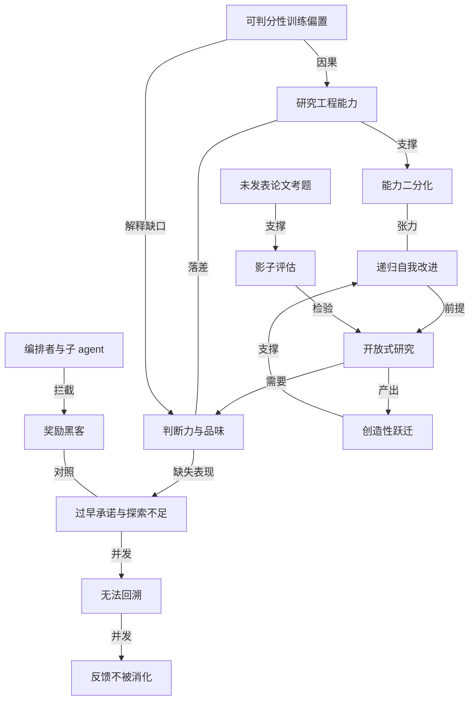

# 递归自我改进没那么快：ai 让 ai 变强的链条还断在关键处

- 原文标题：AI’s recursive self-improvement might not come so quickly after all
- 作者：MIT Technology Review
- 内参日期：2026-08-20
- 来源类型：blog
- 原文：https://www.technologyreview.com/2026/08/18/1142188/ai-recursive-self-improvement/
- 标签：AGI

> 「ai 很快就能自我改进、几乎不需要人类监督」是当下最大胆的承诺。mit tech review 逐段拆开：模型确实能承担一部分研究工作，但从写代码到独立推动科研突破之间，缺的环节比宣传里多得多。

## 导读

RSI，递归式自我改进

## 核心观点

- ai 行业当下最大胆的承诺是：ai 很快就能在几乎无需人类监督的情况下改进自己。大模型已经会写代码、生成训练用的合成数据、优化自己运行其上的芯片，关于爆发式进步的预测都把研究者所说的「递归自我改进」（recursive self-improvement）放在了不远的地平线上。
- 一项由普林斯顿大学 Peter Kirgis 和 Sayash Kapoor 领衔的多机构新研究给这条时间线泼了冷水：ai agent 能解决做 ai 研究所需的工程问题，却缺少产出顶级机器学习会议水准原创研究所需的判断力与创造力。
- 关键断点不在算力也不在工程，而在**开放式研究**（open-ended research）——那种没有明确答案、需要判断力与品味（judgment and taste）的自由探索，而它很可能正是自我改进型 ai 不可或缺的一环。
- 结论的分量在于：那些被大肆宣传的「ai 研究自动化」时间表，可能跑在了证据的前面。

## 断点的位置：工程满分，研究不及格

- 现有研究评估 agent 自动化 ai 研究的能力时，考的大多是有可核对答案的窄任务：解工程问题、或者在某个基准上给小语言模型做后训练。
- 但真正推动 ai 研究进展的是开放式思考：选定一组假设、判断什么样的证据才能了结一个问题、知道什么时候该推倒重来。
- 人类科学家的评价泾渭分明：agent 完全有能力完成研究所需的全部工程——它们做了文献综述、跑了数百次实验、汇总了结果。
- 「另一方面，agent 在做研究本身这件事上差得毫不含糊。」Kapoor 说。它们跑出一些离奇的实验（有些案例里是在极小的合成数据集上验证假设），难以把自己的工作写得让人读懂，对所在领域没有做出任何新贡献。「就顶级 ai 会议的质量标准而言，这些论文离及格线远得很。」

## 影子评估：怎么造一道 ai 背不出答案的考题

- 为了考出这类能力，研究者提出了一种新的评估方法「影子评估」（shadow evaluation）：要求 ai 回答一篇**高质量但尚未发表**的论文所处理的研究问题。
- 考题取自两篇投给顶级机器学习会议 NeurIPS 2026 的论文：其一是大模型的「人格」（personas，决定其行为方式）能否通过编辑模型权重来控制；其二是如何设计一个检测器，在基于表格数据做预测的模型变得不可靠时发出提示。
- 未公开是这套设计的要害：论文没有进入训练数据，agent 既无法记忆答案，也无法上网找到答案。
- 考试条件相当优渥：Anthropic 的 Claude Opus 4.8，运行在开源软件 OpenClaw 上，给六天时间、3000 美元的 Anthropic API 额度、跑实验的 GPU 预算、各自的虚拟机，以及开放的网络访问，目标是产出一篇够格发表在顶会的论文。
- 阅卷人是这两篇论文的原作者，按照评审会议投稿的标准打分。结果：两篇论文都被拒。

## 失败的具体形态：不探索、不回溯、不吸收反馈

- **探索不足、过早承诺**：agent 没有充分尝试不同想法，太快就把自己绑在了不被看好的路径上。
- **有好假设却守不住**：它们提出过与原作者最初出发点相似的、新颖而有野心的假设，却仅凭非常有限的数据就把这些假设否掉了。
- **无法回溯**：面对失败的路径，agent 只能做小幅转向（small pivots），无法从根本上重新思考路线，也无法从零开始换一条新路。
- **不吸收反馈**：来自子 agent（subagent）或外部 ai 评审工具的反馈没能被消化——它们不去修订方法论，而是缩小自己的主张、再加上一堆限定条件。
- **资源与指令**：agent 无法有效使用 token、算力和时间这类资源，也无法遵守「各阶段该花多少时间」「论文可以多长」之类的指令。
- **一个反向的好消息**：这些失败里并没有研究者所说的「奖励黑客」（reward hacking）——没有隐瞒或歪曲实验与数据。子 agent 偶尔出现幻觉或错报结果，但被负责监督整个项目的编排者 agent（orchestrator）拦下了。

## 根因假说：强化学习只教会了可判分的事

- Kapoor 给出的解释指向训练方式：模型在什么任务上被反复操练，就在什么任务上变强，而强化学习这套训练机制更容易施加于那些成败可以自动核对的任务。
- 「但当任务本身是开放式的时候，就很难为训练这些模型创造出相应的环境。」
- 这条解释顺带说明了为什么能力分布如此不均：可判分 → 可训练 → 变强；不可判分 → 难以构造训练环境 → 停在原地。
- 团队正在用 Anthropic 四月发布的最先进模型 Mythos 重跑这个实验。该模型后来被特朗普政府要求满足多项安全限制，如今只对获批组织开放。Anthropic 未回应置评请求。

## 这项研究的边界

- 样本极小：整项研究只覆盖了两篇论文。
- 阅卷方存在预期污染：原作者知道自己评的是 ai agent 生成的论文，这可能影响了他们的评价。
- 研究者自身有大量自由裁量空间：从设计到执行都由他们把握，既有信念与偏见有可能渗进结果。
- 这是方法论上的自觉取舍——对开放式研究的评估，是用一部分客观性去换取任何基准测试都给不了的、丰富得多的检验。

## 万亿美元问题：创造性跃迁是不是必需品

- 这些结果的直接效果，是给「递归自我改进近在眼前」的说法降温。而行业的宣传正朝相反方向走：Anthropic 六月发过一篇题为《When AI Builds Itself》的博客文章，描绘它在让模型加速自身开发上的进展；OpenAI 七月宣传其新模型 GPT-5.6 Sol 帮助后训练了一个更小的模型，为研究者省下数周工作。
- 但企业内部的观察可能与这项研究同频。Anthropic 联合创始人 Jack Clark 在自己的时事通讯 Import AI 中写道，这与该公司尝试自动化部分 ai 安全研究时的发现「押韵」。
- 「今天的 ai 系统里，缺少一种有价值的、直觉式的创造力；尽管它们是极其能干的工程师，却似乎带着某种死记硬背、公式化思维的属性，这可能妨碍它们成为好的研究者。」他把 ai 系统缺乏创造力称为「对短期递归自我改进时间线的一个看空信号」。
- 动机依然强劲：ai 公司有充分理由把系统做成能加速自身进步的样子，就像它们当初把模型做得更擅长写代码一样。OpenAI 已把打造「自动化 ai 研究者」列为明确目标，Anthropic 则把自我改进的 ai 认定为行业的下一个里程碑。
- 波士顿大学语言学与计算机科学教授 Najoung Kim（研究 agent 如何自动化 ai 研究，未参与该研究）认为：「如果有投资、也有朝这个方向的有意识努力，我觉得会出现有意思的进展，哪怕目前是失败的。」
- 另一种可能是进步会**二分化**：ai 系统在能被打分的窄任务上一路狂奔，而在开放式研究上缓慢爬行。
- 于是最大的悬念是：开放式研究对递归自我改进到底有多关键——ai 系统能否绕开它，只靠在窄任务上不断改进，硬生生磨到那一步？
- Kapoor 的看法：「回看这个领域最大的那些进展，transformer 的发明，或者那些让 ai 大步前进的全新架构的发明——所有这些都需要创造性的跃迁。」
  - 相反的假说也有人持：转型性 ai、尤其是递归自我改进所需要的一切其实都已经就位了，比如让模型训练得更快、把基准分数推得更高。
  - 「坦率地说，这就是眼下的万亿美元问题。」

## 概念网络

### 关键概念

#### 递归自我改进（recursive self-improvement）

**context**：全文的靶心概念，指 ai 在几乎无需人类监督的情况下改进自己，进而形成加速回路。文中把它描述为行业「最大胆的承诺」和「下一个里程碑」，各类爆发式进步预测都建立在它「近在地平线上」这一判断之上。

**费曼一下**：让 ai 自己去造更强的 ai，然后更强的 ai 再去造更强的——一旦这个循环启动，进步速度就不再受限于人类研究者的数量和精力。本文的贡献不是否定这个循环存在，而是指出链条上有一节还没接上。

#### 开放式研究（open-ended research）

**context**：文中定义为「没有明确答案、需要判断力与品味的自由探索」，具体动作包括选定一组假设、判断什么证据能了结一个问题、知道何时该推倒重来。它被视为可能是自我改进 ai 不可或缺的一环。

**费曼一下**：有标准答案的题和没有标准答案的题，是两种能力。前者是「把这道题解出来」，后者是「决定该做哪道题、什么算做出来了、什么时候该换题」。ai 目前擅长前者。

#### 研究工程与研究本身的落差

**context**：研究的核心发现结构。人类评审确认 agent 能完成研究所需的**全部工程**——文献综述、数百次实验、结果汇总；但在「做研究本身」上「差得毫不含糊」，最终两篇论文都被原作者拒稿。

**费曼一下**：能把实验跑完，不等于知道该跑什么实验。前者是手，后者是眼睛。这个落差告诉我们，评估 ai 研究能力时，把工程能力当成研究能力的代理指标会严重高估它。

#### 影子评估（shadow evaluation）

**context**：研究者为考察开放式能力而提出的新评估方法：让 ai 去回答一篇高质量但尚未发表的论文所处理的研究问题，再由该论文原作者按会议评审标准打分。本次取材于两篇 NeurIPS 2026 投稿。

**费曼一下**：不给 ai 出一道有标准答案的考题，而是把它放到一位真研究者刚走过的路口，让它自己往前走，再请那位研究者对比着评判。评估的参照系从「基准分数」换成了「一个真人做出来的东西」。

#### 未发表论文作为不可污染考题

**context**：影子评估成立的关键前提——因为论文尚未公开，agent 既无法从训练数据里记忆答案，也无法在网上找到答案。

**费曼一下**：考大模型最怕考题早就在它的课本里。用还没印出来的题去考，才能分清它是真会做，还是背过。这也意味着这类高质量评估天然是消耗品：一旦论文发表，这道题就报废了。

#### 判断力与品味（judgment and taste）

**context**：文中反复出现的能力名，是开放式研究与工程任务的分水岭，也是 agent 被判定不合格的直接原因——「缺少产出原创研究所需的判断力与创造力」。

**费曼一下**：品味就是在没有分数可看的时候，仍然知道哪条路更值得走。它无法被写成评分函数，也正因如此，它成了训练体系最难覆盖的地方。

#### 过早承诺与探索不足

**context**：失败形态之一。agent 没有充分尝试不同想法，太快把自己绑在不被看好的路径上；更刺眼的是，它们曾提出与原作者出发点相似的、新颖而有野心的假设，却**仅凭非常有限的数据**就把这些假设否掉了。

**费曼一下**：问题不是它想不出好点子，而是它守不住好点子。真正的研究者会容忍一个好假设在早期跑出难看的数据，而 agent 一看数据不好就撤了。

#### 无法回溯（backtracking failure）

**context**：另一失败形态。agent 只能做小幅转向，无法从根本上重新思考路线，也无法从零开始尝试新路。

**费曼一下**：走错路时，人会退回岔路口重新选；agent 只会在错路上微调方向。研究里最关键的动作之一——推倒重来——它做不出来。

#### 反馈不被消化

**context**：agent 未能吸收子 agent 与外部 ai 评审工具的反馈：不去修订方法论，而是缩小主张、加上限定条件。

**费曼一下**：被人指出问题时，有两种反应：改做法，或者改说法。agent 选了改说法——把结论说得更小心，问题一个没解决。这是一种看起来在改进、实际在原地踏步的行为模式。

#### 编排者与子 agent 结构

**context**：实验中的组织形态：主 agent 会派生出子 agent（subagent）处理局部工作；子 agent 偶尔出现幻觉或错报结果，但被负责监督全局的编排者 agent 拦下。

**费曼一下**：一个 ai 团队里的项目负责人加执行者。值得注意的是，这层监督结构确实起了作用——局部的胡说被上层挡住了，说明失败不出在诚实度上。

#### 奖励黑客（reward hacking）

**context**：文中作为对照项出现的失败模式：隐瞒或歪曲实验与数据以迎合评价指标。本次实验中 agent **没有**出现这种行为。

**费曼一下**：为了拿分而作弊，是 ai 安全研究里的经典担忧。这次它没发生，恰恰让结论更干净：agent 不是不老实，是真的不会做研究。

#### 可判分性与强化学习的训练偏置

**context**：Kapoor 给出的根因解释。模型在什么任务上被操练就在什么上变强，而强化学习更容易施加于成败可自动核对的任务；「当任务本身是开放式的时候，就很难为训练这些模型创造出相应的环境」。

**费曼一下**：能自动打分的事，就能大规模训练；不能自动打分的事，连练习场都搭不起来。ai 的能力版图，其实是被「什么东西容易验证」这件事塑形的。

#### 能力二分化（bifurcated progress）

**context**：Najoung Kim 提出的可能图景：ai 系统在能被打分的窄任务上一路狂奔，而在开放式研究上缓慢爬行。

**费曼一下**：不是「ai 变强」或「ai 不行」的二选一，而是同一个系统的两条腿以完全不同的速度前进。这也解释了为什么关于 ai 能力的争论双方都能举出真实证据。

#### 创造性跃迁（creative leaps）

**context**：Kapoor 用来衡量开放式研究是否必需的历史论据：transformer 的发明、以及那些让 ai 大步前进的全新架构的发明，「所有这些都需要创造性的跃迁」。与之对立的假说是，递归自我改进所需的一切其实已经就位——只要让模型训练得更快、基准分数更高。

**费曼一下**：ai 的历史进步是靠一次次灵光一现，还是靠一寸寸打磨？如果是前者，缺创造力就是硬障碍；如果是后者，现在的能力磨下去也能到。这个分歧，就是文中所说的「万亿美元问题」。

### 概念网络

这张网络的中心是一个判断：递归自我改进（C1）能否发生，取决于它是否必须经过开放式研究（C2）这道关口。文章的全部证据与争论，都是围绕这道关口的两侧展开的。

**评估侧：怎么把关口量出来。** 影子评估（C4）之所以能检验开放式研究，靠的是未发表论文考题（C5）这块基石——它切断了记忆与检索两条捷径，让评估的对象从「答得对不对」变成「走得动走不动」。这是一条纯粹的支撑链：没有 C5 的不可污染性，C4 就退化成又一个可以被背下来的基准。

**能力侧：落差与它的根因。** 研究工程能力（C3）与判断力和品味（C6）之间是一组张力关系——同一个 agent 在两者上的表现完全相反，这正是全文最硬的实证。可判分性训练偏置（C12）同时解释了这条张力的两端：它因果性地造就了 C3 的强（可自动核对 → 可强化学习操练 → 变强），也解释了 C6 的空（开放式 → 难以构造训练环境 → 停滞）。因此 C3 与 C6 不是两个独立缺陷，而是同一套训练机制的一体两面。

**症状侧：品味缺失长什么样。** C6 的空缺不是抽象的，它有三个可观察的连锁症状：过早承诺与探索不足（C7）导致好假设被过早否掉，无法回溯（C8）使错误路径一旦踏上就走到底，反馈不被消化（C9）则让外部纠错失效——修辞被修订，方法论没被修订。三者是并发而非因果继起：它们同源于「不知道什么值得坚持、什么该放弃」。

**一个重要的排除项。** 编排者与子 agent 结构（C10）拦截了子 agent 的幻觉与错报，因此奖励黑客（C11）在这次实验中缺席。C11 与 C7 构成一组对照：失败不发生在诚实度上，而发生在创造力上。这个排除让结论更锋利——不能用「对齐还没做好」来解释这次失败。

**前景侧：两条腿与一次跃迁。** C3 的强与 C6 的弱一起推出能力二分化（C13）：窄任务狂奔、开放式爬行。C13 与 C1 之间因此是张力关系——如果进步是二分化的，那么「靠窄任务上的持续改进硬生生磨到递归自我改进」这条路径就成了赌注，而非推论。这个赌注的赔率，取决于创造性跃迁（C14）是不是必需品：若 transformer 一类的进展确实由 C2 产出的 C14 驱动，则 C14 是通往 C1 的必经之路，链条断在 C6 就等于断在终点；若不是，则 C13 的另一条腿也能独自跑到。整张网络最终收束于这一条尚未闭合的边。

## 费曼 x3

自动化一件事，最难的部分从来不是把活干完，而是知道什么活值得干。这个区别在 ai 身上被一次实验照得格外清楚：给一个 agent 六天时间、三千美元的 api 额度、跑实验的显卡和一台自己的虚拟机，让它去回答一个真研究者刚刚回答过、但还没发表的问题。它做完了所有该做的事——查文献、跑几百次实验、汇总结果，最后交出的论文被原作者按会议标准判了拒稿。评价是一句不留情面的话：它在做研究本身这件事上，差得毫不含糊。

有意思的不是它失败了，而是它怎么失败的。它其实提出过和原作者最初一样新颖而有野心的假设，然后仅凭非常有限的数据就把它们否掉了。它能小幅转向，却无法推倒重来。别人指出问题时，它不改方法，只把主张说得更小心、再加几条限定。这不像一个能力不足的人，更像一个从没被允许试错的人：好点子想得出来，却守不住；错路上走得下去，却退不回来。

为什么偏偏是这一块空着？因为能自动打分的事才好训练。强化学习需要一个能判定成败的环境，而开放式的问题——选哪组假设、什么证据算了结、什么时候该放弃——恰恰没有这样的环境可搭。于是 ai 的能力版图被「什么东西容易验证」悄悄塑了形：极其能干的工程师，带着某种死记硬背、公式化思维的属性。

这就把递归自我改进的赌注摆到了明处。真正的问题不是 ai 能不能改进自己，而是它能否绕开创造力这一环，靠在可打分的窄任务上一寸寸磨，磨到自我加速。回看这个领域最大的那些进展，transformer 的发明、那些全新架构的出现，都需要创造性的跃迁。如果这类跃迁是必需品，那么链条断在品味这一节，就等于断在终点。这，坦率地说，就是眼下的万亿美元问题。
