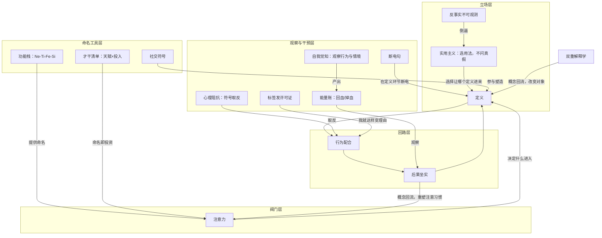

# 认识自己：ENTP 与天赋挖掘（01-06 全课题）

## 一句话主旨

标签是语言，命名反身塑造人，总阀门是注意力。

## 作者试图回答的问题

- 主问题：ENTP 和天赋挖掘背后指什么？这些标签为什么感觉那么准，又不能拿来算命？
- 子问题：命名如何反向改造人（反身性）？"算得准"是既定事实还是因果链？怎么把这套机制用回自己身上？

## 三级论证骨架

### 一、标签是一套语言，尺子有三道缝（01-02）

#### 1.1 ENTP = 荣格功能-态度体系经 MBTI 改造成的四格栈

- ENTP 功能栈：Ne 主导（抓模式与可能性）、Ti 辅助（内部逻辑检验）、Fe 第三（感知氛围、接住人）、Si 劣势（细节、例行、身体信号）。
  - 荣格《心理类型》（1921）：能量方向（I/E）+ 四种功能（T/F/S/N），每项功能挂态度得 8 种功能-态度；Briggs 母女加 J/P，规定 16 型功能栈。
  - 四张底牌对位：破限猎手 ≈ Ne，结构解说 ≈ Ti，被看见的给予者 ≈ Fe，最贵的能量开销 ≈ Si 劣势。
  - 边界：功能栈是解释框架，格与格之间是倾向的强弱，没有神经科学背书。
- E + P 决定 Ne 上位：字母组合和功能栈是同一件事的两种写法。

#### 1.2 量表测的是自评偏好，声称的是天生稳定的类型

- 四个字母是四组二分，在谱中间切一刀；"E 51 分"和"I 49 分"只差 2 分。
- 量表回答不了"你能做多好"。

#### 1.3 尺子的三道缝 + 巴纳姆效应

- 缝一：连续被切成二分；缝二：四字母重测全同仅约 35%-50%（间隔 5 周到 9 个月），"至少三个字母一致"约 75%；缝三：功能栈因子分析复现不佳。
  - 与大五对照：E/I ↔ 外向性、S/N ↔ 开放性、T/F ↔ 宜人性（部分）、J/P ↔ 尽责性；神经质无对应——16personalities 的 A/T（ENTP-A / ENTP-T）补的就是这个洞。
  - 巴纳姆效应（Forer 1948：同一段模糊描述，平均 4.26/5 人人喊准）+ 确认偏差，解释"感觉准"。

#### 1.4 标签的两层用法与社交符号

- 测量层：够粗、重测不稳，不下判决；社交层：作为符号极其好用，负责接通。
  - 符号互动论（米德）：意义在互动中生成；"当入场券，不当判决书"。

### 二、天赋挖掘：原料清单与命名即投资（03）

#### 2.1 盖洛普主干

- 34 项才干 × 四大领域（执行力、影响力、关系建立、战略思维）；天赋 × 投入 = 优势；才干是原料清单。
  - 与 MBTI 的差别：类型 vs 主题排序；177 对迫选题；信效度比 MBTI 好一档，跨文化排序基准会漂。

#### 2.2 四张底牌对账：盖洛普接得住 70%

- Input + Strategic（破限猎手，最干净）、Empathy + Individualization（动机透视，弗洛伊德挂件无对应项）、Analytical（结构解说，半对）、Developer + Relator（给予者，对得上）。
  - 装不下的 30%：能量账（复述掉血、重构充电）、自噬 bug——超出"倾向"的范畴，属于标签反向塑造你的机制。

#### 2.3 三条值得追的研究线（2025-2026）

- 自证预言新实验：PNAS 2026 社会信息放大疼痛与费力感；元刻板印象综述。
- LLM 人格测量：PsychAdapter、零样本大五评分、Personality Without Persons? 批评线、GenPT。
- AI 评测圈重演"当镜子照还是当判决书用"。

### 三、反身性：六件工具焊成一条闭环（04）

#### 3.1 闭环：定义 → 行为配合 → 标签内化 → 分类被改造 → 概念回流再定义

- 托马斯定理（1928）→ 默顿自证预言（1948，银行挤兑五步回路）→ 皮格马利翁（罗森塔尔 1968，"他证预言"的实验版，复制有争议、效应量不大）→ 标签理论（贝克尔 1963，标签改变身份）→ 哈金回环（1995，interactive kinds，making up people）→ 吉登斯双重解释学（1984 / 1991，概念回流改变对象）。
  - "没法解释"是结构性的：解释永远追不上对象，敬畏放在回路上。

#### 3.2 两份文件是回路的活样本

- 致命 bug = 教科书级默顿自证预言（高二"根本不太可能"：定义 → 不去试 → 真没比过 → 坐实 → 更不试）；出口：预言可以自败，觉察即反制，断电句。
  - ENTP 标签两股力：松绑（卸自责）vs 发许可证（"我就这样"变成理由）；镜子里的你也会动。
  - "你自己就是别人深夜焦虑的源头"——他证预言双向运转，你既是接收端也是发射端。
  - 天赋挖掘 = 盖洛普把命名做成了产品（哈金回环第一圈）。

#### 3.3 操作杆

- 只贴"带动作"的标签；给"定义"环节装断电句；敬畏放在回路上。

### 四、分不清也不必分清：实用主义出口（05）

#### 4.1 既定事实 vs 因果链

- 单样本：反事实不可观测，原则上分不清；群体层面：随机对照可以分开测，社会信息有可测的独立因果力（效应量不大，但存在）。
  - "准"拆三股力：冷读 / 热读、确认偏差、反身性，三股都真实，可以合流。

#### 4.2 逆反是回路的负号

- 心理阻抗（Brehm 1966，标签威胁自由，反向加码保卫）+ 自败预言；"你越说我越不这样"没有跳出回路，只是把符号取反。
  - 出路：怎么好怎么用——不问真假、反不反，只问它把你往哪边绕。

#### 4.3 三个查证概念

- 詹姆斯注意章原文；比姆自我知觉（1967，观察"行为 + 情境"，比元认知多一个注意力投入维度）；哈金回环与 Agent 自我迭代同构。

### 五、注意力是总阀门（06）

#### 5.1 注意力 2W2H

- What：詹姆斯三条原文 + 比姆自我觉知 + 注意 ≠ 时间（燃料有上限，难的是投入的上限）。
- Why：回路第一个阀门、心智的双向供料器、所有天赋的兑现率。
- How：拉回来（詹姆斯唯一练法，练的是品格与意志的根）、注意力建账三账户（回血 / 消耗 / 空转）、断电句、千金难买一乐意（注意力跟乐意走，不跟讨好走）。
- How good：再投资率、能量净额、拉回次数、两条体检线（睡眠 7 小时以上、内耗早期信号）。

#### 5.2 收束

- 注意力决定什么进入定义，定义启动回路，回路塑造人。要握住的是第一个阀门。

## 作者边界、反例与不确定性

- 功能栈是解释框架，没有神经科学背书；因子分析未干净复现 8 种功能-态度。
- 四字母重测只有约一半保持全同；皮格马利翁复制有争议、效应量不大。
- 单样本分不清既定事实与因果链（反事实不可观测）；群体结论不决定个体命运。
- 盖洛普装不下能量账与自噬 bug（约 30%）。
- 逆反跳不出回路；标签躲不掉，命名必然反身。
- "没法解释"的解释：双重解释学，结构性，不交给神秘学，也不按证实 / 证伪处理。
- 玄学类描述的用法边界：当"执念或语言"处理，只留往变好方向绕的部分。

---

# 概念解析辞典

> 针对《认识自己：ENTP 与天赋挖掘》（01-06 全课题合集）的概念提取

## 一、核心概念

### 1. 功能栈（认知功能 Ne-Ti-Fe-Si）

- **context**：

  > ENTP 的功能栈是：**Ne（主导）→ Ti（辅助）→ Fe（第三）→ Si（劣势）**。

  > 功能栈是一个**解释框架**，它能把亲历行为组织成可讲的模型；格与格之间不是开关，而是倾向的强弱。它没有神经科学的测量背书。

- **费曼一下**：功能栈是 MBTI 把荣格的 8 种"功能-态度"按"主导 → 辅助 → 第三 → 劣势"排成的四格序列，用来说一种类型内部的思维分工。ENTP 的版本：Ne 从外部抓可能性，Ti 在内部检验逻辑，Fe 感知氛围、拆完还顾着接住人，Si 管细节例行却最弱。它像一面镜子：帮你组织亲历行为，不负责测量准不准。

### 2. 社交符号（符号互动论）

- **context**：

  > 当 ENTP 变成圈子里流通的社交符号，它的作用就不再只是描述你，而是让你和别人能互相接住对方的话。

  > 符号的职责是接通，不是测准。

- **费曼一下**：标签在人群中主要当语言用——让人几分钟内互相定位、对上话，接通不要求准。这解释了为什么测量粗糙的 MBTI 社交层却"好用到爆"；"社交玩具，图一乐"是这个概念的民间版。

### 3. 巴纳姆效应

- **context**：

  > 1948 年心理学家 Forer 给一批学生发"个人专属人格分析"，平均评分 4.26/5（满分 5），人人喊准。实际上每个人拿到的都是同一段话。

- **费曼一下**：模糊而人人适用的话会被当成"说的就是我"。它和确认偏差（记住说中的、忘掉没中的）合起来解释人格测验的手感"准"；算命"说得都对"也吃这三股力。

### 4. 天赋 × 投入 = 优势（盖洛普）

- **context**：

  > 天赋（talent）：自然而然反复出现的思维 / 情感 / 行为模式——你还没用力，它已经在那；投入（investment）：时间、练习、技能、知识——把原料加工成产品；优势（strength）：接近完美、可持续产出结果的稳定表现。

  > 34 项才干是原料清单，不是能力证书。

- **费曼一下**：盖洛普把人的起点叫天赋（原料），把时间练习叫投入（加工），把稳定产出叫优势（产品）。才干要命名、喂养、投资才变成优势——这就是"命名即投资"：名字一旦立起来，你就开始注意它。

### 5. 反身性（哈金回环效应，Looping Effect）

- **context**：

  > 分类 → 人们照着分类调整 → 分类被修改 → 再分类。哈金管这叫 making up people（把人做出来）。

- **费曼一下**：人不是石头——被分类者会回应分类，回应又迫使分类修订，循环往复。它是全课题的主轴：标签会反向塑造被贴标签的人，"把一种感觉描述出来，它能更好地帮助你实现自我改造"。

### 6. 双重解释学

- **context**：

  > 自然科学的概念不会改变研究对象——原子不看论文；社会科学的概念会渗回人群，改变它描述的对象。所以这类东西永远没法被"解释干净"：你每解释一次，它就动一下。

- **费曼一下**：社会概念会回流进社会、被大众消化，改变它本来描述的对象，于是解释永远追不上对象。这是"很多东西没法解释"的结构性原因，也是敬畏应该安放的位置——放在回路上，不用交给神秘学。

### 7. 他证预言（皮格马利翁效应）

- **context**：

  > 自证预言是"预言在我脑里，行为也在我身上"；他证预言是"预言在别人脑里，行为在我身上"。

  > 预言住在老师脑里，实现发生在学生身上。

- **费曼一下**：别人对你的预期，通过他们的对待方式改变你的行为，让预期成真（罗森塔尔 1968 是实验版，元刻板印象是它的变体）。它双向运转：你既是被贴标签的人，也是给别人贴标签的人——"你自己就是别人深夜焦虑的源头"。

### 8. 心理阻抗（逆反）

- **context**：

  > 当自由被威胁——一个标签试图把你钉死——人会反向加码保卫自由。

  > 逆反没有跳出回路，它只是把回路的符号取反。

- **费曼一下**：被贴标签后"偏不按它走"，看似反抗，路线仍由那个标签定义，只是加了个负号。它和"对认可既渴望又拒斥"是同一台机器的两极。出口是实用主义：不问反不反，只问它把你往哪边绕。

### 9. 反事实不可观测

- **context**：

  > 你需要一个对照版的自己——一个听了算命的你和一个没听的你，在完全相同的处境里各走一遍。这个对照版不存在，学术上叫"反事实不可观测"。

- **费曼一下**：单个样本没法做对照实验，所以"听了之后照做"和"不听也那样"分不清。这是"既定事实 vs 因果链"难题的第一层答案：在你自己这一个样本上，这个问题原则上没有解。

### 10. 实用主义（选用法）

- **context**：

  > 判断一个信念的标准，是它带来的行动结果。

  > 剩下的合理动作就是选用法：让描述往"变好"的方向绕。

- **费曼一下**：既然真假分不清、群体结论又不决定个体命运，就不问真假，只问用法。算命、玄学类的描述一律按"执念或语言"处理，只留让人往挖掘天赋、变好方向绕的那部分。

### 11. 注意力（詹姆斯）

- **context**：

  > "My experience is what I agree to attend to."——我的经验就是我所同意注意的东西。

  > 把游走的注意力一次次自愿拉回来的能力，是判断力、品格与意志的根。

- **费曼一下**：注意力是经验的守门人——你注意什么，什么才进入你的世界并塑造你的心智。它是反身性回路的第一个阀门：什么进入"定义"，由注意力决定。注意 ≠ 时间，它是有上限的燃料。

### 12. 自我觉知（比姆自我知觉理论）

- **context**：

  > 观察对象是"行为 + 情境"——我做了什么、在什么处境下做的，据此推断自己的态度、情绪和内在状态。它和元认知差一个维度：元认知盯着念头，自我觉知盯着行为者本人。

- **费曼一下**：像观察别人一样观察自己的行为和处境，据此推断自己是谁。它比元认知多一个"注意力投向自己这个行为者"的维度。能量账（记做什么回血、做什么掉血，再推出引擎定律）就是它的实操版。

### 13. 能量账

- **context**：

  > 输出自己的东西 = 充电；复述别人的东西 = 掉血。

  > 盖洛普测的是倾向，测不了"复述掉血、重构充电"这种能量账——这条恰恰是《说明书》里最有原创性的部分。

- **费曼一下**：以"做完回血还是掉血"给活动分类的自我观察工具，据此识别自己的引擎。它是盖洛普装不下的 30% 里最有操作性的部分，已从底牌三拆出、独立成条。

### 14. 断电句

- **context**：

  > "我的预测引擎又在拿旧存档预测我自己了"——它的作用是把注意力从旧存档上拉开，在"定义"环节断电。

- **费曼一下**：反制自证预言的操作工具：在回路最靠前的"定义"环节喊停。觉察即反制——预言可以自败，认出 bug 的动作本身就是断电。

### 15. 发许可证（标签的两股力之一）

- **context**：

  > "ENTP 容易三分钟热度"这个标签，正方向：卸掉"我没长性"的自责（回路帮你松绑）；反方向：给跳坑发许可证（"我就这样"变成行为的理由）。

- **费曼一下**：标签除了"松绑"（卸自责），还有第二个方向——把"我就这样"变成行为理由。同一个标签两股力同时存在，所以贴标签时要先写下来它正在往哪边拉你，盯紧"发许可证"的时刻。

## 二、概念架构图

